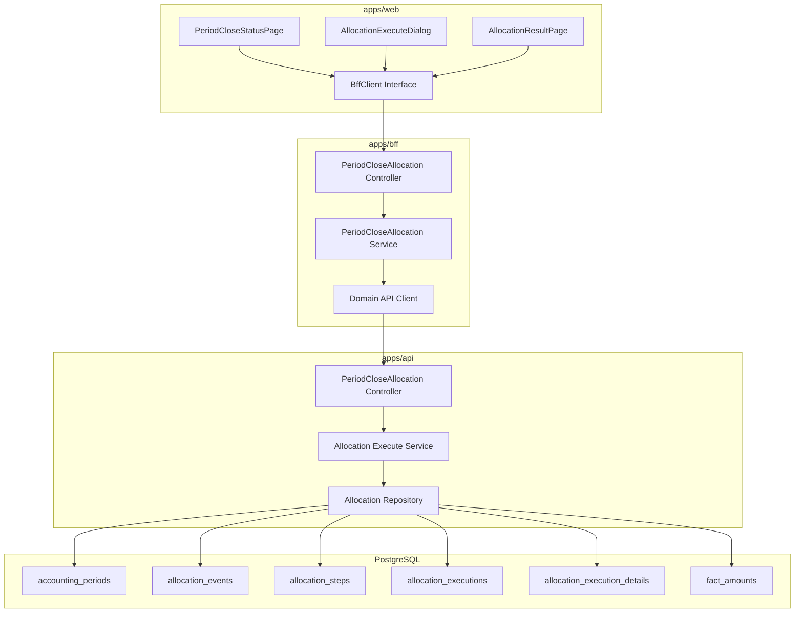
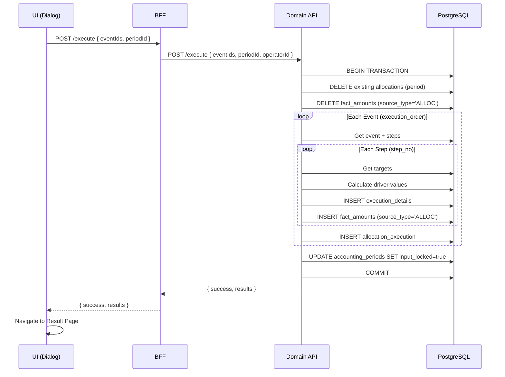
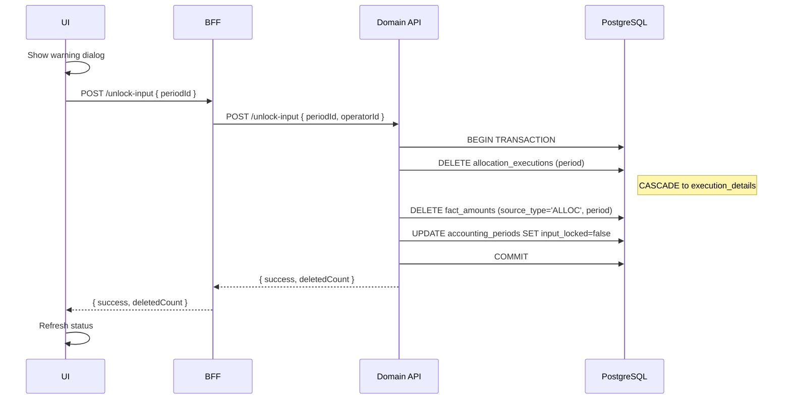

# Design Document: admin/period-close-allocation

---

**Purpose**: 月次締処理・配賦処理統合機能の技術設計。配賦実行と入力ロック連動、配賦結果VIEW機能を含む。

---

## Spec Reference（INPUT情報）

本設計を作成するにあたり、以下の情報を確認した：

### 仕様概要（確定済み仕様）
- **参照ファイル**: `.kiro/specs/仕様概要/月次締処理_配賦処理_統合仕様.md`
- **設計に影響する仕様ポイント**:
  - close_status（締めステータス）と input_locked（入力ロック）の2軸制御
  - 配賦実行時に自動で input_locked = true
  - 配賦イベントは execution_order 順に実行
  - AG Grid Tree Data + Excel Export で配賦結果を表示

### 既存締め処理設計
- **参照ファイル**: `.kiro/specs/admin/period-close-status/design.md`
- **設計に影響するポイント**: 本設計は period-close-status を拡張。既存エンドポイントは維持。

### エンティティ定義（Data Model 正本）
- **参照ファイル**: `.kiro/specs/entities/01_各種マスタ.md`
- **対象エンティティ**:
  - accounting_periods（セクション2.1）：input_locked カラム追加
  - allocation_events（セクション13.1）：execution_order カラム追加
  - allocation_executions（セクション13.5）：新規
  - allocation_execution_details（セクション13.6）：新規

### 配賦マスタ設計
- **参照ファイル**: `.kiro/specs/master-data/allocation-master/design.md`
- **設計に影響するポイント**: 配賦イベント/ステップ/ターゲット/ドライバの構造に準拠

---

## INPUT整合性チェック

| チェック項目 | 確認結果 |
|-------------|---------|
| 仕様概要との整合性 | 設計が仕様概要と矛盾しない: ✅ |
| エンティティとの整合性 | Data Model がエンティティ定義に準拠: ✅ |
| 既存設計との互換性 | period-close-status との互換性を確保: ✅ |
| 配賦マスタとの整合性 | 配賦マスタ構造に準拠: ✅ |

---

## Overview

月次締処理・配賦処理統合機能は、以下を提供する：

1. **入力ロック機能**: accounting_periods.input_locked による細かな入力制御
2. **配賦処理実行**: 月次締め画面から配賦処理を起動し、fact_amounts に結果を反映
3. **配賦結果VIEW**: AG Grid Tree Data による階層的な配賦結果表示とExcel出力
4. **入力ロック解除**: 権限者による入力ロック解除（警告表示付き）

既存の period-close-status 機能を拡張し、配賦処理との連携を追加する。

---

## Architecture

### Architecture Pattern & Boundary Map

**Pattern (fixed)**:
- UI（apps/web） → BFF（apps/bff） → Domain API（apps/api） → DB（PostgreSQL + RLS）
- UI直APIは禁止

**Contracts (SSoT)**:
- UI ↔ BFF: `packages/contracts/src/bff/period-close-allocation`
- BFF ↔ Domain API: `packages/contracts/src/api/period-close-allocation`
- Enum/Error: `packages/contracts/src/bff/period-close-allocation`
- UI は `packages/contracts/src/api` を参照してはならない



---

## Architecture Responsibilities（Mandatory）

### BFF Specification（apps/bff）

**Purpose**
- 配賦実行・結果取得のUI最適化API
- 配賦イベント一覧取得（execution_order順）
- 配賦結果の階層変換（ツリー表示用）

**BFF Endpoints（UIが叩く）**

| Method | Endpoint | Purpose | Request DTO | Response DTO | Notes |
|--------|----------|---------|-------------|--------------|-------|
| GET | `/api/bff/admin/period-close-allocation/events` | 配賦イベント一覧 | companyId, scenarioType (query) | BffAllocationEventListResponse | execution_order順 |
| POST | `/api/bff/admin/period-close-allocation/execute` | 配賦処理実行 | BffAllocationExecuteRequest | BffAllocationExecuteResponse | 配賦実行 + input_locked設定 |
| GET | `/api/bff/admin/period-close-allocation/results` | 配賦結果取得 | companyId, accountingPeriodId (query) | BffAllocationResultResponse | ツリー形式 |
| POST | `/api/bff/admin/period-close-allocation/unlock-input` | 入力ロック解除 | BffUnlockInputRequest | BffUnlockInputResponse | 権限者のみ |
| DELETE | `/api/bff/admin/period-close-allocation/results` | 配賦結果削除 | companyId, accountingPeriodId (query) | BffDeleteResultResponse | ロック解除と同時 |

**Naming Convention（必須）**
- DTO / Contracts: camelCase（例: `accountingPeriodId`, `executionOrder`, `allocatedAmount`）
- DB columns: snake_case（例: `accounting_period_id`, `execution_order`, `allocated_amount`）

**Paging / Sorting Normalization（必須・BFF責務）**
- 配賦イベント一覧: execution_order 昇順固定
- 配賦結果: 階層構造のため、イベント→ステップ→明細の順で固定

**Transformation Rules（api DTO → bff DTO）**

| API Response Field | BFF Response Field | Transformation |
|--------------------|-------------------|----------------|
| allocationExecution.id | executionId | rename |
| allocationEvent.id | eventId | pass-through |
| allocationEvent.eventName | eventName | pass-through |
| allocationSteps[] | steps[] | 階層構造に変換 |
| executionDetails[] | details[] | ステップごとにグループ化 |
| - | orgHierarchy | BFF で階層パスを生成 |

**Error Policy（必須）**

- 採用方針：**Option A: Pass-through**
- 採用理由：配賦処理エラーはドメイン固有のため、Domain API のエラーメッセージをそのまま使用

---

### Domain API Specification（apps/api）

**Purpose**
- 配賦処理のビジネスロジック実行
- トランザクション管理（配賦実行は1トランザクション）
- fact_amounts への結果反映

**Domain API Endpoints**

| Method | Endpoint | Purpose | Request DTO | Response DTO | Notes |
|--------|----------|---------|-------------|--------------|-------|
| GET | `/api/admin/period-close-allocation/events` | 配賦イベント一覧 | ApiListAllocationEventsRequest | ApiListAllocationEventsResponse | |
| POST | `/api/admin/period-close-allocation/execute` | 配賦処理実行 | ApiAllocationExecuteRequest | ApiAllocationExecuteResponse | |
| GET | `/api/admin/period-close-allocation/results` | 配賦結果取得 | ApiGetAllocationResultRequest | ApiGetAllocationResultResponse | |
| POST | `/api/admin/period-close-allocation/unlock-input` | 入力ロック解除 | ApiUnlockInputRequest | ApiUnlockInputResponse | |
| DELETE | `/api/admin/period-close-allocation/results` | 配賦結果削除 | ApiDeleteResultRequest | ApiDeleteResultResponse | |

---

## Data Model

### Existing Tables（拡張）

#### accounting_periods（拡張）

```prisma
model accounting_periods {
  // ... existing fields ...
  input_locked       Boolean   @default(false)
  input_locked_at    DateTime?
  input_locked_by    String?   @db.Uuid
}
```

#### allocation_events（拡張）

```prisma
model allocation_events {
  // ... existing fields ...
  execution_order    Int       @default(0)
}
```

### New Tables

#### allocation_executions

```prisma
model allocation_executions {
  id                     String   @id @default(uuid()) @db.Uuid
  tenant_id              String   @db.Uuid
  company_id             String   @db.Uuid
  event_id               String   @db.Uuid
  accounting_period_id   String   @db.Uuid
  org_version_id         String   @db.Uuid
  executed_at            DateTime
  executed_by            String   @db.Uuid
  status                 String   @db.VarChar(20)  // RUNNING/SUCCESS/FAILED
  error_message          String?
  summary_json           Json?
  created_at             DateTime @default(now())

  // Relations
  company                companies @relation(fields: [tenant_id, company_id], references: [tenant_id, id])
  event                  allocation_events @relation(fields: [tenant_id, company_id, event_id], references: [tenant_id, company_id, id])
  accounting_period      accounting_periods @relation(fields: [tenant_id, company_id, accounting_period_id], references: [tenant_id, company_id, id])
  details                allocation_execution_details[]

  @@unique([tenant_id, company_id, event_id, accounting_period_id])
  @@index([tenant_id, company_id, accounting_period_id])
}
```

#### allocation_execution_details

```prisma
model allocation_execution_details {
  id                        String   @id @default(uuid()) @db.Uuid
  tenant_id                 String   @db.Uuid
  company_id                String   @db.Uuid
  execution_id              String   @db.Uuid
  step_id                   String   @db.Uuid
  step_no                   Int
  from_department_stable_id String   @db.Uuid
  from_subject_id           String   @db.Uuid
  source_amount             Decimal  @db.Decimal(18, 2)
  to_department_stable_id   String?  @db.Uuid
  to_dimension_value_id     String?  @db.Uuid
  to_subject_id             String   @db.Uuid
  driver_type               String   @db.VarChar(30)
  driver_value              Decimal? @db.Decimal(18, 6)
  ratio                     Decimal  @db.Decimal(8, 6)
  allocated_amount          Decimal  @db.Decimal(18, 2)
  created_at                DateTime @default(now())

  // Relations
  execution                 allocation_executions @relation(fields: [tenant_id, company_id, execution_id], references: [tenant_id, company_id, id], onDelete: Cascade)
  step                      allocation_steps @relation(fields: [tenant_id, company_id, step_id], references: [tenant_id, company_id, id])

  @@index([tenant_id, company_id, execution_id])
  @@index([tenant_id, company_id, step_id])
}
```

---

## BFF Contracts

### packages/contracts/src/bff/period-close-allocation/index.ts

```typescript
// === Request DTOs ===

export interface BffAllocationExecuteRequest {
  companyId: string;
  accountingPeriodId: string;
  eventIds: string[];  // execution_order順で渡される
}

export interface BffUnlockInputRequest {
  accountingPeriodId: string;
}

// === Response DTOs ===

export interface BffAllocationEventListResponse {
  events: BffAllocationEvent[];
}

export interface BffAllocationEvent {
  id: string;
  eventCode: string;
  eventName: string;
  scenarioType: 'ACTUAL' | 'BUDGET' | 'FORECAST';
  executionOrder: number;
  stepCount: number;
  isActive: boolean;
}

export interface BffAllocationExecuteResponse {
  success: boolean;
  executionId?: string;
  results: BffAllocationEventResult[];
  errorMessage?: string;
}

export interface BffAllocationEventResult {
  eventId: string;
  eventName: string;
  status: 'SUCCESS' | 'FAILED';
  stepCount: number;
  detailCount: number;
  totalAllocatedAmount: number;
  errorMessage?: string;
}

export interface BffAllocationResultResponse {
  companyId: string;
  accountingPeriodId: string;
  periodLabel: string;
  executions: BffAllocationExecution[];
}

export interface BffAllocationExecution {
  executionId: string;
  eventId: string;
  eventName: string;
  executedAt: string;  // ISO8601
  executedBy: string;  // 表示名
  status: 'SUCCESS' | 'FAILED';
  steps: BffAllocationStepResult[];
}

export interface BffAllocationStepResult {
  stepId: string;
  stepNo: number;
  stepName: string;
  fromSubjectCode: string;
  fromSubjectName: string;
  fromDepartmentCode: string;
  fromDepartmentName: string;
  sourceAmount: number;
  details: BffAllocationDetail[];
}

export interface BffAllocationDetail {
  detailId: string;
  targetType: 'DEPARTMENT' | 'DIMENSION_VALUE';
  targetCode: string;
  targetName: string;
  toSubjectCode: string;
  toSubjectName: string;
  driverType: string;
  driverValue: number | null;
  ratio: number;
  allocatedAmount: number;
}

// AG Grid Tree Data 用のフラット化構造
export interface BffAllocationTreeNode {
  id: string;
  orgHierarchy: string[];  // ['イベント名', 'ステップ名', '配賦先']
  nodeType: 'EVENT' | 'STEP' | 'DETAIL';
  eventName?: string;
  stepName?: string;
  fromSubject?: string;
  fromDepartment?: string;
  targetName?: string;
  driverType?: string;
  ratio?: number;
  amount?: number;
}

export interface BffUnlockInputResponse {
  success: boolean;
  newInputLocked: boolean;
  deletedExecutionCount: number;
  errorMessage?: string;
}

// === Error Codes ===

export const PeriodCloseAllocationErrorCode = {
  PERIOD_NOT_FOUND: 'PERIOD_NOT_FOUND',
  PERIOD_ALREADY_CLOSED: 'PERIOD_ALREADY_CLOSED',
  NO_EVENTS_SELECTED: 'NO_EVENTS_SELECTED',
  EVENT_NOT_FOUND: 'EVENT_NOT_FOUND',
  ALLOCATION_FAILED: 'ALLOCATION_FAILED',
  INSUFFICIENT_PERMISSION: 'INSUFFICIENT_PERMISSION',
  INPUT_NOT_LOCKED: 'INPUT_NOT_LOCKED',
} as const;

export type PeriodCloseAllocationErrorCode =
  typeof PeriodCloseAllocationErrorCode[keyof typeof PeriodCloseAllocationErrorCode];
```

---

## API Contracts

### packages/contracts/src/api/period-close-allocation/index.ts

```typescript
// === Request DTOs ===

export interface ApiListAllocationEventsRequest {
  tenantId: string;
  companyId: string;
  scenarioType?: 'ACTUAL' | 'BUDGET' | 'FORECAST';
}

export interface ApiAllocationExecuteRequest {
  tenantId: string;
  companyId: string;
  accountingPeriodId: string;
  eventIds: string[];
  operatorId: string;
}

export interface ApiGetAllocationResultRequest {
  tenantId: string;
  companyId: string;
  accountingPeriodId: string;
}

export interface ApiUnlockInputRequest {
  tenantId: string;
  companyId: string;
  accountingPeriodId: string;
  operatorId: string;
}

export interface ApiDeleteResultRequest {
  tenantId: string;
  companyId: string;
  accountingPeriodId: string;
}

// === Response DTOs ===

export interface ApiListAllocationEventsResponse {
  events: ApiAllocationEventDto[];
}

export interface ApiAllocationEventDto {
  id: string;
  eventCode: string;
  eventName: string;
  scenarioType: string;
  executionOrder: number;
  isActive: boolean;
  stepCount: number;
}

export interface ApiAllocationExecuteResponse {
  success: boolean;
  results: ApiAllocationEventResultDto[];
  errorMessage?: string;
}

export interface ApiAllocationEventResultDto {
  eventId: string;
  executionId: string;
  status: 'SUCCESS' | 'FAILED';
  stepCount: number;
  detailCount: number;
  totalAllocatedAmount: string;  // Decimal as string
  errorMessage?: string;
}

export interface ApiGetAllocationResultResponse {
  executions: ApiAllocationExecutionDto[];
}

export interface ApiAllocationExecutionDto {
  id: string;
  eventId: string;
  executedAt: string;
  executedBy: string;
  status: string;
  summary: {
    stepCount: number;
    detailCount: number;
    totalAllocatedAmount: string;
  };
  steps: ApiAllocationStepResultDto[];
}

export interface ApiAllocationStepResultDto {
  stepId: string;
  stepNo: number;
  stepName: string;
  fromDepartmentStableId: string;
  fromSubjectId: string;
  sourceAmount: string;
  details: ApiAllocationDetailDto[];
}

export interface ApiAllocationDetailDto {
  id: string;
  toDepartmentStableId: string | null;
  toDimensionValueId: string | null;
  toSubjectId: string;
  driverType: string;
  driverValue: string | null;
  ratio: string;
  allocatedAmount: string;
}

export interface ApiUnlockInputResponse {
  success: boolean;
  newInputLocked: boolean;
  deletedExecutionCount: number;
}
```

---

## Service Logic

### AllocationExecuteService（Domain API）

```typescript
class AllocationExecuteService {
  /**
   * 配賦処理実行
   * 1. 対象期間の既存配賦結果を削除
   * 2. イベントを execution_order 順に実行
   * 3. ステップを step_no 順に実行
   * 4. 配賦比率を計算して fact_amounts に反映
   * 5. execution / details を保存
   * 6. input_locked = true に更新
   */
  async executeAllocation(request: ApiAllocationExecuteRequest): Promise<ApiAllocationExecuteResponse> {
    return this.prisma.$transaction(async (tx) => {
      // 1. 既存配賦結果の削除
      await this.deleteExistingAllocations(tx, request);

      // 2-5. イベント実行
      const results: ApiAllocationEventResultDto[] = [];
      for (const eventId of request.eventIds) {
        const result = await this.executeEvent(tx, request, eventId);
        results.push(result);
      }

      // 6. input_locked 更新
      await tx.accounting_periods.update({
        where: {
          tenant_id_company_id_id: {
            tenant_id: request.tenantId,
            company_id: request.companyId,
            id: request.accountingPeriodId,
          },
        },
        data: {
          input_locked: true,
          input_locked_at: new Date(),
          input_locked_by: request.operatorId,
        },
      });

      return { success: true, results };
    });
  }

  /**
   * 単一イベントの配賦実行
   */
  private async executeEvent(
    tx: PrismaClient,
    request: ApiAllocationExecuteRequest,
    eventId: string
  ): Promise<ApiAllocationEventResultDto> {
    // 1. イベント・ステップ取得
    const event = await tx.allocation_events.findUnique({
      where: { tenant_id_company_id_id: { ... } },
      include: { steps: { orderBy: { step_no: 'asc' } } },
    });

    // 2. 各ステップ実行
    const details: AllocationDetail[] = [];
    for (const step of event.steps) {
      const stepDetails = await this.executeStep(tx, request, step);
      details.push(...stepDetails);
    }

    // 3. execution レコード作成
    const execution = await tx.allocation_executions.create({
      data: {
        tenant_id: request.tenantId,
        company_id: request.companyId,
        event_id: eventId,
        accounting_period_id: request.accountingPeriodId,
        org_version_id: currentOrgVersionId,
        executed_at: new Date(),
        executed_by: request.operatorId,
        status: 'SUCCESS',
        summary_json: { stepCount, detailCount, totalAmount },
      },
    });

    // 4. details 保存
    await tx.allocation_execution_details.createMany({ data: details });

    // 5. fact_amounts への反映
    await this.reflectToFactAmounts(tx, details);

    return { eventId, executionId: execution.id, status: 'SUCCESS', ... };
  }

  /**
   * ドライバタイプ別の比率計算
   */
  private async calculateRatios(
    tx: PrismaClient,
    step: AllocationStep,
    targets: AllocationStepTarget[]
  ): Promise<Map<string, number>> {
    switch (step.driver_type) {
      case 'FIXED':
        return this.calculateFixedRatios(targets);
      case 'HEADCOUNT':
        return this.calculateHeadcountRatios(tx, targets);
      case 'SUBJECT_AMOUNT':
        return this.calculateSubjectAmountRatios(tx, step, targets);
      case 'KPI':
        return this.calculateKpiRatios(tx, step, targets);
      default:
        throw new Error(`Unknown driver type: ${step.driver_type}`);
    }
  }
}
```

---

## UI Components

### AG Grid Tree Data Configuration

```typescript
// apps/web/src/features/admin/period-close-allocation/components/AllocationResultGrid.tsx

import { AgGridReact } from 'ag-grid-react';
import 'ag-grid-enterprise';

const AllocationResultGrid: React.FC<Props> = ({ data }) => {
  const columnDefs = useMemo(() => [
    {
      field: 'hierarchy',
      headerName: '配賦内容',
      cellRenderer: 'agGroupCellRenderer',
      showRowGroup: true,
      minWidth: 300,
    },
    { field: 'fromSubject', headerName: '配賦元科目', minWidth: 150 },
    { field: 'fromDepartment', headerName: '配賦元部門', minWidth: 120 },
    { field: 'targetName', headerName: '配賦先', minWidth: 150 },
    { field: 'driverType', headerName: 'ドライバ', minWidth: 100 },
    {
      field: 'ratio',
      headerName: '比率',
      valueFormatter: (params) => params.value ? `${(params.value * 100).toFixed(2)}%` : '',
      minWidth: 80,
    },
    {
      field: 'amount',
      headerName: '金額',
      valueFormatter: (params) => params.value?.toLocaleString() ?? '',
      cellClass: 'text-right',
      minWidth: 120,
    },
  ], []);

  const autoGroupColumnDef = useMemo(() => ({
    headerName: '配賦内容',
    minWidth: 300,
    cellRendererParams: {
      suppressCount: true,
    },
  }), []);

  const getDataPath = useCallback((data: BffAllocationTreeNode) => data.orgHierarchy, []);

  const defaultExcelExportParams = useMemo(() => ({
    fileName: `配賦結果_${companyName}_${periodLabel}.xlsx`,
    sheetName: '配賦結果',
  }), [companyName, periodLabel]);

  return (
    <AgGridReact
      treeData={true}
      getDataPath={getDataPath}
      columnDefs={columnDefs}
      autoGroupColumnDef={autoGroupColumnDef}
      rowData={data}
      defaultExcelExportParams={defaultExcelExportParams}
    />
  );
};
```

### Export Functions

```typescript
// Excel Export
const onExportExcel = useCallback(() => {
  gridRef.current?.api.exportDataAsExcel();
}, []);

// CSV Export
const onExportCsv = useCallback(() => {
  gridRef.current?.api.exportDataAsCsv({
    fileName: `配賦結果_${companyName}_${periodLabel}.csv`,
  });
}, [companyName, periodLabel]);
```

---

## Sequence Diagrams

### 配賦処理実行フロー



### 入力ロック解除フロー



---

## File Structure

```
apps/
├── api/src/modules/admin/period-close-allocation/
│   ├── period-close-allocation.module.ts
│   ├── period-close-allocation.controller.ts
│   ├── period-close-allocation.service.ts
│   ├── allocation-execute.service.ts
│   ├── period-close-allocation.repository.ts
│   └── dto/
│       ├── list-events.dto.ts
│       ├── execute-allocation.dto.ts
│       └── get-result.dto.ts
│
├── bff/src/modules/admin/period-close-allocation/
│   ├── period-close-allocation.module.ts
│   ├── period-close-allocation.controller.ts
│   ├── period-close-allocation.service.ts
│   └── mappers/
│       └── allocation-result.mapper.ts
│
└── web/src/features/admin/period-close-allocation/
    ├── api/
    │   ├── BffClient.ts
    │   ├── HttpBffClient.ts
    │   └── MockBffClient.ts
    ├── components/
    │   ├── AllocationExecuteDialog.tsx
    │   ├── AllocationResultPage.tsx
    │   ├── AllocationResultGrid.tsx
    │   └── UnlockInputDialog.tsx
    └── hooks/
        ├── useAllocationEvents.ts
        ├── useAllocationExecute.ts
        └── useAllocationResult.ts

packages/contracts/src/
├── api/period-close-allocation/
│   └── index.ts
└── bff/period-close-allocation/
    └── index.ts
```

---

## Phase Implementation

### Phase 1（本リリース）

1. **DB Migration**
   - accounting_periods: input_locked, input_locked_at, input_locked_by 追加
   - allocation_events: execution_order 追加
   - allocation_executions テーブル作成
   - allocation_execution_details テーブル作成

2. **Contracts**
   - packages/contracts/src/bff/period-close-allocation
   - packages/contracts/src/api/period-close-allocation

3. **Domain API**
   - 配賦イベント一覧取得
   - 配賦処理実行
   - 配賦結果取得
   - 入力ロック解除

4. **BFF**
   - エンドポイント実装
   - 配賦結果のツリー変換

5. **UI**
   - 月次締め画面への配賦ボタン追加
   - 配賦実行ダイアログ
   - 配賦結果VIEW画面（AG Grid Tree Data）
   - 入力ロック解除ダイアログ

### Phase 2（将来検討）

- 配賦シミュレーション（dryRun モード）
- 配賦結果のアーカイブ機能
- 部門単位の配賦進捗管理
- MEASURE ドライバの完全実装

---

## Change History

| Date | Change | Author |
|------|--------|--------|
| 2026-02-05 | Initial version | Claude Code |
