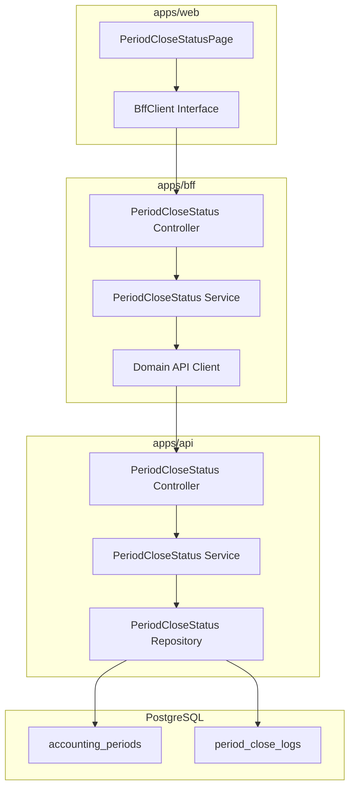
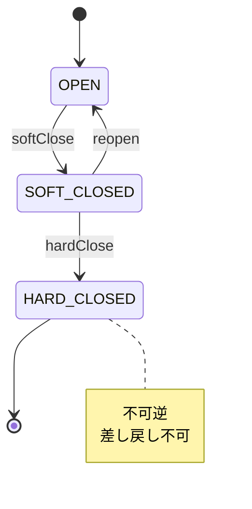
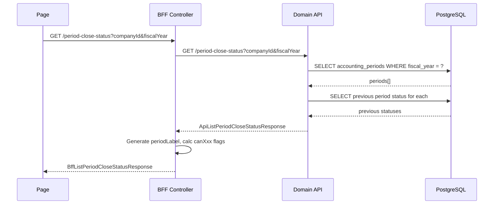
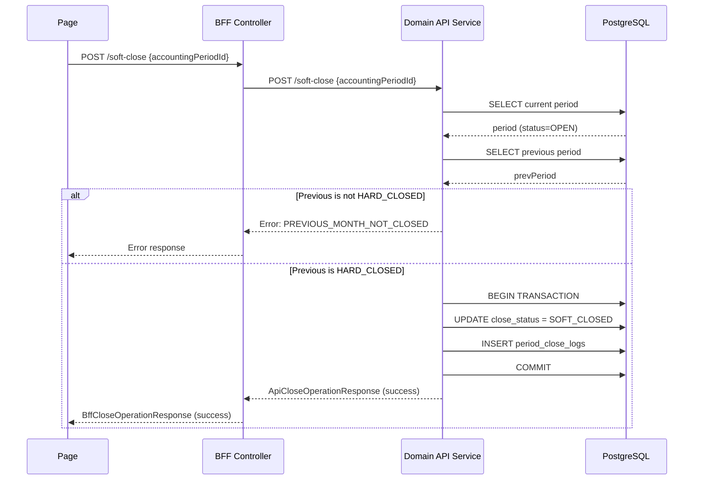

# Design Document: admin/period-close-status

---

**Purpose**: 月次締処理状況管理機能の技術設計。異なる実装者間で実装の一貫性を確保するために十分な詳細を提供する。

---

## Spec Reference（INPUT情報）

本設計を作成するにあたり、以下の情報を確認した：

### Requirements（直接INPUT）
- **参照ファイル**: `.kiro/specs/admin/period-close-status/requirements.md`
- **要件バージョン**: 2026-01-12

### 仕様概要（確定済み仕様）
- **参照ファイル**: `.kiro/specs/仕様概要/月次締処理状況管理.md`
- **設計に影響する仕様ポイント**:
  - 締めステータスは OPEN → SOFT_CLOSED → HARD_CLOSED の順で遷移
  - HARD_CLOSED は不可逆（差し戻し不可）
  - 仮締め実行時は前月 HARD_CLOSED チェックを実施

### エンティティ定義（Data Model 正本）
- **参照ファイル**: `.kiro/specs/entities/01_各種マスタ.md`
- **対象エンティティ**: accounting_periods（セクション2.1）, period_close_logs（セクション2.2）

### 仕様検討（経緯・背景）※参考
- **参照ファイル**: `.kiro/specs/仕様検討/20260112_月次締処理状況管理.md`
- **設計判断に影響した経緯**: QA壁打ちにより、締め処理フロー・権限設計・UI構成を検討し確定

---

## INPUT整合性チェック

| チェック項目 | 確認結果 |
|-------------|---------|
| requirements.md との整合性 | 設計が全要件をカバーしている: ✅ |
| 仕様概要との整合性 | 設計が仕様概要と矛盾しない: ✅ |
| エンティティとの整合性 | Data Model がエンティティ定義に準拠: ✅ |
| 仕様検討の背景理解 | 設計判断の背景を確認した: ✅ |

---

## Overview

月次締処理状況管理機能は、会計期間（accounting_periods）の締めステータス（OPEN/SOFT_CLOSED/HARD_CLOSED）を可視化し、仮締め・本締め・差し戻し操作を提供する。実績取込後の入力制御とデータ整合性を担保する管理者向け機能である。

本設計は、既存の accounting_periods エンティティに対する操作機能の追加であり、新規エンティティとして period_close_logs（監査ログ）を追加する。BFF Contracts は仕様概要で定義済みのため、これに準拠して BFF/Domain API を実装する。

Phase 1 では権限チェックは実装せず、会社選択も単一会社固定とする。

---

## Architecture

### Architecture Pattern & Boundary Map

**Pattern (fixed)**:
- UI（apps/web） → BFF（apps/bff） → Domain API（apps/api） → DB（PostgreSQL + RLS）
- UI直APIは禁止

**Contracts (SSoT)**:
- UI ↔ BFF: `packages/contracts/src/bff/period-close-status`
- BFF ↔ Domain API: `packages/contracts/src/api/period-close-status`（本設計で定義）
- Enum/Error: `packages/contracts/src/bff/period-close-status`（既存定義を使用）
- UI は `packages/contracts/src/api` を参照してはならない



---

## Architecture Responsibilities（Mandatory）

### BFF Specification（apps/bff）

**Purpose**
- UI要件に最適化した締め状況一覧API（Read Model / ViewModel）
- Domain APIのレスポンスを集約・変換（ビジネスルールの正本は持たない）

**BFF Endpoints（UIが叩く）**

| Method | Endpoint | Purpose | Request DTO | Response DTO | Notes |
|--------|----------|---------|-------------|--------------|-------|
| GET | `/api/bff/admin/period-close-status` | 締め状況一覧取得 | BffListPeriodCloseStatusRequest (query) | BffListPeriodCloseStatusResponse | companyId, fiscalYear 必須 |
| GET | `/api/bff/admin/period-close-status/fiscal-years` | 年度一覧取得 | companyId (query) | BffFiscalYearListResponse | ドロップダウン用 |
| POST | `/api/bff/admin/period-close-status/soft-close` | 仮締め実行 | BffSoftCloseRequest | BffCloseOperationResponse | 要件 2 |
| POST | `/api/bff/admin/period-close-status/hard-close` | 本締め実行 | BffHardCloseRequest | BffCloseOperationResponse | 要件 3 |
| POST | `/api/bff/admin/period-close-status/reopen` | 差し戻し実行 | BffReopenRequest | BffCloseOperationResponse | 要件 4 |
| POST | `/api/bff/admin/period-close-status/run-allocation` | 配賦処理実行 | BffRunAllocationRequest | BffRunAllocationResponse | 要件 7, dryRun=trueでプレビュー |

**Naming Convention（必須）**
- DTO / Contracts: camelCase（例: `accountingPeriodId`, `closeStatus`, `fiscalYear`）
- DB columns: snake_case（例: `accounting_period_id`, `close_status`, `fiscal_year`）
- `sortBy` は **DTO側キー**を採用する（本機能では sortBy 不使用）

**Paging / Sorting Normalization（必須・BFF責務）**
- 本機能は年度内12件固定のためページングなし
- ソートは periodNo 昇順固定（BFF/Domain API で保証）

**Transformation Rules（api DTO → bff DTO）**

| API Response Field | BFF Response Field | Transformation |
|--------------------|-------------------|----------------|
| accountingPeriod.id | accountingPeriodId | rename |
| accountingPeriod.periodNo | periodNo | pass-through |
| accountingPeriod.closeStatus | closeStatus | pass-through |
| accountingPeriod.closedAt | closedAt | ISO8601 string / null |
| operatedBy (user_id) | operatedBy | user_id → 表示名に変換（BFF責務） |
| - | periodLabel | BFF で生成（例: "4月"） |
| - | canSoftClose / canHardClose / canReopen | BFF で状態から判定 |
| checkResults | checkResults | pass-through |

**Error Policy（必須）**

- 採用方針：**Option A: Pass-through**
- 採用理由：締め処理はシンプルな状態遷移でエラーパターンが限定的。Domain API のエラーメッセージがそのまま UI 表示に適している。

**Authentication / Tenant Context（tenant_id/user_id伝搬）**
- tenant_id: 認証情報から BFF で解決し、Domain API へ `x-tenant-id` ヘッダーで伝搬
- user_id: 認証情報から BFF で解決し、Domain API へ `x-user-id` ヘッダーで伝搬
- Domain API は RLS + WHERE句二重ガードで tenant_id を適用

---

### Service Specification（Domain / apps/api）

**Domain API Endpoints（BFFが叩く）**

| Method | Endpoint | Purpose | Request | Response |
|--------|----------|---------|---------|----------|
| GET | `/api/admin/period-close-status` | 締め状況一覧取得 | query: companyId, fiscalYear | ApiListPeriodCloseStatusResponse |
| GET | `/api/admin/period-close-status/fiscal-years` | 年度一覧取得 | query: companyId | ApiFiscalYearListResponse |
| POST | `/api/admin/period-close-status/soft-close` | 仮締め実行 | ApiSoftCloseRequest | ApiCloseOperationResponse |
| POST | `/api/admin/period-close-status/hard-close` | 本締め実行 | ApiHardCloseRequest | ApiCloseOperationResponse |
| POST | `/api/admin/period-close-status/reopen` | 差し戻し実行 | ApiReopenRequest | ApiCloseOperationResponse |
| POST | `/api/admin/period-close-status/run-allocation` | 配賦処理実行 | ApiRunAllocationRequest | ApiRunAllocationResponse |

**Business Rules（Domain APIが正本）**

1. **仮締め（SOFT_CLOSE）の前提条件**（要件 2.3, 2.4）
   - 対象月の現在ステータスが OPEN であること
   - 前月が HARD_CLOSED であること（期首月は前年度3月をチェック）

2. **本締め（HARD_CLOSE）の前提条件**（要件 3.4）
   - 対象月の現在ステータスが SOFT_CLOSED であること

3. **差し戻し（REOPEN）の前提条件**（要件 4.3, 4.5）
   - 対象月の現在ステータスが SOFT_CLOSED であること
   - HARD_CLOSED からの差し戻しは禁止

4. **監査ログ記録**（要件 6）
   - すべての状態遷移操作で period_close_logs に INSERT
   - operated_by には認証済みユーザーの user_id を記録

5. **配賦処理実行**（要件 7）
   - 対象月の現在ステータスが SOFT_CLOSED であること
   - 配賦マスタに登録されたルールに従って配賦を実行
   - dryRun=true の場合はプレビュー（配賦計算のみ、DB更新なし）
   - 配賦結果にはルール名・配賦元金額・配賦金額・配賦先数を含む

**Transaction Boundary**
- 各締め操作（soft-close / hard-close / reopen）は単一トランザクションで実行
- accounting_periods UPDATE と period_close_logs INSERT を同一トランザクションで処理

**State Transition Diagram**



---

### Repository Specification（apps/api）

**PeriodCloseStatusRepository Methods**

```typescript
interface PeriodCloseStatusRepository {
  // 年度内の会計期間一覧取得（periodNo 昇順）
  findByCompanyAndFiscalYear(
    tenantId: string,
    companyId: string,
    fiscalYear: number
  ): Promise<AccountingPeriodWithCloseInfo[]>

  // 単一会計期間取得
  findById(
    tenantId: string,
    companyId: string,
    periodId: string
  ): Promise<AccountingPeriod | null>

  // 前月の会計期間取得（前年度3月含む）
  findPreviousPeriod(
    tenantId: string,
    companyId: string,
    currentPeriodId: string
  ): Promise<AccountingPeriod | null>

  // 締めステータス更新
  updateCloseStatus(
    tenantId: string,
    companyId: string,
    periodId: string,
    newStatus: CloseStatus,
    closedAt: Date | null,
    operatedBy: string
  ): Promise<AccountingPeriod>

  // 監査ログ挿入
  insertCloseLog(
    tenantId: string,
    companyId: string,
    periodId: string,
    action: CloseAction,
    fromStatus: CloseStatus,
    toStatus: CloseStatus,
    operatedBy: string,
    notes?: string
  ): Promise<PeriodCloseLog>

  // 年度一覧取得（期間データから抽出）
  findDistinctFiscalYears(
    tenantId: string,
    companyId: string
  ): Promise<number[]>
}
```

**Repository Principles**
- tenant_id 必須（全メソッド）
- where句二重ガード必須
- set_config 前提（RLS無効化禁止）

---

### Contracts Summary（This Feature）

**BFF Contracts（既存・変更なし）**
- `packages/contracts/src/bff/period-close-status/index.ts`
- Enums: CloseStatus, CloseAction, CloseCheckType
- Request DTOs: BffListPeriodCloseStatusRequest, BffSoftCloseRequest, BffHardCloseRequest, BffReopenRequest
- Response DTOs: BffListPeriodCloseStatusResponse, BffPeriodCloseStatus, BffCloseOperationResponse, BffFiscalYearListResponse
- Errors: PeriodCloseStatusErrorCode, PeriodCloseStatusError

**API Contracts（新規定義）**
- `packages/contracts/src/api/period-close-status/index.ts`

```typescript
// API Request DTOs
export interface ApiListPeriodCloseStatusRequest {
  companyId: string
  fiscalYear: number
}

export interface ApiSoftCloseRequest {
  accountingPeriodId: string
}

export interface ApiHardCloseRequest {
  accountingPeriodId: string
}

export interface ApiReopenRequest {
  accountingPeriodId: string
  notes?: string
}

// API Response DTOs
export interface ApiAccountingPeriodCloseInfo {
  id: string
  companyId: string
  fiscalYear: number
  periodNo: number
  closeStatus: CloseStatus
  closedAt: string | null
  operatedBy: string | null
  previousPeriodStatus: CloseStatus | null  // 前月ステータス（チェック用）
}

export interface ApiListPeriodCloseStatusResponse {
  companyId: string
  companyName: string
  fiscalYear: number
  periods: ApiAccountingPeriodCloseInfo[]
}

export interface ApiCloseOperationResponse {
  success: boolean
  accountingPeriodId: string
  newStatus: CloseStatus
  operatedAt: string
  errorCode?: string
  errorMessage?: string
}

export interface ApiFiscalYear {
  fiscalYear: number
}

export interface ApiFiscalYearListResponse {
  fiscalYears: ApiFiscalYear[]
  currentFiscalYear: number
}
```

---

## Responsibility Clarification（Mandatory）

本Featureにおける責務境界を以下に明記する。
未記載の責務は実装してはならない。

### UIの責務
- 締め状況リストの表示（ステータス色分け、日時フォーマット）
- 操作ボタンの表示制御（canSoftClose / canHardClose / canReopen に基づく）
- 確認ダイアログの表示とユーザー入力の取得
- チェック結果（checkResults）の表示
- ローディング状態の表示
- エラートーストの表示

### BFFの責務
- tenant_id / user_id の認証情報からの解決
- periodLabel の生成（periodNo → "4月" 等）
- 操作可否フラグの算出（closeStatus から canSoftClose / canHardClose / canReopen を判定）
- operatedBy（user_id）から表示名への変換
- Domain API エラーの透過（Pass-through）

### Domain APIの責務
- 状態遷移の検証（ビジネスルールの正本）
- 前月 HARD_CLOSED チェックの実行
- accounting_periods の close_status 更新
- period_close_logs への監査ログ INSERT
- トランザクション管理（更新とログ挿入の一貫性保証）

---

## Data Model（エンティティ整合性確認必須）

### Entity Reference
- 参照元: `.kiro/specs/entities/01_各種マスタ.md` セクション 2.1, 2.2

### エンティティ整合性チェックリスト

| チェック項目 | 確認結果 |
|-------------|---------|
| カラム網羅性 | エンティティ定義の全カラムがDTO/Prismaに反映されている: ✅ |
| 型の一致 | varchar→String, timestamptz→DateTime 等の型変換が正確: ✅ |
| 制約の反映 | CHECK制約がアプリ検証に反映: ✅ |
| ビジネスルール | エンティティ補足のルールがServiceに反映: ✅ |
| NULL許可 | NULL/NOT NULLがPrisma?/必須に正しく対応: ✅ |

### Prisma Schema（変更・追加部分）

```prisma
model AccountingPeriod {
  id              String    @id @default(uuid())
  tenantId        String    @map("tenant_id")
  companyId       String    @map("company_id")
  fiscalYear      Int       @map("fiscal_year")
  periodNo        Int       @map("period_no")
  periodType      String    @map("period_type")  // MONTH / ADJUSTMENT
  startDate       DateTime  @map("start_date") @db.Date
  endDate         DateTime  @map("end_date") @db.Date
  closeStatus     String    @default("OPEN") @map("close_status")
  closedAt        DateTime? @map("closed_at")
  operatedBy      String?   @map("operated_by")
  createdAt       DateTime  @default(now()) @map("created_at")
  updatedAt       DateTime  @updatedAt @map("updated_at")

  company         Company   @relation(fields: [tenantId, companyId], references: [tenantId, id])
  closeLogs       PeriodCloseLog[]

  @@unique([tenantId, companyId, fiscalYear, periodNo])
  @@map("accounting_periods")
}

model PeriodCloseLog {
  id                  String   @id @default(uuid())
  tenantId            String   @map("tenant_id")
  companyId           String   @map("company_id")
  accountingPeriodId  String   @map("accounting_period_id")
  action              String   // SOFT_CLOSE / HARD_CLOSE / REOPEN
  fromStatus          String   @map("from_status")
  toStatus            String   @map("to_status")
  operatedBy          String   @map("operated_by")
  operatedAt          DateTime @map("operated_at")
  notes               String?
  createdAt           DateTime @default(now()) @map("created_at")

  company             Company  @relation(fields: [tenantId, companyId], references: [tenantId, id])
  accountingPeriod    AccountingPeriod @relation(fields: [tenantId, companyId, accountingPeriodId], references: [tenantId, companyId, id])

  @@index([tenantId, companyId, accountingPeriodId])
  @@map("period_close_logs")
}
```

### Constraints（エンティティ定義から転記）

**accounting_periods**
- PK: id（UUID）
- UNIQUE: (tenant_id, company_id, fiscal_year, period_no)
- CHECK: close_status IN ('OPEN','SOFT_CLOSED','HARD_CLOSED')
- CHECK: period_type IN ('MONTH','ADJUSTMENT')

**period_close_logs**
- PK: id（UUID）
- FK: (tenant_id, company_id) → companies(tenant_id, id)
- FK: (tenant_id, company_id, accounting_period_id) → accounting_periods(tenant_id, company_id, id)
- CHECK: action IN ('SOFT_CLOSE','HARD_CLOSE','REOPEN')
- CHECK: from_status IN ('OPEN','SOFT_CLOSED','HARD_CLOSED')
- CHECK: to_status IN ('OPEN','SOFT_CLOSED','HARD_CLOSED')
- INDEX: idx_period_close_logs_period ON (tenant_id, company_id, accounting_period_id)

### RLS Policy

```sql
-- accounting_periods（既存）
ALTER TABLE accounting_periods ENABLE ROW LEVEL SECURITY;

CREATE POLICY tenant_isolation ON accounting_periods
  USING (tenant_id::text = current_setting('app.tenant_id', true));

-- period_close_logs（新規）
ALTER TABLE period_close_logs ENABLE ROW LEVEL SECURITY;

CREATE POLICY tenant_isolation ON period_close_logs
  USING (tenant_id::text = current_setting('app.tenant_id', true));
```

---

## Requirements Traceability

| Requirement | Summary | Components | Interfaces | Flows |
|-------------|---------|------------|------------|-------|
| 1.1, 1.2, 1.3 | 締め状況一覧表示 | PeriodCloseStatusList, BffService, ApiService | GET /period-close-status | listFlow |
| 1.4 | 年度変更による再取得 | Page, BffClient | GET /period-close-status | listFlow |
| 1.5 | ローディング表示 | Page | - | - |
| 2.1, 2.2, 2.3 | 仮締めボタン・確認ダイアログ | CloseConfirmDialog, Page | - | - |
| 2.4, 2.5, 2.6 | 仮締め実行・検証 | ApiService, Repository | POST /soft-close | softCloseFlow |
| 2.7 | 仮締め後画面更新 | Page | GET /period-close-status | listFlow |
| 3.1, 3.2, 3.3 | 本締めボタン・確認ダイアログ | CloseConfirmDialog, Page | - | - |
| 3.4, 3.5 | 本締め実行 | ApiService, Repository | POST /hard-close | hardCloseFlow |
| 3.6 | HARD_CLOSED不可逆 | ApiService | - | - |
| 4.1, 4.2 | 戻すボタン・確認ダイアログ | ReopenConfirmDialog, Page | - | - |
| 4.3, 4.4 | 差し戻し実行 | ApiService, Repository | POST /reopen | reopenFlow |
| 4.5 | HARD_CLOSED差し戻し禁止 | ApiService | - | - |
| 5.1, 5.2, 5.3 | チェック結果表示 | PeriodCloseStatusList, BffService | GET /period-close-status | listFlow |
| 6.1, 6.2, 6.3 | 監査ログ記録 | Repository | - | allCloseFlows |
| 7.1, 7.2, 7.8 | 配賦処理ボタン表示・無効化 | Page | - | - |
| 7.3, 7.4 | 配賦確認ダイアログ・プレビュー | AllocationConfirmDialog, Page | - | - |
| 7.5, 7.6 | 配賦実行・プレビュー | ApiService, Repository | POST /run-allocation | allocationFlow |
| 7.7 | 配賦完了通知 | Page | - | - |

---

## Component Summary

| Component | Domain | Intent | Requirements | Dependencies |
|-----------|--------|--------|--------------|--------------|
| PeriodCloseStatusPage | UI | メインページ、状態管理、API呼び出し調整 | 1.1-1.5, 2.7, 7.1-7.2, 7.7-7.8 | BffClient |
| PeriodCloseStatusList | UI | 一覧テーブル表示、操作ボタン表示制御 | 1.1-1.3, 2.1, 3.1, 4.1, 5.1-5.3 | - |
| CloseConfirmDialog | UI | 仮締め・本締め確認ダイアログ | 2.2, 3.2, 3.3 | - |
| ReopenConfirmDialog | UI | 差し戻し確認ダイアログ（理由入力付き） | 4.2 | - |
| AllocationConfirmDialog | UI | 配賦確認ダイアログ（プレビュー・実行） | 7.3-7.5 | - |
| BffClient | UI | BFF通信インターフェース | All | contracts/bff |
| PeriodCloseStatusController (BFF) | BFF | エンドポイント定義 | All | BffService |
| PeriodCloseStatusService (BFF) | BFF | DTO変換、操作可否判定 | 1.2, 1.3, 5.1-5.3 | DomainApiClient |
| PeriodCloseStatusController (API) | API | エンドポイント定義 | All | ApiService |
| PeriodCloseStatusService (API) | API | ビジネスルール実行、状態遷移検証、配賦処理 | 2.4-2.6, 3.4-3.6, 4.3-4.5, 6.1-6.3, 7.5-7.6 | Repository |
| PeriodCloseStatusRepository | API | DB操作、RLS適用 | 6.1-6.3 | Prisma |

---

## System Flows

### 締め状況一覧取得フロー



### 仮締め実行フロー



---

## Error Handling

### Domain API Error Codes

| Error Code | HTTP Status | Condition |
|------------|-------------|-----------|
| PERIOD_NOT_FOUND | 404 | 指定された会計期間が存在しない |
| INVALID_STATUS_TRANSITION | 409 | 現在のステータスから遷移できない |
| PREVIOUS_MONTH_NOT_CLOSED | 409 | 前月が HARD_CLOSED でない（仮締め時） |
| ALREADY_HARD_CLOSED | 409 | 既に本締め済み（差し戻し時） |
| PERMISSION_DENIED | 403 | 権限なし（Phase 2 以降） |
| VALIDATION_ERROR | 400 | リクエストパラメータ不正 |

### BFF Error Handling
- Option A: Pass-through 採用
- Domain API のエラーレスポンスをそのまま UI に返却
- BFF 独自のエラー判断は行わない

---

## Testing Strategy

### Unit Tests（Domain API Service）
- 状態遷移ルールのテスト（OPEN→SOFT, SOFT→HARD, SOFT→OPEN）
- 前月チェックロジックのテスト（期首月の前年度3月チェック含む）
- 無効な状態遷移の拒否テスト（HARD→OPEN 等）

### Integration Tests（API/BFF）
- 締め状況一覧取得の E2E
- 仮締め・本締め・差し戻しの E2E
- RLS による tenant 分離テスト

### UI Tests
- 操作ボタンの表示制御テスト
- ダイアログの表示・入力・確認フロー
- エラー表示テスト

---

## Security Considerations

- **RLS**: 全テーブルで tenant_id による行レベルセキュリティを適用
- **二重ガード**: Repository の WHERE 句で tenant_id を明示的にフィルタ
- **監査ログ**: すべての締め操作を period_close_logs に記録
- **権限チェック**: Phase 1 では未実装、Phase 2 で追加予定

---

## Out of Scope（Phase 1 対象外）

- 部門単位の締め進捗管理
- 実績取込完了の自動判定チェック
- 操作履歴の画面表示
- 権限管理機能（Phase 1 では権限チェックなし）
- 会社選択機能（Phase 1 では単一会社固定）

---

## 変更履歴

| 日付 | 変更内容 | 担当 |
|------|---------|------|
| 2026-01-12 | 初版作成 | Claude Code |
| 2026-01-12 | 配賦処理実行機能（要件7）を追加 | Claude Code |
