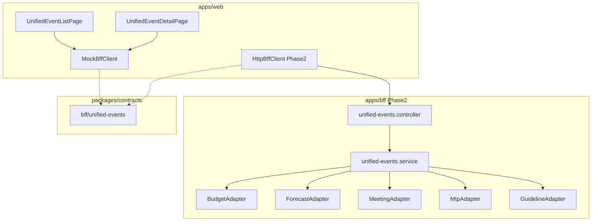

# Design Document: unified-events

---

**Purpose**: 統一イベント管理機能の技術設計。各イベント種別（予算・見込・会議・MTP・ガイドライン）を統一インターフェースで一覧・管理し、部門別登録状況を横断的に確認する。

---

## Spec Reference（INPUT情報）

本設計を作成するにあたり、以下の情報を確認した：

### Requirements（直接INPUT）
- **参照ファイル**: `.kiro/specs/admin/unified-events/requirements.md`
- **要件バージョン**: 2026-02-06

### 仕様概要（確定済み仕様）
- **参照ファイル**: `.kiro/specs/仕様概要/統一イベント管理.md`
- **設計に影響する仕様ポイント**:
  - イベント種別（BUDGET/FORECAST/MEETING/MTP/GUIDELINE）を統一一覧で表示
  - 登録状況管理は予算・見込・会議のみ対象（部門入力があるイベント）
  - Phase 1 ではモックデータ動作、既存画面への遷移は後回し

### エンティティ定義（Data Model 正本）
- **参照ファイル**: `.kiro/specs/entities/01_各種マスタ.md`, `03_承認ワークフロー.md`
- **対象エンティティ**: plan_events, plan_versions, mtp_events, guideline_events, meeting_events, meeting_submissions, department_approval_status, departments

### 仕様検討（経緯・背景）※参考
- **参照ファイル**: なし（新規機能）
- **設計判断に影響した経緯**: 複数画面を行き来する課題を解決するため統一管理画面を新設

---

## INPUT整合性チェック

| チェック項目 | 確認結果 |
|-------------|---------|
| requirements.md との整合性 | 設計が全要件をカバーしている: ✅ |
| 仕様概要との整合性 | 設計が仕様概要と矛盾しない: ✅ |
| エンティティとの整合性 | Data Model がエンティティ定義に準拠: ✅ |
| 仕様検討の背景理解 | 設計判断の背景を確認した: N/A |

---

## Overview

統一イベント管理機能は、EPMシステム内の各種イベントを横断的に一覧・管理するための管理者向け機能である。

**主要機能**:
1. **イベント一覧**: 全イベント種別を統一形式で一覧表示（フィルタ・ページネーション対応）
2. **イベント詳細**: 個別イベントの基本情報とタブ構成（概要・登録状況・履歴）
3. **登録状況管理**: 部門別の登録・承認状況を一覧表示（予算・見込・会議のみ）

**Phase 1 スコープ**: UI + MockBffClient による動作検証。Domain API 連携は Phase 2 以降。

---

## Architecture

### Architecture Pattern & Boundary Map

**Pattern (fixed)**:
- UI（apps/web） → BFF（apps/bff） → Domain API（apps/api） → DB（PostgreSQL + RLS）
- UI直APIは禁止

**Contracts (SSoT)**:
- UI ↔ BFF: `packages/contracts/src/bff/unified-events`
- BFF ↔ Domain API: Phase 2 で定義（Phase 1 は Mock）
- Enum/Error: `packages/contracts/src/bff/unified-events` 内に定義
- UI は `packages/contracts/src/api` を参照してはならない



---

## Architecture Responsibilities（Mandatory）

### BFF Specification（apps/bff）

**Purpose**
- 複数イベントソースを統一DTOに変換
- イベント種別に応じたアダプター経由でデータ取得
- UI要件に最適化した集約・ページネーション

**BFF Endpoints（UIが叩く）**

| Method | Endpoint | Purpose | Request DTO | Response DTO | Notes |
|--------|----------|---------|-------------|--------------|-------|
| GET | /bff/unified-events | イベント一覧取得 | BffUnifiedEventListRequest | BffUnifiedEventListResponse | フィルタ・ページネーション |
| GET | /bff/unified-events/:eventType/:eventId | イベント詳細取得 | - | BffUnifiedEventDetailResponse | パスパラメータ |
| GET | /bff/unified-events/:eventType/:eventId/submissions | 登録状況一覧取得 | BffSubmissionListRequest | BffSubmissionListResponse | BUDGET/FORECAST/MEETINGのみ |
| POST | /bff/unified-events/:eventType/:eventId/remind | 催促送信 | BffSendReminderRequest | BffSendReminderResponse | Phase 1 はダイアログのみ |

**Naming Convention（必須）**
- DTO / Contracts: camelCase（例: `eventType`, `eventName`, `targetPeriod`）
- DB columns: snake_case（例: `event_type`, `event_name`, `target_period`）
- `sortBy` は **DTO側キー**を採用する（例: `eventName | createdAt`）

**Paging / Sorting Normalization（必須・BFF責務）**
- UI/BFF: page / pageSize（page-based）
- Domain API: offset / limit（DB-friendly）
- BFFは必ず以下を実施する：
  - defaults: page=1, pageSize=20, sortBy=createdAt, sortOrder=desc
  - clamp: pageSize <= 100
  - whitelist: sortBy は `eventName` | `createdAt` | `deadline` | `statusLabel`
  - normalize: keyword trim、空→undefined
  - transform: offset=(page-1)*pageSize, limit=pageSize
- BFFレスポンスには page/pageSize/totalCount を含める

**Transformation Rules（各アダプター責務）**
- BudgetAdapter: plan_versions → UnifiedEvent
- ForecastAdapter: plan_versions → UnifiedEvent
- MeetingAdapter: meeting_events → UnifiedEvent
- MtpAdapter: mtp_events → UnifiedEvent
- GuidelineAdapter: guideline_events → UnifiedEvent

**Error Handling（contracts errorに準拠）**

**Error Policy（必須）**
- この Feature における BFF の Error Policy は以下とする：
  - 採用方針：**Option A: Pass-through**
  - 採用理由：Phase 1 は Mock のみであり、Domain API エラーは発生しない。Phase 2 移行時も Domain API エラーをそのまま透過する設計とする。

**Authentication / Tenant Context**
- BFF は認証情報から `tenant_id` / `user_id` を解決
- Domain API 呼び出し時に header で伝搬（Phase 2）
- Phase 1 の Mock では固定値を使用

---

### Service Specification（Domain / apps/api）

Phase 1 スコープ外。Phase 2 で以下を検討：
- 各イベントテーブルからの一括取得API
- 登録状況集約API
- 催促通知API

---

### Repository Specification（apps/api）

Phase 1 スコープ外。

---

### Contracts Summary（This Feature）

```
packages/contracts/src/bff/unified-events/
└── index.ts
    ├── Enums: UnifiedEventType, UnifiedEventStatus, SubmissionStatus
    ├── Request DTOs: BffUnifiedEventListRequest, BffSubmissionListRequest, BffSendReminderRequest
    ├── Response DTOs: BffUnifiedEventListResponse, BffUnifiedEvent, BffUnifiedEventDetailResponse, BffSubmissionListResponse, BffDepartmentSubmission, BffSubmissionSummary
    └── Errors: UnifiedEventsErrorCode, UnifiedEventsError
```

---

## Responsibility Clarification（Mandatory）

### UIの責務
- イベント一覧の表示・フィルタ・ページネーション操作
- イベント詳細画面のタブ切替
- 登録状況のステータス別色分け・アイコン表示
- 催促ダイアログの表示・確認
- ビジネス判断は禁止（登録状況対象イベントの判定はBFFレスポンスに基づく）

### BFFの責務
- 各イベントソースからの統一DTO変換（Phase 2）
- ステータスマッピング（元ステータス→統一表示ラベル）
- ページネーション・ソート・フィルタの正規化
- 登録状況集計（サマリー計算）
- Mock データ返却（Phase 1）

### Domain APIの責務（Phase 2）
- 各イベントテーブルのCRUD
- 登録状況の正本管理
- 承認ワークフロー連携
- 催促通知の実行

---

## Data Model（エンティティ整合性確認必須）

### Entity Reference
- 参照元:
  - `.kiro/specs/entities/01_各種マスタ.md` セクション plan_events, plan_versions, mtp_events, guideline_events
  - `.kiro/specs/entities/03_承認ワークフロー.md` セクション department_approval_status
  - `.kiro/specs/仕様概要/経営会議レポート機能.md` セクション meeting_events, meeting_submissions

### エンティティ整合性チェックリスト

| チェック項目 | 確認結果 |
|-------------|---------|
| カラム網羅性 | 既存エンティティを参照、新規テーブルなし: ✅ |
| 型の一致 | 統一DTOへの変換ルールを定義: ✅ |
| 制約の反映 | 既存制約を維持: ✅ |
| ビジネスルール | ステータスマッピングを本設計に明記: ✅ |
| NULL許可 | deadline, progress は nullable: ✅ |

### イベントステータスマッピング

| イベント種別 | 元ステータス | 統一表示ラベル |
|-------------|-------------|---------------|
| BUDGET/FORECAST | DRAFT | 下書き |
| BUDGET/FORECAST | SUBMITTED | 受付中 |
| BUDGET/FORECAST | APPROVED | 承認済 |
| BUDGET/FORECAST | FIXED | 確定済 |
| MEETING | DRAFT | 下書き |
| MEETING | OPEN | 受付開始 |
| MEETING | COLLECTING | 受付中 |
| MEETING | HELD | 開催済 |
| MEETING | CLOSED | 完了 |
| MTP | DRAFT | 下書き |
| MTP | CONFIRMED | 確定済 |
| GUIDELINE | DRAFT | 下書き |
| GUIDELINE | DISTRIBUTED | 配布済 |
| GUIDELINE | CLOSED | 完了 |

### 登録状況ステータスマッピング

| 統一ステータス | BUDGET/FORECAST 条件 | MEETING 条件 |
|--------------|---------------------|--------------|
| NOT_STARTED | status=DRAFT かつ updated_at なし | submission なし |
| IN_PROGRESS | status=DRAFT かつ updated_at あり | status=DRAFT |
| SUBMITTED | status=PENDING | status=SUBMITTED |
| APPROVED | status=APPROVED | status=APPROVED |
| REJECTED | status=REJECTED | - |
| OVERDUE | 締切超過 かつ NOT_STARTED/IN_PROGRESS | 締切超過 かつ NOT_STARTED/IN_PROGRESS |

---

## Components & Interface Contracts

### Component Summary

| Component | Domain | Intent | Requirements | Dependencies |
|-----------|--------|--------|--------------|--------------|
| UnifiedEventListPage | UI | イベント一覧表示 | 1.1-1.6 | BffClient, useUnifiedEvents |
| UnifiedEventDetailPage | UI | イベント詳細表示 | 2.1-2.5 | BffClient, useUnifiedEventDetail |
| SubmissionStatusTab | UI | 登録状況タブ | 3.1-3.5, 4.1-4.6 | BffClient, useSubmissionStatus |
| SubmissionSummaryCard | UI | 登録状況サマリー | 3.1-3.5 | - |
| SubmissionTable | UI | 部門別一覧 | 4.1-4.6 | - |
| ReminderDialog | UI | 催促ダイアログ | 5.1-5.4 | - |
| MockBffClient | UI/API | Mockデータ返却 | 8.1-8.6 | - |
| HttpBffClient | UI/API | BFF呼出（Phase 2） | - | BFF endpoints |

### BffClient Interface

```typescript
// apps/web/src/features/admin/unified-events/api/BffClient.ts

export interface BffClient {
  // イベント一覧取得
  listEvents(request: BffUnifiedEventListRequest): Promise<BffUnifiedEventListResponse>

  // イベント詳細取得
  getEventDetail(eventType: UnifiedEventType, eventId: string): Promise<BffUnifiedEventDetailResponse>

  // 登録状況一覧取得
  listSubmissions(
    eventType: UnifiedEventType,
    eventId: string,
    request: BffSubmissionListRequest
  ): Promise<BffSubmissionListResponse>

  // 催促送信
  sendReminder(
    eventType: UnifiedEventType,
    eventId: string,
    request: BffSendReminderRequest
  ): Promise<BffSendReminderResponse>
}
```

### Contracts Definition

```typescript
// packages/contracts/src/bff/unified-events/index.ts

// ============================================================================
// Enums
// ============================================================================

export const UnifiedEventType = {
  BUDGET: 'BUDGET',
  FORECAST: 'FORECAST',
  MEETING: 'MEETING',
  MTP: 'MTP',
  GUIDELINE: 'GUIDELINE',
} as const
export type UnifiedEventType = (typeof UnifiedEventType)[keyof typeof UnifiedEventType]

export const SubmissionStatus = {
  NOT_STARTED: 'NOT_STARTED',
  IN_PROGRESS: 'IN_PROGRESS',
  SUBMITTED: 'SUBMITTED',
  APPROVED: 'APPROVED',
  REJECTED: 'REJECTED',
  OVERDUE: 'OVERDUE',
} as const
export type SubmissionStatus = (typeof SubmissionStatus)[keyof typeof SubmissionStatus]

// ============================================================================
// Request DTOs
// ============================================================================

export interface BffUnifiedEventListRequest {
  page?: number              // default: 1
  pageSize?: number          // default: 20, max: 100
  sortBy?: 'eventName' | 'createdAt' | 'deadline' | 'statusLabel'
  sortOrder?: 'asc' | 'desc'
  keyword?: string           // イベント名部分一致
  eventType?: UnifiedEventType
  fiscalYear?: number
  statusLabel?: string
}

export interface BffSubmissionListRequest {
  status?: SubmissionStatus[]
  departmentIds?: string[]
  includeChildren?: boolean  // 子部門含む
}

export interface BffSendReminderRequest {
  departmentIds: string[]
  message?: string
}

// ============================================================================
// Response DTOs
// ============================================================================

export interface BffUnifiedEvent {
  id: string
  eventType: UnifiedEventType
  eventName: string
  targetPeriod: string
  status: string             // 元ステータス
  statusLabel: string        // 統一表示ラベル
  deadline: string | null    // ISO8601
  createdAt: string
  // 登録状況対象イベントのみ
  progress: {
    total: number
    completed: number
    rate: number             // 0-100
  } | null
  hasSubmissionTracking: boolean  // 登録状況管理対象か
}

export interface BffUnifiedEventListResponse {
  items: BffUnifiedEvent[]
  page: number
  pageSize: number
  totalCount: number
}

export interface BffUnifiedEventDetailResponse {
  id: string
  eventType: UnifiedEventType
  eventName: string
  targetPeriod: string
  periodStart: string | null  // ISO8601
  periodEnd: string | null    // ISO8601
  status: string
  statusLabel: string
  deadline: string | null
  createdAt: string
  createdBy: string | null
  hasSubmissionTracking: boolean
}

export interface BffSubmissionSummary {
  total: number
  notStarted: number
  inProgress: number
  submitted: number
  approved: number
  rejected: number
  overdue: number
  completionRate: number     // 0-100
  daysUntilDeadline: number | null
}

export interface BffDepartmentSubmission {
  departmentId: string
  departmentStableId: string
  departmentName: string
  departmentLevel: number
  parentDepartmentId: string | null
  status: SubmissionStatus
  lastUpdatedAt: string | null
  lastUpdatedBy: string | null
  submittedAt: string | null
  // 承認ワークフロー情報（BUDGET/FORECASTのみ）
  approvalInfo: {
    currentStep: number
    maxSteps: number
    nextApproverName: string | null
  } | null
}

export interface BffSubmissionListResponse {
  eventId: string
  eventType: UnifiedEventType
  eventName: string
  deadline: string | null
  summary: BffSubmissionSummary
  departments: BffDepartmentSubmission[]
}

export interface BffSendReminderResponse {
  success: boolean
  sentCount: number
  message: string
}

// ============================================================================
// Error Codes
// ============================================================================

export const UnifiedEventsErrorCode = {
  EVENT_NOT_FOUND: 'EVENT_NOT_FOUND',
  INVALID_EVENT_TYPE: 'INVALID_EVENT_TYPE',
  SUBMISSION_NOT_SUPPORTED: 'SUBMISSION_NOT_SUPPORTED',
  REMINDER_FAILED: 'REMINDER_FAILED',
  PERMISSION_DENIED: 'PERMISSION_DENIED',
} as const

export type UnifiedEventsErrorCode =
  (typeof UnifiedEventsErrorCode)[keyof typeof UnifiedEventsErrorCode]

export interface UnifiedEventsError {
  code: UnifiedEventsErrorCode
  message: string
  details?: Record<string, unknown>
}
```

---

## UI Components（Summary-only）

Phase 1 は v0-workflow に従い `apps/web/_v0_drop/admin/unified-events/` に初期実装。

| Component | Purpose | Key Props |
|-----------|---------|-----------|
| UnifiedEventListPage | イベント一覧ページ | - |
| UnifiedEventDetailPage | イベント詳細ページ（タブ構成） | eventType, eventId |
| SubmissionStatusTab | 登録状況タブ | eventType, eventId |
| SubmissionSummaryCard | サマリーカード | summary: BffSubmissionSummary |
| SubmissionTable | 部門別一覧テーブル | departments: BffDepartmentSubmission[], onSelectDepartments |
| ReminderDialog | 催促ダイアログ | open, selectedDepartments, onConfirm, onClose |
| EventFilterPanel | フィルタパネル | filters, onChange |

**Implementation Notes**:
- 部門階層はツリー表示（TanStack Table または AG Grid Tree Data）
- ステータスはアイコン+色分け（NOT_STARTED=gray, IN_PROGRESS=yellow, SUBMITTED=blue, APPROVED=green, REJECTED=red, OVERDUE=orange）
- Phase 1 完了後に `apps/web/src/features/admin/unified-events/` へ移植

---

## Requirements Traceability

| Requirement | Summary | Components | Interfaces | Notes |
|-------------|---------|------------|------------|-------|
| 1.1-1.6 | イベント一覧表示 | UnifiedEventListPage, EventFilterPanel | listEvents | フィルタ・ページネーション |
| 2.1-2.5 | イベント詳細表示 | UnifiedEventDetailPage | getEventDetail | タブ構成 |
| 3.1-3.5 | 登録状況サマリー | SubmissionStatusTab, SubmissionSummaryCard | listSubmissions | サマリー計算 |
| 4.1-4.6 | 部門別登録状況 | SubmissionTable | listSubmissions | 階層表示・フィルタ |
| 5.1-5.4 | 催促機能 | ReminderDialog | sendReminder | Phase 1 はダイアログのみ |
| 6.1-6.5 | イベントステータスマッピング | BFF/Adapter | - | マッピングテーブル参照 |
| 7.1-7.8 | 登録状況ステータスマッピング | BFF/Adapter | - | マッピングテーブル参照 |
| 8.1-8.6 | モックデータ対応 | MockBffClient | - | 全イベント種別・ステータスのサンプル |

---

## Testing Strategy

### Phase 1 テスト方針
- **Unit Tests**: MockBffClient のモックデータ返却確認
- **Component Tests**: 各UIコンポーネントの表示確認（Storybook）
- **Integration Tests**: 画面遷移・フィルタ・ページネーション動作確認

### Phase 2 テスト方針（将来）
- **E2E Tests**: 実BFF/API連携でのフロー確認
- **Contract Tests**: BFF契約の整合性確認

---

## Out of Scope（Phase 1）

| 項目 | 理由 |
|------|------|
| Domain API 実装 | Phase 2 以降 |
| HttpBffClient 実装 | Phase 2 以降（Mock使用） |
| 既存画面への遷移 | Phase 2 以降 |
| 催促メール送信 | Phase 1 はダイアログのみ |
| CSV出力 | 将来機能 |
| 履歴タブ | 将来機能 |

---

## 変更履歴

| 日付 | 変更内容 | 担当 |
|------|---------|------|
| 2026-02-06 | 初版作成 | Claude Code |
