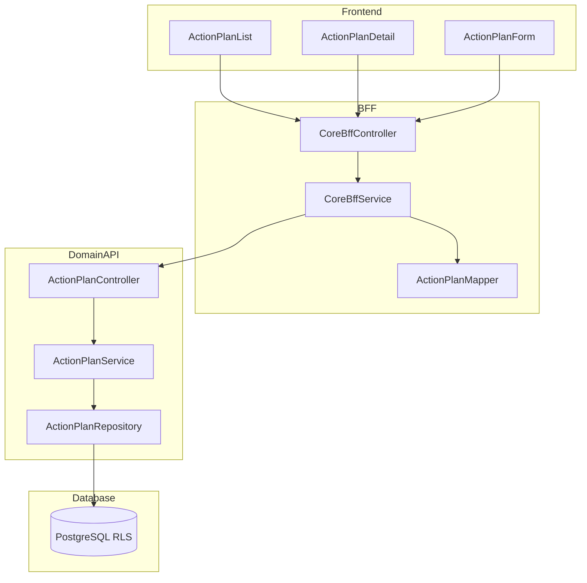

# Technical Design Document

## Feature: kpi/action-plan-core

---

## Spec Reference（INPUT情報）

### Requirements（直接INPUT）
- **参照ファイル**: `.kiro/specs/kpi/action-plan-core/requirements.md`
- **要件バージョン**: 2026-01-09

### 仕様概要（確定済み仕様）
- **参照ファイル**: `.kiro/specs/仕様概要/KPIアクションプラン管理.md`
- **設計に影響する仕様ポイント**:
  - KPIとアクションプランの関係は1:N
  - 即時保存方式（Trelloスタイル）
  - 楽観的ロック（updated_atベース）

### エンティティ定義（Data Model 正本）
- **参照ファイル**: `.kiro/specs/entities/01_各種マスタ.md`
- **対象エンティティ**: action_plans（14.1）

---

## INPUT整合性チェック

| チェック項目 | 確認結果 |
|-------------|---------|
| requirements.md との整合性 | 設計が全要件をカバーしている: ✅ |
| 仕様概要との整合性 | 設計が仕様概要と矛盾しない: ✅ |
| エンティティとの整合性 | Data Model がエンティティ定義に準拠: ✅ |
| 仕様検討の背景理解 | 設計判断の背景を確認した: ✅ |

---

## Overview

本Featureは、KPI目標達成のための施策（アクションプラン）を管理するCRUD機能を提供する。アクションプランはKPI科目に紐付き、配下にWBS項目・タスクを持つ3階層構造の最上位エンティティである。

一覧画面では検索・フィルタ・ソート・ページングを提供し、詳細画面では全項目の表示と配下のWBS/タスク件数サマリを表示する。削除は論理削除（is_active=false）とし、配下のWBS・タスクも連動して論理削除する。

---

## Architecture

### Architecture Pattern & Boundary Map

**Pattern (fixed)**:
- UI（apps/web） → BFF（apps/bff） → Domain API（apps/api） → DB（PostgreSQL + RLS）
- UI直APIは禁止



**Contracts (SSoT)**:
- UI ↔ BFF: `packages/contracts/src/bff/action-plan-core`
- BFF ↔ Domain API: `packages/contracts/src/api/action-plan-core`
- Enum/Error: `packages/contracts/src/shared/errors`

---

## Architecture Responsibilities（Mandatory）

### BFF Specification（apps/bff）

**Purpose**
- UI要件に最適化したAPI（Read Model / ViewModel）
- Domain APIのレスポンスを集約・変換（ビジネスルールの正本は持たない）

**BFF Endpoints（UIが叩く）**

| Method | Endpoint | Purpose | Request DTO | Response DTO | Req |
|--------|----------|---------|-------------|--------------|-----|
| GET | /api/bff/action-plan/plans | 一覧取得 | BffListPlansRequest | BffListPlansResponse | 1.1-1.5 |
| GET | /api/bff/action-plan/plans/:id | 詳細取得 | - | BffPlanDetailResponse | 2.1-2.3 |
| POST | /api/bff/action-plan/plans | 新規作成 | BffCreatePlanRequest | BffPlanDetailResponse | 3.1-3.7 |
| PATCH | /api/bff/action-plan/plans/:id | 編集 | BffUpdatePlanRequest | BffPlanDetailResponse | 4.1-4.5 |
| DELETE | /api/bff/action-plan/plans/:id | 削除（論理） | - | void | 5.1-5.4 |
| GET | /api/bff/action-plan/kpi-subjects | KPI科目一覧（選択用） | - | BffKpiSubjectsResponse | 3.5 |

**Naming Convention（必須）**
- DTO / Contracts: camelCase（例: `planCode`, `planName`, `subjectId`）
- DB columns: snake_case（例: `plan_code`, `plan_name`, `subject_id`）
- `sortBy` は **DTO側キー**を採用する

**Paging / Sorting Normalization（必須・BFF責務）**
- UI/BFF: page / pageSize（page-based, 1-indexed）
- Domain API: offset / limit（DB-friendly, 0-indexed）
- BFF は必ず以下を実施する：
  - defaults: page=1, pageSize=50, sortBy=planCode, sortOrder=asc
  - clamp: pageSize <= 200
  - whitelist: sortBy は許可リストのみ（`planCode | planName | dueDate | status`）
  - normalize: keyword trim、空→undefined
  - transform: offset=(page-1)*pageSize, limit=pageSize

**Transformation Rules（api DTO → bff DTO）**
- field名は同一（camelCase維持）
- 日付は ISO 8601 文字列として返却
- subjectId → subjectName の解決は BFF で実施（一覧用）
- ownerEmployeeId → ownerEmployeeName の解決は BFF で実施

**Error Policy（必須）**
- 採用方針：**Option A: Pass-through**
- 採用理由：標準的なCRUD操作、Domain APIエラーで直接ハンドリング可能

**Error Handling**

| Domain API Error | HTTP Status | BFF Action | Req |
|-----------------|-------------|------------|-----|
| PLAN_NOT_FOUND | 404 | Pass-through | 2.1, 4.1, 5.1 |
| PLAN_CODE_DUPLICATE | 409 | Pass-through | 3.4, 4.5 |
| INVALID_SUBJECT_TYPE | 422 | Pass-through | 3.6 |
| OPTIMISTIC_LOCK_ERROR | 409 | Pass-through | 4.4 |
| FORBIDDEN | 403 | Pass-through | 7.5 |

**Authentication / Tenant Context**
- tenant_id / user_id は認証ミドルウェアで解決
- Domain API へは `x-tenant-id` / `x-user-id` ヘッダーで伝搬

---

### Service Specification（Domain / apps/api）

**Purpose**
- ビジネスルールの正本

**Domain API Endpoints**

| Method | Endpoint | Purpose | Transaction | Audit | Req |
|--------|----------|---------|-------------|-------|-----|
| GET | /api/action-plan/plans | 一覧取得 | Read-only | - | 1.1-1.5 |
| GET | /api/action-plan/plans/:id | 詳細取得 | Read-only | - | 2.1-2.3 |
| POST | /api/action-plan/plans | 新規作成 | Write | created_by/at | 3.1-3.9 |
| PATCH | /api/action-plan/plans/:id | 更新 | Write | updated_by/at | 4.1-4.5 |
| DELETE | /api/action-plan/plans/:id | 論理削除 | Write（複数行） | updated_by/at | 5.1-5.4 |

**Business Rules（ActionPlanService 責務）**
- プランコード重複チェック（tenant_id + company_id + plan_code）: Req 3.3, 3.4, 4.5
- KPI科目検証（subject_type='KPI' のみ許可）: Req 3.5, 3.6
- **初期ステータス自動生成**（未着手/進行中/レビュー中/完了）: Req 3.8
- **初期ラベル自動生成**（重要/急ぎ/確認待ち/完了間近）: Req 3.9
- 楽観的ロック（updated_at検証）: Req 4.3, 4.4
- 論理削除時の配下連動削除（wbs_items, action_plan_tasks, **task_statuses, task_labels**）: Req 5.3, 5.4
- 権限チェック: Req 7.1-7.5

---

### Repository Specification（apps/api）

```typescript
interface ActionPlanRepository {
  findAll(tenantId: string, companyId: string, query: ListPlansQuery): Promise<{ plans: ActionPlan[]; totalCount: number }>;
  findById(tenantId: string, id: string): Promise<ActionPlan | null>;
  findByCode(tenantId: string, companyId: string, planCode: string): Promise<ActionPlan | null>;
  create(tenantId: string, data: CreatePlanData): Promise<ActionPlan>;
  update(tenantId: string, id: string, data: UpdatePlanData): Promise<ActionPlan>;
  softDelete(tenantId: string, id: string): Promise<void>;
  softDeleteCascade(tenantId: string, planId: string): Promise<{ wbsCount: number; taskCount: number; statusCount: number; labelCount: number }>;
  countWbsAndTasks(tenantId: string, planId: string): Promise<{ wbsCount: number; taskCount: number }>;
  createInitialStatuses(tenantId: string, planId: string): Promise<void>; // Req 3.8
  createInitialLabels(tenantId: string, planId: string): Promise<void>; // Req 3.9
}
```

---

### Contracts Summary（This Feature）

**packages/contracts/src/bff/action-plan-core**

```typescript
// === Enums ===
export type ActionPlanStatus = 'NOT_STARTED' | 'IN_PROGRESS' | 'COMPLETED' | 'CANCELLED';
export type ActionPlanPriority = 'HIGH' | 'MEDIUM' | 'LOW';

// === DTOs ===
export interface BffActionPlanSummary {
  id: string;
  planCode: string;
  planName: string;
  subjectId: string;
  subjectName: string;
  ownerEmployeeId: string | null;
  ownerEmployeeName: string | null;
  dueDate: string | null;
  status: ActionPlanStatus;
  progressRate: number | null;
  priority: ActionPlanPriority | null;
}

export interface BffActionPlanDetail extends BffActionPlanSummary {
  description: string | null;
  ownerDepartmentStableId: string | null;
  ownerDepartmentName: string | null;
  startDate: string | null;
  isActive: boolean;
  wbsCount: number;
  taskCount: number;
  createdAt: string;
  updatedAt: string;
}

export interface BffListPlansRequest {
  page?: number;
  pageSize?: number;
  sortBy?: 'planCode' | 'planName' | 'dueDate' | 'status';
  sortOrder?: 'asc' | 'desc';
  keyword?: string;
  status?: ActionPlanStatus;
  priority?: ActionPlanPriority;
}

export interface BffListPlansResponse {
  plans: BffActionPlanSummary[];
  totalCount: number;
  page: number;
  pageSize: number;
}

export interface BffCreatePlanRequest {
  planCode: string;
  planName: string;
  description?: string;
  subjectId: string;
  ownerDepartmentStableId?: string;
  ownerEmployeeId?: string;
  startDate?: string;
  dueDate?: string;
  priority?: ActionPlanPriority;
}

export interface BffUpdatePlanRequest {
  planCode?: string;
  planName?: string;
  description?: string;
  subjectId?: string;
  ownerDepartmentStableId?: string;
  ownerEmployeeId?: string;
  startDate?: string;
  dueDate?: string;
  status?: ActionPlanStatus;
  progressRate?: number;
  priority?: ActionPlanPriority;
  updatedAt: string; // 楽観的ロック用
}

export interface BffPlanDetailResponse {
  plan: BffActionPlanDetail;
}

export interface BffKpiSubject {
  id: string;
  subjectCode: string;
  subjectName: string;
}

export interface BffKpiSubjectsResponse {
  subjects: BffKpiSubject[];
}
```

**packages/contracts/src/shared/errors/action-plan-core-error.ts**
```typescript
export enum ActionPlanCoreErrorCode {
  PLAN_NOT_FOUND = 'PLAN_NOT_FOUND',
  PLAN_CODE_DUPLICATE = 'PLAN_CODE_DUPLICATE',
  INVALID_SUBJECT_TYPE = 'INVALID_SUBJECT_TYPE',
  OPTIMISTIC_LOCK_ERROR = 'OPTIMISTIC_LOCK_ERROR',
}
```

---

## Responsibility Clarification（Mandatory）

### UIの責務
- 一覧表示（検索・フィルタ・ソート・ページング）: Req 1.1-1.5
- 詳細表示: Req 2.1-2.3
- 作成・編集ダイアログ: Req 3.1, 4.1
- 削除確認ダイアログ・警告表示: Req 5.1, 5.2
- 権限に応じたボタン表示制御: Req 7.6
- KPI科目へのリンク: Req 6.2

### BFFの責務
- tenant_id / company_id の解決
- ページング変換（page/pageSize → offset/limit）
- subjectId/ownerEmployeeId の名前解決（一覧表示用）

### Domain APIの責務
- プランコード重複チェック
- KPI科目検証（subject_type='KPI'）
- 楽観的ロック
- 論理削除の配下連動
- 権限の最終判断

---

## Data Model（エンティティ整合性確認必須）

### Entity Reference
- 参照元: `.kiro/specs/entities/01_各種マスタ.md` セクション 14.1

### エンティティ整合性チェックリスト

| チェック項目 | 確認結果 |
|-------------|---------|
| カラム網羅性 | ✅ |
| 型の一致 | ✅ |
| 制約の反映 | ✅ |
| ビジネスルール | ✅ |
| NULL許可 | ✅ |

### Prisma Schema

```prisma
model ActionPlan {
  id                       String    @id @default(uuid())
  tenantId                 String    @map("tenant_id")
  companyId                String    @map("company_id")
  subjectId                String    @map("subject_id")
  planCode                 String    @map("plan_code") @db.VarChar(50)
  planName                 String    @map("plan_name") @db.VarChar(200)
  description              String?   @db.Text
  ownerDepartmentStableId  String?   @map("owner_department_stable_id") @db.VarChar(50)
  ownerEmployeeId          String?   @map("owner_employee_id")
  startDate                DateTime? @map("start_date") @db.Date
  dueDate                  DateTime? @map("due_date") @db.Date
  status                   String    @default("NOT_STARTED") @db.VarChar(20)
  progressRate             Int?      @map("progress_rate") @db.SmallInt
  priority                 String?   @db.VarChar(10)
  isActive                 Boolean   @default(true) @map("is_active")
  createdAt                DateTime  @default(now()) @map("created_at")
  updatedAt                DateTime  @updatedAt @map("updated_at")
  createdBy                String?   @map("created_by")
  updatedBy                String?   @map("updated_by")

  company  Company    @relation(fields: [tenantId, companyId], references: [tenantId, id])
  subject  Subject    @relation(fields: [tenantId, subjectId], references: [tenantId, id])
  wbsItems WbsItem[]

  @@unique([tenantId, companyId, planCode])
  @@map("action_plans")
}
```

### RLS Policy

```sql
ALTER TABLE action_plans ENABLE ROW LEVEL SECURITY;

CREATE POLICY tenant_isolation ON action_plans
  USING (tenant_id::text = current_setting('app.tenant_id', true));
```

---

## Requirements Traceability

| Requirement | Summary | Components | Interfaces |
|-------------|---------|------------|------------|
| 1.1-1.5 | 一覧表示 | ActionPlanListUI, CoreBffService, ActionPlanService | GET /plans |
| 2.1-2.3 | 詳細表示 | ActionPlanDetailUI, CoreBffService, ActionPlanService | GET /plans/:id |
| 3.1-3.7 | 新規作成 | ActionPlanFormUI, CoreBffService, ActionPlanService | POST /plans |
| 3.8 | 初期ステータス生成 | ActionPlanService, ActionPlanRepository | POST /plans |
| 3.9 | 初期ラベル生成 | ActionPlanService, ActionPlanRepository | POST /plans |
| 4.1-4.5 | 編集 | ActionPlanFormUI, CoreBffService, ActionPlanService | PATCH /plans/:id |
| 5.1-5.4 | 削除 | ActionPlanListUI, CoreBffService, ActionPlanService | DELETE /plans/:id |
| 6.1-6.2 | KPI連携 | ActionPlanDetailUI | GET /kpi-subjects |
| 7.1-7.6 | 権限制御 | All components | All endpoints |

---

## 変更履歴

| 日付 | 変更内容 | 担当 |
|------|---------|------|
| 2026-01-09 | 初版作成 | Claude Code |
| 2026-01-09 | **初期ステータス・ラベル自動生成を追加**（Req 3.8, 3.9）。Repository/Service仕様更新 | Claude Code |
