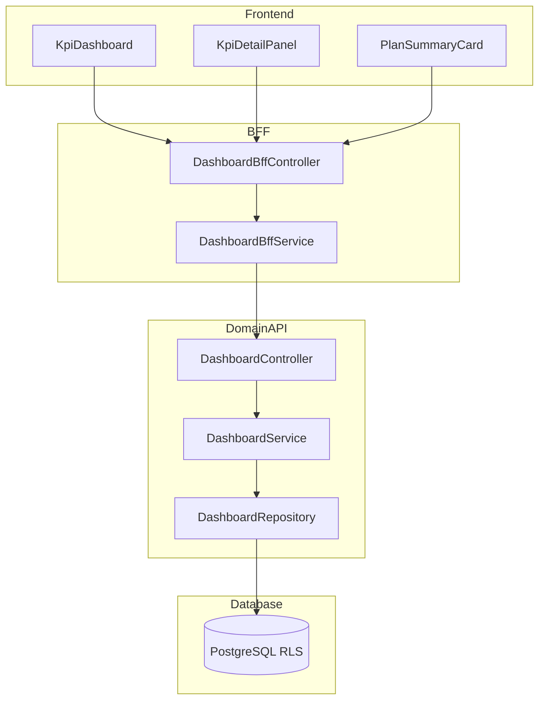

# Technical Design Document

## Feature: kpi/action-plan-dashboard

---

## Spec Reference（INPUT情報）

### Requirements（直接INPUT）
- **参照ファイル**: `.kiro/specs/kpi/action-plan-dashboard/requirements.md`
- **要件バージョン**: 2026-01-09

### 仕様概要（確定済み仕様）
- **参照ファイル**: `.kiro/specs/仕様概要/KPIアクションプラン管理.md`
- **設計に影響する仕様ポイント**:
  - KPI連携ダッシュボード: KPI予実 + 進捗を並べて表示
  - DashboardBff → CoreApi構成

### エンティティ定義（Data Model 正本）
- **参照ファイル**: `.kiro/specs/entities/01_各種マスタ.md`
- **対象エンティティ**: subjects（6.1）、action_plans（14.1）、wbs_items（14.2）、action_plan_tasks（14.3）

---

## INPUT整合性チェック

| チェック項目 | 確認結果 |
|-------------|---------|
| requirements.md との整合性 | ✅ |
| 仕様概要との整合性 | ✅ |
| エンティティとの整合性 | ✅ |
| 仕様検討の背景理解 | ✅ |

---

## Overview

本Featureは、KPI科目とアクションプランの進捗を統合的に表示するダッシュボード機能を提供する。KPI予実データ（予算・実績・達成率）とアクションプラン進捗（WBS進捗率・タスク完了率）を並べて表示し、施策の状況を俯瞰できる。

ダッシュボードはRead専用機能であり、データ更新は他のFeature（action-plan-core、action-plan-gantt、action-plan-kanban）で行う。本Featureは集約・表示に特化する。

---

## Architecture

### Architecture Pattern & Boundary Map



**Contracts (SSoT)**:
- UI ↔ BFF: `packages/contracts/src/bff/action-plan-dashboard`
- BFF ↔ Domain API: `packages/contracts/src/api/action-plan-dashboard`

---

## Architecture Responsibilities（Mandatory）

### BFF Specification（apps/bff）

**BFF Endpoints（UIが叩く）**

| Method | Endpoint | Purpose | Req |
|--------|----------|---------|-----|
| GET | /api/bff/action-plan/dashboard | ダッシュボードデータ取得 | 1.1-1.5, 2.1-2.3, 6.1-6.3 |
| GET | /api/bff/action-plan/dashboard/kpi/:subjectId | KPI予実詳細取得 | 4.1-4.3 |

**Query Parameters（ダッシュボード取得）**
- organizationId?: string（組織フィルタ）
- periodFrom?: string（期間開始）
- periodTo?: string（期間終了）
- progressStatus?: 'delayed' | 'normal' | 'completed'（進捗状況フィルタ）

**Error Policy**: Option A: Pass-through

**Error Handling**

| Domain API Error | HTTP Status | Req |
|-----------------|-------------|-----|
| SUBJECT_NOT_FOUND | 404 | 4.1 |
| FORBIDDEN | 403 | 8.1-8.3 |

---

### Service Specification（Domain / apps/api）

**Business Rules（DashboardService 責務）**
- WBS進捗率の加重平均集計: Req 2.1
- タスク完了率の計算: Req 2.2
- 遅延判定（期限超過、進捗遅れ）: Req 6.1, 6.2
- 組織アクセス制御: Req 8.3

**集計ロジック**
- WBS進捗率: `SUM(progress_rate * weight) / SUM(weight)` （weightはWBS項目の工数等）
- タスク完了率: `COUNT(completed tasks) / COUNT(all tasks) * 100`
- 遅延判定: due_date < current_date AND progress_rate < 100

---

### Contracts Summary（This Feature）

**packages/contracts/src/bff/action-plan-dashboard**

```typescript
// === ダッシュボードデータ ===
export interface BffDashboardData {
  summary: BffDashboardSummary;
  kpiGroups: BffKpiGroup[];
  lastUpdatedAt: string;
}

export interface BffDashboardSummary {
  totalKpiCount: number;
  totalPlanCount: number;
  delayedPlanCount: number;
  completedPlanCount: number;
  overallProgressRate: number;
}

export interface BffKpiGroup {
  kpiId: string;
  kpiCode: string;
  kpiName: string;
  organizationName: string | null;
  budgetAmount: number | null;
  actualAmount: number | null;
  achievementRate: number | null;
  plans: BffPlanSummary[];
}

export interface BffPlanSummary {
  id: string;
  planCode: string;
  planName: string;
  departmentName: string | null;
  responsibleEmployeeName: string | null;
  startDate: string | null;
  dueDate: string | null;
  wbsProgressRate: number | null;
  taskCompletionRate: number | null;
  status: 'delayed' | 'normal' | 'completed';
  isOverdue: boolean;
}

// === KPI予実詳細 ===
export interface BffKpiDetail {
  kpiId: string;
  kpiCode: string;
  kpiName: string;
  monthlyData: BffKpiMonthlyData[];
  totalBudget: number;
  totalActual: number;
  totalAchievementRate: number;
}

export interface BffKpiMonthlyData {
  yearMonth: string;
  budgetAmount: number;
  actualAmount: number;
  variance: number;
  achievementRate: number;
}

// === Request DTOs ===
export interface BffDashboardQuery {
  organizationId?: string;
  periodFrom?: string;
  periodTo?: string;
  progressStatus?: 'delayed' | 'normal' | 'completed';
}
```

**packages/contracts/src/shared/errors/action-plan-dashboard-error.ts**
```typescript
export enum ActionPlanDashboardErrorCode {
  SUBJECT_NOT_FOUND = 'SUBJECT_NOT_FOUND',
}
```

---

## Responsibility Clarification（Mandatory）

### UIの責務
- ダッシュボード表示（KPIグループ、プランサマリー）: Req 1.1-1.5
- フィルタUI: Req 3.1-3.3
- KPI詳細パネル展開: Req 4.1
- 詳細画面への遷移リンク: Req 5.1-5.3
- アラートアイコン表示: Req 6.1-6.2
- 更新ボタン・更新日時表示: Req 7.1-7.2
- 権限に応じた表示制御: Req 8.1-8.2

### BFFの責務
- フィルタパラメータの正規化
- Domain API結果の集約・変換
- 担当者名・部門名・組織名の解決

### Domain APIの責務
- 進捗率集計（WBS加重平均、タスク完了率）
- 遅延判定ロジック
- 組織アクセス制御
- 権限の最終判断

---

## Data Model

### Entity Reference
- subjects: `.kiro/specs/entities/01_各種マスタ.md` セクション 6.1
- action_plans: `.kiro/specs/entities/01_各種マスタ.md` セクション 14.1
- wbs_items: `.kiro/specs/entities/01_各種マスタ.md` セクション 14.2
- action_plan_tasks: `.kiro/specs/entities/01_各種マスタ.md` セクション 14.3

### 注記
本FeatureはRead専用のため、新規テーブル作成は不要。既存のsubjects、action_plans、wbs_items、action_plan_tasksテーブルを集約クエリで参照する。

### 集計クエリ例（Repository実装参考）

```sql
-- アクションプラン別のWBS進捗率集計
SELECT
  ap.id as action_plan_id,
  COALESCE(AVG(w.progress_rate), 0) as wbs_progress_rate
FROM action_plans ap
LEFT JOIN wbs_items w ON ap.id = w.action_plan_id AND w.is_active = true
WHERE ap.tenant_id = :tenantId
GROUP BY ap.id;

-- アクションプラン別のタスク完了率集計
SELECT
  w.action_plan_id,
  COUNT(CASE WHEN ts.status_code = 'DONE' THEN 1 END) as completed_count,
  COUNT(*) as total_count
FROM action_plan_tasks t
JOIN wbs_items w ON t.wbs_item_id = w.id
JOIN task_statuses ts ON t.status_id = ts.id
WHERE w.tenant_id = :tenantId
GROUP BY w.action_plan_id;
```

---

## Requirements Traceability

| Requirement | Summary | Components |
|-------------|---------|------------|
| 1.1-1.5 | ダッシュボード表示 | DashboardUI, DashboardBffService, DashboardService |
| 2.1-2.3 | 進捗集計 | DashboardService |
| 3.1-3.3 | フィルタリング | DashboardUI, DashboardBffService |
| 4.1-4.3 | KPI予実詳細 | KpiDetailPanel, DashboardBffService |
| 5.1-5.3 | ドリルダウン | DashboardUI |
| 6.1-6.3 | アラートインジケーター | DashboardUI, DashboardService |
| 7.1-7.2 | データ更新 | DashboardUI |
| 8.1-8.3 | 権限制御 | All components |

---

## 変更履歴

| 日付 | 変更内容 | 担当 |
|------|---------|------|
| 2026-01-09 | 初版作成 | Claude Code |
