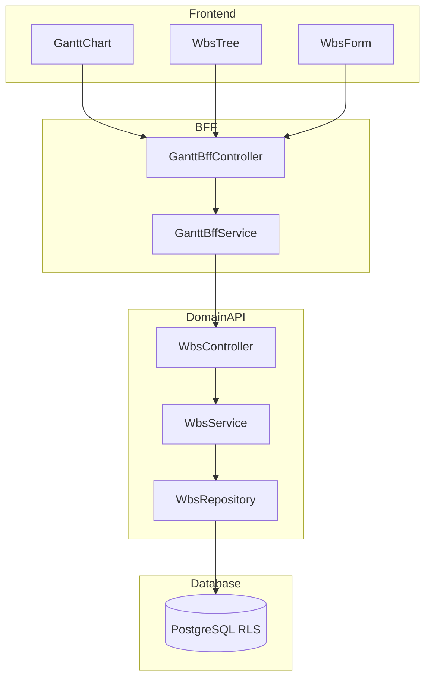

# Technical Design Document

## Feature: kpi/action-plan-gantt

---

## Spec Reference（INPUT情報）

### Requirements（直接INPUT）
- **参照ファイル**: `.kiro/specs/kpi/action-plan-gantt/requirements.md`
- **要件バージョン**: 2026-01-09

### 仕様概要（確定済み仕様）
- **参照ファイル**: `.kiro/specs/仕様概要/KPIアクションプラン管理.md`
- **設計に影響する仕様ポイント**:
  - ガントチャートはPhase 1必須
  - 有償ライブラリ活用（dhtmlxGantt / Bryntum Gantt / Syncfusion から導入時選定）
  - 即時保存方式

### エンティティ定義（Data Model 正本）
- **参照ファイル**: `.kiro/specs/entities/01_各種マスタ.md`
- **対象エンティティ**: wbs_items（14.2）

---

## INPUT整合性チェック

| チェック項目 | 確認結果 |
|-------------|---------|
| requirements.md との整合性 | ✅ |
| 仕様概要との整合性 | ✅ |
| エンティティとの整合性 | ✅ |
| 仕様検討の背景理解 | ✅ |

---

## Overview

本Featureは、アクションプラン配下のWBS項目をガントチャート形式で管理する機能を提供する。有償ガントチャートライブラリ（dhtmlxGantt/Bryntum Gantt/Syncfusion から導入時選定）を活用し、WBSの階層構造、スケジュール（バー操作）、進捗率、依存関係をビジュアルに表示・編集できる。

ライブラリ選定は導入フェーズで実施し、本設計ではライブラリ非依存のAPIインターフェースを定義する。

---

## Architecture

### Architecture Pattern & Boundary Map



**Contracts (SSoT)**:
- UI ↔ BFF: `packages/contracts/src/bff/action-plan-gantt`
- BFF ↔ Domain API: `packages/contracts/src/api/action-plan-gantt`

---

## Architecture Responsibilities（Mandatory）

### BFF Specification（apps/bff）

**BFF Endpoints（UIが叩く）**

| Method | Endpoint | Purpose | Req |
|--------|----------|---------|-----|
| GET | /api/bff/action-plan/gantt/:planId | ガントデータ取得 | 1.1-1.6 |
| POST | /api/bff/action-plan/gantt/wbs | WBS作成 | 3.1-3.4 |
| PATCH | /api/bff/action-plan/gantt/wbs/:id | WBS編集 | 4.1-4.4 |
| PATCH | /api/bff/action-plan/gantt/wbs/:id/schedule | スケジュール更新 | 5.1-5.3 |
| PATCH | /api/bff/action-plan/gantt/wbs/:id/progress | 進捗率更新 | 7.1-7.2 |
| PATCH | /api/bff/action-plan/gantt/wbs/:id/dependency | 依存関係更新 | 6.1-6.3 |
| DELETE | /api/bff/action-plan/gantt/wbs/:id | WBS削除 | 8.1-8.3, 2.4 |
| GET | /api/bff/action-plan/gantt/wbs/:id/next-code | 次のWBSコード取得 | 2.3 |

**Error Policy**: Option A: Pass-through

**Error Handling**

| Domain API Error | HTTP Status | Req |
|-----------------|-------------|-----|
| WBS_NOT_FOUND | 404 | 4.1, 8.1 |
| WBS_CODE_DUPLICATE | 409 | 3.4 |
| OPTIMISTIC_LOCK_ERROR | 409 | 4.4 |
| CIRCULAR_DEPENDENCY | 422 | 6.1 |
| FORBIDDEN | 403 | 11.1-11.5 |

---

### Service Specification（Domain / apps/api）

**Business Rules（WbsService 責務）**
- WBSコード重複チェック（tenant_id + action_plan_id + wbs_code）: Req 3.3, 3.4
- WBSコード自動採番: Req 2.3
- 階層削除（配下WBS・タスクの連動論理削除）: Req 2.4, 8.3
- 楽観的ロック: Req 4.3, 4.4
- 循環依存チェック（predecessor_wbs_id）: Req 6.1

---

### Contracts Summary（This Feature）

**packages/contracts/src/bff/action-plan-gantt**

```typescript
// === ガントチャートデータ ===
export interface BffGanttData {
  planId: string;
  planName: string;
  wbsItems: BffGanttWbs[];
  links: BffGanttLink[];
}

export interface BffGanttWbs {
  id: string;
  parentWbsId: string | null;
  wbsCode: string;
  wbsName: string;
  description: string | null;
  assigneeDepartmentStableId: string | null;
  assigneeDepartmentName: string | null;
  assigneeEmployeeId: string | null;
  assigneeEmployeeName: string | null;
  startDate: string | null;
  dueDate: string | null;
  actualStartDate: string | null;
  actualEndDate: string | null;
  progressRate: number | null;
  isMilestone: boolean;
  sortOrder: number;
  taskCount: number;
  updatedAt: string;
}

export interface BffGanttLink {
  id: string;
  sourceWbsId: string;
  targetWbsId: string;
  type: 'finish_to_start';
}

// === Request DTOs ===
export interface BffCreateWbsRequest {
  actionPlanId: string;
  parentWbsId?: string;
  wbsCode?: string; // 空の場合自動採番
  wbsName: string;
  description?: string;
  assigneeDepartmentStableId?: string;
  assigneeEmployeeId?: string;
  startDate?: string;
  dueDate?: string;
  isMilestone?: boolean;
}

export interface BffUpdateWbsRequest {
  wbsCode?: string;
  wbsName?: string;
  description?: string;
  assigneeDepartmentStableId?: string;
  assigneeEmployeeId?: string;
  startDate?: string;
  dueDate?: string;
  isMilestone?: boolean;
  updatedAt: string;
}

export interface BffUpdateWbsScheduleRequest {
  startDate: string | null;
  dueDate: string | null;
}

export interface BffUpdateWbsProgressRequest {
  progressRate: number;
}

export interface BffUpdateWbsDependencyRequest {
  predecessorWbsId: string | null;
}

export interface BffWbsResponse {
  wbs: BffGanttWbs;
}

export interface BffNextWbsCodeResponse {
  nextCode: string;
}
```

**packages/contracts/src/shared/errors/action-plan-gantt-error.ts**
```typescript
export enum ActionPlanGanttErrorCode {
  WBS_NOT_FOUND = 'WBS_NOT_FOUND',
  WBS_CODE_DUPLICATE = 'WBS_CODE_DUPLICATE',
  CIRCULAR_DEPENDENCY = 'CIRCULAR_DEPENDENCY',
  OPTIMISTIC_LOCK_ERROR = 'OPTIMISTIC_LOCK_ERROR',
}
```

---

## Responsibility Clarification（Mandatory）

### UIの責務
- ガントチャート表示（ライブラリ活用）: Req 1.1-1.6
- WBSツリーの展開/折りたたみ: Req 2.1
- バー操作によるスケジュール編集: Req 5.1-5.2
- 依存線のドラッグ操作: Req 6.1
- フィルタリング: Req 10.1-10.2
- カンバン遷移: Req 9.1-9.2
- 権限に応じた操作制御: Req 11.5

### BFFの責務
- ガントデータの集約（WBS + 依存関係 + タスク件数）
- 担当者名・部門名の解決

### Domain APIの責務
- WBSコード重複チェック
- 自動採番
- 階層削除
- 循環依存チェック
- 楽観的ロック
- 権限の最終判断

---

## Data Model

### Prisma Schema

```prisma
model WbsItem {
  id                        String    @id @default(uuid())
  tenantId                  String    @map("tenant_id")
  actionPlanId              String    @map("action_plan_id")
  parentWbsId               String?   @map("parent_wbs_id")
  wbsCode                   String    @map("wbs_code") @db.VarChar(50)
  wbsName                   String    @map("wbs_name") @db.VarChar(200)
  description               String?   @db.Text
  assigneeDepartmentStableId String?  @map("assignee_department_stable_id") @db.VarChar(50)
  assigneeEmployeeId        String?   @map("assignee_employee_id")
  startDate                 DateTime? @map("start_date") @db.Date
  dueDate                   DateTime? @map("due_date") @db.Date
  actualStartDate           DateTime? @map("actual_start_date") @db.Date
  actualEndDate             DateTime? @map("actual_end_date") @db.Date
  progressRate              Int?      @map("progress_rate") @db.SmallInt
  predecessorWbsId          String?   @map("predecessor_wbs_id")
  sortOrder                 Int       @map("sort_order")
  isMilestone               Boolean   @default(false) @map("is_milestone")
  isActive                  Boolean   @default(true) @map("is_active")
  createdAt                 DateTime  @default(now()) @map("created_at")
  updatedAt                 DateTime  @updatedAt @map("updated_at")

  actionPlan   ActionPlan       @relation(fields: [tenantId, actionPlanId], references: [tenantId, id])
  parentWbs    WbsItem?         @relation("WbsHierarchy", fields: [tenantId, parentWbsId], references: [tenantId, id])
  childWbs     WbsItem[]        @relation("WbsHierarchy")
  predecessor  WbsItem?         @relation("WbsDependency", fields: [tenantId, predecessorWbsId], references: [tenantId, id])
  successors   WbsItem[]        @relation("WbsDependency")
  tasks        ActionPlanTask[]

  @@unique([tenantId, actionPlanId, wbsCode])
  @@map("wbs_items")
}
```

### RLS Policy

```sql
ALTER TABLE wbs_items ENABLE ROW LEVEL SECURITY;

CREATE POLICY tenant_isolation ON wbs_items
  USING (tenant_id::text = current_setting('app.tenant_id', true));
```

---

## Requirements Traceability

| Requirement | Summary | Components |
|-------------|---------|------------|
| 1.1-1.6 | ガントチャート表示 | GanttChartUI, GanttBffService, WbsService |
| 2.1-2.4 | WBS階層管理 | WbsTreeUI, WbsService |
| 3.1-3.4 | WBS作成 | WbsFormUI, WbsService |
| 4.1-4.4 | WBS編集 | WbsFormUI, WbsService |
| 5.1-5.3 | スケジュール編集 | GanttChartUI, WbsService |
| 6.1-6.3 | 依存関係管理 | GanttChartUI, WbsService |
| 7.1-7.3 | 進捗率管理 | GanttChartUI, WbsService |
| 8.1-8.3 | WBS削除 | WbsFormUI, WbsService |
| 9.1-9.2 | カンバン遷移 | GanttChartUI |
| 10.1-10.2 | フィルタリング | GanttChartUI |
| 11.1-11.5 | 権限制御 | All components |

---

## Technology Decision（ライブラリ選定）

### ガントチャートライブラリ候補

| ライブラリ | 特徴 | 備考 |
|-----------|------|------|
| dhtmlxGantt | 高機能、日本語対応、商用ライセンス | 導入実績多い |
| Bryntum Gantt | モダンUI、React対応良好 | 高価格帯 |
| Syncfusion Gantt | .NET統合強い、React版あり | 機能豊富 |

**選定方針**: 導入フェーズで評価・選定。本設計はライブラリ非依存のAPIインターフェースを定義。

---

## 変更履歴

| 日付 | 変更内容 | 担当 |
|------|---------|------|
| 2026-01-09 | 初版作成 | Claude Code |
