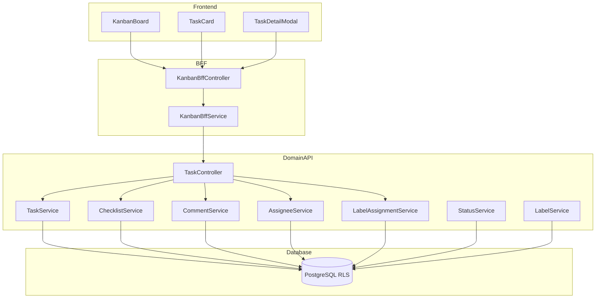

# Technical Design Document

## Feature: kpi/action-plan-kanban

---

## Spec Reference（INPUT情報）

### Requirements（直接INPUT）
- **参照ファイル**: `.kiro/specs/kpi/action-plan-kanban/requirements.md`
- **要件バージョン**: 2026-01-09

### 仕様概要（確定済み仕様）
- **参照ファイル**: `.kiro/specs/仕様概要/KPIアクションプラン管理.md`
- **設計に影響する仕様ポイント**:
  - カンバンボードはPhase 1必須（Trello準拠）
  - 即時保存方式
  - ライブラリ: @dnd-kit/core

### エンティティ定義（Data Model 正本）
- **参照ファイル**: `.kiro/specs/entities/01_各種マスタ.md`
- **対象エンティティ**: action_plan_tasks（14.3）、task_statuses（14.4、**アクションプラン単位**）、task_labels（14.5、**アクションプラン単位**）、task_label_assignments（14.6）、task_assignees（14.7）、task_checklist_items（14.8）、task_comments（14.9）

---

## INPUT整合性チェック

| チェック項目 | 確認結果 |
|-------------|---------|
| requirements.md との整合性 | ✅ |
| 仕様概要との整合性 | ✅ |
| エンティティとの整合性 | ✅ |
| 仕様検討の背景理解 | ✅ |

---

## Overview

本Featureは、アクションプラン配下のタスクをカンバンボード形式で管理する機能を提供する。@dnd-kit/coreを使用したドラッグ&ドロップUI、タスク詳細モーダル、チェックリスト、コメント、ラベル、複数担当者アサインなどTrello準拠の機能を実装する。

全操作は即時保存方式（Trelloスタイル）とし、楽観的ロックによる競合検証を行う。

**ステータス・ラベルはアクションプラン単位で管理**され、カンバンボード画面内から直接編集可能（Trelloのボード単位ラベルに準拠）。

---

## Architecture

### Architecture Pattern & Boundary Map



**Contracts (SSoT)**:
- UI ↔ BFF: `packages/contracts/src/bff/action-plan-kanban`
- BFF ↔ Domain API: `packages/contracts/src/api/action-plan-kanban`

---

## Architecture Responsibilities（Mandatory）

### BFF Specification（apps/bff）

**BFF Endpoints（UIが叩く）**

| Method | Endpoint | Purpose | Req |
|--------|----------|---------|-----|
| GET | /api/bff/action-plan/kanban/:planId | カンバンボード取得 | 1.1-1.5 |
| POST | /api/bff/action-plan/kanban/tasks | タスク作成 | 4.1-4.4 |
| PATCH | /api/bff/action-plan/kanban/tasks/:id | タスク更新 | 5.2-5.5 |
| PATCH | /api/bff/action-plan/kanban/tasks/:id/status | ステータス変更 | 2.1-2.3 |
| PATCH | /api/bff/action-plan/kanban/tasks/reorder | 並び順変更 | 3.1-3.2 |
| DELETE | /api/bff/action-plan/kanban/tasks/:id | タスク削除 | 10.1-10.3 |
| GET | /api/bff/action-plan/kanban/tasks/:id | タスク詳細取得 | 5.1 |
| POST | /api/bff/action-plan/kanban/tasks/:id/checklist | チェック項目追加 | 6.1-6.2 |
| PATCH | /api/bff/action-plan/kanban/checklist/:id | チェック項目更新 | 6.2 |
| DELETE | /api/bff/action-plan/kanban/checklist/:id | チェック項目削除 | 6.2 |
| POST | /api/bff/action-plan/kanban/tasks/:id/comments | コメント追加 | 7.1 |
| PATCH | /api/bff/action-plan/kanban/comments/:id | コメント編集 | 7.3 |
| DELETE | /api/bff/action-plan/kanban/comments/:id | コメント削除 | 7.3 |
| POST | /api/bff/action-plan/kanban/tasks/:id/labels | ラベル付与 | 8.1-8.2 |
| DELETE | /api/bff/action-plan/kanban/tasks/:id/labels/:labelId | ラベル解除 | 8.3 |
| POST | /api/bff/action-plan/kanban/tasks/:id/assignees | 担当者追加 | 9.1-9.2 |
| DELETE | /api/bff/action-plan/kanban/tasks/:id/assignees/:employeeId | 担当者解除 | 9.3 |
| GET | /api/bff/action-plan/kanban/:planId/statuses | ステータス一覧取得 | 12.1 |
| POST | /api/bff/action-plan/kanban/:planId/statuses | ステータス作成 | 12.2-12.3 |
| PATCH | /api/bff/action-plan/kanban/statuses/:id | ステータス更新 | 12.3 |
| PATCH | /api/bff/action-plan/kanban/:planId/statuses/reorder | ステータス並び順変更 | 12.4 |
| DELETE | /api/bff/action-plan/kanban/statuses/:id | ステータス削除 | 12.6 |
| GET | /api/bff/action-plan/kanban/:planId/labels | ラベル一覧取得 | 13.1 |
| POST | /api/bff/action-plan/kanban/:planId/labels | ラベル作成 | 13.2-13.3 |
| PATCH | /api/bff/action-plan/kanban/labels/:id | ラベル更新 | 13.3 |
| DELETE | /api/bff/action-plan/kanban/labels/:id | ラベル削除 | 13.4 |

**Error Policy**: Option A: Pass-through

**Error Handling**

| Domain API Error | HTTP Status | Req |
|-----------------|-------------|-----|
| TASK_NOT_FOUND | 404 | 5.1, 10.1 |
| OPTIMISTIC_LOCK_ERROR | 409 | 5.5 |
| COMMENT_NOT_FOUND | 404 | 7.3 |
| COMMENT_NOT_OWNER | 403 | 7.3 |
| STATUS_NOT_FOUND | 404 | 12.3 |
| STATUS_CODE_DUPLICATE | 400 | 12.3 |
| STATUS_IN_USE | 400 | 12.6 |
| STATUS_IS_DEFAULT | 400 | 12.6 |
| LABEL_NOT_FOUND | 404 | 13.3 |
| LABEL_NAME_DUPLICATE | 400 | 13.3 |
| FORBIDDEN | 403 | 11.1-11.6 |

---

### Service Specification（Domain / apps/api）

**Business Rules（TaskService 責務）**
- タスク作成時のデフォルトステータス設定: Req 4.4
- ステータス変更時の sort_order 再計算: Req 2.3
- 楽観的ロック: Req 5.4, 5.5
- タスク削除時の関連データカスケード削除: Req 10.3

**Business Rules（CommentService 責務）**
- 自分のコメントのみ編集・削除許可: Req 7.3

**Business Rules（StatusService 責務）**
- ステータスCRUD（アクションプラン単位）: Req 12.2-12.3
- ステータス並び順変更: Req 12.4
- 使用中ステータス削除禁止: Req 12.6
- is_default=trueの一意性保証: Req 12.7

**Business Rules（LabelService 責務）**
- ラベルCRUD（アクションプラン単位）: Req 13.2-13.3
- ラベル削除時の紐付け削除: Req 13.4

---

### Contracts Summary（This Feature）

**packages/contracts/src/bff/action-plan-kanban**

```typescript
// === カンバンボード ===
export interface BffKanbanBoard {
  planId: string;
  planName: string;
  columns: BffKanbanColumn[];
}

export interface BffKanbanColumn {
  statusId: string;
  statusCode: string;
  statusName: string;
  colorCode: string | null;
  tasks: BffTaskCard[];
}

export interface BffTaskCard {
  id: string;
  taskName: string;
  dueDate: string | null;
  sortOrder: number;
  labels: BffTaskLabelBrief[];
  assignees: BffAssigneeBrief[];
  checklistProgress: { completed: number; total: number };
  updatedAt: string;
}

export interface BffTaskLabelBrief {
  id: string;
  labelName: string;
  colorCode: string;
}

export interface BffAssigneeBrief {
  employeeId: string;
  employeeName: string;
}

// === タスク詳細 ===
export interface BffTaskDetail {
  id: string;
  taskName: string;
  description: string | null;
  statusId: string;
  dueDate: string | null;
  labels: BffTaskLabelBrief[];
  assignees: BffAssigneeBrief[];
  checklist: BffChecklistItem[];
  comments: BffTaskComment[];
  updatedAt: string;
}

export interface BffChecklistItem {
  id: string;
  itemName: string;
  isCompleted: boolean;
  sortOrder: number;
}

export interface BffTaskComment {
  id: string;
  content: string;
  authorId: string;
  authorName: string;
  createdAt: string;
  isOwner: boolean;
}

// === Request DTOs ===
export interface BffCreateTaskRequest {
  wbsItemId: string;
  taskName: string;
  statusId?: string;
}

export interface BffUpdateTaskRequest {
  taskName?: string;
  description?: string;
  dueDate?: string;
  updatedAt: string;
}

export interface BffUpdateTaskStatusRequest {
  statusId: string;
  sortOrder: number;
}

export interface BffReorderTasksRequest {
  orders: { id: string; sortOrder: number }[];
}

export interface BffCreateChecklistRequest {
  itemName: string;
}

export interface BffUpdateChecklistRequest {
  itemName?: string;
  isCompleted?: boolean;
}

export interface BffCreateCommentRequest {
  content: string;
}

export interface BffUpdateCommentRequest {
  content: string;
}

export interface BffAddLabelRequest {
  labelId: string;
}

export interface BffAddAssigneeRequest {
  employeeId: string;
}

// === ステータス編集（アクションプラン単位） ===
export interface BffTaskStatus {
  id: string;
  statusCode: string;
  statusName: string;
  colorCode: string | null;
  sortOrder: number;
  isDefault: boolean;
  isCompleted: boolean;
  updatedAt: string;
}

export interface BffListStatusesResponse {
  statuses: BffTaskStatus[];
}

export interface BffCreateStatusRequest {
  statusCode: string;
  statusName: string;
  colorCode?: string;
  isDefault?: boolean;
  isCompleted?: boolean;
}

export interface BffUpdateStatusRequest {
  statusCode?: string;
  statusName?: string;
  colorCode?: string;
  isDefault?: boolean;
  isCompleted?: boolean;
  updatedAt: string;
}

export interface BffReorderStatusesRequest {
  orders: { id: string; sortOrder: number }[];
}

// === ラベル編集（アクションプラン単位） ===
export interface BffTaskLabel {
  id: string;
  labelName: string;
  colorCode: string;
  sortOrder: number;
  updatedAt: string;
}

export interface BffListLabelsResponse {
  labels: BffTaskLabel[];
}

export interface BffCreateLabelRequest {
  labelName: string;
  colorCode: string;
}

export interface BffUpdateLabelRequest {
  labelName?: string;
  colorCode?: string;
  updatedAt: string;
}
```

**packages/contracts/src/shared/errors/action-plan-kanban-error.ts**
```typescript
export enum ActionPlanKanbanErrorCode {
  TASK_NOT_FOUND = 'TASK_NOT_FOUND',
  CHECKLIST_ITEM_NOT_FOUND = 'CHECKLIST_ITEM_NOT_FOUND',
  COMMENT_NOT_FOUND = 'COMMENT_NOT_FOUND',
  COMMENT_NOT_OWNER = 'COMMENT_NOT_OWNER',
  OPTIMISTIC_LOCK_ERROR = 'OPTIMISTIC_LOCK_ERROR',
  STATUS_NOT_FOUND = 'STATUS_NOT_FOUND',
  STATUS_CODE_DUPLICATE = 'STATUS_CODE_DUPLICATE',
  STATUS_IN_USE = 'STATUS_IN_USE',
  STATUS_IS_DEFAULT = 'STATUS_IS_DEFAULT',
  LABEL_NOT_FOUND = 'LABEL_NOT_FOUND',
  LABEL_NAME_DUPLICATE = 'LABEL_NAME_DUPLICATE',
}
```

---

## Responsibility Clarification（Mandatory）

### UIの責務
- カンバンボード表示（ステータス列、タスクカード）: Req 1.1-1.3
- ドラッグ&ドロップUI（@dnd-kit/core）: Req 2.1, 3.1
- フィルタリングUI: Req 1.4, 1.5
- タスク詳細モーダル: Req 5.1
- 権限に応じた操作制御: Req 11.5

### BFFの責務
- カンバンボードデータの集約（タスク + ステータス + ラベル + 担当者 + チェックリスト進捗）
- 担当者名・作成者名の解決

### Domain APIの責務
- ビジネスルールの正本
- 楽観的ロック
- カスケード削除
- 権限の最終判断

---

## Data Model

### Prisma Schema

```prisma
model ActionPlanTask {
  id                 String   @id @default(uuid())
  tenantId           String   @map("tenant_id")
  wbsItemId          String   @map("wbs_item_id")
  taskName           String   @map("task_name") @db.VarChar(200)
  description        String?  @db.Text
  assigneeEmployeeId String?  @map("assignee_employee_id")
  statusId           String   @map("status_id")
  dueDate            DateTime? @map("due_date") @db.Date
  sortOrder          Int      @map("sort_order")
  createdAt          DateTime @default(now()) @map("created_at")
  updatedAt          DateTime @updatedAt @map("updated_at")

  wbsItem          WbsItem              @relation(fields: [tenantId, wbsItemId], references: [tenantId, id])
  status           TaskStatus           @relation(fields: [tenantId, statusId], references: [tenantId, id])
  labelAssignments TaskLabelAssignment[]
  assignees        TaskAssignee[]
  checklistItems   TaskChecklistItem[]
  comments         TaskComment[]

  @@map("action_plan_tasks")
}

model TaskChecklistItem {
  id          String   @id @default(uuid())
  tenantId    String   @map("tenant_id")
  taskId      String   @map("task_id")
  itemName    String   @map("item_name") @db.VarChar(200)
  isCompleted Boolean  @default(false) @map("is_completed")
  sortOrder   Int      @map("sort_order")
  createdAt   DateTime @default(now()) @map("created_at")
  updatedAt   DateTime @updatedAt @map("updated_at")

  task ActionPlanTask @relation(fields: [tenantId, taskId], references: [tenantId, id], onDelete: Cascade)

  @@map("task_checklist_items")
}

model TaskComment {
  id        String   @id @default(uuid())
  tenantId  String   @map("tenant_id")
  taskId    String   @map("task_id")
  content   String   @db.Text
  authorId  String   @map("author_id")
  createdAt DateTime @default(now()) @map("created_at")
  updatedAt DateTime @updatedAt @map("updated_at")

  task ActionPlanTask @relation(fields: [tenantId, taskId], references: [tenantId, id], onDelete: Cascade)

  @@map("task_comments")
}

model TaskAssignee {
  id         String   @id @default(uuid())
  tenantId   String   @map("tenant_id")
  taskId     String   @map("task_id")
  employeeId String   @map("employee_id")
  assignedAt DateTime @default(now()) @map("assigned_at")
  assignedBy String?  @map("assigned_by")

  task ActionPlanTask @relation(fields: [tenantId, taskId], references: [tenantId, id], onDelete: Cascade)

  @@unique([tenantId, taskId, employeeId])
  @@map("task_assignees")
}
```

### RLS Policy

```sql
ALTER TABLE action_plan_tasks ENABLE ROW LEVEL SECURITY;
CREATE POLICY tenant_isolation ON action_plan_tasks
  USING (tenant_id::text = current_setting('app.tenant_id', true));

ALTER TABLE task_checklist_items ENABLE ROW LEVEL SECURITY;
CREATE POLICY tenant_isolation ON task_checklist_items
  USING (tenant_id::text = current_setting('app.tenant_id', true));

ALTER TABLE task_comments ENABLE ROW LEVEL SECURITY;
CREATE POLICY tenant_isolation ON task_comments
  USING (tenant_id::text = current_setting('app.tenant_id', true));

ALTER TABLE task_assignees ENABLE ROW LEVEL SECURITY;
CREATE POLICY tenant_isolation ON task_assignees
  USING (tenant_id::text = current_setting('app.tenant_id', true));
```

---

## Requirements Traceability

| Requirement | Summary | Components |
|-------------|---------|------------|
| 1.1-1.5 | カンバン表示 | KanbanBoardUI, KanbanBffService, TaskService |
| 2.1-2.3 | ステータス変更D&D | KanbanBoardUI, TaskService |
| 3.1-3.2 | 並び順変更D&D | KanbanBoardUI, TaskService |
| 4.1-4.4 | タスク作成 | KanbanBoardUI, TaskService |
| 5.1-5.5 | タスク詳細編集 | TaskDetailModal, TaskService |
| 6.1-6.3 | チェックリスト | TaskDetailModal, ChecklistService |
| 7.1-7.3 | コメント | TaskDetailModal, CommentService |
| 8.1-8.3 | ラベル付与 | TaskDetailModal, LabelAssignmentService |
| 9.1-9.4 | 複数担当者 | TaskDetailModal, AssigneeService |
| 10.1-10.3 | タスク削除 | TaskDetailModal, TaskService |
| 11.1-11.6 | 権限制御 | All components |
| 12.1-12.7 | ステータス編集（カンバン内） | KanbanBoardUI, StatusService |
| 13.1-13.5 | ラベル編集（カンバン内） | TaskDetailModal, LabelService |

---

## 変更履歴

| 日付 | 変更内容 | 担当 |
|------|---------|------|
| 2026-01-09 | 初版作成 | Claude Code |
| 2026-01-09 | **ステータス・ラベル編集機能を追加**（Req 12, 13）。アクションプラン単位でのカスタマイズに対応。StatusService/LabelService追加 | Claude Code |
