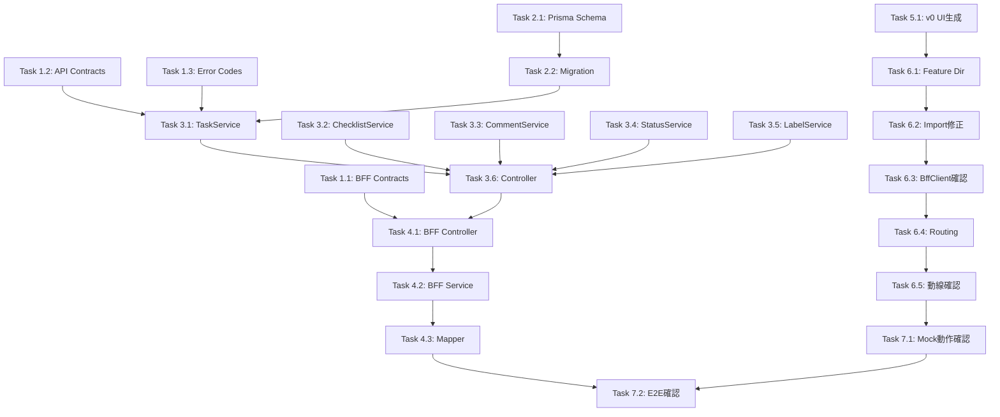

# Implementation Tasks

## Feature: kpi/action-plan-kanban

---

## Overview

本ドキュメントは `kpi/action-plan-kanban` Feature の実装タスクを定義する。
CCSDD ワークフローに従い、Contracts → DB → Domain API → BFF → UI の順序で実装する。

---

## Task Summary

| Chapter | タスク数 | 概要 |
|---------|---------|------|
| 1 | 3 | Contracts（BFF/API DTO、Errors） |
| 2 | 2 | Database（Prisma Schema、Migration） |
| 3 | 6 | Domain API（Services、Repositories、Controller） |
| 4 | 3 | BFF（Controller、Service、Mapper） |
| 5 | 1 | v0 UI生成 |
| 6 | 5 | UI移植・実装 |
| 7 | 2 | 動作確認・テスト |

**合計: 22 タスク**

---

## Chapter 1: Contracts

### Task 1.1: BFF Contracts 定義
- [ ] `packages/contracts/src/bff/action-plan-kanban/index.ts` 作成
- [ ] カンバンボード関連 DTO:
  - `BffKanbanBoard`, `BffKanbanColumn`, `BffTaskCard`
  - `BffTaskLabelBrief`, `BffAssigneeBrief`
- [ ] タスク詳細関連 DTO:
  - `BffTaskDetail`, `BffChecklistItem`, `BffTaskComment`
- [ ] Request DTO:
  - `BffCreateTaskRequest`, `BffUpdateTaskRequest`
  - `BffUpdateTaskStatusRequest`, `BffReorderTasksRequest`
  - `BffCreateChecklistRequest`, `BffUpdateChecklistRequest`
  - `BffCreateCommentRequest`, `BffUpdateCommentRequest`
  - `BffAddLabelRequest`, `BffAddAssigneeRequest`
- [ ] ステータス管理 DTO:
  - `BffTaskStatus`, `BffListStatusesResponse`
  - `BffCreateStatusRequest`, `BffUpdateStatusRequest`, `BffReorderStatusesRequest`
- [ ] ラベル管理 DTO:
  - `BffTaskLabel`, `BffListLabelsResponse`
  - `BffCreateLabelRequest`, `BffUpdateLabelRequest`

**Acceptance Criteria:**
- 全 DTO が design.md 定義と一致
- camelCase 命名規則

### Task 1.2: API Contracts 定義
- [ ] `packages/contracts/src/api/action-plan-kanban/index.ts` 作成
- [ ] Domain API 用 DTO（BFF DTO から snake_case 変換不要、API内部でマッピング）
- [ ] Query DTO（pagination: offset/limit）

**Acceptance Criteria:**
- BFF から API への変換が明確

### Task 1.3: Error Codes 定義
- [ ] `packages/contracts/src/shared/errors/action-plan-kanban-error.ts` 作成
- [ ] `ActionPlanKanbanErrorCode` enum:
  - `TASK_NOT_FOUND`
  - `CHECKLIST_ITEM_NOT_FOUND`
  - `COMMENT_NOT_FOUND`
  - `COMMENT_NOT_OWNER`
  - `OPTIMISTIC_LOCK_ERROR`
  - `STATUS_NOT_FOUND`
  - `STATUS_CODE_DUPLICATE`
  - `STATUS_IN_USE`
  - `STATUS_IS_DEFAULT`
  - `LABEL_NOT_FOUND`
  - `LABEL_NAME_DUPLICATE`

**Acceptance Criteria:**
- design.md の Error Handling と一致

---

## Chapter 2: Database

### Task 2.1: Prisma Schema 更新
- [ ] `packages/db/prisma/schema.prisma` に以下を追加/更新:
  - `ActionPlanTask` モデル（既存の場合は確認）
  - `TaskStatus` モデル（action_plan_id 参照）
  - `TaskLabel` モデル（action_plan_id 参照）
  - `TaskLabelAssignment` モデル
  - `TaskAssignee` モデル
  - `TaskChecklistItem` モデル
  - `TaskComment` モデル
- [ ] リレーション定義（cascade delete 含む）
- [ ] インデックス定義

**Acceptance Criteria:**
- エンティティ定義（01_各種マスタ.md 14.3-14.9）と一致
- RLS 対応（tenant_id 必須）

### Task 2.2: Migration 実行
- [ ] `prisma migrate dev --name add_kanban_tables` 実行
- [ ] RLS Policy 追加（SQL migration）

**Acceptance Criteria:**
- Migration 成功
- RLS 有効化確認

---

## Chapter 3: Domain API

### Task 3.1: TaskService 実装
- [ ] `apps/api/src/modules/kpi/action-plan-kanban/services/task.service.ts` 作成
- [ ] タスク CRUD:
  - `create(tenantId, data)` - デフォルトステータス設定
  - `update(tenantId, id, data)` - 楽観的ロック
  - `delete(tenantId, id)` - カスケード削除
- [ ] ステータス変更:
  - `updateStatus(tenantId, id, statusId, sortOrder)`
- [ ] 並び順変更:
  - `reorder(tenantId, orders)`

**Acceptance Criteria:**
- Req 2-5, 10 対応
- 楽観的ロック実装（updated_at チェック）

### Task 3.2: ChecklistService 実装
- [ ] `apps/api/src/modules/kpi/action-plan-kanban/services/checklist.service.ts` 作成
- [ ] CRUD:
  - `create(tenantId, taskId, data)`
  - `update(tenantId, id, data)` - 完了切替含む
  - `delete(tenantId, id)`

**Acceptance Criteria:**
- Req 6 対応

### Task 3.3: CommentService 実装
- [ ] `apps/api/src/modules/kpi/action-plan-kanban/services/comment.service.ts` 作成
- [ ] CRUD:
  - `create(tenantId, taskId, userId, data)`
  - `update(tenantId, id, userId, data)` - 所有者チェック
  - `delete(tenantId, id, userId)` - 所有者チェック

**Acceptance Criteria:**
- Req 7 対応
- 自分のコメントのみ編集/削除可

### Task 3.4: StatusService 実装
- [ ] `apps/api/src/modules/kpi/action-plan-kanban/services/status.service.ts` 作成
- [ ] CRUD:
  - `list(tenantId, planId)`
  - `create(tenantId, planId, data)`
  - `update(tenantId, id, data)`
  - `delete(tenantId, id)` - 使用中チェック、デフォルト不可
  - `reorder(tenantId, planId, orders)`
- [ ] ビジネスルール:
  - `is_default=true` は1つのみ
  - タスク使用中のステータスは削除不可

**Acceptance Criteria:**
- Req 12 対応

### Task 3.5: LabelService 実装
- [ ] `apps/api/src/modules/kpi/action-plan-kanban/services/label.service.ts` 作成
- [ ] CRUD:
  - `list(tenantId, planId)`
  - `create(tenantId, planId, data)`
  - `update(tenantId, id, data)`
  - `delete(tenantId, id)` - 紐付け削除含む

**Acceptance Criteria:**
- Req 13 対応

### Task 3.6: KanbanController 実装
- [ ] `apps/api/src/modules/kpi/action-plan-kanban/kanban.controller.ts` 作成
- [ ] 全エンドポイント実装（design.md BFF Endpoints 参照）
- [ ] 権限チェック（epm.actionplan.read/create/update/delete/admin）
- [ ] tenant_id/user_id ヘッダー解決

**Acceptance Criteria:**
- Req 11 対応
- 全エンドポイント動作

---

## Chapter 4: BFF

### Task 4.1: KanbanBffController 実装
- [ ] `apps/bff/src/modules/kpi/action-plan-kanban/kanban.controller.ts` 作成
- [ ] 全 BFF エンドポイント実装
- [ ] tenant_id/user_id 解決・ヘッダー伝搬

**Acceptance Criteria:**
- design.md BFF Endpoints 全件対応

### Task 4.2: KanbanBffService 実装
- [ ] `apps/bff/src/modules/kpi/action-plan-kanban/kanban.service.ts` 作成
- [ ] Domain API 呼び出し
- [ ] レスポンス集約（カンバンボード = タスク + ステータス + ラベル + 担当者 + チェックリスト進捗）

**Acceptance Criteria:**
- Req 1 対応（カンバンボード取得）

### Task 4.3: Mapper 実装
- [ ] `apps/bff/src/modules/kpi/action-plan-kanban/kanban.mapper.ts` 作成
- [ ] API DTO → BFF DTO 変換
- [ ] 命名変換:
  - `is_checked` → `isCompleted`
  - `comment_text` → `content`
- [ ] 担当者名・作成者名の解決

**Acceptance Criteria:**
- design.md Transformation Rules 対応

---

## Chapter 5: v0 UI 生成

### Task 5.1: v0 でカンバン UI 生成
- [ ] `v0-prompt.md` を使用して v0 でUI生成
- [ ] 生成先: `apps/web/_v0_drop/kpi/action-plan-kanban/src/`
- [ ] 必須コンポーネント:
  - KanbanBoardPage.tsx
  - KanbanColumn.tsx
  - TaskCard.tsx
  - TaskDetailModal.tsx
  - TaskCreateInput.tsx
  - ChecklistSection.tsx
  - CommentsSection.tsx
  - LabelSelector.tsx
  - AssigneeSelector.tsx
  - FilterPanel.tsx
  - DeleteConfirmDialog.tsx
  - StatusEditPopover.tsx
  - LabelEditPopover.tsx
  - ColorPicker.tsx
- [ ] API クライアント:
  - BffClient.ts（interface）
  - MockBffClient.ts（モック実装）
  - HttpBffClient.ts（HTTP 実装）
- [ ] OUTPUT.md 確認

**Acceptance Criteria:**
- v0-prompt.md の Output Structure と一致
- MockBffClient でプレビュー動作

---

## Chapter 6: UI 移植・実装

### Task 6.1: Feature ディレクトリ作成
- [ ] `apps/web/src/features/kpi/action-plan-kanban/` 作成
- [ ] ディレクトリ構造:
  ```
  action-plan-kanban/
  ├── api/
  │   ├── BffClient.ts
  │   ├── MockBffClient.ts
  │   ├── HttpBffClient.ts
  │   └── client.ts
  ├── components/
  │   ├── KanbanBoardPage.tsx
  │   ├── KanbanColumn.tsx
  │   ├── TaskCard.tsx
  │   ├── TaskDetailModal.tsx
  │   ├── ... (その他コンポーネント)
  │   └── index.ts
  ├── lib/
  │   ├── types.ts
  │   └── error-messages.ts
  └── index.ts
  ```

**Acceptance Criteria:**
- structure.md 準拠

### Task 6.2: v0 出力のインポートパス修正
- [ ] `@/components/ui` → `@/shared/ui`
- [ ] `@epm/contracts/bff/action-plan-kanban` → 実際のパス確認

**Acceptance Criteria:**
- TypeScript コンパイル成功

### Task 6.3: BffClient 実装確認
- [ ] MockBffClient が design.md DTO 形状でデータ返却
- [ ] HttpBffClient が BFF エンドポイント呼び出し

**Acceptance Criteria:**
- クライアント切替可能

### Task 6.4: ルーティング設定
- [ ] `apps/web/src/app/kanban/[planId]/page.tsx` 作成
- [ ] Feature コンポーネントを re-export

**Acceptance Criteria:**
- `/kanban/{planId}` でアクセス可能

### Task 6.5: KPI 画面からの動線確認
- [ ] `kpi-detail-panel.tsx` の [かんばん] ボタンが `/kanban/{actionPlanId}` に遷移
- [ ] 遷移パラメータ確認

**Acceptance Criteria:**
- KPI画面 → かんばん画面の動線が機能

---

## Chapter 7: 動作確認・テスト

### Task 7.1: MockBffClient での動作確認
- [ ] `pnpm dev` でローカル起動
- [ ] カンバンボード表示
- [ ] ドラッグ&ドロップ動作
- [ ] タスク詳細モーダル
- [ ] チェックリスト・コメント
- [ ] ステータス・ラベル編集

**Acceptance Criteria:**
- Req 1-13 の UI 動作確認

### Task 7.2: HttpBffClient での E2E 確認
- [ ] BFF + Domain API 起動
- [ ] 実データでの CRUD 動作確認
- [ ] 権限制御確認
- [ ] エラーハンドリング確認

**Acceptance Criteria:**
- 本番相当の動作確認

---

## Dependencies



---

## Phase 1 優先タスク（UI先行）

MockBffClient パターンでUI先行開発する場合の優先順序:

1. **Task 1.1**: BFF Contracts 定義（DTO形状確定）
2. **Task 5.1**: v0 UI生成
3. **Task 6.1-6.5**: UI移植・実装
4. **Task 7.1**: Mock動作確認

Backend（Chapter 2-4）は並行して進行可能。

---

## 変更履歴

| 日付 | 変更内容 | 担当 |
|------|---------|------|
| 2026-01-26 | 初版作成 | Claude Code |
