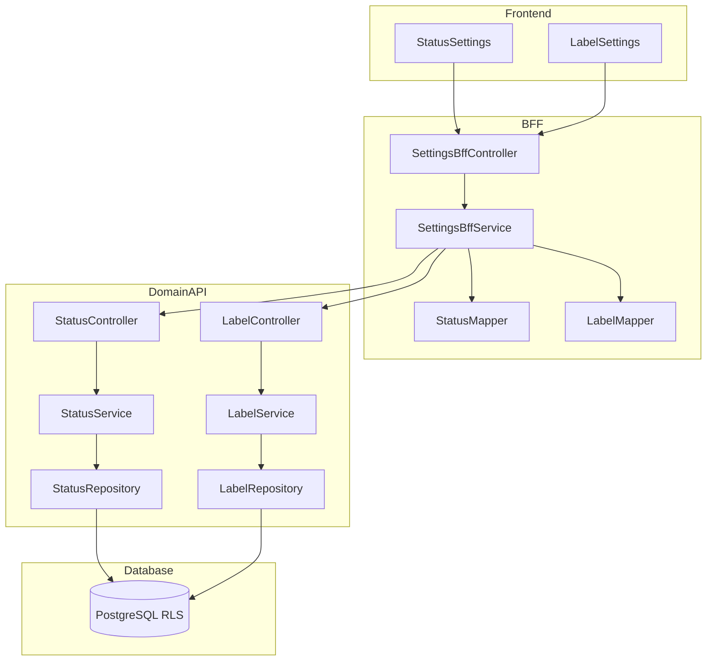

# Technical Design Document

## Feature: kpi/action-plan-settings

---

## Spec Reference（INPUT情報）

本設計を作成するにあたり、以下の情報を確認した：

### Requirements（直接INPUT）
- **参照ファイル**: `.kiro/specs/kpi/action-plan-settings/requirements.md`
- **要件バージョン**: 2026-01-09

### 仕様概要（確定済み仕様）
- **参照ファイル**: `.kiro/specs/仕様概要/KPIアクションプラン管理.md`
- **設計に影響する仕様ポイント**:
  - ステータス管理は会社ごとにカスタマイズ可能
  - 保存方式は即時保存（Trelloスタイル）
  - 権限：`epm.actionplan.admin` でステータス・ラベル設定を管理

### エンティティ定義（Data Model 正本）
- **参照ファイル**: `.kiro/specs/entities/01_各種マスタ.md`
- **対象エンティティ**: task_statuses（14.4）、task_labels（14.5）

### 仕様検討（経緯・背景）※参考
- **参照ファイル**: `.kiro/specs/仕様検討/20260109_KPIアクションプラン管理.md`
- **設計判断に影響した経緯**: Trello準拠のカンバン機能実装

---

## INPUT整合性チェック

| チェック項目 | 確認結果 |
|-------------|---------|
| requirements.md との整合性 | 設計が全要件をカバーしている: ✅ |
| 仕様概要との整合性 | 設計が仕様概要と矛盾しない: ✅ |
| エンティティとの整合性 | Data Model がエンティティ定義に準拠: ✅ |
| 仕様検討の背景理解 | 設計判断の背景を確認した: ✅ |

---

## Overview

本Featureは、KPIアクションプラン機能のカンバンボードで使用するタスクステータスとラベルを会社ごとにカスタマイズする設定機能を提供する。ステータスはカンバンボードの列（レーン）に対応し、ラベルはタスクへの色タグ付与機能として使用される。

設定画面では、ステータス・ラベルそれぞれに対してCRUD操作と並び順変更（ドラッグ&ドロップ）を提供し、即時保存方式（Trelloスタイル）を採用する。権限は `epm.actionplan.admin` で制御し、管理者のみが設定変更可能とする。

---

## Architecture

### Architecture Pattern & Boundary Map

**Pattern (fixed)**:
- UI（apps/web） → BFF（apps/bff） → Domain API（apps/api） → DB（PostgreSQL + RLS）
- UI直APIは禁止



**Contracts (SSoT)**:
- UI ↔ BFF: `packages/contracts/src/bff/action-plan-settings`
- BFF ↔ Domain API: `packages/contracts/src/api/action-plan-settings`
- Enum/Error: `packages/contracts/src/shared/errors`
- UI は `packages/contracts/src/api` を参照してはならない

---

## Architecture Responsibilities（Mandatory）

### BFF Specification（apps/bff）

**Purpose**
- UI要件に最適化したAPI（Read Model / ViewModel）
- Domain APIのレスポンスを集約・変換（ビジネスルールの正本は持たない）

**BFF Endpoints（UIが叩く）**

| Method | Endpoint | Purpose | Request DTO (contracts/bff) | Response DTO (contracts/bff) | Req |
|--------|----------|---------|-----------------------------|-----------------------------|-----|
| GET | /api/bff/action-plan/settings/statuses | ステータス一覧取得 | - | BffListStatusesResponse | 1.1, 1.2 |
| POST | /api/bff/action-plan/settings/statuses | ステータス新規作成 | BffCreateStatusRequest | BffStatusResponse | 2.1-2.6 |
| PATCH | /api/bff/action-plan/settings/statuses/:id | ステータス編集 | BffUpdateStatusRequest | BffStatusResponse | 3.1-3.5 |
| PATCH | /api/bff/action-plan/settings/statuses/reorder | ステータス並び順変更 | BffReorderStatusesRequest | BffListStatusesResponse | 4.1-4.3 |
| DELETE | /api/bff/action-plan/settings/statuses/:id | ステータス削除 | - | void | 5.1-5.5 |
| POST | /api/bff/action-plan/settings/statuses/initialize | 初期ステータス作成 | - | BffListStatusesResponse | 11.1, 11.2 |
| GET | /api/bff/action-plan/settings/labels | ラベル一覧取得 | - | BffListLabelsResponse | 6.1, 6.2 |
| POST | /api/bff/action-plan/settings/labels | ラベル新規作成 | BffCreateLabelRequest | BffLabelResponse | 7.1-7.5 |
| PATCH | /api/bff/action-plan/settings/labels/:id | ラベル編集 | BffUpdateLabelRequest | BffLabelResponse | 8.1-8.5 |
| PATCH | /api/bff/action-plan/settings/labels/reorder | ラベル並び順変更 | BffReorderLabelsRequest | BffListLabelsResponse | 9.1-9.3 |
| DELETE | /api/bff/action-plan/settings/labels/:id | ラベル削除 | - | void | 10.1-10.4 |
| POST | /api/bff/action-plan/settings/labels/initialize | 初期ラベル作成 | - | BffListLabelsResponse | 11.3, 11.4 |

**Naming Convention（必須）**
- DTO / Contracts: camelCase（例: `statusCode`, `statusName`, `labelName`）
- DB columns: snake_case（例: `status_code`, `status_name`, `label_name`）
- `sortBy` は **DTO側キー**を採用する（例: `sortOrder`）
- DB列名（snake_case）を UI/BFF へ露出させない

**Paging / Sorting（設定画面のため簡略化）**
- 本機能は一覧件数が少ない（通常10件未満）ためページングは不要
- ソートは常に sort_order 昇順固定

**Transformation Rules（api DTO → bff DTO）**
- field名は同一（camelCase維持）
- 日付は ISO 8601 文字列として返却
- updatedAt は楽観的ロック用にそのまま返却

**Error Policy（必須）**
- この Feature における BFF の Error Policy は以下とする：
  - 採用方針：**Option A: Pass-through**
  - 採用理由：
    - ステータス・ラベル設定は標準的なCRUD操作であり、特別なUI整形は不要
    - Domain APIのエラーコードは明確で、UIで直接ハンドリング可能
    - ビジネスロジックの正本は Domain API であり、BFFでの再分類は不要

**Error Handling（contracts errorに準拠）**

| Domain API Error | HTTP Status | BFF Action | Req |
|-----------------|-------------|------------|-----|
| STATUS_NOT_FOUND | 404 | Pass-through | 3.1, 5.1 |
| STATUS_CODE_DUPLICATE | 409 | Pass-through | 2.4 |
| STATUS_IN_USE | 409 | Pass-through | 5.3 |
| STATUS_IS_DEFAULT | 409 | Pass-through | 5.5 |
| LABEL_NOT_FOUND | 404 | Pass-through | 8.1, 10.1 |
| LABEL_NAME_DUPLICATE | 409 | Pass-through | 7.4, 8.5 |
| OPTIMISTIC_LOCK_ERROR | 409 | Pass-through | 3.4, 8.4 |
| FORBIDDEN | 403 | Pass-through | 12.1-12.3 |

**Authentication / Tenant Context**
- tenant_id / user_id は認証ミドルウェアで解決し、リクエストコンテキストに付与
- Domain API へは `x-tenant-id` / `x-user-id` ヘッダーで伝搬
- 権限チェック: `epm.actionplan.admin` を BFF でも早期チェック（最終判断は Domain API）

---

### Service Specification（Domain / apps/api）

**Purpose**
- ビジネスルールの正本（BFF/UIは禁止）
- Transaction boundary / audit points を必ず明記

**Domain API Endpoints - Status**

| Method | Endpoint | Purpose | Transaction | Audit | Req |
|--------|----------|---------|-------------|-------|-----|
| GET | /api/action-plan/settings/statuses | 一覧取得 | Read-only | - | 1.1, 1.2 |
| POST | /api/action-plan/settings/statuses | 新規作成 | Write | created_at | 2.1-2.6 |
| PATCH | /api/action-plan/settings/statuses/:id | 更新 | Write | updated_at | 3.1-3.5 |
| PATCH | /api/action-plan/settings/statuses/reorder | 並び順変更 | Write（複数行） | updated_at | 4.1-4.3 |
| DELETE | /api/action-plan/settings/statuses/:id | 削除 | Write | - | 5.1-5.5 |
| POST | /api/action-plan/settings/statuses/initialize | 初期データ作成 | Write（複数行） | created_at | 11.1, 11.2 |

**Domain API Endpoints - Label**

| Method | Endpoint | Purpose | Transaction | Audit | Req |
|--------|----------|---------|-------------|-------|-----|
| GET | /api/action-plan/settings/labels | 一覧取得 | Read-only | - | 6.1, 6.2 |
| POST | /api/action-plan/settings/labels | 新規作成 | Write | created_at | 7.1-7.5 |
| PATCH | /api/action-plan/settings/labels/:id | 更新 | Write | updated_at | 8.1-8.5 |
| PATCH | /api/action-plan/settings/labels/reorder | 並び順変更 | Write（複数行） | updated_at | 9.1-9.3 |
| DELETE | /api/action-plan/settings/labels/:id | 削除 | Write（複数行） | - | 10.1-10.4 |
| POST | /api/action-plan/settings/labels/initialize | 初期データ作成 | Write（複数行） | created_at | 11.3, 11.4 |

**Business Rules（StatusService 責務）**
- ステータスコード重複チェック（tenant_id + company_id + status_code）: Req 2.3, 2.4
- is_default = true は会社内で1件のみ（新規作成/更新時に既存をfalseに）: Req 2.6, 3.5
- 削除前にタスク使用チェック（action_plan_tasks.status_id）: Req 5.2, 5.3
- is_default = true のステータスは削除禁止: Req 5.5
- 楽観的ロック（updated_at検証）: Req 3.3, 3.4
- 権限チェック（epm.actionplan.admin）: Req 12.1

**Business Rules（LabelService 責務）**
- ラベル名重複チェック（tenant_id + company_id + label_name）: Req 7.3, 7.4, 8.5
- 削除時にラベル紐付け（task_label_assignments）を先に削除: Req 10.2, 10.3
- 楽観的ロック（updated_at検証）: Req 8.3, 8.4
- 権限チェック（epm.actionplan.admin）: Req 12.2

**Initial Data（Req 11.2, 11.4）**

| ステータス | status_code | color_code | is_default | is_completed |
|-----------|-------------|------------|------------|--------------|
| 未着手 | NOT_STARTED | #6B7280 | true | false |
| 進行中 | IN_PROGRESS | #3B82F6 | false | false |
| レビュー中 | REVIEW | #F59E0B | false | false |
| 完了 | COMPLETED | #10B981 | false | true |

| ラベル | label_name | color_code |
|--------|------------|------------|
| 重要 | 重要 | #EF4444 |
| 急ぎ | 急ぎ | #F59E0B |
| 確認待ち | 確認待ち | #3B82F6 |
| 完了間近 | 完了間近 | #10B981 |

---

### Repository Specification（apps/api）

**StatusRepository**
- tenant_id 必須（全メソッド）
- where句二重ガード必須
- set_config 前提（RLS無効化禁止）

```typescript
interface StatusRepository {
  findAll(tenantId: string, companyId: string): Promise<TaskStatus[]>;
  findById(tenantId: string, id: string): Promise<TaskStatus | null>;
  findByCode(tenantId: string, companyId: string, statusCode: string): Promise<TaskStatus | null>;
  create(tenantId: string, data: CreateStatusData): Promise<TaskStatus>;
  update(tenantId: string, id: string, data: UpdateStatusData): Promise<TaskStatus>;
  delete(tenantId: string, id: string): Promise<void>;
  updateSortOrders(tenantId: string, updates: SortOrderUpdate[]): Promise<void>;
  getMaxSortOrder(tenantId: string, companyId: string): Promise<number>;
  countTasksUsingStatus(tenantId: string, statusId: string): Promise<number>;
  resetDefaultFlag(tenantId: string, companyId: string): Promise<void>;
}
```

**LabelRepository**
```typescript
interface LabelRepository {
  findAll(tenantId: string, companyId: string): Promise<TaskLabel[]>;
  findById(tenantId: string, id: string): Promise<TaskLabel | null>;
  findByName(tenantId: string, companyId: string, labelName: string): Promise<TaskLabel | null>;
  create(tenantId: string, data: CreateLabelData): Promise<TaskLabel>;
  update(tenantId: string, id: string, data: UpdateLabelData): Promise<TaskLabel>;
  delete(tenantId: string, id: string): Promise<void>;
  updateSortOrders(tenantId: string, updates: SortOrderUpdate[]): Promise<void>;
  getMaxSortOrder(tenantId: string, companyId: string): Promise<number>;
  deleteAssignmentsByLabelId(tenantId: string, labelId: string): Promise<number>;
}
```

---

### Contracts Summary（This Feature）

**packages/contracts/src/bff/action-plan-settings**

```typescript
// === Status DTOs ===
export interface BffTaskStatus {
  id: string;
  statusCode: string;
  statusName: string;
  colorCode: string | null;
  sortOrder: number;
  isDefault: boolean;
  isCompleted: boolean;
  isActive: boolean;
  updatedAt: string;
}

export interface BffListStatusesResponse {
  statuses: BffTaskStatus[];
}

export interface BffCreateStatusRequest {
  statusCode: string;
  statusName: string;
  colorCode?: string;
  isDefault?: boolean;
  isCompleted?: boolean;
}

export interface BffUpdateStatusRequest {
  statusCode?: string;
  statusName?: string;
  colorCode?: string;
  isDefault?: boolean;
  isCompleted?: boolean;
  updatedAt: string; // 楽観的ロック用
}

export interface BffReorderStatusesRequest {
  orders: { id: string; sortOrder: number }[];
}

export interface BffStatusResponse {
  status: BffTaskStatus;
}

// === Label DTOs ===
export interface BffTaskLabel {
  id: string;
  labelName: string;
  colorCode: string;
  sortOrder: number;
  isActive: boolean;
  updatedAt: string;
}

export interface BffListLabelsResponse {
  labels: BffTaskLabel[];
}

export interface BffCreateLabelRequest {
  labelName: string;
  colorCode: string;
}

export interface BffUpdateLabelRequest {
  labelName?: string;
  colorCode?: string;
  updatedAt: string; // 楽観的ロック用
}

export interface BffReorderLabelsRequest {
  orders: { id: string; sortOrder: number }[];
}

export interface BffLabelResponse {
  label: BffTaskLabel;
}
```

**packages/contracts/src/api/action-plan-settings**
- BFFと同一構造（Mapper は直接変換）

**packages/contracts/src/shared/errors/action-plan-settings-error.ts**
```typescript
export enum ActionPlanSettingsErrorCode {
  STATUS_NOT_FOUND = 'STATUS_NOT_FOUND',
  STATUS_CODE_DUPLICATE = 'STATUS_CODE_DUPLICATE',
  STATUS_IN_USE = 'STATUS_IN_USE',
  STATUS_IS_DEFAULT = 'STATUS_IS_DEFAULT',
  LABEL_NOT_FOUND = 'LABEL_NOT_FOUND',
  LABEL_NAME_DUPLICATE = 'LABEL_NAME_DUPLICATE',
  OPTIMISTIC_LOCK_ERROR = 'OPTIMISTIC_LOCK_ERROR',
}
```

---

## Responsibility Clarification（Mandatory）

本Featureにおける責務境界を以下に明記する。
未記載の責務は実装してはならない。

### UIの責務
- ステータス・ラベル一覧の表示: Req 1.1, 1.2, 6.1, 6.2
- 作成・編集ダイアログの表示制御: Req 2.1, 3.1, 7.1, 8.1
- ドラッグ&ドロップによる並び替えUI: Req 4.1, 9.1
- 削除確認ダイアログの表示: Req 5.1, 10.1
- 権限に応じたボタン表示制御: Req 12.4
- 初期データ未作成時のメッセージ表示: Req 1.3, 6.3, 11.1, 11.3
- ラベル削除時の警告表示: Req 10.4
- ビジネス判断は禁止

### BFFの責務
- 認証情報から tenant_id / company_id の解決
- Domain API呼び出しとDTO変換
- 権限の早期チェック（UX向上目的、最終判断はDomain API）
- ビジネスルールの正本は持たない

### Domain APIの責務
- ビジネスルールの正本
  - ステータスコード重複チェック: Req 2.3, 2.4
  - ラベル名重複チェック: Req 7.3, 7.4, 8.5
  - デフォルトステータス排他制御: Req 2.6, 3.5
  - 使用中ステータス削除禁止: Req 5.2, 5.3
  - デフォルトステータス削除禁止: Req 5.5
  - ラベル紐付け削除: Req 10.2, 10.3
- 楽観的ロック検証: Req 3.3, 3.4, 8.3, 8.4
- 権限の最終判断: Req 12.1, 12.2, 12.3
- 監査ログ・整合性保証

---

## Data Model（エンティティ整合性確認必須）

### Entity Reference
- 参照元: `.kiro/specs/entities/01_各種マスタ.md` セクション 14.4, 14.5

### エンティティ整合性チェックリスト

| チェック項目 | 確認結果 |
|-------------|---------|
| カラム網羅性 | エンティティ定義の全カラムがDTO/Prismaに反映されている: ✅ |
| 型の一致 | varchar→String, numeric→Decimal 等の型変換が正確: ✅ |
| 制約の反映 | UNIQUE/CHECK制約がPrisma/アプリ検証に反映: ✅ |
| ビジネスルール | エンティティ補足のルールがServiceに反映: ✅ |
| NULL許可 | NULL/NOT NULLがPrisma?/必須に正しく対応: ✅ |

### Prisma Schema

```prisma
model TaskStatus {
  id          String   @id @default(uuid())
  tenantId    String   @map("tenant_id")
  companyId   String   @map("company_id")
  statusCode  String   @map("status_code") @db.VarChar(30)
  statusName  String   @map("status_name") @db.VarChar(50)
  colorCode   String?  @map("color_code") @db.VarChar(7)
  sortOrder   Int      @map("sort_order")
  isDefault   Boolean  @default(false) @map("is_default")
  isCompleted Boolean  @default(false) @map("is_completed")
  isActive    Boolean  @default(true) @map("is_active")
  createdAt   DateTime @default(now()) @map("created_at")
  updatedAt   DateTime @updatedAt @map("updated_at")

  company Company @relation(fields: [tenantId, companyId], references: [tenantId, id])
  tasks   ActionPlanTask[]

  @@unique([tenantId, companyId, statusCode])
  @@map("task_statuses")
}

model TaskLabel {
  id         String   @id @default(uuid())
  tenantId   String   @map("tenant_id")
  companyId  String   @map("company_id")
  labelName  String   @map("label_name") @db.VarChar(50)
  colorCode  String   @map("color_code") @db.VarChar(7)
  sortOrder  Int      @map("sort_order")
  isActive   Boolean  @default(true) @map("is_active")
  createdAt  DateTime @default(now()) @map("created_at")
  updatedAt  DateTime @updatedAt @map("updated_at")

  company     Company                @relation(fields: [tenantId, companyId], references: [tenantId, id])
  assignments TaskLabelAssignment[]

  @@unique([tenantId, companyId, labelName])
  @@map("task_labels")
}

model TaskLabelAssignment {
  id        String   @id @default(uuid())
  tenantId  String   @map("tenant_id")
  taskId    String   @map("task_id")
  labelId   String   @map("label_id")
  createdAt DateTime @default(now()) @map("created_at")

  task  ActionPlanTask @relation(fields: [tenantId, taskId], references: [tenantId, id])
  label TaskLabel      @relation(fields: [tenantId, labelId], references: [tenantId, id])

  @@unique([tenantId, taskId, labelId])
  @@map("task_label_assignments")
}
```

### Constraints（エンティティ定義から転記）

**task_statuses**
- PK: id（UUID）
- UNIQUE: (tenant_id, company_id, status_code)
- FK: (tenant_id, company_id) → companies(tenant_id, id)
- CHECK: color_code は #RRGGBB 形式（アプリケーション層で検証）
- BUSINESS: is_default = true は会社内で1件のみ（UseCase で検証）

**task_labels**
- PK: id（UUID）
- UNIQUE: (tenant_id, company_id, label_name)
- FK: (tenant_id, company_id) → companies(tenant_id, id)
- CHECK: color_code は #RRGGBB 形式（アプリケーション層で検証）

### RLS Policy

```sql
ALTER TABLE task_statuses ENABLE ROW LEVEL SECURITY;

CREATE POLICY tenant_isolation ON task_statuses
  USING (tenant_id::text = current_setting('app.tenant_id', true));

ALTER TABLE task_labels ENABLE ROW LEVEL SECURITY;

CREATE POLICY tenant_isolation ON task_labels
  USING (tenant_id::text = current_setting('app.tenant_id', true));

ALTER TABLE task_label_assignments ENABLE ROW LEVEL SECURITY;

CREATE POLICY tenant_isolation ON task_label_assignments
  USING (tenant_id::text = current_setting('app.tenant_id', true));
```

---

## Requirements Traceability

| Requirement | Summary | Components | Interfaces | Flows |
|-------------|---------|------------|------------|-------|
| 1.1, 1.2, 1.3 | ステータス一覧表示 | StatusSettingsUI, SettingsBffService, StatusService, StatusRepository | GET /statuses | List |
| 2.1-2.6 | ステータス新規作成 | StatusSettingsUI, SettingsBffService, StatusService, StatusRepository | POST /statuses | Create |
| 3.1-3.5 | ステータス編集 | StatusSettingsUI, SettingsBffService, StatusService, StatusRepository | PATCH /statuses/:id | Update |
| 4.1-4.3 | ステータス並び順変更 | StatusSettingsUI, SettingsBffService, StatusService, StatusRepository | PATCH /statuses/reorder | Reorder |
| 5.1-5.5 | ステータス削除 | StatusSettingsUI, SettingsBffService, StatusService, StatusRepository | DELETE /statuses/:id | Delete |
| 6.1, 6.2, 6.3 | ラベル一覧表示 | LabelSettingsUI, SettingsBffService, LabelService, LabelRepository | GET /labels | List |
| 7.1-7.5 | ラベル新規作成 | LabelSettingsUI, SettingsBffService, LabelService, LabelRepository | POST /labels | Create |
| 8.1-8.5 | ラベル編集 | LabelSettingsUI, SettingsBffService, LabelService, LabelRepository | PATCH /labels/:id | Update |
| 9.1-9.3 | ラベル並び順変更 | LabelSettingsUI, SettingsBffService, LabelService, LabelRepository | PATCH /labels/reorder | Reorder |
| 10.1-10.4 | ラベル削除 | LabelSettingsUI, SettingsBffService, LabelService, LabelRepository | DELETE /labels/:id | Delete |
| 11.1-11.4 | 初期データ作成 | StatusSettingsUI, LabelSettingsUI, SettingsBffService, StatusService, LabelService | POST /initialize | Initialize |
| 12.1-12.4 | 権限制御 | All components | All endpoints | Auth Guard |

---

## 変更履歴

| 日付 | 変更内容 | 担当 |
|------|---------|------|
| 2026-01-09 | 初版作成 | Claude Code |
