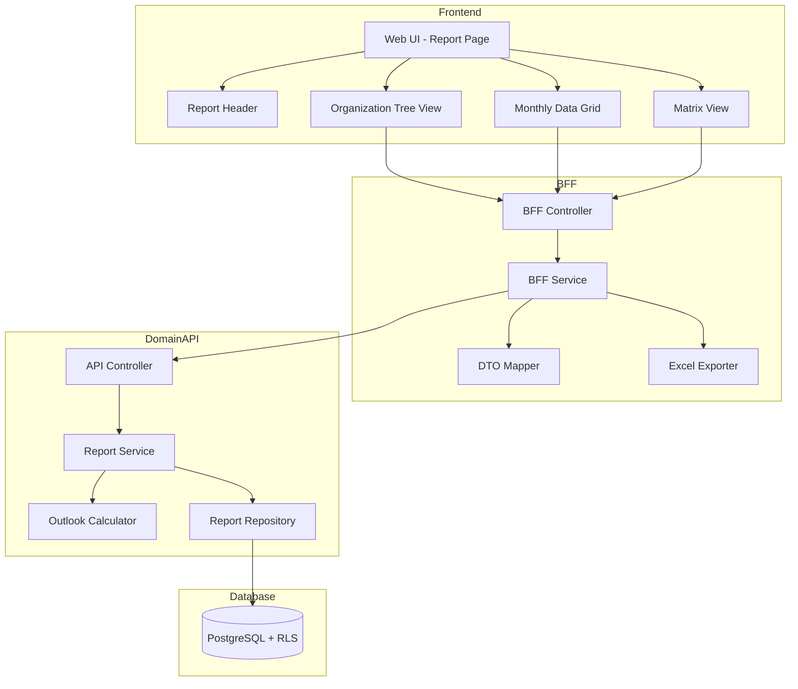
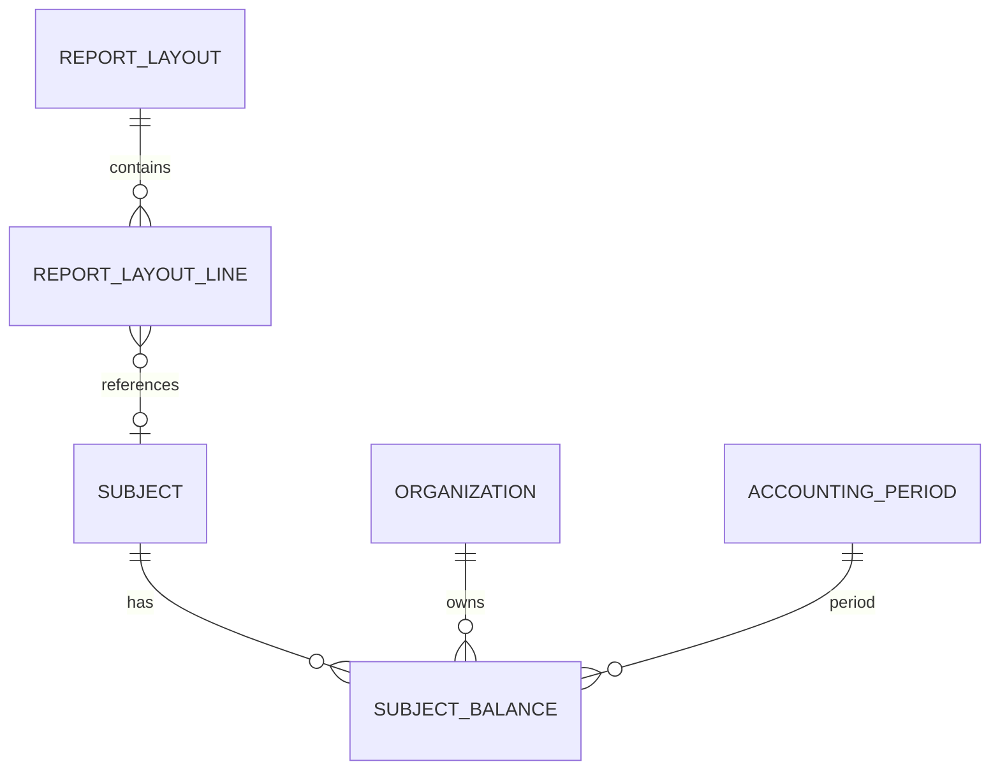

# Technical Design Document

## Feature: report/budget-actual-report

---

## Spec Reference（INPUT情報）

本設計を作成するにあたり、以下の情報を確認した：

### Requirements（直接INPUT）
- **参照ファイル**: `.kiro/specs/kpi/budget-actual-report/requirements.md`
- **要件バージョン**: 2026-01-13

### 仕様概要（確定済み仕様）
- **参照ファイル**: `apps/web/_v0_drop/forecast-input-feature/` (v0モック)
- **設計に影響する仕様ポイント**:
  - 2タブ構成（組織別レポート、マトリックス分析）
  - 組織ツリー + 月次データグリッド
  - マトリクス表示（行: 科目、列: 組織階層）
  - 見通し = 実績済み + 残見込
  - 比較モード3パターン（予算vs実績+見込、今回vs前回見込、当年vs前年）

### エンティティ定義（Data Model 正本）
- **参照ファイル**: `.kiro/specs/master-data/report-layout/design.md`, `.kiro/specs/master-data/subject-master/design.md`
- **対象エンティティ**: ReportLayout, ReportLayoutLine, Subject, Organization, SubjectBalance

### 仕様検討（経緯・背景）※参考
- **設計判断に影響した経緯**: Phase 1は基本機能（組織別レポート、マトリクス分析）に集中、ウォーターフォール差異分析やAIインサイトはPhase 2以降

---

## INPUT整合性チェック

| チェック項目 | 確認結果 |
|-------------|---------|
| requirements.md との整合性 | 設計が全要件をカバーしている: ✅ |
| v0モックとの整合性 | 設計がv0モックと矛盾しない: ✅ |
| エンティティとの整合性 | Data Model がエンティティ定義に準拠: ✅ |
| 仕様検討の背景理解 | 設計判断の背景を確認した: ✅ |

---

## Overview

業績レポート機能は、EPM SaaS の中核機能として、予算と見通し（実績＋見込）の比較、前回見込比較、前年比較を通じた経営状況の把握を可能にする。

本機能は2つのタブで構成される：
1. **組織別レポートタブ**: 組織ツリー選択 + 月次データグリッド表示
2. **マトリックス分析タブ**: 組織×科目のマトリクス表示、ドリルダウン操作

---

## Architecture

### Architecture Pattern & Boundary Map

**Pattern (fixed)**:
- UI（apps/web） → BFF（apps/bff） → Domain API（apps/api） → DB（PostgreSQL + RLS）
- UI 直 API は禁止



**Contracts (SSoT)**:
- UI ↔ BFF: `packages/contracts/src/bff/budget-actual-report`
- BFF ↔ Domain API: `packages/contracts/src/api/budget-actual-report`
- Enum/Error: `packages/contracts/src/shared/errors`
- UI は `packages/contracts/src/api` を参照してはならない

---

## UI Component Architecture

### Component Tree

```
ReportsDashboard
├── ReportHeader
│   ├── Title ("業績レポート")
│   ├── YearSelector
│   ├── ComparisonModeSelector
│   └── ActionButtons (Export, Refresh, Settings)
│
├── Tabs
│   ├── Tab: 組織別レポート
│   │   └── OrganizationTreeView
│   │       ├── OrganizationTree (Left Sidebar, 320px)
│   │       │   └── TreeNode (Recursive)
│   │       └── ReportDataGrid (Right Content)
│   │           ├── SummaryCards (4 cards)
│   │           └── MonthlyGrid
│   │               ├── GridHeader (Sticky)
│   │               └── GridRows (Expandable)
│   │
│   └── Tab: マトリックス分析
│       └── MatrixView
│           ├── Breadcrumb
│           └── MatrixTable
│               ├── MatrixHeader (Sticky, 2 rows)
│               └── MatrixRows (Expandable)
```

### Component Specifications

| Component | File | Props | State | Notes |
|-----------|------|-------|-------|-------|
| ReportsDashboard | `reports-dashboard.tsx` | - | selectedTab, comparisonMode | メインコンテナ |
| ReportHeader | `report-header.tsx` | comparisonMode, onComparisonModeChange | - | 共通ヘッダー |
| OrganizationTreeView | `organization-tree-view.tsx` | comparisonMode | selectedOrgId | ツリー+グリッド |
| TreeNode | (inline) | node, level, onSelect, selectedId | isExpanded | 再帰コンポーネント |
| ReportDataGrid | `report-data-grid.tsx` | organizationId, comparisonMode | showRates | 月次グリッド |
| MatrixView | `matrix-view.tsx` | comparisonMode | currentOrgId, breadcrumbs | マトリクス表示 |
| MatrixRow | (inline) | account, level, summaryColumn, visibleColumns | isExpanded | 行コンポーネント |

---

## Data Flow

### 1. 組織別レポート表示フロー

```
User clicks organization in tree
    ↓
OrganizationTreeView.setSelectedOrgId(orgId)
    ↓
ReportDataGrid receives new organizationId prop
    ↓
BFF API: GET /api/bff/report/budget-actual/monthly-data?organizationId={orgId}
    ↓
Response: { summaryCards, monthlyData }
    ↓
Render SummaryCards + MonthlyGrid
```

### 2. マトリクスドリルダウンフロー

```
User clicks organization header
    ↓
MatrixView.handleDrillDown(org)
    ↓
Update breadcrumbs + currentOrgId
    ↓
BFF API: GET /api/bff/report/budget-actual/matrix?parentOrgId={orgId}
    ↓
Response: { columns, rows, breadcrumbs }
    ↓
Re-render MatrixTable with new columns
```

---

## Architecture Responsibilities（Mandatory）

### BFF Specification（apps/bff）

**Purpose**
- UI要件に最適化したAPI（2タブ向け）
- Domain APIのレスポンスをUI向けに変換
- Excelエクスポート機能の提供
- ビジネスルールの正本は持たない

**BFF Endpoints（UIが叩く）**

| Method | Endpoint | Purpose | Request DTO | Response DTO | Notes |
|--------|----------|---------|-------------|--------------|-------|
| GET | /api/bff/report/budget-actual/organizations | 組織ツリー取得 | BffOrganizationTreeRequest | BffOrganizationTreeResponse | 組織ツリー用 |
| GET | /api/bff/report/budget-actual/monthly-data | 月次データ取得 | BffMonthlyDataRequest | BffMonthlyDataResponse | 組織別レポート用 |
| GET | /api/bff/report/budget-actual/matrix | マトリクスデータ取得 | BffMatrixRequest | BffMatrixResponse | マトリクス分析用 |
| GET | /api/bff/report/budget-actual/export | Excelエクスポート | BffExportRequest | Binary (xlsx) | ファイルダウンロード |

**Naming Convention（必須）**
- DTO / Contracts: camelCase（例: `organizationId`, `fiscalYear`）
- DB columns: snake_case（例: `organization_id`, `fiscal_year`）
- DB 列名（snake_case）を UI/BFF へ露出させない

**Error Policy（必須）**
- 採用方針：**Option A: Pass-through**
- Domain API のエラーコードをそのまま返却

---

### Service Specification（Domain / apps/api）

**Purpose**
- ビジネスルールの正本（BFF/UI は禁止）
- 見通し計算、差異計算の実行
- tenant_id による最終ガード

**Business Rules（Service 責務）**

*Outlook Calculator (見通し計算)*
```typescript
// 見通し = 実績済み + 残見込
calculateOutlook(
  subjectId: string,
  organizationId: string,
  fiscalYear: number
): Decimal {
  // 1. 締め処理完了月（close_status = 'closed'）の実績を集計
  const actualAmount = sumActualForClosedPeriods(subjectId, organizationId, fiscalYear);

  // 2. 未締め月の見込入力を集計
  const forecastAmount = sumForecastForOpenPeriods(subjectId, organizationId, fiscalYear);

  return actualAmount.plus(forecastAmount);
}
```

*Variance Calculator (差異計算)*
```typescript
// 差異 = 実績+見込 - 予算
calculateVariance(actual: Decimal, budget: Decimal): Decimal {
  return actual.minus(budget);
}

// 差異率 = 差異 / 予算 * 100
calculateVarianceRate(actual: Decimal, budget: Decimal): number {
  if (budget.isZero()) return 0;
  return actual.minus(budget).dividedBy(budget).times(100).toNumber();
}
```

---

### Contracts Summary（This Feature）

**BFF Contracts（packages/contracts/src/bff/budget-actual-report）**

```typescript
// === Types ===

export type ComparisonMode = 'budget' | 'previous' | 'priorYear';

// === Request DTOs ===

export interface BffOrganizationTreeRequest {
  companyId?: string;
  fiscalYear: number;
}

export interface BffMonthlyDataRequest {
  organizationId: string;
  fiscalYear: number;
  comparisonMode: ComparisonMode;
}

export interface BffMatrixRequest {
  parentOrgId?: string;  // null = root level
  fiscalYear: number;
  comparisonMode: ComparisonMode;
}

export interface BffExportRequest {
  tab: 'tree' | 'matrix';
  organizationId?: string;
  fiscalYear: number;
  comparisonMode: ComparisonMode;
}

// === Response DTOs ===

export interface BffOrganizationNode {
  id: string;
  name: string;
  children?: BffOrganizationNode[];
}

export interface BffOrganizationTreeResponse {
  tree: BffOrganizationNode[];
}

export interface BffSummaryCard {
  label: string;
  value: number;
  subValue?: number;  // percentage
  isPositive?: boolean;
}

export interface BffAccountRow {
  id: string;
  accountName: string;
  isParent?: boolean;
  children?: BffAccountRow[];
  data: {
    budget: number[];       // 12 months
    actualForecast: number[];  // 12 months
    prevForecast: number[];    // 12 months (for comparison)
  };
}

export interface BffMonthlyDataResponse {
  summaryCards: BffSummaryCard[];
  accounts: BffAccountRow[];
  currentMonth: number;  // 締め済み月数
}

export interface BffMatrixColumn {
  id: string;
  name: string;
  parentId?: string;
}

export interface BffMatrixAccountRow {
  id: string;
  name: string;
  isParent?: boolean;
  children?: BffMatrixAccountRow[];
}

export interface BffMatrixCell {
  budget: number;
  actual: number;
  variance: number;
  varianceRate: number;
}

export interface BffMatrixData {
  [accountId: string]: {
    [orgId: string]: BffMatrixCell;
  };
}

export interface BffBreadcrumb {
  id: string | null;
  name: string;
}

export interface BffMatrixResponse {
  columns: BffMatrixColumn[];
  accounts: BffMatrixAccountRow[];
  data: BffMatrixData;
  breadcrumbs: BffBreadcrumb[];
  summaryColumn: BffMatrixColumn | null;
}
```

---

## Responsibility Clarification（Mandatory）

本 Feature における責務境界を以下に明記する。
未記載の責務は実装してはならない。

### UI の責務
- 共通ヘッダー（年度・比較モード選択）の表示・操作
- 2タブの切り替え表示
- 組織別レポートタブ: 組織ツリー表示、月次データグリッド、サマリーカード
- マトリックス分析タブ: マトリクス表示、列ドリルダウン、パンくずナビゲーション
- 行展開/折りたたみ操作
- 率表示切替
- Excelエクスポートボタン
- 差異ハイライト（赤/緑）
- ビジネス判断は禁止

### BFF の責務
- UI 入力の正規化
- Domain API DTO ⇄ UI DTO の変換
- マトリクスデータの2次元構造変換
- Excelファイル生成（ExcelJS使用）
- ビジネスルールの正本は持たない

### Domain API の責務
- ビジネスルールの正本
- 見通し計算（実績済み + 残見込）
- 差異計算
- 組織階層の集計（子組織合計）
- tenant_id による最終ガード

---

## Data Model

### Entity Reference
- ReportLayout, ReportLayoutLine: `.kiro/specs/master-data/report-layout/design.md`
- Subject: `.kiro/specs/master-data/subject-master/design.md`
- Organization: 組織マスタ（別Feature）
- SubjectBalance: 科目残高（別Feature）
- AccountingPeriod: 会計期間（別Feature）

### 参照テーブル関係（ER図簡略版）



---

## Technology Stack & Alignment

| Layer | Technology | Version | Role |
|-------|------------|---------|------|
| Frontend | Next.js (App Router) | 14.x | UI ホスティング |
| Frontend | React | 18.x | UI コンポーネント |
| Frontend | TypeScript | 5.x | 型安全性 |
| Frontend | shadcn/ui | latest | UIコンポーネント |
| Frontend | Lucide React | latest | アイコン |
| BFF | NestJS | 10.x | BFF フレームワーク |
| BFF | ExcelJS | 4.x | Excelファイル生成 |
| Backend | NestJS | 10.x | Domain API フレームワーク |
| Backend | Prisma | 5.x | ORM |
| Backend | Decimal.js | 10.x | 精度計算 |
| Database | PostgreSQL | 15.x | RDBMS + RLS |

---

## Requirements Traceability

| Requirement | Summary | Components | Interfaces |
|-------------|---------|------------|------------|
| 1.1-1.6 | 共通ヘッダー | ReportHeader | - |
| 2.1-2.4 | サマリーカード | ReportDataGrid | BffSummaryCard[] |
| 3.1-3.5 | 組織ツリー | OrganizationTreeView | BffOrganizationTreeResponse |
| 4.1-4.8 | 月次データグリッド | ReportDataGrid | BffMonthlyDataResponse |
| 5.1-5.6 | マトリックス分析 | MatrixView | BffMatrixResponse |
| 6.1-6.5 | 列ドリルダウン | MatrixView | breadcrumbs |
| 7.1-7.4 | 行ドリルダウン | MatrixRow, GridRow | isExpanded |
| 8.1-8.5 | 見通し計算 | Domain API | OutlookCalculator |
| 9.1-9.3 | Excelエクスポート | BFF | ExcelExporter |
| 10.1-10.4 | パフォーマンス | All | Sticky headers |
| 11.1-11.3 | セキュリティ | Repository | tenant_id |

---

## Component Summary

| Component | Domain | Intent | Requirements | Dependencies |
|-----------|--------|--------|--------------|--------------|
| ReportsDashboard | UI | メインページ | 1-7 | All UI components |
| ReportHeader | UI | 共通ヘッダー | 1 | Select |
| OrganizationTreeView | UI | 組織ツリー+グリッド | 2-4 | ReportDataGrid |
| ReportDataGrid | UI | 月次グリッド | 2, 4 | SummaryCards |
| MatrixView | UI | マトリクス表示 | 5-7 | MatrixRow |
| ReportController (BFF) | BFF | エンドポイント | All | BffService |
| ReportService (BFF) | BFF | DTO変換 | - | Mapper |
| ExcelExporter | BFF | Excel生成 | 9 | ExcelJS |
| ReportService (API) | Domain API | ビジネスロジック | 8 | Repository |
| OutlookCalculator | Domain API | 見通し計算 | 8 | - |
| ReportRepository | Domain API | データアクセス | 11 | Prisma |

---

## Security Considerations

- **マルチテナント分離**: tenant_id による RLS + アプリケーションガード（double-guard）
- **認証**: Clerk 経由で認証済みユーザーのみアクセス可
- **データ漏洩防止**: 全クエリにtenant_idフィルタ必須

---

## Testing Strategy

| Test Type | Scope | Tools | Coverage Target |
|-----------|-------|-------|-----------------|
| Unit | OutlookCalculator | Jest | 見通し計算ロジック 100% |
| Unit | VarianceCalculator | Jest | 差異計算ロジック 100% |
| Unit | MatrixBuilder | Jest | マトリクス変換 100% |
| Integration | Repository + DB | Jest + Testcontainers | クエリ + RLS |
| E2E | UI → BFF → API → DB | Playwright | 主要シナリオ |

---

## Open Questions / Risks

- **Q1**: 組織ツリーが大量（100部門超）の場合は？
  - **Decision**: 初期表示は第1階層のみ、展開で子を取得
- **Q2**: 12ヶ月×多科目のデータ量が大きい場合は？
  - **Decision**: 仮想スクロール検討（Phase 2）
- **Risk**: 大量データでのパフォーマンス
  - **Mitigation**: スティッキーヘッダー、初期表示データ制限

---

## References

- [requirements.md](./requirements.md) — 要件定義
- `apps/web/_v0_drop/forecast-input-feature/` — v0モック
- `.kiro/specs/master-data/report-layout/design.md` — レイアウトマスタ設計
- `.kiro/specs/master-data/subject-master/design.md` — 科目マスタ設計
- `.kiro/steering/tech.md` — 技術憲法
- `.kiro/steering/structure.md` — 構造憲法

---

## 変更履歴

| 日付 | 変更内容 |
|------|---------|
| 2026-01-12 | 初版作成（4タブ構成） |
| 2026-01-13 | v0モックに基づき2タブ構成にリバース更新 |
