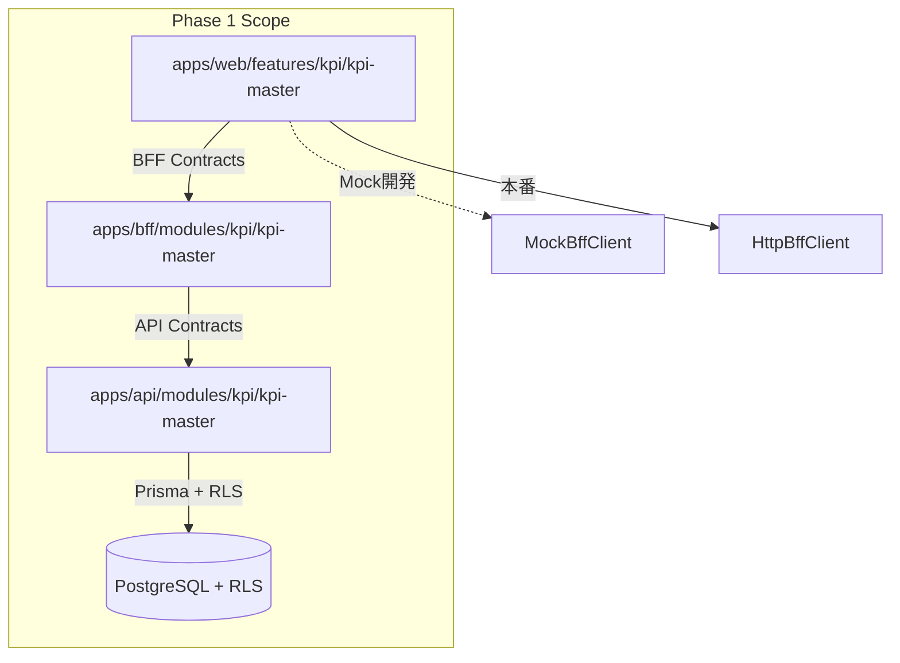
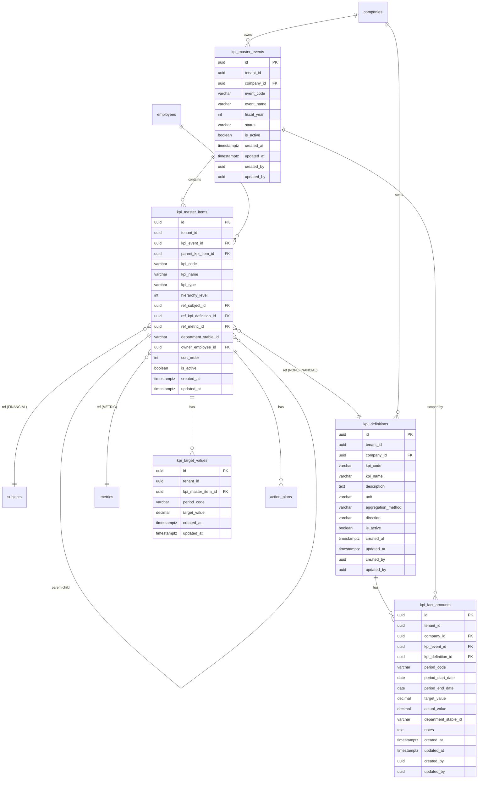
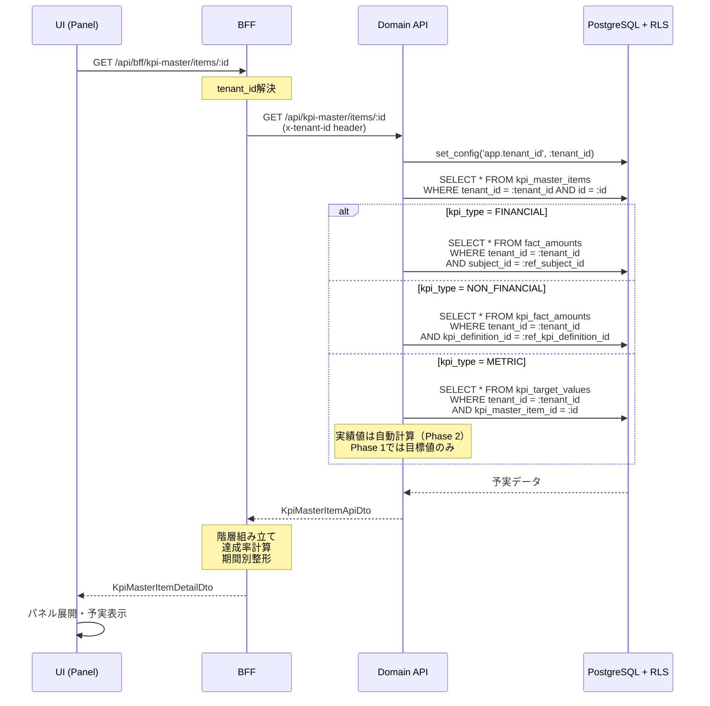
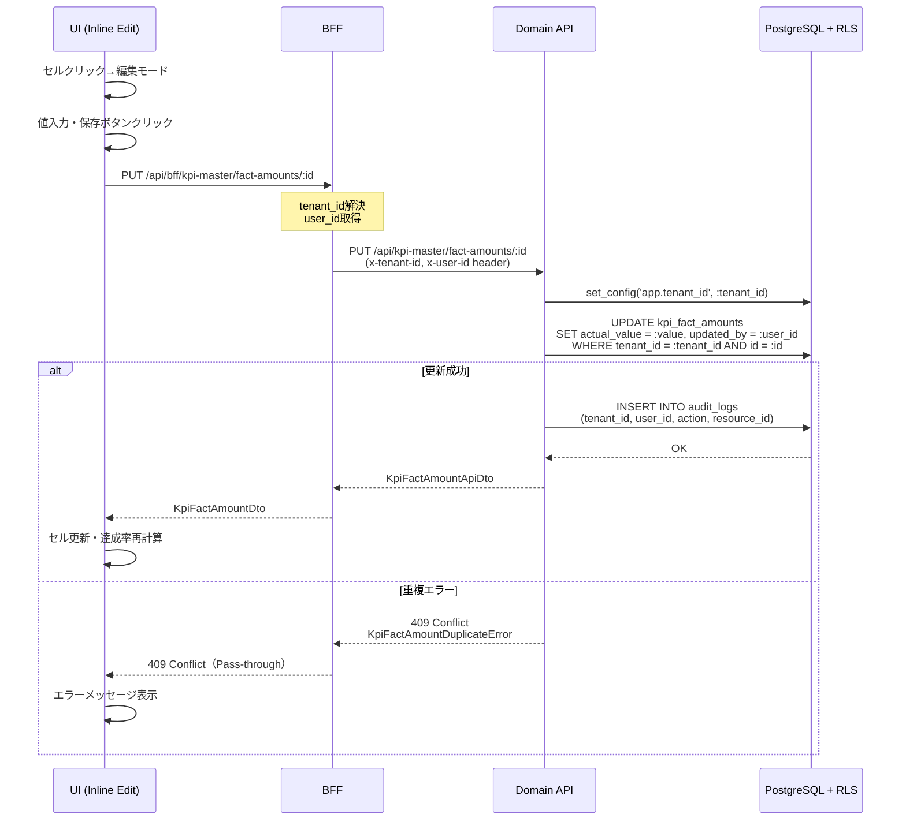
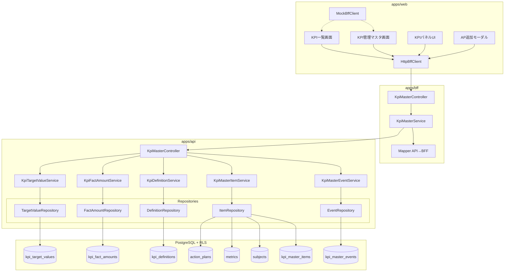

# Design Document

---

## Spec Reference（INPUT情報）

本設計を作成するにあたり、以下の情報を確認した：

### Requirements（直接INPUT）
- **参照ファイル**: `.kiro/specs/kpi/kpi-master/requirements.md`
- **要件バージョン**: 2026-01-25

### 仕様概要（確定済み仕様）
- **参照ファイル**: `.kiro/specs/仕様概要/KPI管理マスタ機能仕様_確定版.md`
- **設計に影響する仕様ポイント**:
  - 年度単位のKPI管理イベントを作成し、DRAFT/CONFIRMEDのステータス管理を行う
  - KPI項目は3種類（財務科目・非財務KPI・指標）から選択し、階層構造（KGI→KPI→AP）で管理する
  - KPI一覧画面はパネル開閉式UIで予実閲覧・入力・アクションプラン管理を行う
  - 部門別閲覧権限により、コントロール部門に基づく権限制御を実現する
  - Phase 1では指標の自動計算を除外し、目標値管理のみ実装する

### エンティティ定義（Data Model 正本）
- **参照ファイル**: `.kiro/specs/entities/02_KPI管理マスタ.md`
- **対象エンティティ**: kpi_master_events, kpi_master_items, kpi_definitions, kpi_fact_amounts, kpi_target_values, subjects（変更）, metrics（変更）, action_plans（変更）

### 仕様検討（経緯・背景）※参考
- **参照ファイル**: `.kiro/specs/kpi/kpi-master/research.md`
- **設計判断に影響した経緯**: Option C（ハイブリッドアプローチ）を採用し、新規Feature作成 + 既存機能との段階的統合を実施。Phase 1では指標の自動計算を除外し、MVPスコープに絞る。

---

## INPUT整合性チェック

| チェック項目 | 確認結果 |
|-------------|---------|
| requirements.md との整合性 | 設計が全要件をカバーしている: ✅ |
| 仕様概要との整合性 | 設計が仕様概要と矛盾しない: ✅ |
| エンティティとの整合性 | Data Model がエンティティ定義に準拠: ✅ |
| 仕様検討の背景理解 | 設計判断の背景を確認した: ✅ |

---

## Overview

KPI管理マスタ機能は、年度単位でKPI管理項目を登録・運用し、目標達成に向けたモニタリングとアクションプラン管理を実現するEPM SaaSの中核機能である。本機能により、財務科目・非財務KPI・経営指標を統合的に管理し、経営判断に必要なKPI進捗・差異・打ち手を構造化された形で提供する。

本設計では、Contracts-first原則に基づき、契約（packages/contracts）→ DB → Domain API → BFF → UI の順序で実装を進める。Phase 1のMVPスコープとして、KPI管理イベントの作成・KPI項目の登録（3種類）・KPI一覧画面（パネル開閉式UI）・非財務KPIの目標実績入力・アクションプラン登録を実装する。指標の自動計算はPhase 2へ延期し、Phase 1では目標値管理のみ実装する。

既存のaction-plan機能との統合は段階的に行い、新規Featureとして独立開発後、Phase 2で既存機能との連携を強化する。UI開発ではMockBffClient先行パターンを採用し、BFF実装完了前にUI検証を進める。権限制御は社員マスタのcontrol_department_stable_idsに基づき、部門別閲覧権限を実現する。

---

## Architecture

### Architecture Pattern & Boundary Map

**Pattern (fixed)**:
- UI（apps/web） → BFF（apps/bff） → Domain API（apps/api） → DB（PostgreSQL + RLS）
- UI直APIは禁止

**Contracts (SSoT)**:
- UI ↔ BFF: `packages/contracts/src/bff/kpi-master`
- BFF ↔ Domain API: `packages/contracts/src/api/kpi-master`
- Enum/Error: 原則 `packages/contracts/src/shared/enums/kpi` および `packages/contracts/src/shared/errors`
- UI は `packages/contracts/src/api` を参照してはならない

**Boundary Diagram**:



---

## Architecture Responsibilities（Mandatory）

### BFF Specification（apps/bff）

**Purpose**
- UI要件に最適化したAPI（Read Model / ViewModel）
- Domain APIのレスポンスを集約・変換（ビジネスルールの正本は持たない）

**BFF Endpoints（UIが叩く）**

| Method | Endpoint | Purpose | Request DTO (contracts/bff) | Response DTO (contracts/bff) | Notes |
| ------ | -------- | ------- | --------------------------- | ---------------------------- | ----- |
| GET | /api/bff/kpi-master/events | KPI管理イベント一覧取得 | GetKpiMasterEventsQueryDto | KpiMasterEventListDto | ページング・部門フィルタ対応 |
| GET | /api/bff/kpi-master/events/:id | KPI管理イベント詳細取得 | - | KpiMasterEventDetailDto | KPI項目一覧含む |
| POST | /api/bff/kpi-master/events | KPI管理イベント作成 | CreateKpiMasterEventDto | KpiMasterEventDto | DRAFT状態で作成 |
| PATCH | /api/bff/kpi-master/events/:id/confirm | KPI管理イベント確定 | - | KpiMasterEventDto | DRAFT→CONFIRMED |
| GET | /api/bff/kpi-master/items | KPI項目一覧取得（階層表示用） | GetKpiMasterItemsQueryDto | KpiMasterItemTreeDto | 階層構造・部門フィルタ対応 |
| GET | /api/bff/kpi-master/items/:id | KPI項目詳細取得（パネル用） | - | KpiMasterItemDetailDto | 予実データ・AP一覧含む |
| POST | /api/bff/kpi-master/items | KPI項目作成 | CreateKpiMasterItemDto | KpiMasterItemDto | 3種別対応 |
| PATCH | /api/bff/kpi-master/items/:id | KPI項目更新 | UpdateKpiMasterItemDto | KpiMasterItemDto | 種別・参照先変更禁止 |
| DELETE | /api/bff/kpi-master/items/:id | KPI項目削除（論理） | - | - | DRAFT時のみ |
| GET | /api/bff/kpi-master/selectable-subjects | 選択可能財務科目取得 | - | SelectableSubjectListDto | kpi_managed=true |
| GET | /api/bff/kpi-master/selectable-metrics | 選択可能指標取得 | - | SelectableMetricListDto | kpi_managed=true |
| GET | /api/bff/kpi-master/kpi-definitions | 非財務KPI定義一覧 | GetKpiDefinitionsQueryDto | KpiDefinitionListDto | |
| POST | /api/bff/kpi-master/kpi-definitions | 非財務KPI定義作成 | CreateKpiDefinitionDto | KpiDefinitionDto | |
| PUT | /api/bff/kpi-master/fact-amounts/:id | 非財務KPI予実更新 | UpdateKpiFactAmountDto | KpiFactAmountDto | インライン編集 |
| POST | /api/bff/kpi-master/fact-amounts | 非財務KPI予実作成（期間追加） | CreateKpiFactAmountDto | KpiFactAmountDto | |
| POST | /api/bff/kpi-master/target-values | 指標目標値作成（期間追加） | CreateKpiTargetValueDto | KpiTargetValueDto | |
| PUT | /api/bff/kpi-master/target-values/:id | 指標目標値更新 | UpdateKpiTargetValueDto | KpiTargetValueDto | |

**アクションプラン統合（既存エンドポイント拡張）**

Phase 1では、KPI項目に紐づくアクションプランの追加を実装する（Req 8.1, 8.2）。
新規エンドポイントは作成せず、**既存の `/api/bff/action-plan-core/plans` を拡張する方針**とする。

**拡張内容**:
- Request DTO に `kpiMasterItemId?: string` フィールドを追加
- `subjectId` と `kpiMasterItemId` はどちらか1つが必須（排他制御）
- KPI一覧画面のAPモーダルからは `kpiMasterItemId` を指定して既存エンドポイントを呼び出す

**設計方針の理由**:
- 既存のaction-plan-core機能との統合を段階的に行う（ハイブリッドアプローチ）
- 新規エンドポイントを作成せず、既存APIの拡張で対応することで、重複を避ける
- `subjectId` ベースの既存APとの後方互換性を維持

**実装時の注意**:
- `packages/contracts/src/bff/action-plan-core` の CreateActionPlanDto に `kpiMasterItemId?: string` を追加
- `packages/contracts/src/api/action-plan-core` も同様に拡張
- Domain API の ActionPlanService で `subjectId` と `kpiMasterItemId` の排他制約を検証

**Naming Convention（必須）**
- DTO / Contracts: camelCase（例: `kpiCode`, `kpiName`, `eventCode`）
- DB columns: snake_case（例: `kpi_code`, `kpi_name`, `event_code`）
- `sortBy` は **DTO側キー**を採用する（例: `kpiCode | kpiName | eventCode`）。
- DB列名（snake_case）を UI/BFF へ露出させない。

**Paging / Sorting Normalization（必須・BFF責務）**
- UI/BFF: page / pageSize（page-based）
- Domain API: offset / limit（DB-friendly）
- BFFは必ず以下を実施する（省略禁止）：
  - defaults: page=1, pageSize=50, sortBy="eventCode", sortOrder="asc"
  - clamp: pageSize <= 200
  - whitelist: sortBy は許可リスト（"eventCode", "kpiCode", "kpiName", "fiscalYear", "createdAt"）のみ
  - normalize: keyword trim、空→undefined
  - transform: offset=(page-1)*pageSize, limit=pageSize
- Domain APIに渡すのは offset/limit（page/pageSizeは渡さない）
- BFFレスポンスには page/pageSize/totalCount を含める（UIへ返すのはBFF側の値）

**Transformation Rules（api DTO → bff DTO）**
- 方針：Domain APIのDTO構造をUI最適化形式に変換
  - 階層構造の組み立て（parent_kpi_item_id → children配列）
  - 予実データの期間別整形（fact_amounts配列 → periodMapオブジェクト）
  - 達成率の計算（actual/target × 100）
  - 部門名・責任者名のマスタ結合（department_stable_id → departmentName）
- BFFレスポンスに page/pageSize/totalCount を含める（UIに返すのはBFF値）

**Error Handling（contracts errorに準拠）**

**Error Policy（必須・未記載禁止）**
- この Feature における BFF の Error Policy は以下とする：
  - 採用方針：**Option A: Pass-through**
  - 採用理由：
    - KPI管理マスタ機能のエラーは主にビジネスルール検証（権限、状態遷移、一意制約違反）
    - UI側でエラーコードに基づく表示制御を行うため、Domain APIのエラー情報をそのまま伝達する方が明確
    - BFF側で独自のエラー解釈を持つ必要性がない

**Option A: Pass-through（基本・推奨）**
- Domain APIのエラーを原則そのまま返す（status / code / message / details）
- BFF側での意味的な再分類・書き換えは禁止（ログ付与等の非機能は除く）
- UIは `contracts/bff/errors` に基づいて表示制御を行う

**In all cases**
- 最終拒否権限（403/404/409/422等）は Domain API が持つ

**Authentication / Tenant Context（tenant_id/user_id伝搬）**
- tenant_id/user_id は BFF の認証ミドルウェアで解決する（Clerk認証情報から取得）
- Domain APIへは HTTPヘッダー（x-tenant-id, x-user-id）で伝搬する
- Domain APIは必ずヘッダーからtenant_id/user_idを取得し、RLSポリシーを適用する

---

### Service Specification（Domain / apps/api）

**Purpose**
- Domainがビジネスルールの正本（BFF/UIは禁止）
- KPI管理イベントの状態遷移・KPI項目の種別制約・権限チェック・監査ログを責務とする

**Key Services**
- KpiMasterEventService
  - イベント作成（DRAFT状態）
  - イベント確定（DRAFT→CONFIRMED）
  - 同一event_code重複チェック
  - 監査ログ記録
- KpiMasterItemService
  - KPI項目作成（3種別対応）
  - KPI項目更新（種別・参照先変更禁止検証）
  - KPI項目削除（論理削除、CONFIRMED時は禁止）
  - 参照先妥当性検証（kpi_managed=true チェック）
  - 部門別閲覧権限チェック（後述）
  - 監査ログ記録
- KpiDefinitionService
  - 非財務KPI定義の作成・更新
  - 同一kpi_code重複チェック
- KpiFactAmountService
  - 非財務KPI予実の作成・更新
  - 同一期間重複チェック（event_id + kpi_definition_id + period_code + department_stable_id）
  - 監査ログ記録
- KpiTargetValueService
  - 指標目標値の作成・更新
  - 同一期間重複チェック（kpi_master_item_id + period_code）
  - 監査ログ記録

**Transaction boundary / audit points**
- Transaction boundary:
  - KPI管理イベント作成・確定
  - KPI項目作成・更新・削除
  - 非財務KPI予実更新
  - 指標目標値更新
- Audit points:
  - すべてのCUD操作（created_by, updated_by記録）
  - 監査ログテーブルへの記録（tenant_id, user_id, 操作内容, 実行日時）

**部門別閲覧権限チェック（Phase 1実装方針）**

KPI項目の閲覧・編集権限は、以下のロジックで判定する：

1. **admin権限チェック（最優先）**
   - ユーザーが `epm.kpi.admin` 権限を持つ場合 → 全社のKPI項目を閲覧・編集可能（Req 10.2）

2. **全社KPIチェック**
   - KPI項目の `department_stable_id` が NULL の場合 → 全ユーザーが閲覧可能（Req 10.1）

3. **部門IDチェック（配列包含判定）**
   - ユーザーの `control_department_stable_ids` 配列に KPI項目の `department_stable_id` が含まれるかチェック（Req 10.1）
   - 含まれる場合 → 閲覧可能
   - 含まれない場合 → 403 Forbidden

4. **編集権限チェック**
   - `epm.kpi.write` 権限を持つ場合 → 閲覧可能な KPI項目を編集可能（Req 10.3）
   - `epm.kpi.read` 権限のみの場合 → 閲覧のみ可能（Req 10.4）

**Phase 1の制約**:
- 「上位部門が下位部門を閲覧できる」機能（階層トラバース）は**Phase 2で実装**
- Phase 1では、社員マスタ登録時に上位部門を含めて `control_department_stable_ids` に明示的に設定する運用とする
- 例: 営業部長 → `control_department_stable_ids = ["EIGYO", "EIGYO_1KA", "EIGYO_2KA"]`

**実装箇所**:
- KpiMasterItemService の findAll/findById メソッドで上記ロジックを適用
- 403エラー時は `KpiMasterItemAccessDeniedError` を返す

---

### Repository Specification（apps/api）

**Purpose**
- tenant_id 必須（全メソッド）
- where句二重ガード必須
- set_config 前提（RLS無効化禁止）

**Key Repositories**
- KpiMasterEventRepository
  - findAll(tenantId, filters, pagination): KPI管理イベント一覧取得
  - findById(tenantId, id): KPI管理イベント取得
  - create(tenantId, data): KPI管理イベント作成
  - update(tenantId, id, data): KPI管理イベント更新
  - findByEventCode(tenantId, companyId, eventCode): event_code重複チェック
- KpiMasterItemRepository
  - findAll(tenantId, filters, pagination): KPI項目一覧取得
  - findById(tenantId, id): KPI項目取得
  - create(tenantId, data): KPI項目作成
  - update(tenantId, id, data): KPI項目更新
  - delete(tenantId, id): KPI項目削除（論理）
  - findByEventId(tenantId, eventId): イベント内KPI項目一覧
- KpiDefinitionRepository
  - findAll(tenantId, filters, pagination): 非財務KPI定義一覧
  - create(tenantId, data): 非財務KPI定義作成
- KpiFactAmountRepository
  - findByItemId(tenantId, kpiDefinitionId, eventId): 予実データ取得
  - create(tenantId, data): 予実作成
  - update(tenantId, id, data): 予実更新
- KpiTargetValueRepository
  - findByItemId(tenantId, kpiMasterItemId): 目標値取得
  - create(tenantId, data): 目標値作成
  - update(tenantId, id, data): 目標値更新

**Repository原則遵守**
- すべてのメソッドで tenant_id を必須引数とする
- WHERE句に必ず tenant_id を含める（RLS二重ガード）
- 実行前に set_config('app.tenant_id', :tenant_id, true) を実行（Prisma middleware）

---

### Contracts Summary（This Feature）

**BFF Contracts (packages/contracts/src/bff/kpi-master)**
- DTO: CreateKpiMasterEventDto, KpiMasterEventDto, GetKpiMasterEventsQueryDto, CreateKpiMasterItemDto, KpiMasterItemDto, UpdateKpiMasterItemDto, KpiMasterItemDetailDto, KpiMasterItemTreeDto, CreateKpiDefinitionDto, KpiDefinitionDto, CreateKpiFactAmountDto, UpdateKpiFactAmountDto, KpiFactAmountDto, CreateKpiTargetValueDto, UpdateKpiTargetValueDto, KpiTargetValueDto
- Query DTO: GetKpiMasterEventsQueryDto (page, pageSize, keyword, fiscalYear, status), GetKpiMasterItemsQueryDto (eventId, departmentStableIds, hierarchyLevel), GetKpiDefinitionsQueryDto (companyId, keyword)

**API Contracts (packages/contracts/src/api/kpi-master)**
- DTO: CreateKpiMasterEventApiDto, KpiMasterEventApiDto, GetKpiMasterEventsApiQueryDto, CreateKpiMasterItemApiDto, KpiMasterItemApiDto, UpdateKpiMasterItemApiDto, CreateKpiDefinitionApiDto, KpiDefinitionApiDto, CreateKpiFactAmountApiDto, KpiFactAmountApiDto, CreateKpiTargetValueApiDto, KpiTargetValueApiDto
- Query DTO: GetKpiMasterEventsApiQueryDto (offset, limit, keyword, fiscalYear, status), GetKpiMasterItemsApiQueryDto (eventId, departmentStableIds, hierarchyLevel)

**Shared Enums (packages/contracts/src/shared/enums/kpi)**
- KpiMasterEventStatus: "DRAFT" | "CONFIRMED"
- KpiType: "FINANCIAL" | "NON_FINANCIAL" | "METRIC"
- HierarchyLevel: 1 | 2
- AggregationMethod: "SUM" | "EOP" | "AVG" | "MAX" | "MIN"
- Direction: "higher_is_better" | "lower_is_better"

**Shared Errors (packages/contracts/src/shared/errors)**
- KpiMasterEventNotFoundError
- KpiMasterEventAlreadyConfirmedError
- KpiMasterItemNotFoundError
- KpiMasterItemTypeImmutableError
- KpiMasterItemDeleteForbiddenError
- KpiMasterItemAccessDeniedError（部門別閲覧権限エラー）
- KpiDefinitionDuplicateError
- KpiFactAmountDuplicateError
- KpiTargetValueDuplicateError
- KpiManagedSubjectNotFoundError
- KpiManagedMetricNotFoundError

**Action Plan Contracts拡張（既存パッケージへの追加）**
- `packages/contracts/src/bff/action-plan-core` の CreateActionPlanDto に `kpiMasterItemId?: string` フィールドを追加
- `packages/contracts/src/api/action-plan-core` の CreateActionPlanApiDto に `kpiMasterItemId?: string` フィールドを追加
- `subjectId` と `kpiMasterItemId` の排他制約はDomain APIで検証

---

## Responsibility Clarification（Mandatory）

本Featureにおける責務境界を以下に明記する。
未記載の責務は実装してはならない。

### UIの責務
- 表示制御（enable/disable / 文言切替）
- フォーム入力制御・UX最適化（パネル開閉、インライン編集、モーダル表示）
- 階層構造のツリー表示（children配列のレンダリング）
- 部門フィルタのチェックボックス制御（複数選択、デフォルト全選択）
- 達成率の表示（実績/目標×100、BFFから受け取った値を表示）
- ビジネス判断は禁止

### BFFの責務
- UI入力の正規化（paging / sorting / filtering）
  - page/pageSize → offset/limit変換
  - sortBy whitelist検証
  - keyword trim、空→undefined
- Domain API DTO ⇄ UI DTO の変換
  - 階層構造組み立て（parent_kpi_item_id → children配列）
  - 予実データの期間別整形
  - 達成率計算（actual/target × 100）
  - 部門名・責任者名のマスタ結合
- ページング情報の付与（page/pageSize/totalCount）
- ビジネスルールの正本は持たない

### Domain APIの責務
- ビジネスルールの正本
  - KPI管理イベントの状態遷移（DRAFT→CONFIRMED）
  - KPI項目の種別制約（種別・参照先変更禁止）
  - KPI項目の削除制御（CONFIRMED時は禁止）
  - 一意制約違反の検証（event_code, kpi_code, period_code）
  - 参照先妥当性検証（kpi_managed=true チェック）
- 権限・状態遷移の最終判断
  - epm.kpi.admin / write / read権限チェック
  - control_department_stable_ids による部門別閲覧権限チェック
- 監査ログ・整合性保証
  - created_by, updated_by記録
  - 監査ログテーブルへの記録

---

## Data Model（エンティティ整合性確認必須）

### Entity Reference
- 参照元: `.kiro/specs/entities/02_KPI管理マスタ.md` セクション 1-8

### エンティティ整合性チェックリスト

| チェック項目 | 確認結果 |
|-------------|---------|
| カラム網羅性 | エンティティ定義の全カラムがDTO/Prismaに反映されている: ✅ |
| 型の一致 | varchar→String, numeric→Decimal 等の型変換が正確: ✅ |
| 制約の反映 | UNIQUE/CHECK制約がPrisma/アプリ検証に反映: ✅ |
| ビジネスルール | エンティティ補足のルールがServiceに反映: ✅ |
| NULL許可 | NULL/NOT NULLがPrisma?/必須に正しく対応: ✅ |

### Prisma Schema

#### kpi_master_events

```prisma
model kpi_master_events {
  id            String   @id @default(uuid()) @db.Uuid
  tenant_id     String   @db.Uuid
  company_id    String   @db.Uuid
  event_code    String   @db.VarChar(50)
  event_name    String   @db.VarChar(200)
  fiscal_year   Int
  status        String   @db.VarChar(20)
  is_active     Boolean  @default(true)
  created_at    DateTime @default(now()) @db.Timestamptz(6)
  updated_at    DateTime @updatedAt @db.Timestamptz(6)
  created_by    String?  @db.Uuid
  updated_by    String?  @db.Uuid

  // Relations
  companies     companies @relation(fields: [tenant_id, company_id], references: [tenant_id, id])
  kpi_master_items kpi_master_items[]

  @@unique([tenant_id, company_id, event_code], name: "kpi_master_events_tenant_code_uk")
  @@index([tenant_id, company_id])
  @@index([tenant_id, fiscal_year])
  @@map("kpi_master_events")
}
```

#### kpi_master_items

```prisma
model kpi_master_items {
  id                     String   @id @default(uuid()) @db.Uuid
  tenant_id              String   @db.Uuid
  kpi_event_id           String   @db.Uuid
  parent_kpi_item_id     String?  @db.Uuid
  kpi_code               String   @db.VarChar(50)
  kpi_name               String   @db.VarChar(200)
  kpi_type               String   @db.VarChar(20)
  hierarchy_level        Int
  ref_subject_id         String?  @db.Uuid
  ref_kpi_definition_id  String?  @db.Uuid
  ref_metric_id          String?  @db.Uuid
  department_stable_id   String?  @db.VarChar(50)
  owner_employee_id      String?  @db.Uuid
  sort_order             Int      @default(1)
  is_active              Boolean  @default(true)
  created_at             DateTime @default(now()) @db.Timestamptz(6)
  updated_at             DateTime @updatedAt @db.Timestamptz(6)

  // Relations
  kpi_master_events      kpi_master_events @relation(fields: [tenant_id, kpi_event_id], references: [tenant_id, id])
  parent_kpi_item        kpi_master_items? @relation("KpiItemHierarchy", fields: [tenant_id, parent_kpi_item_id], references: [tenant_id, id])
  children               kpi_master_items[] @relation("KpiItemHierarchy")
  subjects               subjects? @relation(fields: [tenant_id, ref_subject_id], references: [tenant_id, id])
  kpi_definitions        kpi_definitions? @relation(fields: [tenant_id, ref_kpi_definition_id], references: [tenant_id, id])
  metrics                metrics? @relation(fields: [tenant_id, ref_metric_id], references: [tenant_id, id])
  employees              employees? @relation(fields: [tenant_id, owner_employee_id], references: [tenant_id, id])
  kpi_target_values      kpi_target_values[]
  action_plans           action_plans[]

  @@unique([tenant_id, kpi_event_id, kpi_code], name: "kpi_master_items_event_code_uk")
  @@index([tenant_id, kpi_event_id])
  @@index([tenant_id, parent_kpi_item_id])
  @@index([tenant_id, department_stable_id])
  @@map("kpi_master_items")
}
```

#### kpi_definitions

```prisma
model kpi_definitions {
  id                  String   @id @default(uuid()) @db.Uuid
  tenant_id           String   @db.Uuid
  company_id          String   @db.Uuid
  kpi_code            String   @db.VarChar(50)
  kpi_name            String   @db.VarChar(200)
  description         String?  @db.Text
  unit                String?  @db.VarChar(30)
  aggregation_method  String   @db.VarChar(20)
  direction           String?  @db.VarChar(20)
  is_active           Boolean  @default(true)
  created_at          DateTime @default(now()) @db.Timestamptz(6)
  updated_at          DateTime @updatedAt @db.Timestamptz(6)
  created_by          String?  @db.Uuid
  updated_by          String?  @db.Uuid

  // Relations
  companies           companies @relation(fields: [tenant_id, company_id], references: [tenant_id, id])
  kpi_master_items    kpi_master_items[]
  kpi_fact_amounts    kpi_fact_amounts[]

  @@unique([tenant_id, company_id, kpi_code], name: "kpi_definitions_company_code_uk")
  @@index([tenant_id, company_id])
  @@map("kpi_definitions")
}
```

#### kpi_fact_amounts

```prisma
model kpi_fact_amounts {
  id                  String   @id @default(uuid()) @db.Uuid
  tenant_id           String   @db.Uuid
  company_id          String   @db.Uuid
  kpi_event_id        String   @db.Uuid
  kpi_definition_id   String   @db.Uuid
  period_code         String   @db.VarChar(32)
  period_start_date   DateTime? @db.Date
  period_end_date     DateTime? @db.Date
  target_value        Decimal?  @db.Decimal
  actual_value        Decimal?  @db.Decimal
  department_stable_id String?  @db.VarChar(50)
  notes               String?  @db.Text
  created_at          DateTime @default(now()) @db.Timestamptz(6)
  updated_at          DateTime @updatedAt @db.Timestamptz(6)
  created_by          String?  @db.Uuid
  updated_by          String?  @db.Uuid

  // Relations
  companies           companies @relation(fields: [tenant_id, company_id], references: [tenant_id, id])
  kpi_master_events   kpi_master_events @relation(fields: [tenant_id, kpi_event_id], references: [tenant_id, id])
  kpi_definitions     kpi_definitions @relation(fields: [tenant_id, kpi_definition_id], references: [tenant_id, id])

  @@unique([tenant_id, kpi_event_id, kpi_definition_id, period_code, department_stable_id], name: "kpi_fact_amounts_uk")
  @@index([tenant_id, kpi_event_id, kpi_definition_id])
  @@index([tenant_id, department_stable_id])
  @@map("kpi_fact_amounts")
}
```

#### kpi_target_values

```prisma
model kpi_target_values {
  id                   String   @id @default(uuid()) @db.Uuid
  tenant_id            String   @db.Uuid
  kpi_master_item_id   String   @db.Uuid
  period_code          String   @db.VarChar(32)
  target_value         Decimal  @db.Decimal
  created_at           DateTime @default(now()) @db.Timestamptz(6)
  updated_at           DateTime @updatedAt @db.Timestamptz(6)

  // Relations
  kpi_master_items     kpi_master_items @relation(fields: [tenant_id, kpi_master_item_id], references: [tenant_id, id])

  @@unique([tenant_id, kpi_master_item_id, period_code], name: "kpi_target_values_uk")
  @@index([tenant_id, kpi_master_item_id])
  @@map("kpi_target_values")
}
```

#### subjects（既存テーブル変更）

```prisma
model subjects {
  // ... 既存カラム ...
  kpi_managed          Boolean  @default(false)
  // ... 既存カラム ...

  // Relations
  kpi_master_items     kpi_master_items[]

  @@map("subjects")
}
```

#### metrics（既存テーブル変更）

```prisma
model metrics {
  // ... 既存カラム ...
  kpi_managed          Boolean  @default(false)
  // ... 既存カラム ...

  // Relations
  kpi_master_items     kpi_master_items[]

  @@map("metrics")
}
```

#### action_plans（既存テーブル変更）

```prisma
model action_plans {
  // ... 既存カラム ...
  subject_id           String?  @db.Uuid  // nullable に変更
  kpi_master_item_id   String?  @db.Uuid  // 追加
  // ... 既存カラム ...

  // Relations
  kpi_master_items     kpi_master_items? @relation(fields: [tenant_id, kpi_master_item_id], references: [tenant_id, id])

  @@map("action_plans")
}
```

### Constraints（エンティティ定義から転記）

#### kpi_master_events
- PK: id（UUID）
- UNIQUE: (tenant_id, company_id, event_code)
- CHECK: status IN ('DRAFT', 'CONFIRMED')
- FK: (tenant_id, company_id) REFERENCES companies(tenant_id, id)

#### kpi_master_items
- PK: id（UUID）
- UNIQUE: (tenant_id, kpi_event_id, kpi_code)
- CHECK: kpi_type IN ('FINANCIAL', 'NON_FINANCIAL', 'METRIC')
- CHECK: hierarchy_level IN (1, 2)
- CHECK: kpi_type別の参照IDが排他的に設定されること
  - FINANCIAL → ref_subject_id NOT NULL, 他はNULL
  - NON_FINANCIAL → ref_kpi_definition_id NOT NULL, 他はNULL
  - METRIC → ref_metric_id NOT NULL, 他はNULL
- FK: (tenant_id, kpi_event_id) REFERENCES kpi_master_events(tenant_id, id)
- FK: (tenant_id, parent_kpi_item_id) REFERENCES kpi_master_items(tenant_id, id)
- FK: (tenant_id, ref_subject_id) REFERENCES subjects(tenant_id, id)
- FK: (tenant_id, ref_kpi_definition_id) REFERENCES kpi_definitions(tenant_id, id)
- FK: (tenant_id, ref_metric_id) REFERENCES metrics(tenant_id, id)
- FK: (tenant_id, owner_employee_id) REFERENCES employees(tenant_id, id)

#### kpi_definitions
- PK: id（UUID）
- UNIQUE: (tenant_id, company_id, kpi_code)
- CHECK: aggregation_method IN ('SUM', 'EOP', 'AVG', 'MAX', 'MIN')
- CHECK: direction IS NULL OR direction IN ('higher_is_better', 'lower_is_better')
- FK: (tenant_id, company_id) REFERENCES companies(tenant_id, id)

#### kpi_fact_amounts
- PK: id（UUID）
- UNIQUE: (tenant_id, kpi_event_id, kpi_definition_id, period_code, department_stable_id)
- CHECK: period_start_date IS NULL OR period_end_date IS NULL OR period_start_date <= period_end_date
- FK: (tenant_id, company_id) REFERENCES companies(tenant_id, id)
- FK: (tenant_id, kpi_event_id) REFERENCES kpi_master_events(tenant_id, id)
- FK: (tenant_id, kpi_definition_id) REFERENCES kpi_definitions(tenant_id, id)

#### kpi_target_values
- PK: id（UUID）
- UNIQUE: (tenant_id, kpi_master_item_id, period_code)
- FK: (tenant_id, kpi_master_item_id) REFERENCES kpi_master_items(tenant_id, id)

#### action_plans（変更）
- CHECK: subject_id IS NOT NULL OR kpi_master_item_id IS NOT NULL（どちらか1つは必須）
- FK: (tenant_id, kpi_master_item_id) REFERENCES kpi_master_items(tenant_id, id)

### RLS Policy

```sql
-- kpi_master_events
ALTER TABLE kpi_master_events ENABLE ROW LEVEL SECURITY;

CREATE POLICY tenant_isolation ON kpi_master_events
  USING (tenant_id::text = current_setting('app.tenant_id', true));

-- kpi_master_items
ALTER TABLE kpi_master_items ENABLE ROW LEVEL SECURITY;

CREATE POLICY tenant_isolation ON kpi_master_items
  USING (tenant_id::text = current_setting('app.tenant_id', true));

-- kpi_definitions
ALTER TABLE kpi_definitions ENABLE ROW LEVEL SECURITY;

CREATE POLICY tenant_isolation ON kpi_definitions
  USING (tenant_id::text = current_setting('app.tenant_id', true));

-- kpi_fact_amounts
ALTER TABLE kpi_fact_amounts ENABLE ROW LEVEL SECURITY;

CREATE POLICY tenant_isolation ON kpi_fact_amounts
  USING (tenant_id::text = current_setting('app.tenant_id', true));

-- kpi_target_values
ALTER TABLE kpi_target_values ENABLE ROW LEVEL SECURITY;

CREATE POLICY tenant_isolation ON kpi_target_values
  USING (tenant_id::text = current_setting('app.tenant_id', true));
```

### Data Model Diagram



### Key Flow Diagrams

#### Sequence: KPI項目パネル開閉（予実データ取得）



#### Sequence: 非財務KPI予実インライン編集



---

## System Architecture Diagram



---

## Phase 1 MVP Scope

### 実装対象（Phase 1）
- KPI管理イベント作成・確定（DRAFT/CONFIRMED）
- KPI項目登録（財務科目・非財務KPI・指標の3種別対応）
- KPI一覧画面（階層表示、パネル開閉式UI）
- 財務科目KPI予実表示（read-only、fact_amountsから予算・見込・実績を取得して表示、達成率計算）
- 非財務KPI目標実績入力（インライン編集、期間追加）
- 指標目標値管理（期間追加、目標値入力のみ）
- 部門フィルタ（複数選択、デフォルト全選択）
- アクションプラン追加（モーダル、kpi_master_item_idで紐付け）
- 権限制御（epm.kpi.admin/write/read、control_department_stable_ids配列包含チェック）
- MockBffClient → HttpBffClient段階実装

### 実装対象外（Phase 2へ延期）
- 指標の実績値自動計算（構成要素からの計算ロジック）
- 部門階層の自動権限伝播（階層トラバース、Phase 1は明示的登録のみ）
- 前年度からのKPI項目コピー機能
- KPI階層の自動積み上げ集計
- ダッシュボードカスタマイズ
- KPIレポート出力機能（PDF/Excel）

---

## References

- **要件定義**: `.kiro/specs/kpi/kpi-master/requirements.md`
- **研究メモ**: `.kiro/specs/kpi/kpi-master/research.md`
- **エンティティ定義**: `.kiro/specs/entities/02_KPI管理マスタ.md`
- **仕様概要**: `.kiro/specs/仕様概要/KPI管理マスタ機能仕様_確定版.md`
- **技術憲法**: `.kiro/steering/tech.md`
- **構造憲法**: `.kiro/steering/structure.md`
- **プロダクト方針**: `.kiro/steering/product.md`
