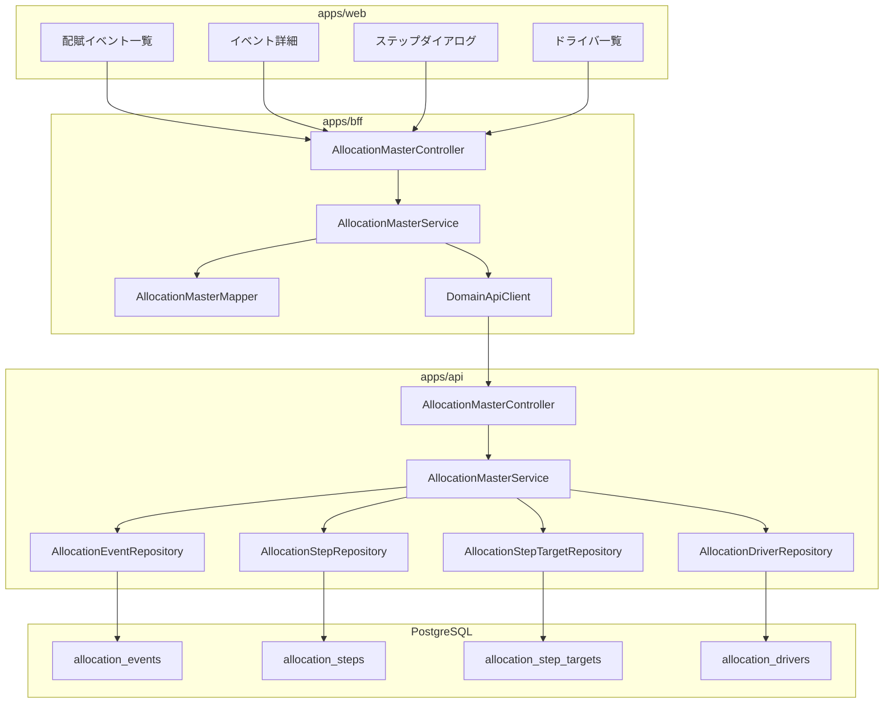
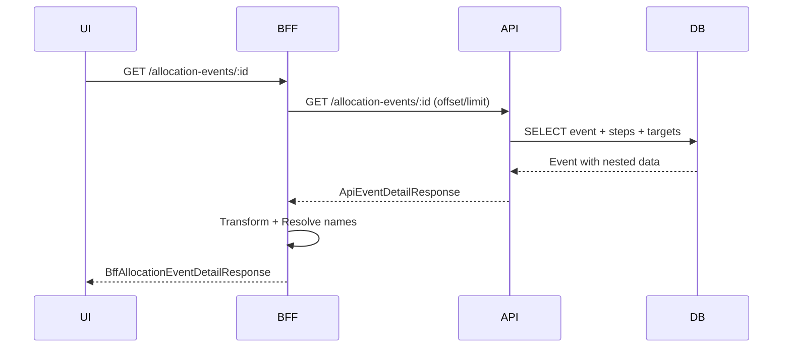
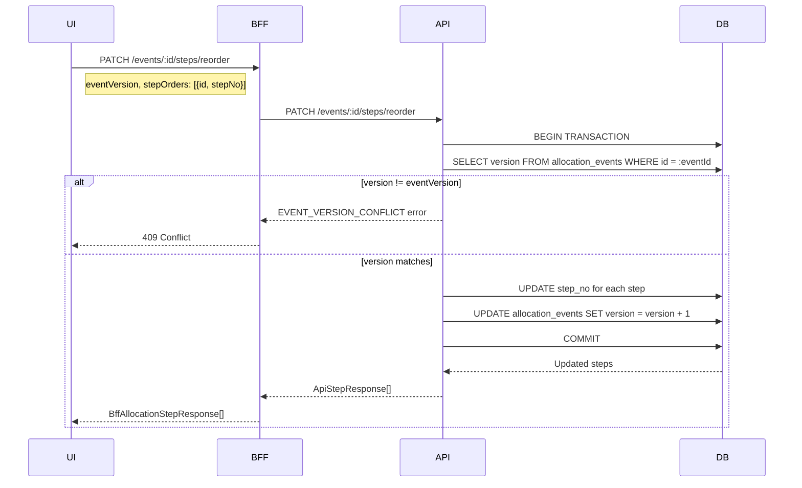
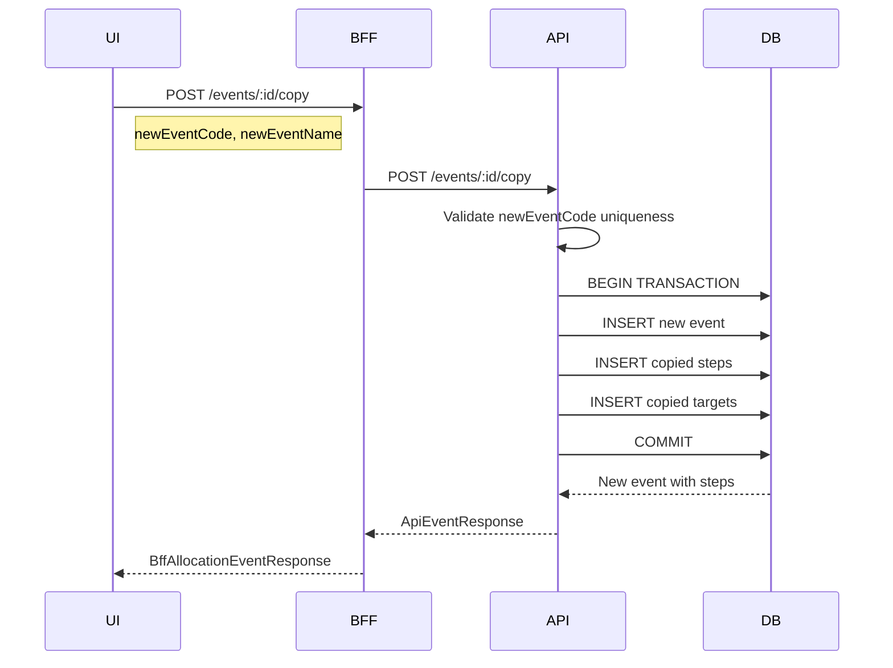

# Design Document: allocation-master

---

**Purpose**: 配賦マスタ機能（Phase 1）の技術設計を定義する。実装者が解釈の余地なく実装できる詳細度を提供する。

## Overview

配賦マスタは、本社共通費・間接費等を事業部門やセグメントへ按分配賦するためのルール定義機能である。Phase 1 では配賦ルールの定義（CRUD）に集中し、配賦実行・プレビュー機能は後続フェーズで実装する。

本機能は4つのエンティティ（allocation_events, allocation_steps, allocation_step_targets, allocation_drivers）で構成され、「イベント → ステップ → ターゲット」の階層構造を持つ。配賦ドライバは独立マスタとしても、ステップ内インラインでも定義可能。

UI は階層的一画面構成を採用し、イベント詳細画面内にステップ一覧を埋め込み、ステップ詳細はダイアログで表示する。

---

## Architecture

### Architecture Pattern & Boundary Map

**Pattern (fixed)**:
- UI（apps/web） → BFF（apps/bff） → Domain API（apps/api） → DB（PostgreSQL + RLS）
- UI直APIは禁止

**Contracts (SSoT)**:
- UI ↔ BFF: `packages/contracts/src/bff/allocation-master`
- BFF ↔ Domain API: `packages/contracts/src/api/allocation-master`
- Enum/Error: `packages/contracts/src/bff/allocation-master` に含める
- UI は `packages/contracts/src/api` を参照してはならない



---

## Architecture Responsibilities（Mandatory）

### BFF Specification（apps/bff）

**Purpose**
- UI要件に最適化したAPI（階層的レスポンス構造）
- Domain APIのレスポンスを集約・変換（ビジネスルールの正本は持たない）

**BFF Endpoints（UIが叩く）**

| Method | Endpoint | Purpose | Request DTO | Response DTO | Notes |
|--------|----------|---------|-------------|--------------|-------|
| GET | /api/bff/master-data/allocation-events | イベント一覧取得 | BffAllocationEventListRequest | BffAllocationEventListResponse | 検索・フィルタ・ページング |
| POST | /api/bff/master-data/allocation-events | イベント作成 | BffCreateAllocationEventRequest | BffAllocationEventResponse | |
| GET | /api/bff/master-data/allocation-events/:id | イベント詳細取得 | - | BffAllocationEventDetailResponse | ステップ一覧含む |
| PATCH | /api/bff/master-data/allocation-events/:id | イベント更新 | BffUpdateAllocationEventRequest | BffAllocationEventResponse | |
| DELETE | /api/bff/master-data/allocation-events/:id | イベント削除 | - | - | ステップ存在時エラー |
| POST | /api/bff/master-data/allocation-events/:id/copy | イベントコピー | BffCopyAllocationEventRequest | BffAllocationEventResponse | ステップ・ターゲット含む |
| POST | /api/bff/master-data/allocation-events/:eventId/steps | ステップ作成 | BffCreateAllocationStepRequest | BffAllocationStepResponse | step_no自動採番 |
| PATCH | /api/bff/master-data/allocation-events/:eventId/steps/:id | ステップ更新 | BffUpdateAllocationStepRequest | BffAllocationStepResponse | |
| DELETE | /api/bff/master-data/allocation-events/:eventId/steps/:id | ステップ削除 | - | - | ターゲット存在時エラー |
| PATCH | /api/bff/master-data/allocation-events/:eventId/steps/reorder | ステップ順序変更 | BffReorderStepsRequest | BffAllocationStepResponse[] | 一括更新 |
| POST | /api/bff/master-data/allocation-events/:eventId/steps/:stepId/targets | ターゲット作成 | BffCreateAllocationTargetRequest | BffAllocationTargetResponse | |
| PATCH | /api/bff/master-data/allocation-events/:eventId/steps/:stepId/targets/:id | ターゲット更新 | BffUpdateAllocationTargetRequest | BffAllocationTargetResponse | |
| DELETE | /api/bff/master-data/allocation-events/:eventId/steps/:stepId/targets/:id | ターゲット削除 | - | - | |
| GET | /api/bff/master-data/allocation-drivers | ドライバ一覧取得 | BffAllocationDriverListRequest | BffAllocationDriverListResponse | |
| POST | /api/bff/master-data/allocation-drivers | ドライバ作成 | BffCreateAllocationDriverRequest | BffAllocationDriverResponse | |
| GET | /api/bff/master-data/allocation-drivers/:id | ドライバ詳細取得 | - | BffAllocationDriverResponse | |
| PATCH | /api/bff/master-data/allocation-drivers/:id | ドライバ更新 | BffUpdateAllocationDriverRequest | BffAllocationDriverResponse | |
| DELETE | /api/bff/master-data/allocation-drivers/:id | ドライバ削除 | - | - | 参照ステップ存在時エラー |

**Naming Convention（必須）**
- DTO / Contracts: camelCase（例: `eventCode`, `eventName`, `stepNo`）
- DB columns: snake_case（例: `event_code`, `event_name`, `step_no`）
- `sortBy` は **DTO側キー**を採用する（例: `eventCode | eventName | updatedAt`）

**Paging / Sorting Normalization（必須・BFF責務）**
- UI/BFF: page / pageSize（page-based）
- Domain API: offset / limit（DB-friendly）
- BFFは必ず以下を実施する：
  - defaults: page=1, pageSize=50, sortBy=eventCode, sortOrder=asc
  - clamp: pageSize <= 200
  - whitelist: sortBy は許可リストのみ
    - Event: `eventCode | eventName | scenarioType | isActive | updatedAt`
    - Driver: `driverCode | driverName | driverType | updatedAt`
  - normalize: keyword trim、空→undefined
  - transform: offset=(page-1)*pageSize, limit=pageSize

**Transformation Rules（api DTO → bff DTO）**
- snake_case → camelCase 変換
- イベント詳細: steps配列をネストして返却
- ステップ詳細: targets配列をネストして返却
- 日時: ISO 8601 文字列で返却

**Error Handling**

**Error Policy（必須）**
- 採用方針：**Option A: Pass-through**
- 採用理由：マスタCRUDの標準パターン。Domain APIエラーをそのまま透過し、UI表示用の変換は不要

**Authentication / Tenant Context**
- tenant_id: Clerkトークンから解決、`x-tenant-id` ヘッダーでDomain APIへ伝搬
- user_id: Clerkトークンから解決、`x-user-id` ヘッダーでDomain APIへ伝搬
- company_id: リクエストボディまたはクエリパラメータから取得

---

### Service Specification（Domain / apps/api）

**Purpose**
- ビジネスルールの正本（BFF/UIは禁止）
- トランザクション境界・監査ポイントを明確化

**AllocationEventService**
- `createEvent`: イベント作成（event_code一意チェック）
- `updateEvent`: イベント更新
- `deleteEvent`: イベント削除（ステップ存在チェック → 拒否）
- `copyEvent`: イベントコピー（ステップ・ターゲット含む、新event_code必須）
- `getEventDetail`: イベント詳細取得（ステップ・ターゲット含む）
- `listEvents`: イベント一覧（検索・フィルタ・ページング）

**AllocationStepService**
- `createStep`: ステップ作成（step_no自動採番：現在の最大値+1）
- `updateStep`: ステップ更新
- `deleteStep`: ステップ削除（ターゲット存在チェック → 拒否）
- `reorderSteps`: ステップ順序変更（一括更新、トランザクション保証）

**AllocationTargetService**
- `createTarget`: ターゲット作成（target_type/target_id整合性チェック）
- `updateTarget`: ターゲット更新
- `deleteTarget`: ターゲット削除
- `validateTargetIntegrity`: 参照先存在チェック（部門 or ディメンション値）

**AllocationDriverService**
- `createDriver`: ドライバ作成（driver_code一意チェック）
- `updateDriver`: ドライバ更新
- `deleteDriver`: ドライバ削除（参照ステップ存在チェック → 拒否）
- `listDrivers`: ドライバ一覧（検索・フィルタ・ページング）

**Transaction Boundary**
- 各操作は単一トランザクション
- copyEvent: イベント・ステップ・ターゲット一括作成を単一トランザクション

**Audit Points**
- 作成: created_by に user_id 記録
- 更新: updated_by に user_id 記録
- 削除: 監査ログテーブル（将来）

---

### Repository Specification（apps/api）

**共通原則**
- tenant_id 必須（全メソッド）
- where句二重ガード必須
- set_config 前提（RLS有効）

**AllocationEventRepository**
```typescript
interface AllocationEventRepository {
  findById(tenantId: string, companyId: string, id: string): Promise<AllocationEvent | null>
  findMany(tenantId: string, companyId: string, query: AllocationEventQuery): Promise<PaginatedResult<AllocationEvent>>
  create(tenantId: string, data: CreateAllocationEventData): Promise<AllocationEvent>
  update(tenantId: string, companyId: string, id: string, data: UpdateAllocationEventData): Promise<AllocationEvent>
  delete(tenantId: string, companyId: string, id: string): Promise<void>
  existsByEventCode(tenantId: string, companyId: string, eventCode: string): Promise<boolean>
  hasSteps(tenantId: string, companyId: string, eventId: string): Promise<boolean>
}
```

**AllocationStepRepository**
```typescript
interface AllocationStepRepository {
  findById(tenantId: string, companyId: string, id: string): Promise<AllocationStep | null>
  findByEventId(tenantId: string, companyId: string, eventId: string): Promise<AllocationStep[]>
  create(tenantId: string, data: CreateAllocationStepData): Promise<AllocationStep>
  update(tenantId: string, companyId: string, id: string, data: UpdateAllocationStepData): Promise<AllocationStep>
  delete(tenantId: string, companyId: string, id: string): Promise<void>
  getMaxStepNo(tenantId: string, companyId: string, eventId: string): Promise<number>
  updateStepNos(tenantId: string, companyId: string, eventId: string, stepOrders: { id: string, stepNo: number }[]): Promise<void>
  hasTargets(tenantId: string, companyId: string, stepId: string): Promise<boolean>
}
```

**AllocationStepTargetRepository**
```typescript
interface AllocationStepTargetRepository {
  findById(tenantId: string, companyId: string, id: string): Promise<AllocationStepTarget | null>
  findByStepId(tenantId: string, companyId: string, stepId: string): Promise<AllocationStepTarget[]>
  create(tenantId: string, data: CreateAllocationStepTargetData): Promise<AllocationStepTarget>
  update(tenantId: string, companyId: string, id: string, data: UpdateAllocationStepTargetData): Promise<AllocationStepTarget>
  delete(tenantId: string, companyId: string, id: string): Promise<void>
  existsByTargetKey(tenantId: string, companyId: string, stepId: string, targetType: string, targetId: string): Promise<boolean>
}
```

**AllocationDriverRepository**
```typescript
interface AllocationDriverRepository {
  findById(tenantId: string, companyId: string, id: string): Promise<AllocationDriver | null>
  findMany(tenantId: string, companyId: string, query: AllocationDriverQuery): Promise<PaginatedResult<AllocationDriver>>
  create(tenantId: string, data: CreateAllocationDriverData): Promise<AllocationDriver>
  update(tenantId: string, companyId: string, id: string, data: UpdateAllocationDriverData): Promise<AllocationDriver>
  delete(tenantId: string, companyId: string, id: string): Promise<void>
  existsByDriverCode(tenantId: string, companyId: string, driverCode: string): Promise<boolean>
  isReferencedBySteps(tenantId: string, companyId: string, driverId: string): Promise<boolean>
}
```

---

### Contracts Summary（This Feature）

**packages/contracts/src/bff/allocation-master/index.ts**

```typescript
// ============================================================
// Enums
// ============================================================

export const ScenarioType = {
  ACTUAL: 'ACTUAL',
  BUDGET: 'BUDGET',
  FORECAST: 'FORECAST',
} as const
export type ScenarioType = (typeof ScenarioType)[keyof typeof ScenarioType]

export const DriverType = {
  FIXED: 'FIXED',
  HEADCOUNT: 'HEADCOUNT',
  SUBJECT_AMOUNT: 'SUBJECT_AMOUNT',
  MEASURE: 'MEASURE',
  KPI: 'KPI',
} as const
export type DriverType = (typeof DriverType)[keyof typeof DriverType]

export const DriverSourceType = {
  MASTER: 'MASTER',
  FACT: 'FACT',
  KPI: 'KPI',
} as const
export type DriverSourceType = (typeof DriverSourceType)[keyof typeof DriverSourceType]

export const TargetType = {
  DEPARTMENT: 'DEPARTMENT',
  DIMENSION_VALUE: 'DIMENSION_VALUE',
} as const
export type TargetType = (typeof TargetType)[keyof typeof TargetType]

// ============================================================
// Request DTOs
// ============================================================

export interface BffAllocationEventListRequest {
  keyword?: string
  scenarioType?: ScenarioType
  isActive?: boolean
  page?: number
  pageSize?: number
  sortBy?: 'eventCode' | 'eventName' | 'scenarioType' | 'isActive' | 'updatedAt'
  sortOrder?: 'asc' | 'desc'
}

export interface BffCreateAllocationEventRequest {
  companyId: string
  eventCode: string
  eventName: string
  scenarioType: ScenarioType
  isActive?: boolean
  notes?: string
}

export interface BffUpdateAllocationEventRequest {
  eventCode?: string
  eventName?: string
  scenarioType?: ScenarioType
  isActive?: boolean
  notes?: string
}

export interface BffCopyAllocationEventRequest {
  newEventCode: string
  newEventName: string
}

export interface BffCreateAllocationStepRequest {
  stepName: string
  fromSubjectId: string
  fromDepartmentStableId: string  // 必須
  driverType: DriverType
  driverSourceType: DriverSourceType
  driverRefId?: string
  notes?: string
}

export interface BffUpdateAllocationStepRequest {
  stepName?: string
  fromSubjectId?: string
  fromDepartmentStableId?: string
  driverType?: DriverType
  driverSourceType?: DriverSourceType
  driverRefId?: string
  notes?: string
}

export interface BffReorderStepsRequest {
  eventVersion: number  // 楽観的ロック用
  stepOrders: { id: string; stepNo: number }[]
}

export interface BffCreateAllocationTargetRequest {
  targetType: TargetType
  targetId: string  // DEPARTMENT: stable_id, DIMENSION_VALUE: dimension_values.id
  toSubjectId?: string  // 配賦先科目（NULL=配賦元科目と同じ）
  fixedRatio?: string  // Decimal型（"0.25" 等）
  sortOrder?: number
  isActive?: boolean
}

export interface BffUpdateAllocationTargetRequest {
  targetType?: TargetType
  targetId?: string  // DEPARTMENT: stable_id, DIMENSION_VALUE: dimension_values.id
  toSubjectId?: string | null  // 配賦先科目（NULL=配賦元科目と同じ）
  fixedRatio?: string | null  // Decimal型
  sortOrder?: number
  isActive?: boolean
}

export interface BffAllocationDriverListRequest {
  keyword?: string
  driverType?: DriverType
  page?: number
  pageSize?: number
  sortBy?: 'driverCode' | 'driverName' | 'driverType' | 'updatedAt'
  sortOrder?: 'asc' | 'desc'
}

export interface BffCreateAllocationDriverRequest {
  companyId: string
  driverCode: string
  driverName: string
  driverType: DriverType
  sourceType: DriverSourceType
  driverSubjectId?: string
  measureKey?: string
  kpiSubjectId?: string
  periodRule?: string
  notes?: string
}

export interface BffUpdateAllocationDriverRequest {
  driverCode?: string
  driverName?: string
  driverType?: DriverType
  sourceType?: DriverSourceType
  driverSubjectId?: string
  measureKey?: string
  kpiSubjectId?: string
  periodRule?: string
  notes?: string
}

// ============================================================
// Response DTOs
// ============================================================

export interface BffAllocationTargetResponse {
  id: string
  targetType: TargetType
  targetId: string  // DEPARTMENT: stable_id, DIMENSION_VALUE: dimension_values.id
  targetName: string // 部門名 or ディメンション値名（解決済み）
  toSubjectId: string | null
  toSubjectName: string | null // 配賦先科目名（解決済み、NULL=配賦元科目と同じ）
  fixedRatio: string | null  // Decimal型文字列
  sortOrder: number | null
  isActive: boolean
  createdAt: string
  updatedAt: string
}

export interface BffAllocationStepResponse {
  id: string
  stepNo: number
  stepName: string
  fromSubjectId: string
  fromSubjectName: string // 科目名（解決済み）
  fromDepartmentStableId: string  // 必須
  fromDepartmentName: string // 部門名（解決済み）
  driverType: DriverType
  driverSourceType: DriverSourceType
  driverRefId: string | null
  driverName: string | null // ドライバ名（解決済み、ref時のみ）
  notes: string | null
  targets: BffAllocationTargetResponse[]
  createdAt: string
  updatedAt: string
}

export interface BffAllocationEventResponse {
  id: string
  companyId: string
  eventCode: string
  eventName: string
  scenarioType: ScenarioType
  isActive: boolean
  version: number  // 楽観的ロック用
  notes: string | null
  createdAt: string
  updatedAt: string
}

export interface BffAllocationEventDetailResponse extends BffAllocationEventResponse {
  steps: BffAllocationStepResponse[]
}

export interface BffAllocationEventListResponse {
  items: BffAllocationEventResponse[]
  total: number
  page: number
  pageSize: number
}

export interface BffAllocationDriverResponse {
  id: string
  companyId: string
  driverCode: string
  driverName: string
  driverType: DriverType
  sourceType: DriverSourceType
  driverSubjectId: string | null
  driverSubjectName: string | null // 科目名（解決済み）
  measureKey: string | null
  kpiSubjectId: string | null
  kpiSubjectName: string | null // KPI科目名（解決済み）
  periodRule: string | null
  notes: string | null
  createdAt: string
  updatedAt: string
}

export interface BffAllocationDriverListResponse {
  items: BffAllocationDriverResponse[]
  total: number
  page: number
  pageSize: number
}

// ============================================================
// Error Codes
// ============================================================

export const AllocationMasterErrorCode = {
  // Event errors
  EVENT_NOT_FOUND: 'EVENT_NOT_FOUND',
  EVENT_CODE_DUPLICATE: 'EVENT_CODE_DUPLICATE',
  EVENT_HAS_STEPS: 'EVENT_HAS_STEPS',
  EVENT_VERSION_CONFLICT: 'EVENT_VERSION_CONFLICT',  // 楽観的ロック競合
  // Step errors
  STEP_NOT_FOUND: 'STEP_NOT_FOUND',
  STEP_HAS_TARGETS: 'STEP_HAS_TARGETS',
  // Target errors
  TARGET_NOT_FOUND: 'TARGET_NOT_FOUND',
  TARGET_DUPLICATE: 'TARGET_DUPLICATE',
  TARGET_REF_NOT_FOUND: 'TARGET_REF_NOT_FOUND',
  // Driver errors
  DRIVER_NOT_FOUND: 'DRIVER_NOT_FOUND',
  DRIVER_CODE_DUPLICATE: 'DRIVER_CODE_DUPLICATE',
  DRIVER_IN_USE: 'DRIVER_IN_USE',
  // Validation errors
  VALIDATION_ERROR: 'VALIDATION_ERROR',
  INVALID_DRIVER_CONFIG: 'INVALID_DRIVER_CONFIG',
  INVALID_FIXED_RATIO: 'INVALID_FIXED_RATIO',
} as const

export type AllocationMasterErrorCode =
  (typeof AllocationMasterErrorCode)[keyof typeof AllocationMasterErrorCode]

export interface AllocationMasterError {
  code: AllocationMasterErrorCode
  message: string
  details?: Record<string, unknown>
}
```

---

## Responsibility Clarification（Mandatory）

### UIの責務
- イベント一覧・詳細・編集フォームの表示
- ステップ一覧表示・順序変更（ドラッグ＆ドロップ / 上下ボタン）
- ステップ詳細ダイアログの表示・編集
- ターゲット一覧表示・追加・削除
- ドライバ一覧・詳細・編集フォームの表示
- 入力バリデーション（フロントエンド）
- 権限に応じたボタン表示制御
- **ビジネス判断は禁止**

### BFFの責務
- UI入力の正規化（paging / sorting / filtering）
- Domain API DTO ⇄ UI DTO の変換
- 参照先名称の解決（科目名・部門名・ディメンション値名）
- **ビジネスルールの正本は持たない**

### Domain APIの責務
- ビジネスルールの正本（一意性チェック、参照整合性、削除可否判定）
- 権限・状態遷移の最終判断
- トランザクション管理
- 監査ログ記録

---

## Data Model（エンティティ整合性確認必須）

### Entity Reference
- 参照元: `.kiro/specs/entities/01_各種マスタ.md` セクション 13

### エンティティ整合性チェックリスト

| チェック項目 | 確認結果 |
|-------------|---------|
| カラム網羅性 | エンティティ定義の全カラムがDTO/Prismaに反映されている: ✅ |
| 型の一致 | varchar→String, numeric→Decimal 等の型変換が正確: ✅ |
| 制約の反映 | UNIQUE/CHECK制約がPrisma/アプリ検証に反映: ✅ |
| ビジネスルール | エンティティ補足のルールがServiceに反映: ✅ |
| NULL許可 | NULL/NOT NULLがPrisma?/必須に正しく対応: ✅ |

### Prisma Schema

```prisma
model AllocationEvent {
  id           String   @id @default(uuid())
  tenantId     String   @map("tenant_id")
  companyId    String   @map("company_id")
  eventCode    String   @map("event_code")
  eventName    String   @map("event_name")
  scenarioType String   @map("scenario_type")
  isActive     Boolean  @default(true) @map("is_active")
  version      Int      @default(1)  // 楽観的ロック用
  notes        String?
  createdAt    DateTime @default(now()) @map("created_at")
  updatedAt    DateTime @updatedAt @map("updated_at")

  steps        AllocationStep[]

  @@unique([tenantId, companyId, eventCode])
  @@map("allocation_events")
}

model AllocationStep {
  id                      String   @id @default(uuid())
  tenantId                String   @map("tenant_id")
  companyId               String   @map("company_id")
  eventId                 String   @map("event_id")
  stepNo                  Int      @map("step_no")
  stepName                String   @map("step_name")
  fromSubjectId           String   @map("from_subject_id")
  fromDepartmentStableId  String   @map("from_department_stable_id")  // 必須（NOT NULL）
  driverType              String   @map("driver_type")
  driverSourceType        String   @map("driver_source_type")
  driverRefId             String?  @map("driver_ref_id")
  filterJson              Json?    @map("filter_json")
  excludeJson             Json?    @map("exclude_json")
  notes                   String?
  createdAt               DateTime @default(now()) @map("created_at")
  updatedAt               DateTime @updatedAt @map("updated_at")

  event                   AllocationEvent @relation(fields: [tenantId, companyId, eventId], references: [tenantId, companyId, id])
  targets                 AllocationStepTarget[]

  @@unique([tenantId, companyId, eventId, stepNo])
  @@map("allocation_steps")
}

model AllocationStepTarget {
  id          String   @id @default(uuid())
  tenantId    String   @map("tenant_id")
  companyId   String   @map("company_id")
  stepId      String   @map("step_id")
  targetType  String   @map("target_type")
  targetId    String   @map("target_id")  // DEPARTMENT: stable_id, DIMENSION_VALUE: dimension_values.id
  toSubjectId String?  @map("to_subject_id")  // 配賦先科目（NULL=配賦元科目と同じ）
  fixedRatio  Decimal? @map("fixed_ratio") @db.Decimal(5, 4)
  sortOrder   Int?     @map("sort_order")
  isActive    Boolean  @default(true) @map("is_active")
  createdAt   DateTime @default(now()) @map("created_at")
  updatedAt   DateTime @updatedAt @map("updated_at")

  step        AllocationStep @relation(fields: [tenantId, companyId, stepId], references: [tenantId, companyId, id])

  @@unique([tenantId, companyId, stepId, targetType, targetId])
  @@map("allocation_step_targets")
}

model AllocationDriver {
  id              String   @id @default(uuid())
  tenantId        String   @map("tenant_id")
  companyId       String   @map("company_id")
  driverCode      String   @map("driver_code")
  driverName      String   @map("driver_name")
  driverType      String   @map("driver_type")
  sourceType      String   @map("source_type")
  driverSubjectId String?  @map("driver_subject_id")
  measureKey      String?  @map("measure_key")
  kpiSubjectId    String?  @map("kpi_subject_id")
  periodRule      String?  @map("period_rule")
  notes           String?
  createdAt       DateTime @default(now()) @map("created_at")
  updatedAt       DateTime @updatedAt @map("updated_at")

  @@unique([tenantId, companyId, driverCode])
  @@map("allocation_drivers")
}
```

### Constraints（エンティティ定義から転記）

**allocation_events**
- PK: id（UUID）
- UNIQUE: (tenant_id, company_id, event_code)
- CHECK: scenario_type IN ('ACTUAL', 'BUDGET', 'FORECAST')

**allocation_steps**
- PK: id（UUID）
- UNIQUE: (tenant_id, company_id, event_id, step_no)
- CHECK: driver_type IN ('FIXED', 'HEADCOUNT', 'SUBJECT_AMOUNT', 'MEASURE', 'KPI')
- CHECK: driver_source_type IN ('MASTER', 'FACT', 'KPI')

**allocation_step_targets**
- PK: id（UUID）
- UNIQUE: (tenant_id, company_id, step_id, target_type, target_id)
- CHECK: target_type IN ('DEPARTMENT', 'DIMENSION_VALUE')
- CHECK: fixed_ratio IS NULL OR (fixed_ratio >= 0 AND fixed_ratio <= 1)

**allocation_drivers**
- PK: id（UUID）
- UNIQUE: (tenant_id, company_id, driver_code)
- CHECK: driver_type IN ('FIXED', 'HEADCOUNT', 'SUBJECT_AMOUNT', 'MEASURE', 'KPI')
- CHECK: source_type IN ('MASTER', 'FACT', 'KPI')

### RLS Policy
```sql
ALTER TABLE allocation_events ENABLE ROW LEVEL SECURITY;
ALTER TABLE allocation_steps ENABLE ROW LEVEL SECURITY;
ALTER TABLE allocation_step_targets ENABLE ROW LEVEL SECURITY;
ALTER TABLE allocation_drivers ENABLE ROW LEVEL SECURITY;

CREATE POLICY tenant_isolation ON allocation_events
  USING (tenant_id::text = current_setting('app.tenant_id', true));

CREATE POLICY tenant_isolation ON allocation_steps
  USING (tenant_id::text = current_setting('app.tenant_id', true));

CREATE POLICY tenant_isolation ON allocation_step_targets
  USING (tenant_id::text = current_setting('app.tenant_id', true));

CREATE POLICY tenant_isolation ON allocation_drivers
  USING (tenant_id::text = current_setting('app.tenant_id', true));
```

---

## Requirements Traceability

| Requirement | Summary | Components | Interfaces | Flows |
|-------------|---------|------------|------------|-------|
| 1.1-1.9 | 配賦イベント管理 | AllocationEventService, EventRepository | BFF Event endpoints | イベントCRUD |
| 2.1-2.13 | 配賦ステップ管理 | AllocationStepService, StepRepository | BFF Step endpoints | ステップCRUD, 順序変更 |
| 3.1-3.10 | 配賦先管理 | AllocationTargetService, TargetRepository | BFF Target endpoints | ターゲットCRUD |
| 4.1-4.9 | 配賦ドライバ管理 | AllocationDriverService, DriverRepository | BFF Driver endpoints | ドライバCRUD |
| 5.1-5.5 | 配賦設定コピー | AllocationEventService.copyEvent | POST /events/:id/copy | コピーフロー |
| 6.1-6.7 | 一覧・検索・フィルタ | All Services | List endpoints | 検索・ページング |
| 7.1-7.8 | データ整合性・バリデーション | All Services | - | バリデーションフロー |
| 8.1-8.5 | 権限・マルチテナント | Repository層, RLS | - | - |
| 9.1-9.8 | UI/UX | UI Components | - | - |

---

## System Flows

### イベント詳細取得フロー



### ステップ順序変更フロー（楽観的ロック付き）



### イベントコピーフロー



---

## Validation Rules

### イベント作成・更新
| フィールド | ルール |
|-----------|--------|
| eventCode | 必須、1-50文字、会社内一意 |
| eventName | 必須、1-200文字 |
| scenarioType | 必須、ACTUAL/BUDGET/FORECAST |

### ステップ作成・更新
| フィールド | ルール |
|-----------|--------|
| stepName | 必須、1-200文字 |
| fromSubjectId | 必須、存在チェック |
| fromDepartmentStableId | 必須、部門存在チェック（stable_id で参照）|
| driverType | 必須、FIXED/HEADCOUNT/SUBJECT_AMOUNT/MEASURE/KPI |
| driverSourceType | 必須、MASTER/FACT/KPI |
| driverSubjectId | SUBJECT_AMOUNT時必須 |
| measureKey | MEASURE時必須 |
| kpiSubjectId | KPI時必須 |

### ターゲット作成・更新
| フィールド | ルール |
|-----------|--------|
| targetType | 必須、DEPARTMENT/DIMENSION_VALUE |
| targetId | 必須、参照先存在チェック（DEPARTMENT: stable_id、DIMENSION_VALUE: dimension_values.id）|
| toSubjectId | 任意、科目存在チェック（NULL=配賦元科目と同じ）|
| fixedRatio | 任意、0-1の範囲、文字列形式（"0.25" 等）|
| 重複チェック | 同一step内で同一target_type+target_idは禁止 |

### ドライバ作成・更新
| フィールド | ルール |
|-----------|--------|
| driverCode | 必須、1-50文字、会社内一意 |
| driverName | 必須、1-200文字 |
| driverType | 必須、FIXED/HEADCOUNT/SUBJECT_AMOUNT/MEASURE/KPI |
| sourceType | 必須、MASTER/FACT/KPI |
| driverSubjectId | SUBJECT_AMOUNT時必須 |
| measureKey | MEASURE時必須 |
| kpiSubjectId | KPI時必須 |

### 削除時チェック
| 対象 | ルール |
|------|--------|
| イベント | ステップが存在する場合は削除不可 |
| ステップ | ターゲットが存在する場合は削除不可 |
| ドライバ | 参照ステップが存在する場合は削除不可 |

---

## UI Component Structure（Summary）

### イベント一覧画面
- 検索パネル（キーワード、シナリオタイプ、有効/無効）
- イベントテーブル（ソート、ページネーション）
- 新規作成ボタン
- 行アクション（詳細、コピー、削除）

### イベント詳細画面
- イベント基本情報フォーム
- ステップ一覧テーブル（埋め込み）
  - 順序変更（ドラッグ＆ドロップ / 上下ボタン）
  - ステップ追加ボタン
  - 行アクション（編集、削除）

### ステップダイアログ
- ステップ基本情報
- 配賦元設定（科目、部門）
- 配賦基準設定（ドライバタイプ、参照先）
- ターゲット一覧・追加・削除

### ドライバ一覧画面
- 検索パネル（キーワード、ドライバタイプ）
- ドライバテーブル（ソート、ページネーション）
- 新規作成ボタン
- 行アクション（詳細、削除）

---

## Security Considerations

- **マルチテナント**: 全クエリにtenant_id条件を付与、RLSで二重ガード
- **権限チェック**:
  - `epm.allocation.read`: 一覧・詳細の参照
  - `epm.allocation.create`: イベント・ステップ・ターゲット・ドライバの新規作成
  - `epm.allocation.update`: イベント・ステップ・ターゲット・ドライバの更新、ステップ順序変更、コピー
  - `epm.allocation.delete`: イベント・ステップ・ターゲット・ドライバの削除
- **入力サニタイズ**: SQLインジェクション対策（Prismaパラメータバインド）
- **XSS対策**: React自動エスケープ

---

## Performance Considerations

- **ページネーション**: デフォルト50件、最大200件
- **インデックス推奨**:
  - allocation_events: (tenant_id, company_id, event_code)
  - allocation_events: (tenant_id, company_id, scenario_type, is_active)
  - allocation_steps: (tenant_id, company_id, event_id, step_no)
  - allocation_drivers: (tenant_id, company_id, driver_code)
- **ステップ数制限**: 運用ガイドラインで50ステップ目安

---

## Testing Strategy

### Unit Tests
- Service層のビジネスロジック
- バリデーションルール

### Integration Tests
- Repository層のDB操作
- BFF-API間の連携

### E2E Tests
- イベントCRUDフロー
- ステップ順序変更
- イベントコピー

---

## Open Questions / Risks

1. **固定比率合計チェック**: Phase 1 では警告のみ（保存許可）。Phase 2 でオプション制御検討
2. **大量ステップ対応**: 50ステップ超の場合のUX検討（将来）
3. **配賦先の分岐FK**: UseCase層でバリデーション。DB制約化は将来検討

---

## References

- [research.md](./research.md) - 調査・設計判断ログ
- [requirements.md](./requirements.md) - 要件定義
- [エンティティ定義](../../entities/01_各種マスタ.md) セクション13
- [tech.md](../../steering/tech.md) - 技術憲法
- [structure.md](../../steering/structure.md) - 構造・責務分離ルール
