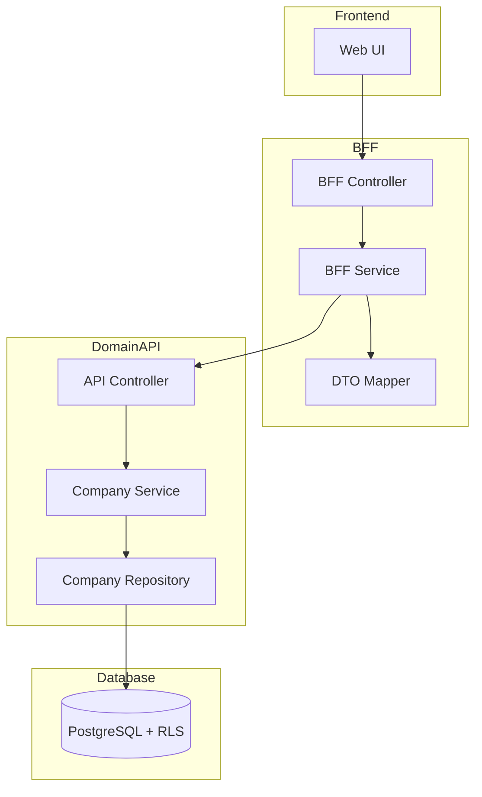
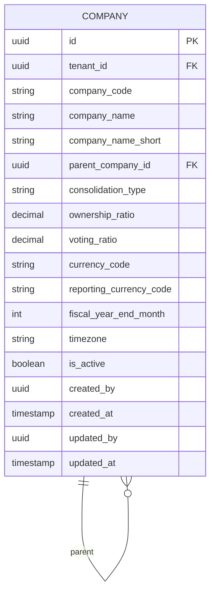

# Technical Design Document

## Feature: master-data/company-master

---

## Overview

法人マスタは、EPM SaaS における法人（会社）の基本情報、連結階層（親子関係）、連結種別、出資比率・議決権比率、通貨設定、決算月等の CRUD 管理機能である。本機能は accounting_periods、organization_versions、subjects、employees、projects 等の多くのエンティティから FK 参照される基盤マスタとして位置づけられる。

マルチテナント環境において tenant_id による完全なデータ分離を実現し、tenant_id + company_code の複合一意制約により法人を確実に識別する。会社階層は parent_company_id による自己参照で表現し、連結会計の基盤を提供する。物理削除は行わず、is_active フラグによる無効化で運用する。

---

## Architecture

### Architecture Pattern & Boundary Map

**Pattern (fixed)**:
- UI（apps/web） → BFF（apps/bff） → Domain API（apps/api） → DB（PostgreSQL + RLS）
- UI 直 API は禁止



**Contracts (SSoT)**:
- UI ↔ BFF: `packages/contracts/src/bff/company-master`
- BFF ↔ Domain API: `packages/contracts/src/api/company-master`
- Enum/Error: `packages/contracts/src/api/errors`
- UI は `packages/contracts/src/api` を参照してはならない

---

## Architecture Responsibilities（Mandatory）

### BFF Specification（apps/bff）

**Purpose**
- UI 要件に最適化した API（Read Model / ViewModel）
- Domain API のレスポンスを集約・変換（ビジネスルールの正本は持たない）

**BFF Endpoints（UI が叩く）**

| Method | Endpoint | Purpose | Request DTO (contracts/bff) | Response DTO (contracts/bff) | Notes |
|--------|----------|---------|-----------------------------|-----------------------------|-------|
| GET | /api/bff/master-data/company-master | 法人一覧取得 | BffListCompaniesRequest | BffListCompaniesResponse | 検索・ページング・ソート |
| GET | /api/bff/master-data/company-master/tree | 法人階層ツリー取得 | - | BffCompanyTreeResponse | 連結階層表示用 |
| GET | /api/bff/master-data/company-master/:id | 法人詳細取得 | - | BffCompanyDetailResponse | UUID パス |
| POST | /api/bff/master-data/company-master | 法人新規登録 | BffCreateCompanyRequest | BffCompanyDetailResponse | - |
| PATCH | /api/bff/master-data/company-master/:id | 法人情報更新 | BffUpdateCompanyRequest | BffCompanyDetailResponse | 部分更新 |
| POST | /api/bff/master-data/company-master/:id/deactivate | 法人無効化 | - | BffCompanyDetailResponse | is_active → false |
| POST | /api/bff/master-data/company-master/:id/reactivate | 法人再有効化 | - | BffCompanyDetailResponse | is_active → true |

**Naming Convention（必須）**
- DTO / Contracts: camelCase（例: `companyCode`, `companyName`）
- DB columns: snake_case（例: `company_code`, `company_name`）
- `sortBy` は **DTO 側キー**を採用する（例: `companyCode | companyName`）
- DB 列名（snake_case）を UI/BFF へ露出させない

**Paging / Sorting Normalization（必須・BFF 責務）**
- UI/BFF: page / pageSize（page-based, 1-indexed）
- Domain API: offset / limit（DB-friendly, 0-indexed）
- BFF は必ず以下を実施する（省略禁止）：
  - defaults: page=1, pageSize=50, sortBy=companyCode, sortOrder=asc
  - clamp: pageSize <= 200
  - whitelist: sortBy は許可リストのみ（`companyCode | companyName`）
  - normalize: keyword trim、空→undefined
  - transform: offset=(page-1)*pageSize, limit=pageSize
- Domain API に渡すのは offset/limit（page/pageSize は渡さない）
- BFF レスポンスには page/pageSize を含める（UI へ返すのは BFF 側の値）

**Transformation Rules（api DTO → bff DTO）**
- field 名は同一（camelCase 維持）
- 日付は ISO 8601 文字列として返却
- totalCount は Domain API から取得し、BFF レスポンスに含める
- parentCompanyId → parentCompanyName の解決は BFF で実施（一覧用）

**Error Policy（必須）**
- この Feature における BFF の Error Policy は以下とする：
  - 採用方針：**Option A: Pass-through**
  - 採用理由：
    - 法人マスタは標準的な CRUD 操作であり、特別な UI 整形は不要
    - Domain API のエラーコードは明確で、UI で直接ハンドリング可能
    - ビジネスロジックの正本は Domain API であり、BFF での再分類は不要

**Error Handling（contracts error に準拠）**
| Domain API Error | HTTP Status | BFF Action |
|-----------------|-------------|------------|
| COMPANY_NOT_FOUND | 404 | Pass-through |
| COMPANY_CODE_DUPLICATE | 409 | Pass-through |
| COMPANY_ALREADY_INACTIVE | 409 | Pass-through |
| COMPANY_ALREADY_ACTIVE | 409 | Pass-through |
| PARENT_COMPANY_NOT_FOUND | 404 | Pass-through |
| SELF_REFERENCE_NOT_ALLOWED | 422 | Pass-through |
| VALIDATION_ERROR | 422 | Pass-through |

**Authentication / Tenant Context**
- tenant_id / user_id は認証ミドルウェアで解決し、リクエストコンテキストに付与
- Domain API へは `x-tenant-id` / `x-user-id` ヘッダーで伝搬

---

### Service Specification（Domain / apps/api）

**Purpose**
- ビジネスルールの正本（BFF/UI は禁止）
- Transaction boundary / audit points を必ず明記

**Domain API Endpoints**

| Method | Endpoint | Purpose | Transaction | Audit |
|--------|----------|---------|-------------|-------|
| GET | /api/master-data/company-master | 一覧取得 | Read-only | - |
| GET | /api/master-data/company-master/tree | 階層ツリー取得 | Read-only | - |
| GET | /api/master-data/company-master/:id | 詳細取得 | Read-only | - |
| POST | /api/master-data/company-master | 新規登録 | Write（単一） | created_by/at |
| PATCH | /api/master-data/company-master/:id | 更新 | Write（単一） | updated_by/at |
| POST | /api/master-data/company-master/:id/deactivate | 無効化 | Write（単一） | updated_by/at |
| POST | /api/master-data/company-master/:id/reactivate | 再有効化 | Write（単一） | updated_by/at |

**Business Rules（Service 責務）**
- 法人コード重複チェック（tenant_id + company_code）
- 連結種別バリデーション（full / equity / none）
- 出資比率・議決権比率の範囲チェック（0〜100、NULL許可）
- 決算月の範囲チェック（1〜12）
- 親法人存在チェック（同一テナント内）
- 自己参照禁止（parent_company_id ≠ id）
- 無効化済み法人の再無効化禁止
- 有効法人の再有効化禁止
- 必須項目バリデーション（companyCode, companyName, consolidationType, currencyCode, fiscalYearEndMonth）

**Transaction Boundary**
- 各操作は単一トランザクションで完結
- 複数エンティティにまたがる操作は本機能スコープ外

---

### Repository Specification（apps/api）

**Purpose**
- データアクセス層（Prisma 経由）
- tenant_id による二重ガード

**Repository Methods**

| Method | Parameters | Returns | Notes |
|--------|------------|---------|-------|
| findMany | tenantId, filter, pagination, sort | Company[], totalCount | ページング対応 |
| findById | tenantId, id | Company \| null | UUID で取得 |
| findByCode | tenantId, companyCode | Company \| null | 重複チェック用 |
| findAllForTree | tenantId | Company[] | 階層ツリー構築用（全件） |
| create | tenantId, data | Company | 監査情報含む |
| update | tenantId, id, data | Company | 監査情報更新 |

**Tenant Guard（必須）**
- 全メソッドの第一引数は tenantId
- where 句に必ず tenant_id 条件を含める
- PrismaService.setTenantContext() を呼び出してから Prisma クエリ実行
- RLS 無効化は禁止

```typescript
// Repository パターン例
async findMany(tenantId: string, ...): Promise<Company[]> {
  await this.prisma.setTenantContext(tenantId);
  return this.prisma.company.findMany({
    where: {
      tenant_id: tenantId,  // アプリケーションガード
      // ... その他フィルタ
    },
  });
}
```

---

### Contracts Summary（This Feature）

**BFF Contracts（packages/contracts/src/bff/company-master）**

```typescript
// Enums
export const ConsolidationType = {
  FULL: 'full',
  EQUITY: 'equity',
  NONE: 'none',
} as const;
export type ConsolidationType = typeof ConsolidationType[keyof typeof ConsolidationType];

// Request DTOs
export interface BffListCompaniesRequest {
  page?: number;           // default: 1
  pageSize?: number;       // default: 50, max: 200
  sortBy?: 'companyCode' | 'companyName';
  sortOrder?: 'asc' | 'desc';
  keyword?: string;        // 法人コード・法人名部分一致
  isActive?: boolean;      // 有効フラグフィルタ
  consolidationType?: ConsolidationType;  // 連結種別フィルタ
}

export interface BffCreateCompanyRequest {
  companyCode: string;
  companyName: string;
  companyNameShort?: string;
  parentCompanyId?: string;
  consolidationType: ConsolidationType;
  ownershipRatio?: number;        // 0-100
  votingRatio?: number;           // 0-100
  currencyCode: string;           // ISO 4217 (e.g., "JPY")
  reportingCurrencyCode?: string; // ISO 4217
  fiscalYearEndMonth: number;     // 1-12
  timezone?: string;              // IANA timezone (e.g., "Asia/Tokyo")
}

export interface BffUpdateCompanyRequest {
  companyCode?: string;
  companyName?: string;
  companyNameShort?: string;
  parentCompanyId?: string | null;  // null で親法人解除
  consolidationType?: ConsolidationType;
  ownershipRatio?: number | null;
  votingRatio?: number | null;
  currencyCode?: string;
  reportingCurrencyCode?: string | null;
  fiscalYearEndMonth?: number;
  timezone?: string | null;
}

// Response DTOs
export interface BffCompanySummary {
  id: string;
  companyCode: string;
  companyName: string;
  consolidationType: ConsolidationType;
  currencyCode: string;
  fiscalYearEndMonth: number;
  isActive: boolean;
}

export interface BffListCompaniesResponse {
  items: BffCompanySummary[];
  totalCount: number;
  page: number;
  pageSize: number;
}

export interface BffCompanyDetailResponse {
  id: string;
  companyCode: string;
  companyName: string;
  companyNameShort: string | null;
  parentCompanyId: string | null;
  parentCompanyName: string | null;  // BFF で解決
  consolidationType: ConsolidationType;
  ownershipRatio: number | null;
  votingRatio: number | null;
  currencyCode: string;
  reportingCurrencyCode: string | null;
  fiscalYearEndMonth: number;
  timezone: string | null;
  isActive: boolean;
  createdAt: string;
  updatedAt: string;
}

// Tree Response（階層表示用）
export interface BffCompanyTreeNode {
  id: string;
  companyCode: string;
  companyName: string;
  consolidationType: ConsolidationType;
  isActive: boolean;
  children: BffCompanyTreeNode[];
}

export interface BffCompanyTreeResponse {
  roots: BffCompanyTreeNode[];  // 親なし法人がルート
}
```

**API Contracts（packages/contracts/src/api/company-master）**

```typescript
// Request DTOs
export interface ApiListCompaniesRequest {
  offset: number;          // 0-indexed
  limit: number;
  sortBy?: string;
  sortOrder?: 'asc' | 'desc';
  keyword?: string;
  isActive?: boolean;
  consolidationType?: string;
}

export interface ApiCreateCompanyRequest {
  companyCode: string;
  companyName: string;
  companyNameShort?: string;
  parentCompanyId?: string;
  consolidationType: string;
  ownershipRatio?: number;
  votingRatio?: number;
  currencyCode: string;
  reportingCurrencyCode?: string;
  fiscalYearEndMonth: number;
  timezone?: string;
}

export interface ApiUpdateCompanyRequest {
  companyCode?: string;
  companyName?: string;
  companyNameShort?: string;
  parentCompanyId?: string | null;
  consolidationType?: string;
  ownershipRatio?: number | null;
  votingRatio?: number | null;
  currencyCode?: string;
  reportingCurrencyCode?: string | null;
  fiscalYearEndMonth?: number;
  timezone?: string | null;
}

// Response DTOs
export interface ApiCompanyResponse {
  id: string;
  companyCode: string;
  companyName: string;
  companyNameShort: string | null;
  parentCompanyId: string | null;
  consolidationType: string;
  ownershipRatio: number | null;
  votingRatio: number | null;
  currencyCode: string;
  reportingCurrencyCode: string | null;
  fiscalYearEndMonth: number;
  timezone: string | null;
  isActive: boolean;
  createdAt: string;
  updatedAt: string;
}

export interface ApiListCompaniesResponse {
  items: ApiCompanyResponse[];
  totalCount: number;
}

export interface ApiCompanyTreeNode {
  id: string;
  companyCode: string;
  companyName: string;
  consolidationType: string;
  isActive: boolean;
  children: ApiCompanyTreeNode[];
}

export interface ApiCompanyTreeResponse {
  roots: ApiCompanyTreeNode[];
}
```

**Error Contracts（packages/contracts/src/api/errors/company-master-error.ts）**

```typescript
export const CompanyMasterErrorCode = {
  COMPANY_NOT_FOUND: 'COMPANY_NOT_FOUND',
  COMPANY_CODE_DUPLICATE: 'COMPANY_CODE_DUPLICATE',
  COMPANY_ALREADY_INACTIVE: 'COMPANY_ALREADY_INACTIVE',
  COMPANY_ALREADY_ACTIVE: 'COMPANY_ALREADY_ACTIVE',
  PARENT_COMPANY_NOT_FOUND: 'PARENT_COMPANY_NOT_FOUND',
  SELF_REFERENCE_NOT_ALLOWED: 'SELF_REFERENCE_NOT_ALLOWED',
  VALIDATION_ERROR: 'VALIDATION_ERROR',
} as const;

export type CompanyMasterErrorCode =
  typeof CompanyMasterErrorCode[keyof typeof CompanyMasterErrorCode];

export interface CompanyMasterError {
  code: CompanyMasterErrorCode;
  message: string;
  details?: Record<string, unknown>;
}
```

---

## Responsibility Clarification（Mandatory）

本 Feature における責務境界を以下に明記する。
未記載の責務は実装してはならない。

### UI の責務
- 表示制御（enable/disable / 文言切替）
- フォーム入力制御・UX 最適化
- エラーコードに基づく表示切替
- 階層ツリーのレンダリング
- ビジネス判断は禁止

### BFF の責務
- UI 入力の正規化（paging / sorting / filtering）
- page/pageSize → offset/limit 変換
- Domain API DTO ⇄ UI DTO の変換
- sortBy ホワイトリスト検証
- parentCompanyId → parentCompanyName の解決
- ビジネスルールの正本は持たない

### Domain API の責務
- ビジネスルールの正本
- 法人コード重複チェック
- 連結種別・比率・決算月バリデーション
- 親法人存在チェック・自己参照禁止
- 無効化/再有効化の状態遷移検証
- 監査ログ・整合性保証
- tenant_id による最終ガード

---

## Data Model（エンティティ整合性確認必須）

### Entity Reference
- 参照元: `.kiro/specs/entities/01_各種マスタ.md` セクション 1.2 companies（法人マスタ）

### エンティティ整合性チェックリスト

| チェック項目 | 確認結果 |
|-------------|---------|
| カラム網羅性 | エンティティ定義の全カラムがDTO/Prismaに反映されている: ✅ |
| 型の一致 | varchar→String, numeric→Decimal 等の型変換が正確: ✅ |
| 制約の反映 | UNIQUE/CHECK制約がPrisma/アプリ検証に反映: ✅ |
| ビジネスルール | エンティティ補足のルール（parent_company_id同一tenant）がServiceに反映: ✅ |
| NULL許可 | NULL/NOT NULLがPrisma?/必須に正しく対応: ✅ |

### Entity: Company



**Prisma Schema**

```prisma
model Company {
  id                    String    @id @default(uuid())
  tenantId              String    @map("tenant_id")
  companyCode           String    @map("company_code") @db.VarChar(20)
  companyName           String    @map("company_name") @db.VarChar(200)
  companyNameShort      String?   @map("company_name_short") @db.VarChar(100)
  parentCompanyId       String?   @map("parent_company_id")
  consolidationType     String    @map("consolidation_type") @db.VarChar(20)
  ownershipRatio        Decimal?  @map("ownership_ratio") @db.Decimal(5, 2)
  votingRatio           Decimal?  @map("voting_ratio") @db.Decimal(5, 2)
  currencyCode          String    @map("currency_code") @db.Char(3)
  reportingCurrencyCode String?   @map("reporting_currency_code") @db.Char(3)
  fiscalYearEndMonth    Int       @map("fiscal_year_end_month")
  timezone              String?   @db.VarChar(50)
  isActive              Boolean   @default(true) @map("is_active")
  createdBy             String?   @map("created_by")
  createdAt             DateTime  @default(now()) @map("created_at")
  updatedBy             String?   @map("updated_by")
  updatedAt             DateTime  @updatedAt @map("updated_at")

  // Self-relation for parent company
  parentCompany         Company?  @relation("CompanyHierarchy", fields: [parentCompanyId], references: [id])
  childCompanies        Company[] @relation("CompanyHierarchy")

  @@unique([tenantId, companyCode])
  @@unique([tenantId, id])
  @@index([tenantId])
  @@index([tenantId, isActive])
  @@index([tenantId, parentCompanyId])
  @@map("companies")
}
```

**Constraints（エンティティ定義から転記）**
- PK: id（UUID）
- UNIQUE: tenant_id + company_code
- UNIQUE: tenant_id + id（複合FK用）
- CHECK: consolidation_type IN ('full', 'equity', 'none')（アプリケーション層で検証）
- CHECK: ownership_ratio IS NULL OR (0 <= ownership_ratio <= 100)（アプリケーション層で検証）
- CHECK: voting_ratio IS NULL OR (0 <= voting_ratio <= 100)（アプリケーション層で検証）
- CHECK: fiscal_year_end_month BETWEEN 1 AND 12（アプリケーション層で検証）

**RLS Policy（PostgreSQL）**

```sql
-- RLS 有効化
ALTER TABLE companies ENABLE ROW LEVEL SECURITY;

-- テナント分離ポリシー
CREATE POLICY tenant_isolation ON companies
  USING (tenant_id::text = current_setting('app.tenant_id', true));
```

---

## Requirements Traceability

| Requirement | Summary | Components | Interfaces | Flows |
|-------------|---------|------------|------------|-------|
| 1.1 | テナント所属法人一覧取得 | Repository.findMany | GET /company-master | List |
| 1.2 | 検索条件フィルタ | BFF.normalize, Repository | BffListCompaniesRequest | List |
| 1.3 | ソート機能 | BFF.whitelist | sortBy/sortOrder | List |
| 1.4 | ページネーション | BFF.transform | page/pageSize | List |
| 1.5 | 一覧表示項目 | BffCompanySummary | - | List |
| 2.1 | 詳細情報表示 | Repository.findById | GET /:id | Detail |
| 2.2 | 詳細表示項目 | BffCompanyDetailResponse | - | Detail |
| 2.3 | 法人不存在エラー | Service | COMPANY_NOT_FOUND | Error |
| 3.1 | 新規登録 | Service.create | POST / | Create |
| 3.2 | 登録後詳細返却 | Controller | BffCompanyDetailResponse | Create |
| 3.3 | 重複エラー | Service | COMPANY_CODE_DUPLICATE | Error |
| 3.4 | 必須項目バリデーション | Service | VALIDATION_ERROR | Error |
| 3.5 | 連結種別バリデーション | Service | VALIDATION_ERROR | Error |
| 3.6 | 比率範囲バリデーション | Service | VALIDATION_ERROR | Error |
| 3.7 | 決算月範囲バリデーション | Service | VALIDATION_ERROR | Error |
| 3.8 | isActive 初期化 | Service.create | - | Create |
| 3.9 | 監査情報記録 | Repository | created_by/at | Create |
| 4.1 | 情報更新 | Service.update | PATCH /:id | Update |
| 4.2 | 更新後詳細返却 | Controller | BffCompanyDetailResponse | Update |
| 4.3 | 更新対象不存在 | Service | COMPANY_NOT_FOUND | Error |
| 4.4 | コード変更時重複 | Service | COMPANY_CODE_DUPLICATE | Error |
| 4.5 | 更新時バリデーション | Service | VALIDATION_ERROR | Error |
| 4.6 | 更新監査情報 | Repository | updated_by/at | Update |
| 5.1 | 無効化実行 | Service.deactivate | POST /:id/deactivate | Deactivate |
| 5.2 | 無効化後詳細返却 | Controller | BffCompanyDetailResponse | Deactivate |
| 5.3 | 対象不存在 | Service | COMPANY_NOT_FOUND | Error |
| 5.4 | 既無効化エラー | Service | COMPANY_ALREADY_INACTIVE | Error |
| 5.5 | 無効化監査情報 | Repository | updated_by/at | Deactivate |
| 6.1 | 再有効化実行 | Service.reactivate | POST /:id/reactivate | Reactivate |
| 6.2 | 再有効化後詳細返却 | Controller | BffCompanyDetailResponse | Reactivate |
| 6.3 | 対象不存在 | Service | COMPANY_NOT_FOUND | Error |
| 6.4 | 既有効エラー | Service | COMPANY_ALREADY_ACTIVE | Error |
| 6.5 | 再有効化監査情報 | Repository | updated_by/at | Reactivate |
| 7.1 | 親法人設定 | Service.create/update | parentCompanyId | Hierarchy |
| 7.2 | 同一テナント制約 | Service | - | Hierarchy |
| 7.3 | 親法人不存在エラー | Service | PARENT_COMPANY_NOT_FOUND | Error |
| 7.4 | 自己参照禁止 | Service | SELF_REFERENCE_NOT_ALLOWED | Error |
| 7.5 | 親法人名表示 | BFF.resolve | parentCompanyName | Detail |
| 7.6 | 階層ツリー取得 | Repository.findAllForTree | GET /tree | Tree |
| 8.1 | tenant_id フィルタ | Repository | where tenant_id | All |
| 8.2 | Repository 必須引数 | Repository signature | tenantId first arg | All |
| 8.3 | RLS double-guard | PrismaService.setTenantContext | - | All |
| 8.4 | 異テナントアクセス拒否 | RLS Policy | - | Security |
| 9.1 | 複合一意制約 | Prisma @@unique | - | DB |
| 9.2 | 重複エラー | Service | COMPANY_CODE_DUPLICATE | Error |
| 10.1 | 操作ユーザーID記録 | Repository | created_by/updated_by | Audit |
| 10.2 | 操作日時記録 | Prisma @default(now) | created_at/updated_at | Audit |
| 10.3 | 監査情報自動記録 | Prisma @updatedAt | - | Audit |

---

## Component Summary

| Component | Domain | Intent | Requirements | Dependencies |
|-----------|--------|--------|--------------|--------------|
| CompanyMasterController (API) | Domain API | REST エンドポイント提供 | All | Service |
| CompanyMasterService | Domain API | ビジネスルール実行 | 3-10 | Repository |
| CompanyMasterRepository | Domain API | データアクセス | 7, 8, 9, 10 | PrismaService |
| CompanyMasterController (BFF) | BFF | UI 向けエンドポイント | All | BffService |
| CompanyMasterService (BFF) | BFF | DTO 変換・正規化 | 1, 7 | Mapper, ApiClient |
| CompanyMasterMapper | BFF | DTO 変換 | - | - |

---

## Technology Stack & Alignment

| Layer | Technology | Version | Role |
|-------|------------|---------|------|
| Frontend | Next.js (App Router) | 14.x | UI ホスティング |
| Frontend | React | 18.x | UI コンポーネント |
| Frontend | TypeScript | 5.x | 型安全性 |
| Frontend | TanStack Query | 5.x | Server State 管理 |
| BFF | NestJS | 10.x | BFF フレームワーク |
| Backend | NestJS | 10.x | Domain API フレームワーク |
| Backend | TypeScript | 5.x | 型安全性 |
| Backend | Prisma | 5.x | ORM |
| Database | PostgreSQL | 15.x | RDBMS + RLS |
| Contracts | TypeScript | 5.x | 型定義 SSoT |

---

## Security Considerations

- **マルチテナント分離**: tenant_id による RLS + アプリケーションガード（double-guard）
- **認証**: Clerk 経由で認証済みユーザーのみアクセス可
- **認可**: 本機能では権限チェックは実装対象外（将来拡張）
- **入力検証**:
  - companyCode: 最大 20 文字
  - companyName: 最大 200 文字
  - consolidationType: full / equity / none のみ
  - ownershipRatio / votingRatio: 0〜100（NULL許可）
  - fiscalYearEndMonth: 1〜12
  - currencyCode: ISO 4217（3文字）

---

## Testing Strategy

| Test Type | Scope | Tools | Coverage Target |
|-----------|-------|-------|-----------------|
| Unit | Service | Jest | ビジネスロジック 100% |
| Unit | Mapper | Jest | 変換ロジック 100% |
| Integration | Repository + DB | Jest + Testcontainers | CRUD + RLS + 階層 |
| E2E | UI → BFF → API → DB | Playwright | 主要シナリオ |

---

## Open Questions / Risks

- **Q1**: 循環参照チェック（A→B→C→A）は必要か？
  - **Decision**: 初期実装では自己参照禁止のみ。循環検出は UseCase 拡張として後回し。
- **Q2**: 通貨コードのマスタ管理は？
  - **Decision**: 本機能では code 値のみ保持。通貨マスタは別機能として将来実装。
- **Q3**: 決算月変更時の既存会計期間への影響は？
  - **Decision**: 本機能スコープ外。accounting_periods 側で管理。
- **Risk**: 大量法人（1,000 社超）での階層ツリー取得性能
  - **Mitigation**: findAllForTree は全件取得だが、1テナント内の法人数は限定的と想定。必要に応じてキャッシュ検討。

---

## UI Specification（v0生成用）

### 画面構成

| 画面 | 形式 | 説明 |
|------|------|------|
| 一覧画面 | テーブル形式 | 法人一覧を表示、検索・ソート・ページング対応 |
| 詳細/編集 | ダイアログ形式 | 一覧から選択時にダイアログで表示・編集 |
| 新規登録 | ダイアログ形式 | 新規作成ボタンからダイアログで登録 |
| ツリー表示 | 一覧画面内 | 一覧テーブルの上部にツリービュー表示（親子1階層のみ） |

### 一覧画面仕様

**表示カラム**
| カラム | 表示名 | 備考 |
|--------|--------|------|
| companyCode | 法人コード | - |
| companyName | 法人名 | - |
| consolidationType | 連結種別 | 完全連結/持分法/非連結 で表示 |
| currencyCode | 通貨 | - |
| fiscalYearEndMonth | 決算月 | 「3月決算」形式で表示 |
| isActive | 状態 | 有効/無効（無効行はグレーアウト表示） |

**無効法人の表示**
- 一覧には無効法人も表示する
- 無効法人の行は**グレーアウト**して視覚的に区別する
- isActive フィルタで有効/無効/すべての切替可能

### 詳細/編集ダイアログ仕様

**フォーム項目**
| 項目 | 入力形式 | 必須 | 備考 |
|------|---------|------|------|
| companyCode | テキスト入力 | ✅ | 最大20文字 |
| companyName | テキスト入力 | ✅ | 最大200文字 |
| companyNameShort | テキスト入力 | - | 最大100文字 |
| parentCompanyId | ドロップダウン | - | 有効法人のみ選択可、自身は除外 |
| consolidationType | ドロップダウン | ✅ | 完全連結/持分法/非連結 |
| ownershipRatio | 数値入力 + % | - | 0-100、小数1桁まで、連結種別が「非連結」時は入力不可 |
| votingRatio | 数値入力 + % | - | 0-100、小数1桁まで、連結種別が「非連結」時は入力不可 |
| currencyCode | ドロップダウン | ✅ | JPY/USD/EUR/CNY/GBP/KRW/TWD/SGD/THB/VND 等 |
| reportingCurrencyCode | ドロップダウン | - | 同上 |
| fiscalYearEndMonth | ドロップダウン | ✅ | 1月決算〜12月決算 |
| timezone | ドロップダウン | - | Asia/Tokyo 等 IANA形式 |

**連結種別の表示ラベル**
| 値 | 表示ラベル |
|----|-----------|
| full | 完全連結 |
| equity | 持分法 |
| none | 非連結 |

**決算月の表示形式**
- ドロップダウン選択肢: 「1月決算」「2月決算」...「12月決算」
- 一覧表示: 「3月決算」形式

**比率入力の条件付き制御**
- 連結種別が「非連結（none）」の場合、出資比率・議決権比率は**入力不可（disabled）**
- 連結種別を「非連結」に変更した場合、入力済みの比率は**クリア**される

### ツリー表示仕様

**表示形式**
- 一覧画面の上部にツリービューを配置
- 親子1階層のみ（孫会社は想定しない）
- 親なし法人がルートノードとして表示
- 折りたたみ機能は不要（常に展開表示）
- **無効法人はツリーに表示しない**（有効法人のみ）

**ツリーノード表示**
- 法人コード + 法人名
- 連結種別アイコン/バッジ

**操作**
- ノードクリックで詳細ダイアログを開く（遷移可能）

### 通貨コード選択肢（ドロップダウン）

| コード | 表示名 |
|--------|--------|
| JPY | 日本円 (JPY) |
| USD | 米ドル (USD) |
| EUR | ユーロ (EUR) |
| CNY | 人民元 (CNY) |
| GBP | 英ポンド (GBP) |
| KRW | 韓国ウォン (KRW) |
| TWD | 台湾ドル (TWD) |
| SGD | シンガポールドル (SGD) |
| THB | タイバーツ (THB) |
| VND | ベトナムドン (VND) |

### タイムゾーン選択肢（ドロップダウン）

| 値 | 表示名 |
|----|--------|
| Asia/Tokyo | 日本標準時 (JST) |
| Asia/Shanghai | 中国標準時 (CST) |
| Asia/Singapore | シンガポール標準時 (SGT) |
| Asia/Bangkok | タイ標準時 (ICT) |
| Asia/Ho_Chi_Minh | ベトナム標準時 (ICT) |
| America/New_York | 米国東部時間 (EST/EDT) |
| America/Los_Angeles | 米国太平洋時間 (PST/PDT) |
| Europe/London | 英国標準時 (GMT/BST) |
| Europe/Paris | 中央ヨーロッパ時間 (CET/CEST) |

---

## References

- [requirements.md](./requirements.md) — 要件定義
- `.kiro/specs/entities/01_各種マスタ.md` — エンティティ定義 SSoT
- `.kiro/steering/tech.md` — 技術憲法
- `.kiro/steering/structure.md` — 構造憲法
