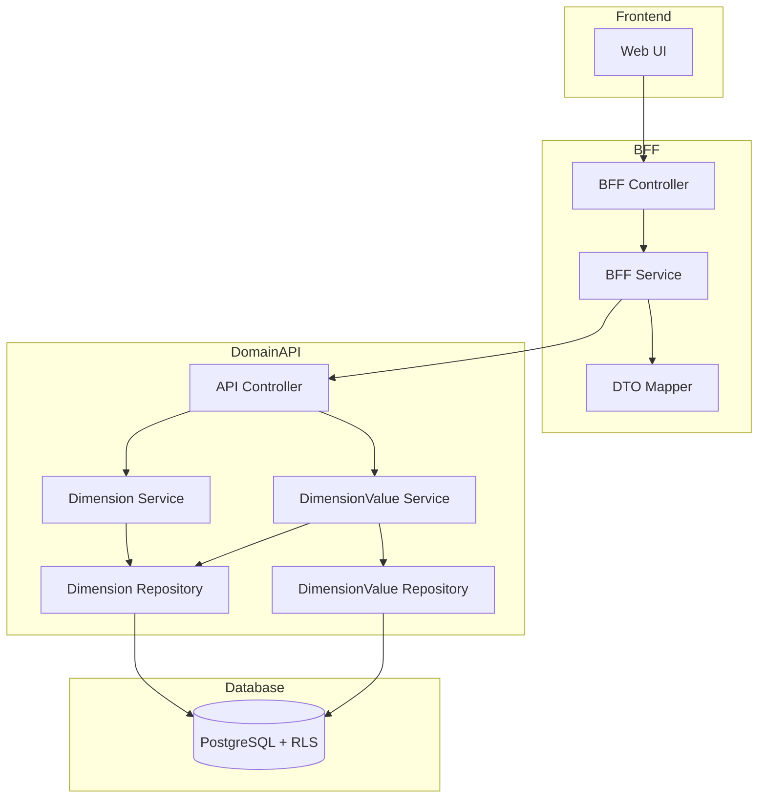
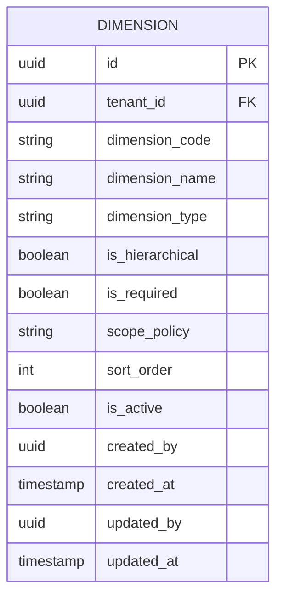
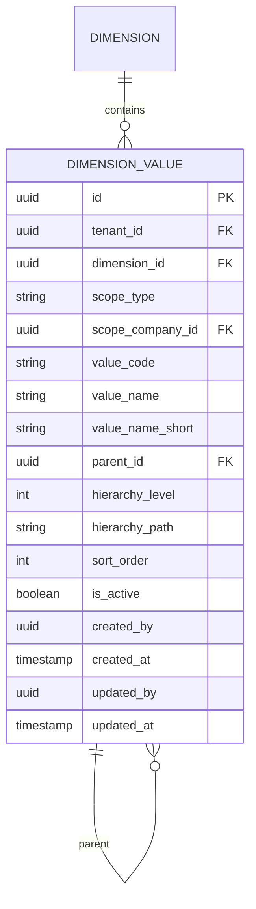

# Technical Design Document

## Feature: master-data/dimension-master

---

## Overview

ディメンションマスタは、EPM SaaS における「集計軸（ディメンション）とその値（Group）」を統一的に管理する CRUD 機能である。本機能は dimensions（ディメンション定義）と dimension_values（ディメンション値）の2エンティティを対象とし、IRセグメント・製品カテゴリ・得意先グループ・地域など複数の分析軸を統一インターフェースで管理する。

dimension_values は階層構造（自己参照）を持ち、hierarchy_level / hierarchy_path をキャッシュとして保持する。親値変更時は子孫ノードの階層情報を連鎖的に再計算する。また、scope_type（tenant / company）によりテナント共通または会社別の値管理が可能である。

本設計は社員マスタ・プロジェクトマスタと同一のアーキテクチャパターンを採用し、一貫性と保守性を確保する。

---

## Architecture

### Architecture Pattern & Boundary Map

**Pattern (fixed)**:
- UI（apps/web） → BFF（apps/bff） → Domain API（apps/api） → DB（PostgreSQL + RLS）
- UI 直 API は禁止



**Contracts (SSoT)**:
- UI ↔ BFF: `packages/contracts/src/bff/dimension-master`
- BFF ↔ Domain API: `packages/contracts/src/api/dimension-master`
- Enum/Error: `packages/contracts/src/api/errors`
- UI は `packages/contracts/src/api` を参照してはならない

---

## Architecture Responsibilities（Mandatory）

### BFF Specification（apps/bff）

**Purpose**
- UI 要件に最適化した API（Read Model / ViewModel）
- Domain API のレスポンスを集約・変換（ビジネスルールの正本は持たない）

**BFF Endpoints（UI が叩く）**

**Dimension エンドポイント**

| Method | Endpoint | Purpose | Request DTO (contracts/bff) | Response DTO (contracts/bff) | Notes |
|--------|----------|---------|-----------------------------|-----------------------------|-------|
| GET | /api/bff/master-data/dimensions | ディメンション一覧取得 | BffListDimensionsRequest | BffListDimensionsResponse | 検索・ページング・ソート |
| GET | /api/bff/master-data/dimensions/:id | ディメンション詳細取得 | - | BffDimensionDetailResponse | UUID パス |
| POST | /api/bff/master-data/dimensions | ディメンション新規登録 | BffCreateDimensionRequest | BffDimensionDetailResponse | - |
| PATCH | /api/bff/master-data/dimensions/:id | ディメンション情報更新 | BffUpdateDimensionRequest | BffDimensionDetailResponse | 部分更新 |
| POST | /api/bff/master-data/dimensions/:id/deactivate | ディメンション無効化 | - | BffDimensionDetailResponse | is_active → false |
| POST | /api/bff/master-data/dimensions/:id/reactivate | ディメンション再有効化 | - | BffDimensionDetailResponse | is_active → true |

**Dimension Value エンドポイント**

| Method | Endpoint | Purpose | Request DTO (contracts/bff) | Response DTO (contracts/bff) | Notes |
|--------|----------|---------|-----------------------------|-----------------------------|-------|
| GET | /api/bff/master-data/dimensions/:dimensionId/values | ディメンション値一覧取得 | BffListDimensionValuesRequest | BffListDimensionValuesResponse | 検索・ページング・ソート |
| GET | /api/bff/master-data/dimensions/:dimensionId/values/:id | ディメンション値詳細取得 | - | BffDimensionValueDetailResponse | UUID パス |
| POST | /api/bff/master-data/dimensions/:dimensionId/values | ディメンション値新規登録 | BffCreateDimensionValueRequest | BffDimensionValueDetailResponse | 階層自動計算 |
| PATCH | /api/bff/master-data/dimensions/:dimensionId/values/:id | ディメンション値更新 | BffUpdateDimensionValueRequest | BffDimensionValueDetailResponse | 親変更時は子孫再計算 |
| POST | /api/bff/master-data/dimensions/:dimensionId/values/:id/deactivate | ディメンション値無効化 | - | BffDimensionValueDetailResponse | is_active → false |
| POST | /api/bff/master-data/dimensions/:dimensionId/values/:id/reactivate | ディメンション値再有効化 | - | BffDimensionValueDetailResponse | is_active → true |

**Naming Convention（必須）**
- DTO / Contracts: camelCase（例: `dimensionCode`, `dimensionName`, `valueCode`）
- DB columns: snake_case（例: `dimension_code`, `dimension_name`, `value_code`）
- `sortBy` は **DTO 側キー**を採用する
  - Dimension: `dimensionCode | dimensionName | sortOrder`
  - DimensionValue: `valueCode | valueName | sortOrder | hierarchyLevel`
- DB 列名（snake_case）を UI/BFF へ露出させない

**Paging / Sorting Normalization（必須・BFF 責務）**
- UI/BFF: page / pageSize（page-based, 1-indexed）
- Domain API: offset / limit（DB-friendly, 0-indexed）
- BFF は必ず以下を実施する（省略禁止）：
  - defaults: page=1, pageSize=50, sortBy=dimensionCode/valueCode, sortOrder=asc
  - clamp: pageSize <= 200
  - whitelist: sortBy は許可リストのみ
  - normalize: keyword trim、空→undefined
  - transform: offset=(page-1)*pageSize, limit=pageSize
- Domain API に渡すのは offset/limit（page/pageSize は渡さない）
- BFF レスポンスには page/pageSize を含める（UI へ返すのは BFF 側の値）

**Transformation Rules（api DTO → bff DTO）**
- field 名は同一（camelCase 維持）
- 日付は ISO 8601 文字列として返却
- totalCount は Domain API から取得し、BFF レスポンスに含める

**Error Policy（必須）**
- この Feature における BFF の Error Policy は以下とする：
  - 採用方針：**Option A: Pass-through**
  - 採用理由：
    - ディメンションマスタは標準的な CRUD 操作であり、特別な UI 整形は不要
    - Domain API のエラーコードは明確で、UI で直接ハンドリング可能
    - ビジネスロジックの正本は Domain API であり、BFF での再分類は不要
    - 社員マスタ・プロジェクトマスタと同一方針で一貫性を確保

**Error Handling（contracts error に準拠）**

| Domain API Error | HTTP Status | BFF Action |
|-----------------|-------------|------------|
| DIMENSION_NOT_FOUND | 404 | Pass-through |
| DIMENSION_CODE_DUPLICATE | 409 | Pass-through |
| DIMENSION_ALREADY_INACTIVE | 409 | Pass-through |
| DIMENSION_ALREADY_ACTIVE | 409 | Pass-through |
| DIMENSION_VALUE_NOT_FOUND | 404 | Pass-through |
| VALUE_CODE_DUPLICATE | 409 | Pass-through |
| DIMENSION_VALUE_ALREADY_INACTIVE | 409 | Pass-through |
| DIMENSION_VALUE_ALREADY_ACTIVE | 409 | Pass-through |
| CIRCULAR_REFERENCE_DETECTED | 422 | Pass-through |
| VALIDATION_ERROR | 422 | Pass-through |

**Authentication / Tenant Context**
- tenant_id / user_id は認証ミドルウェアで解決し、リクエストコンテキストに付与
- Domain API へは `x-tenant-id` / `x-user-id` ヘッダーで伝搬

---

### Service Specification（Domain / apps/api）

**Purpose**
- ビジネスルールの正本（BFF/UI は禁止）
- Transaction boundary / audit points を必ず明記

**Domain API Endpoints - Dimension**

| Method | Endpoint | Purpose | Transaction | Audit |
|--------|----------|---------|-------------|-------|
| GET | /api/master-data/dimensions | 一覧取得 | Read-only | - |
| GET | /api/master-data/dimensions/:id | 詳細取得 | Read-only | - |
| POST | /api/master-data/dimensions | 新規登録 | Write（単一） | created_by/at |
| PATCH | /api/master-data/dimensions/:id | 更新 | Write（単一） | updated_by/at |
| POST | /api/master-data/dimensions/:id/deactivate | 無効化 | Write（単一） | updated_by/at |
| POST | /api/master-data/dimensions/:id/reactivate | 再有効化 | Write（単一） | updated_by/at |

**Domain API Endpoints - Dimension Value**

| Method | Endpoint | Purpose | Transaction | Audit |
|--------|----------|---------|-------------|-------|
| GET | /api/master-data/dimensions/:dimensionId/values | 一覧取得 | Read-only | - |
| GET | /api/master-data/dimensions/:dimensionId/values/:id | 詳細取得 | Read-only | - |
| POST | /api/master-data/dimensions/:dimensionId/values | 新規登録 | Write（単一） | created_by/at |
| PATCH | /api/master-data/dimensions/:dimensionId/values/:id | 更新 | Write（バッチ可） | updated_by/at |
| POST | /api/master-data/dimensions/:dimensionId/values/:id/deactivate | 無効化 | Write（単一） | updated_by/at |
| POST | /api/master-data/dimensions/:dimensionId/values/:id/reactivate | 再有効化 | Write（単一） | updated_by/at |

**Business Rules（Service 責務）**

**Dimension Service**
- ディメンションコード重複チェック（tenant_id + dimension_code）
- 無効化済みディメンションの再無効化禁止
- 有効ディメンションの再有効化禁止
- 必須項目バリデーション（dimensionCode, dimensionName, dimensionType）

**DimensionValue Service**
- 値コード重複チェック（tenant_id + dimension_id + value_code）
- 循環参照チェック（親値変更時に自身が祖先に含まれないか検証）
- 階層情報自動計算（hierarchy_level, hierarchy_path）
- 親値変更時の子孫ノード連鎖再計算
- scope_type = 'company' 時の scope_company_id 必須チェック
- 無効化済み値の再無効化禁止
- 有効値の再有効化禁止
- 必須項目バリデーション（valueCode, valueName, scopeType）

**Transaction Boundary**
- Dimension: 各操作は単一トランザクションで完結
- DimensionValue 更新: 親値変更時は当該ノード + 子孫ノードを同一トランザクションで更新

---

### Repository Specification（apps/api）

**Purpose**
- データアクセス層（Prisma 経由）
- tenant_id による二重ガード

**Dimension Repository Methods**

| Method | Parameters | Returns | Notes |
|--------|------------|---------|-------|
| findMany | tenantId, filter, pagination, sort | Dimension[], totalCount | ページング対応 |
| findById | tenantId, id | Dimension \| null | UUID で取得 |
| findByCode | tenantId, dimensionCode | Dimension \| null | 重複チェック用 |
| create | tenantId, data | Dimension | 監査情報含む |
| update | tenantId, id, data | Dimension | 監査情報更新 |

**DimensionValue Repository Methods**

| Method | Parameters | Returns | Notes |
|--------|------------|---------|-------|
| findMany | tenantId, dimensionId, filter, pagination, sort | DimensionValue[], totalCount | ページング対応 |
| findById | tenantId, dimensionId, id | DimensionValue \| null | UUID で取得 |
| findByCode | tenantId, dimensionId, valueCode | DimensionValue \| null | 重複チェック用 |
| findDescendants | tenantId, dimensionId, parentId | DimensionValue[] | 子孫取得（再計算用） |
| create | tenantId, data | DimensionValue | 監査情報含む |
| update | tenantId, id, data | DimensionValue | 監査情報更新 |
| updateMany | tenantId, ids, data | DimensionValue[] | 子孫一括更新用 |

**Tenant Guard（必須）**
- 全メソッドの第一引数は tenantId
- where 句に必ず tenant_id 条件を含める
- PrismaService.setTenantContext() を呼び出してから Prisma クエリ実行
- RLS 無効化は禁止

```typescript
// Repository パターン例
async findMany(tenantId: string, dimensionId: string, ...): Promise<DimensionValue[]> {
  await this.prisma.setTenantContext(tenantId);
  return this.prisma.dimensionValue.findMany({
    where: {
      tenant_id: tenantId,  // アプリケーションガード
      dimension_id: dimensionId,
      // ... その他フィルタ
    },
  });
}
```

---

### Contracts Summary（This Feature）

**BFF Contracts（packages/contracts/src/bff/dimension-master）**

```typescript
// ============================================
// Dimension DTOs
// ============================================

// Request DTOs
export interface BffListDimensionsRequest {
  page?: number;           // default: 1
  pageSize?: number;       // default: 50, max: 200
  sortBy?: 'dimensionCode' | 'dimensionName' | 'sortOrder';
  sortOrder?: 'asc' | 'desc';
  keyword?: string;        // コード・名前部分一致
  dimensionType?: string;  // タイプフィルタ
  isActive?: boolean;      // 有効フラグフィルタ
}

export interface BffCreateDimensionRequest {
  dimensionCode: string;
  dimensionName: string;
  dimensionType: string;
  isHierarchical?: boolean;  // default: false
  isRequired?: boolean;      // default: false
  scopePolicy?: 'tenant' | 'company';  // default: 'tenant'
  sortOrder?: number;        // default: 0
}

export interface BffUpdateDimensionRequest {
  dimensionCode?: string;
  dimensionName?: string;
  dimensionType?: string;
  isHierarchical?: boolean;
  isRequired?: boolean;
  scopePolicy?: 'tenant' | 'company';
  sortOrder?: number;
}

// Response DTOs
export interface BffDimensionSummary {
  id: string;
  dimensionCode: string;
  dimensionName: string;
  dimensionType: string;
  isHierarchical: boolean;
  scopePolicy: 'tenant' | 'company';
  sortOrder: number;
  isActive: boolean;
}

export interface BffListDimensionsResponse {
  items: BffDimensionSummary[];
  totalCount: number;
  page: number;
  pageSize: number;
}

export interface BffDimensionDetailResponse {
  id: string;
  dimensionCode: string;
  dimensionName: string;
  dimensionType: string;
  isHierarchical: boolean;
  isRequired: boolean;
  scopePolicy: 'tenant' | 'company';
  sortOrder: number;
  isActive: boolean;
  createdAt: string;
  updatedAt: string;
}

// ============================================
// Dimension Value DTOs
// ============================================

// Request DTOs
export interface BffListDimensionValuesRequest {
  page?: number;           // default: 1
  pageSize?: number;       // default: 50, max: 200
  sortBy?: 'valueCode' | 'valueName' | 'sortOrder' | 'hierarchyLevel';
  sortOrder?: 'asc' | 'desc';
  keyword?: string;        // コード・名前部分一致
  scopeType?: 'tenant' | 'company';
  scopeCompanyId?: string;
  isActive?: boolean;      // 有効フラグフィルタ
}

export interface BffCreateDimensionValueRequest {
  valueCode: string;
  valueName: string;
  valueNameShort?: string;
  scopeType: 'tenant' | 'company';
  scopeCompanyId?: string;  // scopeType='company' 時必須
  parentId?: string;        // 親値ID（階層構造用）
  sortOrder?: number;       // default: 0
}

export interface BffUpdateDimensionValueRequest {
  valueCode?: string;
  valueName?: string;
  valueNameShort?: string;
  scopeType?: 'tenant' | 'company';
  scopeCompanyId?: string;
  parentId?: string | null;  // null で親なしに変更可
  sortOrder?: number;
}

// Response DTOs
export interface BffDimensionValueSummary {
  id: string;
  valueCode: string;
  valueName: string;
  valueNameShort: string | null;
  scopeType: 'tenant' | 'company';
  parentId: string | null;
  hierarchyLevel: number;
  sortOrder: number;
  isActive: boolean;
}

export interface BffListDimensionValuesResponse {
  items: BffDimensionValueSummary[];
  totalCount: number;
  page: number;
  pageSize: number;
}

export interface BffDimensionValueDetailResponse {
  id: string;
  dimensionId: string;
  valueCode: string;
  valueName: string;
  valueNameShort: string | null;
  scopeType: 'tenant' | 'company';
  scopeCompanyId: string | null;
  parentId: string | null;
  hierarchyLevel: number;
  hierarchyPath: string | null;
  sortOrder: number;
  isActive: boolean;
  createdAt: string;
  updatedAt: string;
}
```

**API Contracts（packages/contracts/src/api/dimension-master）**

```typescript
// ============================================
// Dimension DTOs
// ============================================

export interface ApiListDimensionsRequest {
  offset: number;
  limit: number;
  sortBy?: string;
  sortOrder?: 'asc' | 'desc';
  keyword?: string;
  dimensionType?: string;
  isActive?: boolean;
}

export interface ApiCreateDimensionRequest {
  dimensionCode: string;
  dimensionName: string;
  dimensionType: string;
  isHierarchical?: boolean;
  isRequired?: boolean;
  scopePolicy?: 'tenant' | 'company';
  sortOrder?: number;
}

export interface ApiUpdateDimensionRequest {
  dimensionCode?: string;
  dimensionName?: string;
  dimensionType?: string;
  isHierarchical?: boolean;
  isRequired?: boolean;
  scopePolicy?: 'tenant' | 'company';
  sortOrder?: number;
}

export interface ApiDimensionResponse {
  id: string;
  dimensionCode: string;
  dimensionName: string;
  dimensionType: string;
  isHierarchical: boolean;
  isRequired: boolean;
  scopePolicy: 'tenant' | 'company';
  sortOrder: number;
  isActive: boolean;
  createdAt: string;
  updatedAt: string;
}

export interface ApiListDimensionsResponse {
  items: ApiDimensionResponse[];
  totalCount: number;
}

// ============================================
// Dimension Value DTOs
// ============================================

export interface ApiListDimensionValuesRequest {
  offset: number;
  limit: number;
  sortBy?: string;
  sortOrder?: 'asc' | 'desc';
  keyword?: string;
  scopeType?: 'tenant' | 'company';
  scopeCompanyId?: string;
  isActive?: boolean;
}

export interface ApiCreateDimensionValueRequest {
  valueCode: string;
  valueName: string;
  valueNameShort?: string;
  scopeType: 'tenant' | 'company';
  scopeCompanyId?: string;
  parentId?: string;
  sortOrder?: number;
}

export interface ApiUpdateDimensionValueRequest {
  valueCode?: string;
  valueName?: string;
  valueNameShort?: string;
  scopeType?: 'tenant' | 'company';
  scopeCompanyId?: string;
  parentId?: string | null;
  sortOrder?: number;
}

export interface ApiDimensionValueResponse {
  id: string;
  dimensionId: string;
  valueCode: string;
  valueName: string;
  valueNameShort: string | null;
  scopeType: 'tenant' | 'company';
  scopeCompanyId: string | null;
  parentId: string | null;
  hierarchyLevel: number;
  hierarchyPath: string | null;
  sortOrder: number;
  isActive: boolean;
  createdAt: string;
  updatedAt: string;
}

export interface ApiListDimensionValuesResponse {
  items: ApiDimensionValueResponse[];
  totalCount: number;
}
```

**Error Contracts（packages/contracts/src/api/errors/dimension-master-error.ts）**

```typescript
export const DimensionMasterErrorCode = {
  // Dimension errors
  DIMENSION_NOT_FOUND: 'DIMENSION_NOT_FOUND',
  DIMENSION_CODE_DUPLICATE: 'DIMENSION_CODE_DUPLICATE',
  DIMENSION_ALREADY_INACTIVE: 'DIMENSION_ALREADY_INACTIVE',
  DIMENSION_ALREADY_ACTIVE: 'DIMENSION_ALREADY_ACTIVE',
  // Dimension Value errors
  DIMENSION_VALUE_NOT_FOUND: 'DIMENSION_VALUE_NOT_FOUND',
  VALUE_CODE_DUPLICATE: 'VALUE_CODE_DUPLICATE',
  DIMENSION_VALUE_ALREADY_INACTIVE: 'DIMENSION_VALUE_ALREADY_INACTIVE',
  DIMENSION_VALUE_ALREADY_ACTIVE: 'DIMENSION_VALUE_ALREADY_ACTIVE',
  CIRCULAR_REFERENCE_DETECTED: 'CIRCULAR_REFERENCE_DETECTED',
  // Common
  VALIDATION_ERROR: 'VALIDATION_ERROR',
} as const;

export type DimensionMasterErrorCode =
  typeof DimensionMasterErrorCode[keyof typeof DimensionMasterErrorCode];

export interface DimensionMasterError {
  code: DimensionMasterErrorCode;
  message: string;
  details?: Record<string, unknown>;
}
```

---

## Responsibility Clarification（Mandatory）

本 Feature における責務境界を以下に明記する。
未記載の責務は実装してはならない。

### UI の責務
- 表示制御（enable/disable / 文言切替）
- フォーム入力制御・UX 最適化
- エラーコードに基づく表示切替
- 階層構造のツリー表示（isHierarchical の場合）
- ビジネス判断は禁止

### BFF の責務
- UI 入力の正規化（paging / sorting / filtering）
- page/pageSize → offset/limit 変換
- Domain API DTO ⇄ UI DTO の変換
- sortBy ホワイトリスト検証
- ビジネスルールの正本は持たない

### Domain API の責務
- ビジネスルールの正本
- ディメンションコード / 値コード重複チェック
- 無効化/再有効化の状態遷移検証
- 循環参照チェック
- 階層情報（hierarchy_level, hierarchy_path）の計算・更新
- 子孫ノードの連鎖更新
- scope_type / scope_company_id 整合性検証
- 監査ログ・整合性保証
- tenant_id による最終ガード

---

## Data Model

### Entity: Dimension



**Prisma Schema**

```prisma
model Dimension {
  id              String    @id @default(uuid())
  tenantId        String    @map("tenant_id")
  dimensionCode   String    @map("dimension_code")
  dimensionName   String    @map("dimension_name")
  dimensionType   String    @map("dimension_type")
  isHierarchical  Boolean   @default(false) @map("is_hierarchical")
  isRequired      Boolean   @default(false) @map("is_required")
  scopePolicy     String    @default("tenant") @map("scope_policy")
  sortOrder       Int       @default(0) @map("sort_order")
  isActive        Boolean   @default(true) @map("is_active")
  createdBy       String    @map("created_by")
  createdAt       DateTime  @default(now()) @map("created_at")
  updatedBy       String    @map("updated_by")
  updatedAt       DateTime  @updatedAt @map("updated_at")

  dimensionValues DimensionValue[]

  @@unique([tenantId, dimensionCode])
  @@unique([tenantId, id])
  @@index([tenantId])
  @@index([tenantId, isActive])
  @@map("dimensions")
}
```

### Entity: DimensionValue



**Prisma Schema**

```prisma
model DimensionValue {
  id              String    @id @default(uuid())
  tenantId        String    @map("tenant_id")
  dimensionId     String    @map("dimension_id")
  scopeType       String    @default("tenant") @map("scope_type")
  scopeCompanyId  String?   @map("scope_company_id")
  valueCode       String    @map("value_code")
  valueName       String    @map("value_name")
  valueNameShort  String?   @map("value_name_short")
  parentId        String?   @map("parent_id")
  hierarchyLevel  Int       @default(1) @map("hierarchy_level")
  hierarchyPath   String?   @map("hierarchy_path")
  sortOrder       Int       @default(0) @map("sort_order")
  isActive        Boolean   @default(true) @map("is_active")
  createdBy       String    @map("created_by")
  createdAt       DateTime  @default(now()) @map("created_at")
  updatedBy       String    @map("updated_by")
  updatedAt       DateTime  @updatedAt @map("updated_at")

  dimension       Dimension       @relation(fields: [tenantId, dimensionId], references: [tenantId, id])
  scopeCompany    Company?        @relation(fields: [tenantId, scopeCompanyId], references: [tenantId, id])
  parent          DimensionValue? @relation("DimensionValueHierarchy", fields: [tenantId, dimensionId, parentId], references: [tenantId, dimensionId, id])
  children        DimensionValue[] @relation("DimensionValueHierarchy")

  @@unique([tenantId, dimensionId, valueCode])
  @@unique([tenantId, dimensionId, id])
  @@index([tenantId, dimensionId])
  @@index([tenantId, dimensionId, parentId])
  @@index([tenantId, dimensionId, isActive])
  @@index([tenantId, scopeCompanyId])
  @@map("dimension_values")
}
```

**Constraints**

Dimension:
- PK: id（UUID）
- Unique: tenant_id + dimension_code
- Index: tenant_id（RLS 効率化）
- Index: tenant_id + is_active（有効ディメンションフィルタ）

DimensionValue:
- PK: id（UUID）
- Unique: tenant_id + dimension_id + value_code
- FK: tenant_id + dimension_id → dimensions
- FK: tenant_id + scope_company_id → companies（scope_type='company' 時の会社参照）
- FK: tenant_id + dimension_id + parent_id → dimension_values（自己参照）
- Index: tenant_id + dimension_id
- Index: tenant_id + dimension_id + parent_id（子取得最適化）
- Index: tenant_id + dimension_id + is_active
- Index: tenant_id + scope_company_id（会社別フィルタ最適化）

**RLS Policy（PostgreSQL）**

```sql
-- dimensions
ALTER TABLE dimensions ENABLE ROW LEVEL SECURITY;
CREATE POLICY tenant_isolation ON dimensions
  USING (tenant_id::text = current_setting('app.tenant_id', true));

-- dimension_values
ALTER TABLE dimension_values ENABLE ROW LEVEL SECURITY;
CREATE POLICY tenant_isolation ON dimension_values
  USING (tenant_id::text = current_setting('app.tenant_id', true));
```

---

## Requirements Traceability

| Requirement | Summary | Components | Interfaces | Flows |
|-------------|---------|------------|------------|-------|
| 1.1 | テナント所属ディメンション一覧取得 | DimensionRepository.findMany | GET /dimensions | List |
| 1.2 | 検索条件フィルタ | BFF.normalize, Repository | BffListDimensionsRequest | List |
| 1.3 | ソート機能 | BFF.whitelist | sortBy/sortOrder | List |
| 1.4 | ページネーション | BFF.transform | page/pageSize | List |
| 1.5 | 一覧表示項目 | BffDimensionSummary | - | List |
| 2.1 | ディメンション詳細表示 | Repository.findById | GET /:id | Detail |
| 2.2 | 詳細表示項目 | BffDimensionDetailResponse | - | Detail |
| 2.3 | 存在しない場合エラー | Service | DIMENSION_NOT_FOUND | Error |
| 3.1 | 新規登録 | Service.create | POST / | Create |
| 3.2 | 登録後詳細返却 | Controller | BffDimensionDetailResponse | Create |
| 3.3 | 重複エラー | Service | DIMENSION_CODE_DUPLICATE | Error |
| 3.4 | バリデーションエラー | Service | VALIDATION_ERROR | Error |
| 3.5 | isActive 初期化 | Service.create | - | Create |
| 3.6 | 監査情報記録 | Repository | created_by/at | Create |
| 4.1 | 情報更新 | Service.update | PATCH /:id | Update |
| 4.2 | 更新後詳細返却 | Controller | BffDimensionDetailResponse | Update |
| 4.3 | 更新対象不存在 | Service | DIMENSION_NOT_FOUND | Error |
| 4.4 | コード変更時重複 | Service | DIMENSION_CODE_DUPLICATE | Error |
| 4.5 | 更新監査情報 | Repository | updated_by/at | Update |
| 5.1 | 無効化実行 | Service.deactivate | POST /:id/deactivate | Deactivate |
| 5.2 | 無効化後詳細返却 | Controller | BffDimensionDetailResponse | Deactivate |
| 5.3 | 対象不存在 | Service | DIMENSION_NOT_FOUND | Error |
| 5.4 | 既無効化エラー | Service | DIMENSION_ALREADY_INACTIVE | Error |
| 5.5 | 無効化監査情報 | Repository | updated_by/at | Deactivate |
| 6.1 | 再有効化実行 | Service.reactivate | POST /:id/reactivate | Reactivate |
| 6.2 | 再有効化後詳細返却 | Controller | BffDimensionDetailResponse | Reactivate |
| 6.3 | 対象不存在 | Service | DIMENSION_NOT_FOUND | Error |
| 6.4 | 既有効エラー | Service | DIMENSION_ALREADY_ACTIVE | Error |
| 6.5 | 再有効化監査情報 | Repository | updated_by/at | Reactivate |
| 7.1 | ディメンション値一覧取得 | DimensionValueRepository.findMany | GET /:dimensionId/values | List |
| 7.2 | 検索条件フィルタ | BFF.normalize, Repository | BffListDimensionValuesRequest | List |
| 7.3 | ソート機能 | BFF.whitelist | sortBy/sortOrder | List |
| 7.4 | ページネーション | BFF.transform | page/pageSize | List |
| 7.5 | 一覧表示項目 | BffDimensionValueSummary | - | List |
| 7.6 | 階層構造表示 | UI | hierarchyPath | List |
| 8.1 | ディメンション値詳細表示 | Repository.findById | GET /:dimensionId/values/:id | Detail |
| 8.2 | 詳細表示項目 | BffDimensionValueDetailResponse | - | Detail |
| 8.3 | 存在しない場合エラー | Service | DIMENSION_VALUE_NOT_FOUND | Error |
| 9.1 | 値の新規登録 | Service.create | POST /:dimensionId/values | Create |
| 9.2 | 登録後詳細返却 | Controller | BffDimensionValueDetailResponse | Create |
| 9.3 | 値コード重複エラー | Service | VALUE_CODE_DUPLICATE | Error |
| 9.4 | バリデーションエラー | Service | VALIDATION_ERROR | Error |
| 9.5 | scopeType=company時scopeCompanyId必須 | Service | VALIDATION_ERROR | Validation |
| 9.6 | isActive 初期化 | Service.create | - | Create |
| 9.7 | 監査情報記録 | Repository | created_by/at | Create |
| 9.8 | 階層情報自動計算 | Service | hierarchyLevel/Path | Create |
| 10.1 | 値の情報更新 | Service.update | PATCH /:dimensionId/values/:id | Update |
| 10.2 | 更新後詳細返却 | Controller | BffDimensionValueDetailResponse | Update |
| 10.3 | 更新対象不存在 | Service | DIMENSION_VALUE_NOT_FOUND | Error |
| 10.4 | コード変更時重複 | Service | VALUE_CODE_DUPLICATE | Error |
| 10.5 | 循環参照エラー | Service | CIRCULAR_REFERENCE_DETECTED | Error |
| 10.6 | 更新監査情報 | Repository | updated_by/at | Update |
| 10.7 | 親変更時階層再計算 | Service | hierarchyLevel/Path | Update |
| 10.8 | 子孫連鎖再計算 | Service, Repository.updateMany | hierarchyLevel/Path | Update |
| 11.1 | 値の無効化実行 | Service.deactivate | POST /:dimensionId/values/:id/deactivate | Deactivate |
| 11.2 | 無効化後詳細返却 | Controller | BffDimensionValueDetailResponse | Deactivate |
| 11.3 | 対象不存在 | Service | DIMENSION_VALUE_NOT_FOUND | Error |
| 11.4 | 既無効化エラー | Service | DIMENSION_VALUE_ALREADY_INACTIVE | Error |
| 11.5 | 無効化監査情報 | Repository | updated_by/at | Deactivate |
| 12.1 | 値の再有効化実行 | Service.reactivate | POST /:dimensionId/values/:id/reactivate | Reactivate |
| 12.2 | 再有効化後詳細返却 | Controller | BffDimensionValueDetailResponse | Reactivate |
| 12.3 | 対象不存在 | Service | DIMENSION_VALUE_NOT_FOUND | Error |
| 12.4 | 既有効エラー | Service | DIMENSION_VALUE_ALREADY_ACTIVE | Error |
| 12.5 | 再有効化監査情報 | Repository | updated_by/at | Reactivate |
| 13.1 | tenant_id フィルタ | Repository | where tenant_id | All |
| 13.2 | Repository 必須引数 | Repository signature | tenantId first arg | All |
| 13.3 | RLS double-guard | PrismaService.setTenantContext | - | All |
| 13.4 | 異テナントアクセス拒否 | RLS Policy | - | Security |
| 14.1 | ディメンションコード一意制約 | Prisma @@unique | tenant_id + dimension_code | DB |
| 14.2 | 値コード一意制約 | Prisma @@unique | tenant_id + dimension_id + value_code | DB |
| 14.3 | ディメンション重複エラー | Service | DIMENSION_CODE_DUPLICATE | Error |
| 14.4 | 値コード重複エラー | Service | VALUE_CODE_DUPLICATE | Error |
| 15.1 | 操作ユーザーID記録 | Repository | created_by/updated_by | Audit |
| 15.2 | 操作日時記録 | Prisma @default(now) | created_at/updated_at | Audit |
| 15.3 | 監査情報自動記録 | Prisma @updatedAt | - | Audit |
| 16.1 | scope_type 選択可能 | Service, DTO | scopeType | Scope |
| 16.2 | company時scopeCompanyId必須 | Service | VALIDATION_ERROR | Scope |
| 16.3 | tenant時scopeCompanyIdはNULL | Service | - | Scope |
| 16.4 | dimension.scopePolicy設定 | Service, DTO | scopePolicy | Scope |

---

## Component Summary

| Component | Domain | Intent | Requirements | Dependencies |
|-----------|--------|--------|--------------|--------------|
| DimensionController (API) | Domain API | Dimension REST エンドポイント | 1-6, 13-15 | DimensionService |
| DimensionValueController (API) | Domain API | DimensionValue REST エンドポイント | 7-12, 13-16 | DimensionValueService |
| DimensionService | Domain API | Dimension ビジネスルール | 3-6 | DimensionRepository |
| DimensionValueService | Domain API | DimensionValue ビジネスルール | 9-12, 16 | DimensionValueRepository, DimensionRepository |
| DimensionRepository | Domain API | Dimension データアクセス | 13-15 | PrismaService |
| DimensionValueRepository | Domain API | DimensionValue データアクセス | 13-15 | PrismaService |
| DimensionController (BFF) | BFF | UI 向け Dimension エンドポイント | 1-6 | BffDimensionService |
| DimensionValueController (BFF) | BFF | UI 向け DimensionValue エンドポイント | 7-12 | BffDimensionValueService |
| BffDimensionService | BFF | Dimension DTO 変換・正規化 | 1 | Mapper, ApiClient |
| BffDimensionValueService | BFF | DimensionValue DTO 変換・正規化 | 7 | Mapper, ApiClient |
| DimensionMapper | BFF | Dimension DTO 変換 | - | - |
| DimensionValueMapper | BFF | DimensionValue DTO 変換 | - | - |

---

## Technology Stack & Alignment

| Layer | Technology | Version | Role |
|-------|------------|---------|------|
| Frontend | Next.js (App Router) | 14.x | UI ホスティング |
| Frontend | React | 18.x | UI コンポーネント |
| Frontend | TypeScript | 5.x | 型安全性 |
| Frontend | TanStack Query | 5.x | Server State 管理 |
| BFF | NestJS | 10.x | BFF フレームワーク |
| Backend | NestJS | 10.x | Domain API フレームワーク |
| Backend | TypeScript | 5.x | 型安全性 |
| Backend | Prisma | 5.x | ORM |
| Database | PostgreSQL | 15.x | RDBMS + RLS |
| Contracts | TypeScript | 5.x | 型定義 SSoT |

---

## Security Considerations

- **マルチテナント分離**: tenant_id による RLS + アプリケーションガード（double-guard）
- **認証**: Clerk 経由で認証済みユーザーのみアクセス可
- **認可**: 本機能では権限チェックは実装対象外（将来拡張）
- **入力検証**:
  - dimensionCode / valueCode: 最大 50 文字、英数字・アンダースコア・ハイフン許可
  - dimensionName / valueName: 最大 200 文字
  - valueNameShort: 最大 100 文字（オプショナル）
  - hierarchyPath: 最大 1000 文字（自動計算）

---

## Testing Strategy

| Test Type | Scope | Tools | Coverage Target |
|-----------|-------|-------|-----------------|
| Unit | Service | Jest | ビジネスロジック 100%（循環参照検出、階層計算含む） |
| Unit | Mapper | Jest | 変換ロジック 100% |
| Integration | Repository + DB | Jest + Testcontainers | CRUD + RLS + 階層更新 |
| E2E | UI → BFF → API → DB | Playwright | 主要シナリオ |

---

## Open Questions / Risks

- **Q1**: dimension_values の最大階層深度は？
  - **Decision**: 制限なし（hierarchyPath の 1000 文字が実質上限）
- **Q2**: 親値変更時の子孫数が膨大な場合のパフォーマンスは？
  - **Decision**: 子孫数 1,000 件超で警告ログ。将来バッチ化を検討
- **Q3**: scope_type 変更は許可するか？
  - **Decision**: 許可する。ただし company → tenant 時は scopeCompanyId を NULL 化
- **Risk**: 循環参照チェック漏れ
  - **Mitigation**: Unit テストで全パターン網羅、Service 層で必須チェック

---

## References

- [research.md](./research.md) — 調査ログ・意思決定詳細
- [requirements.md](./requirements.md) — 要件定義
- [project-master/design.md](../project-master/design.md) — プロジェクトマスタ設計（ベースパターン）
- [entities/01_各種マスタ.md](../../entities/01_各種マスタ.md) — エンティティ定義
- `.kiro/steering/tech.md` — 技術憲法
- `.kiro/steering/structure.md` — 構造憲法
