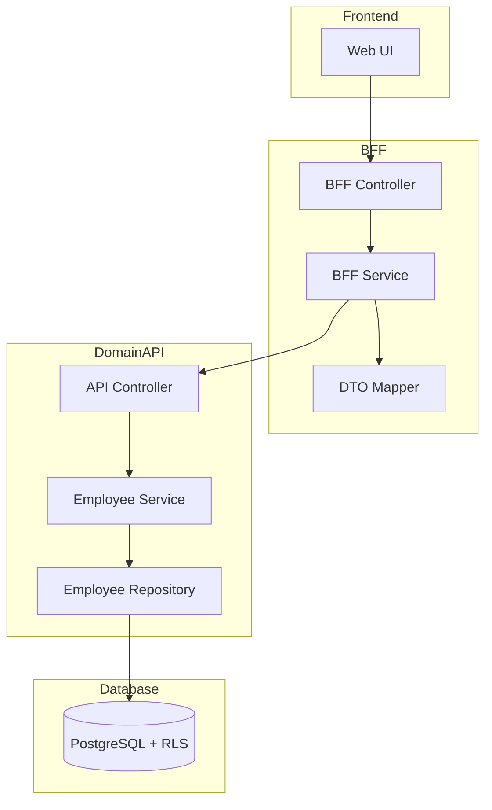
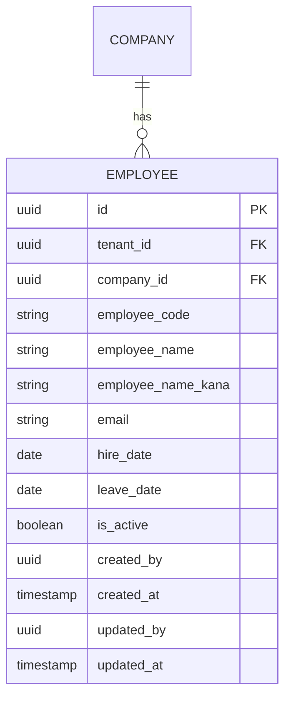

# Technical Design Document

## Feature: master-data/employee-master

---

## Overview

社員マスタは、EPM SaaS における社員基本情報（社員コード、氏名、カナ、メール、入社日、退職日、有効フラグ）の CRUD 管理機能である。本機能は将来の employee_assignments（異動・兼務履歴）や login_accounts（認証情報）から FK 参照される基盤エンティティとして位置づけられる。

マルチテナント環境において tenant_id による完全なデータ分離を実現し、company_id + employee_code の複合一意制約により社員を確実に識別する。物理削除は行わず、is_active フラグによる無効化で運用する。

---

## Architecture

### Architecture Pattern & Boundary Map

**Pattern (fixed)**:
- UI（apps/web） → BFF（apps/bff） → Domain API（apps/api） → DB（PostgreSQL + RLS）
- UI 直 API は禁止



**Contracts (SSoT)**:
- UI ↔ BFF: `packages/contracts/src/bff/employee-master`
- BFF ↔ Domain API: `packages/contracts/src/api/employee-master`
- Enum/Error: `packages/contracts/src/api/errors`
- UI は `packages/contracts/src/api` を参照してはならない

---

## Architecture Responsibilities（Mandatory）

### BFF Specification（apps/bff）

**Purpose**
- UI 要件に最適化した API（Read Model / ViewModel）
- Domain API のレスポンスを集約・変換（ビジネスルールの正本は持たない）

**BFF Endpoints（UI が叩く）**

| Method | Endpoint | Purpose | Request DTO (contracts/bff) | Response DTO (contracts/bff) | Notes |
|--------|----------|---------|-----------------------------|-----------------------------|-------|
| GET | /api/bff/master-data/employee-master | 社員一覧取得 | BffListEmployeesRequest | BffListEmployeesResponse | 検索・ページング・ソート、companyIdはセッションコンテキストから取得 |
| GET | /api/bff/master-data/employee-master/:id | 社員詳細取得 | - | BffEmployeeDetailResponse | UUID パス |
| POST | /api/bff/master-data/employee-master | 社員新規登録 | BffCreateEmployeeRequest | BffEmployeeDetailResponse | companyIdはセッションコンテキストから取得 |
| PATCH | /api/bff/master-data/employee-master/:id | 社員情報更新 | BffUpdateEmployeeRequest | BffEmployeeDetailResponse | 部分更新 |
| POST | /api/bff/master-data/employee-master/:id/deactivate | 社員無効化 | - | BffEmployeeDetailResponse | is_active → false |
| POST | /api/bff/master-data/employee-master/:id/reactivate | 社員再有効化 | - | BffEmployeeDetailResponse | is_active → true |

**Naming Convention（必須）**
- DTO / Contracts: camelCase（例: `employeeCode`, `employeeName`）
- DB columns: snake_case（例: `employee_code`, `employee_name`）
- `sortBy` は **DTO 側キー**を採用する（例: `employeeCode | employeeName | hireDate`）
- DB 列名（snake_case）を UI/BFF へ露出させない

**Paging / Sorting Normalization（必須・BFF 責務）**
- UI/BFF: page / pageSize（page-based, 1-indexed）
- Domain API: offset / limit（DB-friendly, 0-indexed）
- BFF は必ず以下を実施する（省略禁止）：
  - defaults: page=1, pageSize=50, sortBy=employeeCode, sortOrder=asc
  - clamp: pageSize <= 200
  - whitelist: sortBy は許可リストのみ（`employeeCode | employeeName | hireDate`）
  - normalize: keyword trim、空→undefined
  - transform: offset=(page-1)*pageSize, limit=pageSize
- Domain API に渡すのは offset/limit（page/pageSize は渡さない）
- BFF レスポンスには page/pageSize を含める（UI へ返すのは BFF 側の値）

**Transformation Rules（api DTO → bff DTO）**
- field 名は同一（camelCase 維持）
- 日付は ISO 8601 文字列として返却
- totalCount は Domain API から取得し、BFF レスポンスに含める

**Error Policy（必須）**
- この Feature における BFF の Error Policy は以下とする：
  - 採用方針：**Option A: Pass-through**
  - 採用理由：
    - 社員マスタは標準的な CRUD 操作であり、特別な UI 整形は不要
    - Domain API のエラーコードは明確で、UI で直接ハンドリング可能
    - ビジネスロジックの正本は Domain API であり、BFF での再分類は不要

**Error Handling（contracts error に準拠）**
| Domain API Error | HTTP Status | BFF Action |
|-----------------|-------------|------------|
| EMPLOYEE_NOT_FOUND | 404 | Pass-through |
| EMPLOYEE_CODE_DUPLICATE | 409 | Pass-through |
| EMPLOYEE_ALREADY_INACTIVE | 409 | Pass-through |
| EMPLOYEE_ALREADY_ACTIVE | 409 | Pass-through |
| COMPANY_NOT_FOUND | 404 | Pass-through |
| COMPANY_ACCESS_DENIED | 403 | Pass-through |
| COMPANY_NOT_SELECTED | 400 | Pass-through |
| VALIDATION_ERROR | 422 | Pass-through |

**Authentication / Tenant Context / Company Selection**
- tenant_id / user_id は認証ミドルウェアで解決し、リクエストコンテキストに付与
- Domain API へは `x-tenant-id` / `x-user-id` ヘッダーで伝搬
- **会社選択（ログイン時・セッション管理）**:
  - ログイン時にユーザーの権限情報を取得し、アクセス可能な会社一覧を表示
  - 複数会社へのアクセス権限がある場合: ログイン時に会社選択ドロップダウンを表示（選択必須）
  - 単一会社へのアクセス権限のみの場合: 会社選択UIを表示せず、自動的に当該会社をセッションコンテキストに設定
  - 選択された company_id はセッションコンテキスト（認証トークン/セッションストレージ）に保存
  - 各APIリクエストでは、セッションコンテキストから company_id を取得（リクエストパラメータには含めない）
  - Domain API はセッションコンテキストから取得した company_id を使用し、ユーザーのアクセス権限を確認
  - 権限のない会社へのアクセスを拒否（403 COMPANY_ACCESS_DENIED）
  - セッションコンテキストに company_id が設定されていない場合、エラーを返す（400 COMPANY_NOT_SELECTED）

---

### Service Specification（Domain / apps/api）

**Purpose**
- ビジネスルールの正本（BFF/UI は禁止）
- Transaction boundary / audit points を必ず明記

**Domain API Endpoints**

| Method | Endpoint | Purpose | Transaction | Audit |
|--------|----------|---------|-------------|-------|
| GET | /api/master-data/employee-master | 一覧取得 | Read-only | - |
| GET | /api/master-data/employee-master/:id | 詳細取得 | Read-only | - |
| POST | /api/master-data/employee-master | 新規登録 | Write（単一） | created_by/at |
| PATCH | /api/master-data/employee-master/:id | 更新 | Write（単一） | updated_by/at |
| POST | /api/master-data/employee-master/:id/deactivate | 無効化 | Write（単一） | updated_by/at |
| POST | /api/master-data/employee-master/:id/reactivate | 再有効化 | Write（単一） | updated_by/at |

**Business Rules（Service 責務）**
- セッションコンテキストから company_id を取得（リクエストパラメータからは取得しない）
- セッションコンテキストに company_id が設定されていない場合、エラーを返す（COMPANY_NOT_SELECTED）
- 社員コード重複チェック（tenant_id + company_id + employee_code）
- 無効化済み社員の再無効化禁止
- 有効社員の再有効化禁止
- 必須項目バリデーション（employeeCode, employeeName）
- company_id の存在チェック（companies テーブル参照）
- company_id へのアクセス権限チェック（セッションコンテキストの会社にアクセス権限があるか）
- 退職日（leave_date）が指定されている場合、入社日（hire_date）より後であることをチェック

**Transaction Boundary**
- 各操作は単一トランザクションで完結
- 複数エンティティにまたがる操作は本機能スコープ外

---

### Repository Specification（apps/api）

**Purpose**
- データアクセス層（Prisma 経由）
- tenant_id による二重ガード

**Repository Methods**

| Method | Parameters | Returns | Notes |
|--------|------------|---------|-------|
| findMany | tenantId, companyId, filter, pagination, sort | Employee[], totalCount | ページング対応、companyIdはServiceから取得 |
| findById | tenantId, companyId, id | Employee \| null | UUID で取得、companyIdはServiceから取得 |
| findByCode | tenantId, companyId, employeeCode | Employee \| null | 重複チェック用、companyIdはServiceから取得 |
| create | tenantId, companyId, data | Employee | 監査情報含む、companyIdはServiceから取得 |
| update | tenantId, companyId, id, data | Employee | 監査情報更新、companyIdはServiceから取得 |

**Tenant Guard（必須）**
- 全メソッドの第一引数は tenantId
- where 句に必ず tenant_id 条件を含める
- PrismaService.setTenantContext() を呼び出してから Prisma クエリ実行
- RLS 無効化は禁止

```typescript
// Repository パターン例
async findMany(tenantId: string, companyId: string, ...): Promise<Employee[]> {
  await this.prisma.setTenantContext(tenantId);
  return this.prisma.employee.findMany({
    where: {
      tenant_id: tenantId,  // アプリケーションガード
      company_id: companyId,
      // ... その他フィルタ
    },
  });
}
```

---

### Contracts Summary（This Feature）

**BFF Contracts（packages/contracts/src/bff/employee-master）**

```typescript
// Request DTOs
export interface BffListEmployeesRequest {
  // companyId はセッションコンテキストから取得（リクエストには含めない）
  page?: number;           // default: 1
  pageSize?: number;        // default: 50, max: 200
  sortBy?: 'employeeCode' | 'employeeName' | 'hireDate';
  sortOrder?: 'asc' | 'desc';
  keyword?: string;        // 社員コード・氏名部分一致
  isActive?: boolean;      // 有効フラグフィルタ
}

export interface BffCreateEmployeeRequest {
  // companyId はセッションコンテキストから取得（リクエストには含めない）
  employeeCode: string;
  employeeName: string;
  employeeNameKana?: string;
  email?: string;
  hireDate?: string;       // ISO 8601
  leaveDate?: string;      // ISO 8601（退職日）
}

export interface BffUpdateEmployeeRequest {
  employeeCode?: string;
  employeeName?: string;
  employeeNameKana?: string;
  email?: string;
  hireDate?: string;
  leaveDate?: string;
}

// Response DTOs
export interface BffEmployeeSummary {
  id: string;
  employeeCode: string;
  employeeName: string;
  email: string | null;
  hireDate: string | null;
  isActive: boolean;
}

export interface BffListEmployeesResponse {
  items: BffEmployeeSummary[];
  totalCount: number;
  page: number;
  pageSize: number;
}

export interface BffEmployeeDetailResponse {
  id: string;
  employeeCode: string;
  employeeName: string;
  employeeNameKana: string | null;
  email: string | null;
  hireDate: string | null;
  leaveDate: string | null;
  isActive: boolean;
  createdAt: string;
  updatedAt: string;
}
```

**API Contracts（packages/contracts/src/api/employee-master）**

```typescript
// Request DTOs
export interface ApiListEmployeesRequest {
  // companyId はセッションコンテキストから取得（リクエストには含めない）
  offset: number;          // 0-indexed
  limit: number;
  sortBy?: string;
  sortOrder?: 'asc' | 'desc';
  keyword?: string;
  isActive?: boolean;
}

export interface ApiCreateEmployeeRequest {
  // companyId はセッションコンテキストから取得（リクエストには含めない）
  employeeCode: string;
  employeeName: string;
  employeeNameKana?: string;
  email?: string;
  hireDate?: string;
  leaveDate?: string;
}

export interface ApiUpdateEmployeeRequest {
  employeeCode?: string;
  employeeName?: string;
  employeeNameKana?: string;
  email?: string;
  hireDate?: string;
  leaveDate?: string;
}

// Response DTOs
export interface ApiEmployeeResponse {
  id: string;
  employeeCode: string;
  employeeName: string;
  employeeNameKana: string | null;
  email: string | null;
  hireDate: string | null;
  leaveDate: string | null;
  isActive: boolean;
  createdAt: string;
  updatedAt: string;
}

export interface ApiListEmployeesResponse {
  items: ApiEmployeeResponse[];
  totalCount: number;
}
```

**Error Contracts（packages/contracts/src/api/errors/employee-master-error.ts）**

```typescript
export const EmployeeMasterErrorCode = {
  EMPLOYEE_NOT_FOUND: 'EMPLOYEE_NOT_FOUND',
  EMPLOYEE_CODE_DUPLICATE: 'EMPLOYEE_CODE_DUPLICATE',
  EMPLOYEE_ALREADY_INACTIVE: 'EMPLOYEE_ALREADY_INACTIVE',
  EMPLOYEE_ALREADY_ACTIVE: 'EMPLOYEE_ALREADY_ACTIVE',
  COMPANY_NOT_FOUND: 'COMPANY_NOT_FOUND',
  COMPANY_ACCESS_DENIED: 'COMPANY_ACCESS_DENIED',
  COMPANY_NOT_SELECTED: 'COMPANY_NOT_SELECTED',  // セッションコンテキストに会社が設定されていない
  VALIDATION_ERROR: 'VALIDATION_ERROR',
} as const;

export type EmployeeMasterErrorCode =
  typeof EmployeeMasterErrorCode[keyof typeof EmployeeMasterErrorCode];

export interface EmployeeMasterError {
  code: EmployeeMasterErrorCode;
  message: string;
  details?: Record<string, unknown>;
}
```

---

## Responsibility Clarification（Mandatory）

本 Feature における責務境界を以下に明記する。
未記載の責務は実装してはならない。

### UI の責務
- 表示制御（enable/disable / 文言切替）
- フォーム入力制御・UX 最適化
- エラーコードに基づく表示切替
- **会社選択UI（ログイン時・セッション管理）**:
  - ログイン時にユーザーの権限情報を取得
  - 複数会社へのアクセス権限がある場合: ログイン時に会社選択ドロップダウンを表示（選択必須）
  - 単一会社へのアクセス権限のみの場合: 会社選択UIを表示せず、自動的に当該会社をセッションコンテキストに設定
  - 選択された会社はセッションコンテキストに保存（認証トークン/セッションストレージ）
  - 各機能画面では、セッションコンテキストから取得した会社のデータのみを表示・操作
- ビジネス判断は禁止

### BFF の責務
- UI 入力の正規化（paging / sorting / filtering）
- page/pageSize → offset/limit 変換
- Domain API DTO ⇄ UI DTO の変換
- sortBy ホワイトリスト検証
- ビジネスルールの正本は持たない

### Domain API の責務
- ビジネスルールの正本
- 社員コード重複チェック
- 無効化/再有効化の状態遷移検証
- 監査ログ・整合性保証
- tenant_id による最終ガード
- **セッションコンテキストから company_id を取得**
- **company_id へのアクセス権限チェック**（セッションコンテキストの会社にアクセス権限があるか）
- **セッションコンテキストに company_id が設定されていない場合のエラーハンドリング**

---

## Data Model（エンティティ整合性確認必須）

### Entity Reference
- 参照元: `.kiro/specs/entities/01_各種マスタ.md` セクション 5.1 employees（社員マスタ）

### エンティティ整合性チェックリスト

| チェック項目 | 確認結果 |
|-------------|---------|
| カラム網羅性 | エンティティ定義の全カラムがDTO/Prismaに反映されている: ✅ |
| 型の一致 | varchar(30)→String @db.VarChar(30), varchar(100)→String @db.VarChar(100), varchar(255)→String @db.VarChar(255), date→DateTime? @db.Date, boolean→Boolean, timestamptz→DateTime, uuid→String: ✅ |
| 制約の反映 | UNIQUE(tenant_id, company_id, employee_code)がPrisma @@uniqueに反映、FK(tenant_id, company_id)→companiesがPrisma @relationに反映: ✅ |
| ビジネスルール | エンティティ補足のルール（異動・兼務・役職はemployee_assignments側で管理、物理削除禁止）がServiceに反映: ✅ |
| NULL許可 | NULL/NOT NULLがPrisma?/必須に正しく対応（employee_name_kana, email, hire_date, leave_date, created_by, updated_byはNULL可、その他は必須）: ✅ |

### Entity: Employee



**Prisma Schema**

```prisma
model Employee {
  id               String    @id @default(uuid())
  tenantId         String    @map("tenant_id")
  companyId        String    @map("company_id")
  employeeCode     String    @map("employee_code") @db.VarChar(30)
  employeeName     String    @map("employee_name") @db.VarChar(100)
  employeeNameKana String?   @map("employee_name_kana") @db.VarChar(100)
  email            String?   @db.VarChar(255)
  hireDate         DateTime? @map("hire_date") @db.Date
  leaveDate        DateTime? @map("leave_date") @db.Date
  isActive         Boolean   @default(true) @map("is_active")
  createdBy        String?   @map("created_by")
  createdAt        DateTime  @default(now()) @map("created_at")
  updatedBy        String?   @map("updated_by")
  updatedAt        DateTime  @updatedAt @map("updated_at")

  // Relations
  // Note: Prisma does not support composite foreign keys directly.
  // The FK constraint (tenant_id, company_id) → companies(tenant_id, id) is enforced
  // at the application layer (Service) and database level (migration).
  // Prisma relation is defined for type safety and navigation only.
  company          Company   @relation(fields: [companyId], references: [id])

  @@unique([tenantId, companyId, employeeCode])
  @@unique([tenantId, companyId, id])
  @@index([tenantId, companyId])
  @@index([tenantId, isActive])
  @@map("employees")
}
```

**Constraints（エンティティ定義から転記）**
- PK: id（UUID）
- UNIQUE: tenant_id + company_id + employee_code
- UNIQUE: tenant_id + company_id + id（複合FK用）
- FK: tenant_id + company_id → companies(tenant_id, id)
- Index: tenant_id + company_id（一覧取得最適化）
- Index: tenant_id + is_active（有効社員フィルタ最適化）

**RLS Policy（PostgreSQL）**

```sql
-- RLS 有効化
ALTER TABLE employees ENABLE ROW LEVEL SECURITY;

-- テナント分離ポリシー
CREATE POLICY tenant_isolation ON employees
  USING (tenant_id::text = current_setting('app.tenant_id', true));
```

---

## Requirements Traceability

| Requirement | Summary | Components | Interfaces | Flows |
|-------------|---------|------------|------------|-------|
| 1.1 | 会社所属社員一覧取得 | Repository.findMany | GET /employee-master | List |
| 1.2 | 検索条件フィルタ | BFF.normalize, Repository | BffListEmployeesRequest | List |
| 1.3 | ソート機能 | BFF.whitelist | sortBy/sortOrder | List |
| 1.4 | ページネーション | BFF.transform | page/pageSize | List |
| 1.5 | 一覧表示項目 | BffEmployeeSummary | - | List |
| 2.1 | 詳細情報表示 | Repository.findById | GET /:id | Detail |
| 2.2 | 詳細表示項目 | BffEmployeeDetailResponse | - | Detail |
| 2.3 | 社員不存在エラー | Service | EMPLOYEE_NOT_FOUND | Error |
| 3.1 | 新規登録 | Service.create | POST / | Create |
| 3.2 | 登録後詳細返却 | Controller | BffEmployeeDetailResponse | Create |
| 3.3 | 重複エラー | Service | EMPLOYEE_CODE_DUPLICATE | Error |
| 3.4 | バリデーションエラー | Service | VALIDATION_ERROR | Error |
| 3.5 | isActive 初期化 | Service.create | - | Create |
| 3.6 | 監査情報記録 | Repository | created_by/at | Create |
| 4.1 | 情報更新 | Service.update | PATCH /:id | Update |
| 4.2 | 更新後詳細返却 | Controller | BffEmployeeDetailResponse | Update |
| 4.3 | 更新対象不存在 | Service | EMPLOYEE_NOT_FOUND | Error |
| 4.4 | コード変更時重複 | Service | EMPLOYEE_CODE_DUPLICATE | Error |
| 4.5 | 更新監査情報 | Repository | updated_by/at | Update |
| 5.1 | 無効化実行 | Service.deactivate | POST /:id/deactivate | Deactivate |
| 5.2 | 無効化後詳細返却 | Controller | BffEmployeeDetailResponse | Deactivate |
| 5.3 | 対象不存在 | Service | EMPLOYEE_NOT_FOUND | Error |
| 5.4 | 既無効化エラー | Service | EMPLOYEE_ALREADY_INACTIVE | Error |
| 5.5 | 無効化監査情報 | Repository | updated_by/at | Deactivate |
| 6.1 | 再有効化実行 | Service.reactivate | POST /:id/reactivate | Reactivate |
| 6.2 | 再有効化後詳細返却 | Controller | BffEmployeeDetailResponse | Reactivate |
| 6.3 | 対象不存在 | Service | EMPLOYEE_NOT_FOUND | Error |
| 6.4 | 既有効エラー | Service | EMPLOYEE_ALREADY_ACTIVE | Error |
| 6.5 | 再有効化監査情報 | Repository | updated_by/at | Reactivate |
| 7.1 | tenant_id フィルタ | Repository | where tenant_id | All |
| 7.2 | Repository 必須引数 | Repository signature | tenantId first arg | All |
| 7.3 | RLS double-guard | PrismaService.setTenantContext | - | All |
| 7.4 | 異テナントアクセス拒否 | RLS Policy | - | Security |
| 8.1 | 複合一意制約 | Prisma @@unique | - | DB |
| 8.2 | 重複エラー | Service | EMPLOYEE_CODE_DUPLICATE | Error |
| 9.1 | 操作ユーザーID記録 | Repository | created_by/updated_by | Audit |
| 9.2 | 操作日時記録 | Prisma @default(now) | created_at/updated_at | Audit |
| 9.3 | 監査情報自動記録 | Prisma @updatedAt | - | Audit |

---

## Component Summary

| Component | Domain | Intent | Requirements | Dependencies |
|-----------|--------|--------|--------------|--------------|
| EmployeeMasterController (API) | Domain API | REST エンドポイント提供 | All | Service |
| EmployeeMasterService | Domain API | ビジネスルール実行 | 3-9 | Repository |
| EmployeeMasterRepository | Domain API | データアクセス | 7, 8, 9 | PrismaService |
| EmployeeMasterController (BFF) | BFF | UI 向けエンドポイント | All | BffService |
| EmployeeMasterService (BFF) | BFF | DTO 変換・正規化 | 1 | Mapper, ApiClient |
| EmployeeMasterMapper | BFF | DTO 変換 | - | - |

---

## Technology Stack & Alignment

| Layer | Technology | Version | Role |
|-------|------------|---------|------|
| Frontend | Next.js (App Router) | 14.x | UI ホスティング |
| Frontend | React | 18.x | UI コンポーネント |
| Frontend | TypeScript | 5.x | 型安全性 |
| Frontend | TanStack Query | 5.x | Server State 管理 |
| BFF | NestJS | 10.x | BFF フレームワーク |
| Backend | NestJS | 10.x | Domain API フレームワーク |
| Backend | TypeScript | 5.x | 型安全性 |
| Backend | Prisma | 5.x | ORM |
| Database | PostgreSQL | 15.x | RDBMS + RLS |
| Contracts | TypeScript | 5.x | 型定義 SSoT |

---

## Security Considerations

- **マルチテナント分離**: tenant_id による RLS + アプリケーションガード（double-guard）
- **認証**: Clerk 経由で認証済みユーザーのみアクセス可
- **認可**: 本機能では権限チェックは実装対象外（将来拡張）
- **入力検証**:
  - employeeCode: 最大 30 文字、英数字・ハイフン許可
  - employeeName: 最大 100 文字
  - email: RFC 5322 準拠（オプショナル）

---

## Testing Strategy

| Test Type | Scope | Tools | Coverage Target |
|-----------|-------|-------|-----------------|
| Unit | Service | Jest | ビジネスロジック 100% |
| Unit | Mapper | Jest | 変換ロジック 100% |
| Integration | Repository + DB | Jest + Testcontainers | CRUD + RLS |
| E2E | UI → BFF → API → DB | Playwright | 主要シナリオ |

---

## Open Questions / Risks

- **Q1**: company_id の取得方法は？
  - **Decision**: ログイン時に会社を選択し、セッションコンテキストに保存
    - 複数会社へのアクセス権限がある場合: ログイン時に会社選択ドロップダウンを表示（選択必須）
    - 単一会社へのアクセス権限のみの場合: 会社選択UIを表示せず、自動的に当該会社をセッションコンテキストに設定
    - 選択された company_id はセッションコンテキスト（認証トークン/セッションストレージ）に保存
    - 各APIリクエストでは、セッションコンテキストから company_id を取得（リクエストパラメータには含めない）
    - Domain API でセッションコンテキストの会社へのアクセス権限をチェック
- **Q2**: 社員コードの形式制約は？
  - **Decision**: 英数字・ハイフンのみ、最大 30 文字（運用で柔軟性確保）
- **Q3**: 退職日と入社日の前後関係チェックは？
  - **Decision**: Service レイヤーでバリデーション（leave_date が指定されている場合、hire_date より後であることをチェック）
- **Q4**: セッションコンテキストの実装方法は？
  - **Decision**: 認証トークン（JWT）に company_id を含める、またはセッションストレージに保存（実装詳細は認証基盤の設計に依存）
- **Risk**: 大量データ（10,000 件超）でのページング性能
  - **Mitigation**: インデックス設計、pageSize 上限 200

---

## References

- `.kiro/specs/entities/01_各種マスタ.md` セクション 5.1 — エンティティ定義（SSoT）
- `.kiro/steering/tech.md` — 技術憲法
- `.kiro/steering/structure.md` — 構造憲法
- `.kiro/steering/development-process.md` — 開発プロセス
