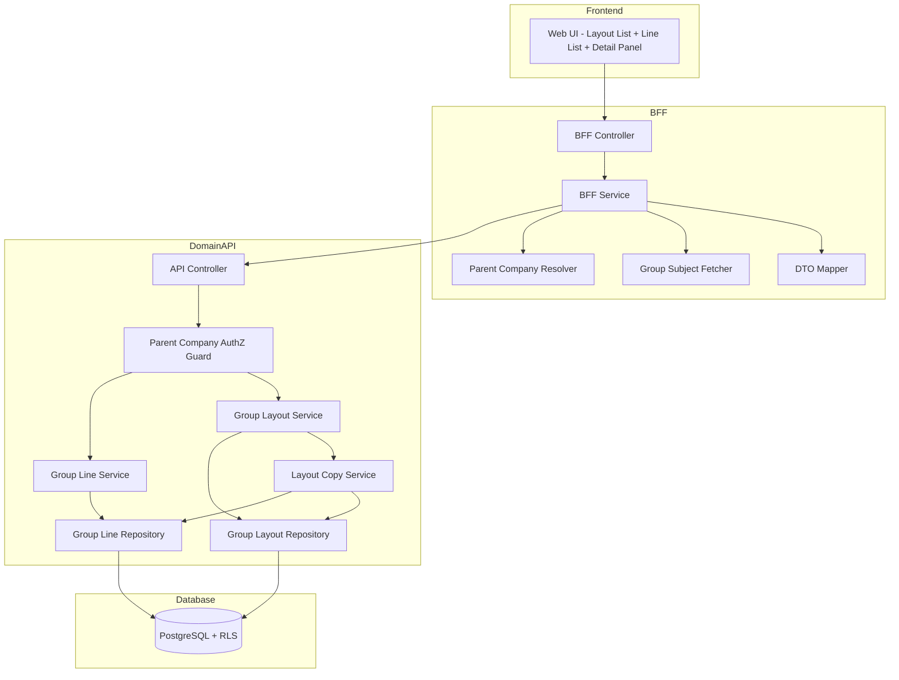
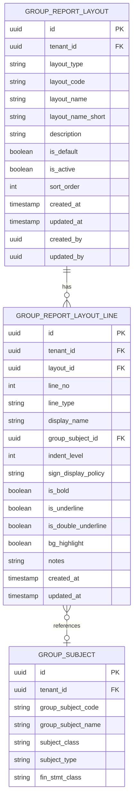

# Technical Design Document

## Feature: master-data/group-report-layout

---

## Overview

連結レポートレイアウトマスタは、EPM SaaSにおける「連結レイアウトヘッダ（group_report_layouts）」と「連結レイアウト行（group_report_layout_lines）」を管理する機能である。連結PL（連結損益計算書）や連結BS（連結貸借対照表）、連結KPI（グループ非財務指標）の表示レイアウトを定義し、見出し・科目行・注記・空白行を組み合わせてグループ全体の経営管理レポートの表示形式をカスタマイズ可能にする。

連結レイアウトは**テナント単位**で管理され（会社別ではない）、**親会社のみが編集権限を持ち**、子会社は参照のみとなる。これは個社レイアウト（report-layout）との主要な違いである。本機能のUIは個社レイアウトと統一されており、レイアウト一覧選択 → 行リスト表示 → 詳細パネル編集という操作フローを提供する。親会社判定は`companies.parent_company_id IS NULL`で行う。

---

## Architecture

### Architecture Pattern & Boundary Map

**Pattern (fixed)**:
- UI（apps/web） → BFF（apps/bff） → Domain API（apps/api） → DB（PostgreSQL + RLS）
- UI直APIは禁止



**Contracts (SSoT)**:
- UI ↔ BFF: `packages/contracts/src/bff/group-report-layout`
- BFF ↔ Domain API: `packages/contracts/src/api/group-report-layout`
- Enum/Error: `packages/contracts/src/api/errors`
- UIは`packages/contracts/src/api`を参照してはならない

---

## Architecture Responsibilities（Mandatory）

### BFF Specification（apps/bff）

**Purpose**
- UI要件に最適化したAPI（Layout List + Line List + Detail Panel向け）
- Domain APIのレスポンスをUI向けに変換
- 親会社判定情報をUIに提供（編集権限制御用）
- ビジネスルールの正本は持たない

**BFF Endpoints（UIが叩く）**

| Method | Endpoint | Purpose | Request DTO (contracts/bff) | Response DTO (contracts/bff) | Notes |
|--------|----------|---------|-----------------------------|-----------------------------|-------|
| GET | /api/bff/master-data/group-report-layout/layouts | レイアウト一覧取得 | BffGroupLayoutListRequest | BffGroupLayoutListResponse | フィルタ・ソート対応 |
| GET | /api/bff/master-data/group-report-layout/layouts/:id | レイアウト詳細取得 | - | BffGroupLayoutDetailResponse | UUIDパス |
| POST | /api/bff/master-data/group-report-layout/layouts | レイアウト新規作成 | BffCreateGroupLayoutRequest | BffGroupLayoutDetailResponse | 親会社のみ |
| PATCH | /api/bff/master-data/group-report-layout/layouts/:id | レイアウト編集 | BffUpdateGroupLayoutRequest | BffGroupLayoutDetailResponse | 親会社のみ |
| POST | /api/bff/master-data/group-report-layout/layouts/:id/deactivate | レイアウト無効化 | - | BffGroupLayoutDetailResponse | 親会社のみ |
| POST | /api/bff/master-data/group-report-layout/layouts/:id/reactivate | レイアウト再有効化 | - | BffGroupLayoutDetailResponse | 親会社のみ |
| POST | /api/bff/master-data/group-report-layout/layouts/:id/set-default | デフォルト設定 | - | BffGroupLayoutDetailResponse | 親会社のみ |
| POST | /api/bff/master-data/group-report-layout/layouts/:id/copy | レイアウト複製 | BffCopyGroupLayoutRequest | BffGroupLayoutDetailResponse | 親会社のみ |
| GET | /api/bff/master-data/group-report-layout/layouts/:layoutId/lines | 行一覧取得 | - | BffGroupLineListResponse | line_no順 |
| GET | /api/bff/master-data/group-report-layout/lines/:id | 行詳細取得 | - | BffGroupLineDetailResponse | UUIDパス |
| POST | /api/bff/master-data/group-report-layout/layouts/:layoutId/lines | 行追加 | BffCreateGroupLineRequest | BffGroupLineDetailResponse | 親会社のみ |
| PATCH | /api/bff/master-data/group-report-layout/lines/:id | 行編集 | BffUpdateGroupLineRequest | BffGroupLineDetailResponse | 親会社のみ |
| DELETE | /api/bff/master-data/group-report-layout/lines/:id | 行削除 | - | - | 親会社のみ |
| POST | /api/bff/master-data/group-report-layout/lines/:id/move | 行移動（D&D） | BffMoveGroupLineRequest | BffGroupLineListResponse | 親会社のみ |
| GET | /api/bff/master-data/group-report-layout/group-subjects | 連結科目検索 | BffGroupSubjectSearchRequest | BffGroupSubjectSearchResponse | 科目選択補助 |
| GET | /api/bff/master-data/group-report-layout/context | コンテキスト取得 | - | BffGroupLayoutContextResponse | 親会社判定 |

**Naming Convention（必須）**
- DTO / Contracts: camelCase（例: `layoutCode`, `layoutName`, `lineNo`）
- DB columns: snake_case（例: `layout_code`, `layout_name`, `line_no`）
- DB列名（snake_case）をUI/BFFへ露出させない

**Paging / Sorting Normalization（必須・BFF責務）**
- UI/BFF: page / pageSize（page-based）
- Domain API: offset / limit（DB-friendly）
- BFFは必ず以下を実施する（省略禁止）：
  - defaults: page=1, pageSize=50, sortBy=layoutCode, sortOrder=asc
  - clamp: pageSize <= 200
  - whitelist: sortByは許可リストのみ
  - normalize: keyword trim、空→undefined
  - transform: offset=(page-1)*pageSize, limit=pageSize
- Domain APIに渡すのは offset/limit

**Filter Normalization（BFF責務）**
- keyword: trim、空→undefined
- layoutType: 'PL' | 'BS' | 'KPI' | undefined
- isActive: boolean | undefined

**sortBy Whitelist（BFF責務）**
- layouts: layoutCode（default）, layoutName, sortOrder
- lines: lineNo（default）

**Transformation Rules（api DTO → bff DTO）**
- レイアウト一覧: lineCount（行数）を集計して付与
- 科目検索: group_subjectsから科目名・コード・クラスを返却

**Error Policy（必須）**
- 採用方針：**Option A: Pass-through**
- 採用理由：
  - Domain APIのエラーコードは明確で、UIで直接ハンドリング可能
  - 親会社判定・重複チェック等のビジネスロジック正本はDomain API

**Error Handling（contracts errorに準拠）**

| Domain API Error | HTTP Status | BFF Action |
|-----------------|-------------|------------|
| LAYOUT_NOT_FOUND | 404 | Pass-through |
| LAYOUT_CODE_DUPLICATE | 409 | Pass-through |
| LAYOUT_ALREADY_INACTIVE | 409 | Pass-through |
| LAYOUT_ALREADY_ACTIVE | 409 | Pass-through |
| DEFAULT_LAYOUT_CANNOT_DEACTIVATE | 409 | Pass-through |
| INACTIVE_LAYOUT_CANNOT_SET_DEFAULT | 409 | Pass-through |
| LINE_NOT_FOUND | 404 | Pass-through |
| GROUP_SUBJECT_REQUIRED_FOR_ACCOUNT | 422 | Pass-through |
| GROUP_SUBJECT_NOT_FOUND | 404 | Pass-through |
| GROUP_SUBJECT_INACTIVE | 422 | Pass-through |
| GROUP_SUBJECT_TYPE_MISMATCH | 422 | Pass-through |
| NOT_PARENT_COMPANY | 403 | Pass-through |
| VALIDATION_ERROR | 422 | Pass-through |

**Authentication / Tenant Context**
- tenant_id / user_id / company_idは認証ミドルウェアで解決し、リクエストコンテキストに付与
- Domain APIへは`x-tenant-id` / `x-user-id` / `x-company-id`ヘッダーで伝搬
- 親会社判定はDomain API側で実施

---

### Service Specification（Domain / apps/api）

**Purpose**
- ビジネスルールの正本（BFF/UIは禁止）
- 親会社判定と権限制御
- Transaction boundary / audit pointsを必ず明記

**Domain API Endpoints - Layouts**

| Method | Endpoint | Purpose | Transaction | Audit | AuthZ |
|--------|----------|---------|-------------|-------|-------|
| GET | /api/master-data/group-report-layout/layouts | 一覧取得 | Read-only | - | All |
| GET | /api/master-data/group-report-layout/layouts/:id | 詳細取得 | Read-only | - | All |
| POST | /api/master-data/group-report-layout/layouts | 新規登録 | Write（単一） | created_at | ParentOnly |
| PATCH | /api/master-data/group-report-layout/layouts/:id | 更新 | Write（単一） | updated_at | ParentOnly |
| POST | /api/master-data/group-report-layout/layouts/:id/deactivate | 無効化 | Write（単一） | updated_at | ParentOnly |
| POST | /api/master-data/group-report-layout/layouts/:id/reactivate | 再有効化 | Write（単一） | updated_at | ParentOnly |
| POST | /api/master-data/group-report-layout/layouts/:id/set-default | デフォルト設定 | Write（複数） | updated_at | ParentOnly |
| POST | /api/master-data/group-report-layout/layouts/:id/copy | 複製 | Write（複数） | created_at | ParentOnly |

**Domain API Endpoints - Lines**

| Method | Endpoint | Purpose | Transaction | Audit | AuthZ |
|--------|----------|---------|-------------|-------|-------|
| GET | /api/master-data/group-report-layout/layouts/:layoutId/lines | 一覧取得 | Read-only | - | All |
| GET | /api/master-data/group-report-layout/lines/:id | 詳細取得 | Read-only | - | All |
| POST | /api/master-data/group-report-layout/layouts/:layoutId/lines | 新規登録 | Write（単一） | created_at | ParentOnly |
| PATCH | /api/master-data/group-report-layout/lines/:id | 更新 | Write（単一） | updated_at | ParentOnly |
| DELETE | /api/master-data/group-report-layout/lines/:id | 削除 | Write（単一） | - | ParentOnly |
| POST | /api/master-data/group-report-layout/lines/:id/move | 移動（D&D） | Write（複数） | updated_at | ParentOnly |

**Domain API Endpoints - Group Subjects（科目検索）**

| Method | Endpoint | Purpose | Transaction | Audit |
|--------|----------|---------|-------------|-------|
| GET | /api/master-data/group-report-layout/group-subjects | 連結科目検索 | Read-only | - |

**Domain API Endpoints - Context**

| Method | Endpoint | Purpose | Transaction | Audit |
|--------|----------|---------|-------------|-------|
| GET | /api/master-data/group-report-layout/context | コンテキスト取得 | Read-only | - |

**Parent Company Authorization Guard**

```typescript
// 親会社判定ガード
async checkParentCompanyAuthorization(
  tenantId: string,
  companyId: string
): Promise<void> {
  const company = await this.companyRepository.findById(tenantId, companyId);
  if (!company) {
    throw new ForbiddenException('NOT_PARENT_COMPANY');
  }
  // parent_company_id IS NULL → 親会社
  if (company.parentCompanyId !== null) {
    throw new ForbiddenException('NOT_PARENT_COMPANY');
  }
}
```

**Business Rules（Service責務）**

*Group Layout Service*
- レイアウトコード重複チェック（tenant_id + layout_type + layout_code）
- 無効化済みレイアウトの再無効化禁止
- 有効レイアウトの再有効化禁止
- デフォルトレイアウトの無効化禁止
- 無効レイアウトのデフォルト設定禁止
- デフォルト設定時に同一種別の既存デフォルトをfalseに更新（排他制御）
- is_active初期値true、is_default初期値false
- layout_type変更時の行削除処理

*Group Line Service*
- line_typeに応じた必須項目検証
  - header: display_name必須
  - account: group_subject_id必須、display_nameは手動入力可能
  - note: display_name必須
  - blank: 追加項目不要
- account行の連結科目変更時の整合性チェック
  - 選択された連結科目が有効（is_active=true）であることをチェック
  - レイアウト種別との整合性チェック
    - 財務レイアウト（PL）: subject_type='FIN' かつ fin_stmt_class='PL'
    - 財務レイアウト（BS）: subject_type='FIN' かつ fin_stmt_class='BS'
    - KPIレイアウト: subject_type='KPI'
- line_no自動採番（既存最大値 + 10）
- indent_level範囲検証（0〜10）
- sign_display_policy値検証（auto/force_plus/force_minus/force_paren）
- 削除後のline_noギャップは許容

*Layout Copy Service*
- 新レイアウト作成 + 全行コピー（単一トランザクション）
- 新しいlayout_id / line_idを発行
- group_subject_idは引き継ぐ
- 表示スタイル設定（is_bold, is_underline, is_double_underline, bg_highlight）を引き継ぐ

*Group Subject Search Service*
- レイアウト種別に応じた連結科目フィルタリング
  - 財務レイアウト（PL）: subject_type='FIN' かつ fin_stmt_class='PL'
  - 財務レイアウト（BS）: subject_type='FIN' かつ fin_stmt_class='BS'
  - KPIレイアウト: subject_type='KPI'
- is_active = trueの科目のみ
- キーワード検索（group_subject_code, group_subject_name部分一致）
- ページネーション対応

**Line Move Algorithm**

```typescript
// 行移動時のline_no再計算（個社レイアウトと同一アルゴリズム）
async moveLine(
  lineId: string,
  targetLineNo: number,
  allLines: GroupLayoutLine[]
): Promise<GroupLayoutLine[]> {
  const movingLine = allLines.find(l => l.id === lineId);
  if (!movingLine) throw new Error('LINE_NOT_FOUND');

  const currentLineNo = movingLine.lineNo;
  if (currentLineNo === targetLineNo) return allLines;

  const updatedLines = allLines.map(line => {
    if (line.id === lineId) {
      return { ...line, lineNo: targetLineNo };
    }
    if (currentLineNo < targetLineNo) {
      if (line.lineNo > currentLineNo && line.lineNo <= targetLineNo) {
        return { ...line, lineNo: line.lineNo - 10 };
      }
    } else {
      if (line.lineNo >= targetLineNo && line.lineNo < currentLineNo) {
        return { ...line, lineNo: line.lineNo + 10 };
      }
    }
    return line;
  });

  return updatedLines.sort((a, b) => a.lineNo - b.lineNo);
}
```

**Transaction Boundary**
- レイアウトCRUD: 単一トランザクション
- レイアウト種別変更: レイアウト更新 + 全行削除を単一トランザクション
- デフォルト設定: 既存デフォルト解除 + 新デフォルト設定を単一トランザクション
- レイアウト複製: レイアウト作成 + 全行コピーを単一トランザクション
- 行CRUD: 単一トランザクション
- 行移動（D&D）: 影響を受ける全行のline_no更新を単一トランザクション

---

### Repository Specification（apps/api）

**Purpose**
- データアクセス層（Prisma経由）
- tenant_idによる二重ガード

**Group Layout Repository Methods**

| Method | Parameters | Returns | Notes |
|--------|------------|---------|-------|
| findMany | tenantId, filter, pagination | GroupReportLayout[] | フィルタ・ページング対応 |
| count | tenantId, filter | number | 総件数 |
| findById | tenantId, id | GroupReportLayout \| null | UUIDで取得 |
| findByCode | tenantId, layoutType, layoutCode | GroupReportLayout \| null | 重複チェック用 |
| findDefault | tenantId, layoutType | GroupReportLayout \| null | デフォルト取得 |
| create | tenantId, data | GroupReportLayout | - |
| update | tenantId, id, data | GroupReportLayout | - |
| clearDefault | tenantId, layoutType | void | デフォルト解除 |

**Group Line Repository Methods**

| Method | Parameters | Returns | Notes |
|--------|------------|---------|-------|
| findByLayout | tenantId, layoutId | GroupReportLayoutLine[] | line_no順 |
| findById | tenantId, id | GroupReportLayoutLine \| null | UUIDで取得 |
| create | tenantId, data | GroupReportLayoutLine | - |
| createMany | tenantId, data[] | GroupReportLayoutLine[] | 複製時バルク作成 |
| update | tenantId, id, data | GroupReportLayoutLine | - |
| updateMany | tenantId, updates[] | GroupReportLayoutLine[] | 移動時バルク更新 |
| delete | tenantId, id | void | 物理削除 |
| deleteByLayout | tenantId, layoutId | void | 種別変更時の全行削除 |
| getMaxLineNo | tenantId, layoutId | number | 最大line_no取得 |

**Tenant Guard（必須）**
- 全メソッドの第一引数はtenantId
- where句に必ずtenant_id条件を含める
- PrismaService.setTenantContext()を呼び出してからPrismaクエリ実行
- RLS無効化は禁止

---

### Contracts Summary（This Feature）

**BFF Contracts（packages/contracts/src/bff/group-report-layout）**

```typescript
// === Layout DTOs ===

export type LayoutType = 'PL' | 'BS' | 'KPI';
export type LineType = 'header' | 'account' | 'note' | 'blank';
export type SignDisplayPolicy = 'auto' | 'force_plus' | 'force_minus' | 'force_paren';
export type SubjectClass = 'BASE' | 'AGGREGATE';

export interface BffGroupLayoutListRequest {
  page?: number;
  pageSize?: number;
  sortBy?: 'layoutCode' | 'layoutName' | 'sortOrder';
  sortOrder?: 'asc' | 'desc';
  keyword?: string;
  layoutType?: LayoutType;
  isActive?: boolean;
}

export interface BffCreateGroupLayoutRequest {
  layoutCode: string;
  layoutName: string;
  layoutType: LayoutType;
  layoutNameShort?: string;
  description?: string;
}

export interface BffCopyGroupLayoutRequest {
  layoutCode: string;
  layoutName: string;
}

export interface BffUpdateGroupLayoutRequest {
  layoutCode?: string;
  layoutName?: string;
  layoutNameShort?: string;
  description?: string;
  layoutType?: LayoutType;  // 種別変更時は既存の行がすべて削除される
}

export interface BffGroupLayoutSummary {
  id: string;
  layoutCode: string;
  layoutName: string;
  layoutNameShort: string | null;
  layoutType: LayoutType;
  isDefault: boolean;
  isActive: boolean;
  lineCount: number;
  sortOrder: number;
}

export interface BffGroupLayoutListResponse {
  items: BffGroupLayoutSummary[];
  page: number;
  pageSize: number;
  totalCount: number;
  totalPages: number;
}

export interface BffGroupLayoutDetailResponse {
  id: string;
  layoutCode: string;
  layoutName: string;
  layoutNameShort: string | null;
  layoutType: LayoutType;
  description: string | null;
  isDefault: boolean;
  isActive: boolean;
  sortOrder: number;
  createdAt: string;
  updatedAt: string;
}

// === Context DTO ===

export interface BffGroupLayoutContextResponse {
  isParentCompany: boolean;  // 編集権限の有無
  canEdit: boolean;          // isParentCompanyのエイリアス（UI用）
}

// === Line DTOs ===

export interface BffCreateGroupLineRequest {
  lineType: LineType;
  displayName?: string;
  groupSubjectId?: string;
  indentLevel?: number;
  signDisplayPolicy?: SignDisplayPolicy;
  isBold?: boolean;
  isUnderline?: boolean;
  isDoubleUnderline?: boolean;
  bgHighlight?: boolean;
  notes?: string;
}

export interface BffUpdateGroupLineRequest {
  displayName?: string;
  groupSubjectId?: string;
  indentLevel?: number;
  signDisplayPolicy?: SignDisplayPolicy;
  isBold?: boolean;
  isUnderline?: boolean;
  isDoubleUnderline?: boolean;
  bgHighlight?: boolean;
  notes?: string;
}

export interface BffMoveGroupLineRequest {
  targetLineNo: number;
}

export interface BffGroupLineSummary {
  id: string;
  lineNo: number;
  lineType: LineType;
  displayName: string | null;
  groupSubjectId: string | null;
  groupSubjectCode: string | null;
  groupSubjectName: string | null;
  subjectClass: SubjectClass | null;
  indentLevel: number;
  signDisplayPolicy: SignDisplayPolicy;
  isBold: boolean;
  isUnderline: boolean;
  isDoubleUnderline: boolean;
  bgHighlight: boolean;
}

export interface BffGroupLineListResponse {
  layoutId: string;
  layoutCode: string;
  items: BffGroupLineSummary[];
}

export interface BffGroupLineDetailResponse {
  id: string;
  layoutId: string;
  lineNo: number;
  lineType: LineType;
  displayName: string | null;
  groupSubjectId: string | null;
  groupSubjectCode: string | null;
  groupSubjectName: string | null;
  subjectClass: SubjectClass | null;
  indentLevel: number;
  signDisplayPolicy: SignDisplayPolicy;
  isBold: boolean;
  isUnderline: boolean;
  isDoubleUnderline: boolean;
  bgHighlight: boolean;
  notes: string | null;
  createdAt: string;
  updatedAt: string;
}

// === Group Subject Search DTOs ===

export interface BffGroupSubjectSearchRequest {
  layoutType: LayoutType;
  keyword?: string;
  page?: number;
  pageSize?: number;
}

export interface BffGroupSubjectSummary {
  id: string;
  groupSubjectCode: string;
  groupSubjectName: string;
  subjectClass: SubjectClass;
}

export interface BffGroupSubjectSearchResponse {
  items: BffGroupSubjectSummary[];
  page: number;
  pageSize: number;
  totalCount: number;
  totalPages: number;
}
```

**API Contracts（packages/contracts/src/api/group-report-layout）**

```typescript
// === Layout DTOs ===

export interface ApiListGroupLayoutsRequest {
  offset?: number;
  limit?: number;
  sortBy?: 'layout_code' | 'layout_name' | 'sort_order';
  sortOrder?: 'asc' | 'desc';
  keyword?: string;
  layoutType?: 'PL' | 'BS' | 'KPI';
  isActive?: boolean;
}

export interface ApiCreateGroupLayoutRequest {
  layoutCode: string;
  layoutName: string;
  layoutType: 'PL' | 'BS' | 'KPI';
  layoutNameShort?: string;
  description?: string;
}

export interface ApiCopyGroupLayoutRequest {
  layoutCode: string;
  layoutName: string;
}

export interface ApiUpdateGroupLayoutRequest {
  layoutCode?: string;
  layoutName?: string;
  layoutNameShort?: string;
  description?: string;
  layoutType?: 'PL' | 'BS' | 'KPI';
}

export interface ApiGroupLayoutResponse {
  id: string;
  layoutCode: string;
  layoutName: string;
  layoutNameShort: string | null;
  layoutType: string;
  description: string | null;
  isDefault: boolean;
  isActive: boolean;
  sortOrder: number;
  createdAt: string;
  updatedAt: string;
}

export interface ApiListGroupLayoutsResponse {
  items: ApiGroupLayoutResponse[];
  total: number;
}

// === Context DTOs ===

export interface ApiGroupLayoutContextResponse {
  isParentCompany: boolean;
}

// === Line DTOs ===

export interface ApiCreateGroupLineRequest {
  lineType: 'header' | 'account' | 'note' | 'blank';
  displayName?: string;
  groupSubjectId?: string;
  indentLevel?: number;
  signDisplayPolicy?: 'auto' | 'force_plus' | 'force_minus' | 'force_paren';
  isBold?: boolean;
  isUnderline?: boolean;
  isDoubleUnderline?: boolean;
  bgHighlight?: boolean;
  notes?: string;
}

export interface ApiUpdateGroupLineRequest {
  displayName?: string;
  groupSubjectId?: string;
  indentLevel?: number;
  signDisplayPolicy?: 'auto' | 'force_plus' | 'force_minus' | 'force_paren';
  isBold?: boolean;
  isUnderline?: boolean;
  isDoubleUnderline?: boolean;
  bgHighlight?: boolean;
  notes?: string;
}

export interface ApiMoveGroupLineRequest {
  targetLineNo: number;
}

export interface ApiGroupLineResponse {
  id: string;
  layoutId: string;
  lineNo: number;
  lineType: string;
  displayName: string | null;
  groupSubjectId: string | null;
  indentLevel: number;
  signDisplayPolicy: string;
  isBold: boolean;
  isUnderline: boolean;
  isDoubleUnderline: boolean;
  bgHighlight: boolean;
  notes: string | null;
  createdAt: string;
  updatedAt: string;
}

export interface ApiListGroupLinesResponse {
  items: ApiGroupLineResponse[];
}

// === Group Subject Search DTOs ===

export interface ApiSearchGroupSubjectsRequest {
  layoutType: 'PL' | 'BS' | 'KPI';
  keyword?: string;
  offset?: number;
  limit?: number;
}

export interface ApiGroupSubjectResponse {
  id: string;
  groupSubjectCode: string;
  groupSubjectName: string;
  subjectClass: string;
}

export interface ApiSearchGroupSubjectsResponse {
  items: ApiGroupSubjectResponse[];
  total: number;
}
```

**Error Contracts（packages/contracts/src/api/errors/group-report-layout-error.ts）**

```typescript
export const GroupReportLayoutErrorCode = {
  LAYOUT_NOT_FOUND: 'LAYOUT_NOT_FOUND',
  LAYOUT_CODE_DUPLICATE: 'LAYOUT_CODE_DUPLICATE',
  LAYOUT_ALREADY_INACTIVE: 'LAYOUT_ALREADY_INACTIVE',
  LAYOUT_ALREADY_ACTIVE: 'LAYOUT_ALREADY_ACTIVE',
  DEFAULT_LAYOUT_CANNOT_DEACTIVATE: 'DEFAULT_LAYOUT_CANNOT_DEACTIVATE',
  INACTIVE_LAYOUT_CANNOT_SET_DEFAULT: 'INACTIVE_LAYOUT_CANNOT_SET_DEFAULT',
  LINE_NOT_FOUND: 'LINE_NOT_FOUND',
  GROUP_SUBJECT_REQUIRED_FOR_ACCOUNT: 'GROUP_SUBJECT_REQUIRED_FOR_ACCOUNT',
  GROUP_SUBJECT_NOT_FOUND: 'GROUP_SUBJECT_NOT_FOUND',
  GROUP_SUBJECT_INACTIVE: 'GROUP_SUBJECT_INACTIVE',
  GROUP_SUBJECT_TYPE_MISMATCH: 'GROUP_SUBJECT_TYPE_MISMATCH',
  INVALID_LINE_TYPE: 'INVALID_LINE_TYPE',
  INVALID_INDENT_LEVEL: 'INVALID_INDENT_LEVEL',
  INVALID_SIGN_DISPLAY_POLICY: 'INVALID_SIGN_DISPLAY_POLICY',
  NOT_PARENT_COMPANY: 'NOT_PARENT_COMPANY',
  VALIDATION_ERROR: 'VALIDATION_ERROR',
} as const;

export type GroupReportLayoutErrorCode =
  typeof GroupReportLayoutErrorCode[keyof typeof GroupReportLayoutErrorCode];

export interface GroupReportLayoutError {
  code: GroupReportLayoutErrorCode;
  message: string;
  details?: Record<string, unknown>;
}
```

---

## Responsibility Clarification（Mandatory）

本Featureにおける責務境界を以下に明記する。
未記載の責務は実装してはならない。

### UIの責務
- レイアウト一覧のリスト表示・選択・フィルタリング（PL/BS/KPIタブ）
- 親会社判定に基づく編集ボタンの表示/非表示制御
- 行リストの表示・ドラッグ＆ドロップ操作（親会社のみ有効化）
- 詳細パネルのフォーム入力制御・UX最適化
- 行種別に応じたフォーム項目の出し分け
- 表示スタイル設定（太字・下線・二重下線・ハイライト）
- 連結科目選択ダイアログの表示・検索
- プレビュー表示（行データを視覚的に整形）
- デフォルトレイアウトのバッジ表示
- 無効レイアウトのグレーアウト表示
- 無効化された連結科目を参照している行のアラート表示
- エラーコードに基づく表示切替
- レイアウト種別変更時の警告ダイアログ
- 行削除時の確認ダイアログ
- ビジネス判断は禁止

### BFFの責務
- UI入力の正規化（paging / sorting / filtering）
- Domain API DTO ⇄ UI DTOの変換
- lineCountの集計
- groupSubjectName / groupSubjectCodeの結合
- 親会社判定情報（canEdit）のUI向け提供
- ビジネスルールの正本は持たない

### Domain APIの責務
- ビジネスルールの正本
- 親会社判定と権限ガード（403 Forbidden）
- レイアウトコード重複チェック
- デフォルトレイアウトの排他制御
- 行種別に応じた必須項目検証
- account行の連結科目整合性チェック
- line_no自動採番
- indent_level / sign_display_policy / 表示スタイルの値検証
- 無効化/再有効化/デフォルト設定の状態遷移検証
- レイアウト複製時の行一括コピー
- 連結科目検索時のフィルタリング
- 監査ログ・整合性保証
- tenant_idによる最終ガード

---

## Data Model

### Entity Reference
- group_report_layouts: `.kiro/specs/entities/01_各種マスタ.md` セクション 10.1
- group_report_layout_lines: `.kiro/specs/entities/01_各種マスタ.md` セクション 10.2
- group_subjects（参照）: `.kiro/specs/entities/01_各種マスタ.md` セクション 9.1

### エンティティ整合性チェックリスト

| チェック項目 | 確認結果 |
|-------------|---------|
| カラム網羅性 | エンティティ定義の全カラムがDTO/Prismaに反映されている: ✅ |
| 型の一致 | varchar→String, int→Int, boolean→Boolean等の型変換が正確: ✅ |
| 制約の反映 | UNIQUE/CHECK制約がPrisma/アプリ検証に反映: ✅ |
| ビジネスルール | エンティティ補足のルールがServiceに反映: ✅ |
| NULL許可 | NULL/NOT NULLがPrisma?/必須に正しく対応: ✅ |

### ER Diagram



### Prisma Schema - GroupReportLayout

```prisma
model GroupReportLayout {
  id              String    @id @default(uuid())
  tenantId        String    @map("tenant_id")
  layoutType      String    @map("layout_type")
  layoutCode      String    @map("layout_code")
  layoutName      String    @map("layout_name")
  layoutNameShort String?   @map("layout_name_short")
  description     String?   @map("description")
  isDefault       Boolean   @default(false) @map("is_default")
  isActive        Boolean   @default(true) @map("is_active")
  sortOrder       Int       @default(10) @map("sort_order")
  createdAt       DateTime  @default(now()) @map("created_at")
  updatedAt       DateTime  @updatedAt @map("updated_at")
  createdBy       String?   @map("created_by")
  updatedBy       String?   @map("updated_by")

  lines           GroupReportLayoutLine[]

  @@unique([tenantId, layoutType, layoutCode])
  @@unique([tenantId, id])
  @@index([tenantId])
  @@index([tenantId, layoutType])
  @@index([tenantId, isActive])
  @@map("group_report_layouts")
}
```

### Prisma Schema - GroupReportLayoutLine

```prisma
model GroupReportLayoutLine {
  id                  String    @id @default(uuid())
  tenantId            String    @map("tenant_id")
  layoutId            String    @map("layout_id")
  lineNo              Int       @map("line_no")
  lineType            String    @map("line_type")
  displayName         String?   @map("display_name")
  groupSubjectId      String?   @map("group_subject_id")
  indentLevel         Int       @default(0) @map("indent_level")
  signDisplayPolicy   String    @default("auto") @map("sign_display_policy")
  isBold              Boolean   @default(false) @map("is_bold")
  isUnderline         Boolean   @default(false) @map("is_underline")
  isDoubleUnderline   Boolean   @default(false) @map("is_double_underline")
  bgHighlight         Boolean   @default(false) @map("bg_highlight")
  notes               String?   @map("notes")
  createdAt           DateTime  @default(now()) @map("created_at")
  updatedAt           DateTime  @updatedAt @map("updated_at")

  layout              GroupReportLayout @relation(fields: [tenantId, layoutId], references: [tenantId, id])
  groupSubject        GroupSubject? @relation(fields: [tenantId, groupSubjectId], references: [tenantId, id])

  @@unique([tenantId, layoutId, lineNo])
  @@index([tenantId, layoutId])
  @@index([tenantId, layoutId, lineNo])
  @@map("group_report_layout_lines")
}
```

### Constraints

**GroupReportLayout**
- PK: id（UUID）
- UNIQUE: tenant_id + layout_type + layout_code
- UNIQUE: tenant_id + id（複合FK用）
- CHECK: layout_type IN ('PL', 'BS', 'KPI')（アプリケーション層で検証）

**GroupReportLayoutLine**
- PK: id（UUID）
- UNIQUE: tenant_id + layout_id + line_no
- FK: (tenant_id, layout_id) → group_report_layouts(tenant_id, id)
- FK: (tenant_id, group_subject_id) → group_subjects(tenant_id, id)
- CHECK: line_type IN ('header', 'account', 'note', 'blank')
- CHECK: indent_level BETWEEN 0 AND 10
- CHECK: sign_display_policy IN ('auto', 'force_plus', 'force_minus', 'force_paren')

### RLS Policy（PostgreSQL）

```sql
-- group_report_layouts RLS有効化
ALTER TABLE group_report_layouts ENABLE ROW LEVEL SECURITY;

CREATE POLICY tenant_isolation ON group_report_layouts
  USING (tenant_id::text = current_setting('app.tenant_id', true));

-- group_report_layout_lines RLS有効化
ALTER TABLE group_report_layout_lines ENABLE ROW LEVEL SECURITY;

CREATE POLICY tenant_isolation ON group_report_layout_lines
  USING (tenant_id::text = current_setting('app.tenant_id', true));
```

---

## Requirements Traceability

| Requirement | Summary | Components | Interfaces | Flows |
|-------------|---------|------------|------------|-------|
| 1.1 | レイアウト一覧取得 | LayoutRepository.findMany | GET /layouts | List |
| 1.2 | 一覧表示項目 | BffGroupLayoutSummary | - | List |
| 1.3 | 種別タブ切替 | BFF.normalize | layoutType | List |
| 1.4 | キーワード検索 | LayoutRepository | keyword | List |
| 1.5 | 無効レイアウト表示 | UI | isActive styling | List |
| 1.6 | デフォルトバッジ表示 | UI | isDefault styling | List |
| 1.7 | 子会社時の編集ボタン非表示 | UI | canEdit | UI |
| 2.1 | レイアウト新規作成 | LayoutService.create | POST /layouts | Create |
| 2.2-2.3 | 種別別作成 | LayoutService | layoutType | Create |
| 2.4 | 作成後詳細返却 | Controller | BffGroupLayoutDetailResponse | Create |
| 2.5 | コード重複エラー | LayoutService | LAYOUT_CODE_DUPLICATE | Error |
| 2.6 | 親会社権限チェック | AuthzGuard | NOT_PARENT_COMPANY | AuthZ |
| 2.7 | 初期値設定 | LayoutService | is_active=true, is_default=false | Create |
| 2.8 | 登録日時記録 | Repository | created_at, created_by | Create |
| 3.1-3.6 | レイアウト編集 | LayoutService.update | PATCH /layouts/:id | Update |
| 3.7-3.9 | 種別変更警告・行削除 | UI + LineRepository | deleteByLayout | Update |
| 4.1-4.7 | 無効化 | LayoutService.deactivate | POST /deactivate | Deactivate |
| 5.1-5.6 | 再有効化 | LayoutService.reactivate | POST /reactivate | Reactivate |
| 6.1-6.6 | デフォルト設定 | LayoutService.setDefault | POST /set-default | SetDefault |
| 7.1-7.8 | 行一覧表示 | LineRepository.findByLayout | GET /lines | List |
| 8.1-8.10 | 行追加 | LineService.create | POST /lines | Create |
| 9.1-9.12 | 行編集 | LineService.update | PATCH /lines/:id | Update |
| 10.1-10.9 | 行削除 | LineService.delete | DELETE /lines/:id | Delete |
| 11.1-11.7 | 行移動（D&D） | LineService.move | POST /move | Move |
| 12.1-12.8 | プレビュー表示 | UI | PreviewPanel | UI |
| 13.1-13.10 | 複製 | CopyService | POST /copy | Copy |
| 14.1-14.9 | 連結科目選択 | GroupSubjectSearchService | GET /group-subjects | Search |
| 15.1-15.4 | マルチテナント分離 | Repository + RLS | - | Security |
| 16.1-16.3 | 一意性制約 | Prisma @@unique | - | DB |
| 17.1-17.6 | 親会社判定・権限制御 | AuthzGuard | context, 403 | AuthZ |

---

## Component Summary

| Component | Domain | Intent | Requirements | Dependencies |
|-----------|--------|--------|--------------|--------------|
| GroupReportLayoutController (API) | Domain API | RESTエンドポイント提供 | All | LayoutService, LineService, AuthzGuard |
| ParentCompanyAuthzGuard | Domain API | 親会社権限ガード | 17 | CompanyRepository |
| GroupLayoutService | Domain API | レイアウトビジネスルール実行 | 1-6, 13 | LayoutRepository, CopyService |
| GroupLineService | Domain API | 行ビジネスルール実行 | 7-11 | LineRepository |
| LayoutCopyService | Domain API | 複製ロジック | 13 | LayoutRepository, LineRepository |
| GroupSubjectSearchService | Domain API | 連結科目検索ロジック | 14 | GroupSubjectRepository |
| GroupLayoutRepository | Domain API | レイアウトデータアクセス | 15, 16 | PrismaService |
| GroupLineRepository | Domain API | 行データアクセス | 15, 16 | PrismaService |
| GroupReportLayoutController (BFF) | BFF | UI向けエンドポイント | All | BffService |
| GroupReportLayoutService (BFF) | BFF | DTO変換・集計 | 1, 7, 14, 17 | Mapper, ApiClient |
| GroupReportLayoutMapper | BFF | DTO変換 | - | - |

---

## Technology Stack & Alignment

| Layer | Technology | Version | Role |
|-------|------------|---------|------|
| Frontend | Next.js (App Router) | 14.x | UIホスティング |
| Frontend | React | 18.x | UIコンポーネント |
| Frontend | TypeScript | 5.x | 型安全性 |
| Frontend | TanStack Query | 5.x | Server State管理 |
| Frontend | dnd-kit | latest | ドラッグ＆ドロップ |
| BFF | NestJS | 10.x | BFFフレームワーク |
| Backend | NestJS | 10.x | Domain APIフレームワーク |
| Backend | TypeScript | 5.x | 型安全性 |
| Backend | Prisma | 5.x | ORM |
| Database | PostgreSQL | 15.x | RDBMS + RLS |
| Contracts | TypeScript | 5.x | 型定義SSoT |

---

## Security Considerations

- **マルチテナント分離**: tenant_idによるRLS + アプリケーションガード（double-guard）
- **認証**: Clerk経由で認証済みユーザーのみアクセス可
- **認可**: 親会社判定（companies.parent_company_id IS NULL）に基づく編集権限制御
- **入力検証**:
  - layoutCode: 最大50文字
  - layoutName: 最大200文字
  - layoutNameShort: 最大100文字
  - layoutType: 'PL' | 'BS' | 'KPI'のいずれか
  - displayName: 最大200文字
  - indentLevel: 0〜10の範囲
  - lineType: header/account/note/blankのいずれか
  - signDisplayPolicy: auto/force_plus/force_minus/force_parenのいずれか

---

## Testing Strategy

| Test Type | Scope | Tools | Coverage Target |
|-----------|-------|-------|-----------------|
| Unit | GroupLayoutService | Jest | ビジネスロジック100% |
| Unit | GroupLineService | Jest | ビジネスロジック100% |
| Unit | LayoutCopyService | Jest | 複製ロジック100% |
| Unit | GroupSubjectSearchService | Jest | 検索ロジック100% |
| Unit | ParentCompanyAuthzGuard | Jest | 権限ガード100% |
| Unit | Mapper | Jest | 変換ロジック100% |
| Integration | Repository + DB | Jest + Testcontainers | CRUD + RLS |
| E2E | UI → BFF → API → DB | Playwright | 主要シナリオ |

**親会社判定テストケース（必須）**
- 親会社ユーザー: 全操作許可
- 子会社ユーザー: 参照のみ許可、変更操作は403

**デフォルト設定テストケース（必須）**
- デフォルト設定時に既存デフォルトが解除される
- 無効レイアウトはデフォルト設定不可
- デフォルトレイアウトは無効化不可

**行追加テストケース（必須）**
- header行: displayName必須、group_subject不要
- account行: groupSubjectId必須、displayNameは手動入力可能
- note行: displayName必須、group_subject不要
- blank行: 追加項目不要

**表示スタイルテストケース（必須）**
- is_bold / is_underline / is_double_underline / bg_highlightの組み合わせ

**連結科目選択テストケース（必須）**
- 財務レイアウト（PL）: 財務科目（FIN）かつfin_stmt_class='PL'のみ表示
- 財務レイアウト（BS）: 財務科目（FIN）かつfin_stmt_class='BS'のみ表示
- KPIレイアウト: KPI科目のみ表示
- 無効科目: 選択不可（エラー）

---

## Open Questions / Risks

- **Risk**: 大量行（100行超）でのD&Dパフォーマンス
  - **Mitigation**: 仮想スクロール検討
- **Risk**: デフォルト設定時の排他制御（同時更新）
  - **Mitigation**: トランザクション内で排他ロック
- **Risk**: 複製時のトランザクション処理
  - **Mitigation**: バルクインサート使用、タイムアウト設定

---

## 個社レイアウトとの差分サマリ

| 観点 | 個社レイアウト (report-layout) | 連結レイアウト (group-report-layout) |
|------|-------------------------------|-------------------------------------|
| スコープ | tenant + company | tenant（テナント共通） |
| 参照科目 | subjects（会社COA） | group_subjects（連結COA） |
| 編集権限 | 各会社で編集可能 | 親会社のみ編集可能 |
| 会社選択DDL | あり | なし |
| デフォルト設定 | なし | あり（種別ごとに1つ） |
| 表示スタイル | is_bold | is_bold, is_underline, is_double_underline, bg_highlight |
| indent_level上限 | 0-5 | 0-10 |
| sign_display_policy | auto/force_plus/force_minus | auto/force_plus/force_minus/force_paren |

---

## References

- [requirements.md](./requirements.md) — 要件定義
- [overview.md](./overview.md) — 機能概要
- `.kiro/specs/entities/01_各種マスタ.md` — エンティティ定義（セクション 9.1, 10.1, 10.2）
- `.kiro/specs/master-data/report-layout/design.md` — 個社レイアウト設計（UI統一の参照元）
- `.kiro/steering/tech.md` — 技術憲法
- `.kiro/steering/structure.md` — 構造憲法
