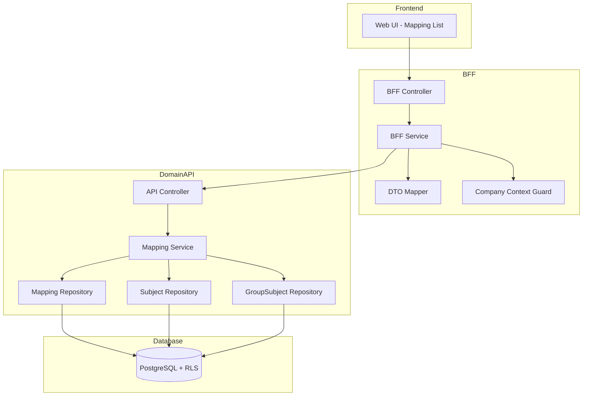
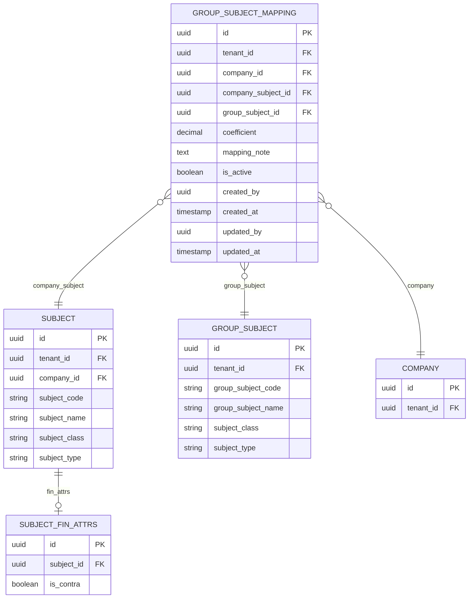

# Technical Design Document

## Feature: master-data/group-subject-mapping

---

## Overview

連結科目マッピング（group-subject-mapping）は、EPM SaaSにおける「会社COA（会社科目）から連結COA（グループ科目）へのマッピング」を管理する機能である。

本機能により、各個社が自社の会社科目を連結勘定科目にマッピングすることで、連結財務レポートにおける科目変換・集計の基盤を提供する。

**重要な設計ポイント**:
- **会社単位管理**: group_subject_mappings は company_id を持ち、各会社が自社分のマッピングを管理
- **自社マッピングのみ操作可能**: 親会社・子会社問わず、各会社は自社のマッピングのみ操作可能
- **1:1マッピング**: 1会社科目 = 1連結科目（UNIQUE: tenant_id + company_id + company_subject_id）
- **Phase 1 制約**: 係数（coefficient）は +1 または -1 のみ
- **group-subject-master との関係**: 連結科目（group_subjects）は親会社のみ編集可能、マッピングは各社で設定

---

## Architecture

### Architecture Pattern & Boundary Map

**Pattern (fixed)**:
- UI（apps/web） → BFF（apps/bff） → Domain API（apps/api） → DB（PostgreSQL + RLS）
- UI 直 API は禁止



**Contracts (SSoT)**:
- UI ↔ BFF: `packages/contracts/src/bff/group-subject-mapping`
- BFF ↔ Domain API: `packages/contracts/src/api/group-subject-mapping`
- Enum/Error: `packages/contracts/src/shared/errors`
- UI は `packages/contracts/src/api` を参照してはならない

---

## Architecture Responsibilities（Mandatory）

### BFF Specification（apps/bff）

**Purpose**
- UI 要件に最適化した API（Mapping List / Detail Panel 向け）
- 会社科目一覧にマッピング状況を付与したビューを構築
- Domain API のレスポンスを UI 向け DTO に変換
- ビジネスルールの正本は持たない

**BFF Endpoints（UI が叩く）**

| Method | Endpoint | Purpose | Request DTO (contracts/bff) | Response DTO (contracts/bff) | Notes |
|--------|----------|---------|-----------------------------|-----------------------------|-------|
| GET | /api/bff/master-data/group-subject-mapping | マッピング一覧取得 | BffMappingListRequest | BffMappingListResponse | 会社科目＋マッピング状況 |
| GET | /api/bff/master-data/group-subject-mapping/:id | マッピング詳細取得 | - | BffMappingDetailResponse | UUID パス |
| POST | /api/bff/master-data/group-subject-mapping | マッピング新規登録 | BffCreateMappingRequest | BffMappingDetailResponse | - |
| PATCH | /api/bff/master-data/group-subject-mapping/:id | マッピング更新 | BffUpdateMappingRequest | BffMappingDetailResponse | - |
| DELETE | /api/bff/master-data/group-subject-mapping/:id | マッピング削除 | - | { success: true } | - |
| POST | /api/bff/master-data/group-subject-mapping/:id/deactivate | マッピング無効化 | - | BffMappingDetailResponse | - |
| POST | /api/bff/master-data/group-subject-mapping/:id/reactivate | マッピング再有効化 | - | BffMappingDetailResponse | - |
| POST | /api/bff/master-data/group-subject-mapping/bulk | 一括マッピング登録 | BffBulkMappingRequest | BffBulkMappingResponse | 複数科目一括 |
| GET | /api/bff/master-data/group-subject-mapping/group-subjects/tree | 連結科目選択用ツリー取得 | BffGroupSubjectSelectRequest | BffGroupSubjectSelectTreeResponse | ダイアログ用（rollup関係でツリー表示） |

**Naming Convention（必須）**
- DTO / Contracts: camelCase（例: `companySubjectId`, `groupSubjectId`）
- DB columns: snake_case（例: `company_subject_id`, `group_subject_id`）
- DB 列名（snake_case）を UI/BFF へ露出させない

**Paging / Sorting Normalization（必須・BFF責務）**
- UI/BFF: page / pageSize（page-based）
- Domain API: offset / limit（DB-friendly）
- BFF は必ず以下を実施する（省略禁止）：
  - defaults: page=1, pageSize=50, sortBy=subjectCode, sortOrder=asc
  - clamp: pageSize <= 200
  - whitelist: sortBy は許可リストのみ（subjectCode | subjectName | groupSubjectCode | groupSubjectName）
  - normalize: keyword trim、空→undefined
  - transform: offset=(page-1)*pageSize, limit=pageSize
- Domain API に渡すのは offset/limit（page/pageSize は渡さない）
- BFF レスポンスには page/pageSize を含める（UI へ返すのは BFF 側の値）

**Filter Normalization（BFF 責務）**
- keyword: trim、空→undefined
- subjectType: 'FIN' | 'KPI' | undefined
- subjectClass: 'BASE' | 'AGGREGATE' | undefined
- mappingStatus: 'mapped' | 'unmapped' | undefined
- isActive: boolean | undefined

**Mapping List Response 構造（BFF 責務）**
- Domain API から会社科目一覧とマッピング一覧を取得
- BFF でマッピング状況を付与したリストに結合
- マッピング統計（mappedCount / totalCount）を計算

**Error Policy（必須）**
- 採用方針：**Option A: Pass-through**
- 採用理由：
  - Domain API のエラーコードは明確で、UI で直接ハンドリング可能
  - マッピング重複チェック等のビジネスロジック正本は Domain API

**Error Handling（contracts error に準拠）**

| Domain API Error | HTTP Status | BFF Action |
|-----------------|-------------|------------|
| MAPPING_NOT_FOUND | 404 | Pass-through |
| MAPPING_ALREADY_EXISTS | 409 | Pass-through |
| MAPPING_ALREADY_INACTIVE | 409 | Pass-through |
| MAPPING_ALREADY_ACTIVE | 409 | Pass-through |
| COMPANY_SUBJECT_NOT_FOUND | 404 | Pass-through |
| GROUP_SUBJECT_NOT_FOUND | 404 | Pass-through |
| INVALID_COEFFICIENT | 422 | Pass-through |
| COMPANY_MISMATCH | 403 | Pass-through |
| VALIDATION_ERROR | 422 | Pass-through |

**Authentication / Tenant Context**
- tenant_id / user_id / company_id は認証ミドルウェアで解決し、リクエストコンテキストに付与
- Domain API へは `x-tenant-id` / `x-user-id` / `x-company-id` ヘッダーで伝搬

---

### Service Specification（Domain / apps/api）

**Purpose**
- ビジネスルールの正本（BFF/UI は禁止）
- 会社コンテキストチェックの正本
- Transaction boundary / audit points を必ず明記

**Domain API Endpoints - Mappings**

| Method | Endpoint | Purpose | Transaction | Audit | CompanyGuard |
|--------|----------|---------|-------------|-------|--------------|
| GET | /api/master-data/group-subject-mapping | 一覧取得 | Read-only | - | **Yes**（自社のみ） |
| GET | /api/master-data/group-subject-mapping/:id | 詳細取得 | Read-only | - | **Yes**（自社のみ） |
| POST | /api/master-data/group-subject-mapping | 新規登録 | Write（単一） | created_by/at | **Yes**（自社のみ） |
| PATCH | /api/master-data/group-subject-mapping/:id | 更新 | Write（単一） | updated_by/at | **Yes**（自社のみ） |
| DELETE | /api/master-data/group-subject-mapping/:id | 削除 | Write（単一） | - | **Yes**（自社のみ） |
| POST | /api/master-data/group-subject-mapping/:id/deactivate | 無効化 | Write（単一） | updated_by/at | **Yes**（自社のみ） |
| POST | /api/master-data/group-subject-mapping/:id/reactivate | 再有効化 | Write（単一） | updated_by/at | **Yes**（自社のみ） |
| POST | /api/master-data/group-subject-mapping/bulk | 一括登録 | Write（複数） | created_by/at | **Yes**（自社のみ） |

**Domain API Endpoints - Supporting**

| Method | Endpoint | Purpose | Transaction | Audit | CompanyGuard |
|--------|----------|---------|-------------|-------|--------------|
| GET | /api/master-data/subjects | 会社科目一覧取得 | Read-only | - | **Yes**（自社のみ） |
| GET | /api/master-data/group-subjects | 連結科目一覧取得 | Read-only | - | No（テナント共通） |

**Company Context Guard（自社マッピングのみ操作）**

```typescript
@Injectable()
export class CompanyContextGuard implements CanActivate {
  constructor(private readonly mappingRepository: MappingRepository) {}

  async canActivate(context: ExecutionContext): Promise<boolean> {
    const request = context.switchToHttp().getRequest();
    const tenantId = request.headers['x-tenant-id'];
    const companyId = request.headers['x-company-id'];
    const mappingId = request.params.id;

    // 一覧取得・新規登録の場合は company_id コンテキストのみチェック
    if (!mappingId) {
      return true;
    }

    // 既存マッピング操作の場合、自社マッピングかチェック
    const mapping = await this.mappingRepository.findById(tenantId, mappingId);
    if (!mapping) {
      throw new NotFoundException({
        code: 'MAPPING_NOT_FOUND',
        message: 'マッピングが見つかりません',
      });
    }

    if (mapping.companyId !== companyId) {
      throw new ForbiddenException({
        code: 'COMPANY_MISMATCH',
        message: '他社のマッピングは操作できません',
      });
    }

    return true;
  }
}
```

**Business Rules（Service 責務）**
- マッピング重複チェック（tenant_id + company_id + company_subject_id）
- 会社科目存在チェック（同一 company_id）
- 連結科目存在チェック（同一 tenant_id）
- 係数は +1 または -1 のみ（Phase 1）
- 控除科目（FIN科目の場合、subject_fin_attrs.is_contra = true を JOIN して判定）のデフォルト係数 = -1
- 無効化済みマッピングの再無効化禁止
- 有効マッピングの再有効化禁止
- 一括登録時の重複スキップ処理

**Transaction Boundary**
- マッピング CRUD: 単一トランザクション
- 一括登録: 単一トランザクション（全成功 or ロールバック）

---

### Repository Specification（apps/api）

**Purpose**
- データアクセス層（Prisma 経由）
- tenant_id + company_id による二重ガード

**Mapping Repository Methods**

| Method | Parameters | Returns | Notes |
|--------|------------|---------|-------|
| findMany | tenantId, companyId, filter | Mapping[] | フィルタリング対応 |
| findById | tenantId, id | Mapping \| null | UUID で取得 |
| findByCompanySubject | tenantId, companyId, companySubjectId | Mapping \| null | 重複チェック用 |
| create | tenantId, data | Mapping | 監査情報含む |
| update | tenantId, id, data | Mapping | 監査情報更新 |
| delete | tenantId, id | void | 物理削除 |
| createMany | tenantId, data[] | Mapping[] | 一括登録 |

**Subject Repository Methods（会社科目参照用）**

| Method | Parameters | Returns | Notes |
|--------|------------|---------|-------|
| findMany | tenantId, companyId, filter | Subject[] | フィルタリング対応 |
| findById | tenantId, companyId, id | Subject \| null | 存在チェック用 |
| findByIdWithFinAttrs | tenantId, companyId, id | Subject & { finAttrs?: SubjectFinAttrs } | 控除科目判定用（FIN科目のみfinAttrsをJOIN） |

**GroupSubject Repository Methods（連結科目参照用）**

| Method | Parameters | Returns | Notes |
|--------|------------|---------|-------|
| findMany | tenantId, filter | GroupSubject[] | フィルタリング対応 |
| findById | tenantId, id | GroupSubject \| null | 存在チェック用 |
| findManyWithRollups | tenantId, filter | { subjects: GroupSubject[], rollups: GroupSubjectRollupItem[] } | ツリー構築用（rollup関係含む） |

**Tenant Guard（必須）**
- 全メソッドの第一引数は tenantId
- マッピング操作は companyId も必須
- where 句に必ず tenant_id（+ company_id）条件を含める
- PrismaService.setTenantContext() を呼び出してから Prisma クエリ実行
- RLS 無効化は禁止

---

### Contracts Summary（This Feature）

**BFF Contracts（packages/contracts/src/bff/group-subject-mapping）**

```typescript
// Request DTOs
export interface BffMappingListRequest {
  page?: number;
  pageSize?: number;
  sortBy?: 'subjectCode' | 'subjectName' | 'groupSubjectCode' | 'groupSubjectName';
  sortOrder?: 'asc' | 'desc';
  keyword?: string;
  subjectType?: 'FIN' | 'KPI';
  subjectClass?: 'BASE' | 'AGGREGATE';
  mappingStatus?: 'mapped' | 'unmapped';
  isActive?: boolean;
}

export interface BffCreateMappingRequest {
  companySubjectId: string;
  groupSubjectId: string;
  coefficient?: 1 | -1;            // default: +1（控除科目は-1）
  mappingNote?: string;
}

export interface BffUpdateMappingRequest {
  groupSubjectId?: string;
  coefficient?: 1 | -1;
  mappingNote?: string;
  isActive?: boolean;
}

export interface BffBulkMappingRequest {
  companySubjectIds: string[];     // 複数の会社科目ID
  groupSubjectId: string;          // 1つの連結科目にまとめてマッピング
  coefficient?: 1 | -1;            // default: +1
}

export interface BffGroupSubjectSelectRequest {
  keyword?: string;
  subjectType?: 'FIN' | 'KPI';
}

// Response DTOs
export interface BffMappingListItem {
  id: string | null;                        // マッピングID（未設定の場合null）
  companySubjectId: string;
  companySubjectCode: string;
  companySubjectName: string;
  companySubjectClass: 'BASE' | 'AGGREGATE';
  companySubjectType: 'FIN' | 'KPI';
  companySubjectIsContra: boolean;          // 控除科目フラグ（FIN科目の場合subject_fin_attrs.is_contraから取得、KPI科目はfalse）
  groupSubjectId: string | null;            // マッピング先（未設定の場合null）
  groupSubjectCode: string | null;
  groupSubjectName: string | null;
  coefficient: 1 | -1 | null;
  mappingNote: string | null;
  isActive: boolean | null;
  isMapped: boolean;                        // マッピング設定済みフラグ
}

export interface BffMappingListResponse {
  items: BffMappingListItem[];
  pagination: {
    page: number;
    pageSize: number;
    totalCount: number;
    totalPages: number;
  };
  statistics: {
    mappedCount: number;                    // マッピング設定済み件数
    unmappedCount: number;                  // マッピング未設定件数
    totalCount: number;
  };
}

export interface BffMappingDetailResponse {
  id: string;
  companySubjectId: string;
  companySubjectCode: string;
  companySubjectName: string;
  companySubjectClass: 'BASE' | 'AGGREGATE';
  companySubjectType: 'FIN' | 'KPI';
  companySubjectIsContra: boolean;
  groupSubjectId: string;
  groupSubjectCode: string;
  groupSubjectName: string;
  groupSubjectClass: 'BASE' | 'AGGREGATE';
  groupSubjectType: 'FIN' | 'KPI';
  coefficient: 1 | -1;
  mappingNote: string | null;
  isActive: boolean;
  createdAt: string;
  updatedAt: string;
}

export interface BffBulkMappingResponse {
  successCount: number;
  skippedCount: number;                     // 既存マッピングでスキップされた件数
  skippedSubjectIds: string[];              // スキップされた会社科目ID
}

export interface BffGroupSubjectSelectTreeNode {
  id: string;
  groupSubjectCode: string;
  groupSubjectName: string;
  subjectClass: 'BASE' | 'AGGREGATE';
  subjectType: 'FIN' | 'KPI';
  isRecommended: boolean;                   // 会社科目と同タイプの推奨マーク
  children: BffGroupSubjectSelectTreeNode[];  // rollup関係に基づく子ノード
}

export interface BffGroupSubjectSelectTreeResponse {
  nodes: BffGroupSubjectSelectTreeNode[];     // ルートノード（親を持たない科目）
  unassigned: BffGroupSubjectSelectTreeNode[]; // どの集計科目にも属さないBASE科目
}
```

**API Contracts（packages/contracts/src/api/group-subject-mapping）**

```typescript
// Request DTOs
export interface ApiListMappingsRequest {
  offset?: number;
  limit?: number;
  sortBy?: string;
  sortOrder?: 'asc' | 'desc';
  keyword?: string;
  subjectType?: 'FIN' | 'KPI';
  subjectClass?: 'BASE' | 'AGGREGATE';
  isActive?: boolean;
}

export interface ApiCreateMappingRequest {
  companySubjectId: string;
  groupSubjectId: string;
  coefficient?: 1 | -1;
  mappingNote?: string;
}

export interface ApiUpdateMappingRequest {
  groupSubjectId?: string;
  coefficient?: 1 | -1;
  mappingNote?: string;
  isActive?: boolean;
}

export interface ApiBulkMappingRequest {
  companySubjectIds: string[];
  groupSubjectId: string;
  coefficient?: 1 | -1;
}

// Response DTOs
export interface ApiMappingResponse {
  id: string;
  tenantId: string;
  companyId: string;
  companySubjectId: string;
  groupSubjectId: string;
  coefficient: number;
  mappingNote: string | null;
  isActive: boolean;
  createdBy: string | null;
  createdAt: string;
  updatedBy: string | null;
  updatedAt: string;
}

export interface ApiListMappingsResponse {
  items: ApiMappingResponse[];
  totalCount: number;
}

export interface ApiBulkMappingResponse {
  successCount: number;
  skippedCount: number;
  skippedSubjectIds: string[];
  createdMappings: ApiMappingResponse[];
}
```

**Error Contracts（packages/contracts/src/shared/errors/group-subject-mapping-error.ts）**

```typescript
export const GroupSubjectMappingErrorCode = {
  MAPPING_NOT_FOUND: 'MAPPING_NOT_FOUND',
  MAPPING_ALREADY_EXISTS: 'MAPPING_ALREADY_EXISTS',
  MAPPING_ALREADY_INACTIVE: 'MAPPING_ALREADY_INACTIVE',
  MAPPING_ALREADY_ACTIVE: 'MAPPING_ALREADY_ACTIVE',
  COMPANY_SUBJECT_NOT_FOUND: 'COMPANY_SUBJECT_NOT_FOUND',
  GROUP_SUBJECT_NOT_FOUND: 'GROUP_SUBJECT_NOT_FOUND',
  INVALID_COEFFICIENT: 'INVALID_COEFFICIENT',
  COMPANY_MISMATCH: 'COMPANY_MISMATCH',
  VALIDATION_ERROR: 'VALIDATION_ERROR',
} as const;

export type GroupSubjectMappingErrorCode =
  typeof GroupSubjectMappingErrorCode[keyof typeof GroupSubjectMappingErrorCode];

export interface GroupSubjectMappingError {
  code: GroupSubjectMappingErrorCode;
  message: string;
  details?: Record<string, unknown>;
}
```

---

## Responsibility Clarification（Mandatory）

本 Feature における責務境界を以下に明記する。
未記載の責務は実装してはならない。

### UI の責務
- マッピング一覧表示制御
- マッピング未設定科目の視覚的区別
- 連結科目選択ダイアログのツリー表示
- フォーム入力制御・UX 最適化
- エラーコードに基づく表示切替
- **isMapped フラグに基づく操作ボタン切替**
- **推奨連結科目のハイライト表示**
- ビジネス判断は禁止

### BFF の責務
- 会社科目 + マッピング情報の結合
- ページング・ソート・フィルタの正規化
- マッピング統計の計算
- Domain API DTO ⇄ UI DTO の変換
- **推奨連結科目の判定（科目タイプ一致）**
- ビジネスルールの正本は持たない

### Domain API の責務
- ビジネスルールの正本
- **自社マッピングのみ操作可能の検証**
- マッピング重複チェック（1:1制約）
- 会社科目・連結科目の存在チェック
- 係数 +1/-1 の検証（Phase 1）
- 無効化/再有効化の状態遷移検証
- 一括登録時の重複スキップ処理
- 監査ログ・整合性保証
- tenant_id + company_id による最終ガード

---

## Data Model

### Entity Reference
- 参照元: `.kiro/specs/entities/01_各種マスタ.md` セクション 9.2

### エンティティ整合性チェックリスト

| チェック項目 | 確認結果 |
|-------------|---------|
| カラム網羅性 | エンティティ定義の全カラムがDTO/Prismaに反映されている: ✅ |
| 型の一致 | varchar→String, numeric→Decimal 等の型変換が正確: ✅ |
| 制約の反映 | UNIQUE/CHECK制約がPrisma/アプリ検証に反映: ✅ |
| ビジネスルール | エンティティ補足のルールがServiceに反映: ✅ |
| NULL許可 | NULL/NOT NULLがPrisma?/必須に正しく対応: ✅ |

### Entity: GroupSubjectMapping



### Prisma Schema - GroupSubjectMapping

```prisma
model GroupSubjectMapping {
  id                 String    @id @default(uuid())
  tenantId           String    @map("tenant_id")
  companyId          String    @map("company_id")
  companySubjectId   String    @map("company_subject_id")
  groupSubjectId     String    @map("group_subject_id")
  coefficient        Decimal   @db.Decimal(9, 4)
  mappingNote        String?   @map("mapping_note")
  isActive           Boolean   @default(true) @map("is_active")
  createdBy          String?   @map("created_by")
  createdAt          DateTime  @default(now()) @map("created_at")
  updatedBy          String?   @map("updated_by")
  updatedAt          DateTime  @updatedAt @map("updated_at")

  company            Company       @relation(fields: [tenantId, companyId], references: [tenantId, id])
  companySubject     Subject       @relation(fields: [tenantId, companyId, companySubjectId], references: [tenantId, companyId, id])
  groupSubject       GroupSubject  @relation(fields: [tenantId, groupSubjectId], references: [tenantId, id])

  @@unique([tenantId, companyId, companySubjectId])
  @@index([tenantId, companyId])
  @@index([tenantId, companyId, groupSubjectId])
  @@index([tenantId, companyId, isActive])
  @@map("group_subject_mappings")
}
```

### Constraints

- GroupSubjectMapping PK: id（UUID）
- GroupSubjectMapping Unique: tenant_id + company_id + company_subject_id（1:1マッピング）
- FK: tenant_id + company_id → companies(tenant_id, id)
- FK: tenant_id + company_id + company_subject_id → subjects(tenant_id, company_id, id)
- FK: tenant_id + group_subject_id → group_subjects(tenant_id, id)
- CHECK: coefficient IN (1.0000, -1.0000)（Phase 1、アプリケーション層で検証）

### RLS Policy（PostgreSQL）

```sql
-- group_subject_mappings RLS 有効化
ALTER TABLE group_subject_mappings ENABLE ROW LEVEL SECURITY;

CREATE POLICY tenant_isolation ON group_subject_mappings
  USING (tenant_id::text = current_setting('app.tenant_id', true));
```

---

## Requirements Traceability

| Requirement | Summary | Components | Interfaces | Flows |
|-------------|---------|------------|------------|-------|
| 1.1 | マッピング一覧取得 | BFF.joinMappings, Repository | GET /mapping | List |
| 1.2 | マッピング先表示 | BffMappingListItem | groupSubjectCode/Name | List |
| 1.3 | 未設定科目の区別 | UI + isMapped | - | UI |
| 1.4 | 一覧表示項目 | BffMappingListItem | - | List |
| 1.5 | 統計表示 | BFF.calculateStats | statistics | List |
| 2.1 | 詳細パネル表示 | Repository.findById | GET /:id | Detail |
| 2.2 | 詳細表示項目 | BffMappingDetailResponse | - | Detail |
| 2.3 | 編集モード切替 | UI | - | UI |
| 2.4 | 編集内容保存 | Service.update | PATCH /:id | Update |
| 2.5 | 更新監査情報 | Repository | updated_by/at | Update |
| 3.1 | マッピング設定ダイアログ | UI | - | UI |
| 3.2 | マッピング新規登録 | Service.create | POST / | Create |
| 3.3 | 係数デフォルト+1 | Service.create | - | Create |
| 3.4 | 係数 +1/-1 のみ | Service | INVALID_COEFFICIENT | Create |
| 3.5 | 控除科目デフォルト-1 | Service.create | is_contra check | Create |
| 3.6 | 重複エラー | Service | MAPPING_ALREADY_EXISTS | Error |
| 3.7 | isActive初期化 | Service.create | - | Create |
| 3.8 | 登録監査情報 | Repository | created_by/at | Create |
| 4.1 | 連結科目ダイアログ | UI | - | UI |
| 4.2 | 連結科目検索 | BFF.filterGroupSubjects | keyword | Select |
| 4.3 | 連結科目フィルタ | BFF.filterGroupSubjects | subjectType | Select |
| 4.4 | 推奨ハイライト | BFF.markRecommended | isRecommended | Select |
| 4.5 | 連結科目選択確定 | UI | - | UI |
| 5.1 | マッピング変更ダイアログ | UI | - | UI |
| 5.2 | 現在マッピング表示 | UI | - | UI |
| 5.3 | マッピング先変更 | Service.update | PATCH /:id | Update |
| 5.4 | 変更監査情報 | Repository | updated_by/at | Update |
| 6.1 | 削除確認ダイアログ | UI | - | UI |
| 6.2 | マッピング削除 | Service.delete | DELETE /:id | Delete |
| 6.3 | 削除後一覧更新 | UI | - | UI |
| 6.4 | 削除エラー | Service | MAPPING_NOT_FOUND | Error |
| 7.1 | 一括マッピングダイアログ | UI | - | UI |
| 7.2 | 一括マッピング登録 | Service.bulkCreate | POST /bulk | Bulk |
| 7.3 | 重複スキップ | Service.bulkCreate | skippedCount | Bulk |
| 7.4 | 結果表示 | BffBulkMappingResponse | successCount/skippedCount | Bulk |
| 8.1-8.7 | フィルタリング・検索 | BFF.normalize, Repository | keyword, filters | Filter |
| 9.1-9.4 | 無効化 | Service.deactivate | POST /:id/deactivate | Deactivate |
| 10.1-10.4 | 再有効化 | Service.reactivate | POST /:id/reactivate | Reactivate |
| 11.1-11.3 | 自社マッピングのみ操作 | CompanyContextGuard | COMPANY_MISMATCH | Security |
| 12.1-12.4 | マルチテナント分離 | RLS, Repository | tenant_id | Security |
| 13.1-13.2 | 1:1マッピング制約 | Prisma @@unique | - | DB |
| 14.1-14.3 | 監査ログ | Repository | created_by/updated_by | Audit |
| 15.1-15.3 | 係数制約 | Service | INVALID_COEFFICIENT | Validation |

---

## Component Summary

| Component | Domain | Intent | Requirements | Dependencies |
|-----------|--------|--------|--------------|--------------|
| GroupSubjectMappingController (API) | Domain API | REST エンドポイント提供 | All | MappingService, CompanyContextGuard |
| GroupSubjectMappingService | Domain API | マッピングビジネスルール実行 | 2-15 | MappingRepository, SubjectRepository, GroupSubjectRepository |
| CompanyContextGuard | Domain API | 自社マッピングチェック | 11 | MappingRepository |
| GroupSubjectMappingRepository | Domain API | マッピングデータアクセス | 12, 13, 14 | PrismaService |
| SubjectRepository | Domain API | 会社科目参照 | 3, 4 | PrismaService |
| GroupSubjectRepository | Domain API | 連結科目参照 | 3, 4 | PrismaService |
| GroupSubjectMappingController (BFF) | BFF | UI向けエンドポイント | All | BffService |
| GroupSubjectMappingService (BFF) | BFF | DTO変換・結合・統計 | 1, 4, 8 | Mapper, ApiClient |
| GroupSubjectMappingMapper | BFF | DTO変換 | - | - |

---

## Technology Stack & Alignment

| Layer | Technology | Version | Role |
|-------|------------|---------|------|
| Frontend | Next.js (App Router) | 14.x | UI ホスティング |
| Frontend | React | 18.x | UI コンポーネント |
| Frontend | TypeScript | 5.x | 型安全性 |
| Frontend | TanStack Query | 5.x | Server State 管理 |
| BFF | NestJS | 10.x | BFF フレームワーク |
| Backend | NestJS | 10.x | Domain API フレームワーク |
| Backend | TypeScript | 5.x | 型安全性 |
| Backend | Prisma | 5.x | ORM |
| Database | PostgreSQL | 15.x | RDBMS + RLS |
| Contracts | TypeScript | 5.x | 型定義 SSoT |

---

## Security Considerations

- **マルチテナント分離**: tenant_id による RLS + アプリケーションガード（double-guard）
- **会社コンテキスト**: 各会社は自社のマッピングのみ操作可能（CompanyContextGuard）
- **認証**: Clerk 経由で認証済みユーザーのみアクセス可
- **入力検証**:
  - companySubjectId: 自社科目であることを検証
  - groupSubjectId: テナント内の有効な連結科目であることを検証
  - coefficient: Phase 1 では +1 または -1 のみ

---

## Testing Strategy

| Test Type | Scope | Tools | Coverage Target |
|-----------|-------|-------|-----------------|
| Unit | MappingService | Jest | ビジネスロジック 100% |
| Unit | CompanyContextGuard | Jest | 権限チェック 100% |
| Unit | Mapper | Jest | 変換ロジック 100% |
| Unit | Statistics Calculator | Jest | 統計計算 100% |
| Integration | Repository + DB | Jest + Testcontainers | CRUD + RLS |
| E2E | UI → BFF → API → DB | Playwright | 主要シナリオ |

**マッピング重複テストケース（必須）**
- 同一会社科目への2回目マッピング → MAPPING_ALREADY_EXISTS
- 一括登録時の部分重複 → 重複分スキップ、成功分登録

**会社コンテキストテストケース（必須）**
- 自社マッピング操作 → 許可
- 他社マッピング操作 → COMPANY_MISMATCH（403）
- 新規登録時の自社科目チェック → 許可/COMPANY_SUBJECT_NOT_FOUND

**係数テストケース（必須）**
- coefficient = +1 → 許可
- coefficient = -1 → 許可
- coefficient = +0.5 → INVALID_COEFFICIENT（Phase 1）
- FIN科目かつ subject_fin_attrs.is_contra = true → デフォルト係数 -1
- FIN科目かつ subject_fin_attrs.is_contra = false → デフォルト係数 +1
- KPI科目（subject_fin_attrs なし）→ デフォルト係数 +1

---

## Open Questions / Risks

- **Q1**: 一括マッピング時の最大件数は？
  - **Decision**: 100件まで（パフォーマンス考慮）
- **Q2**: マッピング削除時のFact整合性は？
  - **Decision**: マッピング削除は任意。Fact集計時にマッピング未設定科目は除外される
- **Q3**: 連結科目選択ダイアログのツリー表示は？
  - **Decision**: group_subject_rollup_items のrollup関係を使用してツリー形式で表示。group-subject-master のツリー構築ロジック（BffGroupSubjectTreeBuilder）を再利用
- **Q4**: 係数の拡張（Phase 2）の影響範囲は？
  - **Decision**: Phase 2 で coefficient の CHECK 制約を緩和、UI も対応
- **Risk**: 大量科目（1000 件超）でのリスト表示性能
  - **Mitigation**: ページング必須、仮想スクロール検討

---

## References

- [requirements.md](./requirements.md) — 要件定義
- `.kiro/specs/entities/01_各種マスタ.md` — エンティティ定義（セクション 9.2）
- `.kiro/steering/tech.md` — 技術憲法
- `.kiro/steering/structure.md` — 構造憲法
- `.kiro/specs/master-data/group-subject-master/design.md` — 関連設計（連結勘定科目マスタ）
