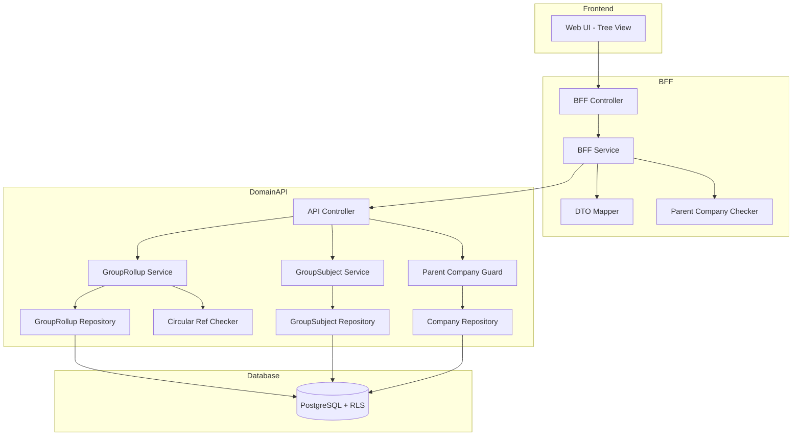
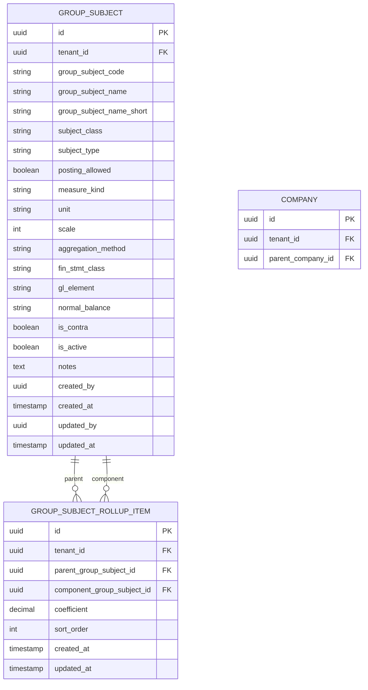

# Technical Design Document

## Feature: master-data/group-subject-master

---

## Overview

連結勘定科目マスタ（group-subject-master）は、EPM SaaSにおける「連結用の統一勘定科目（グループCOA）とその集計構造」を管理する機能である。

本機能は会社科目マスタ（subjects）とは異なり、**テナント単位**で連結勘定科目を管理する。これにより、グループ全体で統一された勘定科目体系を構築し、連結財務レポートの基盤を提供する。

**重要な設計ポイント**:
- **テナント単位管理**: group_subjects は company_id を持たず、tenant_id のみで管理
- **親会社のみ編集可能**: companies.parent_company_id IS NULL の会社のみが CRUD 可能、子会社は参照のみ
- **Phase 1 制約**: 係数（coefficient）は +1 または -1 のみ、期間管理（valid_from/valid_to）は使用しない
- **ツリー構造**: subjects と同様に AGGREGATE/BASE の集計構造をツリー形式で表示・編集

---

## Architecture

### Architecture Pattern & Boundary Map

**Pattern (fixed)**:
- UI（apps/web） → BFF（apps/bff） → Domain API（apps/api） → DB（PostgreSQL + RLS）
- UI 直 API は禁止



**Contracts (SSoT)**:
- UI ↔ BFF: `packages/contracts/src/bff/group-subject-master`
- BFF ↔ Domain API: `packages/contracts/src/api/group-subject-master`
- Enum/Error: `packages/contracts/src/shared/errors`
- UI は `packages/contracts/src/api` を参照してはならない

---

## Architecture Responsibilities（Mandatory）

### BFF Specification（apps/bff）

**Purpose**
- UI 要件に最適化した API（Tree View / Detail Panel 向け）
- Domain API のレスポンスをツリー構造に変換
- 親会社判定結果をレスポンスに含める（isParentCompany フラグ）
- ビジネスルールの正本は持たない

**BFF Endpoints（UI が叩く）**

| Method | Endpoint | Purpose | Request DTO (contracts/bff) | Response DTO (contracts/bff) | Notes |
|--------|----------|---------|-----------------------------|-----------------------------|-------|
| GET | /api/bff/master-data/group-subject-master/tree | 連結勘定科目ツリー取得 | BffGroupSubjectTreeRequest | BffGroupSubjectTreeResponse | 全科目＋rollup構造 |
| GET | /api/bff/master-data/group-subject-master/:id | 科目詳細取得 | - | BffGroupSubjectDetailResponse | UUID パス |
| POST | /api/bff/master-data/group-subject-master | 科目新規登録 | BffCreateGroupSubjectRequest | BffGroupSubjectDetailResponse | 親会社のみ |
| PATCH | /api/bff/master-data/group-subject-master/:id | 科目情報更新 | BffUpdateGroupSubjectRequest | BffGroupSubjectDetailResponse | 親会社のみ |
| POST | /api/bff/master-data/group-subject-master/:id/deactivate | 科目無効化 | - | BffGroupSubjectDetailResponse | 親会社のみ |
| POST | /api/bff/master-data/group-subject-master/:id/reactivate | 科目再有効化 | - | BffGroupSubjectDetailResponse | 親会社のみ |
| POST | /api/bff/master-data/group-subject-master/:parentId/rollup | 構成科目追加 | BffAddGroupRollupRequest | BffGroupSubjectTreeResponse | 親会社のみ |
| PATCH | /api/bff/master-data/group-subject-master/:parentId/rollup/:componentId | 構成科目更新 | BffUpdateGroupRollupRequest | BffGroupSubjectTreeResponse | 親会社のみ |
| DELETE | /api/bff/master-data/group-subject-master/:parentId/rollup/:componentId | 構成科目削除 | - | BffGroupSubjectTreeResponse | 親会社のみ |
| POST | /api/bff/master-data/group-subject-master/move | ドラッグ＆ドロップ移動 | BffMoveGroupSubjectRequest | BffGroupSubjectTreeResponse | 親会社のみ |

**Naming Convention（必須）**
- DTO / Contracts: camelCase（例: `groupSubjectCode`, `groupSubjectName`）
- DB columns: snake_case（例: `group_subject_code`, `group_subject_name`）
- DB 列名（snake_case）を UI/BFF へ露出させない

**Parent Company Check（BFF 責務）**
- ログインユーザーの company_id から companies.parent_company_id を確認
- parent_company_id IS NULL → isParentCompany = true（編集可能）
- parent_company_id IS NOT NULL → isParentCompany = false（参照のみ）
- レスポンスに isParentCompany フラグを含め、UI での表示制御に使用

**Tree Response 構造（BFF 責務）**
- Domain API からフラットな科目一覧と rollup 関係を取得
- BFF でツリー構造（GroupSubjectTreeNode[]）に変換
- ルートノード = 親を持たない科目（トップレベル集計科目 + 未割当科目）
- 子ノード = rollup で紐づく構成科目

**Filter Normalization（BFF 責務）**
- keyword: trim、空→undefined
- subjectType: 'FIN' | 'KPI' | undefined
- subjectClass: 'BASE' | 'AGGREGATE' | undefined
- isActive: boolean | undefined

**Error Policy（必須）**
- 採用方針：**Option A: Pass-through**
- 採用理由：
  - Domain API のエラーコードは明確で、UI で直接ハンドリング可能
  - 親会社権限チェック・循環参照チェック等のビジネスロジック正本は Domain API

**Error Handling（contracts error に準拠）**

| Domain API Error | HTTP Status | BFF Action |
|-----------------|-------------|------------|
| GROUP_SUBJECT_NOT_FOUND | 404 | Pass-through |
| GROUP_SUBJECT_CODE_DUPLICATE | 409 | Pass-through |
| GROUP_SUBJECT_ALREADY_INACTIVE | 409 | Pass-through |
| GROUP_SUBJECT_ALREADY_ACTIVE | 409 | Pass-through |
| GROUP_ROLLUP_ALREADY_EXISTS | 409 | Pass-through |
| GROUP_ROLLUP_NOT_FOUND | 404 | Pass-through |
| CIRCULAR_REFERENCE_DETECTED | 422 | Pass-through |
| CANNOT_ADD_CHILD_TO_BASE | 422 | Pass-through |
| NOT_PARENT_COMPANY | 403 | Pass-through |
| VALIDATION_ERROR | 422 | Pass-through |

**Authentication / Tenant Context**
- tenant_id / user_id / company_id は認証ミドルウェアで解決し、リクエストコンテキストに付与
- Domain API へは `x-tenant-id` / `x-user-id` / `x-company-id` ヘッダーで伝搬

---

### Service Specification（Domain / apps/api）

**Purpose**
- ビジネスルールの正本（BFF/UI は禁止）
- 親会社権限チェックの正本
- Transaction boundary / audit points を必ず明記

**Domain API Endpoints - GroupSubjects**

| Method | Endpoint | Purpose | Transaction | Audit | ParentGuard |
|--------|----------|---------|-------------|-------|-------------|
| GET | /api/master-data/group-subject-master | 一覧取得 | Read-only | - | No |
| GET | /api/master-data/group-subject-master/:id | 詳細取得 | Read-only | - | No |
| POST | /api/master-data/group-subject-master | 新規登録 | Write（単一） | created_by/at | **Yes** |
| PATCH | /api/master-data/group-subject-master/:id | 更新 | Write（単一） | updated_by/at | **Yes** |
| POST | /api/master-data/group-subject-master/:id/deactivate | 無効化 | Write（複数） | updated_by/at | **Yes** |
| POST | /api/master-data/group-subject-master/:id/reactivate | 再有効化 | Write（単一） | updated_by/at | **Yes** |

**Domain API Endpoints - GroupRollups**

| Method | Endpoint | Purpose | Transaction | Audit | ParentGuard |
|--------|----------|---------|-------------|-------|-------------|
| GET | /api/master-data/group-subject-master/rollups | rollup一覧取得 | Read-only | - | No |
| POST | /api/master-data/group-subject-master/:parentId/rollup | 構成科目追加 | Write（単一） | - | **Yes** |
| PATCH | /api/master-data/group-subject-master/:parentId/rollup/:componentId | 構成科目更新 | Write（単一） | - | **Yes** |
| DELETE | /api/master-data/group-subject-master/:parentId/rollup/:componentId | 構成科目削除 | Write（単一） | - | **Yes** |
| POST | /api/master-data/group-subject-master/move | 移動（D&D） | Write（複数） | - | **Yes** |

**Parent Company Guard（NestJS Guard）**

```typescript
@Injectable()
export class ParentCompanyGuard implements CanActivate {
  constructor(private readonly companyRepository: CompanyRepository) {}

  async canActivate(context: ExecutionContext): Promise<boolean> {
    const request = context.switchToHttp().getRequest();
    const tenantId = request.headers['x-tenant-id'];
    const companyId = request.headers['x-company-id'];

    const company = await this.companyRepository.findById(tenantId, companyId);
    if (!company) {
      throw new ForbiddenException('Company not found');
    }

    // parent_company_id が NULL なら親会社
    if (company.parentCompanyId !== null) {
      throw new ForbiddenException({
        code: 'NOT_PARENT_COMPANY',
        message: 'この操作は親会社のみ実行可能です',
      });
    }

    return true;
  }
}
```

**Business Rules（Service 責務）**
- 連結勘定科目コード重複チェック（tenant_id + group_subject_code）
- AGGREGATE 科目の posting_allowed 強制 false
- 無効化済み科目の再無効化禁止
- 有効科目の再有効化禁止
- 集計科目無効化時の子 rollup 関係削除（子科目自体は無効化しない、有効なまま残る）
- 循環参照チェック（rollup 作成・移動時）
- BASE 科目への子追加禁止
- 係数は +1 または -1 のみ（Phase 1）

**Circular Reference Check Algorithm**

```typescript
// DFS による循環参照チェック
async checkCircularReference(
  parentId: string,
  componentId: string,
  existingRollups: GroupRollupItem[]
): Promise<boolean> {
  const visited = new Set<string>();
  const stack = [componentId];

  while (stack.length > 0) {
    const current = stack.pop()!;
    if (current === parentId) {
      return true; // 循環検出
    }
    if (visited.has(current)) continue;
    visited.add(current);

    // current を親として持つ rollup を探索
    const children = existingRollups
      .filter(r => r.parentGroupSubjectId === current)
      .map(r => r.componentGroupSubjectId);
    stack.push(...children);
  }
  return false; // 循環なし
}
```

**Transaction Boundary**
- 科目 CRUD: 単一トランザクション
- 科目無効化: 科目更新 + 子 rollup 削除を単一トランザクション（子科目は無効化しない）
- 科目移動（D&D）: 旧 rollup 削除 + 新 rollup 作成を単一トランザクション

---

### Repository Specification（apps/api）

**Purpose**
- データアクセス層（Prisma 経由）
- tenant_id による二重ガード

**GroupSubject Repository Methods**

| Method | Parameters | Returns | Notes |
|--------|------------|---------|-------|
| findMany | tenantId, filter | GroupSubject[] | フィルタリング対応 |
| findById | tenantId, id | GroupSubject \| null | UUID で取得 |
| findByCode | tenantId, groupSubjectCode | GroupSubject \| null | 重複チェック用 |
| create | tenantId, data | GroupSubject | 監査情報含む |
| update | tenantId, id, data | GroupSubject | 監査情報更新 |

**GroupRollup Repository Methods**

| Method | Parameters | Returns | Notes |
|--------|------------|---------|-------|
| findByTenant | tenantId | GroupRollupItem[] | 全 rollup 取得 |
| findByParent | tenantId, parentGroupSubjectId | GroupRollupItem[] | 親指定 |
| findOne | tenantId, parentId, componentId | GroupRollupItem \| null | 特定関係取得 |
| create | tenantId, data | GroupRollupItem | 作成 |
| update | tenantId, id, data | GroupRollupItem | 更新 |
| delete | tenantId, id | void | 削除 |
| deleteByParent | tenantId, parentGroupSubjectId | void | 親の全子削除 |

**Company Repository Methods（親会社判定用）**

| Method | Parameters | Returns | Notes |
|--------|------------|---------|-------|
| findById | tenantId, companyId | Company \| null | 親会社判定用 |

**Tenant Guard（必須）**
- 全メソッドの第一引数は tenantId
- where 句に必ず tenant_id 条件を含める
- PrismaService.setTenantContext() を呼び出してから Prisma クエリ実行
- RLS 無効化は禁止

---

### Contracts Summary（This Feature）

**BFF Contracts（packages/contracts/src/bff/group-subject-master）**

```typescript
// Request DTOs
export interface BffGroupSubjectTreeRequest {
  keyword?: string;
  subjectType?: 'FIN' | 'KPI';
  subjectClass?: 'BASE' | 'AGGREGATE';
  isActive?: boolean;
}

export interface BffCreateGroupSubjectRequest {
  groupSubjectCode: string;
  groupSubjectName: string;
  groupSubjectNameShort?: string;
  subjectClass: 'BASE' | 'AGGREGATE';
  subjectType: 'FIN' | 'KPI';
  postingAllowed?: boolean;       // BASE default: true, AGGREGATE forced: false
  measureKind: string;
  unit?: string;
  scale?: number;
  aggregationMethod: 'SUM' | 'EOP' | 'AVG' | 'MAX' | 'MIN';
  finStmtClass?: 'PL' | 'BS';     // FIN のみ
  glElement?: string;              // FIN のみ
  normalBalance?: 'debit' | 'credit'; // FIN のみ
  isContra?: boolean;
  notes?: string;
}

export interface BffUpdateGroupSubjectRequest {
  groupSubjectCode?: string;
  groupSubjectName?: string;
  groupSubjectNameShort?: string;
  measureKind?: string;
  unit?: string;
  scale?: number;
  aggregationMethod?: 'SUM' | 'EOP' | 'AVG' | 'MAX' | 'MIN';
  finStmtClass?: 'PL' | 'BS';
  glElement?: string;
  normalBalance?: 'debit' | 'credit';
  isContra?: boolean;
  notes?: string;
}

export interface BffAddGroupRollupRequest {
  componentGroupSubjectId: string;
  coefficient: 1 | -1;            // Phase 1: +1 or -1 only
  sortOrder?: number;
}

export interface BffUpdateGroupRollupRequest {
  coefficient?: 1 | -1;
  sortOrder?: number;
}

export interface BffMoveGroupSubjectRequest {
  groupSubjectId: string;
  fromParentId?: string;          // null = ルートから
  toParentId?: string;            // null = ルートへ
  coefficient?: 1 | -1;           // default: 1
}

// Response DTOs
export interface BffGroupSubjectTreeNode {
  id: string;
  groupSubjectCode: string;
  groupSubjectName: string;
  subjectClass: 'BASE' | 'AGGREGATE';
  subjectType: 'FIN' | 'KPI';
  isActive: boolean;
  coefficient?: 1 | -1;           // rollup 関係の係数（子ノードのみ）
  children: BffGroupSubjectTreeNode[];
}

export interface BffGroupSubjectTreeResponse {
  nodes: BffGroupSubjectTreeNode[];
  unassigned: BffGroupSubjectTreeNode[];  // どの集計科目にも属さない科目
  isParentCompany: boolean;               // 親会社フラグ（編集可否判定用）
}

export interface BffGroupSubjectDetailResponse {
  id: string;
  groupSubjectCode: string;
  groupSubjectName: string;
  groupSubjectNameShort: string | null;
  subjectClass: 'BASE' | 'AGGREGATE';
  subjectType: 'FIN' | 'KPI';
  postingAllowed: boolean;
  measureKind: string;
  unit: string | null;
  scale: number;
  aggregationMethod: string;
  finStmtClass: 'PL' | 'BS' | null;
  glElement: string | null;
  normalBalance: 'debit' | 'credit' | null;
  isContra: boolean;
  isActive: boolean;
  notes: string | null;
  createdAt: string;
  updatedAt: string;
  isParentCompany: boolean;               // 親会社フラグ
}
```

**API Contracts（packages/contracts/src/api/group-subject-master）**

```typescript
// Request DTOs
export interface ApiListGroupSubjectsRequest {
  keyword?: string;
  subjectType?: 'FIN' | 'KPI';
  subjectClass?: 'BASE' | 'AGGREGATE';
  isActive?: boolean;
}

export interface ApiCreateGroupSubjectRequest {
  groupSubjectCode: string;
  groupSubjectName: string;
  groupSubjectNameShort?: string;
  subjectClass: 'BASE' | 'AGGREGATE';
  subjectType: 'FIN' | 'KPI';
  postingAllowed?: boolean;
  measureKind: string;
  unit?: string;
  scale?: number;
  aggregationMethod: 'SUM' | 'EOP' | 'AVG' | 'MAX' | 'MIN';
  finStmtClass?: 'PL' | 'BS';
  glElement?: string;
  normalBalance?: 'debit' | 'credit';
  isContra?: boolean;
  notes?: string;
}

export interface ApiUpdateGroupSubjectRequest {
  groupSubjectCode?: string;
  groupSubjectName?: string;
  groupSubjectNameShort?: string;
  measureKind?: string;
  unit?: string;
  scale?: number;
  aggregationMethod?: 'SUM' | 'EOP' | 'AVG' | 'MAX' | 'MIN';
  finStmtClass?: 'PL' | 'BS';
  glElement?: string;
  normalBalance?: 'debit' | 'credit';
  isContra?: boolean;
  notes?: string;
}

export interface ApiAddGroupRollupRequest {
  componentGroupSubjectId: string;
  coefficient: 1 | -1;
  sortOrder?: number;
}

export interface ApiUpdateGroupRollupRequest {
  coefficient?: 1 | -1;
  sortOrder?: number;
}

export interface ApiMoveGroupSubjectRequest {
  groupSubjectId: string;
  fromParentId?: string;
  toParentId?: string;
  coefficient?: 1 | -1;
}

// Response DTOs
export interface ApiGroupSubjectResponse {
  id: string;
  groupSubjectCode: string;
  groupSubjectName: string;
  groupSubjectNameShort: string | null;
  subjectClass: 'BASE' | 'AGGREGATE';
  subjectType: 'FIN' | 'KPI';
  postingAllowed: boolean;
  measureKind: string;
  unit: string | null;
  scale: number;
  aggregationMethod: string;
  finStmtClass: 'PL' | 'BS' | null;
  glElement: string | null;
  normalBalance: 'debit' | 'credit' | null;
  isContra: boolean;
  isActive: boolean;
  notes: string | null;
  createdAt: string;
  updatedAt: string;
}

export interface ApiListGroupSubjectsResponse {
  items: ApiGroupSubjectResponse[];
}

export interface ApiGroupRollupItemResponse {
  id: string;
  parentGroupSubjectId: string;
  componentGroupSubjectId: string;
  coefficient: 1 | -1;
  sortOrder: number;
}

export interface ApiListGroupRollupsResponse {
  items: ApiGroupRollupItemResponse[];
}
```

**Error Contracts（packages/contracts/src/shared/errors/group-subject-master-error.ts）**

```typescript
export const GroupSubjectMasterErrorCode = {
  GROUP_SUBJECT_NOT_FOUND: 'GROUP_SUBJECT_NOT_FOUND',
  GROUP_SUBJECT_CODE_DUPLICATE: 'GROUP_SUBJECT_CODE_DUPLICATE',
  GROUP_SUBJECT_ALREADY_INACTIVE: 'GROUP_SUBJECT_ALREADY_INACTIVE',
  GROUP_SUBJECT_ALREADY_ACTIVE: 'GROUP_SUBJECT_ALREADY_ACTIVE',
  GROUP_ROLLUP_ALREADY_EXISTS: 'GROUP_ROLLUP_ALREADY_EXISTS',
  GROUP_ROLLUP_NOT_FOUND: 'GROUP_ROLLUP_NOT_FOUND',
  CIRCULAR_REFERENCE_DETECTED: 'CIRCULAR_REFERENCE_DETECTED',
  CANNOT_ADD_CHILD_TO_BASE: 'CANNOT_ADD_CHILD_TO_BASE',
  NOT_PARENT_COMPANY: 'NOT_PARENT_COMPANY',
  INVALID_COEFFICIENT: 'INVALID_COEFFICIENT',
  VALIDATION_ERROR: 'VALIDATION_ERROR',
} as const;

export type GroupSubjectMasterErrorCode =
  typeof GroupSubjectMasterErrorCode[keyof typeof GroupSubjectMasterErrorCode];

export interface GroupSubjectMasterError {
  code: GroupSubjectMasterErrorCode;
  message: string;
  details?: Record<string, unknown>;
}
```

---

## Responsibility Clarification（Mandatory）

本 Feature における責務境界を以下に明記する。
未記載の責務は実装してはならない。

### UI の責務
- ツリー表示制御（展開/折りたたみ）
- ドラッグ＆ドロップ操作の視覚フィードバック
- コピー＆ペースト操作のクリップボード管理
- フォーム入力制御・UX 最適化
- エラーコードに基づく表示切替
- **isParentCompany フラグに基づく編集ボタン表示/非表示**
- ビジネス判断は禁止

### BFF の責務
- フラットデータ → ツリー構造への変換
- UI 入力の正規化（filtering）
- Domain API DTO ⇄ UI DTO の変換
- **親会社判定結果の取得と isParentCompany フラグ付与**
- ビジネスルールの正本は持たない

### Domain API の責務
- ビジネスルールの正本
- **親会社権限チェック（ParentCompanyGuard）**
- 連結勘定科目コード重複チェック
- AGGREGATE 科目の posting_allowed 強制
- 係数 +1/-1 の検証（Phase 1）
- 循環参照チェック
- BASE 科目への子追加禁止
- 無効化/再有効化の状態遷移検証
- 監査ログ・整合性保証
- tenant_id による最終ガード

---

## Data Model

### Entity Reference
- 参照元: `.kiro/specs/entities/01_各種マスタ.md` セクション 9.1, 9.3

### エンティティ整合性チェックリスト

| チェック項目 | 確認結果 |
|-------------|---------|
| カラム網羅性 | エンティティ定義の全カラムがDTO/Prismaに反映されている: ✅ |
| 型の一致 | varchar→String, numeric→Decimal 等の型変換が正確: ✅ |
| 制約の反映 | UNIQUE/CHECK制約がPrisma/アプリ検証に反映: ✅ |
| ビジネスルール | エンティティ補足のルールがServiceに反映: ✅ |
| NULL許可 | NULL/NOT NULLがPrisma?/必須に正しく対応: ✅ |

### Entity: GroupSubject



### Prisma Schema - GroupSubject

```prisma
model GroupSubject {
  id                    String    @id @default(uuid())
  tenantId              String    @map("tenant_id")
  groupSubjectCode      String    @map("group_subject_code")
  groupSubjectName      String    @map("group_subject_name")
  groupSubjectNameShort String?   @map("group_subject_name_short")
  subjectClass          String    @map("subject_class")      // BASE | AGGREGATE
  subjectType           String    @map("subject_type")       // FIN | KPI
  postingAllowed        Boolean   @map("posting_allowed")
  measureKind           String    @map("measure_kind")
  unit                  String?
  scale                 Int       @default(0)
  aggregationMethod     String    @map("aggregation_method")
  finStmtClass          String?   @map("fin_stmt_class")     // PL | BS
  glElement             String?   @map("gl_element")
  normalBalance         String?   @map("normal_balance")     // debit | credit
  isContra              Boolean   @default(false) @map("is_contra")
  isActive              Boolean   @default(true) @map("is_active")
  notes                 String?
  createdBy             String?   @map("created_by")
  createdAt             DateTime  @default(now()) @map("created_at")
  updatedBy             String?   @map("updated_by")
  updatedAt             DateTime  @updatedAt @map("updated_at")

  parentRollups         GroupSubjectRollupItem[] @relation("ParentGroupSubject")
  componentRollups      GroupSubjectRollupItem[] @relation("ComponentGroupSubject")

  @@unique([tenantId, groupSubjectCode])
  @@index([tenantId])
  @@index([tenantId, isActive])
  @@index([tenantId, subjectType])
  @@index([tenantId, subjectClass])
  @@map("group_subjects")
}
```

### Prisma Schema - GroupSubjectRollupItem

```prisma
model GroupSubjectRollupItem {
  id                        String    @id @default(uuid())
  tenantId                  String    @map("tenant_id")
  parentGroupSubjectId      String    @map("parent_group_subject_id")
  componentGroupSubjectId   String    @map("component_group_subject_id")
  coefficient               Decimal   @db.Decimal(9, 4)
  sortOrder                 Int       @map("sort_order")
  createdAt                 DateTime  @default(now()) @map("created_at")
  updatedAt                 DateTime  @updatedAt @map("updated_at")

  parentGroupSubject        GroupSubject @relation("ParentGroupSubject", fields: [tenantId, parentGroupSubjectId], references: [tenantId, id])
  componentGroupSubject     GroupSubject @relation("ComponentGroupSubject", fields: [tenantId, componentGroupSubjectId], references: [tenantId, id])

  @@unique([tenantId, parentGroupSubjectId, componentGroupSubjectId])
  @@index([tenantId, parentGroupSubjectId])
  @@map("group_subject_rollup_items")
}
```

### Constraints

- GroupSubject PK: id（UUID）
- GroupSubject Unique: tenant_id + group_subject_code
- GroupSubjectRollupItem Unique: tenant_id + parent_group_subject_id + component_group_subject_id
- CHECK: subject_class IN ('BASE', 'AGGREGATE')（アプリケーション層で検証）
- CHECK: subject_type IN ('FIN', 'KPI')（アプリケーション層で検証）
- CHECK: aggregation_method IN ('SUM', 'EOP', 'AVG', 'MAX', 'MIN')（アプリケーション層で検証）
- CHECK: coefficient IN (1.0000, -1.0000)（Phase 1、アプリケーション層で検証）

### RLS Policy（PostgreSQL）

```sql
-- group_subjects RLS 有効化
ALTER TABLE group_subjects ENABLE ROW LEVEL SECURITY;

CREATE POLICY tenant_isolation ON group_subjects
  USING (tenant_id::text = current_setting('app.tenant_id', true));

-- group_subject_rollup_items RLS 有効化
ALTER TABLE group_subject_rollup_items ENABLE ROW LEVEL SECURITY;

CREATE POLICY tenant_isolation ON group_subject_rollup_items
  USING (tenant_id::text = current_setting('app.tenant_id', true));
```

---

## Requirements Traceability

| Requirement | Summary | Components | Interfaces | Flows |
|-------------|---------|------------|------------|-------|
| 1.1 | テナント所属科目ツリー取得 | BFF.buildTree, Repository | GET /tree | Tree |
| 1.2 | AGGREGATE親ノード表示 | BFF.buildTree | BffGroupSubjectTreeResponse | Tree |
| 1.3 | ルートレベル表示 | BFF.buildTree | BffGroupSubjectTreeResponse | Tree |
| 1.4 | ツリー展開表示 | UI | - | UI |
| 1.5 | ツリー折りたたみ | UI | - | UI |
| 1.6 | ノード情報表示 | BffGroupSubjectTreeNode | - | Tree |
| 2.1 | 詳細パネル表示 | Repository.findById | GET /:id | Detail |
| 2.2 | 詳細表示項目 | BffGroupSubjectDetailResponse | - | Detail |
| 2.3 | 親会社編集モード切替 | UI + isParentCompany | - | UI |
| 2.4 | 子会社参照のみ | UI + isParentCompany | - | UI |
| 2.5 | 編集内容保存 | Service.update | PATCH /:id | Update |
| 2.6 | コード重複エラー | Service | GROUP_SUBJECT_CODE_DUPLICATE | Error |
| 2.7 | 更新監査情報 | Repository | updated_by/at | Update |
| 3.1 | BASE新規フォーム | UI + isParentCompany | - | UI |
| 3.2 | BASE科目登録 | Service.create | POST / | Create |
| 3.3 | BASE posting_allowed初期化 | Service.create | - | Create |
| 3.4 | コード重複エラー | Service | GROUP_SUBJECT_CODE_DUPLICATE | Error |
| 3.5 | バリデーションエラー | Service | VALIDATION_ERROR | Error |
| 3.6 | isActive初期化 | Service.create | - | Create |
| 3.7 | 登録監査情報 | Repository | created_by/at | Create |
| 3.8 | 子会社登録拒否 | ParentCompanyGuard | NOT_PARENT_COMPANY | Security |
| 4.1 | AGGREGATE新規フォーム | UI + isParentCompany | - | UI |
| 4.2 | AGGREGATE科目登録 | Service.create | POST / | Create |
| 4.3 | AGGREGATE posting_allowed強制false | Service.create | - | Create |
| 4.4-4.8 | (3.4-3.8と同様) | - | - | - |
| 5.1 | 構成科目ダイアログ | UI + isParentCompany | - | UI |
| 5.2 | rollup作成 | RollupService.create | POST /:parentId/rollup | Rollup |
| 5.3 | 係数 +1/-1 のみ | RollupService | INVALID_COEFFICIENT | Rollup |
| 5.4 | rollup係数更新 | RollupService.update | PATCH /:parentId/rollup/:componentId | Rollup |
| 5.5 | rollup削除 | RollupService.delete | DELETE /:parentId/rollup/:componentId | Rollup |
| 5.6 | sortOrder管理 | RollupRepository | sort_order | Rollup |
| 5.7 | 重複rollupエラー | RollupService | GROUP_ROLLUP_ALREADY_EXISTS | Error |
| 5.8 | 子会社操作拒否 | ParentCompanyGuard | NOT_PARENT_COMPANY | Security |
| 6.1 | D&D移動 | RollupService.move | POST /move | Move |
| 6.2 | ルートへ移動 | RollupService.move | toParentId=null | Move |
| 6.3 | BASE下配置禁止 | RollupService | CANNOT_ADD_CHILD_TO_BASE | Error |
| 6.4 | 循環チェック | CircularRefChecker | CIRCULAR_REFERENCE_DETECTED | Error |
| 6.5 | ドロップ位置表示 | UI | - | UI |
| 6.6 | 子会社D&D無効 | UI + isParentCompany | - | UI |
| 7.1-7.6 | コピー＆ペースト | (5.xと同様のパターン) | - | - |
| 8.1-8.7 | 無効化（rollup削除のみ、子科目は有効維持） | Service.deactivate | POST /:id/deactivate | Deactivate |
| 9.1-9.6 | 再有効化 | Service.reactivate | POST /:id/reactivate | Reactivate |
| 10.1-10.6 | フィルタリング・検索 | BFF.normalize, Repository | keyword, filters | Filter |
| 11.1-11.4 | 親会社権限判定 | ParentCompanyGuard, CompanyRepository | companies.parent_company_id | Security |
| 12.1-12.4 | マルチテナント分離 | RLS, Repository | tenant_id | Security |
| 13.1-13.2 | テナント一意性 | Prisma @@unique | - | DB |
| 14.1-14.3 | 監査ログ | Repository | created_by/updated_by | Audit |
| 15.1-15.5 | 循環参照防止 | CircularRefChecker | DFS | Validation |

---

## Component Summary

| Component | Domain | Intent | Requirements | Dependencies |
|-----------|--------|--------|--------------|--------------|
| GroupSubjectMasterController (API) | Domain API | REST エンドポイント提供 | All | GroupSubjectService, GroupRollupService, ParentCompanyGuard |
| GroupSubjectMasterService | Domain API | 科目ビジネスルール実行 | 2-4, 8-14 | GroupSubjectRepository |
| GroupSubjectRollupService | Domain API | Rollupビジネスルール実行 | 5-7, 15 | GroupRollupRepository, CircularRefChecker |
| CircularRefChecker | Domain API | 循環参照チェック | 15 | GroupRollupRepository |
| ParentCompanyGuard | Domain API | 親会社権限チェック | 11 | CompanyRepository |
| GroupSubjectRepository | Domain API | 科目データアクセス | 12, 13, 14 | PrismaService |
| GroupRollupRepository | Domain API | Rollupデータアクセス | 12, 14 | PrismaService |
| CompanyRepository | Domain API | 会社データアクセス | 11 | PrismaService |
| GroupSubjectMasterController (BFF) | BFF | UI向けエンドポイント | All | BffService |
| GroupSubjectMasterService (BFF) | BFF | DTO変換・ツリー構築 | 1, 10 | Mapper, TreeBuilder, ApiClient |
| GroupSubjectTreeBuilder | BFF | ツリー構造構築 | 1 | - |
| GroupSubjectMapper | BFF | DTO変換 | - | - |

---

## Technology Stack & Alignment

| Layer | Technology | Version | Role |
|-------|------------|---------|------|
| Frontend | Next.js (App Router) | 14.x | UI ホスティング |
| Frontend | React | 18.x | UI コンポーネント |
| Frontend | TypeScript | 5.x | 型安全性 |
| Frontend | TanStack Query | 5.x | Server State 管理 |
| Frontend | dnd-kit / react-beautiful-dnd | latest | ドラッグ＆ドロップ |
| BFF | NestJS | 10.x | BFF フレームワーク |
| Backend | NestJS | 10.x | Domain API フレームワーク |
| Backend | TypeScript | 5.x | 型安全性 |
| Backend | Prisma | 5.x | ORM |
| Database | PostgreSQL | 15.x | RDBMS + RLS |
| Contracts | TypeScript | 5.x | 型定義 SSoT |

---

## Security Considerations

- **マルチテナント分離**: tenant_id による RLS + アプリケーションガード（double-guard）
- **親会社権限**: 編集操作は親会社のみ許可（ParentCompanyGuard）
- **認証**: Clerk 経由で認証済みユーザーのみアクセス可
- **入力検証**:
  - groupSubjectCode: 最大 50 文字、英数字・ハイフン許可
  - groupSubjectName: 最大 200 文字
  - coefficient: Phase 1 では +1 または -1 のみ

---

## Testing Strategy

| Test Type | Scope | Tools | Coverage Target |
|-----------|-------|-------|-----------------|
| Unit | GroupSubjectService | Jest | ビジネスロジック 100% |
| Unit | GroupRollupService | Jest | 循環チェック 100% |
| Unit | CircularRefChecker | Jest | 全パターン網羅 |
| Unit | ParentCompanyGuard | Jest | 親子判定 100% |
| Unit | TreeBuilder | Jest | 変換ロジック 100% |
| Integration | Repository + DB | Jest + Testcontainers | CRUD + RLS |
| E2E | UI → BFF → API → DB | Playwright | 主要シナリオ |

**循環参照テストケース（必須）**
- 直接循環: A → B → A
- 間接循環: A → B → C → A
- 深い循環: A → B → C → D → E → A
- 自己参照: A → A

**親会社権限テストケース（必須）**
- 親会社（parent_company_id IS NULL）→ 編集許可
- 子会社（parent_company_id IS NOT NULL）→ 編集拒否（403）
- 参照操作 → 親子問わず許可

---

## Open Questions / Risks

- **Q1**: company_id の取得方法は？
  - **Decision**: 認証コンテキストから取得（ログイン時に選択した会社）
- **Q2**: 連結勘定科目コードの形式制約は？
  - **Decision**: 英数字・ハイフンのみ、最大 50 文字（運用で柔軟性確保）
- **Q3**: ツリー全件取得のパフォーマンスは？
  - **Decision**: 初期は全件取得、1000 件超で遅延読み込み検討
- **Q4**: 係数の拡張（Phase 2）の影響範囲は？
  - **Decision**: Phase 2 で coefficient の CHECK 制約を緩和、UI も対応
- **Risk**: 大量科目（1000 件超）でのツリー表示性能
  - **Mitigation**: 遅延展開、仮想スクロール検討

---

## References

- [requirements.md](./requirements.md) — 要件定義
- `.kiro/specs/entities/01_各種マスタ.md` — エンティティ定義（セクション 9.0, 9.1, 9.3）
- `.kiro/steering/tech.md` — 技術憲法
- `.kiro/steering/structure.md` — 構造憲法
- `.kiro/specs/master-data/subject-master/design.md` — 参考設計（会社科目マスタ）
