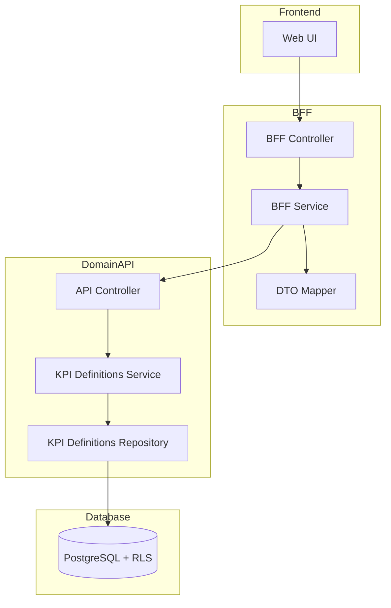
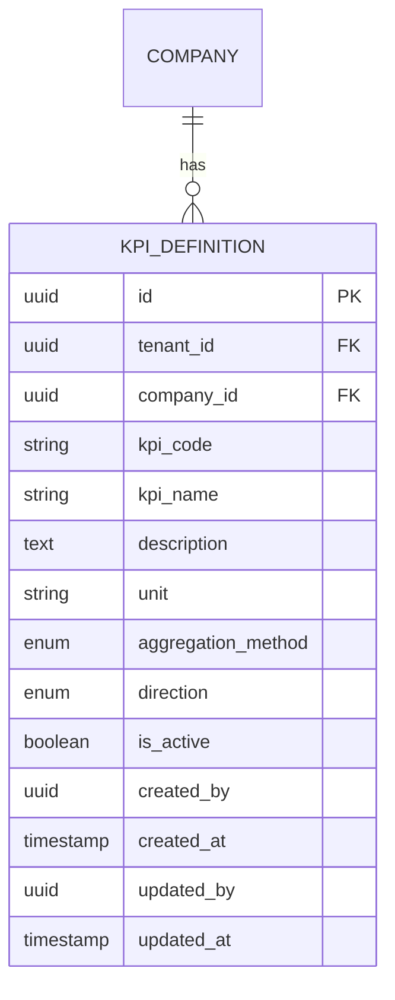

# Technical Design Document

## Feature: master-data/kpi-definitions

---

## Overview

非財務KPI定義マスタは、EPM SaaS における非財務KPI定義（kpi_definitions）の CRUD 管理機能である。CO2削減率、顧客満足度、従業員エンゲージメント等の非財務指標を定義・管理する。

KPI定義は会社別に管理し、集計方法（SUM/EOP/AVG/MAX/MIN）と方向性（higher_is_better/lower_is_better）を属性として持つ。実績値の入力・集計機能は別機能（KPI管理マスタ等）で実装され、本機能は定義・保存のみを責務とする。

マルチテナント環境において tenant_id と company_id による完全なデータ分離を実現し、company_id + kpi_code の複合一意制約によりKPI定義を確実に識別する。物理削除は行わず、is_active フラグによる無効化で運用する。

---

## Architecture

### Architecture Pattern & Boundary Map

**Pattern (fixed)**:
- UI（apps/web） → BFF（apps/bff） → Domain API（apps/api） → DB（PostgreSQL + RLS）
- UI 直 API は禁止



**Contracts (SSoT)**:
- UI ↔ BFF: `packages/contracts/src/bff/kpi-definitions`
- BFF ↔ Domain API: `packages/contracts/src/api/kpi-definitions`（将来実装）
- Enum/Error: `packages/contracts/src/shared/enums`, `packages/contracts/src/shared/errors`
- UI は `packages/contracts/src/api` を参照してはならない

---

## Architecture Responsibilities（Mandatory）

### BFF Specification（apps/bff）

**Purpose**
- UI 要件に最適化した API（Read Model / ViewModel）
- Domain API のレスポンスを集約・変換（ビジネスルールの正本は持たない）

**BFF Endpoints（UI が叩く）**

| Method | Endpoint | Purpose | Request DTO (contracts/bff) | Response DTO (contracts/bff) | Notes |
|--------|----------|---------|-----------------------------|-----------------------------|-------|
| GET | /api/bff/master-data/kpi-definitions | KPI定義一覧取得 | BffListKpiDefinitionsRequest | BffListKpiDefinitionsResponse | 検索・ページング・ソート |
| GET | /api/bff/master-data/kpi-definitions/:id | KPI定義詳細取得 | - | BffKpiDefinitionDetailResponse | UUID パス |
| POST | /api/bff/master-data/kpi-definitions | KPI定義新規登録 | BffCreateKpiDefinitionRequest | BffKpiDefinitionDetailResponse | - |
| PATCH | /api/bff/master-data/kpi-definitions/:id | KPI定義情報更新 | BffUpdateKpiDefinitionRequest | BffKpiDefinitionDetailResponse | 部分更新 |
| POST | /api/bff/master-data/kpi-definitions/:id/deactivate | KPI定義無効化 | - | BffKpiDefinitionDetailResponse | is_active → false |
| POST | /api/bff/master-data/kpi-definitions/:id/reactivate | KPI定義再有効化 | - | BffKpiDefinitionDetailResponse | is_active → true |

**Naming Convention（必須）**
- DTO / Contracts: camelCase（例: `kpiCode`, `kpiName`）
- DB columns: snake_case（例: `kpi_code`, `kpi_name`）
- `sortBy` は **DTO 側キー**を採用する（例: `kpiCode | kpiName | aggregationMethod`）
- DB 列名（snake_case）を UI/BFF へ露出させない

**Paging / Sorting Normalization（必須・BFF 責務）**
- UI/BFF: page / pageSize（page-based, 1-indexed）
- Domain API: offset / limit（DB-friendly, 0-indexed）
- BFF は必ず以下を実施する（省略禁止）：
  - defaults: page=1, pageSize=50, sortBy=kpiCode, sortOrder=asc
  - clamp: pageSize <= 200
  - whitelist: sortBy は許可リストのみ（`kpiCode | kpiName | aggregationMethod`）
  - normalize: keyword trim、空→undefined
  - transform: offset=(page-1)*pageSize, limit=pageSize
- Domain API に渡すのは offset/limit（page/pageSize は渡さない）
- BFF レスポンスには page/pageSize を含める（UI へ返すのは BFF 側の値）

**Transformation Rules（api DTO → bff DTO）**
- field 名は同一（camelCase 維持）
- 日付は ISO 8601 文字列として返却
- totalCount は Domain API から取得し、BFF レスポンスに含める

**Error Policy（必須）**
- この Feature における BFF の Error Policy は以下とする：
  - 採用方針：**Option A: Pass-through**
  - 採用理由：
    - KPI定義マスタは標準的な CRUD 操作であり、特別な UI 整形は不要
    - Domain API のエラーコードは明確で、UI で直接ハンドリング可能
    - ビジネスロジックの正本は Domain API であり、BFF での再分類は不要

**Error Handling（contracts error に準拠）**

| Domain API Error | HTTP Status | BFF Action |
|-----------------|-------------|------------|
| KPI_DEFINITION_NOT_FOUND | 404 | Pass-through |
| KPI_CODE_DUPLICATE | 409 | Pass-through |
| KPI_DEFINITION_ALREADY_INACTIVE | 409 | Pass-through |
| KPI_DEFINITION_ALREADY_ACTIVE | 409 | Pass-through |
| COMPANY_NOT_FOUND | 404 | Pass-through |
| COMPANY_ACCESS_DENIED | 403 | Pass-through |
| COMPANY_NOT_SELECTED | 400 | Pass-through |
| VALIDATION_ERROR | 422 | Pass-through |

---

### Contracts Summary（This Feature）

**BFF Contracts（packages/contracts/src/bff/kpi-definitions）**

```typescript
// Enums
export const AggregationMethod = {
  SUM: 'SUM',       // 合計
  EOP: 'EOP',       // 期末値
  AVG: 'AVG',       // 平均
  MAX: 'MAX',       // 最大値
  MIN: 'MIN',       // 最小値
} as const;
export type AggregationMethod = typeof AggregationMethod[keyof typeof AggregationMethod];

export const Direction = {
  HIGHER_IS_BETTER: 'higher_is_better',  // 高いほど良い
  LOWER_IS_BETTER: 'lower_is_better',    // 低いほど良い
} as const;
export type Direction = typeof Direction[keyof typeof Direction];

// Request DTOs
export interface BffListKpiDefinitionsRequest {
  page?: number;           // default: 1
  pageSize?: number;       // default: 50, max: 200
  sortBy?: 'kpiCode' | 'kpiName' | 'aggregationMethod';
  sortOrder?: 'asc' | 'desc';
  keyword?: string;        // KPIコード・KPI名部分一致
  aggregationMethod?: AggregationMethod;  // 集計方法フィルタ
  isActive?: boolean;      // 有効フラグフィルタ
}

export interface BffCreateKpiDefinitionRequest {
  kpiCode: string;
  kpiName: string;
  description?: string;
  unit?: string;           // 単位（%, 件, pt等）
  aggregationMethod: AggregationMethod;
  direction?: Direction;   // 方向性（null許可）
}

export interface BffUpdateKpiDefinitionRequest {
  kpiCode?: string;
  kpiName?: string;
  description?: string;
  unit?: string;
  aggregationMethod?: AggregationMethod;
  direction?: Direction | null;
}

// Response DTOs
export interface BffKpiDefinitionSummary {
  id: string;
  kpiCode: string;
  kpiName: string;
  unit: string | null;
  aggregationMethod: AggregationMethod;
  direction: Direction | null;
  isActive: boolean;
}

export interface BffListKpiDefinitionsResponse {
  items: BffKpiDefinitionSummary[];
  totalCount: number;
  page: number;
  pageSize: number;
}

export interface BffKpiDefinitionDetailResponse {
  id: string;
  kpiCode: string;
  kpiName: string;
  description: string | null;
  unit: string | null;
  aggregationMethod: AggregationMethod;
  direction: Direction | null;
  isActive: boolean;
  createdAt: string;
  updatedAt: string;
}

// Error Codes
export const KpiDefinitionsErrorCode = {
  KPI_DEFINITION_NOT_FOUND: 'KPI_DEFINITION_NOT_FOUND',
  KPI_CODE_DUPLICATE: 'KPI_CODE_DUPLICATE',
  KPI_DEFINITION_ALREADY_INACTIVE: 'KPI_DEFINITION_ALREADY_INACTIVE',
  KPI_DEFINITION_ALREADY_ACTIVE: 'KPI_DEFINITION_ALREADY_ACTIVE',
  COMPANY_NOT_FOUND: 'COMPANY_NOT_FOUND',
  COMPANY_ACCESS_DENIED: 'COMPANY_ACCESS_DENIED',
  COMPANY_NOT_SELECTED: 'COMPANY_NOT_SELECTED',
  VALIDATION_ERROR: 'VALIDATION_ERROR',
} as const;

export type KpiDefinitionsErrorCode =
  typeof KpiDefinitionsErrorCode[keyof typeof KpiDefinitionsErrorCode];

export interface KpiDefinitionsError {
  code: KpiDefinitionsErrorCode;
  message: string;
  details?: Record<string, unknown>;
}
```

---

## Responsibility Clarification（Mandatory）

本Featureにおける責務境界を以下に明記する。
未記載の責務は実装してはならない。

### UIの責務
- 表示制御（enable/disable / 文言切替）
- フォーム入力制御・UX最適化
- ビジネス判断は禁止

### BFFの責務
- UI入力の正規化（paging / sorting / filtering）
- Domain API DTO ⇄ UI DTO の変換
- ビジネスルールの正本は持たない

### Domain APIの責務（将来実装）
- ビジネスルールの正本
- 権限・状態遷移の最終判断
- 監査ログ・整合性保証

---

## Data Model（エンティティ整合性確認必須）

### Entity Reference
- 参照元: `.kiro/specs/entities/01_各種マスタ.md`

### Entity: KpiDefinition



### エンティティ整合性チェックリスト

| チェック項目 | 確認結果 |
|-------------|---------|
| カラム網羅性 | エンティティ定義の全カラムがDTO/Prismaに反映されている: ✅ |
| 型の一致 | varchar→String, text→String, enum→const 等の型変換が正確: ✅ |
| 制約の反映 | UNIQUE/CHECK制約がPrisma/アプリ検証に反映: ✅ |
| ビジネスルール | エンティティ補足のルールがServiceに反映: ✅ |
| NULL許可 | NULL/NOT NULLがPrisma?/必須に正しく対応: ✅ |

### Prisma Schema（将来実装時）

```prisma
model KpiDefinition {
  id                String    @id @default(uuid())
  tenantId          String    @map("tenant_id")
  companyId         String    @map("company_id")
  kpiCode           String    @map("kpi_code") @db.VarChar(50)
  kpiName           String    @map("kpi_name") @db.VarChar(200)
  description       String?   @map("description") @db.Text
  unit              String?   @map("unit") @db.VarChar(30)
  aggregationMethod String    @map("aggregation_method") @db.VarChar(10)  // 'SUM' | 'EOP' | 'AVG' | 'MAX' | 'MIN'
  direction         String?   @map("direction") @db.VarChar(20)  // 'higher_is_better' | 'lower_is_better'
  isActive          Boolean   @default(true) @map("is_active")
  createdAt         DateTime  @default(now()) @map("created_at") @db.Timestamptz
  updatedAt         DateTime  @updatedAt @map("updated_at") @db.Timestamptz
  createdBy         String?   @map("created_by")
  updatedBy         String?   @map("updated_by")

  // Relations
  company           Company   @relation(fields: [companyId], references: [id])

  @@unique([tenantId, companyId, kpiCode])
  @@unique([tenantId, companyId, id])
  @@index([tenantId, companyId])
  @@index([tenantId, companyId, isActive])
  @@map("kpi_definitions")
}
```

### Constraints（エンティティ定義から転記）
- PK: id（UUID）
- UNIQUE: tenant_id + company_id + kpi_code
- FK: (tenant_id, company_id) → companies(tenant_id, id)

### RLS Policy
```sql
ALTER TABLE kpi_definitions ENABLE ROW LEVEL SECURITY;

CREATE POLICY tenant_isolation ON kpi_definitions
  USING (tenant_id::text = current_setting('app.tenant_id', true));
```

---

## UI Design

### KPI定義一覧画面（KpiDefinitionsListPage）

**レイアウト**
- ヘッダー: タイトル「KPI定義マスタ」、新規登録ボタン、更新ボタン
- 検索フィルタ: キーワード検索、集計方法フィルタ、有効/無効フィルタ
- テーブル: KPIコード、KPI名、単位、集計方法、方向性、有効状態、操作
- ページネーション

**テーブル列**
| 列名 | 幅 | ソート |
|-----|-----|--------|
| KPIコード | 120px | ✅ |
| KPI名 | flex | ✅ |
| 単位 | 80px | - |
| 集計方法 | 100px | ✅ |
| 方向性 | 100px | - |
| 状態 | 80px | - |
| 操作 | 100px | - |

**操作**
- 行クリック: 詳細/編集ダイアログ表示
- 無効化ボタン: 確認ダイアログ後、無効化実行
- 再有効化ボタン: 確認ダイアログ後、再有効化実行

### KPI定義詳細/編集ダイアログ（KpiDefinitionDetailDialog）

**モード**
- 新規登録モード
- 編集モード

**フォームフィールド**
| フィールド | 型 | 必須 | バリデーション |
|-----------|---|------|---------------|
| KPIコード | テキスト | ✅ | 最大50文字、英数字・ハイフン・アンダースコア |
| KPI名 | テキスト | ✅ | 最大200文字 |
| 説明 | テキストエリア | - | 最大1000文字 |
| 単位 | テキスト | - | 最大30文字（例: %, 件, pt） |
| 集計方法 | セレクト | ✅ | SUM/EOP/AVG/MAX/MIN |
| 方向性 | セレクト | - | 高いほど良い/低いほど良い/指定なし |

**ボタン**
- キャンセル: ダイアログを閉じる
- 保存: 登録/更新を実行

---

## Requirements Traceability

| Requirement | Summary | Components | Interfaces | Flows |
|-------------|---------|------------|------------|-------|
| 1.1 | 会社所属KPI定義一覧取得 | Repository.findMany | GET /kpi-definitions | List |
| 1.2 | 検索条件フィルタ | BFF.normalize, Repository | BffListKpiDefinitionsRequest | List |
| 1.3 | ソート機能 | BFF.whitelist | sortBy/sortOrder | List |
| 1.4 | ページネーション | BFF.transform | page/pageSize | List |
| 1.5 | 一覧表示項目 | BffKpiDefinitionSummary | - | List |
| 2.1 | 詳細情報表示 | Repository.findById | GET /:id | Detail |
| 2.2 | 詳細表示項目 | BffKpiDefinitionDetailResponse | - | Detail |
| 2.3 | KPI定義不存在エラー | Service | KPI_DEFINITION_NOT_FOUND | Error |
| 3.1 | 新規登録 | Service.create | POST / | Create |
| 3.2 | 登録後詳細返却 | Controller | BffKpiDefinitionDetailResponse | Create |
| 3.3 | 重複エラー | Service | KPI_CODE_DUPLICATE | Error |
| 3.4 | バリデーションエラー | Service | VALIDATION_ERROR | Error |
| 3.5 | 会社未選択エラー | Service | COMPANY_NOT_SELECTED | Error |
| 3.6 | isActive 初期化 | Service.create | - | Create |
| 3.7 | 監査情報記録 | Repository | created_by/at | Create |
| 4.1 | 情報更新 | Service.update | PATCH /:id | Update |
| 4.2 | 更新後詳細返却 | Controller | BffKpiDefinitionDetailResponse | Update |
| 4.3 | 更新対象不存在 | Service | KPI_DEFINITION_NOT_FOUND | Error |
| 4.4 | コード変更時重複 | Service | KPI_CODE_DUPLICATE | Error |
| 4.5 | 更新監査情報 | Repository | updated_by/at | Update |
| 5.1 | 無効化実行 | Service.deactivate | POST /:id/deactivate | Deactivate |
| 5.2 | 無効化後詳細返却 | Controller | BffKpiDefinitionDetailResponse | Deactivate |
| 5.3 | 対象不存在 | Service | KPI_DEFINITION_NOT_FOUND | Error |
| 5.4 | 既無効化エラー | Service | KPI_DEFINITION_ALREADY_INACTIVE | Error |
| 5.5 | 無効化監査情報 | Repository | updated_by/at | Deactivate |
| 6.1 | 再有効化実行 | Service.reactivate | POST /:id/reactivate | Reactivate |
| 6.2 | 再有効化後詳細返却 | Controller | BffKpiDefinitionDetailResponse | Reactivate |
| 6.3 | 対象不存在 | Service | KPI_DEFINITION_NOT_FOUND | Error |
| 6.4 | 既有効化エラー | Service | KPI_DEFINITION_ALREADY_ACTIVE | Error |
| 6.5 | 再有効化監査情報 | Repository | updated_by/at | Reactivate |
| 7.1 | tenant_id絞り込み | Repository | - | Guard |
| 7.2 | company_id絞り込み | Repository | - | Guard |
| 7.3 | Repository層での必須パラメータ | Repository | tenantId, companyId | Guard |
| 7.4 | RLS double-guard | Repository, RLS | - | Guard |
| 7.5 | 異テナントアクセス拒否 | Service | - | Guard |
| 7.6 | 異会社アクセス拒否 | Service | - | Guard |
| 8.1 | 一意性担保 | Repository, DB | UNIQUE制約 | Constraint |
| 8.2 | 重複エラー | Service | KPI_CODE_DUPLICATE | Error |
| 9.1 | 操作ユーザーID記録 | Repository | created_by/updated_by | Audit |
| 9.2 | 操作日時記録 | Repository | created_at/updated_at | Audit |
| 9.3 | 操作ユーザー記録 | Repository | created_by/updated_by | Audit |

---

## 補足事項

### KPI実績値の入力・集計機能について
- 本機能ではKPI定義・保存のみを責務とする
- KPI実績値の入力・集計機能は別機能（KPI管理マスタ等）で実装される
- 本機能で定義されたKPI定義は、KPI管理マスタ機能から参照される

### 集計方法（aggregation_method）について
- SUM: 期間の合計値（例: 売上高、受注件数）
- EOP: 期末時点の値（例: 従業員数、顧客数）
- AVG: 期間の平均値（例: 顧客満足度、NPS）
- MAX: 期間の最大値
- MIN: 期間の最小値

### 方向性（direction）について
- higher_is_better: 値が高いほど良い（例: 顧客満足度、売上高）
- lower_is_better: 値が低いほど良い（例: CO2排出量、離職率）
- null: 方向性なし/判断不要

### 将来の拡張性
- KPI定義はKPI管理マスタ機能から参照される
- 将来的にESGレポート機能からも参照される可能性あり
