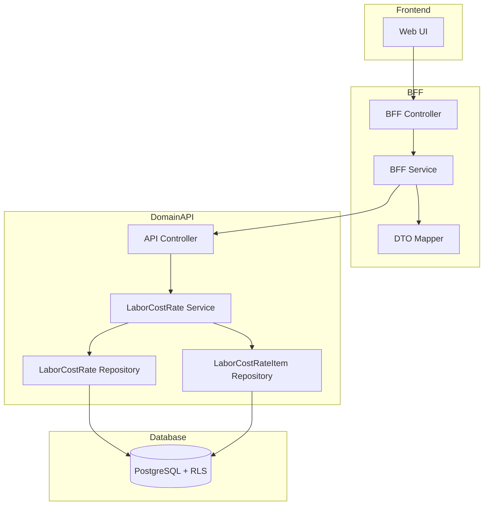
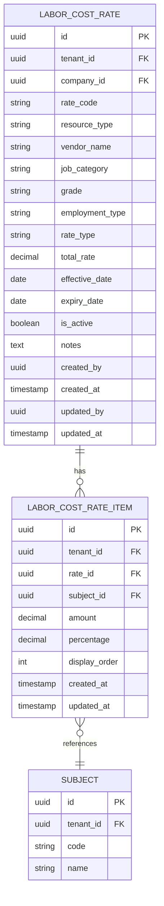

# Technical Design Document

## Feature: master-data/labor-cost-rate

---

## Overview

労務費予算単価マスタは、EPM SaaS における労務費予算算出のための「計画用単価」を管理する CRUD 機能である。

**社員・外注を統一管理**し、職種・等級・雇用区分別の標準単価を登録する。単価は**科目別内訳**を持ち、内訳の合計が人月単価（total_rate）となる。人数計画や工数計画と組み合わせて予算算出に活用する。

本機能の特徴は：
- **社員・外注の統一管理**: resource_type（EMPLOYEE/CONTRACTOR）で区分
- **科目別内訳**: labor_cost_rate_items で科目ごとの金額を管理
- **有効期間管理**: effective_date / expiry_date による時系列管理
- **基準日フィルタ**: asOfDate による有効単価のフィルタリング

単価は会社内で rate_code が一意であり、改定時は新しい rate_code で登録する運用を想定する。金額（total_rate）は Decimal 型で精度を保証し、フォーマット（¥記号・桁区切り・/時・/日）は UI 責務とする。

---

## Architecture

### Architecture Pattern & Boundary Map

**Pattern (fixed)**:
- UI（apps/web） → BFF（apps/bff） → Domain API（apps/api） → DB（PostgreSQL + RLS）
- UI 直 API は禁止



**Contracts (SSoT)**:
- UI ↔ BFF: `packages/contracts/src/bff/labor-cost-rate`
- BFF ↔ Domain API: `packages/contracts/src/api/labor-cost-rate`
- Enum/Error: `packages/contracts/src/api/errors`
- UI は `packages/contracts/src/api` を参照してはならない

---

## Architecture Responsibilities（Mandatory）

### BFF Specification（apps/bff）

**Purpose**
- UI 要件に最適化した API（Read Model / ViewModel）
- Domain API のレスポンスを集約・変換（ビジネスルールの正本は持たない）
- 基準日（asOfDate）のデフォルト設定（当日）
- 科目マスタの取得（科目セレクト用）

**BFF Endpoints（UI が叩く）**

| Method | Endpoint | Purpose | Request DTO (contracts/bff) | Response DTO (contracts/bff) | Notes |
|--------|----------|---------|-----------------------------|-----------------------------|-------|
| GET | /api/bff/master-data/labor-cost-rate | 単価一覧取得 | BffListLaborCostRatesRequest | BffListLaborCostRatesResponse | 検索・ページング・ソート・基準日 |
| GET | /api/bff/master-data/labor-cost-rate/:id | 単価詳細取得 | - | BffLaborCostRateDetailResponse | UUID パス、科目別内訳含む |
| POST | /api/bff/master-data/labor-cost-rate | 単価新規登録 | BffCreateLaborCostRateRequest | BffLaborCostRateDetailResponse | 科目別内訳含む |
| PATCH | /api/bff/master-data/labor-cost-rate/:id | 単価情報更新 | BffUpdateLaborCostRateRequest | BffLaborCostRateDetailResponse | 科目別内訳含む |
| POST | /api/bff/master-data/labor-cost-rate/:id/deactivate | 単価無効化 | - | BffLaborCostRateDetailResponse | is_active → false |
| POST | /api/bff/master-data/labor-cost-rate/:id/reactivate | 単価再有効化 | - | BffLaborCostRateDetailResponse | is_active → true |
| GET | /api/bff/master-data/labor-cost-rate/subjects | 科目マスタ取得 | - | BffSubjectListResponse | 科目セレクト用 |

**Naming Convention（必須）**
- DTO / Contracts: camelCase（例: `rateCode`, `jobCategory`, `totalRate`, `resourceType`）
- DB columns: snake_case（例: `rate_code`, `job_category`, `total_rate`, `resource_type`）
- `sortBy` は **DTO 側キー**を採用する（例: `rateCode | jobCategory | grade | effectiveDate | totalRate`）
- DB 列名（snake_case）を UI/BFF へ露出させない

**Paging / Sorting Normalization（必須・BFF 責務）**
- UI/BFF: page / pageSize（page-based, 1-indexed）
- Domain API: offset / limit（DB-friendly, 0-indexed）
- BFF は必ず以下を実施する（省略禁止）：
  - defaults: page=1, pageSize=20, sortBy=rateCode, sortOrder=asc, asOfDate=当日
  - clamp: pageSize <= 200
  - whitelist: sortBy は許可リストのみ（`rateCode | jobCategory | grade | effectiveDate | totalRate`）
  - normalize: keyword trim、空→undefined
  - transform: offset=(page-1)*pageSize, limit=pageSize
- Domain API に渡すのは offset/limit（page/pageSize は渡さない）
- BFF レスポンスには page/pageSize を含める（UI へ返すのは BFF 側の値）

**asOfDate Handling（基準日フィルタ・BFF 責務）**
- BFF は asOfDate パラメータを受け取る（デフォルト: 当日 = new Date().toISOString().slice(0, 10)）
- Domain API へ asOfDate を渡し、有効期間フィルタを適用
- 将来日付の指定も許可（将来単価の事前確認用）

**Transformation Rules（api DTO → bff DTO）**
- field 名は同一（camelCase 維持）
- 日付は ISO 8601 文字列として返却
- totalRate は **文字列**として返却（Decimal 精度保証）
- 科目別内訳（items）の金額も文字列として返却
- totalCount は Domain API から取得し、BFF レスポンスに含める

**Error Policy（必須）**
- この Feature における BFF の Error Policy は以下とする：
  - 採用方針：**Option A: Pass-through**
  - 採用理由：
    - 労務費予算単価マスタは標準的な CRUD 操作であり、特別な UI 整形は不要
    - Domain API のエラーコードは明確で、UI で直接ハンドリング可能
    - ビジネスロジックの正本は Domain API であり、BFF での再分類は不要

**Error Handling（contracts error に準拠）**
| Domain API Error | HTTP Status | BFF Action |
|-----------------|-------------|------------|
| LABOR_COST_RATE_NOT_FOUND | 404 | Pass-through |
| RATE_CODE_DUPLICATE | 409 | Pass-through |
| LABOR_COST_RATE_ALREADY_INACTIVE | 409 | Pass-through |
| LABOR_COST_RATE_ALREADY_ACTIVE | 409 | Pass-through |
| INVALID_DATE_RANGE | 422 | Pass-through |
| VALIDATION_ERROR | 422 | Pass-through |
| SUBJECT_NOT_FOUND | 404 | Pass-through |
| DUPLICATE_SUBJECT_IN_ITEMS | 422 | Pass-through |
| NO_ITEMS_PROVIDED | 422 | Pass-through |

**Authentication / Tenant Context**
- tenant_id / user_id は認証ミドルウェアで解決し、リクエストコンテキストに付与
- Domain API へは `x-tenant-id` / `x-user-id` ヘッダーで伝搬

---

### Service Specification（Domain / apps/api）

**Purpose**
- ビジネスルールの正本（BFF/UI は禁止）
- Transaction boundary / audit points を必ず明記
- 科目別内訳の整合性管理

**Domain API Endpoints**

| Method | Endpoint | Purpose | Transaction | Audit |
|--------|----------|---------|-------------|-------|
| GET | /api/master-data/labor-cost-rate | 一覧取得 | Read-only | - |
| GET | /api/master-data/labor-cost-rate/:id | 詳細取得 | Read-only | - |
| POST | /api/master-data/labor-cost-rate | 新規登録 | Write（複数：rate + items） | created_by/at |
| PATCH | /api/master-data/labor-cost-rate/:id | 更新 | Write（複数：rate + items） | updated_by/at |
| POST | /api/master-data/labor-cost-rate/:id/deactivate | 無効化 | Write（単一） | updated_by/at |
| POST | /api/master-data/labor-cost-rate/:id/reactivate | 再有効化 | Write（単一） | updated_by/at |
| GET | /api/master-data/subjects | 科目マスタ取得 | Read-only | - |

**Business Rules（Service 責務）**
- 単価コード重複チェック（tenant_id + company_id + rate_code）
- 単価コード文字種制限：半角英数字・ハイフン（-）・アンダースコア（_）のみ許可、大文字小文字区別
- 有効終了日が有効開始日以前の場合はエラー（expiry_date > effective_date）
- 無効化済み単価の再無効化禁止
- 有効単価の再有効化禁止
- 必須項目バリデーション（rateCode, resourceType, jobCategory, rateType, effectiveDate）
- resource_type は 'EMPLOYEE' | 'CONTRACTOR' のみ許可
- rate_type は 'MONTHLY' | 'HOURLY' | 'DAILY' のみ許可
- **科目別内訳ルール**:
  - 最低1件の内訳が必須（0件はエラー）
  - 同一科目の重複禁止（UNIQUE(rate_id, subject_id)）
  - 科目が存在しない場合はエラー
  - 金額は正の数値のみ（負の値禁止）
  - total_rate は内訳の合計として自動計算
  - percentage は金額÷合計として自動計算
- **リソース区分による制御**:
  - resource_type='EMPLOYEE': employment_type 使用可、vendor_name 使用不可
  - resource_type='CONTRACTOR': vendor_name 使用可、employment_type 使用不可

**Effective Date Filter（有効期間フィルタ・Service 責務）**
- asOfDate パラメータを受け取り、以下の条件でフィルタ：
  - `effective_date <= asOfDate AND (expiry_date IS NULL OR expiry_date > asOfDate)`
  - **無効化単価（is_active=false）は基準日フィルタの対象外**（要件2.9）
- asOfDate が未指定の場合はフィルタなし（全件返却）

**Transaction Boundary**
- 単価の作成・更新は単価本体と内訳を**同一トランザクション**で処理
- 内訳の更新は「全削除→再作成」方式（シンプルさ優先）

---

### Repository Specification（apps/api）

**Purpose**
- データアクセス層（Prisma 経由）
- tenant_id による二重ガード

**Repository Methods - LaborCostRate**

| Method | Parameters | Returns | Notes |
|--------|------------|---------|-------|
| findMany | tenantId, companyId, filter, pagination, sort | LaborCostRate[], totalCount | ページング・asOfDate対応、items含む |
| findById | tenantId, id | LaborCostRate \| null | UUID で取得、items含む |
| findByRateCode | tenantId, companyId, rateCode | LaborCostRate \| null | 重複チェック用 |
| create | tenantId, data, items | LaborCostRate | 監査情報含む、items同時作成 |
| update | tenantId, id, data, items | LaborCostRate | 監査情報更新、items全削除→再作成 |

**Repository Methods - LaborCostRateItem**

| Method | Parameters | Returns | Notes |
|--------|------------|---------|-------|
| createMany | tenantId, rateId, items | LaborCostRateItem[] | 一括作成 |
| deleteByRateId | tenantId, rateId | void | 一括削除 |
| findByRateId | tenantId, rateId | LaborCostRateItem[] | 内訳取得 |

**Tenant Guard（必須）**
- 全メソッドの第一引数は tenantId
- where 句に必ず tenant_id 条件を含める
- PrismaService.setTenantContext() を呼び出してから Prisma クエリ実行
- RLS 無効化は禁止

```typescript
// Repository パターン例
async findMany(
  tenantId: string,
  companyId: string,
  filter: LaborCostRateFilter,
  pagination: { offset: number; limit: number },
  sort: { sortBy: string; sortOrder: 'asc' | 'desc' }
): Promise<{ items: LaborCostRate[]; totalCount: number }> {
  await this.prisma.setTenantContext(tenantId);

  const where: Prisma.LaborCostRateWhereInput = {
    tenant_id: tenantId,  // アプリケーションガード
    company_id: companyId,
    ...(filter.keyword && {
      OR: [
        { rate_code: { contains: filter.keyword, mode: 'insensitive' } },
        { job_category: { contains: filter.keyword, mode: 'insensitive' } },
        { vendor_name: { contains: filter.keyword, mode: 'insensitive' } },
      ],
    }),
    ...(filter.resourceType && { resource_type: filter.resourceType }),
    ...(filter.grade && { grade: filter.grade }),
    ...(filter.employmentType && { employment_type: filter.employmentType }),
    ...(filter.rateType && { rate_type: filter.rateType }),
    ...(filter.isActive !== undefined && { is_active: filter.isActive }),
    ...(filter.asOfDate && {
      effective_date: { lte: new Date(filter.asOfDate) },
      OR: [
        { expiry_date: null },
        { expiry_date: { gt: new Date(filter.asOfDate) } },
      ],
      // 無効化単価は基準日フィルタの対象外（要件2.9）
      is_active: true,
    }),
  };

  const [items, totalCount] = await Promise.all([
    this.prisma.laborCostRate.findMany({
      where,
      include: { items: { orderBy: { display_order: 'asc' } } },
      skip: pagination.offset,
      take: pagination.limit,
      orderBy: { [this.mapSortKey(sort.sortBy)]: sort.sortOrder },
    }),
    this.prisma.laborCostRate.count({ where }),
  ]);

  return { items, totalCount };
}
```

---

### Contracts Summary（This Feature）

**BFF Contracts（packages/contracts/src/bff/labor-cost-rate）**

```typescript
// Enums
export type ResourceType = 'EMPLOYEE' | 'CONTRACTOR';
export type RateType = 'MONTHLY' | 'HOURLY' | 'DAILY';

// Request DTOs
export interface BffListLaborCostRatesRequest {
  page?: number;           // default: 1
  pageSize?: number;       // default: 20, max: 200
  sortBy?: 'rateCode' | 'jobCategory' | 'grade' | 'effectiveDate' | 'totalRate';
  sortOrder?: 'asc' | 'desc';
  keyword?: string;        // 単価コード・職種・取引先名部分一致
  resourceType?: ResourceType; // リソース区分フィルタ
  grade?: string;          // 等級フィルタ
  employmentType?: string; // 雇用区分フィルタ
  rateType?: RateType;     // 単価種別フィルタ
  isActive?: boolean;      // 有効フラグフィルタ
  asOfDate?: string;       // 基準日（ISO 8601、default: 当日）
}

export interface BffLaborCostRateItemInput {
  subjectId: string;       // 科目ID（必須）
  amount: string;          // 金額（必須、Decimal文字列）
  displayOrder: number;    // 表示順（必須）
}

export interface BffCreateLaborCostRateRequest {
  rateCode: string;        // 必須、最大50文字
  resourceType: ResourceType; // 必須
  vendorName?: string;     // 外注の場合のみ、最大100文字
  jobCategory: string;     // 必須、最大50文字
  grade?: string;          // 任意、最大50文字
  employmentType?: string; // 社員の場合のみ、最大50文字
  rateType: RateType;      // 必須
  effectiveDate: string;   // 必須、ISO 8601
  expiryDate?: string;     // 任意、ISO 8601（NULL=無期限）
  notes?: string;          // 任意
  items: BffLaborCostRateItemInput[]; // 科目別内訳（必須、1件以上）
}

export interface BffUpdateLaborCostRateRequest {
  rateCode?: string;
  resourceType?: ResourceType;
  vendorName?: string;
  jobCategory?: string;
  grade?: string;
  employmentType?: string;
  rateType?: RateType;
  effectiveDate?: string;
  expiryDate?: string;
  notes?: string;
  items?: BffLaborCostRateItemInput[]; // 指定時は全置換
}

// Response DTOs
export interface BffLaborCostRateItem {
  id: string;
  subjectId: string;
  subjectCode: string;     // 科目コード（表示用）
  subjectName: string;     // 科目名（表示用）
  amount: string;          // Decimal を文字列で返却
  percentage: string;      // 割合（自動計算）
  displayOrder: number;
}

export interface BffLaborCostRateSummary {
  id: string;
  rateCode: string;
  resourceType: ResourceType;
  vendorName: string | null;
  jobCategory: string;
  grade: string | null;
  employmentType: string | null;
  rateType: RateType;
  totalRate: string;       // Decimal を文字列で返却（内訳合計）
  effectiveDate: string;
  expiryDate: string | null;
  isActive: boolean;
}

export interface BffListLaborCostRatesResponse {
  items: BffLaborCostRateSummary[];
  totalCount: number;
  page: number;
  pageSize: number;
}

export interface BffLaborCostRateDetailResponse {
  id: string;
  rateCode: string;
  resourceType: ResourceType;
  vendorName: string | null;
  jobCategory: string;
  grade: string | null;
  employmentType: string | null;
  rateType: RateType;
  totalRate: string;
  effectiveDate: string;
  expiryDate: string | null;
  isActive: boolean;
  notes: string | null;
  items: BffLaborCostRateItem[]; // 科目別内訳
  createdAt: string;
  updatedAt: string;
}

// Subject（科目マスタ）
export interface BffSubject {
  id: string;
  code: string;
  name: string;
}

export interface BffSubjectListResponse {
  items: BffSubject[];
}
```

**API Contracts（packages/contracts/src/api/labor-cost-rate）**

```typescript
// Request DTOs
export interface ApiListLaborCostRatesRequest {
  offset: number;          // 0-indexed
  limit: number;
  sortBy?: string;
  sortOrder?: 'asc' | 'desc';
  keyword?: string;
  resourceType?: 'EMPLOYEE' | 'CONTRACTOR';
  grade?: string;
  employmentType?: string;
  rateType?: 'MONTHLY' | 'HOURLY' | 'DAILY';
  isActive?: boolean;
  asOfDate?: string;       // 基準日
}

export interface ApiLaborCostRateItemInput {
  subjectId: string;
  amount: string;
  displayOrder: number;
}

export interface ApiCreateLaborCostRateRequest {
  rateCode: string;
  resourceType: 'EMPLOYEE' | 'CONTRACTOR';
  vendorName?: string;
  jobCategory: string;
  grade?: string;
  employmentType?: string;
  rateType: 'MONTHLY' | 'HOURLY' | 'DAILY';
  effectiveDate: string;
  expiryDate?: string;
  notes?: string;
  items: ApiLaborCostRateItemInput[];
}

export interface ApiUpdateLaborCostRateRequest {
  rateCode?: string;
  resourceType?: 'EMPLOYEE' | 'CONTRACTOR';
  vendorName?: string;
  jobCategory?: string;
  grade?: string;
  employmentType?: string;
  rateType?: 'MONTHLY' | 'HOURLY' | 'DAILY';
  effectiveDate?: string;
  expiryDate?: string;
  notes?: string;
  items?: ApiLaborCostRateItemInput[];
}

// Response DTOs
export interface ApiLaborCostRateItem {
  id: string;
  subjectId: string;
  subjectCode: string;
  subjectName: string;
  amount: string;
  percentage: string;
  displayOrder: number;
}

export interface ApiLaborCostRateResponse {
  id: string;
  rateCode: string;
  resourceType: 'EMPLOYEE' | 'CONTRACTOR';
  vendorName: string | null;
  jobCategory: string;
  grade: string | null;
  employmentType: string | null;
  rateType: 'MONTHLY' | 'HOURLY' | 'DAILY';
  totalRate: string;
  effectiveDate: string;
  expiryDate: string | null;
  isActive: boolean;
  notes: string | null;
  items: ApiLaborCostRateItem[];
  createdAt: string;
  updatedAt: string;
}

export interface ApiListLaborCostRatesResponse {
  items: ApiLaborCostRateResponse[];
  totalCount: number;
}
```

**Error Contracts（packages/contracts/src/api/errors/labor-cost-rate-error.ts）**

```typescript
export const LaborCostRateErrorCode = {
  LABOR_COST_RATE_NOT_FOUND: 'LABOR_COST_RATE_NOT_FOUND',
  RATE_CODE_DUPLICATE: 'RATE_CODE_DUPLICATE',
  LABOR_COST_RATE_ALREADY_INACTIVE: 'LABOR_COST_RATE_ALREADY_INACTIVE',
  LABOR_COST_RATE_ALREADY_ACTIVE: 'LABOR_COST_RATE_ALREADY_ACTIVE',
  INVALID_DATE_RANGE: 'INVALID_DATE_RANGE',
  VALIDATION_ERROR: 'VALIDATION_ERROR',
  SUBJECT_NOT_FOUND: 'SUBJECT_NOT_FOUND',
  DUPLICATE_SUBJECT_IN_ITEMS: 'DUPLICATE_SUBJECT_IN_ITEMS',
  NO_ITEMS_PROVIDED: 'NO_ITEMS_PROVIDED',
  INVALID_ITEM_AMOUNT: 'INVALID_ITEM_AMOUNT',
} as const;

export type LaborCostRateErrorCode =
  typeof LaborCostRateErrorCode[keyof typeof LaborCostRateErrorCode];

export interface LaborCostRateError {
  code: LaborCostRateErrorCode;
  message: string;
  details?: Record<string, unknown>;
}
```

---

## Responsibility Clarification（Mandatory）

本 Feature における責務境界を以下に明記する。
未記載の責務は実装してはならない。

### UI の責務
- 表示制御（enable/disable / 文言切替）
- フォーム入力制御・UX 最適化
- リソース区分による入力フィールドの動的切替
- 科目別内訳の追加・削除・並び替え UI
- エラーコードに基づく表示切替
- **金額フォーマット処理**：
  - 月額: `¥{totalRate.toLocaleString()}`
  - 時給: `¥{totalRate.toLocaleString()}/時`
  - 日給: `¥{totalRate.toLocaleString()}/日`
- 科目別内訳の合計・割合の表示（サーバー計算値を表示）
- ビジネス判断は禁止

### BFF の責務
- UI 入力の正規化（paging / sorting / filtering）
- page/pageSize → offset/limit 変換
- asOfDate デフォルト設定（当日）
- Domain API DTO ⇄ UI DTO の変換
- sortBy ホワイトリスト検証
- 科目マスタの取得・キャッシュ（必要に応じて）
- ビジネスルールの正本は持たない

### Domain API の責務
- ビジネスルールの正本
- 単価コード重複チェック
- 有効期間整合性チェック（expiry_date > effective_date）
- 無効化/再有効化の状態遷移検証
- 有効期間フィルタリング（asOfDate）
- **科目別内訳の整合性**:
  - 科目存在チェック
  - 同一科目重複チェック
  - 最低1件必須チェック
  - 金額正値チェック
  - total_rate 自動計算
  - percentage 自動計算
- リソース区分による項目整合性チェック
- 監査ログ・整合性保証
- tenant_id による最終ガード

---

## Data Model

### Entity Reference
- 参照元: `.kiro/specs/entities/01_各種マスタ.md` セクション 4.8, 4.9

### エンティティ整合性チェックリスト

| チェック項目 | 確認結果 |
|-------------|---------|
| カラム網羅性 | エンティティ定義の全カラムがDTO/Prismaに反映されている: ✅ |
| 型の一致 | varchar→String, numeric→Decimal 等の型変換が正確: ✅ |
| 制約の反映 | UNIQUE/CHECK制約がPrisma/アプリ検証に反映: ✅ |
| ビジネスルール | エンティティ補足のルールがServiceに反映: ✅ |
| NULL許可 | NULL/NOT NULLがPrisma?/必須に正しく対応: ✅ |

### Entity: LaborCostRate



**Prisma Schema**

```prisma
model LaborCostRate {
  id              String    @id @default(uuid())
  tenantId        String    @map("tenant_id")
  companyId       String    @map("company_id")
  rateCode        String    @map("rate_code") @db.VarChar(50)
  resourceType    String    @map("resource_type") @db.VarChar(20)
  vendorName      String?   @map("vendor_name") @db.VarChar(100)
  jobCategory     String    @map("job_category") @db.VarChar(50)
  grade           String?   @db.VarChar(50)
  employmentType  String?   @map("employment_type") @db.VarChar(50)
  rateType        String    @map("rate_type") @db.VarChar(20)
  totalRate       Decimal   @map("total_rate")
  effectiveDate   DateTime  @map("effective_date") @db.Date
  expiryDate      DateTime? @map("expiry_date") @db.Date
  isActive        Boolean   @default(true) @map("is_active")
  notes           String?   @db.Text
  createdBy       String?   @map("created_by")
  createdAt       DateTime  @default(now()) @map("created_at")
  updatedBy       String?   @map("updated_by")
  updatedAt       DateTime  @updatedAt @map("updated_at")

  items           LaborCostRateItem[]

  @@unique([tenantId, companyId, rateCode])
  @@index([tenantId, companyId])
  @@index([tenantId, isActive])
  @@index([tenantId, companyId, effectiveDate])
  @@index([tenantId, resourceType])
  @@map("labor_cost_rates")
}

model LaborCostRateItem {
  id            String    @id @default(uuid())
  tenantId      String    @map("tenant_id")
  rateId        String    @map("rate_id")
  subjectId     String    @map("subject_id")
  amount        Decimal   @db.Decimal
  percentage    Decimal?  @db.Decimal(5, 2)
  displayOrder  Int       @map("display_order")
  createdAt     DateTime  @default(now()) @map("created_at")
  updatedAt     DateTime  @updatedAt @map("updated_at")

  rate          LaborCostRate @relation(fields: [rateId], references: [id], onDelete: Cascade)
  subject       Subject       @relation(fields: [subjectId], references: [id])

  @@unique([rateId, subjectId])
  @@index([tenantId, rateId])
  @@map("labor_cost_rate_items")
}
```

**Constraints**
- PK: id（UUID）
- labor_cost_rates:
  - Unique: tenant_id + company_id + rate_code
  - Check: resource_type IN ('EMPLOYEE', 'CONTRACTOR')（アプリケーション層で検証）
  - Check: rate_type IN ('MONTHLY', 'HOURLY', 'DAILY')（アプリケーション層で検証）
  - Check: expiry_date IS NULL OR expiry_date > effective_date（アプリケーション層で検証）
- labor_cost_rate_items:
  - Unique: rate_id + subject_id
  - FK: rate_id → labor_cost_rates.id（CASCADE DELETE）
  - FK: subject_id → subjects.id
  - Check: amount > 0（アプリケーション層で検証）

**RLS Policy（PostgreSQL）**

```sql
-- RLS 有効化
ALTER TABLE labor_cost_rates ENABLE ROW LEVEL SECURITY;
ALTER TABLE labor_cost_rate_items ENABLE ROW LEVEL SECURITY;

-- テナント分離ポリシー
CREATE POLICY tenant_isolation ON labor_cost_rates
  USING (tenant_id::text = current_setting('app.tenant_id', true));

CREATE POLICY tenant_isolation ON labor_cost_rate_items
  USING (tenant_id::text = current_setting('app.tenant_id', true));
```

---

## Requirements Traceability

| Requirement | Summary | Components | Interfaces | Flows |
|-------------|---------|------------|------------|-------|
| 1.1 | 単価一覧表示 | Repository.findMany | GET /labor-cost-rate | List |
| 1.2 | 一覧表示項目（resourceType, vendorName, totalRate追加） | BffLaborCostRateSummary | - | List |
| 1.3 | 当日基準日デフォルト | BFF.defaults | asOfDate | List |
| 1.4 | ページネーション | BFF.transform | page/pageSize | List |
| 1.5 | ソート機能 | BFF.whitelist | sortBy/sortOrder | List |
| 2.1 | キーワード検索（取引先名追加） | Repository.findMany | keyword | List |
| 2.2 | リソース区分フィルタ | Repository.findMany | resourceType | List |
| 2.3 | 等級フィルタ | Repository.findMany | grade | List |
| 2.4 | 雇用区分フィルタ | Repository.findMany | employmentType | List |
| 2.5 | 単価種別フィルタ | Repository.findMany | rateType | List |
| 2.6 | 有効フラグフィルタ | Repository.findMany | isActive | List |
| 2.7 | 基準日フィルタ | Service.effectiveDateFilter | asOfDate | List |
| 2.8 | 基準日変更 | UI/BFF | asOfDate | List |
| 2.9 | 無効化単価の基準日除外 | Repository.findMany | is_active | List |
| 3.1 | 新規登録フォーム | UI | POST / | Create |
| 3.2 | 科目別内訳登録 | Service | items | Create |
| 3.3 | 入力値検証 | Service | VALIDATION_ERROR | Create |
| 3.4 | 単価コード重複エラー | Service | RATE_CODE_DUPLICATE | Error |
| 3.5 | 日付整合性エラー | Service | INVALID_DATE_RANGE | Error |
| 3.6 | 登録成功 | Controller | BffLaborCostRateDetailResponse | Create |
| 3.7 | 将来日付登録 | Service | effectiveDate | Create |
| 4.1 | 詳細表示 | Repository.findById | GET /:id | Detail |
| 4.2 | 詳細表示項目（科目別内訳含む） | BffLaborCostRateDetailResponse | - | Detail |
| 4.3 | 詳細から編集遷移 | UI | - | Detail |
| 5.1 | 編集フォーム表示 | UI | - | Update |
| 5.2 | 編集可能項目（科目別内訳含む） | BffUpdateLaborCostRateRequest | - | Update |
| 5.3 | 更新時重複エラー | Service | RATE_CODE_DUPLICATE | Error |
| 5.4 | 更新時日付エラー | Service | INVALID_DATE_RANGE | Error |
| 5.5 | 更新成功 | Controller | BffLaborCostRateDetailResponse | Update |
| 6.1 | 無効化実行 | Service.deactivate | POST /:id/deactivate | Deactivate |
| 6.2 | 再有効化実行 | Service.reactivate | POST /:id/reactivate | Reactivate |
| 6.3 | グレーアウト表示 | UI | isActive | List |
| 6.4 | 論理削除 | Repository.update | is_active | All |
| 7.1 | 複数単価登録 | Service.create | rateCode | Create |
| 7.2 | 単価コード一意性 | Prisma @@unique | - | DB |
| 7.3 | 基準日検索 | Service | asOfDate | List |
| 7.4 | 過去単価参照 | Repository.findMany | - | List |
| 7.5 | 将来単価参照 | Repository.findMany | asOfDate | List |
| 8.1 | 桁区切り表示 | UI | totalRate | Display |
| 8.2 | 月額フォーマット | UI | ¥{amount} | Display |
| 8.3 | 時給フォーマット | UI | ¥{amount}/時 | Display |
| 8.4 | 日給フォーマット | UI | ¥{amount}/日 | Display |
| 8.5 | 入力時数値のみ | UI | amount | Input |
| 9.1 | 科目別内訳追加・編集・削除 | UI | items | Form |
| 9.2 | 内訳入力項目 | BffLaborCostRateItemInput | - | Form |
| 9.3 | 同一科目重複禁止 | Service | DUPLICATE_SUBJECT_IN_ITEMS | Error |
| 9.4 | total_rate自動計算 | Service | totalRate | Create/Update |
| 9.5 | percentage自動計算 | Service | percentage | Create/Update |
| 9.6 | 最低1件必須 | Service | NO_ITEMS_PROVIDED | Error |
| 10.1 | 社員時の入力制御 | UI | resourceType | Form |
| 10.2 | 外注時の入力制御 | UI | resourceType | Form |
| 10.3 | リソース区分変更時クリア | UI | - | Form |

---

## Component Summary

| Component | Domain | Intent | Requirements | Dependencies |
|-----------|--------|--------|--------------|--------------|
| LaborCostRateController (API) | Domain API | REST エンドポイント提供 | All | Service |
| LaborCostRateService | Domain API | ビジネスルール実行 | 3-7, 9, 10 | Repository, ItemRepository |
| LaborCostRateRepository | Domain API | データアクセス | 7, 6 | PrismaService |
| LaborCostRateItemRepository | Domain API | 内訳データアクセス | 9 | PrismaService |
| LaborCostRateController (BFF) | BFF | UI 向けエンドポイント | All | BffService |
| LaborCostRateService (BFF) | BFF | DTO 変換・正規化 | 1, 2, 8 | Mapper, ApiClient |
| LaborCostRateMapper | BFF | DTO 変換 | - | - |

---

## Technology Stack & Alignment

| Layer | Technology | Version | Role |
|-------|------------|---------|------|
| Frontend | Next.js (App Router) | 14.x | UI ホスティング |
| Frontend | React | 18.x | UI コンポーネント |
| Frontend | TypeScript | 5.x | 型安全性 |
| Frontend | TanStack Query | 5.x | Server State 管理 |
| BFF | NestJS | 10.x | BFF フレームワーク |
| Backend | NestJS | 10.x | Domain API フレームワーク |
| Backend | TypeScript | 5.x | 型安全性 |
| Backend | Prisma | 5.x | ORM |
| Database | PostgreSQL | 15.x | RDBMS + RLS |
| Contracts | TypeScript | 5.x | 型定義 SSoT |

---

## Security Considerations

- **マルチテナント分離**: tenant_id による RLS + アプリケーションガード（double-guard）
- **認証**: Clerk 経由で認証済みユーザーのみアクセス可
- **認可**: 本機能では権限チェックは実装対象外（将来拡張）
- **入力検証**:
  - rateCode: 最大50文字、半角英数字・ハイフン（-）・アンダースコア（_）のみ許可、大文字小文字区別
  - resourceType: 'EMPLOYEE' | 'CONTRACTOR' のみ
  - vendorName: 最大100文字（外注の場合のみ）
  - jobCategory: 最大50文字
  - grade: 最大50文字（任意）
  - employmentType: 最大50文字（社員の場合のみ）
  - rateType: 'MONTHLY' | 'HOURLY' | 'DAILY' のみ
  - items[].amount: 正の数値（Decimal）、負の値禁止
  - items[].subjectId: 存在する科目ID
  - effectiveDate: 有効な日付（ISO 8601）
  - expiryDate: effectiveDate より後（任意）

---

## Testing Strategy

| Test Type | Scope | Tools | Coverage Target |
|-----------|-------|-------|-----------------|
| Unit | Service | Jest | ビジネスロジック 100%（科目別内訳計算含む） |
| Unit | Mapper | Jest | 変換ロジック 100% |
| Integration | Repository + DB | Jest + Testcontainers | CRUD + RLS + 有効期間フィルタ + 科目別内訳 |
| E2E | UI → BFF → API → DB | Playwright | 主要シナリオ（リソース区分切替、科目別内訳登録） |

---

## Open Questions / Risks

- **Q1**: company_id の取得方法は？
  - **Decision**: 認証コンテキストから取得（tenant 内で 1 company 前提、将来拡張可能）
- **Q2**: 職種・等級・雇用区分のマスタ化タイミングは？
  - **Decision**: 初期リリースは自由入力、将来マスタ化でセレクト化予定
- **Q3**: 科目マスタの事前登録は必要か？
  - **Decision**: 科目マスタは別機能で管理。本機能は参照のみ。科目が未登録の場合はエラー
- **Risk**: 大量データ（10,000 件超）でのページング性能
  - **Mitigation**: インデックス設計（effective_date, resource_type 含む）、pageSize 上限 200
- **Risk**: 科目別内訳の更新時の整合性
  - **Mitigation**: 「全削除→再作成」方式でシンプルに実装。トランザクションで整合性保証

---

## References

- [research.md](./research.md) — 調査ログ・意思決定詳細
- [requirements.md](./requirements.md) — 要件定義
- `.kiro/specs/entities/01_各種マスタ.md` — エンティティ定義（セクション 4.8, 4.9）
- `.kiro/specs/仕様概要/人員計画登録.md` — 人員計画登録の仕様概要
- `.kiro/steering/tech.md` — 技術憲法
- `.kiro/steering/structure.md` — 構造憲法
