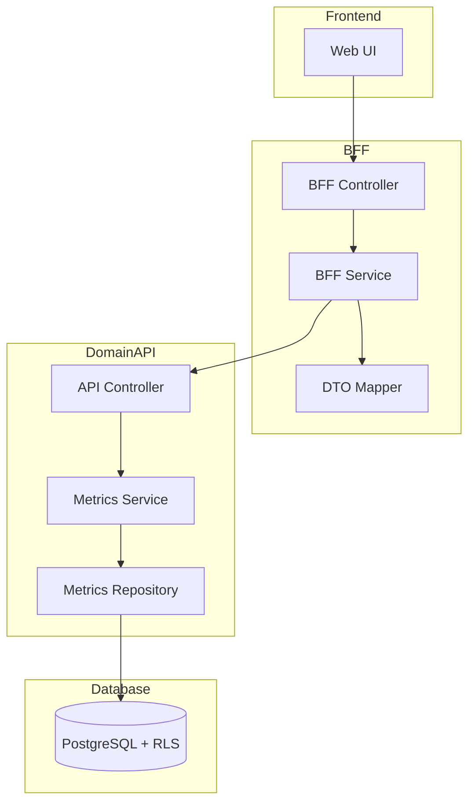
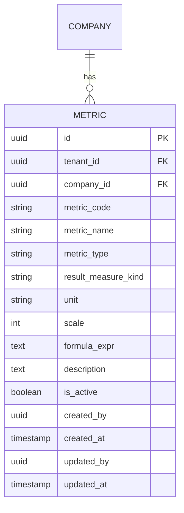

# Technical Design Document

## Feature: master-data/metrics-master

---

## Overview

指標マスタは、EPM SaaS における指標定義（metrics）の CRUD 管理機能である。EBITDA等の例外指標を rollup ではなく metrics（式）として扱えるようにする。

指標は会社別に管理し、formula_expr（式）の構文バリデーションを含む。式の評価・計算機能は別機能（レポート機能等）で実装され、本機能は定義・保存のみを責務とする。

マルチテナント環境において tenant_id と company_id による完全なデータ分離を実現し、company_id + metric_code の複合一意制約により指標を確実に識別する。物理削除は行わず、is_active フラグによる無効化で運用する。

---

## Architecture

### Architecture Pattern & Boundary Map

**Pattern (fixed)**:
- UI（apps/web） → BFF（apps/bff） → Domain API（apps/api） → DB（PostgreSQL + RLS）
- UI 直 API は禁止



**Contracts (SSoT)**:
- UI ↔ BFF: `packages/contracts/src/bff/metrics-master`
- BFF ↔ Domain API: `packages/contracts/src/api/metrics-master`
- Enum/Error: `packages/contracts/src/api/errors`
- UI は `packages/contracts/src/api` を参照してはならない

---

## Architecture Responsibilities（Mandatory）

### BFF Specification（apps/bff）

**Purpose**
- UI 要件に最適化した API（Read Model / ViewModel）
- Domain API のレスポンスを集約・変換（ビジネスルールの正本は持たない）

**BFF Endpoints（UI が叩く）**

| Method | Endpoint | Purpose | Request DTO (contracts/bff) | Response DTO (contracts/bff) | Notes |
|--------|----------|---------|-----------------------------|-----------------------------|-------|
| GET | /api/bff/master-data/metrics-master | 指標一覧取得 | BffListMetricsRequest | BffListMetricsResponse | 検索・ページング・ソート、companyIdはセッションコンテキストから取得 |
| GET | /api/bff/master-data/metrics-master/:id | 指標詳細取得 | - | BffMetricDetailResponse | UUID パス |
| POST | /api/bff/master-data/metrics-master | 指標新規登録 | BffCreateMetricRequest | BffMetricDetailResponse | companyIdはセッションコンテキストから取得 |
| PATCH | /api/bff/master-data/metrics-master/:id | 指標情報更新 | BffUpdateMetricRequest | BffMetricDetailResponse | 部分更新 |
| POST | /api/bff/master-data/metrics-master/:id/deactivate | 指標無効化 | - | BffMetricDetailResponse | is_active → false |
| POST | /api/bff/master-data/metrics-master/:id/reactivate | 指標再有効化 | - | BffMetricDetailResponse | is_active → true |

**Naming Convention（必須）**
- DTO / Contracts: camelCase（例: `metricCode`, `metricName`）
- DB columns: snake_case（例: `metric_code`, `metric_name`）
- `sortBy` は **DTO 側キー**を採用する（例: `metricCode | metricName | metricType`）
- DB 列名（snake_case）を UI/BFF へ露出させない

**Paging / Sorting Normalization（必須・BFF 責務）**
- UI/BFF: page / pageSize（page-based, 1-indexed）
- Domain API: offset / limit（DB-friendly, 0-indexed）
- BFF は必ず以下を実施する（省略禁止）：
  - defaults: page=1, pageSize=50, sortBy=metricCode, sortOrder=asc
  - clamp: pageSize <= 200
  - whitelist: sortBy は許可リストのみ（`metricCode | metricName | metricType`）
  - normalize: keyword trim、空→undefined
  - transform: offset=(page-1)*pageSize, limit=pageSize
- Domain API に渡すのは offset/limit（page/pageSize は渡さない）
- BFF レスポンスには page/pageSize を含める（UI へ返すのは BFF 側の値）

**Transformation Rules（api DTO → bff DTO）**
- field 名は同一（camelCase 維持）
- 日付は ISO 8601 文字列として返却
- totalCount は Domain API から取得し、BFF レスポンスに含める

**Error Policy（必須）**
- この Feature における BFF の Error Policy は以下とする：
  - 採用方針：**Option A: Pass-through**
  - 採用理由：
    - 指標マスタは標準的な CRUD 操作であり、特別な UI 整形は不要
    - Domain API のエラーコードは明確で、UI で直接ハンドリング可能
    - ビジネスロジックの正本は Domain API であり、BFF での再分類は不要

**Error Handling（contracts error に準拠）**

| Domain API Error | HTTP Status | BFF Action |
|-----------------|-------------|------------|
| METRIC_NOT_FOUND | 404 | Pass-through |
| METRIC_CODE_DUPLICATE | 409 | Pass-through |
| METRIC_ALREADY_INACTIVE | 409 | Pass-through |
| METRIC_ALREADY_ACTIVE | 409 | Pass-through |
| COMPANY_NOT_FOUND | 404 | Pass-through |
| COMPANY_ACCESS_DENIED | 403 | Pass-through |
| COMPANY_NOT_SELECTED | 400 | Pass-through |
| FORMULA_SYNTAX_ERROR | 422 | Pass-through |
| SUBJECT_CODE_NOT_FOUND | 422 | Pass-through |
| VALIDATION_ERROR | 422 | Pass-through |

**Authentication / Tenant Context / Company Selection**
- tenant_id / user_id は認証ミドルウェアで解決し、リクエストコンテキストに付与
- Domain API へは `x-tenant-id` / `x-user-id` ヘッダーで伝搬
- **会社選択（ログイン時・セッション管理）**:
  - ログイン時にユーザーの権限情報を取得し、アクセス可能な会社一覧を表示
  - 複数会社へのアクセス権限がある場合: ログイン時に会社選択ドロップダウンを表示（選択必須）
  - 単一会社へのアクセス権限のみの場合: 会社選択UIを表示せず、自動的に当該会社をセッションコンテキストに設定
  - 選択された company_id はセッションコンテキスト（認証トークン/セッションストレージ）に保存
  - 各APIリクエストでは、セッションコンテキストから company_id を取得（リクエストパラメータには含めない）
  - Domain API はセッションコンテキストから取得した company_id を使用し、ユーザーのアクセス権限を確認
  - 権限のない会社へのアクセスを拒否（403 COMPANY_ACCESS_DENIED）
  - セッションコンテキストに company_id が設定されていない場合、エラーを返す（400 COMPANY_NOT_SELECTED）

---

### Service Specification（Domain / apps/api）

**Purpose**
- ビジネスルールの正本（BFF/UI は禁止）
- Transaction boundary / audit points を必ず明記

**Domain API Endpoints**

| Method | Endpoint | Purpose | Transaction | Audit |
|--------|----------|---------|-------------|-------|
| GET | /api/master-data/metrics-master | 一覧取得 | Read-only | - |
| GET | /api/master-data/metrics-master/:id | 詳細取得 | Read-only | - |
| POST | /api/master-data/metrics-master | 新規登録 | Write（単一） | created_by/at |
| PATCH | /api/master-data/metrics-master/:id | 更新 | Write（単一） | updated_by/at |
| POST | /api/master-data/metrics-master/:id/deactivate | 無効化 | Write（単一） | updated_by/at |
| POST | /api/master-data/metrics-master/:id/reactivate | 再有効化 | Write（単一） | updated_by/at |

**Business Rules（Service 責務）**
- セッションコンテキストから company_id を取得（リクエストパラメータからは取得しない）
- セッションコンテキストに company_id が設定されていない場合、エラーを返す（COMPANY_NOT_SELECTED）
- 指標コード重複チェック（tenant_id + company_id + metric_code）
- 無効化済み指標の再無効化禁止
- 有効指標の再有効化禁止
- 必須項目バリデーション（metricCode, metricName, metricType, resultMeasureKind, formulaExpr）
- company_id の存在チェック（companies テーブル参照）
- company_id へのアクセス権限チェック（セッションコンテキストの会社にアクセス権限があるか）
- **式（formula_expr）の構文バリデーション**:
  - SUB()関数の構文チェック（SUB("科目コード")形式）
  - 演算子のチェック（+, -, *, /, 括弧）
  - 括弧の一致チェック
  - 式内で参照されている科目コード（subjects）の存在チェック
  - 式の評価は行わず、構文の妥当性のみを検証

**Transaction Boundary**
- 各操作は単一トランザクションで完結
- 複数エンティティにまたがる操作は本機能スコープ外

---

### Repository Specification（apps/api）

**Purpose**
- データアクセス層（Prisma 経由）
- tenant_id と company_id による二重ガード

**Repository Methods**

| Method | Parameters | Returns | Notes |
|--------|------------|---------|-------|
| findMany | tenantId, companyId, filter, pagination, sort | Metric[], totalCount | ページング対応、companyIdはServiceから取得 |
| findById | tenantId, companyId, id | Metric \| null | UUID で取得、companyIdはServiceから取得 |
| findByCode | tenantId, companyId, metricCode | Metric \| null | 重複チェック用、companyIdはServiceから取得 |
| create | tenantId, companyId, data | Metric | 監査情報含む、companyIdはServiceから取得 |
| update | tenantId, companyId, id, data | Metric | 監査情報更新、companyIdはServiceから取得 |

**Tenant Guard（必須）**
- 全メソッドの第一引数は tenantId
- 全メソッドの第二引数は companyId
- where 句に必ず tenant_id と company_id 条件を含める
- PrismaService.setTenantContext() を呼び出してから Prisma クエリ実行
- RLS 無効化は禁止

```typescript
// Repository パターン例
async findMany(tenantId: string, companyId: string, ...): Promise<Metric[]> {
  await this.prisma.setTenantContext(tenantId);
  return this.prisma.metric.findMany({
    where: {
      tenantId: tenantId,  // アプリケーションガード
      companyId: companyId,
      // ... その他フィルタ
    },
  });
}
```

---

### Contracts Summary（This Feature）

**BFF Contracts（packages/contracts/src/bff/metrics-master）**

```typescript
// Request DTOs
export interface BffListMetricsRequest {
  // companyId はセッションコンテキストから取得（リクエストには含めない）
  page?: number;           // default: 1
  pageSize?: number;        // default: 50, max: 200
  sortBy?: 'metricCode' | 'metricName' | 'metricType';
  sortOrder?: 'asc' | 'desc';
  keyword?: string;        // 指標コード・指標名部分一致
  metricType?: 'FIN_METRIC' | 'KPI_METRIC';  // 指標タイプフィルタ
  isActive?: boolean;      // 有効フラグフィルタ
}

export interface BffCreateMetricRequest {
  // companyId はセッションコンテキストから取得（リクエストには含めない）
  metricCode: string;
  metricName: string;
  metricType: 'FIN_METRIC' | 'KPI_METRIC';
  resultMeasureKind: string;  // 通常は 'AMOUNT'
  unit?: string;
  scale?: number;
  formulaExpr: string;      // 式（例: SUB("OP") + SUB("DA")）
  description?: string;
}

export interface BffUpdateMetricRequest {
  metricCode?: string;
  metricName?: string;
  metricType?: 'FIN_METRIC' | 'KPI_METRIC';
  resultMeasureKind?: string;
  unit?: string;
  scale?: number;
  formulaExpr?: string;
  description?: string;
}

// Response DTOs
export interface BffMetricSummary {
  id: string;
  metricCode: string;
  metricName: string;
  metricType: 'FIN_METRIC' | 'KPI_METRIC';
  unit: string | null;
  isActive: boolean;
}

export interface BffListMetricsResponse {
  items: BffMetricSummary[];
  totalCount: number;
  page: number;
  pageSize: number;
}

export interface BffMetricDetailResponse {
  id: string;
  metricCode: string;
  metricName: string;
  metricType: 'FIN_METRIC' | 'KPI_METRIC';
  resultMeasureKind: string;
  unit: string | null;
  scale: number;
  formulaExpr: string;
  description: string | null;
  isActive: boolean;
  createdAt: string;
  updatedAt: string;
}
```

**API Contracts（packages/contracts/src/api/metrics-master）**

```typescript
// Request DTOs
export interface ApiListMetricsRequest {
  // companyId はセッションコンテキストから取得（リクエストには含めない）
  offset: number;          // 0-indexed
  limit: number;
  sortBy?: string;
  sortOrder?: 'asc' | 'desc';
  keyword?: string;
  metricType?: 'FIN_METRIC' | 'KPI_METRIC';
  isActive?: boolean;
}

export interface ApiCreateMetricRequest {
  // companyId はセッションコンテキストから取得（リクエストには含めない）
  metricCode: string;
  metricName: string;
  metricType: 'FIN_METRIC' | 'KPI_METRIC';
  resultMeasureKind: string;
  unit?: string;
  scale?: number;
  formulaExpr: string;
  description?: string;
}

export interface ApiUpdateMetricRequest {
  metricCode?: string;
  metricName?: string;
  metricType?: 'FIN_METRIC' | 'KPI_METRIC';
  resultMeasureKind?: string;
  unit?: string;
  scale?: number;
  formulaExpr?: string;
  description?: string;
}

// Response DTOs
export interface ApiMetricResponse {
  id: string;
  metricCode: string;
  metricName: string;
  metricType: 'FIN_METRIC' | 'KPI_METRIC';
  resultMeasureKind: string;
  unit: string | null;
  scale: number;
  formulaExpr: string;
  description: string | null;
  isActive: boolean;
  createdAt: string;
  updatedAt: string;
}

export interface ApiListMetricsResponse {
  items: ApiMetricResponse[];
  totalCount: number;
}
```

**Error Contracts（packages/contracts/src/api/errors/metrics-master-error.ts）**

```typescript
export const MetricsMasterErrorCode = {
  METRIC_NOT_FOUND: 'METRIC_NOT_FOUND',
  METRIC_CODE_DUPLICATE: 'METRIC_CODE_DUPLICATE',
  METRIC_ALREADY_INACTIVE: 'METRIC_ALREADY_INACTIVE',
  METRIC_ALREADY_ACTIVE: 'METRIC_ALREADY_ACTIVE',
  COMPANY_NOT_FOUND: 'COMPANY_NOT_FOUND',
  COMPANY_ACCESS_DENIED: 'COMPANY_ACCESS_DENIED',
  COMPANY_NOT_SELECTED: 'COMPANY_NOT_SELECTED',  // セッションコンテキストに会社が設定されていない
  FORMULA_SYNTAX_ERROR: 'FORMULA_SYNTAX_ERROR',    // 式の構文エラー
  SUBJECT_CODE_NOT_FOUND: 'SUBJECT_CODE_NOT_FOUND',  // 式内で参照されている科目コードが存在しない
  VALIDATION_ERROR: 'VALIDATION_ERROR',
} as const;

export type MetricsMasterErrorCode =
  typeof MetricsMasterErrorCode[keyof typeof MetricsMasterErrorCode];

export interface MetricsMasterError {
  code: MetricsMasterErrorCode;
  message: string;
  details?: Record<string, unknown>;
}
```

---

## Responsibility Clarification（Mandatory）

本Featureにおける責務境界を以下に明記する。
未記載の責務は実装してはならない。

### UIの責務
- 表示制御（enable/disable / 文言切替）
- フォーム入力制御・UX最適化
- 式（formula_expr）の入力支援（構文ハイライト等、任意）
- ビジネス判断は禁止
- 式の構文バリデーションは Domain API に委譲（UI側での簡易チェックは可）

### BFFの責務
- UI入力の正規化（paging / sorting / filtering）
- Domain API DTO ⇄ UI DTO の変換
- ビジネスルールの正本は持たない

### Domain APIの責務
- ビジネスルールの正本
- 権限・状態遷移の最終判断
- 監査ログ・整合性保証
- **式（formula_expr）の構文バリデーション**:
  - SUB()関数の構文チェック
  - 演算子・括弧のチェック
  - 参照先科目コード（subjects）の存在チェック

---

## Data Model（エンティティ整合性確認必須）

### Entity Reference
- 参照元: `.kiro/specs/entities/01_各種マスタ.md` セクション 8.1

### Entity: Metric



### エンティティ整合性チェックリスト

| チェック項目 | 確認結果 |
|-------------|---------|
| カラム網羅性 | エンティティ定義の全カラムがDTO/Prismaに反映されている: ✅ |
| 型の一致 | varchar→String, numeric→Decimal, int→Int 等の型変換が正確: ✅ |
| 制約の反映 | UNIQUE/CHECK制約がPrisma/アプリ検証に反映: ✅ |
| ビジネスルール | エンティティ補足のルールがServiceに反映: ✅ |
| NULL許可 | NULL/NOT NULLがPrisma?/必須に正しく対応: ✅ |

### Prisma Schema

```prisma
model Metric {
  id                String    @id @default(uuid())
  tenantId          String    @map("tenant_id")
  companyId         String    @map("company_id")
  metricCode        String    @map("metric_code") @db.VarChar(50)
  metricName        String    @map("metric_name") @db.VarChar(200)
  metricType        String    @map("metric_type") @db.VarChar(20)  // 'FIN_METRIC' | 'KPI_METRIC'
  resultMeasureKind String    @map("result_measure_kind") @db.VarChar(20)  // 通常は 'AMOUNT'
  unit              String?   @map("unit") @db.VarChar(30)
  scale             Int       @default(0)
  formulaExpr       String    @map("formula_expr") @db.Text
  description       String?   @map("description") @db.Text
  isActive          Boolean   @default(true) @map("is_active")
  createdAt         DateTime  @default(now()) @map("created_at") @db.Timestamptz
  updatedAt         DateTime  @updatedAt @map("updated_at") @db.Timestamptz
  createdBy         String?   @map("created_by")
  updatedBy         String?   @map("updated_by")

  // Relations
  // Note: Prisma does not support composite foreign keys directly.
  // The FK constraint (tenant_id, company_id) → companies(tenant_id, id) is enforced
  // at the application layer (Service) and database level (migration).
  // Prisma relation is defined for type safety and navigation only.
  company            Company   @relation(fields: [companyId], references: [id])

  @@unique([tenantId, companyId, metricCode])
  @@unique([tenantId, companyId, id])
  @@index([tenantId, companyId])
  @@index([tenantId, companyId, isActive])
  @@map("metrics")
}
```

### Constraints（エンティティ定義から転記）
- PK: id（UUID）
- UNIQUE: tenant_id + company_id + metric_code
- CHECK: metric_type IN ('FIN_METRIC','KPI_METRIC')（アプリケーション層で検証）
- FK: (tenant_id, company_id) → companies(tenant_id, id)

### RLS Policy
```sql
ALTER TABLE metrics ENABLE ROW LEVEL SECURITY;

CREATE POLICY tenant_isolation ON metrics
  USING (tenant_id::text = current_setting('app.tenant_id', true));
```

---

## Formula Expression（formula_expr）構文仕様

### 構文仕様

**基本形式**
- 式は文字列として保存される
- SUB()関数で科目コードを参照する
- 演算子: +, -, *, /, 括弧 () をサポート

**SUB()関数**
- 形式: `SUB("科目コード")`
- 引数はダブルクォートで囲まれた科目コード（subjects.subject_code）
- 例: `SUB("OP")`, `SUB("DA")`, `SUB("SALES")`

**演算子**
- 加算: `+`
- 減算: `-`
- 乗算: `*`
- 除算: `/`
- 括弧: `()`（優先順位の制御）

**式の例**
- `SUB("OP") + SUB("DA")` - EBITDA計算例
- `SUB("SALES") - SUB("COGS")` - 売上総利益
- `(SUB("OP") + SUB("DA")) / SUB("SALES") * 100` - 複雑な計算

### バリデーションルール

**構文チェック**
1. SUB()関数の構文チェック
   - `SUB("...")` 形式であること
   - 引数がダブルクォートで囲まれていること
   - 括弧の一致チェック
2. 演算子のチェック
   - サポートする演算子（+, -, *, /）のみ使用可能
   - 不正な文字列が含まれていないこと
3. 括弧の一致チェック
   - 開き括弧と閉じ括弧の数が一致すること

**参照先科目コードの存在チェック**
1. 式内のすべての SUB()関数の引数（科目コード）を抽出
2. 各科目コードが subjects テーブルに存在するかチェック
   - tenant_id + company_id + subject_code で検索
   - 存在しない科目コードがある場合、エラーを返す（SUBJECT_CODE_NOT_FOUND）

**バリデーション実装方針**
- Service レイヤーで実装
- 正規表現で SUB()関数を抽出
- subjects テーブルへの問い合わせで存在チェック
- 構文エラーの場合は FORMULA_SYNTAX_ERROR を返す
- 参照先科目コードが存在しない場合は SUBJECT_CODE_NOT_FOUND を返す

---

## Requirements Traceability

| Requirement | Summary | Components | Interfaces | Flows |
|-------------|---------|------------|------------|-------|
| 1.1 | 会社所属指標一覧取得 | Repository.findMany | GET /metrics-master | List |
| 1.2 | 検索条件フィルタ | BFF.normalize, Repository | BffListMetricsRequest | List |
| 1.3 | ソート機能 | BFF.whitelist | sortBy/sortOrder | List |
| 1.4 | ページネーション | BFF.transform | page/pageSize | List |
| 1.5 | 一覧表示項目 | BffMetricSummary | - | List |
| 2.1 | 詳細情報表示 | Repository.findById | GET /:id | Detail |
| 2.2 | 詳細表示項目 | BffMetricDetailResponse | - | Detail |
| 2.3 | 指標不存在エラー | Service | METRIC_NOT_FOUND | Error |
| 3.1 | 新規登録 | Service.create | POST / | Create |
| 3.2 | 登録後詳細返却 | Controller | BffMetricDetailResponse | Create |
| 3.3 | 重複エラー | Service | METRIC_CODE_DUPLICATE | Error |
| 3.4 | バリデーションエラー | Service | VALIDATION_ERROR | Error |
| 3.5 | 会社未選択エラー | Service | COMPANY_NOT_SELECTED | Error |
| 3.6 | 式構文エラー | FormulaValidator | FORMULA_SYNTAX_ERROR | Error |
| 3.7 | 科目コード不存在エラー | FormulaValidator | SUBJECT_CODE_NOT_FOUND | Error |
| 3.8 | isActive 初期化 | Service.create | - | Create |
| 3.9 | 監査情報記録 | Repository | created_by/at | Create |
| 4.1 | 情報更新 | Service.update | PATCH /:id | Update |
| 4.2 | 更新後詳細返却 | Controller | BffMetricDetailResponse | Update |
| 4.3 | 更新対象不存在 | Service | METRIC_NOT_FOUND | Error |
| 4.4 | コード変更時重複 | Service | METRIC_CODE_DUPLICATE | Error |
| 4.5 | 式構文エラー | FormulaValidator | FORMULA_SYNTAX_ERROR | Error |
| 4.6 | 科目コード不存在エラー | FormulaValidator | SUBJECT_CODE_NOT_FOUND | Error |
| 4.7 | 更新監査情報 | Repository | updated_by/at | Update |
| 5.1 | 無効化実行 | Service.deactivate | POST /:id/deactivate | Deactivate |
| 5.2 | 無効化後詳細返却 | Controller | BffMetricDetailResponse | Deactivate |
| 5.3 | 対象不存在 | Service | METRIC_NOT_FOUND | Error |
| 5.4 | 既無効化エラー | Service | METRIC_ALREADY_INACTIVE | Error |
| 5.5 | 無効化監査情報 | Repository | updated_by/at | Deactivate |
| 6.1 | 再有効化実行 | Service.reactivate | POST /:id/reactivate | Reactivate |
| 6.2 | 再有効化後詳細返却 | Controller | BffMetricDetailResponse | Reactivate |
| 6.3 | 対象不存在 | Service | METRIC_NOT_FOUND | Error |
| 6.4 | 既有効化エラー | Service | METRIC_ALREADY_ACTIVE | Error |
| 6.5 | 再有効化監査情報 | Repository | updated_by/at | Reactivate |
| 7.1 | tenant_id絞り込み | Repository | - | Guard |
| 7.2 | company_id絞り込み | Repository | - | Guard |
| 7.3 | Repository層での必須パラメータ | Repository | tenantId, companyId | Guard |
| 7.4 | RLS double-guard | Repository, RLS | - | Guard |
| 7.5 | 異テナントアクセス拒否 | Service | - | Guard |
| 7.6 | 異会社アクセス拒否 | Service | - | Guard |
| 8.1 | 一意性担保 | Repository, DB | UNIQUE制約 | Constraint |
| 8.2 | 重複エラー | Service | METRIC_CODE_DUPLICATE | Error |
| 9.1 | 操作ユーザーID記録 | Repository | created_by/updated_by | Audit |
| 9.2 | 操作日時記録 | Repository | created_at/updated_at | Audit |
| 9.3 | 操作ユーザー記録 | Repository | created_by/updated_by | Audit |
| 10.1 | ログイン時権限情報取得 | AuthenticationService | - | Auth |
| 10.2 | 複数会社権限時の会社選択UI | AuthenticationUI | - | Auth |
| 10.3 | 単一会社権限時の自動設定 | AuthenticationService | - | Auth |
| 10.4 | 会社選択時のセッション保存 | AuthenticationService | - | Auth |
| 10.5 | セッションコンテキストからの会社取得 | MetricsService | - | Auth |
| 10.6 | 権限なし会社選択拒否 | AuthenticationService | COMPANY_ACCESS_DENIED | Auth |
| 10.7 | 会社未選択エラー | MetricsService | COMPANY_NOT_SELECTED | Error |
| 11.1 | 式構文検証 | FormulaValidator | - | Validation |
| 11.2 | 構文不正エラー | FormulaValidator | FORMULA_SYNTAX_ERROR | Error |
| 11.3 | 科目コード不存在エラー | FormulaValidator | SUBJECT_CODE_NOT_FOUND | Error |
| 11.4 | SUB()関数引数検証 | FormulaValidator | - | Validation |
| 11.5 | 演算子・括弧検証 | FormulaValidator | - | Validation |
| 11.6 | 評価は行わず構文のみ検証 | FormulaValidator | - | Validation |

---

## 補足事項

### 式の評価・計算機能について
- 本機能では式の定義・保存のみを責務とする
- 式の評価・計算機能は別機能（レポート機能等）で実装される
- 式の構文バリデーションは本機能で実施するが、実際の計算は行わない

### 科目コード参照について
- formula_expr 内で参照される科目コードは subjects テーブルの subject_code を参照する
- 科目コードの存在チェックは、同一 tenant_id + company_id の範囲で実施する
- 科目コードが存在しない場合、エラーを返すが、式の評価は行わない

### 将来の拡張性
- 指標はレイアウト機能から参照される可能性がある
- 式の構文仕様は将来的に拡張される可能性がある（現時点では SUB()関数と基本演算子のみ）

