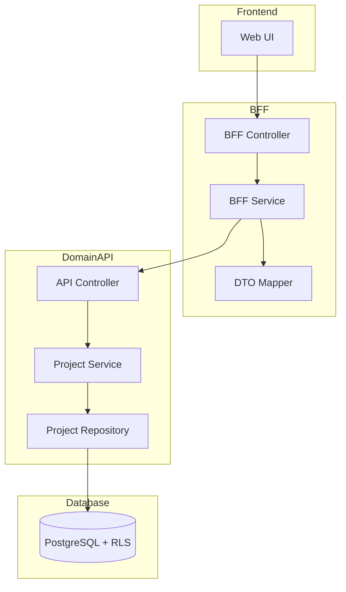
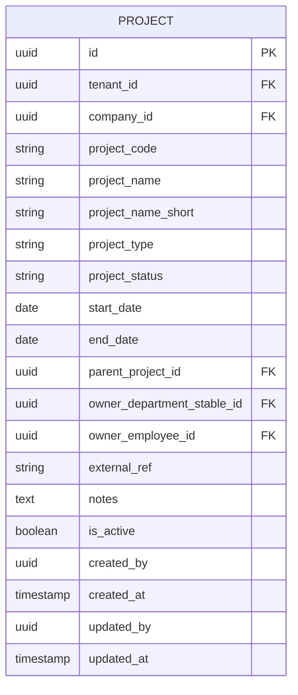

# Technical Design Document

## Feature: master-data/project-master

---

## Overview

プロジェクトマスタは、EPM SaaS における「原価・収益を集計する単位としてのプロジェクト」の基本情報（プロジェクトコード、プロジェクト名、プロジェクト名略称、プロジェクトタイプ、プロジェクトステータス、開始日、終了日、親プロジェクト、責任部門、責任者、外部参照キー、備考、有効フラグ）の CRUD 管理機能である。本機能は将来の project_budgets（プロジェクト別予算）、project_actuals（プロジェクト別実績）、project_members（プロジェクトメンバー）、project_group_mappings（グルーピング）から FK 参照される基盤エンティティとして位置づけられる。

マルチテナント環境において tenant_id による完全なデータ分離を実現し、company_id + project_code の複合一意制約によりプロジェクトを確実に識別する。物理削除は行わず、is_active フラグによる無効化で運用する。

プロジェクトステータス（project_status）は PLANNED / ACTIVE / ON_HOLD / CLOSED の4状態で管理し、is_active（論理削除フラグ）とは独立して運用する。

本設計は社員マスタ（employee-master）と同一のアーキテクチャパターンを採用し、一貫性と保守性を確保する。

---

## Architecture

### Architecture Pattern & Boundary Map

**Pattern (fixed)**:
- UI（apps/web） → BFF（apps/bff） → Domain API（apps/api） → DB（PostgreSQL + RLS）
- UI 直 API は禁止



**Contracts (SSoT)**:
- UI ↔ BFF: `packages/contracts/src/bff/project-master`
- BFF ↔ Domain API: `packages/contracts/src/api/project-master`
- Enum/Error: `packages/contracts/src/api/errors`
- UI は `packages/contracts/src/api` を参照してはならない

---

## Architecture Responsibilities（Mandatory）

### BFF Specification（apps/bff）

**Purpose**
- UI 要件に最適化した API（Read Model / ViewModel）
- Domain API のレスポンスを集約・変換（ビジネスルールの正本は持たない）

**BFF Endpoints（UI が叩く）**

| Method | Endpoint | Purpose | Request DTO (contracts/bff) | Response DTO (contracts/bff) | Notes |
|--------|----------|---------|-----------------------------|-----------------------------|-------|
| GET | /api/bff/master-data/project-master | プロジェクト一覧取得 | BffListProjectsRequest | BffListProjectsResponse | 検索・ページング・ソート |
| GET | /api/bff/master-data/project-master/:id | プロジェクト詳細取得 | - | BffProjectDetailResponse | UUID パス |
| POST | /api/bff/master-data/project-master | プロジェクト新規登録 | BffCreateProjectRequest | BffProjectDetailResponse | - |
| PATCH | /api/bff/master-data/project-master/:id | プロジェクト情報更新 | BffUpdateProjectRequest | BffProjectDetailResponse | 部分更新 |
| POST | /api/bff/master-data/project-master/:id/deactivate | プロジェクト無効化 | - | BffProjectDetailResponse | is_active → false |
| POST | /api/bff/master-data/project-master/:id/reactivate | プロジェクト再有効化 | - | BffProjectDetailResponse | is_active → true |

**Naming Convention（必須）**
- DTO / Contracts: camelCase（例: `projectCode`, `projectName`, `projectStatus`）
- DB columns: snake_case（例: `project_code`, `project_name`, `project_status`）
- `sortBy` は **DTO 側キー**を採用する（例: `projectCode | projectName | projectStatus | startDate | endDate`）
- DB 列名（snake_case）を UI/BFF へ露出させない

**Paging / Sorting Normalization（必須・BFF 責務）**
- UI/BFF: page / pageSize（page-based, 1-indexed）
- Domain API: offset / limit（DB-friendly, 0-indexed）
- BFF は必ず以下を実施する（省略禁止）：
  - defaults: page=1, pageSize=50, sortBy=projectCode, sortOrder=asc
  - clamp: pageSize <= 200
  - whitelist: sortBy は許可リストのみ（`projectCode | projectName | projectStatus | startDate | endDate`）
  - normalize: keyword trim、空→undefined
  - transform: offset=(page-1)*pageSize, limit=pageSize
- Domain API に渡すのは offset/limit（page/pageSize は渡さない）
- BFF レスポンスには page/pageSize を含める（UI へ返すのは BFF 側の値）

**Transformation Rules（api DTO → bff DTO）**
- field 名は同一（camelCase 維持）
- 日付は ISO 8601 文字列として返却
- totalCount は Domain API から取得し、BFF レスポンスに含める

**Error Policy（必須）**
- この Feature における BFF の Error Policy は以下とする：
  - 採用方針：**Option A: Pass-through**
  - 採用理由：
    - プロジェクトマスタは標準的な CRUD 操作であり、特別な UI 整形は不要
    - Domain API のエラーコードは明確で、UI で直接ハンドリング可能
    - ビジネスロジックの正本は Domain API であり、BFF での再分類は不要
    - 社員マスタと同一方針で一貫性を確保

**Error Handling（contracts error に準拠）**
| Domain API Error | HTTP Status | BFF Action |
|-----------------|-------------|------------|
| PROJECT_NOT_FOUND | 404 | Pass-through |
| PROJECT_CODE_DUPLICATE | 409 | Pass-through |
| PROJECT_ALREADY_INACTIVE | 409 | Pass-through |
| PROJECT_ALREADY_ACTIVE | 409 | Pass-through |
| PARENT_PROJECT_NOT_FOUND | 404 | Pass-through |
| INVALID_PARENT_PROJECT | 422 | Pass-through |
| VALIDATION_ERROR | 422 | Pass-through |

**Authentication / Tenant Context**
- tenant_id / user_id は認証ミドルウェアで解決し、リクエストコンテキストに付与
- Domain API へは `x-tenant-id` / `x-user-id` ヘッダーで伝搬

---

### Service Specification（Domain / apps/api）

**Purpose**
- ビジネスルールの正本（BFF/UI は禁止）
- Transaction boundary / audit points を必ず明記

**Domain API Endpoints**

| Method | Endpoint | Purpose | Transaction | Audit |
|--------|----------|---------|-------------|-------|
| GET | /api/master-data/project-master | 一覧取得 | Read-only | - |
| GET | /api/master-data/project-master/:id | 詳細取得 | Read-only | - |
| POST | /api/master-data/project-master | 新規登録 | Write（単一） | created_by/at |
| PATCH | /api/master-data/project-master/:id | 更新 | Write（単一） | updated_by/at |
| POST | /api/master-data/project-master/:id/deactivate | 無効化 | Write（単一） | updated_by/at |
| POST | /api/master-data/project-master/:id/reactivate | 再有効化 | Write（単一） | updated_by/at |

**Business Rules（Service 責務）**
- プロジェクトコード重複チェック（tenant_id + company_id + project_code）
- プロジェクトステータスの許可値チェック（PLANNED / ACTIVE / ON_HOLD / CLOSED）
- 親プロジェクトの存在チェック（同一会社内に限定）
- 自己参照禁止チェック（parent_project_id ≠ id）
- 無効化済みプロジェクトの再無効化禁止
- 有効プロジェクトの再有効化禁止
- 必須項目バリデーション（projectCode, projectName, projectStatus）

**Transaction Boundary**
- 各操作は単一トランザクションで完結
- 複数エンティティにまたがる操作は本機能スコープ外

---

### Repository Specification（apps/api）

**Purpose**
- データアクセス層（Prisma 経由）
- tenant_id による二重ガード

**Repository Methods**

| Method | Parameters | Returns | Notes |
|--------|------------|---------|-------|
| findMany | tenantId, companyId, filter, pagination, sort | Project[], totalCount | ページング対応 |
| findById | tenantId, id | Project \| null | UUID で取得 |
| findByCode | tenantId, companyId, projectCode | Project \| null | 重複チェック用 |
| create | tenantId, data | Project | 監査情報含む |
| update | tenantId, id, data | Project | 監査情報更新 |

**Tenant Guard（必須）**
- 全メソッドの第一引数は tenantId
- where 句に必ず tenant_id 条件を含める
- PrismaService.setTenantContext() を呼び出してから Prisma クエリ実行
- RLS 無効化は禁止

```typescript
// Repository パターン例
async findMany(tenantId: string, companyId: string, ...): Promise<Project[]> {
  await this.prisma.setTenantContext(tenantId);
  return this.prisma.project.findMany({
    where: {
      tenant_id: tenantId,  // アプリケーションガード
      company_id: companyId,
      // ... その他フィルタ
    },
  });
}
```

---

### Contracts Summary（This Feature）

**BFF Contracts（packages/contracts/src/bff/project-master）**

```typescript
// Enums
export const ProjectStatus = {
  PLANNED: 'PLANNED',
  ACTIVE: 'ACTIVE',
  ON_HOLD: 'ON_HOLD',
  CLOSED: 'CLOSED',
} as const;
export type ProjectStatus = typeof ProjectStatus[keyof typeof ProjectStatus];

// Request DTOs
export interface BffListProjectsRequest {
  page?: number;           // default: 1
  pageSize?: number;       // default: 50, max: 200
  sortBy?: 'projectCode' | 'projectName' | 'projectStatus' | 'startDate' | 'endDate';
  sortOrder?: 'asc' | 'desc';
  keyword?: string;        // プロジェクトコード・プロジェクト名部分一致
  projectStatus?: ProjectStatus;  // ステータスフィルタ
  isActive?: boolean;      // 有効フラグフィルタ
}

export interface BffCreateProjectRequest {
  projectCode: string;
  projectName: string;
  projectNameShort?: string;
  projectType?: string;
  projectStatus?: ProjectStatus;  // default: PLANNED
  startDate?: string;      // ISO 8601
  endDate?: string;        // ISO 8601
  parentProjectId?: string;
  ownerDepartmentStableId?: string;
  ownerEmployeeId?: string;
  externalRef?: string;
  notes?: string;
}

export interface BffUpdateProjectRequest {
  projectCode?: string;
  projectName?: string;
  projectNameShort?: string;
  projectType?: string;
  projectStatus?: ProjectStatus;
  startDate?: string;
  endDate?: string;
  parentProjectId?: string | null;  // null で解除
  ownerDepartmentStableId?: string | null;
  ownerEmployeeId?: string | null;
  externalRef?: string;
  notes?: string;
}

// Response DTOs
export interface BffProjectSummary {
  id: string;
  projectCode: string;
  projectName: string;
  projectStatus: ProjectStatus;
  startDate: string | null;
  endDate: string | null;
  isActive: boolean;
}

export interface BffListProjectsResponse {
  items: BffProjectSummary[];
  totalCount: number;
  page: number;
  pageSize: number;
}

export interface BffProjectDetailResponse {
  id: string;
  projectCode: string;
  projectName: string;
  projectNameShort: string | null;
  projectType: string | null;
  projectStatus: ProjectStatus;
  startDate: string | null;
  endDate: string | null;
  parentProjectId: string | null;
  ownerDepartmentStableId: string | null;
  ownerEmployeeId: string | null;
  externalRef: string | null;
  notes: string | null;
  isActive: boolean;
  createdAt: string;
  updatedAt: string;
}
```

**API Contracts（packages/contracts/src/api/project-master）**

```typescript
// Request DTOs
export interface ApiListProjectsRequest {
  offset: number;          // 0-indexed
  limit: number;
  sortBy?: string;
  sortOrder?: 'asc' | 'desc';
  keyword?: string;
  projectStatus?: string;
  isActive?: boolean;
}

export interface ApiCreateProjectRequest {
  projectCode: string;
  projectName: string;
  projectNameShort?: string;
  projectType?: string;
  projectStatus?: string;
  startDate?: string;
  endDate?: string;
  parentProjectId?: string;
  ownerDepartmentStableId?: string;
  ownerEmployeeId?: string;
  externalRef?: string;
  notes?: string;
}

export interface ApiUpdateProjectRequest {
  projectCode?: string;
  projectName?: string;
  projectNameShort?: string;
  projectType?: string;
  projectStatus?: string;
  startDate?: string;
  endDate?: string;
  parentProjectId?: string | null;
  ownerDepartmentStableId?: string | null;
  ownerEmployeeId?: string | null;
  externalRef?: string;
  notes?: string;
}

// Response DTOs
export interface ApiProjectResponse {
  id: string;
  projectCode: string;
  projectName: string;
  projectNameShort: string | null;
  projectType: string | null;
  projectStatus: string;
  startDate: string | null;
  endDate: string | null;
  parentProjectId: string | null;
  ownerDepartmentStableId: string | null;
  ownerEmployeeId: string | null;
  externalRef: string | null;
  notes: string | null;
  isActive: boolean;
  createdAt: string;
  updatedAt: string;
}

export interface ApiListProjectsResponse {
  items: ApiProjectResponse[];
  totalCount: number;
}
```

**Error Contracts（packages/contracts/src/api/errors/project-master-error.ts）**

```typescript
export const ProjectMasterErrorCode = {
  PROJECT_NOT_FOUND: 'PROJECT_NOT_FOUND',
  PROJECT_CODE_DUPLICATE: 'PROJECT_CODE_DUPLICATE',
  PROJECT_ALREADY_INACTIVE: 'PROJECT_ALREADY_INACTIVE',
  PROJECT_ALREADY_ACTIVE: 'PROJECT_ALREADY_ACTIVE',
  PARENT_PROJECT_NOT_FOUND: 'PARENT_PROJECT_NOT_FOUND',
  INVALID_PARENT_PROJECT: 'INVALID_PARENT_PROJECT',
  VALIDATION_ERROR: 'VALIDATION_ERROR',
} as const;

export type ProjectMasterErrorCode =
  typeof ProjectMasterErrorCode[keyof typeof ProjectMasterErrorCode];

export interface ProjectMasterError {
  code: ProjectMasterErrorCode;
  message: string;
  details?: Record<string, unknown>;
}
```

---

## Responsibility Clarification（Mandatory）

本 Feature における責務境界を以下に明記する。
未記載の責務は実装してはならない。

### UI の責務
- 表示制御（enable/disable / 文言切替）
- フォーム入力制御・UX 最適化
- エラーコードに基づく表示切替
- ビジネス判断は禁止

### BFF の責務
- UI 入力の正規化（paging / sorting / filtering）
- page/pageSize → offset/limit 変換
- Domain API DTO ⇄ UI DTO の変換
- sortBy ホワイトリスト検証
- ビジネスルールの正本は持たない

### Domain API の責務
- ビジネスルールの正本
- プロジェクトコード重複チェック
- プロジェクトステータスの許可値チェック
- 親プロジェクトの存在・自己参照チェック
- 無効化/再有効化の状態遷移検証
- 監査ログ・整合性保証
- tenant_id による最終ガード

---

## Data Model

### Entity: Project



**Prisma Schema**

```prisma
model Project {
  id                      String    @id @default(uuid())
  tenantId                String    @map("tenant_id")
  companyId               String    @map("company_id")
  projectCode             String    @map("project_code") @db.VarChar(50)
  projectName             String    @map("project_name") @db.VarChar(200)
  projectNameShort        String?   @map("project_name_short") @db.VarChar(100)
  projectType             String?   @map("project_type") @db.VarChar(30)
  projectStatus           String    @default("PLANNED") @map("project_status") @db.VarChar(20)
  startDate               DateTime? @map("start_date") @db.Date
  endDate                 DateTime? @map("end_date") @db.Date
  parentProjectId         String?   @map("parent_project_id")
  ownerDepartmentStableId String?   @map("owner_department_stable_id")
  ownerEmployeeId         String?   @map("owner_employee_id")
  externalRef             String?   @map("external_ref") @db.VarChar(100)
  notes                   String?   @db.Text
  isActive                Boolean   @default(true) @map("is_active")
  createdBy               String?   @map("created_by")
  createdAt               DateTime  @default(now()) @map("created_at")
  updatedBy               String?   @map("updated_by")
  updatedAt               DateTime  @updatedAt @map("updated_at")

  @@unique([tenantId, companyId, projectCode])
  @@index([tenantId, companyId])
  @@index([tenantId, isActive])
  @@index([tenantId, companyId, projectStatus])
  @@map("projects")
}
```

**Constraints**
- PK: id（UUID）
- Unique: tenant_id + company_id + project_code
- Index: tenant_id + company_id（一覧取得最適化）
- Index: tenant_id + is_active（有効プロジェクトフィルタ最適化）
- Index: tenant_id + company_id + project_status（ステータスフィルタ最適化）
- CHECK: project_status IN ('PLANNED', 'ACTIVE', 'ON_HOLD', 'CLOSED')
- CHECK: end_date IS NULL OR start_date IS NULL OR end_date >= start_date

**RLS Policy（PostgreSQL）**

```sql
-- RLS 有効化
ALTER TABLE projects ENABLE ROW LEVEL SECURITY;

-- テナント分離ポリシー
CREATE POLICY tenant_isolation ON projects
  USING (tenant_id::text = current_setting('app.tenant_id', true));
```

---

## Requirements Traceability

| Requirement | Summary | Components | Interfaces | Flows |
|-------------|---------|------------|------------|-------|
| 1.1 | 会社所属プロジェクト一覧取得 | Repository.findMany | GET /project-master | List |
| 1.2 | 検索条件フィルタ | BFF.normalize, Repository | BffListProjectsRequest | List |
| 1.3 | ソート機能 | BFF.whitelist | sortBy/sortOrder | List |
| 1.4 | ページネーション | BFF.transform | page/pageSize | List |
| 1.5 | 一覧表示項目 | BffProjectSummary | - | List |
| 2.1 | 詳細情報表示 | Repository.findById | GET /:id | Detail |
| 2.2 | 詳細表示項目 | BffProjectDetailResponse | - | Detail |
| 2.3 | プロジェクト不存在エラー | Service | PROJECT_NOT_FOUND | Error |
| 3.1 | 新規登録 | Service.create | POST / | Create |
| 3.2 | 登録後詳細返却 | Controller | BffProjectDetailResponse | Create |
| 3.3 | 重複エラー | Service | PROJECT_CODE_DUPLICATE | Error |
| 3.4 | バリデーションエラー | Service | VALIDATION_ERROR | Error |
| 3.5 | ステータス許可値チェック | Service | VALIDATION_ERROR | Create |
| 3.6 | isActive 初期化 | Service.create | - | Create |
| 3.7 | projectStatus デフォルト | Service.create | - | Create |
| 3.8 | 監査情報記録 | Repository | created_by/at | Create |
| 4.1 | 情報更新 | Service.update | PATCH /:id | Update |
| 4.2 | 更新後詳細返却 | Controller | BffProjectDetailResponse | Update |
| 4.3 | 更新対象不存在 | Service | PROJECT_NOT_FOUND | Error |
| 4.4 | コード変更時重複 | Service | PROJECT_CODE_DUPLICATE | Error |
| 4.5 | ステータス許可値チェック | Service | VALIDATION_ERROR | Update |
| 4.6 | 更新監査情報 | Repository | updated_by/at | Update |
| 5.1 | 無効化実行 | Service.deactivate | POST /:id/deactivate | Deactivate |
| 5.2 | 無効化後詳細返却 | Controller | BffProjectDetailResponse | Deactivate |
| 5.3 | 対象不存在 | Service | PROJECT_NOT_FOUND | Error |
| 5.4 | 既無効化エラー | Service | PROJECT_ALREADY_INACTIVE | Error |
| 5.5 | 無効化監査情報 | Repository | updated_by/at | Deactivate |
| 6.1 | 再有効化実行 | Service.reactivate | POST /:id/reactivate | Reactivate |
| 6.2 | 再有効化後詳細返却 | Controller | BffProjectDetailResponse | Reactivate |
| 6.3 | 対象不存在 | Service | PROJECT_NOT_FOUND | Error |
| 6.4 | 既有効エラー | Service | PROJECT_ALREADY_ACTIVE | Error |
| 6.5 | 再有効化監査情報 | Repository | updated_by/at | Reactivate |
| 7.1 | tenant_id フィルタ | Repository | where tenant_id | All |
| 7.2 | Repository 必須引数 | Repository signature | tenantId first arg | All |
| 7.3 | RLS double-guard | PrismaService.setTenantContext | - | All |
| 7.4 | 異テナントアクセス拒否 | RLS Policy | - | Security |
| 8.1 | 複合一意制約 | Prisma @@unique | - | DB |
| 8.2 | 重複エラー | Service | PROJECT_CODE_DUPLICATE | Error |
| 9.1 | 操作ユーザーID記録 | Repository | created_by/updated_by | Audit |
| 9.2 | 操作日時記録 | Prisma @default(now) | created_at/updated_at | Audit |
| 9.3 | 監査情報自動記録 | Prisma @updatedAt | - | Audit |
| 10.1 | 親プロジェクト設定 | Service | parent_project_id | Hierarchy |
| 10.2 | 親プロジェクト不存在 | Service | PARENT_PROJECT_NOT_FOUND | Error |
| 10.3 | 自己参照禁止 | Service | INVALID_PARENT_PROJECT | Error |
| 10.4 | 同一会社制限 | Service | INVALID_PARENT_PROJECT | Hierarchy |

---

## Component Summary

| Component | Domain | Intent | Requirements | Dependencies |
|-----------|--------|--------|--------------|--------------|
| ProjectMasterController (API) | Domain API | REST エンドポイント提供 | All | Service |
| ProjectMasterService | Domain API | ビジネスルール実行 | 3-10 | Repository |
| ProjectMasterRepository | Domain API | データアクセス | 7, 8, 9 | PrismaService |
| ProjectMasterController (BFF) | BFF | UI 向けエンドポイント | All | BffService |
| ProjectMasterService (BFF) | BFF | DTO 変換・正規化 | 1 | Mapper, ApiClient |
| ProjectMasterMapper | BFF | DTO 変換 | - | - |

---

## Technology Stack & Alignment

| Layer | Technology | Version | Role |
|-------|------------|---------|------|
| Frontend | Next.js (App Router) | 14.x | UI ホスティング |
| Frontend | React | 18.x | UI コンポーネント |
| Frontend | TypeScript | 5.x | 型安全性 |
| Frontend | TanStack Query | 5.x | Server State 管理 |
| BFF | NestJS | 10.x | BFF フレームワーク |
| Backend | NestJS | 10.x | Domain API フレームワーク |
| Backend | TypeScript | 5.x | 型安全性 |
| Backend | Prisma | 5.x | ORM |
| Database | PostgreSQL | 15.x | RDBMS + RLS |
| Contracts | TypeScript | 5.x | 型定義 SSoT |

---

## Security Considerations

- **マルチテナント分離**: tenant_id による RLS + アプリケーションガード（double-guard）
- **認証**: Clerk 経由で認証済みユーザーのみアクセス可
- **認可**: 本機能では権限チェックは実装対象外（将来拡張）
- **入力検証**:
  - projectCode: 最大 50 文字、英数字・ハイフン許可
  - projectName: 最大 200 文字
  - projectNameShort: 最大 100 文字（オプショナル）
  - projectType: 最大 30 文字（オプショナル）
  - projectStatus: PLANNED / ACTIVE / ON_HOLD / CLOSED のみ
  - externalRef: 最大 100 文字（オプショナル）
  - notes: テキスト（オプショナル）

---

## Testing Strategy

| Test Type | Scope | Tools | Coverage Target |
|-----------|-------|-------|-----------------|
| Unit | Service | Jest | ビジネスロジック 100% |
| Unit | Mapper | Jest | 変換ロジック 100% |
| Integration | Repository + DB | Jest + Testcontainers | CRUD + RLS |
| E2E | UI → BFF → API → DB | Playwright | 主要シナリオ |

---

## Open Questions / Risks

- **Q1**: company_id の取得方法は？
  - **Decision**: 認証コンテキストから取得（tenant 内で 1 company 前提、将来拡張可能）
- **Q2**: プロジェクトコードの形式制約は？
  - **Decision**: 英数字・ハイフンのみ、最大 50 文字（運用で柔軟性確保）
- **Q3**: startDate と endDate の前後関係チェックは？
  - **Decision**: DBレベルでCHECK制約として実装
- **Q4**: 責任部門・責任者の参照整合性は？
  - **Decision**: 本機能では参照整合性チェックは行わない（NULL許可のFKとして保持のみ）
- **Risk**: 大量データ（10,000 件超）でのページング性能
  - **Mitigation**: インデックス設計、pageSize 上限 200

---

## References

- [research.md](./research.md) — 調査ログ・意思決定詳細
- [requirements.md](./requirements.md) — 要件定義
- [employee-master/design.md](../employee-master/design.md) — 社員マスタ設計（ベースパターン）
- `.kiro/steering/tech.md` — 技術憲法
- `.kiro/steering/structure.md` — 構造憲法
- `.kiro/specs/entities/01_各種マスタ.md` — エンティティ定義 SSoT
