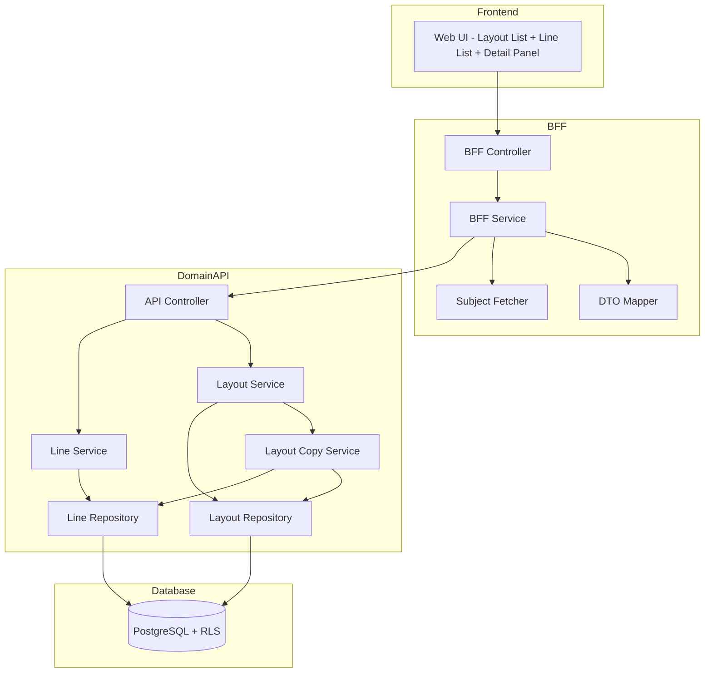
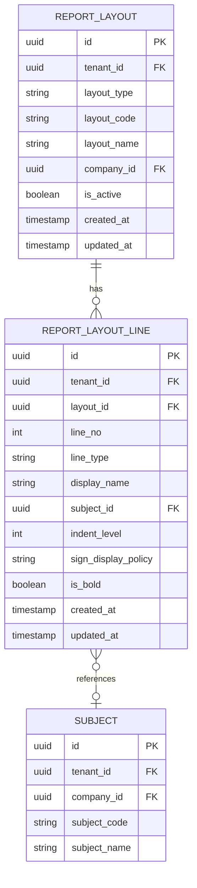

# Technical Design Document

## Feature: master-data/report-layout

---

## Overview

レポートレイアウトマスタは、EPM SaaS における「レイアウトヘッダ（report_layouts）」と「レイアウト行（report_layout_lines）」を管理する機能である。PL（損益計算書）やBS（貸借対照表）、KPI（非財務指標）の表示レイアウトを定義し、見出し・科目行・注記・空白行を組み合わせて経営管理レポートの表示形式をカスタマイズ可能にする。

レイアウトはテナント共通またはテナント内の会社別に定義でき、行の順序変更（ドラッグ＆ドロップ）やインデント調整、太字表示などの表示制御を提供する。財務レイアウト（PL/BS）とKPIレイアウトは区別され、それぞれ適切な科目のみを対象とする。本機能の UI は1画面統合型を採用し、レイアウト一覧選択 → 行リスト表示 → 詳細パネル編集という操作フローを提供する。複数社の権限があるユーザーは、会社選択DDLで会社を選択し、選択された会社のマスタのみを表示・編集可能とする。

---

## Architecture

### Architecture Pattern & Boundary Map

**Pattern (fixed)**:
- UI（apps/web） → BFF（apps/bff） → Domain API（apps/api） → DB（PostgreSQL + RLS）
- UI 直 API は禁止



**Contracts (SSoT)**:
- UI ↔ BFF: `packages/contracts/src/bff/report-layout`
- BFF ↔ Domain API: `packages/contracts/src/api/report-layout`
- Enum/Error: `packages/contracts/src/api/errors`
- UI は `packages/contracts/src/api` を参照してはならない

---

## Architecture Responsibilities（Mandatory）

### BFF Specification（apps/bff）

**Purpose**
- UI 要件に最適化した API（Layout List + Line List + Detail Panel 向け）
- Domain API のレスポンスを UI 向けに変換
- ビジネスルールの正本は持たない

**BFF Endpoints（UI が叩く）**

| Method | Endpoint | Purpose | Request DTO (contracts/bff) | Response DTO (contracts/bff) | Notes |
|--------|----------|---------|-----------------------------|-----------------------------|-------|
| GET | /api/bff/master-data/report-layout/layouts | レイアウト一覧取得 | BffLayoutListRequest | BffLayoutListResponse | フィルタ・ソート対応 |
| GET | /api/bff/master-data/report-layout/layouts/:id | レイアウト詳細取得 | - | BffLayoutDetailResponse | UUID パス |
| POST | /api/bff/master-data/report-layout/layouts | レイアウト新規作成 | BffCreateLayoutRequest | BffLayoutDetailResponse | - |
| PATCH | /api/bff/master-data/report-layout/layouts/:id | レイアウト編集 | BffUpdateLayoutRequest | BffLayoutDetailResponse | 部分更新 |
| POST | /api/bff/master-data/report-layout/layouts/:id/deactivate | レイアウト無効化 | - | BffLayoutDetailResponse | is_active → false |
| POST | /api/bff/master-data/report-layout/layouts/:id/reactivate | レイアウト再有効化 | - | BffLayoutDetailResponse | is_active → true |
| POST | /api/bff/master-data/report-layout/layouts/:id/copy | レイアウト複製 | BffCopyLayoutRequest | BffLayoutDetailResponse | 行も全コピー |
| GET | /api/bff/master-data/report-layout/layouts/:layoutId/lines | 行一覧取得 | - | BffLineListResponse | line_no順 |
| GET | /api/bff/master-data/report-layout/lines/:id | 行詳細取得 | - | BffLineDetailResponse | UUID パス |
| POST | /api/bff/master-data/report-layout/layouts/:layoutId/lines | 行追加 | BffCreateLineRequest | BffLineDetailResponse | line_no自動採番 |
| PATCH | /api/bff/master-data/report-layout/lines/:id | 行編集 | BffUpdateLineRequest | BffLineDetailResponse | 部分更新 |
| DELETE | /api/bff/master-data/report-layout/lines/:id | 行削除 | - | - | 物理削除 |
| POST | /api/bff/master-data/report-layout/lines/:id/move | 行移動（D&D） | BffMoveLineRequest | BffLineListResponse | line_no更新 |
| GET | /api/bff/master-data/report-layout/subjects | 科目検索 | BffSubjectSearchRequest | BffSubjectSearchResponse | 科目選択補助 |

**Naming Convention（必須）**
- DTO / Contracts: camelCase（例: `layoutCode`, `layoutName`, `lineNo`）
- DB columns: snake_case（例: `layout_code`, `layout_name`, `line_no`）
- DB 列名（snake_case）を UI/BFF へ露出させない

**Paging / Sorting Normalization（必須・BFF責務）**
- UI/BFF: page / pageSize（page-based）
- Domain API: offset / limit（DB-friendly）
- BFFは必ず以下を実施する（省略禁止）：
  - defaults: page=1, pageSize=50, sortBy=layoutCode, sortOrder=asc
  - clamp: pageSize <= 200
  - whitelist: sortBy は許可リストのみ
  - normalize: keyword trim、空→undefined
  - transform: offset=(page-1)*pageSize, limit=pageSize
- Domain APIに渡すのは offset/limit

**Filter Normalization（BFF 責務）**
- keyword: trim、空→undefined
- layoutType: 'PL' | 'BS' | 'KPI' | undefined
- isActive: boolean | undefined

**sortBy Whitelist（BFF 責務）**
- layouts: layoutCode（default）, layoutName, layoutType
- lines: lineNo（default）

**Transformation Rules（api DTO → bff DTO）**
- レイアウト一覧: lineCount（行数）を集計して付与
- 科目検索: subjects + subject_fin_attrs を結合し、科目名・コード・クラスを返却

**Error Policy（必須）**
- 採用方針：**Option A: Pass-through**
- 採用理由：
  - Domain API のエラーコードは明確で、UI で直接ハンドリング可能
  - 重複チェック等のビジネスロジック正本は Domain API

**Error Handling（contracts error に準拠）**

| Domain API Error | HTTP Status | BFF Action |
|-----------------|-------------|------------|
| LAYOUT_NOT_FOUND | 404 | Pass-through |
| LAYOUT_CODE_DUPLICATE | 409 | Pass-through |
| LAYOUT_ALREADY_INACTIVE | 409 | Pass-through |
| LAYOUT_ALREADY_ACTIVE | 409 | Pass-through |
| LINE_NOT_FOUND | 404 | Pass-through |
| SUBJECT_REQUIRED_FOR_ACCOUNT | 422 | Pass-through |
| SUBJECT_NOT_FOUND | 404 | Pass-through |
| SUBJECT_INACTIVE | 422 | Pass-through |
| SUBJECT_TYPE_MISMATCH | 422 | Pass-through |
| VALIDATION_ERROR | 422 | Pass-through |

**Authentication / Tenant Context**
- tenant_id / user_id は認証ミドルウェアで解決し、リクエストコンテキストに付与
- Domain API へは `x-tenant-id` / `x-user-id` ヘッダーで伝搬

---

### Service Specification（Domain / apps/api）

**Purpose**
- ビジネスルールの正本（BFF/UI は禁止）
- Transaction boundary / audit points を必ず明記

**Domain API Endpoints - Layouts**

| Method | Endpoint | Purpose | Transaction | Audit |
|--------|----------|---------|-------------|-------|
| GET | /api/master-data/report-layout/layouts | 一覧取得 | Read-only | - |
| GET | /api/master-data/report-layout/layouts/:id | 詳細取得 | Read-only | - |
| POST | /api/master-data/report-layout/layouts | 新規登録 | Write（単一） | created_at |
| PATCH | /api/master-data/report-layout/layouts/:id | 更新 | Write（単一） | updated_at |
| POST | /api/master-data/report-layout/layouts/:id/deactivate | 無効化 | Write（単一） | updated_at |
| POST | /api/master-data/report-layout/layouts/:id/reactivate | 再有効化 | Write（単一） | updated_at |
| POST | /api/master-data/report-layout/layouts/:id/copy | 複製 | Write（複数） | created_at |

**Domain API Endpoints - Lines**

| Method | Endpoint | Purpose | Transaction | Audit |
|--------|----------|---------|-------------|-------|
| GET | /api/master-data/report-layout/layouts/:layoutId/lines | 一覧取得 | Read-only | - |
| GET | /api/master-data/report-layout/lines/:id | 詳細取得 | Read-only | - |
| POST | /api/master-data/report-layout/layouts/:layoutId/lines | 新規登録 | Write（単一） | created_at |
| PATCH | /api/master-data/report-layout/lines/:id | 更新 | Write（単一） | updated_at |
| DELETE | /api/master-data/report-layout/lines/:id | 削除 | Write（単一） | - |
| POST | /api/master-data/report-layout/lines/:id/move | 移動（D&D） | Write（複数） | updated_at |

**Domain API Endpoints - Subjects（科目検索）**

| Method | Endpoint | Purpose | Transaction | Audit |
|--------|----------|---------|-------------|-------|
| GET | /api/master-data/report-layout/subjects | 科目検索 | Read-only | - |

**Business Rules（Service 責務）**

*Layout Service*
- レイアウトコード重複チェック（tenant_id + layout_type + layout_code）
- 無効化済みレイアウトの再無効化禁止
- 有効レイアウトの再有効化禁止
- is_active 初期値 true
- company_id は変更不可（会社選択DDLで制御するため）
- layout_type 変更時の行削除処理：種別変更リクエストを受けた場合、レイアウトに属するすべての行を削除してから種別を更新する（単一トランザクション）

*Line Service*
- line_type に応じた必須項目検証
  - header: display_name 必須
  - account: subject_id 必須、display_name は手動入力可能（レイアウトマスタ用に設定可能）
  - note: display_name 必須
  - blank: 追加項目不要
- account行の科目変更時の整合性チェック
  - 選択された科目が有効（is_active=true）であることをチェック（無効な場合はエラー）
  - 選択された科目がレイアウト種別と整合性があることをチェック
    - 財務レイアウト（PL/BS）: subject_type='FIN' かつ subject_fin_attrsが存在 かつ fin_stmt_class = layout_type
    - KPIレイアウト: subject_type='KPI'
- line_no 自動採番（既存最大値 + 10）
- indent_level 範囲検証（0〜5）
- sign_display_policy 値検証（auto/force_plus/force_minus）
- 削除後の line_no ギャップは許容（再採番しない）

*Layout Copy Service*
- 新レイアウト作成 + 全行コピー（単一トランザクション）
- 新しい layout_id / line_id を発行
- subject_id は引き継ぐ（科目マスタへの参照）

*Subject Search Service*
- レイアウト種別に応じた科目フィルタリング
  - 財務レイアウト（PL/BS）: subject_type='FIN' かつ subject_fin_attrsが存在 かつ fin_stmt_class = layout_type
  - KPIレイアウト: subject_type='KPI'
- 選択された会社（company_id）の科目のみを対象とする
- is_active = true の科目のみ
- キーワード検索（subject_code, subject_name 部分一致）
- ページネーション対応

**Line Move Algorithm**

```typescript
// 行移動時の line_no 再計算
async moveLine(
  lineId: string,
  targetLineNo: number,
  allLines: LayoutLine[]
): Promise<LayoutLine[]> {
  const movingLine = allLines.find(l => l.id === lineId);
  if (!movingLine) throw new Error('LINE_NOT_FOUND');

  const currentLineNo = movingLine.lineNo;
  if (currentLineNo === targetLineNo) return allLines; // 移動なし

  // 移動方向に応じて影響を受ける行を更新
  const updatedLines = allLines.map(line => {
    if (line.id === lineId) {
      return { ...line, lineNo: targetLineNo };
    }
    if (currentLineNo < targetLineNo) {
      // 下方向への移動: 間の行を上にずらす
      if (line.lineNo > currentLineNo && line.lineNo <= targetLineNo) {
        return { ...line, lineNo: line.lineNo - 10 };
      }
    } else {
      // 上方向への移動: 間の行を下にずらす
      if (line.lineNo >= targetLineNo && line.lineNo < currentLineNo) {
        return { ...line, lineNo: line.lineNo + 10 };
      }
    }
    return line;
  });

  return updatedLines.sort((a, b) => a.lineNo - b.lineNo);
}
```

**Transaction Boundary**
- レイアウト CRUD: 単一トランザクション
- レイアウト種別変更: レイアウト更新 + 全行削除を単一トランザクション
- レイアウト複製: レイアウト作成 + 全行コピーを単一トランザクション
- 行 CRUD: 単一トランザクション
- 行移動（D&D）: 影響を受ける全行の line_no 更新を単一トランザクション

---

### Repository Specification（apps/api）

**Purpose**
- データアクセス層（Prisma 経由）
- tenant_id による二重ガード

**Layout Repository Methods**

| Method | Parameters | Returns | Notes |
|--------|------------|---------|-------|
| findMany | tenantId, filter, pagination | ReportLayout[] | フィルタ・ページング対応 |
| count | tenantId, filter | number | 総件数 |
| findById | tenantId, id | ReportLayout \| null | UUID で取得 |
| findByCode | tenantId, layoutType, layoutCode | ReportLayout \| null | 重複チェック用 |
| create | tenantId, data | ReportLayout | - |
| update | tenantId, id, data | ReportLayout | - |

**Line Repository Methods**

| Method | Parameters | Returns | Notes |
|--------|------------|---------|-------|
| findByLayout | tenantId, layoutId | ReportLayoutLine[] | line_no順 |
| findById | tenantId, id | ReportLayoutLine \| null | UUID で取得 |
| create | tenantId, data | ReportLayoutLine | - |
| createMany | tenantId, data[] | ReportLayoutLine[] | 複製時バルク作成 |
| update | tenantId, id, data | ReportLayoutLine | - |
| updateMany | tenantId, updates[] | ReportLayoutLine[] | 移動時バルク更新 |
| delete | tenantId, id | void | 物理削除 |
| deleteByLayout | tenantId, layoutId | void | レイアウト種別変更時の全行削除 |
| getMaxLineNo | tenantId, layoutId | number | 最大 line_no 取得 |

**Tenant Guard（必須）**
- 全メソッドの第一引数は tenantId
- where 句に必ず tenant_id 条件を含める
- PrismaService.setTenantContext() を呼び出してから Prisma クエリ実行
- RLS 無効化は禁止

---

### Contracts Summary（This Feature）

**BFF Contracts（packages/contracts/src/bff/report-layout）**

```typescript
// === Layout DTOs ===

export type LayoutType = 'PL' | 'BS' | 'KPI';
export type LineType = 'header' | 'account' | 'note' | 'blank';
export type SignDisplayPolicy = 'auto' | 'force_plus' | 'force_minus';

export interface BffLayoutListRequest {
  page?: number;
  pageSize?: number;
  sortBy?: 'layoutCode' | 'layoutName' | 'layoutType';
  sortOrder?: 'asc' | 'desc';
  keyword?: string;
  layoutType?: LayoutType;
  isActive?: boolean;
}

export interface BffCreateLayoutRequest {
  layoutCode: string;
  layoutName: string;
  layoutType: LayoutType;
  companyId?: string;
}

export interface BffCopyLayoutRequest {
  layoutCode: string;
  layoutName: string;
}

export interface BffUpdateLayoutRequest {
  layoutCode?: string;
  layoutName?: string;
  layoutType?: LayoutType;  // 種別変更時は既存の行がすべて削除される（UI側で事前警告必須）
  companyId?: string;
}

export interface BffLayoutSummary {
  id: string;
  layoutCode: string;
  layoutName: string;
  layoutType: LayoutType;
  companyId: string | null;
  companyName: string | null;
  isActive: boolean;
  lineCount: number;
}

export interface BffLayoutListResponse {
  items: BffLayoutSummary[];
  page: number;
  pageSize: number;
  totalCount: number;
  totalPages: number;
}

export interface BffLayoutDetailResponse {
  id: string;
  layoutCode: string;
  layoutName: string;
  layoutType: LayoutType;
  companyId: string | null;
  companyName: string | null;
  isActive: boolean;
  createdAt: string;
  updatedAt: string;
}

// === Line DTOs ===

export interface BffCreateLineRequest {
  lineType: LineType;
  displayName?: string;
  subjectId?: string;
  indentLevel?: number;
  signDisplayPolicy?: SignDisplayPolicy;
  isBold?: boolean;
}

export interface BffUpdateLineRequest {
  displayName?: string;
  subjectId?: string;
  indentLevel?: number;
  signDisplayPolicy?: SignDisplayPolicy;
  isBold?: boolean;
}

export interface BffMoveLineRequest {
  targetLineNo: number;
}

export interface BffLineSummary {
  id: string;
  lineNo: number;
  lineType: LineType;
  displayName: string | null;
  subjectId: string | null;
  subjectCode: string | null;
  subjectName: string | null;
  indentLevel: number;
  signDisplayPolicy: SignDisplayPolicy | null;
  isBold: boolean;
}

export interface BffLineListResponse {
  layoutId: string;
  layoutCode: string;
  items: BffLineSummary[];
}

export interface BffLineDetailResponse {
  id: string;
  layoutId: string;
  lineNo: number;
  lineType: LineType;
  displayName: string | null;
  subjectId: string | null;
  subjectCode: string | null;
  subjectName: string | null;
  indentLevel: number;
  signDisplayPolicy: SignDisplayPolicy | null;
  isBold: boolean;
  createdAt: string;
  updatedAt: string;
}

// === Subject Search DTOs ===

export interface BffSubjectSearchRequest {
  layoutType: LayoutType;  // PL/BS/KPI
  companyId: string;  // 選択された会社の科目のみを対象とする
  keyword?: string;
  page?: number;
  pageSize?: number;
}

export interface BffSubjectSummary {
  id: string;
  subjectCode: string;
  subjectName: string;
  subjectClass: 'BASE' | 'AGGREGATE';
}

export interface BffSubjectSearchResponse {
  items: BffSubjectSummary[];
  page: number;
  pageSize: number;
  totalCount: number;
  totalPages: number;
}
```

**API Contracts（packages/contracts/src/api/report-layout）**

```typescript
// === Layout DTOs ===

export interface ApiListLayoutsRequest {
  offset?: number;
  limit?: number;
  sortBy?: 'layout_code' | 'layout_name' | 'layout_type';
  sortOrder?: 'asc' | 'desc';
  keyword?: string;
  layoutType?: 'PL' | 'BS' | 'KPI';
  isActive?: boolean;
}

export interface ApiCreateLayoutRequest {
  layoutCode: string;
  layoutName: string;
  layoutType: 'PL' | 'BS' | 'KPI';
  companyId?: string;
}

export interface ApiCopyLayoutRequest {
  layoutCode: string;
  layoutName: string;
}

export interface ApiUpdateLayoutRequest {
  layoutCode?: string;
  layoutName?: string;
  layoutType?: 'PL' | 'BS' | 'KPI';  // 種別変更時は既存の行がすべて削除される（UI側で事前警告必須）
  companyId?: string;  // 変更不可（会社選択DDLで制御するため）
}

export interface ApiLayoutResponse {
  id: string;
  layoutCode: string;
  layoutName: string;
  layoutType: string;
  companyId: string | null;
  isActive: boolean;
  createdAt: string;
  updatedAt: string;
}

export interface ApiListLayoutsResponse {
  items: ApiLayoutResponse[];
  total: number;
}

// === Line DTOs ===

export interface ApiCreateLineRequest {
  lineType: 'header' | 'account' | 'note' | 'blank';
  displayName?: string;
  subjectId?: string;
  indentLevel?: number;
  signDisplayPolicy?: 'auto' | 'force_plus' | 'force_minus';
  isBold?: boolean;
}

export interface ApiUpdateLineRequest {
  displayName?: string;
  subjectId?: string;
  indentLevel?: number;
  signDisplayPolicy?: 'auto' | 'force_plus' | 'force_minus';
  isBold?: boolean;
}

export interface ApiMoveLineRequest {
  targetLineNo: number;
}

export interface ApiLineResponse {
  id: string;
  layoutId: string;
  lineNo: number;
  lineType: string;
  displayName: string | null;
  subjectId: string | null;
  indentLevel: number;
  signDisplayPolicy: string | null;
  isBold: boolean;
  createdAt: string;
  updatedAt: string;
}

export interface ApiListLinesResponse {
  items: ApiLineResponse[];
}

// === Subject Search DTOs ===

export interface ApiSearchSubjectsRequest {
  layoutType: 'PL' | 'BS' | 'KPI';
  companyId: string;  // 選択された会社の科目のみを対象とする
  keyword?: string;
  offset?: number;
  limit?: number;
}

export interface ApiSubjectResponse {
  id: string;
  subjectCode: string;
  subjectName: string;
  subjectClass: string;
}

export interface ApiSearchSubjectsResponse {
  items: ApiSubjectResponse[];
  total: number;
}
```

**Error Contracts（packages/contracts/src/api/errors/report-layout-error.ts）**

```typescript
export const ReportLayoutErrorCode = {
  LAYOUT_NOT_FOUND: 'LAYOUT_NOT_FOUND',
  LAYOUT_CODE_DUPLICATE: 'LAYOUT_CODE_DUPLICATE',
  LAYOUT_ALREADY_INACTIVE: 'LAYOUT_ALREADY_INACTIVE',
  LAYOUT_ALREADY_ACTIVE: 'LAYOUT_ALREADY_ACTIVE',
  LINE_NOT_FOUND: 'LINE_NOT_FOUND',
  SUBJECT_REQUIRED_FOR_ACCOUNT: 'SUBJECT_REQUIRED_FOR_ACCOUNT',
  SUBJECT_NOT_FOUND: 'SUBJECT_NOT_FOUND',
  SUBJECT_INACTIVE: 'SUBJECT_INACTIVE',  // 無効化された科目は選択できない
  SUBJECT_TYPE_MISMATCH: 'SUBJECT_TYPE_MISMATCH',  // レイアウト種別と科目種別の整合性エラー
  INVALID_LINE_TYPE: 'INVALID_LINE_TYPE',
  INVALID_INDENT_LEVEL: 'INVALID_INDENT_LEVEL',
  INVALID_SIGN_DISPLAY_POLICY: 'INVALID_SIGN_DISPLAY_POLICY',
  VALIDATION_ERROR: 'VALIDATION_ERROR',
} as const;

export type ReportLayoutErrorCode =
  typeof ReportLayoutErrorCode[keyof typeof ReportLayoutErrorCode];

export interface ReportLayoutError {
  code: ReportLayoutErrorCode;
  message: string;
  details?: Record<string, unknown>;
}
```

---

## Responsibility Clarification（Mandatory）

本 Feature における責務境界を以下に明記する。
未記載の責務は実装してはならない。

### UI の責務
- レイアウト一覧のリスト表示・選択・フィルタリング
- 複数社の権限があるユーザー向けに会社選択DDL（ドロップダウンリスト）を表示し、選択された会社のマスタのみを表示・編集可能とする
- 行リストの表示・ドラッグ＆ドロップ操作
- 詳細パネルのフォーム入力制御・UX 最適化
- 行種別に応じたフォーム項目の出し分け
- account行のdisplay_nameを手動入力可能とする（レイアウトマスタ用に設定可能）
- 科目選択ダイアログの表示・検索
- プレビュー表示（行データを視覚的に整形）
- 無効レイアウトのグレーアウト表示
- レイアウト表示時に無効化された科目を参照しているaccount行が存在する場合、「無効化された科目が含まれています」というアラートを表示するが、描画は実行する（数値は表示しない）
- エラーコードに基づく表示切替
- レイアウト種別変更時の警告ダイアログ表示（「種別を変更すると既存の行がすべて削除されます。続行しますか？」）
- 行削除時の確認ダイアログ表示（account行の場合は「科目「[科目名]」を削除しますか？」、その他の場合は「この行を削除しますか？」）
- ビジネス判断は禁止

### BFF の責務
- UI 入力の正規化（paging / sorting / filtering）
- Domain API DTO ⇄ UI DTO の変換
- lineCount の集計
- companyName / subjectName / subjectCode の結合
- ビジネスルールの正本は持たない

### Domain API の責務
- ビジネスルールの正本
- レイアウトコード重複チェック
- company_id 変更不可（会社選択DDLで制御するため）
- 行種別に応じた必須項目検証
- account行の科目変更時の整合性チェック（科目無効化チェック、レイアウト種別との整合性チェック）
- line_no 自動採番
- indent_level / sign_display_policy の値検証
- 無効化/再有効化の状態遷移検証
- レイアウト複製時の行一括コピー（company_id引き継ぎ）
- 科目検索時のフィルタリング（財務レイアウト/KPIレイアウトの区別、company_idフィルタ）
- 監査ログ・整合性保証
- tenant_id による最終ガード

---

## Data Model

### Entity Reference
- report_layouts: `.kiro/specs/entities/01_各種マスタ.md` セクション 7.1
- report_layout_lines: `.kiro/specs/entities/01_各種マスタ.md` セクション 7.2
- subjects（参照）: `.kiro/specs/entities/01_各種マスタ.md` セクション 6.1
- subject_fin_attrs（参照）: `.kiro/specs/entities/01_各種マスタ.md` セクション 6.2

### エンティティ整合性チェックリスト

| チェック項目 | 確認結果 |
|-------------|---------|
| カラム網羅性 | エンティティ定義の全カラムがDTO/Prismaに反映されている: ✅ |
| 型の一致 | varchar→String, int→Int, boolean→Boolean 等の型変換が正確: ✅ |
| 制約の反映 | UNIQUE/CHECK制約がPrisma/アプリ検証に反映: ✅（layout_typeのCHECK制約を'PL'\|'BS'\|'KPI'に更新済み） |
| ビジネスルール | エンティティ補足のルールがServiceに反映: ✅（財務レイアウト/KPIレイアウトの区別を反映済み） |
| NULL許可 | NULL/NOT NULLがPrisma?/必須に正しく対応: ✅ |

### ER Diagram



### Prisma Schema - ReportLayout

```prisma
model ReportLayout {
  id            String    @id @default(uuid())
  tenantId      String    @map("tenant_id")
  layoutType    String    @map("layout_type")
  layoutCode    String    @map("layout_code")
  layoutName    String    @map("layout_name")
  companyId     String?   @map("company_id")
  isActive      Boolean   @default(true) @map("is_active")
  createdAt     DateTime  @default(now()) @map("created_at")
  updatedAt     DateTime  @updatedAt @map("updated_at")

  lines         ReportLayoutLine[]

  @@unique([tenantId, layoutType, layoutCode])
  @@index([tenantId])
  @@index([tenantId, layoutType])
  @@index([tenantId, isActive])
  @@map("report_layouts")
}
```

### Prisma Schema - ReportLayoutLine

```prisma
model ReportLayoutLine {
  id                  String    @id @default(uuid())
  tenantId            String    @map("tenant_id")
  layoutId            String    @map("layout_id")
  lineNo              Int       @map("line_no")
  lineType            String    @map("line_type")
  displayName         String?   @map("display_name")
  subjectId           String?   @map("subject_id")
  indentLevel         Int       @default(0) @map("indent_level")
  signDisplayPolicy   String?   @map("sign_display_policy")
  isBold              Boolean   @default(false) @map("is_bold")
  createdAt           DateTime  @default(now()) @map("created_at")
  updatedAt           DateTime  @updatedAt @map("updated_at")

  layout              ReportLayout @relation(fields: [tenantId, layoutId], references: [tenantId, id])

  @@index([tenantId, layoutId])
  @@index([tenantId, layoutId, lineNo])
  @@map("report_layout_lines")
}
```

### Constraints

**ReportLayout**
- PK: id（UUID）
- UNIQUE: tenant_id + layout_type + layout_code
- CHECK: layout_type IN ('PL', 'BS', 'KPI')（アプリケーション層で検証）

**ReportLayoutLine**
- PK: id（UUID）
- FK: (tenant_id, layout_id) → report_layouts(tenant_id, id)
- CHECK: line_type IN ('header', 'account', 'note', 'blank')（アプリケーション層で検証）
- CHECK: indent_level BETWEEN 0 AND 5（アプリケーション層で検証）
- CHECK: sign_display_policy IN ('auto', 'force_plus', 'force_minus')（アプリケーション層で検証）

### RLS Policy（PostgreSQL）

```sql
-- report_layouts RLS 有効化
ALTER TABLE report_layouts ENABLE ROW LEVEL SECURITY;

CREATE POLICY tenant_isolation ON report_layouts
  USING (tenant_id::text = current_setting('app.tenant_id', true));

-- report_layout_lines RLS 有効化
ALTER TABLE report_layout_lines ENABLE ROW LEVEL SECURITY;

CREATE POLICY tenant_isolation ON report_layout_lines
  USING (tenant_id::text = current_setting('app.tenant_id', true));
```

---

## Requirements Traceability

| Requirement | Summary | Components | Interfaces | Flows |
|-------------|---------|------------|------------|-------|
| 1.1 | レイアウト一覧取得 | LayoutRepository.findMany | GET /layouts | List |
| 1.2 | 会社選択DDL | UI | - | UI |
| 1.3 | 一覧表示項目 | BffLayoutSummary | - | List |
| 1.4 | 種別フィルタ | BFF.normalize | layoutType | List |
| 1.5 | キーワード検索 | LayoutRepository | keyword | List |
| 1.6 | 無効レイアウト表示 | UI | isActive styling | List |
| 2.1 | レイアウト新規作成 | LayoutService.create | POST /layouts | Create |
| 2.2 | 財務レイアウト作成 | LayoutService | layoutType=PL/BS | Create |
| 2.3 | KPIレイアウト作成 | LayoutService | layoutType=KPI | Create |
| 2.4 | 作成後詳細返却 | Controller | BffLayoutDetailResponse | Create |
| 2.5 | コード重複エラー | LayoutService | LAYOUT_CODE_DUPLICATE | Error |
| 2.6 | 会社指定 | LayoutService | companyId | Create |
| 2.7 | is_active初期化 | LayoutService | is_active=true | Create |
| 2.8 | 登録日時記録 | Repository | created_at | Create |
| 3.1 | レイアウト編集 | LayoutService.update | PATCH /layouts/:id | Update |
| 3.2 | 更新後詳細返却 | Controller | BffLayoutDetailResponse | Update |
| 3.3 | 対象不存在エラー | LayoutService | LAYOUT_NOT_FOUND | Error |
| 3.4 | コード重複エラー | LayoutService | LAYOUT_CODE_DUPLICATE | Error |
| 3.5 | company_id変更不可 | LayoutService | - | Validation |
| 3.6 | 更新日時記録 | Repository | updated_at | Update |
| 3.7 | 種別変更警告ダイアログ | UI | - | UI |
| 3.8 | 種別変更時の行削除 | LayoutService + LineRepository | deleteByLayout | Update |
| 3.9 | 種別変更キャンセル | UI | - | UI |
| 4.1 | レイアウト無効化 | LayoutService.deactivate | POST /deactivate | Deactivate |
| 4.2 | 無効化後詳細返却 | Controller | BffLayoutDetailResponse | Deactivate |
| 4.3 | 対象不存在エラー | LayoutService | LAYOUT_NOT_FOUND | Error |
| 4.4 | 既無効化エラー | LayoutService | LAYOUT_ALREADY_INACTIVE | Error |
| 4.5 | 無効化日時記録 | Repository | updated_at | Deactivate |
| 5.1 | レイアウト再有効化 | LayoutService.reactivate | POST /reactivate | Reactivate |
| 5.2 | 再有効化後詳細返却 | Controller | BffLayoutDetailResponse | Reactivate |
| 5.3 | 対象不存在エラー | LayoutService | LAYOUT_NOT_FOUND | Error |
| 5.4 | 既有効エラー | LayoutService | LAYOUT_ALREADY_ACTIVE | Error |
| 5.5 | 再有効化日時記録 | Repository | updated_at | Reactivate |
| 6.1 | 行一覧取得 | LineRepository.findByLayout | GET /lines | List |
| 6.2 | 表示順ソート | LineRepository | ORDER BY line_no | List |
| 6.3 | 種別アイコン表示 | UI | lineType styling | UI |
| 6.4 | インデント表示 | UI | indentLevel styling | UI |
| 6.5 | 太字表示 | UI | isBold styling | UI |
| 7.1 | 行追加 | LineService.create | POST /lines | Create |
| 7.2 | header必須項目 | LineService | displayName required | Validation |
| 7.3 | account必須項目 | LineService | subjectId required | Validation |
| 7.4 | account行display_name手動入力 | LineService | displayName optional | Create |
| 7.5 | note必須項目 | LineService | displayName required | Validation |
| 7.6 | blank項目 | LineService | no additional required | Validation |
| 7.7 | 科目未指定エラー | LineService | SUBJECT_REQUIRED_FOR_ACCOUNT | Error |
| 7.8 | line_no自動採番 | LineService | max + 10 | Create |
| 7.9 | 登録日時記録 | Repository | created_at | Create |
| 8.1 | 行編集 | LineService.update | PATCH /lines/:id | Update |
| 8.2 | 更新後詳細返却 | Controller | BffLineDetailResponse | Update |
| 8.3 | 対象不存在エラー | LineService | LINE_NOT_FOUND | Error |
| 8.4 | 種別変更不可 | LineService | - | Validation |
| 8.5 | 科目変更 | LineService | subjectId update | Update |
| 8.6 | 科目無効化チェック | LineService | is_active check | Validation |
| 8.7 | レイアウト種別整合性チェック | LineService | layout_type validation | Validation |
| 8.8 | indent_level範囲 | LineService | 0-5 | Validation |
| 8.9 | sign_display_policy値 | LineService | auto/force_plus/force_minus | Validation |
| 8.10 | 更新日時記録 | Repository | updated_at | Update |
| 9.1 | 削除確認ダイアログ | UI | - | UI |
| 9.2 | account行削除確認メッセージ | UI | 科目名を含む | UI |
| 9.3 | 行削除実行 | LineService.delete | DELETE /lines/:id | Delete |
| 9.4 | 削除キャンセル | UI | - | UI |
| 9.5 | 削除成功 | Controller | 204 | Delete |
| 9.6 | 対象不存在エラー | LineService | LINE_NOT_FOUND | Error |
| 9.7 | line_noギャップ許容 | LineService | - | Delete |
| 10.1 | 行移動（D&D） | LineService.move | POST /move | Move |
| 10.2 | ドロップ位置表示 | UI | - | UI |
| 10.3 | line_no再計算 | LineService | moveLine algorithm | Move |
| 10.4 | 更新後一覧返却 | Controller | BffLineListResponse | Move |
| 10.5 | 更新日時記録 | Repository | updated_at | Move |
| 11.1 | プレビュー表示 | UI | PreviewPanel | UI |
| 11.2 | header表示スタイル | UI | bold, larger font | UI |
| 11.3 | account表示スタイル | UI | indented | UI |
| 11.4 | note表示スタイル | UI | italic | UI |
| 11.5 | blank表示スタイル | UI | empty line | UI |
| 11.6 | インデント反映 | UI | indentLevel | UI |
| 11.7 | 太字反映 | UI | isBold | UI |
| 12.1 | レイアウト複製 | CopyService | POST /copy | Copy |
| 12.2 | 新コード・名前入力 | BffCopyLayoutRequest | layoutCode, layoutName | Copy |
| 12.3 | company_id引き継ぎ | CopyService | companyId from source | Copy |
| 12.4 | subject_id引き継ぎ | CopyService | subjectId from source | Copy |
| 12.5 | line_no順序保持 | CopyService | - | Copy |
| 12.6 | 複製元不存在エラー | LayoutService | LAYOUT_NOT_FOUND | Error |
| 12.7 | コード重複エラー | LayoutService | LAYOUT_CODE_DUPLICATE | Error |
| 12.8 | is_active初期化 | CopyService | is_active=true | Copy |
| 13.1 | 科目選択ダイアログ | UI | - | UI |
| 13.2 | キーワード検索 | SubjectSearchService | keyword | Search |
| 13.3 | 財務レイアウト科目フィルタ | SubjectSearchService | subject_type=FIN, subject_fin_attrs存在 | Search |
| 13.4 | 財務レイアウト種別フィルタ | SubjectSearchService | fin_stmt_class=layout_type | Search |
| 13.5 | KPIレイアウト科目フィルタ | SubjectSearchService | subject_type=KPI | Search |
| 13.6 | company_idフィルタ | SubjectSearchService | companyId | Search |
| 13.7 | 表示項目 | BffSubjectSummary | code, name, class | Search |
| 13.8 | 科目選択 | UI | - | UI |
| 13.9 | 有効科目のみ | SubjectSearchService | is_active=true | Search |
| 13.10 | 無効科目アラート | UI | - | UI |
| 14.1 | tenant_idフィルタ | Repository | where tenant_id | All |
| 14.2 | Repository必須引数 | Repository signature | tenantId first arg | All |
| 14.3 | RLS double-guard | PrismaService.setTenantContext | - | All |
| 14.4 | 異テナントアクセス拒否 | RLS Policy | - | Security |
| 15.1 | 複合一意制約 | Prisma @@unique | tenant+type+code | DB |
| 15.2 | 行所属特定 | LineRepository | tenant+layout | DB |
| 15.3 | 重複エラー | Service | LAYOUT_CODE_DUPLICATE | Error |

---

## Component Summary

| Component | Domain | Intent | Requirements | Dependencies |
|-----------|--------|--------|--------------|--------------|
| ReportLayoutController (API) | Domain API | REST エンドポイント提供 | All | LayoutService, LineService |
| LayoutService | Domain API | レイアウトビジネスルール実行 | 1-5, 12 | LayoutRepository, CopyService |
| LineService | Domain API | 行ビジネスルール実行 | 6-10 | LineRepository |
| LayoutCopyService | Domain API | 複製ロジック | 12 | LayoutRepository, LineRepository |
| SubjectSearchService | Domain API | 科目検索ロジック | 13 | SubjectRepository |
| LayoutRepository | Domain API | レイアウトデータアクセス | 14, 15 | PrismaService |
| LineRepository | Domain API | 行データアクセス | 14, 15 | PrismaService |
| ReportLayoutController (BFF) | BFF | UI向けエンドポイント | All | BffService |
| ReportLayoutService (BFF) | BFF | DTO変換・集計 | 1, 6, 13 | Mapper, ApiClient |
| ReportLayoutMapper | BFF | DTO変換 | - | - |

---

## Technology Stack & Alignment

| Layer | Technology | Version | Role |
|-------|------------|---------|------|
| Frontend | Next.js (App Router) | 14.x | UI ホスティング |
| Frontend | React | 18.x | UI コンポーネント |
| Frontend | TypeScript | 5.x | 型安全性 |
| Frontend | TanStack Query | 5.x | Server State 管理 |
| Frontend | dnd-kit | latest | ドラッグ＆ドロップ |
| BFF | NestJS | 10.x | BFF フレームワーク |
| Backend | NestJS | 10.x | Domain API フレームワーク |
| Backend | TypeScript | 5.x | 型安全性 |
| Backend | Prisma | 5.x | ORM |
| Database | PostgreSQL | 15.x | RDBMS + RLS |
| Contracts | TypeScript | 5.x | 型定義 SSoT |

---

## Security Considerations

- **マルチテナント分離**: tenant_id による RLS + アプリケーションガード（double-guard）
- **認証**: Clerk 経由で認証済みユーザーのみアクセス可
- **認可**: 本機能では権限チェックは実装対象外（将来拡張）
- **入力検証**:
  - layoutCode: 最大 50 文字
  - layoutName: 最大 200 文字
  - layoutType: 'PL' | 'BS' | 'KPI' のいずれか
  - displayName: 最大 200 文字
  - indentLevel: 0〜5 の範囲
  - lineType: header/account/note/blank のいずれか
  - signDisplayPolicy: auto/force_plus/force_minus のいずれか

---

## Testing Strategy

| Test Type | Scope | Tools | Coverage Target |
|-----------|-------|-------|-----------------|
| Unit | LayoutService | Jest | ビジネスロジック 100% |
| Unit | LineService | Jest | ビジネスロジック 100% |
| Unit | LayoutCopyService | Jest | 複製ロジック 100% |
| Unit | SubjectSearchService | Jest | 検索ロジック 100% |
| Unit | Mapper | Jest | 変換ロジック 100% |
| Integration | Repository + DB | Jest + Testcontainers | CRUD + RLS |
| E2E | UI → BFF → API → DB | Playwright | 主要シナリオ |

**行追加テストケース（必須）**
- header行: displayName必須、subject不要
- account行: subjectId必須、displayNameは手動入力可能
- note行: displayName必須、subject不要
- blank行: 追加項目不要

**行移動テストケース（必須）**
- 下方向への移動
- 上方向への移動
- 先頭への移動
- 末尾への移動
- 同位置への移動（変更なし）

**複製テストケース（必須）**
- 空レイアウト（行なし）の複製
- 行ありレイアウトの複製
- company_id引き継ぎ確認
- line_no順序の保持確認
- subject_id引継ぎ確認

**科目選択テストケース（必須）**
- 財務レイアウト（PL）: 財務科目（FIN）かつfin_stmt_class='PL'のみ表示
- 財務レイアウト（BS）: 財務科目（FIN）かつfin_stmt_class='BS'のみ表示
- KPIレイアウト: KPI科目のみ表示
- 会社選択: 選択された会社の科目のみ表示
- 無効科目: 選択不可（エラー）

**科目無効化時のテストケース（必須）**
- 無効化された科目を参照しているaccount行の編集: エラーを返す
- 無効化された科目を参照しているaccount行の表示: アラートを表示するが描画は実行する

---

## Open Questions / Risks

- **Q1**: company_id の取得方法は？
  - **Decision**: 複数社の権限があるユーザーは会社選択DDLで会社を選択し、選択された会社のマスタのみを表示・編集可能とする。company_idの変更機能は提供しない（会社選択DDLで制御するため）
- **Q2**: レイアウト行数の上限は？
  - **Decision**: 初期は100行程度を想定、制限なし
- **Q3**: 科目選択で表示する件数は？
  - **Decision**: ページネーション対応（pageSize=50）
- **Risk**: 大量行（100行超）でのD&Dパフォーマンス
  - **Mitigation**: 仮想スクロール検討
- **Risk**: 複製時のトランザクション処理
  - **Mitigation**: バルクインサート使用、タイムアウト設定

---

## References

- [requirements.md](./requirements.md) — 要件定義
- [research.md](./research.md) — 設計調査・意思決定
- `.kiro/specs/entities/01_各種マスタ.md` — エンティティ定義（セクション 7.1, 7.2, 6.1, 6.2）
- `.kiro/steering/tech.md` — 技術憲法
- `.kiro/steering/structure.md` — 構造憲法
