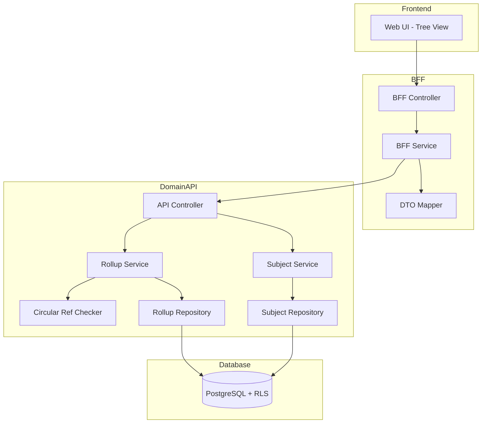
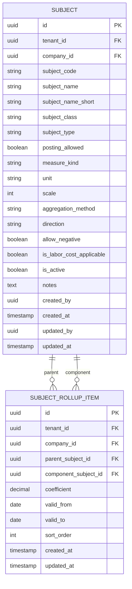

# Technical Design Document

## Feature: master-data/subject-master

---

## Overview

科目マスタは、EPM SaaS における勘定科目（財務科目・KPI）とその集計構造（rollup）を管理する機能である。科目は「通常科目（BASE）」と「集計科目（AGGREGATE）」に分類され、AGGREGATE は複数の構成科目を係数付きで集計する親子関係（subject_rollup_items）を持つ。

本機能の特徴は、リスト形式ではなくツリー形式のUIを採用し、集計構造の視覚的な把握とドラッグ＆ドロップ・コピー＆ペーストによる直感的な編集を可能にする点にある。

マルチテナント環境において tenant_id による完全なデータ分離を実現し、company_id + subject_code の複合一意制約により科目を確実に識別する。物理削除は行わず、is_active フラグによる無効化で運用する。

集計構造における循環参照は無限ループを引き起こすため、rollup 関係の作成・変更時には必ず循環参照チェックを実行する。

---

## Architecture

### Architecture Pattern & Boundary Map

**Pattern (fixed)**:
- UI（apps/web） → BFF（apps/bff） → Domain API（apps/api） → DB（PostgreSQL + RLS）
- UI 直 API は禁止



**Contracts (SSoT)**:
- UI ↔ BFF: `packages/contracts/src/bff/subject-master`
- BFF ↔ Domain API: `packages/contracts/src/api/subject-master`
- Enum/Error: `packages/contracts/src/api/errors`
- UI は `packages/contracts/src/api` を参照してはならない

---

## Architecture Responsibilities（Mandatory）

### BFF Specification（apps/bff）

**Purpose**
- UI 要件に最適化した API（Tree View / Detail Panel 向け）
- Domain API のレスポンスをツリー構造に変換
- ビジネスルールの正本は持たない

**BFF Endpoints（UI が叩く）**

| Method | Endpoint | Purpose | Request DTO (contracts/bff) | Response DTO (contracts/bff) | Notes |
|--------|----------|---------|-----------------------------|-----------------------------|-------|
| GET | /api/bff/master-data/subject-master/tree | 科目ツリー取得 | BffSubjectTreeRequest | BffSubjectTreeResponse | 全科目＋rollup構造 |
| GET | /api/bff/master-data/subject-master/:id | 科目詳細取得 | - | BffSubjectDetailResponse | UUID パス |
| POST | /api/bff/master-data/subject-master | 科目新規登録 | BffCreateSubjectRequest | BffSubjectDetailResponse | BASE/AGGREGATE |
| PATCH | /api/bff/master-data/subject-master/:id | 科目情報更新 | BffUpdateSubjectRequest | BffSubjectDetailResponse | 部分更新 |
| POST | /api/bff/master-data/subject-master/:id/deactivate | 科目無効化 | - | BffSubjectDetailResponse | is_active → false |
| POST | /api/bff/master-data/subject-master/:id/reactivate | 科目再有効化 | - | BffSubjectDetailResponse | is_active → true |
| POST | /api/bff/master-data/subject-master/:parentId/rollup | 構成科目追加 | BffAddRollupRequest | BffSubjectTreeResponse | rollup 関係作成 |
| PATCH | /api/bff/master-data/subject-master/:parentId/rollup/:componentId | 構成科目更新 | BffUpdateRollupRequest | BffSubjectTreeResponse | 係数・順序変更 |
| DELETE | /api/bff/master-data/subject-master/:parentId/rollup/:componentId | 構成科目削除 | - | BffSubjectTreeResponse | rollup 関係削除 |
| POST | /api/bff/master-data/subject-master/move | ドラッグ＆ドロップ移動 | BffMoveSubjectRequest | BffSubjectTreeResponse | 構造変更 |

**Naming Convention（必須）**
- DTO / Contracts: camelCase（例: `subjectCode`, `subjectName`）
- DB columns: snake_case（例: `subject_code`, `subject_name`）
- DB 列名（snake_case）を UI/BFF へ露出させない

**Tree Response 構造（BFF 責務）**
- Domain API からフラットな科目一覧と rollup 関係を取得
- BFF でツリー構造（SubjectTreeNode[]）に変換
- ルートノード = 親を持たない科目（トップレベル集計科目 + 未割当科目）
- 子ノード = rollup で紐づく構成科目

**Filter Normalization（BFF 責務）**
- keyword: trim、空→undefined
- subjectType: 'FIN' | 'KPI' | undefined
- subjectClass: 'BASE' | 'AGGREGATE' | undefined
- isActive: boolean | undefined

**Error Policy（必須）**
- 採用方針：**Option A: Pass-through**
- 採用理由：
  - Domain API のエラーコードは明確で、UI で直接ハンドリング可能
  - 循環参照チェック等のビジネスロジック正本は Domain API

**Error Handling（contracts error に準拠）**
| Domain API Error | HTTP Status | BFF Action |
|-----------------|-------------|------------|
| SUBJECT_NOT_FOUND | 404 | Pass-through |
| SUBJECT_CODE_DUPLICATE | 409 | Pass-through |
| SUBJECT_ALREADY_INACTIVE | 409 | Pass-through |
| SUBJECT_ALREADY_ACTIVE | 409 | Pass-through |
| ROLLUP_ALREADY_EXISTS | 409 | Pass-through |
| ROLLUP_NOT_FOUND | 404 | Pass-through |
| CIRCULAR_REFERENCE_DETECTED | 422 | Pass-through |
| CANNOT_ADD_CHILD_TO_BASE | 422 | Pass-through |
| VALIDATION_ERROR | 422 | Pass-through |

**Authentication / Tenant Context**
- tenant_id / user_id は認証ミドルウェアで解決し、リクエストコンテキストに付与
- Domain API へは `x-tenant-id` / `x-user-id` ヘッダーで伝搬

---

### Service Specification（Domain / apps/api）

**Purpose**
- ビジネスルールの正本（BFF/UI は禁止）
- Transaction boundary / audit points を必ず明記

**Domain API Endpoints - Subjects**

| Method | Endpoint | Purpose | Transaction | Audit |
|--------|----------|---------|-------------|-------|
| GET | /api/master-data/subject-master | 一覧取得 | Read-only | - |
| GET | /api/master-data/subject-master/:id | 詳細取得 | Read-only | - |
| POST | /api/master-data/subject-master | 新規登録 | Write（単一） | created_by/at |
| PATCH | /api/master-data/subject-master/:id | 更新 | Write（単一） | updated_by/at |
| POST | /api/master-data/subject-master/:id/deactivate | 無効化 | Write（複数） | updated_by/at |
| POST | /api/master-data/subject-master/:id/reactivate | 再有効化 | Write（単一） | updated_by/at |

**Domain API Endpoints - Rollups**

| Method | Endpoint | Purpose | Transaction | Audit |
|--------|----------|---------|-------------|-------|
| GET | /api/master-data/subject-master/rollups | rollup一覧取得 | Read-only | - |
| POST | /api/master-data/subject-master/:parentId/rollup | 構成科目追加 | Write（単一） | created_by/at |
| PATCH | /api/master-data/subject-master/:parentId/rollup/:componentId | 構成科目更新 | Write（単一） | updated_by/at |
| DELETE | /api/master-data/subject-master/:parentId/rollup/:componentId | 構成科目削除 | Write（単一） | - |
| POST | /api/master-data/subject-master/move | 移動（D&D） | Write（複数） | updated_by/at |

**Business Rules（Service 責務）**
- 科目コード重複チェック（tenant_id + company_id + subject_code）
- AGGREGATE 科目の posting_allowed 強制 false
- 無効化済み科目の再無効化禁止
- 有効科目の再有効化禁止
- 集計科目無効化時の子 rollup 関係削除
- 循環参照チェック（rollup 作成・移動時）
- BASE 科目への子追加禁止

**Circular Reference Check Algorithm**

```typescript
// DFS による循環参照チェック
async checkCircularReference(
  parentId: string,
  componentId: string,
  existingRollups: RollupItem[]
): Promise<boolean> {
  const visited = new Set<string>();
  const stack = [componentId];

  while (stack.length > 0) {
    const current = stack.pop()!;
    if (current === parentId) {
      return true; // 循環検出
    }
    if (visited.has(current)) continue;
    visited.add(current);

    // current を親として持つ rollup を探索
    const children = existingRollups
      .filter(r => r.parentSubjectId === current)
      .map(r => r.componentSubjectId);
    stack.push(...children);
  }
  return false; // 循環なし
}
```

**Transaction Boundary**
- 科目 CRUD: 単一トランザクション
- 科目無効化: 科目更新 + 子 rollup 削除を単一トランザクション
- 科目移動（D&D）: 旧 rollup 削除 + 新 rollup 作成を単一トランザクション

---

### Repository Specification（apps/api）

**Purpose**
- データアクセス層（Prisma 経由）
- tenant_id による二重ガード

**Subject Repository Methods**

| Method | Parameters | Returns | Notes |
|--------|------------|---------|-------|
| findMany | tenantId, companyId, filter | Subject[] | フィルタリング対応 |
| findById | tenantId, id | Subject \| null | UUID で取得 |
| findByCode | tenantId, companyId, subjectCode | Subject \| null | 重複チェック用 |
| create | tenantId, data | Subject | 監査情報含む |
| update | tenantId, id, data | Subject | 監査情報更新 |

**Rollup Repository Methods**

| Method | Parameters | Returns | Notes |
|--------|------------|---------|-------|
| findByCompany | tenantId, companyId | RollupItem[] | 全 rollup 取得 |
| findByParent | tenantId, parentSubjectId | RollupItem[] | 親指定 |
| findOne | tenantId, parentId, componentId | RollupItem \| null | 特定関係取得 |
| create | tenantId, data | RollupItem | 作成 |
| update | tenantId, id, data | RollupItem | 更新 |
| delete | tenantId, id | void | 削除 |
| deleteByParent | tenantId, parentSubjectId | void | 親の全子削除 |

**Tenant Guard（必須）**
- 全メソッドの第一引数は tenantId
- where 句に必ず tenant_id 条件を含める
- PrismaService.setTenantContext() を呼び出してから Prisma クエリ実行
- RLS 無効化は禁止

---

### Contracts Summary（This Feature）

**BFF Contracts（packages/contracts/src/bff/subject-master）**

```typescript
// Request DTOs
export interface BffSubjectTreeRequest {
  keyword?: string;
  subjectType?: 'FIN' | 'KPI';
  subjectClass?: 'BASE' | 'AGGREGATE';
  isActive?: boolean;
}

export interface BffCreateSubjectRequest {
  subjectCode: string;
  subjectName: string;
  subjectNameShort?: string;
  subjectClass: 'BASE' | 'AGGREGATE';
  subjectType: 'FIN' | 'KPI';
  postingAllowed?: boolean;     // BASE default: true, AGGREGATE forced: false
  measureKind: string;
  unit?: string;
  scale?: number;
  aggregationMethod: 'SUM' | 'EOP' | 'AVG' | 'MAX' | 'MIN';
  direction?: string;
  allowNegative?: boolean;
  isLaborCostApplicable?: boolean; // 労務費単価利用可否 default: false
  notes?: string;
}

export interface BffUpdateSubjectRequest {
  subjectCode?: string;
  subjectName?: string;
  subjectNameShort?: string;
  measureKind?: string;
  unit?: string;
  scale?: number;
  aggregationMethod?: 'SUM' | 'EOP' | 'AVG' | 'MAX' | 'MIN';
  direction?: string;
  allowNegative?: boolean;
  isLaborCostApplicable?: boolean; // 労務費単価利用可否
  notes?: string;
}

export interface BffAddRollupRequest {
  componentSubjectId: string;
  coefficient: number;          // +1, -1, etc.
  validFrom?: string;           // ISO 8601
  validTo?: string;             // ISO 8601
  sortOrder?: number;
}

export interface BffUpdateRollupRequest {
  coefficient?: number;
  validFrom?: string;
  validTo?: string;
  sortOrder?: number;
}

export interface BffMoveSubjectRequest {
  subjectId: string;
  fromParentId?: string;        // null = ルートから
  toParentId?: string;          // null = ルートへ
  coefficient?: number;         // default: +1
}

// Response DTOs
export interface BffSubjectTreeNode {
  id: string;
  subjectCode: string;
  subjectName: string;
  subjectClass: 'BASE' | 'AGGREGATE';
  subjectType: 'FIN' | 'KPI';
  isActive: boolean;
  coefficient?: number;         // rollup 関係の係数（子ノードのみ）
  children: BffSubjectTreeNode[];
}

export interface BffSubjectTreeResponse {
  nodes: BffSubjectTreeNode[];
  unassigned: BffSubjectTreeNode[];  // どの集計科目にも属さない科目
}

export interface BffSubjectDetailResponse {
  id: string;
  subjectCode: string;
  subjectName: string;
  subjectNameShort: string | null;
  subjectClass: 'BASE' | 'AGGREGATE';
  subjectType: 'FIN' | 'KPI';
  postingAllowed: boolean;
  measureKind: string;
  unit: string | null;
  scale: number;
  aggregationMethod: string;
  direction: string | null;
  allowNegative: boolean;
  isLaborCostApplicable: boolean; // 労務費単価利用可否
  isActive: boolean;
  notes: string | null;
  createdAt: string;
  updatedAt: string;
}
```

**API Contracts（packages/contracts/src/api/subject-master）**

```typescript
// Request DTOs
export interface ApiListSubjectsRequest {
  keyword?: string;
  subjectType?: 'FIN' | 'KPI';
  subjectClass?: 'BASE' | 'AGGREGATE';
  isActive?: boolean;
}

export interface ApiCreateSubjectRequest {
  subjectCode: string;
  subjectName: string;
  subjectNameShort?: string;
  subjectClass: 'BASE' | 'AGGREGATE';
  subjectType: 'FIN' | 'KPI';
  postingAllowed?: boolean;
  measureKind: string;
  unit?: string;
  scale?: number;
  aggregationMethod: 'SUM' | 'EOP' | 'AVG' | 'MAX' | 'MIN';
  direction?: string;
  allowNegative?: boolean;
  isLaborCostApplicable?: boolean; // 労務費単価利用可否 default: false
  notes?: string;
}

export interface ApiUpdateSubjectRequest {
  subjectCode?: string;
  subjectName?: string;
  subjectNameShort?: string;
  measureKind?: string;
  unit?: string;
  scale?: number;
  aggregationMethod?: 'SUM' | 'EOP' | 'AVG' | 'MAX' | 'MIN';
  direction?: string;
  allowNegative?: boolean;
  isLaborCostApplicable?: boolean; // 労務費単価利用可否
  notes?: string;
}

export interface ApiAddRollupRequest {
  componentSubjectId: string;
  coefficient: number;
  validFrom?: string;
  validTo?: string;
  sortOrder?: number;
}

export interface ApiUpdateRollupRequest {
  coefficient?: number;
  validFrom?: string;
  validTo?: string;
  sortOrder?: number;
}

export interface ApiMoveSubjectRequest {
  subjectId: string;
  fromParentId?: string;
  toParentId?: string;
  coefficient?: number;
}

// Response DTOs
export interface ApiSubjectResponse {
  id: string;
  subjectCode: string;
  subjectName: string;
  subjectNameShort: string | null;
  subjectClass: 'BASE' | 'AGGREGATE';
  subjectType: 'FIN' | 'KPI';
  postingAllowed: boolean;
  measureKind: string;
  unit: string | null;
  scale: number;
  aggregationMethod: string;
  direction: string | null;
  allowNegative: boolean;
  isLaborCostApplicable: boolean; // 労務費単価利用可否
  isActive: boolean;
  notes: string | null;
  createdAt: string;
  updatedAt: string;
}

export interface ApiListSubjectsResponse {
  items: ApiSubjectResponse[];
}

export interface ApiRollupItemResponse {
  id: string;
  parentSubjectId: string;
  componentSubjectId: string;
  coefficient: number;
  validFrom: string | null;
  validTo: string | null;
  sortOrder: number;
}

export interface ApiListRollupsResponse {
  items: ApiRollupItemResponse[];
}
```

**Error Contracts（packages/contracts/src/api/errors/subject-master-error.ts）**

```typescript
export const SubjectMasterErrorCode = {
  SUBJECT_NOT_FOUND: 'SUBJECT_NOT_FOUND',
  SUBJECT_CODE_DUPLICATE: 'SUBJECT_CODE_DUPLICATE',
  SUBJECT_ALREADY_INACTIVE: 'SUBJECT_ALREADY_INACTIVE',
  SUBJECT_ALREADY_ACTIVE: 'SUBJECT_ALREADY_ACTIVE',
  ROLLUP_ALREADY_EXISTS: 'ROLLUP_ALREADY_EXISTS',
  ROLLUP_NOT_FOUND: 'ROLLUP_NOT_FOUND',
  CIRCULAR_REFERENCE_DETECTED: 'CIRCULAR_REFERENCE_DETECTED',
  CANNOT_ADD_CHILD_TO_BASE: 'CANNOT_ADD_CHILD_TO_BASE',
  VALIDATION_ERROR: 'VALIDATION_ERROR',
} as const;

export type SubjectMasterErrorCode =
  typeof SubjectMasterErrorCode[keyof typeof SubjectMasterErrorCode];

export interface SubjectMasterError {
  code: SubjectMasterErrorCode;
  message: string;
  details?: Record<string, unknown>;
}
```

---

## Responsibility Clarification（Mandatory）

本 Feature における責務境界を以下に明記する。
未記載の責務は実装してはならない。

### UI の責務
- ツリー表示制御（展開/折りたたみ）
- ドラッグ＆ドロップ操作の視覚フィードバック
- コピー＆ペースト操作のクリップボード管理
- フォーム入力制御・UX 最適化
- エラーコードに基づく表示切替
- ビジネス判断は禁止

### BFF の責務
- フラットデータ → ツリー構造への変換
- UI 入力の正規化（filtering）
- Domain API DTO ⇄ UI DTO の変換
- ビジネスルールの正本は持たない

### Domain API の責務
- ビジネスルールの正本
- 科目コード重複チェック
- AGGREGATE 科目の posting_allowed 強制
- 循環参照チェック
- BASE 科目への子追加禁止
- 無効化/再有効化の状態遷移検証
- 監査ログ・整合性保証
- tenant_id による最終ガード

---

## Data Model

### Entity: Subject



**Prisma Schema - Subject**

```prisma
model Subject {
  id                      String    @id @default(uuid())
  tenantId                String    @map("tenant_id")
  companyId               String    @map("company_id")
  subjectCode             String    @map("subject_code")
  subjectName             String    @map("subject_name")
  subjectNameShort        String?   @map("subject_name_short")
  subjectClass            String    @map("subject_class")    // BASE | AGGREGATE
  subjectType             String    @map("subject_type")     // FIN | KPI
  postingAllowed          Boolean   @map("posting_allowed")
  measureKind             String    @map("measure_kind")
  unit                    String?
  scale                   Int       @default(0)
  aggregationMethod       String    @map("aggregation_method")
  direction               String?
  allowNegative           Boolean   @default(false) @map("allow_negative")
  isLaborCostApplicable   Boolean   @default(false) @map("is_labor_cost_applicable") // 労務費単価利用可否
  isActive                Boolean   @default(true) @map("is_active")
  notes                   String?
  createdBy               String    @map("created_by")
  createdAt               DateTime  @default(now()) @map("created_at")
  updatedBy               String    @map("updated_by")
  updatedAt               DateTime  @updatedAt @map("updated_at")

  parentRollups     SubjectRollupItem[] @relation("ParentSubject")
  componentRollups  SubjectRollupItem[] @relation("ComponentSubject")

  @@unique([tenantId, companyId, subjectCode])
  @@index([tenantId, companyId])
  @@index([tenantId, isActive])
  @@index([tenantId, companyId, subjectType])
  @@index([tenantId, companyId, subjectClass])
  @@map("subjects")
}
```

**Prisma Schema - SubjectRollupItem**

```prisma
model SubjectRollupItem {
  id                  String    @id @default(uuid())
  tenantId            String    @map("tenant_id")
  companyId           String    @map("company_id")
  parentSubjectId     String    @map("parent_subject_id")
  componentSubjectId  String    @map("component_subject_id")
  coefficient         Decimal   @db.Decimal(9, 4)
  validFrom           DateTime? @map("valid_from") @db.Date
  validTo             DateTime? @map("valid_to") @db.Date
  sortOrder           Int       @map("sort_order")
  createdAt           DateTime  @default(now()) @map("created_at")
  updatedAt           DateTime  @updatedAt @map("updated_at")

  parentSubject       Subject   @relation("ParentSubject", fields: [tenantId, companyId, parentSubjectId], references: [tenantId, companyId, id])
  componentSubject    Subject   @relation("ComponentSubject", fields: [tenantId, companyId, componentSubjectId], references: [tenantId, companyId, id])

  @@unique([tenantId, companyId, parentSubjectId, componentSubjectId])
  @@index([tenantId, companyId, parentSubjectId])
  @@map("subject_rollup_items")
}
```

**Constraints**
- Subject PK: id（UUID）
- Subject Unique: tenant_id + company_id + subject_code
- SubjectRollupItem Unique: tenant_id + company_id + parent_subject_id + component_subject_id
- CHECK: valid_to IS NULL OR valid_to > valid_from（アプリケーション層で検証）

**RLS Policy（PostgreSQL）**

```sql
-- subjects RLS 有効化
ALTER TABLE subjects ENABLE ROW LEVEL SECURITY;

CREATE POLICY tenant_isolation ON subjects
  USING (tenant_id::text = current_setting('app.tenant_id', true));

-- subject_rollup_items RLS 有効化
ALTER TABLE subject_rollup_items ENABLE ROW LEVEL SECURITY;

CREATE POLICY tenant_isolation ON subject_rollup_items
  USING (tenant_id::text = current_setting('app.tenant_id', true));
```

---

## Requirements Traceability

| Requirement | Summary | Components | Interfaces | Flows |
|-------------|---------|------------|------------|-------|
| 1.1 | 会社所属科目ツリー取得 | BFF.buildTree, Repository | GET /tree | Tree |
| 1.2 | AGGREGATE親ノード表示 | BFF.buildTree | BffSubjectTreeResponse | Tree |
| 1.3 | ルートレベル表示 | BFF.buildTree | BffSubjectTreeResponse | Tree |
| 1.4 | ツリー展開表示 | UI | - | UI |
| 1.5 | ツリー折りたたみ | UI | - | UI |
| 1.6 | ノード情報表示 | BffSubjectTreeNode | - | Tree |
| 2.1 | 詳細パネル表示 | Repository.findById | GET /:id | Detail |
| 2.2 | 詳細表示項目 | BffSubjectDetailResponse | - | Detail |
| 2.3 | 編集モード切替 | UI | - | UI |
| 2.4 | 編集内容保存 | Service.update | PATCH /:id | Update |
| 2.5 | コード重複エラー | Service | SUBJECT_CODE_DUPLICATE | Error |
| 2.6 | 更新監査情報 | Repository | updated_by/at | Update |
| 3.1 | BASE新規フォーム | UI | - | UI |
| 3.2 | BASE科目登録 | Service.create | POST / | Create |
| 3.3 | BASE posting_allowed初期化 | Service.create | - | Create |
| 3.4 | コード重複エラー | Service | SUBJECT_CODE_DUPLICATE | Error |
| 3.5 | バリデーションエラー | Service | VALIDATION_ERROR | Error |
| 3.6 | isActive初期化 | Service.create | - | Create |
| 3.7 | 登録監査情報 | Repository | created_by/at | Create |
| 4.1 | AGGREGATE新規フォーム | UI | - | UI |
| 4.2 | AGGREGATE科目登録 | Service.create | POST / | Create |
| 4.3 | AGGREGATE posting_allowed強制false | Service.create | - | Create |
| 4.4 | コード重複エラー | Service | SUBJECT_CODE_DUPLICATE | Error |
| 4.5 | バリデーションエラー | Service | VALIDATION_ERROR | Error |
| 4.6 | isActive初期化 | Service.create | - | Create |
| 4.7 | 登録監査情報 | Repository | created_by/at | Create |
| 5.1 | 構成科目ダイアログ | UI | - | UI |
| 5.2 | rollup作成 | RollupService.create | POST /:parentId/rollup | Rollup |
| 5.3 | 係数プラスマイナス | RollupService | coefficient | Rollup |
| 5.4 | rollup係数更新 | RollupService.update | PATCH /:parentId/rollup/:componentId | Rollup |
| 5.5 | rollup削除 | RollupService.delete | DELETE /:parentId/rollup/:componentId | Rollup |
| 5.6 | sortOrder管理 | RollupRepository | sort_order | Rollup |
| 5.7 | 重複rollupエラー | RollupService | ROLLUP_ALREADY_EXISTS | Error |
| 6.1 | D&D移動 | RollupService.move | POST /move | Move |
| 6.2 | ルートへ移動 | RollupService.move | toParentId=null | Move |
| 6.3 | BASE下配置禁止 | RollupService | CANNOT_ADD_CHILD_TO_BASE | Error |
| 6.4 | 循環チェック | CircularRefChecker | CIRCULAR_REFERENCE_DETECTED | Error |
| 6.5 | ドロップ位置表示 | UI | - | UI |
| 7.1 | コピー | UI (clipboard) | - | UI |
| 7.2 | ペースト | RollupService.create | POST /:parentId/rollup | Rollup |
| 7.3 | デフォルト係数 | RollupService | coefficient=+1 | Rollup |
| 7.4 | 重複rollupエラー | RollupService | ROLLUP_ALREADY_EXISTS | Error |
| 7.5 | ペースト循環チェック | CircularRefChecker | - | Error |
| 8.1 | 科目無効化 | Service.deactivate | POST /:id/deactivate | Deactivate |
| 8.2 | 無効化後詳細返却 | Controller | BffSubjectDetailResponse | Deactivate |
| 8.3 | 対象不存在エラー | Service | SUBJECT_NOT_FOUND | Error |
| 8.4 | 既無効化エラー | Service | SUBJECT_ALREADY_INACTIVE | Error |
| 8.5 | 集計科目rollup削除 | RollupRepository.deleteByParent | - | Deactivate |
| 8.6 | 無効化監査情報 | Repository | updated_by/at | Deactivate |
| 9.1 | 科目再有効化 | Service.reactivate | POST /:id/reactivate | Reactivate |
| 9.2 | 再有効化後詳細返却 | Controller | BffSubjectDetailResponse | Reactivate |
| 9.3 | 対象不存在エラー | Service | SUBJECT_NOT_FOUND | Error |
| 9.4 | 既有効エラー | Service | SUBJECT_ALREADY_ACTIVE | Error |
| 9.5 | 再有効化監査情報 | Repository | updated_by/at | Reactivate |
| 10.1 | キーワード検索 | BFF.normalize, Repository | keyword | Filter |
| 10.2 | 科目タイプフィルタ | Repository | subjectType | Filter |
| 10.3 | 科目クラスフィルタ | Repository | subjectClass | Filter |
| 10.4 | 有効フラグフィルタ | Repository | isActive | Filter |
| 10.5 | AND結合 | Repository | - | Filter |
| 10.6 | 親ノード自動展開 | BFF.buildTree | - | Tree |
| 11.1 | tenant_idフィルタ | Repository | where tenant_id | All |
| 11.2 | Repository必須引数 | Repository signature | tenantId first arg | All |
| 11.3 | RLS double-guard | PrismaService.setTenantContext | - | All |
| 11.4 | 異テナントアクセス拒否 | RLS Policy | - | Security |
| 12.1 | 複合一意制約 | Prisma @@unique | - | DB |
| 12.2 | 重複エラー | Service | SUBJECT_CODE_DUPLICATE | Error |
| 13.1 | 操作ユーザーID記録 | Repository | created_by/updated_by | Audit |
| 13.2 | 操作日時記録 | Prisma @default(now) | created_at/updated_at | Audit |
| 13.3 | 監査情報自動記録 | Prisma @updatedAt | - | Audit |
| 14.1 | rollup作成時循環チェック | CircularRefChecker | - | Validation |
| 14.2 | 循環検出エラー | RollupService | CIRCULAR_REFERENCE_DETECTED | Error |
| 14.3 | D&D循環チェック | CircularRefChecker | - | Validation |
| 14.4 | DFS/BFSアルゴリズム | CircularRefChecker | - | Algorithm |
| 14.5 | 循環時ロールバック | Transaction | - | Error |
| 15.1 | 労務費利用可否フラグ | Prisma | is_labor_cost_applicable | DB |
| 15.2 | デフォルトfalse | Prisma @default(false) | - | DB |
| 15.3 | フラグ更新 | Service.update | PATCH /:id | Update |
| 15.4 | 労務費単価科目フィルタ | Repository.findMany | isLaborCostApplicable=true | Filter |
| 15.5 | 全科目タイプで設定可能 | Service | - | Validation |

---

## Component Summary

| Component | Domain | Intent | Requirements | Dependencies |
|-----------|--------|--------|--------------|--------------|
| SubjectMasterController (API) | Domain API | REST エンドポイント提供 | All | SubjectService, RollupService |
| SubjectMasterService | Domain API | 科目ビジネスルール実行 | 2-4, 8-13 | SubjectRepository |
| SubjectRollupService | Domain API | Rollupビジネスルール実行 | 5-7, 14 | RollupRepository, CircularRefChecker |
| CircularRefChecker | Domain API | 循環参照チェック | 14 | RollupRepository |
| SubjectRepository | Domain API | 科目データアクセス | 11, 12, 13 | PrismaService |
| RollupRepository | Domain API | Rollupデータアクセス | 11, 13 | PrismaService |
| SubjectMasterController (BFF) | BFF | UI向けエンドポイント | All | BffService |
| SubjectMasterService (BFF) | BFF | DTO変換・ツリー構築 | 1, 10 | Mapper, TreeBuilder, ApiClient |
| SubjectTreeBuilder | BFF | ツリー構造構築 | 1 | - |
| SubjectMapper | BFF | DTO変換 | - | - |

---

## Technology Stack & Alignment

| Layer | Technology | Version | Role |
|-------|------------|---------|------|
| Frontend | Next.js (App Router) | 14.x | UI ホスティング |
| Frontend | React | 18.x | UI コンポーネント |
| Frontend | TypeScript | 5.x | 型安全性 |
| Frontend | TanStack Query | 5.x | Server State 管理 |
| Frontend | dnd-kit / react-beautiful-dnd | latest | ドラッグ＆ドロップ |
| BFF | NestJS | 10.x | BFF フレームワーク |
| Backend | NestJS | 10.x | Domain API フレームワーク |
| Backend | TypeScript | 5.x | 型安全性 |
| Backend | Prisma | 5.x | ORM |
| Database | PostgreSQL | 15.x | RDBMS + RLS |
| Contracts | TypeScript | 5.x | 型定義 SSoT |

---

## Security Considerations

- **マルチテナント分離**: tenant_id による RLS + アプリケーションガード（double-guard）
- **認証**: Clerk 経由で認証済みユーザーのみアクセス可
- **認可**: 本機能では権限チェックは実装対象外（将来拡張）
- **入力検証**:
  - subjectCode: 最大 50 文字、英数字・ハイフン許可
  - subjectName: 最大 200 文字
  - coefficient: -999999.9999 〜 +999999.9999

---

## Testing Strategy

| Test Type | Scope | Tools | Coverage Target |
|-----------|-------|-------|-----------------|
| Unit | SubjectService | Jest | ビジネスロジック 100% |
| Unit | RollupService | Jest | 循環チェック 100% |
| Unit | CircularRefChecker | Jest | 全パターン網羅 |
| Unit | TreeBuilder | Jest | 変換ロジック 100% |
| Integration | Repository + DB | Jest + Testcontainers | CRUD + RLS |
| E2E | UI → BFF → API → DB | Playwright | 主要シナリオ |

**循環参照テストケース（必須）**
- 直接循環: A → B → A
- 間接循環: A → B → C → A
- 深い循環: A → B → C → D → E → A
- 自己参照: A → A

---

## Open Questions / Risks

- **Q1**: company_id の取得方法は？
  - **Decision**: 認証コンテキストから取得（tenant 内で 1 company 前提、将来拡張可能）
- **Q2**: 科目コードの形式制約は？
  - **Decision**: 英数字・ハイフンのみ、最大 50 文字（運用で柔軟性確保）
- **Q3**: ツリー全件取得のパフォーマンスは？
  - **Decision**: 初期は全件取得、1000 件超で遅延読み込み検討
- **Q4**: valid_from/valid_to による時点別 rollup はどこまで UI で扱うか？
  - **Decision**: Phase 1 では current_date での有効 rollup のみ表示、時点選択は Phase 2
- **Risk**: 大量科目（1000 件超）でのツリー表示性能
  - **Mitigation**: 遅延展開、仮想スクロール検討

---

## References

- [requirements.md](./requirements.md) — 要件定義
- `.kiro/specs/entities/01_各種マスタ.md` — エンティティ定義
- `.kiro/steering/tech.md` — 技術憲法
- `.kiro/steering/structure.md` — 構造憲法
