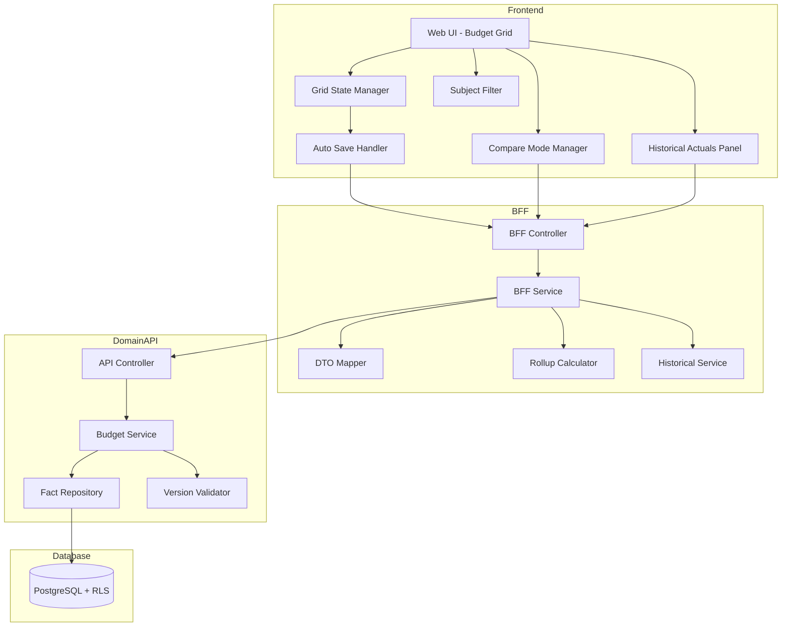

# Technical Design Document

## Feature: planning/budget-entry

---

## Overview

予算入力は、EPM SaaS における予算策定の中核機能である。部門責任者またはFP&A担当者が、Excel風のグリッドUIで月次予算を入力・編集する。

本機能の特徴は以下の通り：
- **Excel風グリッドUI**: 行=科目、列=期間（19列）の形式で、Excelに慣れたユーザーが直感的に操作可能
- **拡張期間列**: 月次12列 + 四半期4列 + 上下期2列 + 通期1列 = 計19列
- **ディメンション展開**: 設定された科目は得意先グループ別等に展開して入力可能（ツリー形式）
- **集計科目の自動計算**: 売上総利益、営業利益等はリアルタイムで自動計算
- **バージョン比較**: 第1回予算と第2回予算の差異を並列表示
- **過去実績比較**: 予算と過去年度実績の差異を並列表示
- **過去実績表示**: 過去3年分の実績をアコーディオンパネルで参照可能
- **科目フィルター**: 特定科目のみの表示フィルタリング
- **自動保存**: セル編集ごとにdebounceで自動保存、保存忘れを防止

マルチテナント環境において tenant_id による完全なデータ分離を実現し、fact_amounts への書き込みは plan_version の status が FIXED でないことを検証する。

---

## Architecture

### Architecture Pattern & Boundary Map

**Pattern (fixed)**:
- UI（apps/web） → BFF（apps/bff） → Domain API（apps/api） → DB（PostgreSQL + RLS）
- UI 直 API は禁止



**Contracts (SSoT)**:
- UI ↔ BFF: `packages/contracts/src/bff/budget-entry`
- BFF ↔ Domain API: `packages/contracts/src/api/budget-entry`（将来）
- Enum/Error: `packages/contracts/src/shared/errors`
- UI は `packages/contracts/src/api` を参照してはならない

---

## Architecture Responsibilities（Mandatory）

### BFF Specification（apps/bff）

**Purpose**
- UI要件に最適化したAPI（グリッド表示用ViewModel）
- Domain APIのレスポンスをグリッド構造に変換
- 集計科目（AGGREGATE）のリアルタイム計算
- 過去実績データの取得・比較計算
- ビジネスルールの正本は持たない

**BFF Endpoints（UIが叩く）**

| Method | Endpoint | Purpose | Request DTO (contracts/bff) | Response DTO (contracts/bff) | Notes |
|--------|----------|---------|-----------------------------|-----------------------------|-------|
| GET | /api/bff/planning/budget-entry/grid | グリッドデータ取得 | BffBudgetGridRequest | BffBudgetGridResponse | 科目×期間のグリッド |
| GET | /api/bff/planning/budget-entry/context | コンテキスト取得 | - | BffBudgetContextResponse | 選択肢（年度/部門/バージョン） |
| PUT | /api/bff/planning/budget-entry/cell | セル値更新（単一） | BffUpdateCellRequest | BffUpdateCellResponse | 自動保存用 |
| PUT | /api/bff/planning/budget-entry/cells | セル値一括更新 | BffUpdateCellsRequest | BffUpdateCellsResponse | 複数セル同時更新 |
| GET | /api/bff/planning/budget-entry/compare | バージョン比較取得 | BffBudgetCompareRequest | BffBudgetCompareResponse | 2バージョン比較 |
| GET | /api/bff/planning/budget-entry/historical-actuals | 過去実績取得 | BffHistoricalActualRequest | BffHistoricalActualResponse | 過去3年度実績 |
| GET | /api/bff/planning/budget-entry/subjects | 科目一覧取得 | - | BffSubjectListResponse | 科目フィルター用 |
| GET | /api/bff/planning/budget-entry/historical-compare | 過去実績比較取得 | BffHistoricalCompareRequest | BffHistoricalCompareResponse | 予算vs過去実績 |

**Naming Convention（必須）**
- DTO / Contracts: camelCase（例: `subjectId`, `fiscalYear`）
- DB columns: snake_case（例: `subject_id`, `fiscal_year`）
- DB列名（snake_case）をUI/BFFへ露出させない

**Grid Response 構造（BFF責務）**

```typescript
interface BffBudgetGridResponse {
  context: {
    fiscalYear: number;
    departmentId: string;
    departmentName: string;
    planEventId: string;
    planEventName: string;
    planVersionId: string;
    planVersionName: string;
    planVersionStatus: PlanVersionStatus;
    isEditable: boolean; // status != 'FIXED' && periods are open
  };
  periods: BffPeriodColumn[]; // 19期間
  rows: BffBudgetRow[];
}

// 期間タイプ
const PeriodType = {
  MONTH: "MONTH",      // 月次（4月〜3月）
  QUARTER: "QUARTER",  // 四半期（1Q〜4Q）
  HALF: "HALF",        // 上下期（上期、下期）
  ANNUAL: "ANNUAL",    // 年次（通期）
} as const;
type PeriodType = (typeof PeriodType)[keyof typeof PeriodType];

interface BffPeriodColumn {
  periodId: string;       // "M04", "M05", ..., "Q1", "Q2", "H1", "H2", "Y"
  periodNo: number;       // 表示順序
  periodLabel: string;    // "4月", "5月", ..., "1Q", "上期", "通期"
  periodType: PeriodType; // 期間タイプ
  isOpen: boolean;        // close_status == 'OPEN'
  isEditable: boolean;    // isOpen && version.isEditable && periodType == 'MONTH'
  isAggregate: boolean;   // 集計列かどうか（Q, 上期, 下期, 通期）
}

interface BffBudgetRow {
  rowId: string;           // subject_id または subject_id + dimension_value_id
  subjectId: string;
  subjectCode: string;
  subjectName: string;
  subjectClass: SubjectClass; // 'BASE' | 'AGGREGATE'
  indentLevel: number;     // 0=科目, 1=ディメンション値
  isExpandable: boolean;   // budget_input_axis_settings に設定あり
  isExpanded: boolean;     // UIの展開状態
  isEditable: boolean;     // BASE && posting_allowed && !AGGREGATE
  parentRowId: string | null;
  dimensionValueId: string | null;
  dimensionValueName: string | null;
  cells: BffBudgetCell[];
  annualTotal: string;     // Decimal string
}

interface BffBudgetCell {
  periodId: string;
  value: string | null;    // Decimal string or null
  isEditable: boolean;
  isDirty: boolean;        // 未保存フラグ（UI用）
}
```

**期間列の構成（19列）**

| periodId | periodNo | periodLabel | periodType | isAggregate | 算出ロジック |
|----------|----------|-------------|------------|-------------|--------------|
| M04 | 1 | 4月 | MONTH | false | 入力値 |
| M05 | 2 | 5月 | MONTH | false | 入力値 |
| M06 | 3 | 6月 | MONTH | false | 入力値 |
| Q1 | 4 | 1Q | QUARTER | true | M04 + M05 + M06 |
| M07 | 5 | 7月 | MONTH | false | 入力値 |
| M08 | 6 | 8月 | MONTH | false | 入力値 |
| M09 | 7 | 9月 | MONTH | false | 入力値 |
| Q2 | 8 | 2Q | QUARTER | true | M07 + M08 + M09 |
| H1 | 9 | 上期 | HALF | true | Q1 + Q2 |
| M10 | 10 | 10月 | MONTH | false | 入力値 |
| M11 | 11 | 11月 | MONTH | false | 入力値 |
| M12 | 12 | 12月 | MONTH | false | 入力値 |
| Q3 | 13 | 3Q | QUARTER | true | M10 + M11 + M12 |
| M01 | 14 | 1月 | MONTH | false | 入力値 |
| M02 | 15 | 2月 | MONTH | false | 入力値 |
| M03 | 16 | 3月 | MONTH | false | 入力値 |
| Q4 | 17 | 4Q | QUARTER | true | M01 + M02 + M03 |
| H2 | 18 | 下期 | HALF | true | Q3 + Q4 |
| Y | 19 | 通期 | ANNUAL | true | H1 + H2 |

**Paging / Sorting（本機能では不要）**
- グリッドは全科目を一括取得（ページングなし）
- 表示順は report_layout の line_no に従う

**Transformation Rules（api DTO → bff DTO）**
- fact_amounts のフラットなリスト → グリッド構造（行×列）に変換
- subject_rollup_items を使って AGGREGATE 科目の値を計算
- budget_input_axis_settings を参照してディメンション展開行を生成
- 月次値から四半期・上下期・通期を自動計算

**Error Policy（必須）**
- 採用方針：**Option A: Pass-through**
- 採用理由：
  - Domain API のエラーコードは明確で、UI で直接ハンドリング可能
  - バージョンFIXED等のビジネスロジック正本は Domain API

**Error Handling（contracts error に準拠）**

| Domain API Error | HTTP Status | BFF Action | UI表示 |
|-----------------|-------------|------------|--------|
| VERSION_IS_FIXED | 403 | Pass-through | 「確定済みバージョンは編集できません」 |
| PERIOD_IS_CLOSED | 403 | Pass-through | 「この月は締め済みです」 |
| INVALID_AMOUNT | 422 | Pass-through | 「金額が不正です」 |
| NEGATIVE_NOT_ALLOWED | 422 | Pass-through | 「この科目はマイナス値を入力できません」 |
| SUBJECT_NOT_FOUND | 404 | Pass-through | 「科目が見つかりません」 |
| DEPARTMENT_NOT_FOUND | 404 | Pass-through | 「部門が見つかりません」 |
| VALIDATION_ERROR | 422 | Pass-through | フィールド別エラー表示 |

**Authentication / Tenant Context**
- tenant_id / user_id は認証ミドルウェアで解決し、リクエストコンテキストに付与
- Domain API へは `x-tenant-id` / `x-user-id` ヘッダーで伝搬

---

### Service Specification（Domain / apps/api）

**Purpose**
- ビジネスルールの正本（BFF/UI は禁止）
- Transaction boundary / audit points を必ず明記

**Domain API Endpoints**

| Method | Endpoint | Purpose | Transaction | Audit |
|--------|----------|---------|-------------|-------|
| GET | /api/planning/budget-entry | 予算データ取得 | Read-only | - |
| GET | /api/planning/budget-entry/context | コンテキスト取得 | Read-only | - |
| PUT | /api/planning/budget-entry/fact | Fact更新（Upsert） | Write（単一） | updated_by/at |
| PUT | /api/planning/budget-entry/facts | Fact一括更新 | Write（複数） | updated_by/at |

**Business Rules（Service責務）**

1. **バージョン検証**
   - plan_version.status == 'FIXED' の場合、更新を拒否
   - 更新前に必ずステータスを確認

2. **期間検証**
   - accounting_period.close_status != 'OPEN' の場合、該当月の更新を拒否

3. **科目検証**
   - subject.subject_class == 'AGGREGATE' の場合、直接入力を拒否
   - subject.posting_allowed == false の場合、入力を拒否
   - subject.allow_negative == false の場合、負の値を拒否

4. **Upsert ロジック**
   - fact_amounts の一意キー（tenant_id, company_id, accounting_period_id, scenario_type, plan_version_id, source_type, subject_id, org_version_id, department_stable_id, project_key, ir_segment_key）で既存レコードを検索
   - 存在すれば UPDATE、なければ INSERT
   - source_type は 'INPUT' 固定（Phase 1）

5. **ディメンション付きFact**
   - dimension_value_id が指定された場合、fact_dimension_links も同時に Upsert
   - 科目レベルの合計は保存しない（UIで計算表示のみ）

---

### Repository Specification（apps/api）

**FactAmountsRepository**

```typescript
interface FactAmountsRepository {
  // 予算データ取得（グリッド用）
  findByContext(
    tenantId: string,
    companyId: string,
    fiscalYear: number,
    departmentStableId: string,
    planVersionId: string
  ): Promise<FactAmount[]>;

  // 単一Fact Upsert
  upsertFact(
    tenantId: string,
    companyId: string,
    fact: UpsertFactInput
  ): Promise<FactAmount>;

  // 複数Fact Upsert（トランザクション）
  upsertFacts(
    tenantId: string,
    companyId: string,
    facts: UpsertFactInput[]
  ): Promise<FactAmount[]>;

  // 過去実績取得
  findHistoricalActuals(
    tenantId: string,
    companyId: string,
    departmentStableId: string,
    fiscalYears: number[]
  ): Promise<FactAmount[]>;
}
```

**Repository原則**
- tenant_id 必須（全メソッド）
- where句二重ガード必須
- set_config 前提（RLS無効化禁止）

---

### Contracts Summary（This Feature）

**packages/contracts/src/bff/budget-entry/index.ts**

```typescript
// === Enums ===

export const PeriodType = {
  MONTH: "MONTH",
  QUARTER: "QUARTER",
  HALF: "HALF",
  ANNUAL: "ANNUAL",
} as const;
export type PeriodType = (typeof PeriodType)[keyof typeof PeriodType];

export const PlanVersionStatus = {
  DRAFT: "DRAFT",
  SUBMITTED: "SUBMITTED",
  APPROVED: "APPROVED",
  FIXED: "FIXED",
} as const;
export type PlanVersionStatus = (typeof PlanVersionStatus)[keyof typeof PlanVersionStatus];

export const SubjectClass = {
  BASE: "BASE",
  AGGREGATE: "AGGREGATE",
} as const;
export type SubjectClass = (typeof SubjectClass)[keyof typeof SubjectClass];

// === Request DTOs ===

export interface BffBudgetGridRequest {
  fiscalYear: number;
  departmentId: string;
  planEventId: string;
  planVersionId: string;
}

export interface BffUpdateCellRequest {
  subjectId: string;
  periodId: string;
  dimensionValueId?: string;  // ディメンション展開時
  value: string | null;       // Decimal string or null (クリア)
}

export interface BffUpdateCellsRequest {
  cells: BffUpdateCellRequest[];
}

export interface BffBudgetCompareRequest {
  fiscalYear: number;
  departmentId: string;
  planEventId: string;
  baseVersionId: string;      // 比較元
  currentVersionId: string;   // 現行
}

export interface BffHistoricalActualRequest {
  departmentId: string;
  fiscalYears: number[];      // 取得したい過去年度のリスト
  subjectIds?: string[];      // 特定科目のみ取得する場合
}

export interface BffHistoricalCompareRequest {
  fiscalYear: number;
  departmentId: string;
  planEventId: string;
  planVersionId: string;
  compareFiscalYear: number;  // 比較対象の過去年度
}

// === Response DTOs ===

export interface BffBudgetGridResponse {
  context: BffBudgetContext;
  periods: BffPeriodColumn[];
  rows: BffBudgetRow[];
}

export interface BffBudgetContextResponse {
  fiscalYears: { value: number; label: string }[];
  departments: { id: string; code: string; name: string }[];
  planEvents: { id: string; code: string; name: string; scenarioType: string }[];
  planVersions: { id: string; code: string; name: string; status: string }[];
}

export interface BffUpdateCellResponse {
  success: boolean;
  updatedCell: BffBudgetCell;
  affectedRows: BffAffectedRow[];  // 集計科目の再計算結果
}

export interface BffUpdateCellsResponse {
  success: boolean;
  updatedCells: BffBudgetCell[];
  affectedRows: BffAffectedRow[];
}

export interface BffBudgetCompareResponse {
  context: BffBudgetContext;
  periods: BffPeriodColumn[];
  rows: BffBudgetCompareRow[];
}

export interface BffBudgetCompareRow extends BffBudgetRow {
  baseCells: BffBudgetCell[];      // 比較元バージョン
  currentCells: BffBudgetCell[];   // 現行バージョン
  varianceCells: BffVarianceCell[]; // 差異
}

export interface BffVarianceCell {
  periodId: string;
  value: string | null;           // current - base
  isPositive: boolean;            // 差異の正負
}

export interface BffAffectedRow {
  rowId: string;
  cells: BffBudgetCell[];
  annualTotal: string;
}

// === Historical Actuals ===

export interface BffHistoricalActualRow {
  subjectId: string;
  subjectCode: string;
  subjectName: string;
  subjectClass: SubjectClass;
  indentLevel: number;
  fiscalYearAmounts: BffFiscalYearAmount[];
}

export interface BffFiscalYearAmount {
  fiscalYear: number;
  periodAmounts: BffPeriodAmount[];
  annualTotal: string;
}

export interface BffPeriodAmount {
  periodId: string;
  periodNo: number;
  periodLabel: string;
  value: string | null;
}

export interface BffHistoricalActualResponse {
  departmentId: string;
  departmentName: string;
  fiscalYears: number[];
  periods: BffPeriodColumn[];
  rows: BffHistoricalActualRow[];
}

// === Historical Compare ===

export interface BffHistoricalCompareRow {
  rowId: string;
  subjectId: string;
  subjectCode: string;
  subjectName: string;
  subjectClass: SubjectClass;
  indentLevel: number;
  isExpandable: boolean;
  isExpanded: boolean;
  parentRowId: string | null;
  dimensionValueId: string | null;
  dimensionValueName: string | null;
  currentCells: BffBudgetCell[];       // 現在の予算
  currentAnnualTotal: string;
  historicalCells: BffBudgetCell[];    // 過去実績
  historicalAnnualTotal: string;
  varianceCells: BffVarianceCell[];    // 差異
  varianceAnnualTotal: string;
  varianceAnnualIsPositive: boolean;
}

export interface BffHistoricalCompareResponse {
  context: {
    fiscalYear: number;
    departmentId: string;
    departmentName: string;
    planEventId: string;
    planEventName: string;
    planVersionId: string;
    planVersionName: string;
    compareFiscalYear: number;
  };
  periods: BffPeriodColumn[];
  rows: BffHistoricalCompareRow[];
}

// === Subject Filter ===

export interface BffSubjectSummary {
  id: string;
  code: string;
  name: string;
  class: SubjectClass;
  hasChildren: boolean;
}

export interface BffSubjectListResponse {
  subjects: BffSubjectSummary[];
}

// === Error Types ===

export const BudgetEntryErrorCode = {
  EVENT_NOT_FOUND: "BUDGET_EVENT_NOT_FOUND",
  EVENT_CODE_DUPLICATE: "BUDGET_EVENT_CODE_DUPLICATE",
  EVENT_HAS_FIXED_VERSION: "BUDGET_EVENT_HAS_FIXED_VERSION",
  VERSION_IS_FIXED: "VERSION_IS_FIXED",
  PLAN_VERSION_NOT_FOUND: "PLAN_VERSION_NOT_FOUND",
  PERIOD_IS_CLOSED: "PERIOD_IS_CLOSED",
  INVALID_AMOUNT: "INVALID_AMOUNT",
  NEGATIVE_NOT_ALLOWED: "NEGATIVE_NOT_ALLOWED",
  SUBJECT_NOT_FOUND: "SUBJECT_NOT_FOUND",
  SUBJECT_NOT_EDITABLE: "SUBJECT_NOT_EDITABLE",
  DEPARTMENT_NOT_FOUND: "DEPARTMENT_NOT_FOUND",
  VALIDATION_ERROR: "VALIDATION_ERROR",
} as const;
export type BudgetEntryErrorCode = (typeof BudgetEntryErrorCode)[keyof typeof BudgetEntryErrorCode];
```

---

## Responsibility Clarification（Mandatory）

### UIの責務

- **グリッド表示**: Excel風のグリッドレンダリング
- **セル編集**: インライン編集、Tab/Enter/矢印キーによるセル移動
- **ツリー展開**: ディメンション展開行の表示/非表示切替
- **自動保存**: debounce（500ms）後にBFF呼び出し
- **保存状態表示**: 保存中/保存完了/エラーのインジケーター（spinner/check/alert）
- **バリデーション表示**: エラーセルのハイライト、ツールチップ
- **差異の色分け**: 正=success色、負=destructive色
- **比較モード切替**: タブUI（比較しない/過去実績比較/Ver比較）
- **過去実績パネル表示**: トグルによる表示/非表示
- **科目フィルター**: マルチセレクトによるフィルタリング
- **スティッキーカラム**: 科目列の固定表示（z-index管理）
- **ビジネス判断は禁止**

### BFFの責務

- **グリッド構造変換**: フラットなfact_amounts → 行×列のグリッド構造
- **集計科目計算**: subject_rollup_items に基づく AGGREGATE 値の計算
- **ディメンション展開行生成**: budget_input_axis_settings に基づく子行生成
- **バージョン比較計算**: 2バージョンの差異計算
- **過去実績取得**: 複数年度の実績データ取得
- **過去実績比較計算**: 予算と過去実績の差異計算
- **期間集計計算**: 月次値から四半期/上下期/通期を自動計算
- **ビジネスルールの正本は持たない**

### Domain APIの責務

- **ビジネスルールの正本**: バージョン検証、期間検証、科目検証
- **Fact Upsert**: 一意キーによる Insert/Update 判定
- **監査ログ**: created_by/at, updated_by/at の記録
- **整合性保証**: RLS、FK制約

---

## Data Model（エンティティ整合性確認必須）

### Entity Reference

- fact_amounts: `.kiro/specs/entities/01_各種マスタ.md` セクション 12.1
- fact_dimension_links: `.kiro/specs/entities/01_各種マスタ.md` セクション 12.2
- subjects: `.kiro/specs/entities/01_各種マスタ.md` セクション 6.1
- subject_rollup_items: `.kiro/specs/entities/01_各種マスタ.md` セクション 6.3

### 新規エンティティ: budget_input_axis_settings

**仕様**
- 科目×部門ごとに、予算入力時に使用するディメンションを設定する
- 設定がある科目のみ、UIでディメンション展開入力が可能

**エンティティ**

| カラム | 型 | NULL | 例 | 補足 |
|--------|-----|------|-----|------|
| id | uuid | NO | BIS-... | PK |
| tenant_id | uuid | NO | T-... | RLS境界 |
| company_id | uuid | NO | C-... | companies参照 |
| subject_id | uuid | NO | SUB-SALES | subjects参照 |
| department_stable_id | uuid | YES | S-SALES | NULL=全部門 |
| dimension_id | uuid | NO | DIM-CUST | dimensions参照 |
| fiscal_year | int | YES | 2026 | NULL=全年度 |
| is_required | boolean | NO | false | 必須入力フラグ |
| is_active | boolean | NO | true | 論理削除 |
| created_at | timestamptz | NO | | |
| updated_at | timestamptz | NO | | |
| created_by | uuid | YES | | 監査 |
| updated_by | uuid | YES | | 監査 |

**制約**
- UNIQUE(tenant_id, company_id, subject_id, department_stable_id, dimension_id, fiscal_year)
- FK(tenant_id, company_id) → companies(tenant_id, id)
- FK(tenant_id, company_id, subject_id) → subjects(tenant_id, company_id, id)
- FK(tenant_id, dimension_id) → dimensions(tenant_id, id)

**補足**
- department_stable_id = NULL の場合、全部門に適用
- fiscal_year = NULL の場合、全年度に適用
- 同一科目に複数ディメンションを設定可能（Phase 2検討）

### エンティティ整合性チェックリスト

| チェック項目 | 確認結果 |
|-------------|---------|
| カラム網羅性 | fact_amounts の必須カラムがDTO/Prismaに反映されている: ✅ |
| 型の一致 | numeric→Decimal (string)、uuid→String: ✅ |
| 制約の反映 | UNIQUE制約がUpsertロジックに反映: ✅ |
| ビジネスルール | FIXED拒否、CLOSED拒否がServiceに反映: ✅ |
| NULL許可 | dimension_value_id等のNULL許可が正しく対応: ✅ |

### Prisma Schema（追加分）

```prisma
model BudgetInputAxisSetting {
  id                   String   @id @default(uuid())
  tenantId             String   @map("tenant_id")
  companyId            String   @map("company_id")
  subjectId            String   @map("subject_id")
  departmentStableId   String?  @map("department_stable_id")
  dimensionId          String   @map("dimension_id")
  fiscalYear           Int?     @map("fiscal_year")
  isRequired           Boolean  @default(false) @map("is_required")
  isActive             Boolean  @default(true) @map("is_active")
  createdAt            DateTime @default(now()) @map("created_at")
  updatedAt            DateTime @updatedAt @map("updated_at")
  createdBy            String?  @map("created_by")
  updatedBy            String?  @map("updated_by")

  @@unique([tenantId, companyId, subjectId, departmentStableId, dimensionId, fiscalYear])
  @@map("budget_input_axis_settings")
}
```

### RLS Policy

```sql
ALTER TABLE budget_input_axis_settings ENABLE ROW LEVEL SECURITY;

CREATE POLICY tenant_isolation ON budget_input_axis_settings
  USING (tenant_id::text = current_setting('app.tenant_id', true));
```

---

## UI Design Specification

### グリッドレイアウト

```
┌──────────────────────────────────────────────────────────────────────────────────────────────────┐
│ [年度: 2026 ▼] [部門: 営業1課 ▼] [予算イベント: 当初予算 ▼] [バージョン: 第1回 ▼]                   │
│                                                                    [過去実績を表示: ON/OFF]       │
├──────────────────────────────────────────────────────────────────────────────────────────────────┤
│ 比較モード: [比較しない] [過去実績比較] [Ver比較]                                                  │
├──────────────────────────────────────────────────────────────────────────────────────────────────┤
│ 科目フィルター: [売上高] [売上原価] [販管費] ...                                                   │
├──────────────────────────────────────────────────────────────────────────────────────────────────┤
│ 予算 (2026年度)                                                                                   │
├──────────────────────────────────────────────────────────────────────────────────────────────────┤
│ 科目           │4月  │5月  │6月  │1Q   │7月  │8月  │9月  │2Q  │上期 │10月│11月│12月│3Q  │1月 │2月 │3月 │4Q  │下期│通期│
├──────────────────────────────────────────────────────────────────────────────────────────────────┤
│ ▼ 売上高       │1,000│1,200│1,100│3,300│...  │     │     │    │     │    │    │    │    │    │    │    │    │    │    │
│   └ 得意先A    │  400│  500│  450│1,350│...  │     │     │    │     │    │    │    │    │    │    │    │    │    │    │
│   └ 得意先B    │  350│  400│  380│1,130│...  │     │     │    │     │    │    │    │    │    │    │    │    │    │    │
│   └ 得意先C    │  250│  300│  270│  820│...  │     │     │    │     │    │    │    │    │    │    │    │    │    │    │
│ 売上原価       │  600│  700│  650│1,950│...  │     │     │    │     │    │    │    │    │    │    │    │    │    │    │
│ 【売上総利益】 │  400│  500│  450│1,350│...  │     │     │    │     │    │    │    │    │    │    │    │    │    │    │
│ 販管費         │  300│  350│  320│  970│...  │     │     │    │     │    │    │    │    │    │    │    │    │    │    │
│ 【営業利益】   │  100│  150│  130│  380│...  │     │     │    │     │    │    │    │    │    │    │    │    │    │    │
└──────────────────────────────────────────────────────────────────────────────────────────────────┘

凡例:
- ▼: 展開可能（クリックで子行表示）
- 【】: 集計科目（AGGREGATE）- 背景色グレー、編集不可
- 1Q/2Q/3Q/4Q: 四半期集計列（背景色で区別）
- 上期/下期: 上下期集計列（背景色で区別）
- 通期: 年間集計列（背景色で区別）
- 科目列: スティッキー（スクロールしても固定）
```

### 比較モード表示

**バージョン比較モード**

```
│ 科目           │     4月           │     5月           │     1Q            │ ...
│                │ベース│現在 │差異  │ベース│現在 │差異  │ベース│現在 │差異  │
├────────────────┼─────┼────┼─────┼─────┼────┼─────┼─────┼────┼─────┤
│ 売上高         │  900│1,000│ +100│1,100│1,200│ +100│3,000│3,300│ +300│
│ 売上原価       │  550│  600│  +50│  650│  700│  +50│1,800│1,950│ +150│
│ 【売上総利益】 │  350│  400│  +50│  450│  500│  +50│1,200│1,350│ +150│
```

**過去実績比較モード**

```
│ 科目           │     4月           │     5月           │     1Q            │ ...
│                │予算  │実績 │差異  │予算  │実績 │差異  │予算  │実績 │差異  │
├────────────────┼─────┼────┼─────┼─────┼────┼─────┼─────┼────┼─────┤
│ 売上高         │1,000│  950│  +50│1,200│1,150│  +50│3,300│3,100│ +200│
│ 売上原価       │  600│  580│  +20│  700│  690│  +10│1,950│1,870│  +80│
│ 【売上総利益】 │  400│  370│  +30│  500│  460│  +40│1,350│1,230│ +120│
```

### 過去実績パネル

```
┌─ 実績 (2025年度) ─────────────────────────────────────────────────────────────┐
│ 科目           │4月  │5月  │6月  │1Q   │7月  │...  │通期 │
│ 売上高         │  950│1,150│1,050│3,150│...  │     │     │
│ 売上原価       │  580│  690│  630│1,900│...  │     │     │
│ 【売上総利益】 │  370│  460│  420│1,250│...  │     │     │
└───────────────────────────────────────────────────────────────────────────────┘

┌─ 実績 (2024年度) ─────────────────────────────────────────────────────────────┐
│ ...（アコーディオン展開）
└───────────────────────────────────────────────────────────────────────────────┘

┌─ 実績 (2023年度) ─────────────────────────────────────────────────────────────┐
│ ...（アコーディオン展開）
└───────────────────────────────────────────────────────────────────────────────┘
```

### 操作仕様

| 操作 | 動作 |
|------|------|
| セルクリック | 編集モードに入る |
| Tab | 右のセルへ移動 |
| Shift+Tab | 左のセルへ移動 |
| Enter | 下のセルへ移動 |
| Shift+Enter | 上のセルへ移動 |
| 矢印キー | 該当方向のセルへ移動（カーソル位置に応じて） |
| Escape | 編集キャンセル（元の値に戻す） |
| 展開アイコンクリック | ディメンション子行の表示/非表示切替 |

### 自動保存仕様

1. セル値変更を検知
2. 500ms debounce（連続入力中は保存しない）
3. BFF `/cell` エンドポイント呼び出し
4. 保存中: セルに spinner 表示（Loader2アイコン）
5. 成功: spinner 消去、checkマーク表示（1.5秒後に消去）
6. 失敗: セルを赤枠、AlertCircleアイコン表示、エラーメッセージをツールチップ表示
7. 関連する集計科目を再計算して表示更新（affectedRowsを反映）

### スティッキーカラム実装

科目列を固定表示するため、以下のz-index階層を使用：

| 要素 | z-index | 背景色 |
|------|---------|--------|
| ヘッダー科目セル | z-30 | bg-muted（不透明） |
| データ行科目セル | z-20 | bg-white / bg-gray-100（不透明） |
| その他セル | - | 通常 |

```css
/* ヘッダーの科目列 */
.sticky.left-0.z-30.bg-muted

/* データ行の科目列 */
.sticky.left-0.z-20.bg-white  /* BASE科目 */
.sticky.left-0.z-20.bg-gray-100  /* AGGREGATE科目 */
```

---

## UI Components（実装済み）

### ファイル構成

```
apps/web/src/features/transactions/budget-entry/
├── page.tsx                    # メインページコンポーネント
├── api/
│   ├── BffClient.ts           # BFFクライアントインターフェース
│   └── MockBffClient.ts       # モックBFFクライアント
└── ui/
    ├── BudgetGrid.tsx         # 予算入力グリッド
    ├── HistoricalActualsPanel.tsx  # 過去実績パネル（アコーディオン）
    ├── HistoricalCompareGrid.tsx   # 過去実績比較グリッド
    ├── VersionCompareGrid.tsx      # バージョン比較グリッド
    └── SubjectFilter.tsx      # 科目フィルターコンポーネント
```

### コンポーネント責務

| コンポーネント | 責務 |
|---------------|------|
| BudgetEntryPage | コンテキスト選択、比較モード切替、グリッド/パネル表示制御 |
| BudgetGrid | 予算入力グリッド表示、セル編集、キーボード操作、自動保存 |
| HistoricalActualsPanel | 過去実績のアコーディオン表示、年度別展開 |
| HistoricalCompareGrid | 予算vs過去実績の比較表示（予算/実績/差異の3列） |
| VersionCompareGrid | バージョン比較表示（ベース/現在/差異の3列） |
| SubjectFilter | 科目のマルチセレクトフィルター |

---

## Requirements Traceability

| Requirement | Design Section |
|-------------|----------------|
| 1.1 グリッド表示 | BFF Specification - Grid Response 構造 |
| 1.2 19期間列 | 期間列の構成（19列） |
| 1.3 集計科目自動計算 | BFF責務 - 集計科目計算 |
| 1.4 金額フォーマット | UI Design - formatAmount関数 |
| 1.5 集計列の視覚的区別 | UI Design - 背景色 |
| 2.1 セル入力 | Domain API - PUT /fact |
| 2.2-2.5 入力制限 | Service - Business Rules |
| 2.6 即時永続化 | UI Design - 自動保存仕様 |
| 2.7 保存状態表示 | UI Design - 自動保存仕様 |
| 2.8 集計列の入力禁止 | BffPeriodColumn.isEditable |
| 3.1-3.5 ディメンション展開 | BffBudgetRow, budget_input_axis_settings |
| 4.1-4.4 集計自動計算 | BFF責務, subject_rollup_items |
| 5.1-5.5 バージョン比較 | BffBudgetCompareResponse, VersionCompareGrid |
| 6.1-6.3 バリデーション | Service - Business Rules, Error Handling |
| 7.1-7.5 対象選択 | BffBudgetContextResponse |
| 8.1-8.6 過去実績表示 | BffHistoricalActualResponse, HistoricalActualsPanel |
| 9.1-9.5 過去実績比較 | BffHistoricalCompareResponse, HistoricalCompareGrid |
| 10.1-10.4 科目フィルター | BffSubjectListResponse, SubjectFilter |
| 11.1-11.6 グリッド操作 | UI Design - 操作仕様, スティッキーカラム実装 |

---

## 変更履歴

| 日付 | 変更内容 | 担当 |
|------|---------|------|
| 2026-01-09 | 初版作成 | Claude Code |
| 2026-01-12 | 実装に基づき大幅更新：PeriodType Enum、19期間列構成、過去実績パネル/比較、科目フィルター、スティッキーカラム、コンポーネント構成を追加 | Claude Code |
