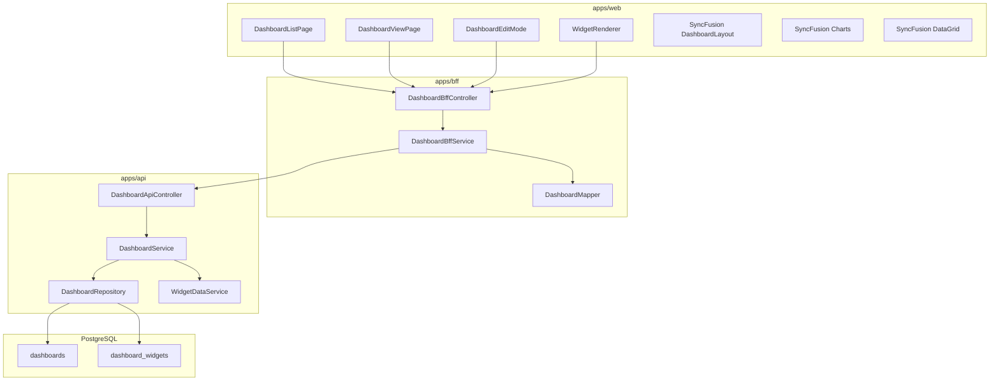
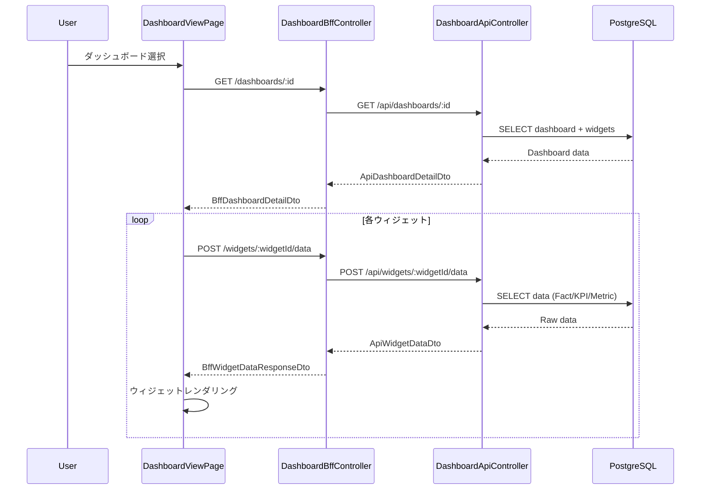
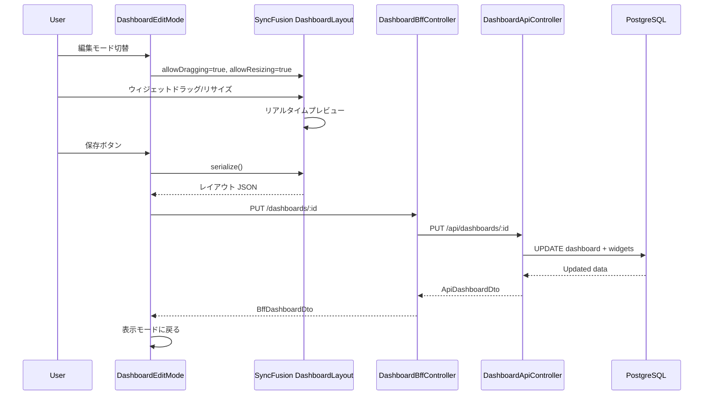

# Design Document: Dashboard（経営ダッシュボード）

---

## Spec Reference（INPUT情報）

本設計を作成するにあたり、以下の情報を確認した：

### Requirements（直接INPUT）
- **参照ファイル**: `.kiro/specs/reporting/dashboard/requirements.md`
- **要件バージョン**: 2026-01-27

### 仕様概要（確定済み仕様）
- **参照ファイル**: 前回会話での仕様決定セッション（13項目の決定事項）
- **設計に影響する仕様ポイント**:
  - WYSIWYGエディタ型ダッシュボード（サイドパネルで詳細設定）
  - ハイブリッドフィルター設計（グローバル＋ウィジェット単位オーバーライド）
  - 9種類のウィジェットタイプ、3種類のデータソース
  - SyncFusion Dashboard Layout / Charts / DataGrid を採用

### エンティティ定義（Data Model 正本）
- **参照ファイル**: 本設計で新規定義
- **対象エンティティ**: Dashboard, DashboardWidget

### Research Log
- **参照ファイル**: `.kiro/specs/reporting/dashboard/research.md`
- **設計判断に影響した調査**: SyncFusion API 仕様、既存 ComponentConfig パターン

---

## INPUT整合性チェック

| チェック項目 | 確認結果 |
|-------------|---------|
| requirements.md との整合性 | 設計が全要件をカバーしている: ✅ |
| 仕様概要との整合性 | 設計が仕様概要と矛盾しない: ✅ |
| エンティティとの整合性 | Data Model がエンティティ定義に準拠: ✅ |
| 仕様検討の背景理解 | 設計判断の背景を確認した: ✅ |

---

## Overview

本設計書は、EPM SaaS における「経営ダッシュボード機能」の技術設計を定義する。

本機能は、SyncFusion Dashboard Layout を用いた WYSIWYG 型のダッシュボードエディタを提供し、
経営層・FP&A・経営企画が必要な経営指標をウィジェット形式で自由に配置・可視化できる。
グローバルフィルター＋ウィジェット単位オーバーライドによるハイブリッドフィルター設計を採用し、
柔軟な分析視点の切り替えを実現する。

データソースは Fact（勘定科目）、KPI、Metric（指標）の3種類をサポートし、
1つのウィジェットに複数ソースを混在させることも可能とする。

---

## Architecture

### Architecture Pattern & Boundary Map

**Pattern (fixed)**:
- UI（apps/web） → BFF（apps/bff） → Domain API（apps/api） → DB（PostgreSQL + RLS）
- UI直APIは禁止

**Contracts (SSoT)**:
- UI ↔ BFF: `packages/contracts/src/bff/dashboard`
- BFF ↔ Domain API: `packages/contracts/src/api/dashboard`
- Enum/Error: `packages/contracts/src/shared/enums/dashboard`, `packages/contracts/src/shared/errors`
- UI は `packages/contracts/src/api` を参照してはならない



---

## Architecture Responsibilities（Mandatory）

### BFF Specification（apps/bff）

**Purpose**
- ダッシュボード一覧・詳細・設定の UI 最適化 API を提供
- ウィジェットデータ取得を集約・変換
- ページング・ソートの正規化

**BFF Endpoints（UIが叩く）**

| Method | Endpoint | Purpose | Request DTO | Response DTO | Notes |
|--------|----------|---------|-------------|--------------|-------|
| GET | `/api/bff/reporting/dashboards` | ダッシュボード一覧取得 | - | `BffDashboardListDto` | 1.1-1.5 |
| GET | `/api/bff/reporting/dashboards/:id` | ダッシュボード詳細取得 | - | `BffDashboardDetailDto` | 2.1-2.3 |
| POST | `/api/bff/reporting/dashboards` | ダッシュボード新規作成 | `BffCreateDashboardDto` | `BffDashboardDto` | 15.1-15.5 |
| PUT | `/api/bff/reporting/dashboards/:id` | ダッシュボード更新 | `BffUpdateDashboardDto` | `BffDashboardDto` | 3.7 |
| DELETE | `/api/bff/reporting/dashboards/:id` | ダッシュボード削除 | - | - | 17.1-17.3 |
| POST | `/api/bff/reporting/dashboards/:id/duplicate` | ダッシュボード複製 | - | `BffDashboardDto` | 16.1-16.3 |
| POST | `/api/bff/reporting/dashboards/:id/widgets/:widgetId/data` | ウィジェットデータ取得 | `BffWidgetDataRequestDto` | `BffWidgetDataResponseDto` | 2.2, 6-14 |
| GET | `/api/bff/reporting/dashboards/selectors` | 選択肢取得（年度、部門等） | `BffDashboardSelectorsRequestDto` | `BffDashboardSelectorsResponseDto` | 4.1-4.7 |
| GET | `/api/bff/reporting/dashboards/templates` | テンプレート一覧取得 | - | `BffDashboardTemplateListDto` | 15.2, 19.1-19.4 |

**Naming Convention（必須）**
- DTO / Contracts: camelCase（例: `dashboardId`, `widgetType`）
- DB columns: snake_case（例: `dashboard_id`, `widget_type`）
- `sortBy` は **DTO側キー**を採用する（例: `name | updatedAt`）

**Paging / Sorting Normalization（必須・BFF責務）**
- UI/BFF: page / pageSize（page-based）
- Domain API: offset / limit（DB-friendly）
- BFFは必ず以下を実施する：
  - defaults: page=1, pageSize=20, sortBy=sortOrder, sortOrder=asc
  - clamp: pageSize <= 100
  - whitelist: sortBy は `name | sortOrder | updatedAt` のみ
  - normalize: keyword trim、空→undefined
  - transform: offset=(page-1)*pageSize, limit=pageSize
- BFFレスポンスには page/pageSize を含める

**Transformation Rules（api DTO → bff DTO）**
- Dashboard: snake_case → camelCase 変換
- Widget: layout JSONB → LayoutConfig interface へマッピング
- global_filter_config / data_config / filter_config / display_config → 型付き interface へ変換

**Error Handling（contracts errorに準拠）**

**Error Policy（必須）**
- 採用方針：**Option A: Pass-through**
- 採用理由：
  - ダッシュボード操作は CRUD 中心でエラーパターンが明確
  - Domain API のエラーをそのまま UI に透過することで一貫性を担保
  - UI 側で `contracts/bff/errors` に基づいて表示制御

**Authentication / Tenant Context（tenant_id/user_id伝搬）**
- BFF は Clerk トークンから tenant_id / user_id を解決
- Domain API 呼び出し時に `x-tenant-id` / `x-user-id` ヘッダーで伝搬
- Domain API は RLS で tenant_id を強制

---

### Service Specification（Domain / apps/api）

**DashboardService**
- ビジネスルールの正本
- ダッシュボード CRUD、複製、削除の制御
- システムテンプレート（owner_type=SYSTEM）の削除禁止
- 監査ログ記録

**WidgetDataService**
- データソース種別（Fact/KPI/Metric）に応じたデータ取得
- フィルター適用（グローバル or ウィジェット固有）
- 比較データ（Compare）の取得・差異計算

**Transaction Boundary**
- Dashboard 更新（本体 + ウィジェット）は単一トランザクション
- ウィジェットデータ取得は読み取り専用（トランザクション不要）

**Audit Points**
- Dashboard 作成・更新・削除時に監査ログ記録
- ウィジェットデータ取得は監査対象外（参照のみ）

---

### Repository Specification（apps/api）

**DashboardRepository**
- `tenant_id` 必須（全メソッド）
- where句二重ガード必須
- RLS 前提（set_config）

**メソッド一覧**
```typescript
interface DashboardRepository {
  findAll(tenantId: string): Promise<Dashboard[]>  // deleted_at IS NULL のみ
  findById(tenantId: string, id: string): Promise<Dashboard | null>  // deleted_at IS NULL のみ
  findByIdWithWidgets(tenantId: string, id: string): Promise<DashboardWithWidgets | null>
  create(tenantId: string, data: CreateDashboardData): Promise<Dashboard>
  update(tenantId: string, id: string, data: UpdateDashboardData): Promise<Dashboard>
  softDelete(tenantId: string, id: string, deletedBy: string): Promise<void>  // deleted_at を設定
  findTemplates(tenantId: string): Promise<Dashboard[]>  // deleted_at IS NULL のみ
}
```

---

### Contracts Summary（This Feature）

**新規 Contracts**

| 種別 | パス | 内容 |
|------|------|------|
| BFF DTO | `packages/contracts/src/bff/dashboard/` | BffDashboardDto, BffWidgetDto, etc. |
| API DTO | `packages/contracts/src/api/dashboard/` | ApiDashboardDto, ApiWidgetDto, etc. |
| Enum | `packages/contracts/src/shared/enums/dashboard/` | WidgetType, DataSourceType, OwnerType |
| Error | `packages/contracts/src/shared/errors/` | DashboardNotFoundError, etc. |
| Config Types | `packages/contracts/src/bff/dashboard/` | GlobalFilterConfig, WidgetLayoutConfig, etc. |

---

## Responsibility Clarification（Mandatory）

### UIの責務
- SyncFusion Dashboard Layout によるドラッグ&ドロップ・リサイズ制御
- SyncFusion Charts / DataGrid によるウィジェット描画
- フォーム入力制御（ウィジェット設定サイドパネル）
- 表示モード / 編集モードの切り替え制御
- グローバルフィルター UI 制御
- ビジネス判断は禁止

### BFFの責務
- UI入力の正規化（paging / sorting / filtering）
- Domain API DTO ⇄ UI DTO の変換
- グローバルフィルター / ウィジェットフィルターのマージ・適用
- ビジネスルールの正本は持たない

### Domain APIの責務
- ビジネスルールの正本（システムテンプレート削除禁止等）
- 権限チェック（`epm.dashboard.read` / `epm.dashboard.manage`）
- データソース（Fact/KPI/Metric）からのデータ取得
- 監査ログ・整合性保証

**権限定義（確定）**

| 権限名 | 用途 | 対象操作 |
|--------|------|---------|
| `epm.dashboard.read` | ダッシュボード閲覧 | 一覧表示、詳細表示、ウィジェットデータ取得 |
| `epm.dashboard.manage` | ダッシュボード管理 | 新規作成、編集、削除、複製 |

---

## Data Model

### Entity Reference
- 本設計で新規定義

### エンティティ整合性チェックリスト

| チェック項目 | 確認結果 |
|-------------|---------|
| カラム網羅性 | エンティティ定義の全カラムがDTO/Prismaに反映されている: ✅ |
| 型の一致 | varchar→String, jsonb→Json 等の型変換が正確: ✅ |
| 制約の反映 | UNIQUE/CHECK制約がPrisma/アプリ検証に反映: ✅ |
| ビジネスルール | システムテンプレート削除禁止がServiceに反映: ✅ |
| NULL許可 | NULL/NOT NULLがPrisma?/必須に正しく対応: ✅ |

### Prisma Schema

```prisma
model dashboards {
  id                   String    @id @default(uuid()) @db.Uuid
  tenant_id            String    @db.Uuid
  name                 String    @db.VarChar(200)
  description          String?   @db.Text
  owner_type           String    @db.VarChar(20) // SYSTEM | USER
  owner_id             String?   @db.Uuid
  global_filter_config Json      @default("{}")
  is_active            Boolean   @default(true)
  sort_order           Int       @default(0)
  created_at           DateTime  @default(now()) @db.Timestamptz
  updated_at           DateTime  @updatedAt @db.Timestamptz
  created_by           String?   @db.VarChar(100)
  updated_by           String?   @db.VarChar(100)
  deleted_at           DateTime? @db.Timestamptz  // 論理削除日時（NULL = 未削除）
  deleted_by           String?   @db.VarChar(100) // 削除実行者

  widgets dashboard_widgets[]

  @@index([tenant_id])
  @@index([tenant_id, owner_type])
  @@index([tenant_id, deleted_at])  // 削除済み除外クエリ用
}

model dashboard_widgets {
  id             String   @id @default(uuid()) @db.Uuid
  dashboard_id   String   @db.Uuid
  widget_type    String   @db.VarChar(50)
  title          String   @db.VarChar(200)
  layout         Json     // { row, col, sizeX, sizeY }
  data_config    Json     // データソース設定
  filter_config  Json     // { useGlobal: boolean, overrides: {...} }
  display_config Json     // ウィジェット固有表示設定
  sort_order     Int      @default(0)
  created_at     DateTime @default(now()) @db.Timestamptz
  updated_at     DateTime @updatedAt @db.Timestamptz

  dashboard dashboards @relation(fields: [dashboard_id], references: [id], onDelete: Cascade)

  @@index([dashboard_id])
}
```

### Constraints
- PK: id（UUID）
- UNIQUE: なし（同名ダッシュボード許可）
- CHECK: owner_type IN ('SYSTEM', 'USER')（アプリケーション層で検証）

### 論理削除方式（確定）
- **削除方式**: `deleted_at` カラムによる論理削除
- **削除判定**: `deleted_at IS NULL` で未削除レコードをフィルタ
- **監査対応**: 削除日時（`deleted_at`）と削除者（`deleted_by`）を記録
- **クエリ例**:
  ```sql
  -- 未削除のダッシュボード一覧
  SELECT * FROM dashboards WHERE tenant_id = ? AND deleted_at IS NULL;
  ```

### RLS Policy

```sql
ALTER TABLE dashboards ENABLE ROW LEVEL SECURITY;

CREATE POLICY tenant_isolation ON dashboards
  USING (tenant_id::text = current_setting('app.tenant_id', true));

ALTER TABLE dashboard_widgets ENABLE ROW LEVEL SECURITY;

CREATE POLICY tenant_isolation ON dashboard_widgets
  USING (
    dashboard_id IN (
      SELECT id FROM dashboards WHERE tenant_id::text = current_setting('app.tenant_id', true)
    )
  );
```

---

## JSONB Schema Definitions

### GlobalFilterConfig

```typescript
interface GlobalFilterConfig {
  fiscalYear?: number
  departmentStableId?: string
  includeChildren?: boolean
  periodStart?: string  // YYYYMM
  periodEnd?: string    // YYYYMM
  displayGranularity?: 'MONTHLY' | 'QUARTERLY' | 'HALF_YEARLY' | 'YEARLY'
  primary?: {
    scenarioType: 'BUDGET' | 'FORECAST' | 'ACTUAL'
    planEventId?: string
    planVersionId?: string
  }
  compare?: {
    enabled: boolean
    scenarioType?: 'BUDGET' | 'FORECAST' | 'ACTUAL'
    planEventId?: string
    planVersionId?: string
  }
}
```

### WidgetLayoutConfig

```typescript
interface WidgetLayoutConfig {
  row: number
  col: number
  sizeX: number
  sizeY: number
}
```

### WidgetDataConfig

```typescript
interface WidgetDataConfig {
  sources: DataSource[]
}

interface DataSource {
  type: 'FACT' | 'KPI' | 'METRIC'
  refId: string        // 参照ID（下表参照）
  label?: string       // 凡例名
  color?: string       // チャート色
}
```

**DataSource 参照先マッピング（確定）**

| type | 参照先テーブル | 参照カラム | データ取得元 | 備考 |
|------|---------------|-----------|-------------|------|
| `FACT` | `subjects` | `stable_id` | `facts` テーブル | 勘定科目残高データ |
| `KPI` | `kpi_definitions` | `id` | `kpi_fact_amounts` テーブル | KPI管理マスタで定義されたKPI |
| `METRIC` | `metrics` | `id` | 計算指標（formula 評価） | 営業利益率、ROE等の計算指標 |

```typescript
```

### WidgetFilterConfig

```typescript
interface WidgetFilterConfig {
  useGlobal: boolean
  overrides?: Partial<GlobalFilterConfig>
}
```

### WidgetDisplayConfig（種別ごと）

```typescript
// KPI Card
interface KpiCardDisplayConfig {
  showSparkline?: boolean
  showCompare?: boolean
  thresholds?: { danger?: number; warning?: number }
}

// Line Chart
interface LineChartDisplayConfig {
  showLegend?: boolean
  showTooltip?: boolean
  showDataLabels?: boolean
}

// Bar Chart
interface BarChartDisplayConfig {
  orientation?: 'vertical' | 'horizontal'
  stacked?: boolean
  showLegend?: boolean
  showDataLabels?: boolean
}

// Pie Chart
interface PieChartDisplayConfig {
  donut?: boolean
  showLabels?: boolean
  showLegend?: boolean
}

// Gauge
interface GaugeDisplayConfig {
  style?: 'full' | 'half'
  thresholds?: { danger?: number; warning?: number }
}

// Table
interface TableDisplayConfig {
  showCompareColumns?: boolean
  columns?: string[]
  sortBy?: string
  sortOrder?: 'asc' | 'desc'
}

// Text
interface TextDisplayConfig {
  content: string  // Markdown
}

// Composite Chart
interface CompositeChartDisplayConfig {
  primaryAxis?: 'left' | 'right'
  secondaryAxis?: 'left' | 'right'
  showLegend?: boolean
}

type WidgetDisplayConfig =
  | KpiCardDisplayConfig
  | LineChartDisplayConfig
  | BarChartDisplayConfig
  | PieChartDisplayConfig
  | GaugeDisplayConfig
  | TableDisplayConfig
  | TextDisplayConfig
  | CompositeChartDisplayConfig
```

---

## Requirements Traceability

| Requirement | Summary | Components | Interfaces | Flows |
|-------------|---------|------------|------------|-------|
| 1.1-1.5 | ダッシュボード一覧表示 | DashboardListPage, DashboardBffController | GET /dashboards | List Flow |
| 2.1-2.8 | ダッシュボード表示（View） | DashboardViewPage, WidgetRenderer | GET /dashboards/:id, POST /widgets/:id/data | View Flow |
| 3.1-3.9 | ダッシュボード編集（Edit） | DashboardEditMode, SyncFusionDashboardLayout | PUT /dashboards/:id | Edit Flow |
| 4.1-4.7 | グローバルフィルター設定 | GlobalFilterPanel, DashboardBffService | GET /selectors | Filter Flow |
| 5.1-5.5 | ウィジェット単位フィルターオーバーライド | WidgetSettingsPanel | - | Filter Flow |
| 6.1-6.5 | KPIカードウィジェット | KpiCardWidget | POST /widgets/:id/data | Widget Data Flow |
| 7.1-7.6 | 折れ線チャートウィジェット | LineChartWidget, SyncFusionCharts | POST /widgets/:id/data | Widget Data Flow |
| 8.1-8.5 | 棒グラフウィジェット | BarChartWidget, SyncFusionCharts | POST /widgets/:id/data | Widget Data Flow |
| 9.1-9.4 | 円グラフウィジェット | PieChartWidget, SyncFusionCharts | POST /widgets/:id/data | Widget Data Flow |
| 10.1-10.4 | ゲージウィジェット | GaugeWidget, SyncFusionCharts | POST /widgets/:id/data | Widget Data Flow |
| 11.1-11.5 | テーブルウィジェット | TableWidget, SyncFusionDataGrid | POST /widgets/:id/data | Widget Data Flow |
| 12.1-12.3 | テキストウィジェット | TextWidget | - | - |
| 13.1-13.4 | 複合チャートウィジェット | CompositeChartWidget, SyncFusionCharts | POST /widgets/:id/data | Widget Data Flow |
| 14.1-14.6 | データソース設定 | DataSourceSelector | - | Edit Flow |
| 15.1-15.5 | ダッシュボード新規作成 | CreateDashboardDialog | POST /dashboards, GET /templates | Create Flow |
| 16.1-16.3 | ダッシュボード複製 | - | POST /dashboards/:id/duplicate | Duplicate Flow |
| 17.1-17.3 | ダッシュボード削除 | DeleteConfirmDialog | DELETE /dashboards/:id | Delete Flow |
| 18.1-18.4 | PDFエクスポート | PdfExportButton | - | Export Flow (Client) |
| 19.1-19.4 | 初期テンプレート | DashboardService | GET /templates | Template Flow |
| 20.1-20.5 | 権限制御 | AuthGuard, DashboardService | - | All Flows |

---

## System Flows

### View Flow（ダッシュボード表示）



### Edit Flow（ダッシュボード編集・保存）



---

## Components & Interface Contracts

### Component Summary

| Component | Domain | Intent | Requirements | Dependencies |
|-----------|--------|--------|--------------|--------------|
| DashboardListPage | UI | ダッシュボード一覧画面 | 1.1-1.5 | BffClient |
| DashboardViewPage | UI | ダッシュボード表示画面 | 2.1-2.8 | BffClient, WidgetRenderer |
| DashboardEditMode | UI | 編集モード制御 | 3.1-3.9 | SyncFusion DashboardLayout |
| WidgetRenderer | UI | ウィジェット種別判定・描画 | 6-13 | SyncFusion Charts/DataGrid |
| GlobalFilterPanel | UI | グローバルフィルター UI | 4.1-4.7 | - |
| WidgetSettingsPanel | UI | ウィジェット設定サイドパネル | 5.1-5.5, 14.1-14.6 | - |
| DashboardBffController | BFF | BFF エンドポイント | All | DashboardBffService |
| DashboardBffService | BFF | DTO変換・集約 | All | DashboardApiClient |
| DashboardApiController | API | Domain API エンドポイント | All | DashboardService |
| DashboardService | API | ビジネスロジック | All | DashboardRepository, WidgetDataService |
| WidgetDataService | API | ウィジェットデータ取得 | 6-13 | 各データソース Repository |
| DashboardRepository | API | DB アクセス | All | Prisma |

### UI Components

#### DashboardListPage

- **Intent**: ダッシュボード一覧の表示・新規作成への導線
- **Requirements**: 1.1-1.5
- **Dependencies**: BffClient (Inbound, P0)
- **Props**:
  ```typescript
  interface DashboardListPageProps {
    // No props, uses hooks internally
  }
  ```
- **Implementation Notes**:
  - TanStack Query で一覧データ取得
  - 権限に応じて新規作成ボタン表示/非表示

#### DashboardViewPage

- **Intent**: ダッシュボードの表示、ウィジェット描画制御
- **Requirements**: 2.1-2.8
- **Dependencies**: BffClient (Inbound, P0), WidgetRenderer (Outbound, P0)
- **Props**:
  ```typescript
  interface DashboardViewPageProps {
    dashboardId: string
  }
  ```

#### WidgetRenderer

- **Intent**: ウィジェット種別に応じたコンポーネント選択・描画
- **Requirements**: 6-13
- **Dependencies**: SyncFusion Charts (External, P0), SyncFusion DataGrid (External, P1)
- **Props**:
  ```typescript
  interface WidgetRendererProps {
    widget: BffWidgetDto
    data: BffWidgetDataResponseDto | null
    isLoading: boolean
    error: Error | null
    onRefresh: () => void
  }
  ```

### BFF Service Interfaces

#### DashboardBffService

```typescript
interface DashboardBffService {
  // 一覧取得
  getDashboards(): Promise<BffDashboardListDto>

  // 詳細取得
  getDashboard(id: string): Promise<BffDashboardDetailDto>

  // 作成
  createDashboard(data: BffCreateDashboardDto): Promise<BffDashboardDto>

  // 更新
  updateDashboard(id: string, data: BffUpdateDashboardDto): Promise<BffDashboardDto>

  // 削除
  deleteDashboard(id: string): Promise<void>

  // 複製
  duplicateDashboard(id: string): Promise<BffDashboardDto>

  // ウィジェットデータ取得
  getWidgetData(
    dashboardId: string,
    widgetId: string,
    request: BffWidgetDataRequestDto
  ): Promise<BffWidgetDataResponseDto>

  // 選択肢取得
  getSelectors(request: BffDashboardSelectorsRequestDto): Promise<BffDashboardSelectorsResponseDto>

  // テンプレート一覧
  getTemplates(): Promise<BffDashboardTemplateListDto>
}
```

### Domain Service Interfaces

#### DashboardService

```typescript
interface DashboardService {
  // 一覧取得
  findAll(tenantId: string): Promise<ApiDashboardDto[]>

  // 詳細取得（ウィジェット含む）
  findById(tenantId: string, id: string): Promise<ApiDashboardDetailDto>

  // 作成
  create(tenantId: string, userId: string, data: ApiCreateDashboardDto): Promise<ApiDashboardDto>

  // 更新
  update(tenantId: string, id: string, data: ApiUpdateDashboardDto): Promise<ApiDashboardDto>

  // 削除
  delete(tenantId: string, id: string): Promise<void>

  // 複製
  duplicate(tenantId: string, userId: string, id: string): Promise<ApiDashboardDto>

  // テンプレート一覧
  findTemplates(tenantId: string): Promise<ApiDashboardDto[]>
}
```

#### WidgetDataService

```typescript
interface WidgetDataService {
  // ウィジェットデータ取得
  getData(
    tenantId: string,
    widget: ApiWidgetDto,
    filter: ResolvedFilterConfig
  ): Promise<ApiWidgetDataDto>
}

interface ResolvedFilterConfig {
  fiscalYear: number
  departmentStableId: string
  includeChildren: boolean
  periodStart: string
  periodEnd: string
  displayGranularity: DisplayGranularity
  primaryScenarioType: ScenarioType
  primaryPlanEventId?: string
  primaryPlanVersionId?: string
  compareEnabled: boolean
  compareScenarioType?: ScenarioType
  comparePlanEventId?: string
  comparePlanVersionId?: string
}
```

---

## Error Handling

### Error Codes

| Code | HTTP Status | Description | Requirement |
|------|-------------|-------------|-------------|
| DASHBOARD_NOT_FOUND | 404 | ダッシュボードが存在しない | 2.1 |
| DASHBOARD_ACCESS_DENIED | 403 | 閲覧/編集権限なし | 20.3-20.4 |
| DASHBOARD_DELETE_FORBIDDEN | 400 | システムテンプレートは削除不可 | 17.3 |
| WIDGET_DATA_ERROR | 500 | ウィジェットデータ取得エラー | 2.6 |
| INVALID_FILTER_CONFIG | 400 | フィルター設定不正 | 4.1 |

---

## Technology Stack & Alignment

| Layer | Technology | Version | Role | Alignment |
|-------|------------|---------|------|-----------|
| UI | SyncFusion Dashboard Layout | 26.x | ドラッグ&ドロップレイアウト | ダッシュボード機能限定 |
| UI | SyncFusion Charts | 26.x | チャート描画 | ダッシュボード機能限定 |
| UI | SyncFusion DataGrid | 26.x | テーブル・Excel エクスポート | ダッシュボード機能限定 |
| UI | html2canvas | 1.x | PDF キャプチャ | 要件 18 |
| UI | jsPDF | 2.x | PDF 生成 | 要件 18 |
| UI | TanStack Query | 5.x | Server State 管理 | 既存スタック |
| BFF | NestJS | - | BFF Framework | 既存スタック |
| API | NestJS | - | Domain API Framework | 既存スタック |
| DB | PostgreSQL | - | JSONB サポート | 既存スタック |
| DB | Prisma | - | ORM | 既存スタック |

---

## Non-Functional Requirements

### Performance
- ダッシュボード初期ロード: 5秒以内（ウィジェット10個想定）
- ウィジェット単位データ取得: 1秒以内（並列取得）
- PDF エクスポート: 10秒以内

### Security
- RLS によるテナント分離
- 権限チェック（`epm.dashboard.read` / `epm.dashboard.manage`）
- UI/BFF/API で一貫した権限制御

### Observability
- Dashboard 作成・更新・削除時に監査ログ
- ウィジェットデータ取得エラー時のログ出力

---

## Migration & Seeding

### 初期テンプレート「経営サマリー」

テナント作成時に以下のシードデータを投入：

```typescript
const managementSummaryTemplate: CreateDashboardData = {
  name: '経営サマリー',
  description: '主要経営指標のサマリーダッシュボード',
  owner_type: 'SYSTEM',
  owner_id: null,
  global_filter_config: {
    displayGranularity: 'MONTHLY',
  },
  is_active: true,
  sort_order: 0,
  widgets: [
    // KPI Card x 4 (売上高、営業利益、営業利益率、ROE)
    { widget_type: 'KPI_CARD', title: '売上高', layout: { row: 0, col: 0, sizeX: 1, sizeY: 1 }, ... },
    { widget_type: 'KPI_CARD', title: '営業利益', layout: { row: 0, col: 1, sizeX: 1, sizeY: 1 }, ... },
    { widget_type: 'KPI_CARD', title: '営業利益率', layout: { row: 0, col: 2, sizeX: 1, sizeY: 1 }, ... },
    { widget_type: 'KPI_CARD', title: 'ROE', layout: { row: 0, col: 3, sizeX: 1, sizeY: 1 }, ... },
    // 売上推移折れ線チャート
    { widget_type: 'LINE_CHART', title: '売上推移', layout: { row: 1, col: 0, sizeX: 2, sizeY: 2 }, ... },
    // 部門別売上棒グラフ
    { widget_type: 'BAR_CHART', title: '部門別売上', layout: { row: 1, col: 2, sizeX: 2, sizeY: 2 }, ... },
    // 主要指標テーブル
    { widget_type: 'TABLE', title: '主要指標', layout: { row: 3, col: 0, sizeX: 4, sizeY: 2 }, ... },
  ]
}
```

---

## Open Questions / Risks

1. **SyncFusion ライセンス管理**: Community License 条件の確認が必要
2. **JSONB マイグレーション**: config スキーマ変更時のデータ移行戦略（schema_version フィールド検討）
3. **ウィジェット数上限**: パフォーマンス検証後に 20 個程度を目安に制限検討

---

## Supporting References

- [SyncFusion React Dashboard Layout](https://www.syncfusion.com/react-components/react-dashboard-layout)
- [SyncFusion React Charts](https://www.syncfusion.com/react-components/react-charts)
- [SyncFusion React Data Grid](https://www.syncfusion.com/react-components/react-data-grid)
- `.kiro/specs/reporting/dashboard/research.md` — 詳細調査ログ
