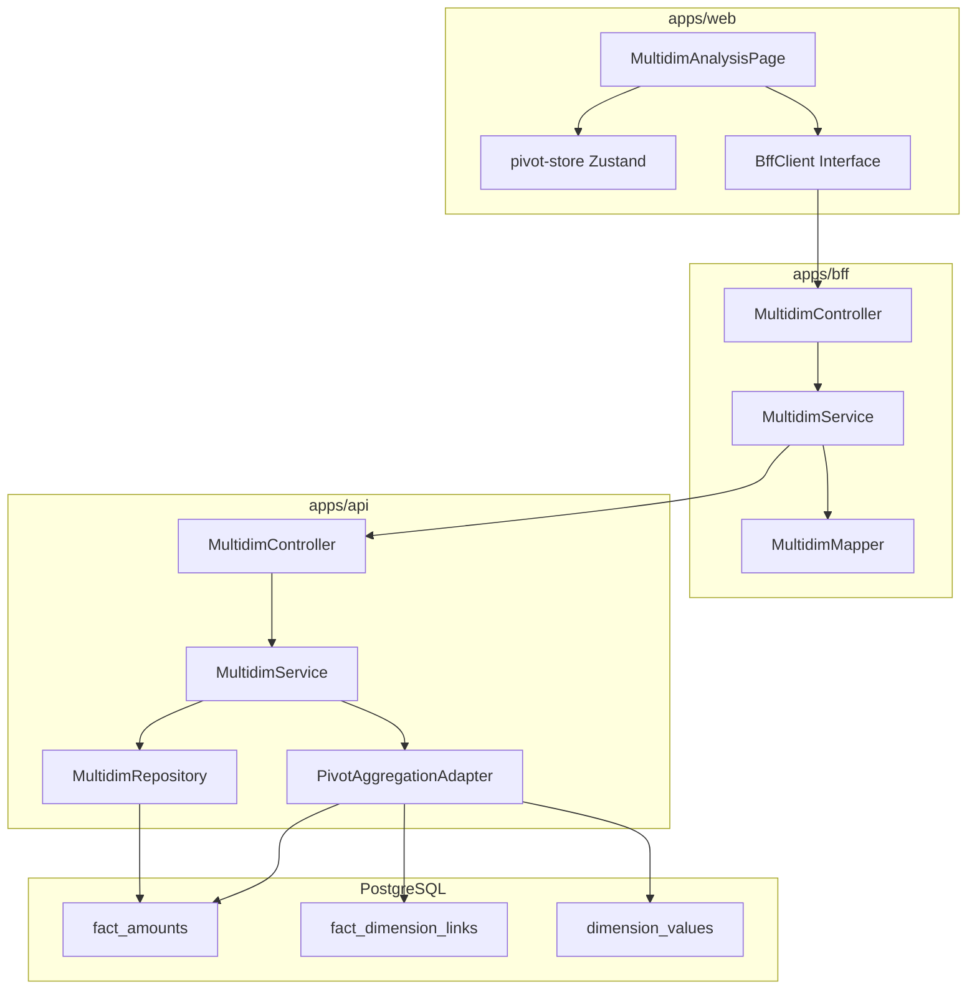
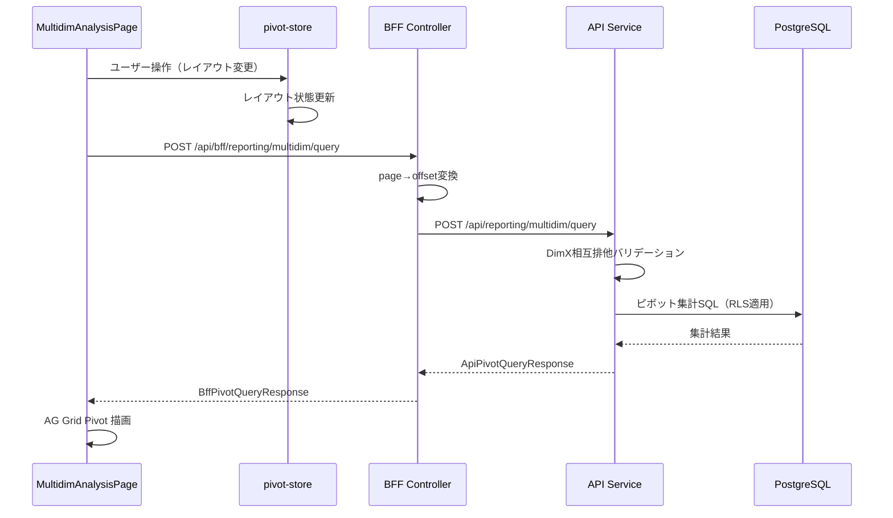
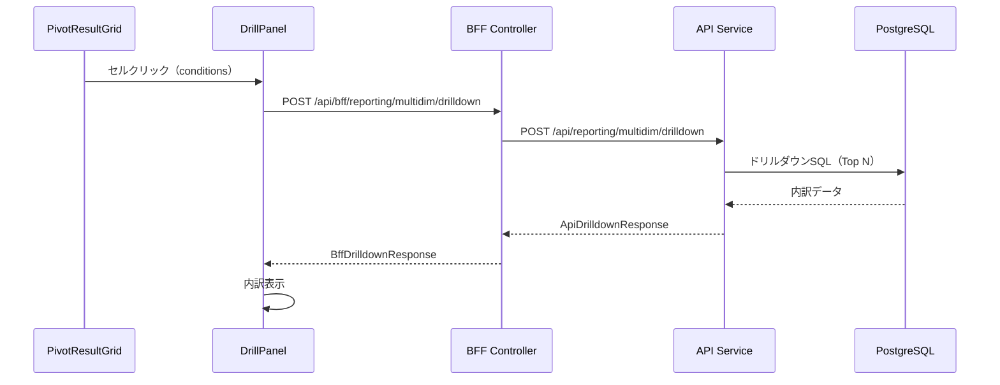

# Design Document: 多次元分析（Multidim Analysis）

---

## Spec Reference（INPUT情報）

### Requirements（直接INPUT）
- **参照ファイル**: `.kiro/specs/reporting/multidim-analysis/requirements.md`
- **要件バージョン**: 2026-02-05

### 仕様概要（確定済み仕様）
- **参照ファイル**: `.kiro/specs/仕様概要/ディメンション管理.md`
- **設計に影響する仕様ポイント**:
  - 3層ディメンション構造（dimensions → dimension_values → dimension_members）
  - Factへの付与は Group（dimension_values）のみ

### エンティティ定義（Data Model 正本）
- **参照ファイル**: `.kiro/specs/entities/01_各種マスタ.md`, `.kiro/specs/entities/02_トランザクション・残高.md`
- **対象エンティティ**: fact_amounts, fact_dimension_links, dimensions, dimension_values, subjects, departments, accounting_periods

### 仕様検討（経緯・背景）※参考
- **参照ファイル**: V0プロジェクト `/Users/ktkrr/root/99_work/multidimensional-analysis-workbench`
- **設計判断に影響した経緯**: V0でOLAP UIのプロトタイプを作成。Zustandによる状態管理、DnDによるフィールド配置を実装済み。

---

## INPUT整合性チェック

| チェック項目 | 確認結果 |
|-------------|---------|
| requirements.md との整合性 | 設計が全要件をカバーしている: ✅ |
| 仕様概要との整合性 | 設計が仕様概要と矛盾しない: ✅ |
| エンティティとの整合性 | Data Model がエンティティ定義に準拠: ✅ |
| 仕様検討の背景理解 | 設計判断の背景を確認した: ✅ |

---

## Overview

本設計は、EPMシステムにおける多次元分析（OLAP）UI機能を定義する。FP&A担当者・経営企画担当者が、予算・実績・見込データを多次元的に分析し、経営判断に必要なインサイトを得るための機能を提供する。

AG Grid Enterprise Pivot + SSRM（Server-Side Row Model）をベースとし、ドラッグ＆ドロップによる柔軟なレイアウト構成、ドリルダウン・ドリルスルーによる詳細分析を可能とする。状態管理にはZustandを採用し、レイアウト状態のローカルストレージ永続化およびURL共有機能を実現する。

技術選定の詳細は `research.md` を参照。

---

## Architecture

### Architecture Pattern & Boundary Map

**Pattern (fixed)**:
- UI（apps/web） → BFF（apps/bff） → Domain API（apps/api） → DB（PostgreSQL + RLS）
- UI直APIは禁止

**Contracts (SSoT)**:
- UI ↔ BFF: `packages/contracts/src/bff/multidim-analysis`
- BFF ↔ Domain API: `packages/contracts/src/api/multidim-analysis`
- Enum/Error: `packages/contracts/src/shared/enums/multidim-analysis`
- UI は `packages/contracts/src/api` を参照してはならない



---

## Architecture Responsibilities（Mandatory）

### BFF Specification（apps/bff）

**Purpose**
- UI要件に最適化したピボット集計API
- Domain APIのレスポンスを集約・変換（ビジネスルールの正本は持たない）
- page/pageSize → offset/limit 変換

**BFF Endpoints（UIが叩く）**

| Method | Endpoint | Purpose | Request DTO | Response DTO | Notes |
|--------|----------|---------|-------------|--------------|-------|
| GET | /api/bff/reporting/multidim/fields | 利用可能フィールド取得 | - | BffFieldListDto | Req 1.7 |
| POST | /api/bff/reporting/multidim/query | ピボット集計 | BffPivotQueryRequestDto | BffPivotQueryResponseDto | Req 3.1-3.8 |
| POST | /api/bff/reporting/multidim/drilldown | ドリルダウン | BffDrilldownRequestDto | BffDrilldownResponseDto | Req 6.1-6.5 |
| POST | /api/bff/reporting/multidim/drillthrough | ドリルスルー | BffDrillthroughRequestDto | BffDrillthroughResponseDto | Req 7.1-7.5 |
| GET | /api/bff/reporting/multidim/presets | プリセット取得 | - | BffPresetListDto | Req 8.1-8.3 |

**Naming Convention（必須）**
- DTO / Contracts: camelCase（例: `periodFrom`, `departmentStableId`）
- DB columns: snake_case（例: `period_from`, `department_stable_id`）
- `sortBy` は **DTO側キー**を採用する

**Paging / Sorting Normalization（必須・BFF責務）**
- UI/BFF: page / pageSize（page-based）
- Domain API: offset / limit（DB-friendly）
- BFFは以下を実施：
  - defaults: page=1, pageSize=50
  - clamp: pageSize <= 200
  - transform: offset=(page-1)*pageSize, limit=pageSize

**Transformation Rules（api DTO → bff DTO）**
- PivotQueryResponse: rowHeaders/colHeaders/cells をそのまま返却
- ドリルダウン/ドリルスルー: items 配列をそのまま返却
- meta 情報（executionTimeMs 等）を付与

**Error Policy（必須）**
- 採用方針：**Option A: Pass-through**
- 採用理由：Domain APIのエラーを原則そのまま返す。多次元分析は読み取り専用機能であり、エラーの再分類は不要。

**Authentication / Tenant Context**
- BFFは認証情報から `tenant_id` / `user_id` を解決
- Domain APIへ `x-tenant-id` / `x-user-id` ヘッダーで伝搬

---

### Service Specification（Domain / apps/api）

**Purpose**
- ピボット集計ロジックの正本
- DimX相互排他ルールのバリデーション
- ドリルダウン・ドリルスルーの実行

**Service Methods**

| Method | Purpose | Req |
|--------|---------|-----|
| `getAvailableFields(tenantId, companyId)` | 利用可能フィールド取得 | 1.7 |
| `executePivotQuery(tenantId, query)` | ピボット集計実行 | 3.1-3.8 |
| `executeDrilldown(tenantId, request)` | ドリルダウン実行 | 6.1-6.5 |
| `executeDrillthrough(tenantId, request)` | ドリルスルー実行 | 7.1-7.5 |
| `getPresets(tenantId)` | プリセット取得 | 8.1-8.3 |

**Business Rules（Domain責務）**
- DimX相互排他バリデーション（Req 5.1-5.3）
- 分析モード制約バリデーション（Req 4.1-4.5）
- 行軸最大2つ制約（Req 1.5）

**Transaction Boundary**
- 読み取り専用（トランザクション不要）

**Audit Points**
- ピボットクエリ実行ログ（tenant_id, user_id, 実行時刻, クエリ条件）

---

### Repository Specification（apps/api）

**Purpose**
- tenant_id による RLS 適用
- ファクトデータの取得

**Repository Methods**

| Method | Purpose |
|--------|---------|
| `findFactsForPivot(tenantId, query)` | ピボット用ファクト取得 |
| `findDrilldownData(tenantId, conditions, dimension, topN)` | ドリルダウンデータ取得 |
| `findDrillthroughData(tenantId, conditions, offset, limit)` | ドリルスルーデータ取得 |

**Constraints**
- tenant_id 必須（全メソッド）
- where句二重ガード必須
- set_config 前提（RLS無効化禁止）

---

### Contracts Summary（This Feature）

#### BFF Contracts (`packages/contracts/src/bff/multidim-analysis`)

```typescript
// ============================================================
// Enums (shared)
// ============================================================
export const AnalysisMode = {
  STANDARD: 'standard',
  PROJECT: 'project',
} as const;
export type AnalysisMode = (typeof AnalysisMode)[keyof typeof AnalysisMode];

export const UnitType = {
  YEN: 'yen',
  THOUSAND: 'thousand',
  MILLION: 'million',
} as const;
export type UnitType = (typeof UnitType)[keyof typeof UnitType];

export const ScenarioType = {
  BUDGET: 'BUDGET',
  FORECAST: 'FORECAST',
  ACTUAL: 'ACTUAL',
} as const;
export type ScenarioType = (typeof ScenarioType)[keyof typeof ScenarioType];

// ============================================================
// Field Definition
// ============================================================
export interface BffFieldDef {
  id: string;
  name: string;
  nameJa: string;
  category: 'basic' | 'dimx' | 'option';
  description: string;
  allowedZones: ('rows' | 'cols' | 'filters')[];
  isPeriod?: boolean;
}

export interface BffMeasureDef {
  id: string;
  name: string;
  nameJa: string;
  format: 'number' | 'percentage' | 'currency';
}

export interface BffFieldListDto {
  fields: BffFieldDef[];
  measures: BffMeasureDef[];
}

// ============================================================
// Pivot Query
// ============================================================
export interface BffPivotLayoutDto {
  mode: AnalysisMode;
  rows: string[];
  cols: string[];
  values: string[];
  filters: Record<string, string | string[] | null>;
}

export interface BffPivotQueryRequestDto {
  layout: BffPivotLayoutDto;
  periodFrom: string;
  periodTo: string;
  scenarioType: ScenarioType;
  planEventId?: string;
  planVersionId?: string;
  unit: UnitType;
}

export interface BffPivotQueryResponseDto {
  rowHeaders: string[][];
  colHeaders: string[];
  cells: (number | null)[][];
  meta: {
    unit: UnitType;
    appliedTopN: number | null;
    warnings: string[];
    totalRows: number;
    executionTimeMs: number;
  };
}

// ============================================================
// Drilldown
// ============================================================
export interface BffDrillConditionsDto {
  period?: string;
  org?: string;
  account?: string;
  dimX?: string;
  project?: string;
}

export interface BffDrilldownRequestDto {
  conditions: BffDrillConditionsDto;
  drillDimension: string;
  topN: number;
}

export interface BffDrilldownItemDto {
  label: string;
  value: number;
  percentage: number;
}

export interface BffDrilldownResponseDto {
  items: BffDrilldownItemDto[];
  total: number;
}

// ============================================================
// Drillthrough
// ============================================================
export interface BffDrillthroughRequestDto {
  conditions: BffDrillConditionsDto;
  page: number;
  pageSize: number;
}

export interface BffDrillthroughItemDto {
  id: string;
  date: string;
  org: string;
  account: string;
  description: string;
  amount: number;
  dimX?: string;
  project?: string;
}

export interface BffDrillthroughResponseDto {
  items: BffDrillthroughItemDto[];
  total: number;
  page: number;
  pageSize: number;
  totalPages: number;
}

// ============================================================
// Presets
// ============================================================
export interface BffLayoutPresetDto {
  id: string;
  name: string;
  nameJa: string;
  description: string;
  layout: Partial<BffPivotLayoutDto>;
}

export interface BffPresetListDto {
  presets: BffLayoutPresetDto[];
}

// ============================================================
// Errors
// ============================================================
export const MultidimErrorCode = {
  INVALID_LAYOUT: 'MULTIDIM_INVALID_LAYOUT',
  DIMX_CONFLICT: 'MULTIDIM_DIMX_CONFLICT',
  MODE_CONFLICT: 'MULTIDIM_MODE_CONFLICT',
  ROW_LIMIT_EXCEEDED: 'MULTIDIM_ROW_LIMIT_EXCEEDED',
  QUERY_TIMEOUT: 'MULTIDIM_QUERY_TIMEOUT',
  ACCESS_DENIED: 'MULTIDIM_ACCESS_DENIED',
} as const;
export type MultidimErrorCode = (typeof MultidimErrorCode)[keyof typeof MultidimErrorCode];
```

#### API Contracts (`packages/contracts/src/api/multidim-analysis`)

```typescript
// API側DTOはBFF側と同様の構造
// offset/limit を使用（page/pageSize ではない）
export interface ApiPivotQueryRequestDto {
  layout: ApiPivotLayoutDto;
  periodFrom: string;
  periodTo: string;
  scenarioType: string;
  planEventId?: string;
  planVersionId?: string;
  unit: string;
}

export interface ApiDrillthroughRequestDto {
  conditions: ApiDrillConditionsDto;
  offset: number;
  limit: number;
}
```

---

## Responsibility Clarification（Mandatory）

### UIの責務
- ピボットレイアウトのドラッグ＆ドロップ操作
- Zustandによるレイアウト状態管理
- ローカルストレージへの永続化
- URLエンコード/デコードによる共有
- AG Grid Enterprise Pivot の描画
- フィールド配置ルールの即時フィードバック（DimX相互排他等）

### BFFの責務
- UI入力の正規化（page/pageSize → offset/limit）
- Domain API DTO ⇄ UI DTO の変換
- 認証情報からtenant_id/user_idを解決

### Domain APIの責務
- ピボット集計クエリの実行
- DimX相互排他ルールの最終バリデーション
- 分析モード制約のバリデーション
- RLS適用によるマルチテナント分離
- 監査ログ記録

---

## Data Model

### Entity Reference
- 参照元: `.kiro/specs/entities/02_トランザクション・残高.md` セクション 3.1, 3.2

### エンティティ整合性チェックリスト

| チェック項目 | 確認結果 |
|-------------|---------|
| カラム網羅性 | エンティティ定義の全カラムがDTO/Prismaに反映されている: ✅ |
| 型の一致 | varchar→String, numeric→Decimal 等の型変換が正確: ✅ |
| 制約の反映 | UNIQUE/CHECK制約がPrisma/アプリ検証に反映: ✅ |
| ビジネスルール | エンティティ補足のルールがServiceに反映: ✅ |
| NULL許可 | NULL/NOT NULLがPrisma?/必須に正しく対応: ✅ |

### 使用テーブル（既存）

本機能では新規テーブルを作成せず、既存テーブルを参照する：

- `fact_amounts`: ファクト本体
- `fact_dimension_links`: ファクト-ディメンションリンク
- `dimensions`: ディメンション定義
- `dimension_values`: ディメンション値（Group）
- `subjects`: 科目
- `departments`: 部門
- `accounting_periods`: 会計期間

### RLS Policy（既存）

```sql
-- fact_amounts は既存RLSポリシーを使用
ALTER TABLE fact_amounts ENABLE ROW LEVEL SECURITY;

CREATE POLICY tenant_isolation ON fact_amounts
  USING (tenant_id::text = current_setting('app.tenant_id', true));
```

---

## Components & Interface Contracts

### UI Components

| Component | Domain | Intent | Requirements | Dependencies |
|-----------|--------|--------|--------------|--------------|
| MultidimAnalysisPage | Reporting | メインページ | 1-10 | pivot-store, BffClient |
| FieldPalette | Reporting | フィールド一覧パネル | 1.1-1.7 | dnd-kit, pivot-store |
| PivotDropZones | Reporting | 行/列/値/フィルターゾーン | 1.1-1.5 | dnd-kit, pivot-store |
| GlobalFilterBar | Reporting | グローバルフィルター | 2.1-2.7 | pivot-store |
| PivotResultGrid | Reporting | AG Grid Pivotグリッド | 3.1-3.8 | AG Grid Enterprise |
| DrillPanel | Reporting | ドリルダウン/ドリルスルーパネル | 6.1-7.5 | BffClient |
| PresetSelector | Reporting | プリセット選択 | 8.1-8.3 | BffClient |

### pivot-store（Zustand）

```typescript
interface PivotStoreState {
  // Layout
  mode: AnalysisMode;
  rows: string[];
  cols: string[];
  values: string[];
  filters: Record<string, string | string[] | null>;

  // Global filters
  periodFrom: string;
  periodTo: string;
  scenarioType: ScenarioType;
  planEventId?: string;
  planVersionId?: string;
  unit: UnitType;

  // UI state
  selectedCell: SelectedCell | null;
  isLoading: boolean;
  error: string | null;

  // Actions
  setMode: (mode: AnalysisMode) => void;
  addFieldToZone: (fieldId: string, zone: 'rows' | 'cols' | 'values' | 'filters')
    => { success: boolean; error?: string };
  removeFieldFromZone: (fieldId: string, zone: 'rows' | 'cols' | 'values' | 'filters') => void;
  reorderFieldsInZone: (zone: 'rows' | 'cols' | 'values', newOrder: string[]) => void;
  applyPreset: (preset: Partial<PivotLayout>) => void;
  getLayoutForUrl: () => string;
  loadLayoutFromUrl: (encoded: string) => void;
  resetLayout: () => void;
}
```

### BffClient Interface

```typescript
export interface MultidimBffClient {
  getFields(): Promise<BffFieldListDto>;
  executePivotQuery(request: BffPivotQueryRequestDto): Promise<BffPivotQueryResponseDto>;
  executeDrilldown(request: BffDrilldownRequestDto): Promise<BffDrilldownResponseDto>;
  executeDrillthrough(request: BffDrillthroughRequestDto): Promise<BffDrillthroughResponseDto>;
  getPresets(): Promise<BffPresetListDto>;
}
```

---

## Requirements Traceability

| Req | Summary | Components | Interfaces | Flows |
|-----|---------|------------|------------|-------|
| 1.1-1.7 | ピボットレイアウト構成 | FieldPalette, PivotDropZones, pivot-store | addFieldToZone | DnD操作 |
| 2.1-2.7 | グローバルフィルター | GlobalFilterBar, pivot-store | setPeriodRange, setScenario | フィルター変更 |
| 3.1-3.8 | ピボット集計・表示 | PivotResultGrid | executePivotQuery | クエリ実行 |
| 4.1-4.5 | 分析モード | pivot-store | setMode | モード切替 |
| 5.1-5.3 | DimX相互排他 | pivot-store, ApiService | addFieldToZone | バリデーション |
| 6.1-6.5 | ドリルダウン | DrillPanel | executeDrilldown | セルクリック |
| 7.1-7.5 | ドリルスルー | DrillPanel | executeDrillthrough | 明細表示 |
| 8.1-8.3 | レイアウトプリセット | PresetSelector | getPresets, applyPreset | プリセット選択 |
| 9.1-9.3 | URL共有 | pivot-store | getLayoutForUrl, loadLayoutFromUrl | URL操作 |
| 10.1-10.4 | 権限・マルチテナント | ApiService, Repository | - | 全リクエスト |

---

## System Flows

### ピボットクエリ実行フロー



### ドリルダウンフロー



---

## Non-Functional Requirements

### パフォーマンス
- 100万行以下のファクトデータに対して、ピボット集計を5秒以内に完了
- 1000行超の結果はSSRMによるページング処理

### 可用性
- API障害時はエラーメッセージを表示し、ユーザー操作をブロックしない

### 監査
- ピボットクエリの実行をログに記録（tenant_id, user_id, 実行時刻, クエリ条件）

---

## Test Strategy

### ユニットテスト
- pivot-store: レイアウト操作、DimX相互排他ルール
- ApiService: バリデーションロジック
- Repository: クエリ生成

### 統合テスト
- BFF → API → DB のエンドツーエンド
- RLS によるテナント分離

### E2Eテスト
- ピボット操作フロー
- ドリルダウン・ドリルスルー
- URL共有

---

## 変更履歴

| 日付 | 変更内容 | 担当 |
|------|---------|------|
| 2026-02-05 | 初版作成 | Claude Code |
