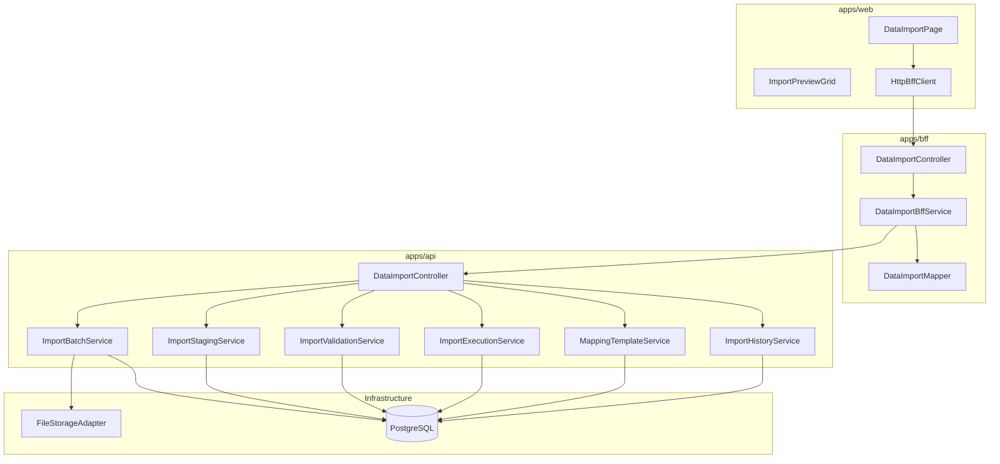
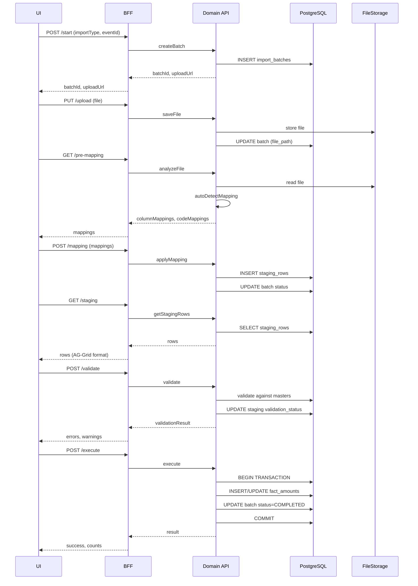
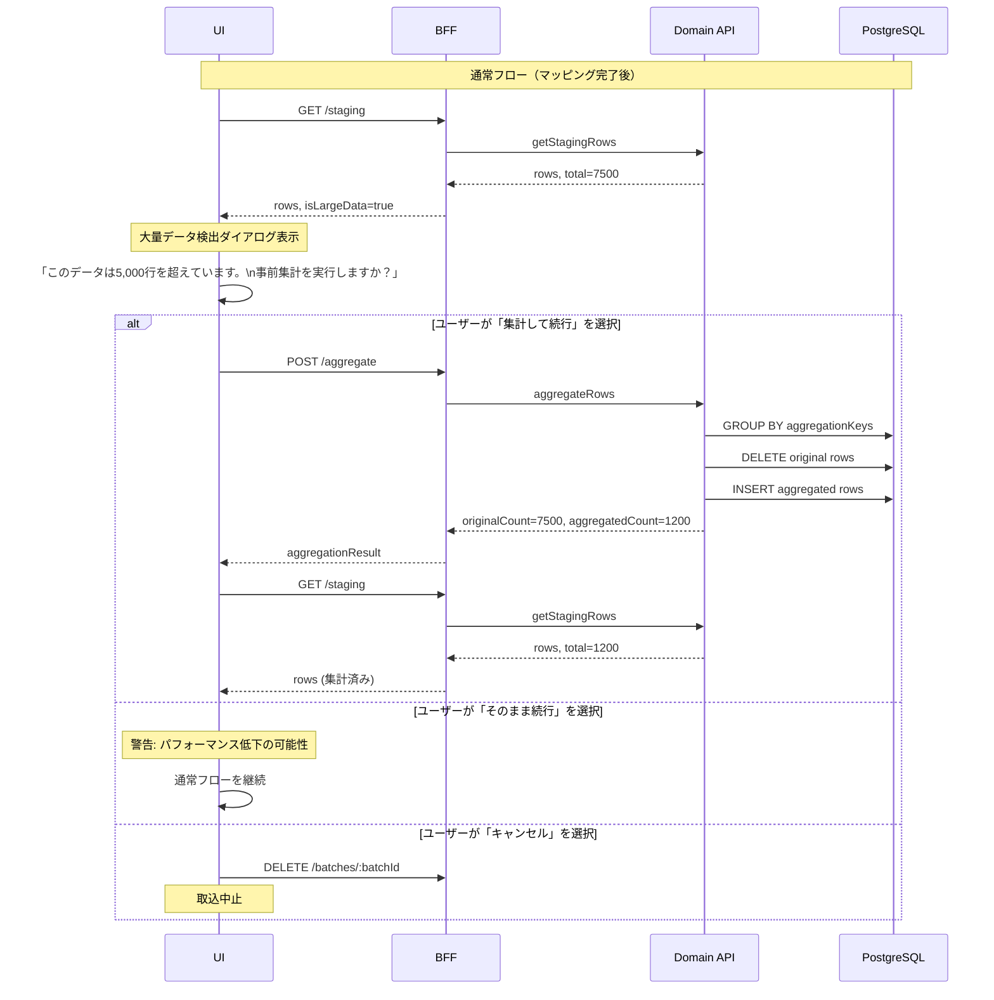

# Design Document: Data Import

---

## Spec Reference（INPUT情報）

### Requirements（直接INPUT）
- **参照ファイル**: `.kiro/specs/transactions/data-import/requirements.md`
- **要件バージョン**: 2026-02-06

### 仕様概要（確定済み仕様）
- **参照ファイル**: `.kiro/specs/仕様概要/データ取込_タグ機能.md`
- **設計に影響する仕様ポイント**:
  - ステージングテーブル分離アーキテクチャ
  - fact_amountsへの反映フロー

### エンティティ定義（Data Model 正本）
- **参照ファイル**: `.kiro/specs/entities/02_トランザクション・残高.md`
- **対象エンティティ**: fact_amounts, fact_dimension_links

### 仕様検討（経緯・背景）
- **参照ファイル**: `.kiro/specs/仕様検討/work/chat1`
- **設計判断に影響した経緯**: QA壁打ちでマッピングテンプレート・AG-Grid・履歴DL等を確定

---

## INPUT整合性チェック

| チェック項目 | 確認結果 |
|-------------|---------|
| requirements.md との整合性 | 設計が全要件をカバーしている: ✅ |
| 仕様概要との整合性 | 設計が仕様概要と矛盾しない: ✅ |
| エンティティとの整合性 | Data Model がエンティティ定義に準拠: ✅ |
| 仕様検討の背景理解 | 設計判断の背景を確認した: ✅ |

---

## Overview

データ取込機能は、外部システム（ERP等）からEPMへ金額データを取り込むバイパス機能である。本設計は、UI Phase 1（MockBffClient）が完成済みの状態から、バックエンド（Domain API、BFF、DB）を実装するExtension設計である。

主要な設計方針:
1. **バッチ処理パターン**: import_batchesでステート管理し、大量データの段階的処理を実現
2. **マッピングテンプレート**: カンパニー単位で保存・再利用可能
3. **AG-Grid統合**: 既存の共有AG-Gridラッパーを活用
4. **ファイルストレージ抽象化**: FileStorageAdapterで将来的なS3移行に対応

---

## Architecture

### Architecture Pattern & Boundary Map

**Pattern (fixed)**:
- UI（apps/web） → BFF（apps/bff） → Domain API（apps/api） → DB（PostgreSQL + RLS）
- UI直APIは禁止

**Contracts (SSoT)**:
- UI ↔ BFF: `packages/contracts/src/bff/data-import` （既存・585行）
- BFF ↔ Domain API: `packages/contracts/src/api/data-import` （新規作成）
- Enum/Error: `packages/contracts/src/shared/enums/data-import`, `packages/contracts/src/shared/errors/data-import`
- UI は `packages/contracts/src/api` を参照してはならない



---

## Architecture Responsibilities（Mandatory）

### BFF Specification（apps/bff）

**Purpose**
- UI要件に最適化したAPI（BffClient interface準拠）
- Domain APIのレスポンスを集約・変換（ビジネスルールの正本は持たない）

**BFF Endpoints（UIが叩く）**

| Method | Endpoint | Purpose | Request DTO | Response DTO | Req ID |
|--------|----------|---------|-------------|--------------|--------|
| POST | `/api/bff/data-import/start` | 取込開始（ファイル） | BffImportStartRequest | BffImportStartResponse | 1.1-1.6, 2.1-2.6 |
| POST | `/api/bff/data-import/start-paste` | 取込開始（ペースト） | BffImportPasteRequest | BffImportPasteResponse | 2.4 |
| PUT | `/api/bff/data-import/upload/:uploadUrl` | ファイルアップロード | multipart/form-data | void | 2.1-2.3 |
| GET | `/api/bff/data-import/batches/:batchId/pre-mapping` | 事前マッピング取得 | BffImportPreMappingRequest | BffImportPreMappingResponse | 3.1-3.2 |
| POST | `/api/bff/data-import/batches/:batchId/mapping` | マッピング適用 | BffApplyMappingRequest | BffApplyMappingResponse | 3.3-3.7 |
| POST | `/api/bff/data-import/batches/:batchId/aggregate` | 集計実行 | BffImportAggregateRequest | BffImportAggregateResponse | 3.1 |
| GET | `/api/bff/data-import/batches/:batchId/staging` | ステージング取得 | BffImportStagingRequest | BffImportStagingResponse | 4.1-4.7 |
| PATCH | `/api/bff/data-import/batches/:batchId/staging` | ステージング更新 | BffUpdateStagingRequest | BffUpdateStagingResponse | 4.2-4.3 |
| POST | `/api/bff/data-import/batches/:batchId/validate` | バリデーション | BffImportValidateRequest | BffImportValidateResponse | 5.1-5.7 |
| GET | `/api/bff/data-import/batches/:batchId/auto-fix` | 自動修正提案取得 | BffGetAutoFixSuggestionsRequest | BffGetAutoFixSuggestionsResponse | 5.1 |
| POST | `/api/bff/data-import/batches/:batchId/auto-fix` | 自動修正適用 | BffApplyAutoFixRequest | BffApplyAutoFixResponse | 5.1 |
| POST | `/api/bff/data-import/batches/:batchId/execute` | 取込実行 | BffImportExecuteRequest | BffImportExecuteResponse | 6.1-6.7 |
| GET | `/api/bff/data-import/batches/:batchId/status` | バッチ状態取得 | BffBatchStatusRequest | BffBatchStatusResponse | - |
| GET | `/api/bff/data-import/history` | 取込履歴 | BffImportHistoryRequest | BffImportHistoryResponse | 7.1-7.6 |
| GET | `/api/bff/data-import/history/:id/download` | 元ファイルDL | - | binary | 7.4-7.5 |
| GET | `/api/bff/data-import/context` | コンテキスト取得 | BffImportContextRequest | BffImportContextResponse | 1.1-1.5 |
| GET | `/api/bff/data-import/mapping-master` | マッピングマスタ | - | BffMappingMasterResponse | 3.1 |
| GET | `/api/bff/data-import/templates` | テンプレート一覧 | BffTemplateListRequest | BffTemplateListResponse | 8.1-8.5 |
| POST | `/api/bff/data-import/templates` | テンプレート作成 | BffCreateMappingRuleRequest | BffCreateMappingRuleResponse | 8.2 |
| DELETE | `/api/bff/data-import/templates/:id` | テンプレート削除 | - | BffDeleteMappingRuleResponse | 8.2 |

**Naming Convention（必須）**
- DTO / Contracts: camelCase（例: `batchId`, `importType`）
- DB columns: snake_case（例: `batch_id`, `import_type`）
- `sortBy` は **DTO側キー**を採用する（例: `createdAt`）

**Paging / Sorting Normalization（必須・BFF責務）**
- UI/BFF: page / pageSize（page-based）
- Domain API: offset / limit（DB-friendly）
- Defaults: page=1, pageSize=50
- Clamp: pageSize <= 200
- Whitelist: sortBy = createdAt | importType | eventName
- Normalize: keyword trim、空→undefined
- Transform: offset=(page-1)*pageSize, limit=pageSize

**Error Policy（必須）**
- 採用方針: **Option A: Pass-through**
- 採用理由:
  - Domain APIのエラーを原則そのまま返す
  - DataImportErrorCodeが既に詳細定義済み（25種類）
  - UIは`contracts/bff/errors`に基づいて表示制御を行う

**Authentication / Tenant Context**
- BFFはClerkから`tenant_id`, `user_id`を解決
- Domain APIへ`x-tenant-id`, `x-user-id`, `x-company-id`ヘッダーで伝搬

---

### Service Specification（Domain / apps/api）

Domain APIはビジネスルールの正本。以下のサービスに分割する。

#### ImportBatchService
- **責務**: バッチライフサイクル管理
- **Transaction境界**: バッチ作成・状態遷移
- **Audit points**: バッチ作成、状態変更

```typescript
interface ImportBatchService {
  createBatch(params: CreateBatchParams): Promise<ImportBatch>
  getBatch(tenantId: string, batchId: string): Promise<ImportBatch>
  updateStatus(batchId: string, status: ImportBatchStatus): Promise<void>
  saveUploadedFile(batchId: string, file: Buffer, filename: string): Promise<string>
}
```

#### ImportStagingService
- **責務**: ステージングデータ管理
- **Transaction境界**: ステージング行の一括保存・更新

```typescript
interface ImportStagingService {
  createStagingRows(batchId: string, rows: StagingRowInput[]): Promise<void>
  getStagingRows(batchId: string): Promise<StagingRow[]>
  updateStagingRows(batchId: string, updates: StagingRowUpdate[]): Promise<void>
  aggregateRows(batchId: string): Promise<AggregationResult>
}
```

#### ImportValidationService
- **責務**: バリデーションルール適用
- **Transaction境界**: バリデーション結果の保存

```typescript
interface ImportValidationService {
  validate(batchId: string): Promise<ValidationResult>
  getAutoFixSuggestions(batchId: string): Promise<AutoFixSuggestion[]>
  applyAutoFix(batchId: string, fixes: AutoFix[]): Promise<void>
}
```

#### ImportExecutionService
- **責務**: fact_amountsへの反映
- **Transaction境界**: 全ステージング行の一括反映（アトミック）
- **Audit points**: 取込実行、件数記録

```typescript
interface ImportExecutionService {
  execute(batchId: string, overwrite: boolean): Promise<ExecutionResult>
}
```

#### MappingTemplateService
- **責務**: マッピングテンプレートCRUD
- **Transaction境界**: テンプレート単位

```typescript
interface MappingTemplateService {
  listTemplates(companyId: string): Promise<MappingTemplate[]>
  createTemplate(params: CreateTemplateParams): Promise<MappingTemplate>
  updateTemplate(id: string, params: UpdateTemplateParams): Promise<MappingTemplate>
  deleteTemplate(id: string): Promise<void>
  autoDetectMapping(columns: string[]): Promise<ColumnMapping[]>
}
```

#### ImportHistoryService
- **責務**: 取込履歴管理
- **Transaction境界**: 読み取り専用

```typescript
interface ImportHistoryService {
  listHistory(params: HistoryQueryParams): Promise<PaginatedHistory>
  getHistoryDetail(id: string): Promise<HistoryDetail>
  downloadOriginalFile(id: string): Promise<Buffer>
}
```

---

### Repository Specification（apps/api）

すべてのRepositoryは以下を遵守:
- tenant_id 必須（全メソッド）
- where句二重ガード必須
- set_config 前提（RLS無効化禁止）

**Repositories**:
- `ImportBatchRepository` - import_batches CRUD
- `ImportStagingRowRepository` - import_staging_rows CRUD
- `MappingTemplateRepository` - import_mapping_templates CRUD
- `FactAmountRepository` - fact_amounts への書込み（既存拡張）

---

### Infrastructure Specification: FileStorageAdapter

ファイルストレージの抽象化レイヤー。本番環境でのストレージ選択（S3/MinIO/R2等）を遅延させつつ、開発時はローカルファイルシステムで動作する。

#### インターフェース定義

```typescript
// packages/contracts/src/api/data-import/file-storage.ts

/**
 * ファイルストレージの抽象化インターフェース
 * 実装: LocalFileStorageAdapter (開発), S3FileStorageAdapter (本番)
 */
export interface FileStorageAdapter {
  /**
   * ファイルをストレージにアップロード
   * @param tenantId テナントID（パス構成に使用）
   * @param batchId バッチID（パス構成に使用）
   * @param file ファイルデータ
   * @param filename 元のファイル名
   * @returns 保存先パス（相対パス）
   */
  upload(
    tenantId: string,
    batchId: string,
    file: Buffer,
    filename: string
  ): Promise<FileUploadResult>;

  /**
   * ファイルをダウンロード
   * @param path 保存先パス（upload時の戻り値）
   * @returns ファイルデータとメタ情報
   */
  download(path: string): Promise<FileDownloadResult>;

  /**
   * ファイルを削除
   * @param path 保存先パス
   */
  delete(path: string): Promise<void>;

  /**
   * ファイルの存在確認
   * @param path 保存先パス
   */
  exists(path: string): Promise<boolean>;

  /**
   * 署名付きダウンロードURLを生成（S3等用、ローカルはnull）
   * @param path 保存先パス
   * @param expiresInSeconds 有効期限（秒）
   */
  getSignedUrl(path: string, expiresInSeconds: number): Promise<string | null>;
}

export interface FileUploadResult {
  path: string;           // 保存先パス（例: "tenants/xxx/batches/yyy/original.xlsx"）
  size: number;           // ファイルサイズ（バイト）
  checksum: string;       // MD5チェックサム
  uploadedAt: string;     // アップロード日時（ISO8601）
}

export interface FileDownloadResult {
  data: Buffer;
  filename: string;
  mimeType: string;
  size: number;
}

export interface FileStorageConfig {
  type: 'local' | 's3';
  basePath?: string;        // ローカル時のベースパス
  bucket?: string;          // S3時のバケット名
  region?: string;          // S3時のリージョン
  endpoint?: string;        // S3互換サービス用エンドポイント
}
```

#### パス規約

```
{basePath}/tenants/{tenantId}/batches/{batchId}/original/{filename}
```

例: `./storage/tenants/t-001/batches/b-123/original/budget_2026.xlsx`

#### エラーハンドリング

```typescript
export class FileStorageError extends Error {
  constructor(
    message: string,
    public readonly code: FileStorageErrorCode,
    public readonly path?: string
  ) {
    super(message);
  }
}

export type FileStorageErrorCode =
  | 'FILE_NOT_FOUND'
  | 'UPLOAD_FAILED'
  | 'DOWNLOAD_FAILED'
  | 'DELETE_FAILED'
  | 'INVALID_PATH'
  | 'SIZE_LIMIT_EXCEEDED'
  | 'STORAGE_UNAVAILABLE';
```

#### 実装クラス

```typescript
// apps/api/src/infrastructure/storage/local-file-storage.adapter.ts
@Injectable()
export class LocalFileStorageAdapter implements FileStorageAdapter {
  constructor(private readonly config: FileStorageConfig) {}
  // ... 実装
}

// apps/api/src/infrastructure/storage/s3-file-storage.adapter.ts (将来)
@Injectable()
export class S3FileStorageAdapter implements FileStorageAdapter {
  constructor(private readonly s3Client: S3Client, private readonly config: FileStorageConfig) {}
  // ... 実装
}
```

#### DI設定

```typescript
// apps/api/src/modules/transactions/data-import/data-import.module.ts
{
  provide: 'FILE_STORAGE_ADAPTER',
  useFactory: (configService: ConfigService) => {
    const type = configService.get('FILE_STORAGE_TYPE', 'local');
    if (type === 's3') {
      return new S3FileStorageAdapter(/* ... */);
    }
    return new LocalFileStorageAdapter({
      type: 'local',
      basePath: configService.get('FILE_STORAGE_PATH', './storage'),
    });
  },
  inject: [ConfigService],
}

---

### Contracts Summary（This Feature）

**新規作成**:
- `packages/contracts/src/api/data-import/index.ts` - Domain API契約
- `packages/contracts/src/shared/enums/data-import/index.ts` - 共通Enum（既存bff enumを移動）
- `packages/contracts/src/shared/errors/data-import.ts` - エラーコード（既存bff errorを移動）

**既存活用**:
- `packages/contracts/src/bff/data-import/index.ts` - BFF契約（変更なし）

---

### Domain API Contracts（packages/contracts/src/api/data-import）

BFF↔Domain API間の契約定義。BFFはこれらのDTOを使用してDomain APIを呼び出す。

```typescript
// ============================================
// Batch Management
// ============================================

export interface CreateBatchRequest {
  tenantId: string;
  companyId: string;
  importCategory: ImportCategory; // 'AMOUNT' | 'MASTER'
  importType: ImportType;
  eventId?: string;
  versionId?: string;
  sourceType: ImportSourceType; // 'FILE' | 'PASTE'
  sourceFilename?: string;
  createdBy: string;
}

export interface CreateBatchResponse {
  batchId: string;
  uploadUrl: string; // 署名付きURL or 内部パス
  status: ImportBatchStatus;
}

export interface GetBatchRequest {
  tenantId: string;
  batchId: string;
}

export interface GetBatchResponse {
  batch: ImportBatchDetail;
}

export interface UpdateBatchStatusRequest {
  batchId: string;
  status: ImportBatchStatus;
  totalRows?: number;
  validRows?: number;
  errorRows?: number;
  excludedRows?: number;
}

// ============================================
// File Storage
// ============================================

export interface SaveFileRequest {
  batchId: string;
  file: Buffer;
  filename: string;
  mimeType: string;
}

export interface SaveFileResponse {
  filePath: string;
  fileSize: number;
}

export interface DownloadFileRequest {
  tenantId: string;
  filePath: string;
}

export interface DownloadFileResponse {
  data: Buffer;
  filename: string;
  mimeType: string;
}

// ============================================
// Mapping & Analysis
// ============================================

export interface AnalyzeFileRequest {
  tenantId: string;
  batchId: string;
  companyId: string;
}

export interface AnalyzeFileResponse {
  columns: SourceColumn[];
  detectedMappings: DetectedMapping[];
  suggestedTemplateId?: string;
}

export interface SourceColumn {
  index: number;
  name: string;
  sampleValues: string[];
}

export interface DetectedMapping {
  sourceColumnIndex: number;
  targetField: string;
  confidence: MappingConfidence; // 'EXACT' | 'ALIAS' | 'PATTERN' | 'NONE'
  matchedBy?: string; // マッチ根拠（エイリアス名等）
}

export interface ApplyMappingRequest {
  tenantId: string;
  batchId: string;
  mappings: ColumnMappingInput[];
  saveAsTemplate?: {
    name: string;
    isDefault?: boolean;
  };
}

export interface ColumnMappingInput {
  sourceColumnIndex: number;
  targetField: string;
}

export interface ApplyMappingResponse {
  stagingRowCount: number;
  templateId?: string;
}

// ============================================
// Staging
// ============================================

export interface GetStagingRowsRequest {
  tenantId: string;
  batchId: string;
  offset?: number;
  limit?: number;
  filterStatus?: ValidationStatus;
}

export interface GetStagingRowsResponse {
  rows: StagingRowDto[];
  total: number;
  statusCounts: {
    pending: number;
    valid: number;
    error: number;
    warning: number;
  };
}

export interface StagingRowDto {
  id: string;
  rowIndex: number;
  excluded: boolean;
  cells: Record<string, string | number | null>;
  validationStatus: ValidationStatus;
  validationErrors?: ValidationError[];
}

export interface UpdateStagingRowsRequest {
  tenantId: string;
  batchId: string;
  updates: StagingRowUpdate[];
}

export interface StagingRowUpdate {
  rowId: string;
  excluded?: boolean;
  cells?: Record<string, string | number | null>;
}

export interface UpdateStagingRowsResponse {
  updatedCount: number;
}

// ============================================
// Aggregation (Large Data)
// ============================================

export interface AggregateRowsRequest {
  tenantId: string;
  batchId: string;
  aggregationKeys: string[]; // 集計キー（例: ['account_code', 'department_code']）
}

export interface AggregateRowsResponse {
  originalRowCount: number;
  aggregatedRowCount: number;
  aggregationApplied: boolean;
}

// ============================================
// Validation
// ============================================

export interface ValidateRequest {
  tenantId: string;
  batchId: string;
}

export interface ValidateResponse {
  totalRows: number;
  validRows: number;
  errorRows: number;
  warningRows: number;
  errors: ValidationErrorSummary[];
}

export interface ValidationErrorSummary {
  errorCode: string;
  message: string;
  affectedRows: number;
  sampleRowIndices: number[];
}

export interface ValidationError {
  field: string;
  code: string;
  message: string;
}

// ============================================
// Execution
// ============================================

export interface ExecuteImportRequest {
  tenantId: string;
  batchId: string;
  overwriteExisting: boolean;
  excludeErrorRows: boolean;
  executedBy: string;
}

export interface ExecuteImportResponse {
  success: boolean;
  importedCount: number;
  skippedCount: number;
  overwrittenCount: number;
  errorCount: number;
  executionId: string;
}

// ============================================
// History
// ============================================

export interface ListHistoryRequest {
  tenantId: string;
  companyId?: string;
  importType?: ImportType;
  fromDate?: string;
  toDate?: string;
  offset: number;
  limit: number;
  sortBy?: 'createdAt' | 'importType';
  sortOrder?: 'asc' | 'desc';
}

export interface ListHistoryResponse {
  items: ImportHistoryItem[];
  total: number;
}

export interface ImportHistoryItem {
  id: string;
  batchId: string;
  companyId: string;
  companyName: string;
  importCategory: ImportCategory;
  importType: ImportType;
  eventName?: string;
  versionName?: string;
  sourceFilename?: string;
  totalRows: number;
  importedRows: number;
  excludedRows: number;
  status: ImportBatchStatus;
  createdAt: string;
  createdBy: string;
  createdByName: string;
}

// ============================================
// Templates
// ============================================

export interface ListTemplatesRequest {
  tenantId: string;
  companyId: string;
  importCategory?: ImportCategory;
  importType?: ImportType;
}

export interface ListTemplatesResponse {
  templates: MappingTemplateDto[];
}

export interface MappingTemplateDto {
  id: string;
  name: string;
  importCategory: ImportCategory;
  importType: ImportType;
  sourceSystem?: string;
  columnMappings: ColumnMappingInput[];
  isDefault: boolean;
  createdAt: string;
  updatedAt: string;
}

export interface CreateTemplateRequest {
  tenantId: string;
  companyId: string;
  name: string;
  importCategory: ImportCategory;
  importType: ImportType;
  sourceSystem?: string;
  columnMappings: ColumnMappingInput[];
  isDefault?: boolean;
  createdBy: string;
}

export interface CreateTemplateResponse {
  template: MappingTemplateDto;
}

export interface DeleteTemplateRequest {
  tenantId: string;
  templateId: string;
}

export interface DeleteTemplateResponse {
  deleted: boolean;
}

// ============================================
// Enums (shared)
// ============================================

export type ImportCategory = 'AMOUNT' | 'MASTER';
export type ImportType = 'BUDGET' | 'FORECAST' | 'ACTUAL';
export type ImportSourceType = 'FILE' | 'PASTE';
export type ImportBatchStatus =
  | 'PENDING'
  | 'ANALYZING'
  | 'STAGING'
  | 'VALIDATING'
  | 'READY'
  | 'IMPORTING'
  | 'COMPLETED'
  | 'FAILED'
  | 'CANCELLED';
export type MappingConfidence = 'EXACT' | 'ALIAS' | 'PATTERN' | 'NONE';
export type ValidationStatus = 'PENDING' | 'VALID' | 'ERROR' | 'WARNING';
```

---

## Responsibility Clarification（Mandatory）

### UIの責務
- 表示制御（ステップ遷移、ボタン活性/非活性）
- AG-Gridでのプレビュー・編集
- クリップボードペースト処理
- エラーメッセージ表示
- **ビジネス判断は禁止**

### BFFの責務
- UI入力の正規化（paging / sorting / filtering）
- ファイルアップロードの中継
- Domain API DTO ⇄ BFF DTO の変換
- **ビジネスルールの正本は持たない**

### Domain APIの責務
- ビジネスルールの正本（バリデーション、マッピング、取込実行）
- 権限チェック（epm.import.*）
- 状態遷移の最終判断（ImportBatchStatus）
- 監査ログ記録
- 整合性保証（トランザクション）

---

## Data Model（エンティティ整合性確認必須）

### Entity Reference
- 参照元: `.kiro/specs/entities/02_トランザクション・残高.md` セクション 3.1

### エンティティ整合性チェックリスト

| チェック項目 | 確認結果 |
|-------------|---------|
| カラム網羅性 | エンティティ定義の全カラムがDTO/Prismaに反映されている: ✅ |
| 型の一致 | varchar→String, numeric→Decimal 等の型変換が正確: ✅ |
| 制約の反映 | UNIQUE/CHECK制約がPrisma/アプリ検証に反映: ✅ |
| ビジネスルール | エンティティ補足のルールがServiceに反映: ✅ |
| NULL許可 | NULL/NOT NULLがPrisma?/必須に正しく対応: ✅ |

### Prisma Schema（新規テーブル）

```prisma
// マッピングテンプレート
model ImportMappingTemplate {
  id              String   @id @default(uuid())
  tenantId        String   @map("tenant_id")
  companyId       String   @map("company_id")
  name            String   @db.VarChar(100)
  importCategory  String   @map("import_category") @db.VarChar(20) // AMOUNT | MASTER
  importType      String   @map("import_type") @db.VarChar(20)
  sourceSystem    String?  @map("source_system") @db.VarChar(50)
  columnMappings  Json     @map("column_mappings")
  isDefault       Boolean  @default(false) @map("is_default")
  createdAt       DateTime @default(now()) @map("created_at")
  updatedAt       DateTime @updatedAt @map("updated_at")
  createdBy       String   @map("created_by")
  updatedBy       String   @map("updated_by")

  @@unique([tenantId, companyId, name])
  @@map("import_mapping_templates")
}

// 取込バッチ（既存拡張）
model ImportBatch {
  id                String   @id @default(uuid())
  tenantId          String   @map("tenant_id")
  companyId         String?  @map("company_id") // 追加
  importCategory    String?  @map("import_category") @db.VarChar(20) // 追加
  importType        String   @map("import_type")
  eventId           String?  @map("event_id")
  versionId         String?  @map("version_id")
  sourceType        String   @map("source_type")
  sourceFilename    String?  @map("source_filename")
  originalFilePath  String?  @map("original_file_path") // 追加
  status            String   @default("PENDING")
  totalRows         Int?     @map("total_rows")
  validRows         Int?     @map("valid_rows")
  errorRows         Int?     @map("error_rows")
  excludedRows      Int?     @map("excluded_rows") // 追加
  mappingTemplateId String?  @map("mapping_template_id") // 追加
  createdAt         DateTime @default(now()) @map("created_at")
  updatedAt         DateTime @updatedAt @map("updated_at")
  createdBy         String   @map("created_by")

  stagingRows ImportStagingRow[]

  @@map("import_batches")
}

// ステージング行
model ImportStagingRow {
  id               String   @id @default(uuid())
  tenantId         String   @map("tenant_id")
  batchId          String   @map("batch_id")
  rowIndex         Int      @map("row_index")
  excluded         Boolean  @default(false)
  cells            Json
  validationStatus String   @default("PENDING") @map("validation_status")
  validationErrors Json?    @map("validation_errors")
  createdAt        DateTime @default(now()) @map("created_at")
  updatedAt        DateTime @updatedAt @map("updated_at")

  batch ImportBatch @relation(fields: [batchId], references: [id], onDelete: Cascade)

  @@index([batchId, rowIndex])
  @@map("import_staging_rows")
}
```

### Constraints
- PK: id（UUID）
- UNIQUE: (tenant_id, company_id, name) on import_mapping_templates
- FK: batch_id → import_batches(id) ON DELETE CASCADE

### RLS Policy

```sql
ALTER TABLE import_mapping_templates ENABLE ROW LEVEL SECURITY;
ALTER TABLE import_batches ENABLE ROW LEVEL SECURITY;
ALTER TABLE import_staging_rows ENABLE ROW LEVEL SECURITY;

CREATE POLICY tenant_isolation ON import_mapping_templates
  USING (tenant_id::text = current_setting('app.tenant_id', true));

CREATE POLICY tenant_isolation ON import_batches
  USING (tenant_id::text = current_setting('app.tenant_id', true));

CREATE POLICY tenant_isolation ON import_staging_rows
  USING (tenant_id::text = current_setting('app.tenant_id', true));
```

---

## System Flows

### 取込フロー全体



### 大量データフロー（5,000行超）

5,000行を超えるデータの場合、パフォーマンス確保のため事前集計を必須とする。

#### トリガー条件

```typescript
const LARGE_DATA_THRESHOLD = 5000; // packages/contracts/src/bff/data-import に定義済み

// BFF側での判定
if (stagingRowCount > LARGE_DATA_THRESHOLD) {
  // 事前集計フローへ誘導
}
```

#### UIフロー



#### 集計ロジック

```typescript
// ImportStagingService.aggregateRows()

interface AggregationConfig {
  // 集計キー（グルーピング対象）
  keys: string[];
  // 集計対象カラム（SUM）
  sumColumns: string[];
  // 集計対象カラム（COUNT）
  countColumns?: string[];
}

// デフォルト集計設定（金額データ取込時）
const DEFAULT_AGGREGATION_CONFIG: AggregationConfig = {
  keys: [
    'account_code',
    'department_code',
    'project_code',
    'period_key',
  ],
  sumColumns: [
    'amount',
    'amount_m01', 'amount_m02', 'amount_m03',
    'amount_m04', 'amount_m05', 'amount_m06',
    'amount_m07', 'amount_m08', 'amount_m09',
    'amount_m10', 'amount_m11', 'amount_m12',
  ],
};
```

#### 集計結果の構造

```typescript
export interface AggregationResult {
  originalRowCount: number;      // 元の行数
  aggregatedRowCount: number;    // 集計後の行数
  aggregationApplied: boolean;   // 集計が実行されたか
  aggregationKeys: string[];     // 使用した集計キー
  droppedColumns?: string[];     // 集計で失われたカラム（明細情報等）
}
```

#### UI表示（大量データ検出ダイアログ）

```tsx
// components/LargeDataWarningDialog.tsx

interface Props {
  rowCount: number;
  threshold: number;
  onAggregate: () => void;
  onContinue: () => void;
  onCancel: () => void;
}

// ダイアログ内容:
// - タイトル: 「大量データの検出」
// - 本文: 「取込データが {rowCount} 行あります（閾値: {threshold} 行）。
//          パフォーマンス確保のため、事前集計を推奨します。」
// - 注意: 「集計を実行すると、同一キーの行が合算されます。
//          明細情報（摘要等）は失われます。」
// - ボタン:
//   - [集計して続行]（推奨）→ onAggregate
//   - [そのまま続行] → onContinue（警告表示付き）
//   - [キャンセル] → onCancel
```

---

## Requirements Traceability

| Requirement | Summary | Components | Interfaces | Flows |
|-------------|---------|------------|------------|-------|
| 1.1-1.6 | 取込種別・対象選択 | ImportPage, BffService, BatchService | /start, /context | 取込フロー |
| 2.1-2.6 | ファイルアップロード | ImportDropzone, FileStorageAdapter | /upload | 取込フロー |
| 3.1-3.7 | マッピング設定 | MappingPanel, TemplateService | /pre-mapping, /mapping | 取込フロー |
| 4.1-4.7 | AG-Gridプレビュー | ImportPreviewGrid, StagingService | /staging | 取込フロー |
| 5.1-5.7 | バリデーション | ValidationService | /validate | 取込フロー |
| 6.1-6.7 | 取込実行 | ExecutionService | /execute | 取込フロー |
| 7.1-7.6 | 取込履歴管理 | HistoryPage, HistoryService | /history | - |
| 8.1-8.5 | テンプレート管理 | TemplateDialog, TemplateService | /templates | - |
| 9.1-9.5 | 権限制御 | AuthGuard, Permission decorators | - | - |
| 10.1-10.5 | 自動検出 | MappingTemplateService | autoDetectMapping | 取込フロー |

---

## Technology Stack & Alignment

| Layer | Technology | Version | Role |
|-------|------------|---------|------|
| Frontend Grid | AG-Grid Enterprise | 35.0.0 | プレビュー・編集グリッド |
| Frontend Framework | Next.js | 15.x | App Router |
| BFF | NestJS | - | UI向けAPI |
| Domain API | NestJS | - | ビジネスロジック |
| ORM | Prisma | - | DBアクセス |
| DB | PostgreSQL | - | データ永続化 |
| File Storage | FileStorageAdapter | - | 元ファイル保存（初期: ローカル） |

詳細は `research.md` 参照。

---

## Non-Functional Considerations

### Performance
- 1,000行以下: 5秒以内にプレビュー
- 10,000行以下: 30秒以内に取込完了
- 5,000行超: 事前集計必須（LARGE_DATA_THRESHOLD）

### Security
- すべてのAPIでtenant_idによるRLS
- ファイルアップロード: MIMEタイプ検証、サイズ制限

### Audit
- 取込実行は監査ログに記録
- 除外行の理由も記録
- batch_id でトレース可能

---

## Open Questions / Risks

1. **ファイルストレージ本番環境** — S3/MinIO/R2の選定は本番デプロイ時に決定
2. **バッチクリーンアップ** — 有効期限切れバッチの削除ジョブは別途設計
3. **大量データ性能** — 10,000行超のシナリオは負荷テストで検証

---

## Appendix: UI Component Structure

```
apps/web/src/features/transactions/data-import/
├── page.tsx                    # メインページ（既存）
├── api/
│   ├── BffClient.ts           # インターフェース（既存）
│   ├── MockBffClient.ts       # モック（既存）
│   └── HttpBffClient.ts       # HTTP実装（新規）
├── components/
│   ├── ImportDropzone.tsx     # ファイル入力（既存）
│   ├── StagingSection.tsx     # ステージング（既存→AG-Grid移行）
│   ├── StagingGrid.tsx        # SpreadJS（削除予定）
│   ├── ImportPreviewGrid.tsx  # AG-Grid（新規）
│   ├── MappingPanel.tsx       # マッピング設定（新規）
│   ├── ValidationSummary.tsx  # バリデーション結果（新規）
│   └── HistoryList.tsx        # 履歴一覧（新規）
└── error-messages.ts          # エラーメッセージ（既存）
```
