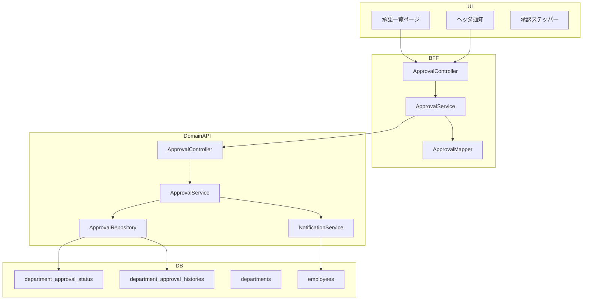
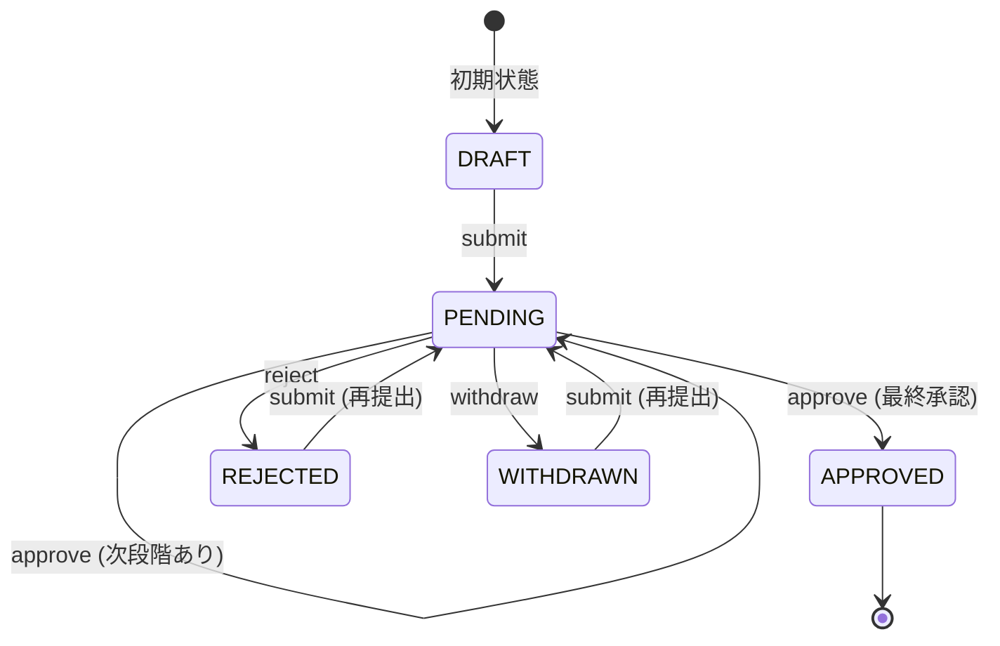
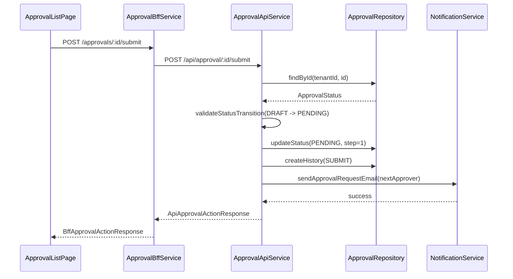
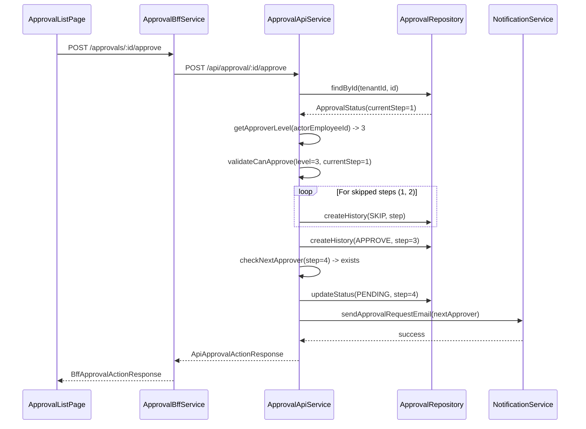

# Design Document: workflow/approval

---

**Purpose**: 承認ワークフロー機能の技術設計。要件（WHAT）をアーキテクチャ設計（HOW）に変換し、実装の一貫性を担保する。

---

## Spec Reference（INPUT情報）

本設計を作成するにあたり、以下の情報を確認した：

### Requirements（直接INPUT）
- **参照ファイル**: `.kiro/specs/workflow/approval/requirements.md`
- **要件バージョン**: 2026-01-15

### 仕様概要（確定済み仕様）
- **参照ファイル**: `.kiro/specs/仕様概要/承認ワークフロー.md`
- **設計に影響する仕様ポイント**:
  - 部門×バージョン単位の承認（最大5段階固定）
  - 垂直代理承認（上位者による下位段階スキップ）
  - Split View + ステッパーUI
  - メール通知（SUBMIT/APPROVE/REJECT/WITHDRAW）

### エンティティ定義（Data Model 正本）
- **参照ファイル**: `.kiro/specs/entities/03_承認ワークフロー.md`, `.kiro/specs/entities/01_各種マスタ.md`
- **対象エンティティ**: department_approval_status, department_approval_histories, plan_events（変更）, departments（変更）

### 仕様検討（経緯・背景）
- **参照ファイル**: `.kiro/specs/仕様検討/20260115_承認ワークフロー機能.md`
- **設計判断に影響した経緯**: EPMはERPではないため「必要十分」に留める方針。一括承認・承認期限・可変ルートはMVP外。

---

## INPUT整合性チェック

| チェック項目 | 確認結果 |
|-------------|---------|
| requirements.md との整合性 | 設計が全要件をカバーしている: ✅ |
| 仕様概要との整合性 | 設計が仕様概要と矛盾しない: ✅ |
| エンティティとの整合性 | Data Model がエンティティ定義に準拠: ✅ |
| 仕様検討の背景理解 | 設計判断の背景を確認した: ✅ |

---

## Overview

承認ワークフロー機能は、EPM SaaSにおける予算・見込の承認プロセスを管理する。部門×バージョン単位で最大5段階の固定承認フローを提供し、申請者・承認者間のコミュニケーションをサポートする。

本設計では、状態遷移ロジックをDomain APIに集約し、BFFはUI最適化（Split View表示用のデータ整形）に徹する。垂直代理承認（上位者スキップ）を含む権限判定は、Domain API ServiceのApprovalServiceが担当する。

メール通知は非同期化を将来対応とし、Phase 1では同期送信でシンプルに実装する。

---

## Architecture

### Architecture Pattern & Boundary Map

**Pattern (fixed)**:
- UI（apps/web） → BFF（apps/bff） → Domain API（apps/api） → DB（PostgreSQL + RLS）
- UI直APIは禁止



**Contracts (SSoT)**:
- UI ↔ BFF: `packages/contracts/src/bff/approval/index.ts`
- BFF ↔ Domain API: `packages/contracts/src/api/approval/index.ts`
- Enum/Error: `packages/contracts/src/shared/enums/approval.ts`, `packages/contracts/src/shared/errors/approval-error.ts`
- UI は `packages/contracts/src/api` を参照してはならない

---

## Architecture Responsibilities（Mandatory）

### BFF Specification（apps/bff）

**Purpose**
- UI要件に最適化したAPI（承認一覧のSplit View表示、通知件数取得）
- Domain APIのレスポンスを集約・変換（ビジネスルールの正本は持たない）

**BFF Endpoints（UIが叩く）**

| Method | Endpoint | Purpose | Request DTO | Response DTO | Notes |
|--------|----------|---------|-------------|--------------|-------|
| GET | /api/bff/workflow/approvals | 承認待ち一覧（自分宛て） | BffApprovalListRequest | BffApprovalListResponse | 1.1, 10.1-10.4 |
| GET | /api/bff/workflow/approvals/:id | 承認詳細 | - | BffApprovalDetailResponse | 10.4, 11.1-11.6, 13.1-13.3 |
| GET | /api/bff/workflow/approvals/count | 承認待ち件数 | - | BffApprovalCountResponse | 12.1-12.5 |
| POST | /api/bff/workflow/approvals/:id/submit | 提出 | BffApprovalActionRequest | BffApprovalActionResponse | 2.1-2.7 |
| POST | /api/bff/workflow/approvals/:id/approve | 承認 | BffApprovalActionRequest | BffApprovalActionResponse | 3.1-3.7, 4.1-4.4 |
| POST | /api/bff/workflow/approvals/:id/reject | 差戻し | BffApprovalActionRequest | BffApprovalActionResponse | 5.1-5.5 |
| POST | /api/bff/workflow/approvals/:id/withdraw | 取下げ | BffApprovalActionRequest | BffApprovalActionResponse | 6.1-6.5 |
| GET | /api/bff/workflow/approvals/history/:statusId | 承認履歴 | - | BffApprovalHistoryResponse | 16.1-16.5 |

**Naming Convention（必須）**
- DTO / Contracts: camelCase（例: `departmentStableId`, `currentStep`）
- DB columns: snake_case（例: `department_stable_id`, `current_step`）
- `sortBy` は **DTO側キー**を採用する（例: `departmentName | submittedAt`）

**Paging / Sorting Normalization（必須・BFF責務）**
- UI/BFF: page / pageSize（page-based）
- Domain API: offset / limit（DB-friendly）
- BFFは必ず以下を実施する：
  - defaults: page=1, pageSize=50, sortBy=submittedAt, sortOrder=desc
  - clamp: pageSize <= 200
  - whitelist: sortBy は許可リストのみ（departmentName, submittedAt, eventName）
  - normalize: keyword trim、空→undefined
  - transform: offset=(page-1)*pageSize, limit=pageSize

**Transformation Rules（api DTO → bff DTO）**
- `department_stable_id` → `departmentStableId`
- `current_step` → `currentStep`
- `submitted_at` → `submittedAt`
- 承認者情報は departments テーブルから取得して埋め込み

**Error Policy（必須）**
- 採用方針：**Option A: Pass-through**
- 採用理由：承認ワークフローのエラーはビジネス判断を含むため、Domain APIのエラーをそのまま返す。UIは `contracts/bff/errors` に基づいて表示制御を行う。

**Authentication / Tenant Context**
- BFFは認証情報から `tenant_id` / `user_id` / `employee_id` を解決
- Domain API呼び出し時に `x-tenant-id`, `x-user-id` ヘッダーで伝搬

---

### Service Specification（Domain / apps/api）

**ApprovalService の責務**:
- 状態遷移の正当性チェック
- 承認権限の判定
- 履歴レコードの作成
- 通知トリガー

**Transaction Boundaries**:

| Operation | Transaction Scope | Audit Point |
|-----------|------------------|-------------|
| submit | status更新 + 履歴作成 | SUBMIT |
| approve | status更新 + step更新 + 履歴作成 | APPROVE / SKIP |
| reject | status更新 + 履歴作成 | REJECT |
| withdraw | status更新 + 履歴作成 | WITHDRAW |

**Audit Points**:
- すべての承認アクションは `department_approval_histories` に記録
- actor_employee_id, acted_at, step, action, comment を保持

---

### Repository Specification（apps/api）

**ApprovalRepository の責務**:
- department_approval_status の CRUD
- department_approval_histories の作成
- 承認待ち一覧の取得（承認者フィルタ）

**tenant_id 必須（全メソッド）**:
```typescript
findPendingByApprover(tenantId: string, employeeId: string, options: QueryOptions): Promise<ApprovalStatus[]>
findById(tenantId: string, id: string): Promise<ApprovalStatus | null>
updateStatus(tenantId: string, id: string, data: UpdateStatusData): Promise<ApprovalStatus>
createHistory(tenantId: string, data: CreateHistoryData): Promise<ApprovalHistory>
```

**where句二重ガード必須**:
```typescript
// 例: findPendingByApprover
return this.prisma.departmentApprovalStatus.findMany({
  where: {
    tenantId,  // 必須フィルタ
    status: 'PENDING',
    // ... 承認者フィルタ
  }
})
```

---

### Contracts Summary（This Feature）

**BFF Contracts** (`packages/contracts/src/bff/approval/index.ts`):
- BffApprovalListRequest / BffApprovalListResponse
- BffApprovalDetailResponse
- BffApprovalCountResponse
- BffApprovalActionRequest / BffApprovalActionResponse
- BffApprovalHistoryResponse
- ApprovalErrorCode

**API Contracts** (`packages/contracts/src/api/approval/index.ts`):
- ApiApprovalListRequest / ApiApprovalListResponse
- ApiApprovalDetailResponse
- ApiApprovalActionRequest / ApiApprovalActionResponse

**Shared Contracts** (`packages/contracts/src/shared/`):
- `enums/approval.ts`: ApprovalStatus, ApprovalAction
- `errors/approval-error.ts`: ApprovalErrorCode

---

## Responsibility Clarification（Mandatory）

### UIの責務
- Split View の表示制御（左ペイン一覧、右ペイン詳細）
- ステッパーの描画（完了/現在/未到達の状態表現）
- ヘッダ通知バッジの表示
- フォーム入力（コメント）の制御
- ボタンの活性/非活性制御（承認可否に応じて）
- **ビジネス判断は禁止**（承認可否の判定はAPIに委譲）

### BFFの責務
- UI入力の正規化（paging / sorting / filtering）
- Domain API DTO ⇄ UI DTO の変換
- 承認者名・部門名の埋め込み（複数APIの集約）
- **ビジネスルールの正本は持たない**

### Domain APIの責務
- ビジネスルールの正本（状態遷移、権限判定）
- 承認可否の最終判断
- 履歴レコードの作成
- 通知トリガーの発火
- 監査ログ・整合性保証

---

## State Machine

### 承認状態遷移図



### 状態遷移ルール

| From | To | Trigger | Conditions |
|------|-----|---------|------------|
| DRAFT | PENDING | submit | status == DRAFT |
| PENDING | PENDING | approve | 次段階の承認者が存在 |
| PENDING | APPROVED | approve | 次段階の承認者が不在（最終承認） |
| PENDING | REJECTED | reject | status == PENDING, 操作者が承認者 |
| PENDING | WITHDRAWN | withdraw | status == PENDING, 操作者が申請者 |
| REJECTED | PENDING | submit | status == REJECTED, 操作者が申請者 |
| WITHDRAWN | PENDING | submit | status == WITHDRAWN, 操作者が申請者 |

---

## Data Model（エンティティ整合性確認必須）

### Entity Reference
- 参照元: `.kiro/specs/entities/03_承認ワークフロー.md`

### エンティティ整合性チェックリスト

| チェック項目 | 確認結果 |
|-------------|---------|
| カラム網羅性 | エンティティ定義の全カラムがDTO/Prismaに反映されている: ✅ |
| 型の一致 | UUID→String, TIMESTAMPTZ→DateTime, INT→Int 等の型変換が正確: ✅ |
| 制約の反映 | UNIQUE/CHECK制約がPrisma/アプリ検証に反映: ✅ |
| ビジネスルール | エンティティ補足のルールがServiceに反映: ✅ |
| NULL許可 | NULL/NOT NULLがPrisma?/必須に正しく対応: ✅ |

### Prisma Schema

```prisma
model DepartmentApprovalStatus {
  id                      String    @id @default(uuid())
  tenantId                String    @map("tenant_id")
  planVersionId           String    @map("plan_version_id")
  departmentStableId      String    @map("department_stable_id")
  currentStep             Int       @default(0) @map("current_step")
  status                  String    @default("DRAFT")
  submittedAt             DateTime? @map("submitted_at")
  submittedByEmployeeId   String?   @map("submitted_by_employee_id")
  finalApprovedAt         DateTime? @map("final_approved_at")
  createdAt               DateTime  @default(now()) @map("created_at")
  updatedAt               DateTime  @updatedAt @map("updated_at")

  histories               DepartmentApprovalHistory[]

  @@unique([tenantId, planVersionId, departmentStableId])
  @@map("department_approval_status")
}

model DepartmentApprovalHistory {
  id                          String   @id @default(uuid())
  tenantId                    String   @map("tenant_id")
  departmentApprovalStatusId  String   @map("department_approval_status_id")
  step                        Int
  action                      String
  actorEmployeeId             String   @map("actor_employee_id")
  actedAt                     DateTime @default(now()) @map("acted_at")
  comment                     String?
  createdAt                   DateTime @default(now()) @map("created_at")

  status                      DepartmentApprovalStatus @relation(fields: [departmentApprovalStatusId], references: [id])

  @@map("department_approval_histories")
}
```

### Constraints
- PK: id（UUID）
- UNIQUE: (tenant_id, plan_version_id, department_stable_id) on department_approval_status
- CHECK: status IN ('DRAFT', 'PENDING', 'APPROVED', 'REJECTED', 'WITHDRAWN')
- CHECK: action IN ('SUBMIT', 'APPROVE', 'REJECT', 'WITHDRAW', 'SKIP')
- CHECK: current_step >= 0 AND current_step <= 5

### RLS Policy

```sql
ALTER TABLE department_approval_status ENABLE ROW LEVEL SECURITY;

CREATE POLICY tenant_isolation ON department_approval_status
  USING (tenant_id::text = current_setting('app.tenant_id', true));

ALTER TABLE department_approval_histories ENABLE ROW LEVEL SECURITY;

CREATE POLICY tenant_isolation ON department_approval_histories
  USING (tenant_id::text = current_setting('app.tenant_id', true));
```

---

## Component Design

### Component Summary

| Component | Domain | Intent | Requirements | Dependencies |
|-----------|--------|--------|--------------|--------------|
| ApprovalListPage | UI | 承認一覧のSplit View表示 | 10.1-10.7, 11.1-11.6 | BFF API, ApprovalStepper |
| ApprovalStepper | UI | 承認進捗の可視化 | 11.1-11.6 | - |
| HeaderNotificationIcon | UI | 承認待ち件数バッジ | 12.1-12.5 | BFF API |
| ApprovalBffController | BFF | UI向けエンドポイント | 全UI要件 | ApprovalBffService |
| ApprovalBffService | BFF | DTO変換・正規化 | - | DomainApiClient |
| ApprovalApiController | API | ドメインエンドポイント | - | ApprovalApiService |
| ApprovalApiService | API | ビジネスロジック | 1-9, 14-16 | ApprovalRepository, NotificationService |
| ApprovalRepository | API | データアクセス | - | Prisma |
| NotificationService | API | メール通知 | 14.1-14.7 | EmailClient |

### Dependencies

| Component | Dependency | Direction | Criticality |
|-----------|------------|-----------|-------------|
| ApprovalApiService | departments | Inbound | P0 |
| ApprovalApiService | employees | Inbound | P0 |
| ApprovalApiService | plan_versions | Inbound | P0 |
| NotificationService | EmailClient | External | P1 |

---

## Interface Contracts

### BFF Contracts

```typescript
// packages/contracts/src/bff/approval/index.ts

// ============================================================================
// Enums
// ============================================================================

export type ApprovalStatus = 'DRAFT' | 'PENDING' | 'APPROVED' | 'REJECTED' | 'WITHDRAWN'

export type ApprovalAction = 'SUBMIT' | 'APPROVE' | 'REJECT' | 'WITHDRAW' | 'SKIP'

// ============================================================================
// Request DTOs
// ============================================================================

export interface BffApprovalListRequest {
  page?: number           // default: 1
  pageSize?: number       // default: 50, max: 200
  sortBy?: 'departmentName' | 'submittedAt' | 'eventName'
  sortOrder?: 'asc' | 'desc'
  keyword?: string        // 部門名・イベント名部分一致
  scenarioType?: 'BUDGET' | 'FORECAST'
}

export interface BffApprovalActionRequest {
  comment?: string        // 任意コメント
}

// ============================================================================
// Response DTOs
// ============================================================================

export interface BffApprovalListResponse {
  items: BffApprovalSummary[]
  page: number
  pageSize: number
  totalCount: number
}

export interface BffApprovalSummary {
  id: string
  departmentStableId: string
  departmentName: string
  planVersionId: string
  planVersionName: string
  eventName: string
  scenarioType: 'BUDGET' | 'FORECAST'
  currentStep: number
  status: ApprovalStatus
  submittedAt: string | null
  submittedByEmployeeName: string | null
}

export interface BffApprovalDetailResponse {
  id: string
  departmentStableId: string
  departmentName: string
  planVersionId: string
  planVersionName: string
  eventName: string
  scenarioType: 'BUDGET' | 'FORECAST'
  currentStep: number
  status: ApprovalStatus
  submittedAt: string | null
  submittedByEmployeeId: string | null
  submittedByEmployeeName: string | null
  finalApprovedAt: string | null
  summary: BffBudgetSummary | null
  approvers: BffApproverStep[]
  canApprove: boolean
  canReject: boolean
  canWithdraw: boolean
  isCurrentUserApprover: boolean
  currentUserStep: number | null
}

export interface BffBudgetSummary {
  revenue: string         // Decimal as string
  cost: string
  operatingProfit: string
}

export interface BffApproverStep {
  step: number
  approverEmployeeId: string | null
  approverEmployeeName: string | null
  deputyEmployeeId: string | null
  deputyEmployeeName: string | null
  isCompleted: boolean
  isCurrent: boolean
  isCurrentUser: boolean
  completedAt: string | null
  completedByEmployeeName: string | null
}

export interface BffApprovalCountResponse {
  count: number
}

export interface BffApprovalActionResponse {
  id: string
  status: ApprovalStatus
  currentStep: number
  message: string
}

export interface BffApprovalHistoryResponse {
  items: BffApprovalHistoryItem[]
}

export interface BffApprovalHistoryItem {
  id: string
  step: number
  action: ApprovalAction
  actorEmployeeId: string
  actorEmployeeName: string
  actedAt: string
  comment: string | null
}

// ============================================================================
// Error Codes
// ============================================================================

export const ApprovalErrorCode = {
  STATUS_NOT_FOUND: 'STATUS_NOT_FOUND',
  INVALID_STATUS_TRANSITION: 'INVALID_STATUS_TRANSITION',
  NOT_AUTHORIZED_TO_APPROVE: 'NOT_AUTHORIZED_TO_APPROVE',
  NOT_AUTHORIZED_TO_REJECT: 'NOT_AUTHORIZED_TO_REJECT',
  NOT_AUTHORIZED_TO_WITHDRAW: 'NOT_AUTHORIZED_TO_WITHDRAW',
  NOT_AUTHORIZED_TO_SUBMIT: 'NOT_AUTHORIZED_TO_SUBMIT',
  LOWER_APPROVER_CANNOT_APPROVE_UPPER: 'LOWER_APPROVER_CANNOT_APPROVE_UPPER',
  APPROVAL_NOT_REQUIRED: 'APPROVAL_NOT_REQUIRED',
  EMPLOYEE_NOT_FOUND: 'EMPLOYEE_NOT_FOUND',
  NOTIFICATION_FAILED: 'NOTIFICATION_FAILED',
} as const

export type ApprovalErrorCode =
  (typeof ApprovalErrorCode)[keyof typeof ApprovalErrorCode]

export interface ApprovalError {
  code: ApprovalErrorCode
  message: string
  details?: Record<string, unknown>
}
```

---

## Requirements Traceability

| Requirement | Summary | Components | Interfaces | Flows |
|-------------|---------|------------|------------|-------|
| 1.1-1.5 | 承認状態管理 | ApprovalRepository, ApprovalApiService | DepartmentApprovalStatus | - |
| 2.1-2.7 | 提出処理 | ApprovalApiService, NotificationService | submit endpoint | submit flow |
| 3.1-3.7 | 承認処理 | ApprovalApiService, NotificationService | approve endpoint | approve flow |
| 4.1-4.4 | 垂直代理承認 | ApprovalApiService | approve endpoint | skip approval flow |
| 5.1-5.5 | 差戻し処理 | ApprovalApiService, NotificationService | reject endpoint | reject flow |
| 6.1-6.5 | 取下げ処理 | ApprovalApiService, NotificationService | withdraw endpoint | withdraw flow |
| 7.1-7.4 | 再提出処理 | ApprovalApiService, NotificationService | submit endpoint | resubmit flow |
| 8.1-8.5 | 承認者設定 | departments変更 | - | - |
| 9.1-9.4 | 承認権限判定 | ApprovalApiService | canApprove logic | - |
| 10.1-10.7 | 承認一覧UI | ApprovalListPage | BffApprovalListResponse | - |
| 11.1-11.6 | ステッパーUI | ApprovalStepper | BffApproverStep | - |
| 12.1-12.5 | ヘッダ通知 | HeaderNotificationIcon | BffApprovalCountResponse | - |
| 13.1-13.3 | 予算データ照会 | ApprovalDetailPanel | summary, link | - |
| 14.1-14.7 | メール通知 | NotificationService | EmailClient | notification flow |
| 15.1-15.5 | CORPORATE/DIVISIONAL | plan_events変更, ApprovalApiService | purpose_type filter | - |
| 16.1-16.5 | 承認履歴 | ApprovalRepository | BffApprovalHistoryResponse | - |

---

## Sequence Diagrams

### 提出フロー（Submit）



### 承認フロー（Approve with Skip）



---

## Error Handling

### Error Mapping (Domain API → BFF)

| Domain Error | HTTP Status | BFF Error Code | UI Message |
|--------------|-------------|----------------|------------|
| StatusNotFound | 404 | STATUS_NOT_FOUND | 指定された承認ステータスが見つかりません |
| InvalidTransition | 409 | INVALID_STATUS_TRANSITION | この操作は現在の状態では実行できません |
| NotAuthorized | 403 | NOT_AUTHORIZED_TO_* | この操作を行う権限がありません |
| LowerApprover | 403 | LOWER_APPROVER_CANNOT_APPROVE_UPPER | 下位承認者は上位段階を承認できません |

---

## Security Considerations

### 認可チェックポイント

| Operation | Check | Location |
|-----------|-------|----------|
| 承認一覧取得 | 自分が承認者の案件のみ | Repository |
| 提出 | 申請者本人のみ | Service |
| 承認 | 現在段階以上の承認者のみ | Service |
| 差戻し | 現在段階以上の承認者のみ | Service |
| 取下げ | 申請者本人のみ | Service |

### RLS適用

- department_approval_status: tenant_id でRLS
- department_approval_histories: tenant_id でRLS

---

## Performance Considerations

### 承認待ち一覧クエリ最適化

```sql
-- インデックス推奨
CREATE INDEX idx_approval_status_pending ON department_approval_status
  (tenant_id, status) WHERE status = 'PENDING';

-- 承認者フィルタ用（部門テーブル結合）
CREATE INDEX idx_departments_approvers ON departments
  (tenant_id, approver_1_employee_id, approver_2_employee_id, ...);
```

### 通知件数のキャッシュ

- ヘッダ通知件数は頻繁にアクセスされるため、短期キャッシュ（30秒）を検討
- Phase 1: キャッシュなし（リアルタイム取得）
- Phase 2: Redis/メモリキャッシュ

---

## Testing Strategy

### Unit Tests

| Component | Test Focus |
|-----------|------------|
| ApprovalApiService | 状態遷移ロジック、権限判定 |
| ApprovalRepository | tenant_id フィルタ、クエリ正確性 |
| ApprovalMapper | DTO変換 |

### Integration Tests

| Flow | Test Scenario |
|------|--------------|
| Submit | DRAFT → PENDING, 履歴作成、通知送信 |
| Approve | PENDING → PENDING/APPROVED, スキップ履歴 |
| Reject | PENDING → REJECTED, 通知送信 |
| Withdraw | PENDING → WITHDRAWN, 通知送信 |

### E2E Tests

| Scenario | Steps |
|----------|-------|
| 正常系: 3段階承認 | 提出 → 承認 → 承認 → 承認 → APPROVED |
| 正常系: 垂直代理承認 | 提出 → 第3承認者が承認 → APPROVED |
| 異常系: 権限なし | 承認者以外が承認 → 403 |

---

## Migration Strategy

### Phase 1: スキーマ追加
1. department_approval_status テーブル作成
2. department_approval_histories テーブル作成
3. plan_events.purpose_type カラム追加
4. departments.approver_* カラム追加
5. RLS ポリシー作成

### Phase 2: 既存データ対応
- 既存のplan_versionsには承認ステータスを「遡及作成しない」
- 新規バージョンでも事前作成しない

### department_approval_status の作成タイミング（確定）

**方針: 初回提出時にLazy作成**

- department_approval_status レコードは、ユーザーが「提出」操作を実行した瞬間に作成する
- plan_version作成時に一括作成は行わない
- メリット: 不要なレコードが生まれない（入力しない部門のレコードが存在しない）
- 「未提出部門の一覧」が必要な場合は、plan_versionsの対象部門一覧から提出済み部門を除外して算出

---

## Design Decisions（レビューで確定）

| 項目 | 決定 | 理由 |
|------|------|------|
| 承認者検索クエリ | 10カラムOR検索 | シンプル優先。パフォーマンス問題発生時にPhase 2で逆引きテーブル追加を検討 |
| ステータスレコード作成 | 初回提出時にLazy作成 | 不要なレコードを作らない |

---

## Open Questions

1. **Q**: 同一人物が複数段階の承認者になれるか？
   - **A**: 可能。上位段階で一括承認として扱う（research.mdに記載）

2. **Q**: 代理承認者不在時の動作は？
   - **A**: 本人承認のみ有効。deputy_employee_id はNULL許容

3. **Q**: department_approval_statusの作成タイミングは？
   - **A**: 初回提出時にLazy作成（Design Reviewで確定）

---

## References

- [research.md](.kiro/specs/workflow/approval/research.md) - 技術調査ログ
- [requirements.md](.kiro/specs/workflow/approval/requirements.md) - 要件定義
- [エンティティ定義](.kiro/specs/entities/03_承認ワークフロー.md) - Data Model
- [仕様概要](.kiro/specs/仕様概要/承認ワークフロー.md) - 仕様サマリ
- [仕様検討](.kiro/specs/仕様検討/20260115_承認ワークフロー機能.md) - 検討経緯
