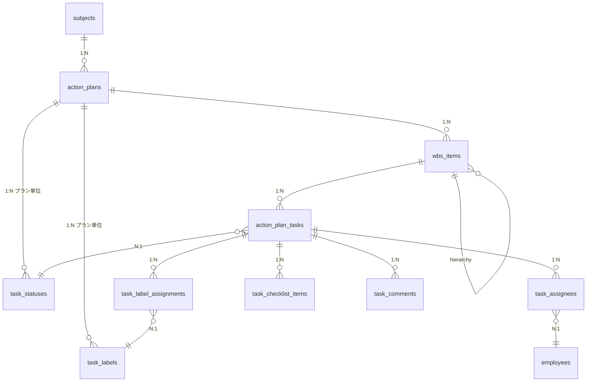
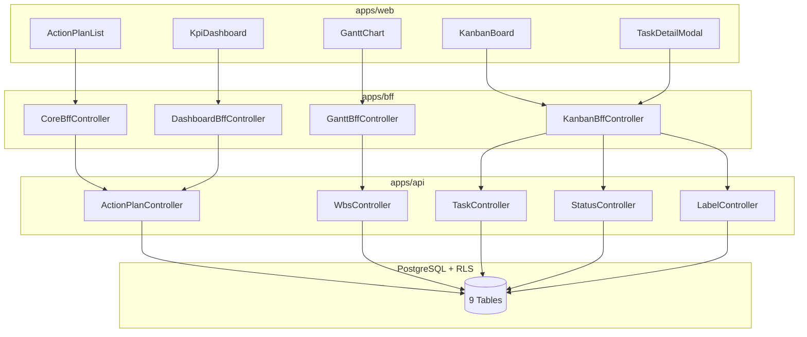

# KPIアクションプラン管理 仕様概要

## 概要

KPI目標達成のための施策・タスク管理機能。KPIに紐づくアクションプランを定義し、ガントチャート（WBS）とカンバンボード（タスク）で進捗管理する。

**競合差別化**：Loglass・DIGGLEともにWBS管理・カンバンボード機能は未対応

---

## 対象エンティティ

エンティティ定義の正本は `.kiro/specs/entities/01_各種マスタ.md` セクション14を参照。

| エンティティ | セクション | 役割 |
|-------------|-----------|------|
| action_plans | 14.1 | アクションプラン（KPI科目に紐付く施策） |
| wbs_items | 14.2 | WBS項目（ガントチャート用、階層構造） |
| action_plan_tasks | 14.3 | タスク（カンバン用） |
| task_statuses | 14.4 | ステータス定義（アクションプラン単位でカスタマイズ） |
| task_labels | 14.5 | ラベル定義（アクションプラン単位、色タグ） |
| task_label_assignments | 14.6 | タスク-ラベル紐付け |
| task_assignees | 14.7 | タスク担当者（複数アサイン） |
| task_checklist_items | 14.8 | チェックリスト項目 |
| task_comments | 14.9 | タスクコメント |
| subjects | 6.1 | KPI科目（subject_type='KPI'） |

---

## データ構造（3階層）

```
subjects (KPI科目)
    │ 1:N
    └── action_plans (アクションプラン)
            ├── task_statuses (ステータス定義) ← プラン単位でカスタマイズ
            ├── task_labels (ラベル定義) ← プラン単位でカスタマイズ
            │ 1:N
            └── wbs_items (WBS項目) ← ガントチャート用
                    │ 1:N
                    └── action_plan_tasks (タスク) ← カンバン用
                            ├── task_label_assignments (ラベル) N:M
                            ├── task_assignees (担当者) 1:N
                            ├── task_checklist_items (チェックリスト) 1:N
                            └── task_comments (コメント) 1:N
```

### ER図



---

## 基本方針

| 項目 | 決定 |
|------|------|
| KPIとアクションプランの関係 | 1:N（1つのKPIに複数のアクションプラン） |
| 階層構造 | 3階層（アクションプラン → WBS → タスク） |
| ステータス・ラベル管理 | **アクションプラン単位**でカスタマイズ可能（Trelloのボード単位ラベルに準拠） |
| カンバンボード | Phase 1 必須（Trello準拠、ステータス/ラベル編集もカンバン画面内で実施） |
| ガントチャート | Phase 1 必須（有償ライブラリ活用） |
| 保存方式 | 即時保存（Trelloスタイル） |
| 同時編集制御 | 楽観的ロック（updated_atベース） |

---

## 画面構成

| 画面 | 用途 | 対象エンティティ | Feature |
|------|------|-----------------|---------|
| アクションプラン一覧 | プラン管理 | action_plans | action-plan-core |
| ガントチャート | WBSスケジュール管理 | wbs_items | action-plan-gantt |
| カンバンボード | タスクステータス管理 | action_plan_tasks, task_statuses, task_labels | action-plan-kanban |
| タスク詳細モーダル | タスク詳細編集 | tasks + 関連 | action-plan-kanban |
| ステータス・ラベル編集（カンバン内） | ステータス列・ラベルのカスタマイズ | task_statuses, task_labels | action-plan-kanban |
| KPI連携ダッシュボード | KPI予実 + 進捗を並べて表示 | subjects + action_plans | action-plan-dashboard |

> **Note**: ステータス・ラベル設定は独立画面ではなく、カンバンボード画面内で直接編集する（Trello方式）。

### 画面遷移

```
┌────────────────────────────────────────────────────┐
│ アクションプラン一覧                                │
├────────────────────────────────────────────────────┤
│ プラン名              │ 担当  │ 期限  │ 操作      │
│ 省エネ設備の導入      │ 総務部│ 9/30  │[ガント][カンバン]│
└────────────────────────────────────────────────────┘
         ↓ [ガント]              ↓ [カンバン]
┌─────────────────────────┐    ┌─────────────────────────┐
│ ガントチャート画面       │    │ カンバンボード画面       │
│ WBS全体を表示           │    │ 全タスク表示             │
│                         │    │ （WBS絞り込み可）        │
│ WBS行ダブルクリック ────┼───→│ 該当WBSで絞り込み        │
└─────────────────────────┘    └─────────────────────────┘
```

---

## 全体アーキテクチャ

### システム構成

```
UI（apps/web） → BFF（apps/bff） → Domain API（apps/api） → DB（PostgreSQL + RLS）
```

- UI直APIは禁止
- UI ↔ BFF: `packages/contracts/src/bff/action-plan-*`
- BFF ↔ Domain API: `packages/contracts/src/api/action-plan-*`
- UIは `packages/contracts/src/api` を参照してはならない

### アーキテクチャ図



> **Note**: ステータス/ラベル管理はKanbanBffを経由してStatusApi/LabelApiを呼び出す（カンバン画面内で編集するため）。

---

## 横断的ルール（全Feature共通）

### 命名規則

| 対象 | ルール | 例 |
|------|--------|-----|
| DTO / Contracts | camelCase | `planCode`, `planName`, `wbsCode` |
| DB columns | snake_case | `plan_code`, `plan_name`, `wbs_code` |
| sortBy パラメータ | DTO側キー | `planCode`, `dueDate` |

### Paging / Sorting（BFF責務）

- UI/BFF: page / pageSize（1-based）
- Domain API: offset / limit（0-based）
- BFF変換: `offset = (page - 1) * pageSize`
- defaults: page=1, pageSize=50
- clamp: pageSize <= 200

### 楽観的ロック

- 全更新操作で `updated_at` を検証
- 競合時は 409 Conflict を返却
- UIはエラー表示後、リロードを促す

### RLS（Row Level Security）

- 全テーブルで RLS 有効
- `tenant_id::text = current_setting('app.tenant_id', true)`
- Repository は tenant_id を必ず受け取る

### Error Policy

- BFF: Pass-through（Domain APIエラーをそのまま返却）
- 最終拒否権限は Domain API が持つ

### 権限

| 権限 | Action | 対象 |
|------|--------|------|
| epm.actionplan.read | read | アクションプラン・WBS・タスク |
| epm.actionplan.create | create | アクションプラン・WBS・タスク |
| epm.actionplan.update | update | アクションプラン・WBS・タスク |
| epm.actionplan.delete | delete | アクションプラン・WBS・タスク |
| epm.actionplan.admin | manage | ステータス・ラベル設定 |

---

## UI操作詳細（Trello準拠）

### カンバンボード操作

| 操作 | 挙動 | 保存 |
|------|------|------|
| タスクカードのドラッグ&ドロップ（列間） | ステータス変更 | 即時 |
| タスクカードのドラッグ&ドロップ（同一列内） | 並び順変更 | 即時 |
| タスクカードクリック | 詳細モーダル表示 | - |
| インライン編集 | タスク名等の簡易編集 | 即時 |

### タスクカード表示要素

```
┌─────────────────────────┐
│ ラベル（色）            │
│ タスク名                │
│ チェックリスト 2/5      │
│ 担当者（複数可）        │
│ 期限                    │
└─────────────────────────┘
```

### ガントチャート操作

| 操作 | 挙動 | 保存 |
|------|------|------|
| バーの左右ドラッグ | 開始日/終了日変更 | 即時 |
| バーの伸縮 | 期間変更 | 即時 |
| 依存線のドラッグ | 先行タスク設定 | 即時 |
| WBS行ダブルクリック | カンバンへドリルダウン | - |

### 進捗率更新

**両方選択可能**（WBS単位で設定）:
- 手動入力: ユーザーが%を直接入力
- 自動計算: 配下タスクの完了率から算出

### フィルタ機能（Phase 1 必須）

**カンバンボード**:
- 担当者
- 期限（今週/今月/期限切れ）
- WBS項目
- ラベル

**ガントチャート**:
- 担当部門
- マイルストーンのみ
- 表示期間（月/四半期/年）

---

## Trello準拠機能

| 機能 | Phase 1 | 備考 |
|------|---------|------|
| カード色ラベル | ○ | task_labels |
| チェックリスト | ○ | task_checklist_items |
| コメント | ○ | task_comments |
| 複数メンバーアサイン | ○ | task_assignees |
| 添付ファイル | × | Phase 2 |
| アクティビティログ | × | Phase 2 |

---

## ライブラリ方針

| 機能 | ライブラリ候補 | 備考 |
|------|--------------|------|
| ガントチャート | dhtmlxGantt / Bryntum Gantt / Syncfusion | 有償ライブラリ活用、導入時に選定 |
| カンバンボード | @dnd-kit/core | OSS |

---

## Feature分割

本機能は以下の**4つのFeature**に分割して実装する。

| Feature | 説明 | 主な要件 |
|---------|------|---------|
| `kpi/action-plan-core` | アクションプラン管理（CRUD） | プラン一覧・作成・編集・削除、初期ステータス/ラベル自動生成 |
| `kpi/action-plan-gantt` | ガントチャート（WBS管理） | WBS階層・スケジュール・進捗率 |
| `kpi/action-plan-kanban` | カンバンボード（タスク管理） | タスクD&D・チェックリスト・コメント・フィルタ、**ステータス/ラベル編集** |
| `kpi/action-plan-dashboard` | KPI連携ダッシュボード | KPI予実+進捗表示 |

> **変更**: `action-plan-settings` Featureは廃止。ステータス・ラベル管理は `action-plan-kanban` に統合（Trelloのボード単位管理に準拠）。

### Feature間の依存関係

```
action-plan-core（基盤、初期ステータス/ラベル生成）
    ↓
action-plan-gantt（WBS）←── action-plan-kanban（タスク + ステータス/ラベル管理）
    ↓
action-plan-dashboard（集約表示）
```

### 推奨実装順序

1. **action-plan-core** - アクションプラン管理（プラン作成時に初期ステータス/ラベル自動生成）
2. **action-plan-kanban** - カンバンボード（タスク管理 + ステータス/ラベル編集）
3. **action-plan-gantt** - ガントチャート（ライブラリ選定含む）
4. **action-plan-dashboard** - 集約表示

---

## 検討経緯

- `.kiro/specs/仕様検討/20260109_KPIアクションプラン管理.md` - 設計方針の決定

---

## Out of Scope（Phase 1対象外）

| 項目 | 理由 |
|------|------|
| アラート・通知機能 | 期限超過通知等はPhase 2 |
| 添付ファイル | ストレージ設計が必要 |
| アクティビティログ | 操作履歴の保存・表示はPhase 2 |
| リアルタイム同期 | WebSocket実装はPhase 2 |
| KPI実績の自動集計 | KPI機能との深い連携はPhase 2 |

---

## 変更履歴

| 日付 | 変更内容 | 担当 |
|------|---------|------|
| 2026-01-09 | 初版作成（ドラフト） | Claude Code |
| 2026-01-09 | UI操作詳細追加、Trello準拠機能追加、エンティティ追加（14.5〜14.9） | Claude Code |
| 2026-01-09 | 全体設計統合（アーキテクチャ、横断ルール、Feature分割）| Claude Code |
| 2026-01-09 | **ステータス・ラベル管理をアクションプラン単位に変更**（Trelloボード単位に準拠）。settings Feature廃止、kanbanに統合 | Claude Code |
