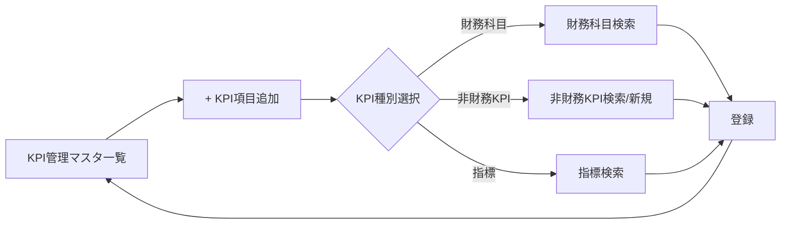
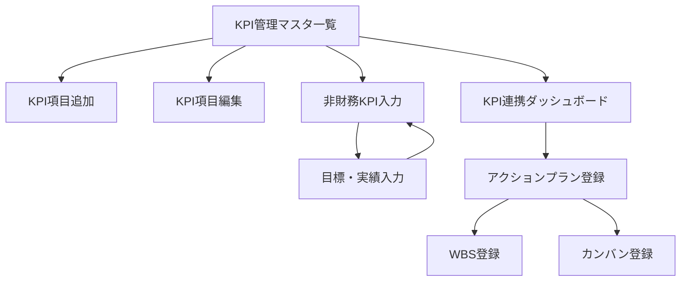
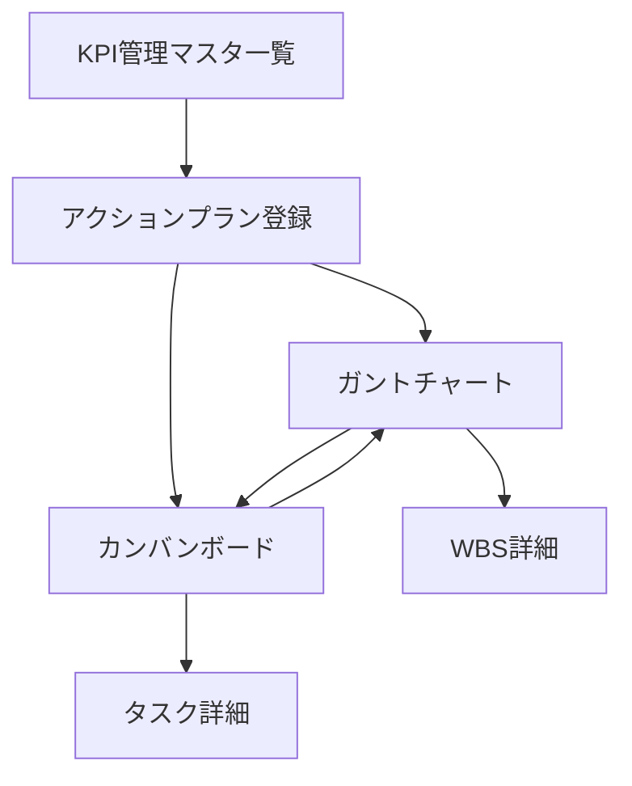

# KPI管理機能 UI設計変更サマリ（2026-01-22）

## 概要

2026-01-22の検討メモに基づき、KPI管理機能のUI設計変更を視覚的に整理。

---

## 変更サマリ

| # | 画面 | 変更種別 | 変更内容 | 理由 |
|---|------|---------|---------|------|
| 1 | KPI管理マスタ登録 | NEW | 新規画面追加 | 年度単位のKPI項目登録 |
| 2 | 非財務KPI入力 | NEW | 新規画面追加 | シンプルな目標・実績入力 |
| 3 | アクションプラン登録 | MODIFY | KPI選択肢を拡張 | 財務/非財務/指標から選択 |
| 4 | KPI連携ダッシュボード | MODIFY | KPI種別に応じた表示変更 | 財務/非財務/指標で表示内容を切替 |
| 5 | KPI目標入力（旧） | DEPRECATE | 廃止 | 非財務KPI入力画面に統合 |

---

## 1. KPI管理マスタ登録画面（新規）

### 1.1 一覧画面

#### 画面レイアウト

```
┌─────────────────────────────────────────────────────────────────────┐
│ KPI管理マスタ                                                        │
├─────────────────────────────────────────────────────────────────────┤
│ [年度選択] 2026 ▼   [ステータス] DRAFT ▼                            │
│                                                     [+ KPI項目追加]  │
├─────────────────────────────────────────────────────────────────────┤
│                                                                     │
│ KPI項目一覧（2026年度）                                              │
│ ┌──────┬─────────────┬──────────────┬─────────┬───────┬─────┐    │
│ │コード│ KPI名       │ 種別         │ 参照元  │ 責任者│操作 │    │
│ ├──────┼─────────────┼──────────────┼─────────┼───────┼─────┤    │
│ │KPI001│ 売上高      │ 財務科目     │ 4010    │営業部 │[編集]│    │
│ │KPI002│ CO2削減率   │ 非財務KPI    │ -       │総務部 │[編集]│    │
│ │KPI003│ 営業利益率  │ 指標         │ OP_RATE │経営企画│[編集]│   │
│ │KPI004│ 新規顧客獲得│ 非財務KPI    │ -       │営業部 │[編集]│    │
│ │KPI005│ 従業員満足度│ 非財務KPI    │ -       │人事部 │[編集]│    │
│ └──────┴─────────────┴──────────────┴─────────┴───────┴─────┘    │
│                                                                     │
│ 全5件                                           [確定] [キャンセル]  │
└─────────────────────────────────────────────────────────────────────┘
```

#### 操作フロー



---

### 1.2 KPI項目追加モーダル

#### 財務科目選択時

```
┌─────────────────────────────────────────────────────────────────┐
│ KPI項目追加                                                      │
├─────────────────────────────────────────────────────────────────┤
│ KPI種別: ● 財務科目  ○ 非財務KPI  ○ 指標                         │
│                                                                 │
│ ──────────────────────────────────────────────────────────────  │
│                                                                 │
│ 財務科目選択                                                     │
│ 科目コード: [4010           ] [検索]                             │
│ 科目名: 売上高                                                   │
│                                                                 │
│ ※ KPI管理フラグ（kpi_managed=true）の科目のみ選択可能             │
│                                                                 │
│ ──────────────────────────────────────────────────────────────  │
│                                                                 │
│ 責任部門: [営業部     ▼]   （任意、NULL=全社）                   │
│ 責任者: [山田太郎   ▼]     （任意）                              │
│                                                                 │
│ 表示順: [1    ]                                                 │
│                                                                 │
│                                      [キャンセル] [登録]         │
└─────────────────────────────────────────────────────────────────┘
```

#### 非財務KPI選択時

```
┌─────────────────────────────────────────────────────────────────┐
│ KPI項目追加                                                      │
├─────────────────────────────────────────────────────────────────┤
│ KPI種別: ○ 財務科目  ● 非財務KPI  ○ 指標                         │
│                                                                 │
│ ──────────────────────────────────────────────────────────────  │
│                                                                 │
│ 非財務KPI選択                                                    │
│ KPIコード: [KPI_CO2    ] [検索] [新規作成]                       │
│ KPI名: CO2削減率                                                 │
│ 単位: %                                                         │
│ 集計方法: SUM（合計）                                            │
│                                                                 │
│ ──────────────────────────────────────────────────────────────  │
│                                                                 │
│ 責任部門: [総務部     ▼]   （任意、NULL=全社）                   │
│ 責任者: [佐藤花子   ▼]     （任意）                              │
│                                                                 │
│ 表示順: [2    ]                                                 │
│                                                                 │
│                                      [キャンセル] [登録]         │
└─────────────────────────────────────────────────────────────────┘
```

#### 指標選択時

```
┌─────────────────────────────────────────────────────────────────┐
│ KPI項目追加                                                      │
├─────────────────────────────────────────────────────────────────┤
│ KPI種別: ○ 財務科目  ○ 非財務KPI  ● 指標                         │
│                                                                 │
│ ──────────────────────────────────────────────────────────────  │
│                                                                 │
│ 指標選択                                                         │
│ 指標コード: [OP_RATE    ] [検索]                                 │
│ 指標名: 営業利益率                                               │
│ 計算式: （営業利益 / 売上高）× 100                               │
│                                                                 │
│ ※ KPI管理フラグ（kpi_managed=true）の指標のみ選択可能             │
│ ※ 指標は予実管理なし（構成要素から自動計算）                      │
│                                                                 │
│ ──────────────────────────────────────────────────────────────  │
│                                                                 │
│ 責任部門: [経営企画部 ▼]   （任意、NULL=全社）                   │
│ 責任者: [鈴木一郎   ▼]     （任意）                              │
│                                                                 │
│ 表示順: [3    ]                                                 │
│                                                                 │
│                                      [キャンセル] [登録]         │
└─────────────────────────────────────────────────────────────────┘
```

---

## 2. 非財務KPI入力画面（新規）

### 2.1 入力画面レイアウト

```
┌─────────────────────────────────────────────────────────────────────┐
│ 非財務KPI 目標・実績入力                                             │
├─────────────────────────────────────────────────────────────────────┤
│ [年度] 2026 ▼   [KPI選択] CO2削減率 ▼   [部門] 全社 ▼               │
├─────────────────────────────────────────────────────────────────────┤
│                                                                     │
│ KPI情報                                                             │
│ KPI名: CO2削減率                                                     │
│ 単位: %                                                             │
│ 集計方法: SUM（合計）                                                │
│ 方向性: 値が高いほど良い                                             │
│                                                                     │
│ ──────────────────────────────────────────────────────────────────  │
│                                                                     │
│ 目標・実績入力                                                       │
│ ┌──────────┬─────┬──────┬──────┬────────┬──────────┐             │
│ │ 期間     │ 単位│ 目標 │ 実績 │ 達成率 │ 操作     │             │
│ ├──────────┼─────┼──────┼──────┼────────┼──────────┤             │
│ │ 2026-Q1  │  %  │ 10.0 │  9.5 │  95%   │ [編集]   │             │
│ │ 2026-Q2  │  %  │ 12.0 │  -   │   -    │ [編集]   │             │
│ │ 2026-Q3  │  %  │ 15.0 │  -   │   -    │ [編集]   │             │
│ │ 2026-Q4  │  %  │ 20.0 │  -   │   -    │ [編集]   │             │
│ ├──────────┼─────┼──────┼──────┼────────┼──────────┤             │
│ │ 年計     │  %  │ 57.0 │  9.5 │  17%   │    -     │             │
│ └──────────┴─────┴──────┴──────┴────────┴──────────┘             │
│                                                                     │
│ [+ 期間追加]                                                        │
│                                                                     │
│ ※ 期間コードは自由入力（"2026-Q1", "2026-04", "2026-H1" 等）         │
│                                                                     │
│                                             [保存] [キャンセル]      │
└─────────────────────────────────────────────────────────────────────┘
```

---

### 2.2 期間追加モーダル

```
┌─────────────────────────────────────────────────────────────────┐
│ 期間追加                                                         │
├─────────────────────────────────────────────────────────────────┤
│ 期間コード: [2026-04      ]                                      │
│             ※ 自由入力（"2026-Q1", "2026-04", "2026-H1" 等）     │
│                                                                 │
│ 期間開始日: [2026-04-01   ] （任意）                             │
│ 期間終了日: [2026-04-30   ] （任意）                             │
│                                                                 │
│ 目標値: [        ]                                              │
│ 実績値: [        ]                                              │
│                                                                 │
│ 備考: [                                                   ]     │
│                                                                 │
│                                      [キャンセル] [追加]         │
└─────────────────────────────────────────────────────────────────┘
```

---

### 2.3 データ表示パターン

#### パターン1: 四半期単位

```
期間       単位   目標    実績   達成率
─────────────────────────────────────
2026-Q1     %    10.0    9.5     95%
2026-Q2     %    12.0    -       -
2026-Q3     %    15.0    -       -
2026-Q4     %    20.0    -       -
─────────────────────────────────────
年計        %    57.0    9.5     17%
```

#### パターン2: 月次単位

```
期間       単位   目標    実績   達成率
─────────────────────────────────────
2026-04     件   100     95      95%
2026-05     件   120     110     92%
2026-06     件   130     -       -
...
─────────────────────────────────────
年計        件   1200    205     17%
```

#### パターン3: 混在（柔軟な粒度）

```
期間       単位   目標    実績   達成率
─────────────────────────────────────
2026-Q1     %    10.0    9.5     95%
2026-04     %     3.5    3.2     91%
2026-05     %     4.0    -       -
2026-06     %     4.5    -       -
2026-H1     %    22.0    9.5     43%
─────────────────────────────────────
※ 柔軟な期間設定が可能
```

---

### 2.4 集計方法による年計の表示ルール

| 集計方法 | 年計の表示 | 例 |
|---------|----------|-----|
| SUM | 各期間の合計 | Q1:10 + Q2:12 + Q3:15 + Q4:20 = 57 |
| AVG | 各期間の平均 | (Q1:4.2 + Q2:4.3 + Q3:4.5 + Q4:4.6) / 4 = 4.4 |
| EOP | 最終期間の値 | Q4:26 → 年計:26 |
| MAX/MIN | 非表示（-） | - |

---

## 3. アクションプラン登録画面の変更

### 3.1 従来設計

```
┌─────────────────────────────────────────────────────────────────┐
│ アクションプラン登録                                             │
├─────────────────────────────────────────────────────────────────┤
│ KPI科目選択                                                     │
│ 科目コード: [4010     ] [検索]                                   │
│ 科目名: 売上高                                                   │
│                                                                 │
│ ※ subject_type='KPI' の科目のみ選択可能                          │
│                                                                 │
│ プラン名: [                                          ]          │
│ 責任部門: [                 ▼]                                  │
│ 期間: [2026-04-01] ～ [2026-09-30]                              │
│                                                                 │
│                                      [キャンセル] [登録]         │
└─────────────────────────────────────────────────────────────────┘
```

---

### 3.2 新設計

```
┌─────────────────────────────────────────────────────────────────┐
│ アクションプラン登録                                             │
├─────────────────────────────────────────────────────────────────┤
│ KPI選択                                                         │
│ [年度] 2026 ▼                                                   │
│                                                                 │
│ KPI項目: [                                            ▼]        │
│          ┌───────────────────────────────────────────┐         │
│          │ ● 売上高（財務科目）                      │         │
│          │   └ 予実: 承認済み予算・見込・実績         │         │
│          │ ● CO2削減率（非財務KPI）                  │         │
│          │   └ 予実: 目標・実績（kpi_fact_amounts） │         │
│          │ ● 営業利益率（指標）                      │         │
│          │   └ 予実: 自動計算（予実管理なし）         │         │
│          │ ● 新規顧客獲得数（非財務KPI）              │         │
│          │ ● 従業員満足度（非財務KPI）                │         │
│          └───────────────────────────────────────────┘         │
│                                                                 │
│ 選択中のKPI: CO2削減率（非財務KPI）                              │
│ 目標: 年間57%削減   現在実績: 9.5%（達成率17%）                  │
│                                                                 │
│ ──────────────────────────────────────────────────────────────  │
│                                                                 │
│ プラン名: [CO2削減施策推進                             ]         │
│ 責任部門: [総務部      ▼]                                       │
│ 責任者: [佐藤花子    ▼]                                         │
│ 開始日: [2026-04-01]  終了日: [2026-09-30]                      │
│ 優先度: ● 高  ○ 中  ○ 低                                        │
│                                                                 │
│ 説明: [                                                   ]     │
│       [                                                   ]     │
│                                                                 │
│                                      [キャンセル] [登録]         │
└─────────────────────────────────────────────────────────────────┘
```

---

### 3.3 KPI選択時の情報表示

#### 財務科目選択時

```
選択中のKPI: 売上高（財務科目）
予算: 1,000百万円   見込: 950百万円   実績: 200百万円（進捗率20%）

※ 承認済み予算・見込・実績を参照（fact_amounts）
```

#### 非財務KPI選択時

```
選択中のKPI: CO2削減率（非財務KPI）
目標: 年間57%削減   現在実績: 9.5%（達成率17%）

※ 目標・実績を参照（kpi_fact_amounts）
```

#### 指標選択時

```
選択中のKPI: 営業利益率（指標）
現在値: 8.5%   目標: 10%以上

※ 構成要素から自動計算（予実管理なし）
```

---

## 4. KPI連携ダッシュボードの変更

### 4.1 従来設計（単一パターン）

```
┌─────────────────────────────────────────────────────────────────┐
│ KPI: 売上高                                                      │
├─────────────────────────────────────────────────────────────────┤
│ 【目標・実績】                                                  │
│ ┌─────────────────────────────────────────────────────────────┐ │
│ │ 目標: 1000百万円   実績: 200百万円   達成率: 20%            │ │
│ │                                                             │ │
│ │ [推移グラフ]                                                │ │
│ │ 1200 ●───●                                                  │ │
│ │ 1000 ─────────────────────────────────── 目標               │ │
│ │  800     ●───●                                              │ │
│ │      4月  5月  6月  7月                                      │ │
│ └─────────────────────────────────────────────────────────────┘ │
├─────────────────────────────────────────────────────────────────┤
│ 【アクションプラン】                                            │
│ ┌───────────────────┬─────────┬─────────┬───────────┐         │
│ │ プラン名          │ 担当    │ 期限    │ 進捗      │         │
│ ├───────────────────┼─────────┼─────────┼───────────┤         │
│ │ 新規顧客開拓強化  │ 営業部  │ 9/30    │ ██░░ 40%  │         │
│ │ 既存顧客深耕      │ 営業部  │ 12/31   │ █░░░ 20%  │         │
│ └───────────────────┴─────────┴─────────┴───────────┘         │
│                                    [+ アクションプラン追加]     │
└─────────────────────────────────────────────────────────────────┘
```

---

### 4.2 新設計（KPI種別ごとに表示変更）

#### パターン1: 財務科目のKPI

```
┌─────────────────────────────────────────────────────────────────┐
│ KPI: 売上高（財務科目）                                          │
├─────────────────────────────────────────────────────────────────┤
│ 【予算・実績】（承認済み予算を使用）                             │
│ ┌─────────────────────────────────────────────────────────────┐ │
│ │ 予算: 1000百万円   見込: 950百万円   実績: 200百万円         │ │
│ │ 進捗率: 20%   達成見込: 95%                                  │ │
│ │                                                             │ │
│ │ [推移グラフ]                                                │ │
│ │ 1200 ─────────────────────────────────── 予算               │ │
│ │ 1000     ●                                                  │ │
│ │  800         ●                                              │ │
│ │  600     ○───○───○   実績                                  │ │
│ │  400 ○───○                                                  │ │
│ │  200 ●───●                                                  │ │
│ │      4月  5月  6月  7月  8月                                 │ │
│ │      ● 予算  ○ 見込  ● 実績                                 │ │
│ └─────────────────────────────────────────────────────────────┘ │
├─────────────────────────────────────────────────────────────────┤
│ 【アクションプラン】                                            │
│ ┌───────────────────┬─────────┬─────────┬───────────┐         │
│ │ プラン名          │ 担当    │ 期限    │ 進捗      │         │
│ ├───────────────────┼─────────┼─────────┼───────────┤         │
│ │ 新規顧客開拓強化  │ 営業部  │ 9/30    │ ██░░ 40%  │         │
│ │ 既存顧客深耕      │ 営業部  │ 12/31   │ █░░░ 20%  │         │
│ └───────────────────┴─────────┴─────────┴───────────┘         │
│                                    [+ アクションプラン追加]     │
└─────────────────────────────────────────────────────────────────┘
```

#### パターン2: 非財務KPIの場合

```
┌─────────────────────────────────────────────────────────────────┐
│ KPI: CO2削減率（非財務KPI）                                      │
├─────────────────────────────────────────────────────────────────┤
│ 【目標・実績】                                                  │
│ ┌─────────────────────────────────────────────────────────────┐ │
│ │ 目標: 年間57%削減   実績: 9.5%   達成率: 17%                 │ │
│ │ 単位: %   集計方法: SUM（合計）                              │ │
│ │                                                             │ │
│ │ [推移グラフ]                                                │ │
│ │  60 ─────────────────────────────────── 目標（年計）        │ │
│ │  50                                                         │ │
│ │  40                                                         │ │
│ │  30                                                         │ │
│ │  20     ●                                                   │ │
│ │  10 ●───●                                                   │ │
│ │   0                                                         │ │
│ │     Q1  Q2  Q3  Q4                                          │ │
│ │     ● 実績  ─ 目標                                          │ │
│ └─────────────────────────────────────────────────────────────┘ │
├─────────────────────────────────────────────────────────────────┤
│ 【アクションプラン】                                            │
│ ┌───────────────────┬─────────┬─────────┬───────────┐         │
│ │ プラン名          │ 担当    │ 期限    │ 進捗      │         │
│ ├───────────────────┼─────────┼─────────┼───────────┤         │
│ │ 省エネ設備の導入  │ 総務部  │ 9/30    │ ██░░ 40%  │         │
│ │ 社用車EV化推進    │ 管理部  │ 12/31   │ █░░░ 20%  │         │
│ └───────────────────┴─────────┴─────────┴───────────┘         │
│                                    [+ アクションプラン追加]     │
└─────────────────────────────────────────────────────────────────┘
```

#### パターン3: 指標の場合

```
┌─────────────────────────────────────────────────────────────────┐
│ KPI: 営業利益率（指標）                                          │
├─────────────────────────────────────────────────────────────────┤
│ 【計算結果】（予実管理なし）                                     │
│ ┌─────────────────────────────────────────────────────────────┐ │
│ │ 現在値: 8.5%   目標: 10%以上                                 │ │
│ │ 計算式: （営業利益 / 売上高）× 100                           │ │
│ │                                                             │ │
│ │ 構成要素:                                                   │ │
│ │ - 営業利益: 85百万円（実績）                                │ │
│ │ - 売上高: 1,000百万円（実績）                               │ │
│ │                                                             │ │
│ │ [推移グラフ]                                                │ │
│ │  12 ─────────────────────────────────── 目標（10%）         │ │
│ │  10                                                         │ │
│ │   8 ●───●───●                                               │ │
│ │   6                                                         │ │
│ │   4                                                         │ │
│ │     4月  5月  6月  7月                                       │ │
│ │     ● 実績値（自動計算）                                    │ │
│ └─────────────────────────────────────────────────────────────┘ │
├─────────────────────────────────────────────────────────────────┤
│ 【アクションプラン】                                            │
│ ┌───────────────────┬─────────┬─────────┬───────────┐         │
│ │ プラン名          │ 担当    │ 期限    │ 進捗      │         │
│ ├───────────────────┼─────────┼─────────┼───────────┤         │
│ │ コスト削減施策    │ 経営企画│ 9/30    │ ███░ 60%  │         │
│ │ 営業効率化        │ 営業部  │ 12/31   │ ██░░ 40%  │         │
│ └───────────────────┴─────────┴─────────┴───────────┘         │
│                                    [+ アクションプラン追加]     │
└─────────────────────────────────────────────────────────────────┘
```

---

## 5. 画面遷移フロー

### 5.1 KPI管理マスタからの遷移



---

### 5.2 アクションプラン登録からの遷移



---

## 6. レスポンシブ対応

### 6.1 デスクトップ表示（推奨）

- 一覧表示: テーブル形式（上記サンプル通り）
- グラフ: 横長の時系列グラフ
- モーダル: 中央表示（幅600px～800px）

### 6.2 タブレット表示

- 一覧表示: テーブル形式（横スクロール可）
- グラフ: 縦長に調整
- モーダル: 画面幅に応じて伸縮

### 6.3 モバイル表示

- 一覧表示: カード形式に切替
- グラフ: 縦長、タップで拡大表示
- モーダル: フルスクリーン表示

---

## 7. 操作権限

### 7.1 権限マトリクス

| 権限 | KPI管理マスタ | 非財務KPI入力 | アクションプラン | 備考 |
|------|-------------|-------------|----------------|------|
| epm.kpi.admin | 全権限 | 全権限 | 全権限 | KPI管理者 |
| epm.kpi.write | 参照のみ | 編集可 | 編集可 | KPI入力者 |
| epm.kpi.read | 参照のみ | 参照のみ | 参照のみ | 閲覧者 |

### 7.2 部門フィルタ

- 責任部門が設定されている場合、所属部門のKPIのみ編集可能
- 全社KPI（責任部門=NULL）は、epm.kpi.admin のみ編集可能

---

## 8. エラーハンドリング

### 8.1 入力バリデーション

| 項目 | エラーメッセージ | 条件 |
|------|----------------|------|
| 期間コード | 「期間コードは必須です」 | 空欄の場合 |
| 目標値 | 「数値を入力してください」 | 数値以外の場合 |
| 期間重複 | 「同じ期間コードが既に登録されています」 | 一意制約違反 |
| KPI参照 | 「KPI管理フラグがtrueの科目のみ選択可能です」 | kpi_managed=false の科目選択時 |

---

### 8.2 システムエラー

| エラー種別 | エラーメッセージ | 対応 |
|----------|----------------|------|
| 競合エラー | 「他のユーザーが更新しています。画面を再読み込みしてください」 | 楽観的ロック違反 |
| 権限エラー | 「この操作を行う権限がありません」 | 権限不足 |
| ネットワークエラー | 「通信エラーが発生しました。再度お試しください」 | タイムアウト等 |

---

## 9. パフォーマンス考慮

### 9.1 ページング

- 一覧表示: 50件/ページ
- スクロール: 仮想スクロール（大量データ対応）

### 9.2 キャッシュ

- KPI管理マスタ: セッション単位でキャッシュ
- 非財務KPI予実: 日次更新想定のためキャッシュなし

### 9.3 非同期処理

- グラフ描画: 遅延ロード（画面表示後に非同期取得）
- CSV出力: バックグラウンドジョブ

---

## 10. アクセシビリティ

### 10.1 キーボード操作

- Tab: フォーカス移動
- Enter: 選択・決定
- Esc: モーダルクローズ

### 10.2 スクリーンリーダー対応

- 各入力項目に aria-label 設定
- エラーメッセージは aria-live で通知

---

## 11. 関連ドキュメント

- [KPIアクションプラン管理_変更案.md](KPIアクションプラン管理_変更案.md) - 仕様変更案の全体像
- [KPI管理_エンティティ変更サマリ.md](KPI管理_エンティティ変更サマリ.md) - エンティティ変更詳細
- `.kiro/specs/仕様検討/20260122_KPIアクションプラン管理機能レビュー・検討` - 検討メモ
